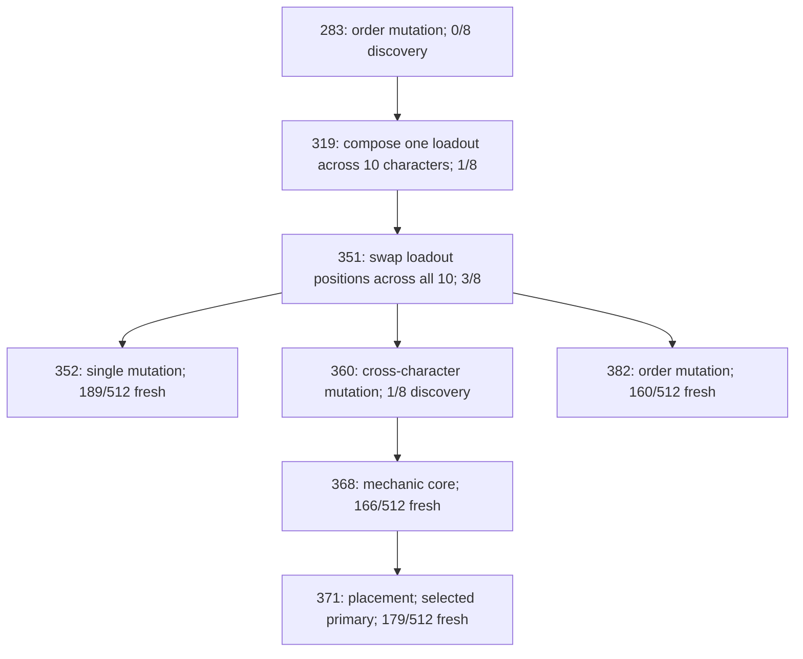

# Allocation trajectory diagnosis: preserve exploration before choosing more depth

Completed **14 September 2026**. Target: saved evidence from the offline BalanceHarness. **Zero new fights, zero new seeds and zero changes to production code or historical archives.** This analysis covers all **nine components, 4,608 evaluated recipes, 4,661 recorded parent edges and 192 screened candidates**, joined to the separate 94-recipe confirmation.

The evidence supports one next experiment: **let both isolated searches reach 256 candidates, then give the better current search the remaining 256 evaluations**, producing a 512+256 allocation within the same 768-candidate budget. Keep deep v13 as comparator and retain the current finalist selection and 2/3 gate. The [complete proposal](Tower-Late-Allocation-Proposal.md) defines the allocation, new-policy boundaries, fixed resource cap, tests and success criteria. It has not been implemented, prepared or executed.

## What distinguished the successful component

The four newly confirmed viable recipes all came from **isolated B, root 1816290420**. They appeared late: **352, 368, 371 and 382** of 384 evaluated candidates. This component's best remaining guardian health after its initial 96 fresh parties was **77.90%**, the weakest initial result among all nine components. Its isolated partner was initially much stronger at **59.27%**, yet recorded no discovery wins through 384 candidates.

The successful component first outranked that partner at candidate **243**, when a `mechanic-core` change to candidate 227 produced a substantial reduction in remaining guardian health. It still had zero discovery wins at that point. Its first discovery win came at **271**. These are observations on the same eight discovery seeds, not fresh success probabilities or a universal causal explanation.

| Root / component | Evaluations | Initial fresh parties | Best initial guardian health | First discovery-positive candidate | Discovery-positive candidates | Best discovery wins / 8 |
| --- | ---: | ---: | ---: | ---: | ---: | ---: |
| 1614029318 / deep | 768 | 192 | 69.57% | 531 | 22 | 1 |
| 1614029318 / isolated A | 384 | 96 | 74.46% | — | 0 | 0 |
| 1614029318 / isolated B | 384 | 96 | 75.35% | — | 0 | 0 |
| 1816290420 / deep | 768 | 192 | 74.45% | 530 | 15 | 2 |
| 1816290420 / isolated A | 384 | 96 | 59.27% | — | 0 | 0 |
| **1816290420 / isolated B** | **384** | **96** | **77.90%** | **271** | **17** | **4** |
| 233022769 / deep | 768 | 192 | 71.24% | 238 | 49 | 2 |
| 233022769 / isolated A | 384 | 96 | 74.84% | — | 0 | 0 |
| 233022769 / isolated B | 384 | 96 | 61.71% | — | 0 | 0 |

Initial phases have different lengths for deep and isolated components; the [machine-readable checkpoints](../TestResults/balance/tower-allocation-trajectory-diagnosis-20260914/results.json) also provide common candidate counts and budget fractions. Remaining health belongs to the current lexicographically best party, so it can rise when a party wins more trials and takes precedence. Discovery-positive rows are highly related adaptive measurements and must not be counted as independent successful restarts.

Five components recorded no discovery wins, while all three deep components eventually found some. Nevertheless their screened primaries later confirmed at **6, 41 and 0/512**, whereas the successful isolated primary confirmed at **179/512**. Early discovery wins, initial damage and sheer depth therefore do not by themselves establish reliable generalization. Most generated recipes never received held-out confirmation; the data cannot rule out missed viable recipes elsewhere.

## Recorded ancestry and exact changes

All four confirmed recipes share recorded ancestor **351**. A useful late portion of their ancestry is:

Edges are recorded parent references. They describe the generated recipes' history, not independent causal estimates. Discovery and fresh confirmation outcomes are deliberately labeled separately.

| Candidate | Change | Relevant saved evidence |
| ---: | --- | --- |
| 243 | Mechanic core applied to 227 | 40 ordered positions changed; guardian health 63.25% → 41.41%; both 0/8 |
| 250–283 | Placement, repeated-loadout ordering and character placement | Recorded path 243 → 250 → 251 → 264 → 283; guardian health at 283 was 31.07% |
| 319 | Compose | A single module from candidate 283, then rank 4, copied to all ten characters; 34 positions changed relative to 283; 1/8 |
| 351 | Refine repeated loadout | Swapped positions 1 and 5 across all ten characters; **exactly the same inventory** as 319, with 20 ordered positions changed; 3/8 |
| 352 | Single mutation from 351 | One ordered position changed; 4/8 discovery, 19/64 screen, 189/512 fresh |
| 368 | Mechanic core from 360 | Parent 360 was rank 6 at selection; this was an exploration-parent path under the existing top-four-elite selector; 2/8 discovery |
| 371 | Placement from 368 | Two positions changed, preserving the inventory; 1/8 discovery, 27/64 screen, 179/512 fresh |
| 382 | Order mutation from 351 | Two ordered positions changed on one character; 3/8 discovery, 16/64 screen, 160/512 fresh |

Candidate 319's repeated loadout was Pack Howler, Spider Queen Royal Venom, Poisonous Rat, Ravenous Ghoul, Enchanted Fairy. Candidate 351 put Enchanted Fairy first and Pack Howler fifth on every character. The exact builds and changes are retained in [successful ancestry](../TestResults/balance/tower-allocation-trajectory-diagnosis-20260914/successful-ancestry.json). These names explain the observed edits; they must not become ingredient rules, seed recipes or privileged modules in independent generation.

The source audit reverified every recorded ranked-library hash and donor use. The useful module was available under the existing library rule, and existing exploration supplied part of the successful branch. This evidence supports retaining those mechanisms for the next test. It does not establish that either mechanism is optimal or quantify its general causal contribution.

## What selection retained

| Candidate | Discovery rank | Discovery / 8 | Screen rank | Screen / 64 | Fresh / 512 | Frozen role |
| ---: | ---: | ---: | ---: | ---: | ---: | --- |
| 352 | 1 | 4 | 3 | 19 | 189 | Original primary |
| 368 | 5 | 2 | 2 | 22 | 166 | Screened secondary |
| 371 | 11 | 1 | 1 | 27 | 179 | Screened primary |
| 382 | 2 | 3 | 6 | 16 | 160 | Original secondary |

The existing top-32 screen retained **all four known viable recipes**. The final family retained the original and screened nominations, so none was lost from confirmation. The screened primary was not the highest observed fresh winner, but the study did not establish that the 10-win difference from the original primary reflects a selection effect. No nominee is replaced after confirmation.

All 32 screened candidates in this root's isolated group came from B. At root 1614029318 they all came from A; at root 233022769, 30 came from B and two from A. Some component candidates consequently lack any screening evidence. This diagnosis does not establish that the top-32 rule finds every viable recipe; it establishes that it retained the four already confirmed here. There is insufficient evidence to justify adding a different finalist-selection rule alongside the proposed allocation change.

## Why defer the allocation decision

Applying the current fitness ordering to saved prefixes of the successful root gives:

| Evaluations per component | Total spent | Preferred component | A remaining health | B remaining health |
| ---: | ---: | --- | ---: | ---: |
| 96 | 192 | A | 59.27% | 77.90% |
| 128 | 256 | A | 59.27% | 75.82% |
| 192 | 384 | A | 58.38% | 63.12% |
| 224 | 448 | A | 57.71% | 63.12% |
| **256** | **512** | **B** | **52.63%** | **32.70%** |

Both components had zero wins at these listed decision points. The first preference change was **243**, not an initial-population result. A 256 checkpoint protects enough common exploration to retain this observed successful component, while leaving 256 of the unit's 768 evaluations to allocate.

At 256 the source prefixes would choose **A, B, B** across the three roots. The third choice is close: 50.71% versus 50.21% guardian health, both 0/8. These prefix choices are descriptive diagnostics. The archive contains no 512-candidate continuation for any isolated component; it cannot supply counterfactual confirmation results, an estimated adoption rate, or proof that the 512+256 proposal improves on 384+384.

The proposal therefore tests a new hypothesis on fresh roots and trials. It preserves initial construction, RNG streams, operators, per-unit evaluated work, final selection and the deep comparator. It changes only when the isolated components' remaining evaluated budget is assigned. The four observed recipes arriving after 351 also argue against selecting shorter restart lengths merely because one isolated component succeeded; different initial horizons would produce different trajectories.

## Verification, artifacts and limitations

- Verified full inventories of the stopped allocation campaign/work and completed fresh confirmation campaign/work before analysis and again at closure. The source receipt binds all four packages and the earlier sealed manifest chain.
- Reran the existing independent stopped-mechanism verifier: canonical recipes, all component provenance, ranked module libraries, grouped ranks and nominations matched without combat.
- Reconstructed the new analysis a second time and compared every output exactly: **4,608 recipes, 4,661 parent edges, 192 screen rows and four confirmed target recipes**.
- Independently checked the source builds for the repeated-loadout composition, the ten-character same-inventory order change, the four complete confirmed builds, prefix-choice facts and proposed fight arithmetic.
- Checked current Markdown links, producing source hashes, unchanged seed ledgers and the final package manifest. The [closure receipt](../TestResults/balance/tower-allocation-trajectory-diagnosis-20260914/final-verification.json) records the checks and documentation snapshot.

Reproducible scripts, [all candidate features](../TestResults/balance/tower-allocation-trajectory-diagnosis-20260914/all-candidate-features.json), [complete screen ranking](../TestResults/balance/tower-allocation-trajectory-diagnosis-20260914/screen-ranking.json), [findings check](../TestResults/balance/tower-allocation-trajectory-diagnosis-20260914/findings-check.json), and [source receipt](../TestResults/balance/tower-allocation-trajectory-diagnosis-20260914/source-receipt.json) are retained in the new analysis package.

Backend builds/tests were not rerun: no production or test source changed, and this task analyzes immutable saved data. Artifact reconstruction and independent checks are the relevant verification. An optional Matplotlib availability check failed because that library is absent from the local runtime; the review uses tables and a Mermaid ancestry diagram, with no dependency installation.

Only this review, the new proposal, six active Markdown guides and the new analysis package changed. Kharad remains **Health 3.5366243328 / Power 4.4702934848**; the latest measured result remains **family Pass, reliability Fail 1/3, adoption Hold**. The authoritative ledger remains **479,533 reservations**. No new game-content, configuration, migration, catalog or deployment change occurred. Practical ownership and floors 6–11 remain separate milestones.
