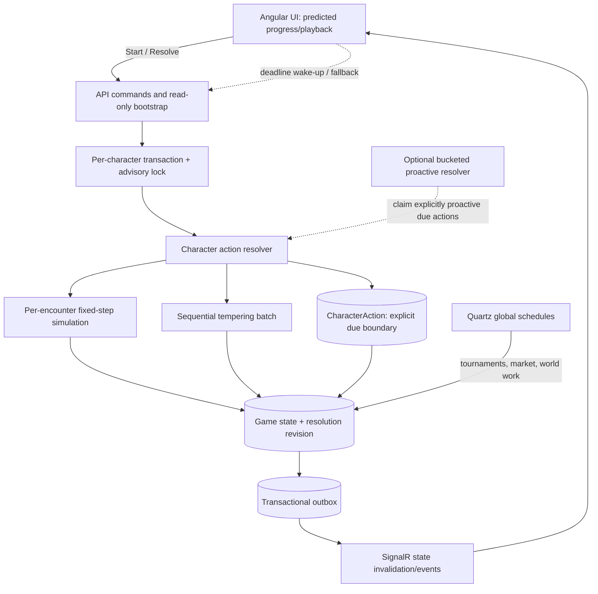

# Action Timing Architecture Analysis

Status: architectural recommendation only; no implementation is included.

## 1. Executive Summary

### Recommendation

Do **not** replace personal combat and tempering with a server-wide gameplay tick.

Use a hybrid model with three deliberately separate clocks:

1. **Personal idle actions:** persisted, server-authoritative, independent due times. Resolve lazily on an authoritative command, with an optional bucketed worker only for actions that need proactive completion or push notifications.
2. **Combat inside one encounter:** the existing deterministic, fixed-step simulation clock, owned by the encounter rather than the whole server. Keep the current 10 ticks/second resolution unless profiling or game-design requirements justify another value.
3. **Shared world schedules:** durable clustered jobs or database-backed due-time workers, as the repository already does for tournaments, marketplace expiration, outbox delivery, and World Tower work.

The current personal-action system is not 10,000 `Timer` objects. It is already close to a persisted due-time design: one `CharacterAction` row per character and resolution triggered by the Angular client. Combat treats `CharacterAction.UpdatedAt` as the next encounter boundary; tempering treats it as the last processed/start boundary. That overload is the most important model problem.

The recommended near-term work is therefore evolutionary, not a scheduler rewrite:

- introduce explicit `NextResolutionAtUtc`/`LastResolvedAtUtc` semantics;
- inject `TimeProvider` and capture one authoritative `now` per operation;
- keep the database and action boundary as the source of truth;
- keep client polling as a wake-up/fallback mechanism, never an authority;
- make resolution seeds and ordering replayable;
- preserve per-character transaction serialization and optimistic concurrency;
- add bounded, resumable catch-up to tempering as well as combat;
- add a database-backed bucketed dispatcher only when a product requirement demands resolution while nobody is reading the action.

### Final answer in one sentence

The right long-term architecture is **independent persisted due times for personal idle actions, deterministic per-encounter simulation ticks for combat, and durable shared schedulers only for genuinely global or proactive work**.

## 2. Current Architecture

### 2.1 The three timing layers already present

The repository currently contains several distinct timing systems:

| System | Scheduling model | Persistence/recovery |
|---|---|---|
| Personal idle combat | Client wakes the API at an independently persisted encounter boundary | `CharacterAction.UpdatedAt`, transaction, row version |
| Tempering queue | Client wakes the API; server derives elapsed 10-second attempts | `CharacterAction.UpdatedAt` plus persisted queue/items |
| Combat mechanics | Entire encounter simulated synchronously on a 100 ms fixed-step clock | Result/rewards persisted after simulation; ticks are encounter-local |
| Game-event delivery | 500 ms bucketed worker claims due deliveries | PostgreSQL outbox with retry timestamps and `SKIP LOCKED` |
| Tournament/market schedules | Quartz clustered recurring jobs | PostgreSQL Quartz store plus idempotency log |
| World Tower combat | Database-claimed simulation work, then due playback dispatch | persisted leases, playback cursor, and artifacts |

This is already a hybrid architecture. A server-wide tick would not unify equivalent things; it would merge systems with different semantics.

### 2.2 Personal action data model

`CharacterAction` has a character primary key, polymorphic `ActionDetails`, `UpdatedAt`, `IsDeleted`, and a concurrency `RowVersion` (`LL/src/Core/Domain/Models/CharacterActions/CharacterAction.cs:7-32`). `CombatSession` and `TemperingSession` are response-only `[NotMapped]` projections, not durable running-session records (`CharacterAction.cs:23-26`).

The action type is inferred from the details subtype, not stored independently (`CharacterAction.cs:11-16`). The EF configuration makes `CharacterId` the key and `RowVersion` a concurrency token (`LL/src/Infrastructure/Persistence/Persistence.LL/Configurations/CharacterActions/CharacterActionConfiguration.cs:12-25`). There is no due-time index on `CharacterActions`; only the character primary key is shown in the model snapshot (`LL/src/Infrastructure/Persistence/Persistence.LL/Migrations/LLDbContextModelSnapshot.cs:544-562`). That is appropriate for point reads but not for a future global due scan.

`UpdatedAt` has incompatible meanings:

- in combat it is the **next encounter due at** boundary (`LL/src/Infrastructure/Service/Services.LL/CharacterActions/CombatService.cs:33-36`);
- in tempering it is the **start/last processed boundary**, and the next attempt is implicitly `UpdatedAt + 10 seconds` (`LL/src/Infrastructure/Service/Services.LL/CharacterActions/CharacterActionService.cs:114-126`);
- after stopping combat it can also act as a temporary action-blocking deadline because a replacement is rejected while the stored value is in the future (`LL/src/Infrastructure/Persistence/Persistence.LL/Repositories/CharacterActions/CharacterActionRepository.cs:31-35`).

The DTO calls `UpdatedAt` itself `NextResolutionAt`, which is accurate for combat but not tempering (`LL/src/Core/Application/UseCases/CharacterActions/Dtos/Responses/CharacterActionDto.cs:19-27`).

### 2.3 Combat lifecycle

```mermaid
sequenceDiagram
    participant UI as Angular client
    participant API as CharacterActionsController
    participant TX as TransactionBehavior
    participant AS as CharacterActionService
    participant OC as Combat orchestration
    participant CE as FastCombatEngine
    participant DB as PostgreSQL
    participant OB as Outbox

    UI->>API: POST StartCombat(areaId)
    API->>TX: StartCombatActionCommand
    TX->>DB: transaction + character advisory lock
    TX->>AS: start action
    AS->>DB: add/replace CharacterAction (due now)
    AS->>OC: resolve first encounter immediately
    OC->>CE: simulate encounter at 10 ticks/second
    CE-->>OC: complete CombatResult
    OC->>DB: apply batched rewards and advance boundary by 10 seconds
    OC->>OB: enqueue durable game events
    TX->>DB: save + commit
    API-->>UI: hydrated action and next boundary
    UI->>UI: render snapshot/countdown
    UI->>API: POST Resolve at/after boundary
    Note over API,DB: server rechecks due time; client time grants no authority
```

The concrete path is:

1. `CharacterActionsController.StartCombat` sends `StartCombatActionCommand` (`LL/src/API/API.LL/Controllers/V1/CharacterActionsController.cs:26-28`).
2. The handler validates area access, creates `CombatActionDetails`, constructs the action, and starts it (`LL/src/Core/Application/UseCases/CharacterActions/Commands/StartCombatAction/StartCombatActionCommand.cs:31-52`). The constructor initially stamps `DateTimeOffset.UtcNow` (`CharacterAction.cs:28-32`).
3. The repository adds the row or replaces existing details; a still-future boundary blocks replacement (`CharacterActionRepository.cs:18-50`).
4. A new combat is immediately due for its first encounter. `CharacterActionService` resolves it before the transaction returns, so the response is never an empty combat shell (`LL/src/Infrastructure/Service/Services.LL/CharacterActions/CharacterActionService.cs:25-40`).
5. `IdleCombatPlanner` computes the number of due encounters from the stored boundary and captured request time. It includes the boundary encounter, advances from the old boundary rather than from completion time, caps a resolution at 100 encounters, and truncates offline credit to 24 hours (`LL/src/Infrastructure/Service/Services.LL/Combat/Layers/Orchestration/Idle/IdleCombatPlanner.cs:25-72`; defaults in `LL/src/API/API.LL/appsettings.json:41-45`).
6. `IdleCombatOrchestrator` creates and resolves each planned encounter sequentially, advancing a cursor by exactly the configured 10-second cadence (`LL/src/Infrastructure/Service/Services.LL/Combat/Layers/Orchestration/Idle/IdleCombatOrchestrator.cs:45-74`). This prevents scheduler drift when requests arrive late.
7. Each encounter is simulated synchronously by `FastCombatEngine`. It uses 10 ticks/second, runs until a team dies or 6,000 ticks elapse, and processes interval events, combatants, active abilities, basic attacks, effects, statuses, conditions, regeneration, barriers, cooldowns, and summons in a defined loop (`LL/src/Infrastructure/Service/Services.LL/Combat/Engine/FastCombatEngine.cs:11-28,106-194`).
8. The engine stamps event-log entries with the encounter tick (`FastCombatEngine.cs:3610-3618`). `CombatEngineExecutor` derives a random seed from the generated encounter ID and assigns the planned wall-clock boundary to `CombatResult.StartedAt` (`LL/src/Infrastructure/Service/Services.LL/Combat/Engine/CombatEngineExecutor.cs:32-46,197-215`).
9. The reward layer bulk-loads/generates where possible, aggregates the whole catch-up batch, applies experience/loot/currency, emits one idle-combat outbox payload for the batch, and returns only the final encounter plus a compact summary (`LL/src/Infrastructure/Service/Services.LL/Combat/Layers/Rewards/Idle/IdleCombatRewardCalculator.cs:44-88`; `IdleCombatOutcomeProcessor.cs:48-61,85-120`; `IdleCombatSessionFactory.cs:11-47`).
10. `CombatService` writes `ProcessedUntil` back to `CharacterAction.UpdatedAt`, where it represents the next due boundary (`CombatService.cs:23-44`).

On later resolution, `CharacterActionService.GetCharacterActionAsync` loads the action, captures server UTC time, runs the appropriate resolver, and increments the action revision only if a boundary actually moved (`CharacterActionService.cs:64-106`). `GET CharacterActions` is intentionally read-only; mutation is isolated in `POST CharacterActions/Resolve` (`CharacterActionsController.cs:18-24`; `LL/src/Core/Application/UseCases/CharacterActions/Queries/GetCharacterAction/GetCharacterActionQuery.cs:25-30`). Bootstrap also uses the read-only path specifically to avoid competing offline resolvers (`LL/src/Core/Application/UseCases/GameBootstrap/Queries/GetGameBootstrap/GetGameBootstrapQuery.cs:47-64`).

### 2.4 Combat mechanic timing and simultaneous events

Combat is already tick-based, but the tick is **per encounter**, not server-wide. This is the correct boundary.

- Active abilities that are ready are iterated in their stored ability order and all eligible abilities can fire during that combatant's turn; the basic attack follows them (`FastCombatEngine.cs:296-339`).
- Combatants act in participant-list order. An earlier action can kill a later combatant before the latter acts on the same tick (`FastCombatEngine.cs:125-151`). This is deterministic given stable input ordering and seed, but it is not simultaneous intent resolution and can create first-mover bias.
- Basic attacks use a fractional progress accumulator. Attack speed, the weapon interval multiplier, Haste, Slow, and Chill alter the amount accumulated each tick; overshoot is carried forward (`FastCombatEngine.cs:317-328,2092-2108`). A 2.7-second interval can therefore be represented as 27 simulation ticks rather than rounded to a server second.
- Ability cooldowns and status/effect durations are integer simulation ticks (`LL/src/Infrastructure/Service/Services.LL/Combat/Engine/AbilityRuntime.cs:154-194,369-410`). Cooldown reduction is sampled when a cooldown starts; later cooldown-stat changes do not rescale an already-running cooldown unless an explicit cooldown-reduction effect is applied (`AbilityRuntime.cs:164-180`).
- Haste/Slow changes affect the next basic-attack progress increment while preserving charge already accumulated. That is a mechanic semantic worth preserving and testing explicitly.

### 2.5 Tempering lifecycle

```mermaid
sequenceDiagram
    participant UI as Angular client
    participant API as CharacterActionsController
    participant AS as CharacterActionService
    participant CS as CraftingService
    participant DB as PostgreSQL

    UI->>API: POST StartCrafting(queueId, itemId)
    API->>DB: validate item; remove it from inventory; append queue row
    DB-->>UI: success
    UI->>API: POST Resolve (initially no attempt is due)
    UI->>UI: countdown from stored boundary + 10 seconds
    UI->>API: POST Resolve at/after due time
    AS->>AS: floor((serverNow - UpdatedAt) / 10s)
    AS->>CS: perform N due attempts
    loop while due attempts and queue items remain
        CS->>CS: mutate current item using server RNG
        CS->>CS: advance boundary by exactly 10 seconds
    end
    CS->>DB: persist items, progression, summary side effects, outbox
    DB-->>UI: new queue/boundary/session
```

The start command validates ownership, item type, rarity, tempering profile, and potential before queueing (`LL/src/Core/Application/UseCases/CharacterActions/Commands/StartCraftingAction/StartCraftingActionCommand.cs:30-63`). `UpdateCraftingActionAsync` removes the item from inventory and sets `UpdatedAt = now` for a new or empty queue (`CharacterActionRepository.cs:124-200`).

On resolution, the server calculates `floor((now - UpdatedAt) / 10 seconds)` using `NumberOfXSecondsIntervals` (`LL/src/Core/Common/Extensions/DateTimeOffsetExtensions.cs:5-16`) and the 10-second domain constant (`LL/src/Core/Domain/Models/Professions/Crafting/V2/TemperingConstants.cs:5-9`). No active timer is involved.

`CraftingService.PerformIdleCrafting` loops through elapsed attempts and queued items. Each successful attempt advances the stored boundary by exactly 10 seconds, so late processing does not create cumulative scheduling drift (`LL/src/Infrastructure/Service/Services.LL/Professions/Craftings/CraftingService.cs:91-156`). It then aggregates progression/outbox work and returns a response-only `TemperingSession` (`CraftingService.cs:158-192`). Random outcomes currently use `Random.Shared` (`CraftingService.cs:101`).

Unlike combat, tempering has no configured catch-up batch limit. The queue and item potential bound normal work, but this is not an explicit request-time safety bound.

### 2.6 Transaction, duplicate, and horizontal-scaling behavior

Every action mutation is a MediatR command. `TransactionBehavior`:

- uses an in-process per-character semaphore;
- begins a database transaction;
- takes a PostgreSQL transaction-scoped advisory lock derived from the character ID;
- saves state and state-sync invalidations atomically;
- rolls back on any exception (`LL/src/Core/Application/MediatR/Behaviors/TransactionBehavior.cs:35-74,113-146`).

The PostgreSQL lock is cross-replica (`LL/src/Infrastructure/Persistence/Persistence.LL/LLDbContext.cs:156-175`). The concurrency-token row version provides another stale-write guard; a test confirms two contexts cannot save the same action revision (`LL/tests/EssenceSystem.Tests/CharacterActionConcurrencyTests.cs:11-45`). Conflicts become HTTP 409 (`LL/src/API/API.LL/Common/ConcurrencyExceptionHandler.cs:27-46`).

Consequences:

- two tabs or two API replicas do not legitimately commit the same action boundary twice;
- a crash before commit rolls back rewards, the boundary, and newly enqueued outbox rows together;
- retry recomputes the batch and may produce different random outcomes, but it does not duplicate a committed batch;
- correctness does not depend on the client connection or an in-memory timer surviving.

The static in-process semaphore dictionary never removes character entries (`TransactionBehavior.cs:20,56-70`). That is a bounded-by-ever-seen-characters memory-retention risk, not a per-action timer cost. PostgreSQL advisory locking is the cross-node correctness mechanism.

### 2.7 Frontend ownership and realtime behavior

The Angular client owns wake-up timing, not action eligibility:

- `CharacterActionsPollingService` uses server-synchronized time and the returned boundary to schedule the next `POST Resolve`; combat catch-up polls every 100 ms, normal polls have a 1-second floor and 30-second ceiling (`LL/src/Presentation/ll/src/app/core/services/api/character-actions/helpers/characterActionsPollingService.ts:17-81,90-137`).
- Combat interprets `updatedAt` as a deadline. Crafting reconstructs its next deadline with the frontend `baseDuration` constant (`characterActionsPollingService.ts:58-67`).
- `TimeSyncService` estimates a server offset using request round-trip time, and bootstrap supplies `ServerTimeUtc` (`LL/src/Presentation/ll/src/app/core/services/api/time-sync/time-sync.service.ts:12-47`; `LL/src/Presentation/ll/src/app/core/services/api/game-bootstrap/game-bootstrap-state.service.ts:118-127`).
- The progress bar animates locally with `requestAnimationFrame`; it predicts display progress but cannot authorize a result (`LL/src/Presentation/ll/src/app/shared/components/progress-bar/progress-bar.component.ts:53-105`). It duplicates the 10-second crafting duration in frontend code (`progress-bar.component.ts:31`) and also relies on `environment.baseDuration` (`LL/src/Presentation/ll/src/environments/environment.ts:47`).
- A resolved idle encounter is committed as one complete snapshot. The previous encounter remains visible until a hydrated replacement arrives (`LL/src/Presentation/ll/src/app/core/services/client-side/combat/combat.service.ts:125-139`; `LL/src/Presentation/ll/src/app/core/state/combat-state/combat-state.service.ts:111-126`). Personal idle combat is not streamed tick-by-tick.
- Bootstrap and SignalR reconnect reload a read-only action snapshot, then restart the resolver poller (`game-bootstrap-state.service.ts:45-61,118-127`).

SignalR/state sync is adjacent to, not the scheduler for, personal actions. Action commands invalidate character/inventory state through the transaction pipeline (`LL/src/Core/Application/MediatR/Synchronization/StateSyncCommandScopeCatalog.cs:61-65`), and durable outbox consumers update quests/achievements after commit. There is no realtime personal-action completion event that replaces polling. World Tower is different: its persisted playback worker publishes explicit combat frames (`LL/src/API/API.LL/HostedServices/WorldTowerCombatPlaybackWorker.cs:39-69`).

### 2.8 Other timed systems

The repository already demonstrates the two central patterns recommended for non-personal work:

- `Worker.LL` runs Quartz with PostgreSQL persistence, clustering, stable identities, recovery, and bounded concurrency (`LL/src/Worker/Worker.LL/BackgroundJobs/BackgroundJobInfrastructureServiceCollectionExtensions.cs:17-56`). Tournament progression and marketplace expiration are recurring global sweeps, not one job per player (`LL/src/Worker/Worker.LL/BackgroundJobs/BackgroundJobRegistrationExtensions.cs:17-36,65-91`). Marketplace expiration is idempotent and transactional (`LL/src/Worker/Worker.LL/BackgroundJobs/MarketplaceOrderExpirationJob.cs:35-99`).
- `GameEventOutboxWorker` wakes every 500 ms and claims 20 due deliveries (`LL/src/API/API.LL/HostedServices/GameEventOutboxWorker.cs:12-49,74-100`). PostgreSQL claiming uses `FOR UPDATE SKIP LOCKED`, retry availability timestamps, and stale-processing recovery (`LL/src/Infrastructure/Persistence/Persistence.LL/Repositories/Outbox/GameEventOutboxRepository.cs:21-71`). This is a bucketed due-time scheduler.
- World Tower claims queued simulation/playback work with renewable database leases and bounded parallelism (`LL/src/API/API.LL/HostedServices/WorldTowerCombatSimulationWorker.cs:37-88`; `LL/src/Infrastructure/Service/Services.LL/WorldTower/WorldTowerWorkLeaseService.cs:12-55`). Its domain model persists simulation lease fields, playback start/end, and `NextFrameDueAt` (`LL/src/Core/Domain/Models/WorldTower/WorldTowerModels.cs:171-205`).

Those systems should be reused as architectural precedents, not forced behind a new universal tick.

## 3. Problems and Risks

### 3.1 Observed current problems

1. **Ambiguous timestamp semantics.** `UpdatedAt` means next due, last processed, action start, or stop cooldown depending on state. `NextResolutionAt => UpdatedAt` is wrong for crafting. This drives special cases into backend, polling, and progress UI.
2. **Direct wall-clock access.** Personal action code calls `DateTimeOffset.UtcNow` directly in entities, services, repository checks, and DTO mapping. Workers already use `TimeProvider`, but personal actions do not. Deterministic boundary tests are harder than necessary.
3. **Client-driven catch-up creates network chatter.** A 24-hour combat backlog at a 10-second cadence contains at most about 8,641 due boundaries. With a 100-encounter server cap and 100 ms catch-up polling, it needs up to 87 resolution requests and at least roughly 8.7 seconds before computation/network time.
4. **Tempering has no explicit resolution-work cap.** Its natural resource bounds normally control the loop, but there is no configured maximum attempts or time budget per request.
5. **Random resolution is not replayable.** Combat creates fresh encounter IDs and seeds the engine from them; tempering uses `Random.Shared`. A rolled-back retry remains correct transactionally but can produce a different outcome. That complicates incident reconstruction, deterministic reprocessing, and future two-phase compute/commit.
6. **Potential in-process lock retention.** `CharacterCommandLocks` grows with every distinct character handled and does not evict entries.
7. **Frontend duration duplication.** The backend constant, polling `environment.baseDuration`, and progress-bar literal can diverge.
8. **No proactive personal completion.** If a player disconnects, combat/tempering side effects are intentionally not materialized until a later resolve. That is acceptable for personal inventory but means guild/quest progress and notifications are also delayed.
9. **Heavy point load.** `GetCharacterActionAsync` eagerly includes combat areas/creatures/gathering nodes and deep crafting equipment graphs on every resolve (`CharacterActionRepository.cs:65-93`). At high resolution rates this can dominate database reads even though there are no timer objects.

### 3.2 Risks that are real but not yet demonstrated as failures

- A reconnect storm can combine expensive combat catch-up, long transactions, inventory writes, and outbox creation.
- Fixed participant order can bias same-tick combat. A global tick would not fix this; an explicit encounter ordering rule would.
- Floating basic-attack progress can create edge-boundary differences after many ticks. Fixed-point accumulation would improve strict cross-version replay, though no current defect was found.
- Node wall clocks can differ. Advisory locks prevent duplicate commits, but eligibility near a boundary can vary by a few milliseconds between replicas.
- A future due-time worker would scan badly without a dedicated active/due index and atomic claim state.
- Performing up to 100 full 6,000-tick encounters while holding the character transaction/advisory lock may become a latency issue under pathological battles.

### 3.3 Problems a global tick would not solve

A global tick does not remove encounter simulation, reward writes, action rows, concurrency control, offline catch-up, or the need for persisted recovery. It also does not make random outcomes replayable. It would add quantization latency, synchronize otherwise staggered load, and—if it processed offline players—turn 100,000 dormant actions into continuous server work.

## 4. Architectural Requirements

The timing architecture must provide:

1. Server-authoritative eligibility independent of client clock or connection.
2. Persisted recovery from the last committed boundary after restart or outage.
3. Stable cadence with no drift when processing is late.
4. Atomic, duplicate-safe state mutation and durable post-commit events.
5. Bounded catch-up work and a continuation cursor.
6. Explicit ordering and deterministic inputs for combat replay.
7. Independent precision: 100 ms simulation mechanics need not force 100 ms database scheduling.
8. Horizontal claiming/serialization without single-process ownership.
9. Smooth frontend prediction from server timestamps, with reconciliation on response/reconnect.
10. Operational visibility into due lag, batch size, simulation cost, conflicts, retries, and backlog.

Server authority, independent due times, and global ticks are orthogonal. The recommended system is server-authoritative and independently timed without being globally tick-resolved.

## 5. Options Considered

| Model | Advantages | Disadvantages | Verdict |
|---|---|---|---|
| Independent in-memory timers/tasks | Precise wake-ups; conceptually simple at tiny scale | Lost on restart; one live object per action; awkward cancellation/ownership; poor multi-replica behavior | Reject |
| Current client-woken persisted boundaries | Zero offline background load; simple recovery; naturally staggered; database truth | HTTP wake-up overhead; no proactive notifications; catch-up tied to client | Keep and clarify |
| Server-wide gameplay tick | One conceptual loop; easy shared-step mental model | Quantizes latency; bursty DB writes; scans/claims all work; couples unrelated systems; single-loop pressure | Reject for personal actions |
| Central scheduler with one job per action | Exact due time and proactive work | Huge durable job cardinality; reschedule churn; Quartz is a poor fit for every 10-second player event | Reject |
| In-memory priority queue/timing wheel | Efficient wake-up at high event counts | Requires durable rebuild, ownership transfer, dedupe, and reconciliation; unnecessary infrastructure now | Defer/avoid |
| Redis sorted set | Efficient distributed due ordering | Adds a second truth/recovery problem and external dependency; DB state must still be authoritative | Do not add now |
| Database-backed bucketed due-time worker | Durable, batchable, horizontally claimable; arbitrary exact due times remain | Requires due index, leasing/idempotency, backlog policy; may process users who do not need proactive results | Optional for explicit proactive use cases |
| Event-driven schedule messages | Natural decoupling and backpressure with a durable broker | Delayed-message semantics and exactly-once effects are still hard; broker is not currently required | Use only if broader platform needs justify it |
| Hybrid | Matches precision and recovery to each system | Requires clear contracts rather than one universal abstraction | **Recommended** |

### Global tick duration and non-multiple intervals

With a 1-second global tick, a 2.7-second attack has three choices:

- round to 3 seconds, permanently changing balance;
- carry fractional progress, producing bounded jitter and a pattern such as 3/3/3/2 seconds while averaging 2.7;
- execute multiple events on some ticks, which preserves average throughput but not exact ordering/latency.

All introduce up to one tick of scheduling latency. The existing 100 ms encounter clock represents 2.7 seconds exactly as 27 ticks and confines its CPU loop to one in-memory encounter. There is no benefit in promoting that clock to a server-wide database cadence.

## 6. Combat Timing

### Recommendation

Keep **one fixed-step simulation clock per encounter**. Do not persist `NextAttackAt`, `NextAbilityAt`, or one row/job per DoT. Persist only encounter/action boundaries, input snapshots/version, deterministic seed, and—where live shared playback is needed—coarse checkpoints/cursors.

For current idle combat, each 10-second outer boundary means “one encounter becomes due.” The encounter itself is computed as fast as the server can simulate it. The browser displays the completed snapshot and next encounter countdown. This is appropriate because the player does not issue frame-by-frame commands.

For future large battles:

- If players cannot intervene after start, snapshot participants, derive/persist a seed, simulate the whole encounter once, store a compact result/checkpoint bundle, and stream playback. World Tower already follows this shape.
- If players can intervene during battle, use a leased **per-encounter actor/worker** with a persisted checkpoint and command log. The worker may advance at real time, but the simulation tick remains encounter-local. On lease loss another worker restores the checkpoint and resumes.
- Partition by `EncounterId`, not by global tick. Multiple encounter workers can run independently.

For the proposed 100 players × 10 Essences scenario, one encounter simulation should evaluate all participants and abilities within the same ordered tick loop. Creating separate infrastructure timers for every attack, cooldown, buff, or DoT would be more expensive and much harder to make deterministic.

### Ordering rules to formalize

The current engine's order should be documented as a versioned ruleset or deliberately changed:

1. interval triggers;
2. combatants in participant order;
3. ready active abilities in ability order;
4. basic attack;
5. periodic effects;
6. status/condition expiry and regeneration/barriers;
7. cooldown/status decrement and summons.

For competitive/shared combat, decide whether participant order is intended initiative or accidental list order. If simultaneous lethals must trade, use a two-phase “collect intents, then apply in stable initiative/order” rule. This is a combat-engine decision, not a scheduler decision.

### Determinism changes

Persist or derive a `ResolutionSeed` from stable data such as `(ActionId, schedule generation, due boundary, encounter sequence, combat rules version)`. Persist the rules/catalog version used. Ensure input collections have explicit stable ordering. Consider fixed-point attack progress if bit-for-bit replay matters. A resolution retry should then regenerate the same encounter and rewards until the boundary commits.

## 7. Tempering Timing

Tempering does not require an active timer or exact background execution. Its durable model should be:

```text
Queue + item state
NextAttemptAtUtc
AttemptInterval = 10 seconds (returned by the server)
ResolutionGeneration / deterministic seed basis
```

When read or mutated, calculate how many attempt boundaries are due, process a bounded number in order, advance `NextAttemptAtUtc` from its previous value, and return a continuation flag if more remain. This is essentially the current algorithm with clearer state and a safety budget.

Do not model a queued item as one simple `CompletesAt` if each tempering attempt is random and can change rarity, potential, stats, or whether the item remains eligible. The queue completion time shown to the player can be an estimate, but authoritative resolution must replay sequential attempts unless the mechanics are redesigned to be mathematically aggregatable.

A coarse background resolver is justified only if the product requires an immediate “item completed” notification while the user is connected but not polling, or if completion changes shared state at that moment. Even then, use a bucketed due-time worker (for example 1–5 seconds), not a universal game tick. Lazy resolution remains the recovery fallback.

## 8. Idle / Offline Processing

### Current behavior

- Disconnecting stops client polling; no personal work is lost because the boundary and queue are persisted.
- Reconnect bootstrap reads without mutating, marks due combat in the DTO, and the poller calls `Resolve`.
- Combat credits at most the last 24 hours and replays at most 100 encounters per request.
- Tempering replays all elapsed attempts until elapsed work or queue work is exhausted.
- Side effects occur when the backlog is materialized, not at their historical wall-clock moment, although encounter/attempt timestamps are reconstructed from the boundary.

### Target policy

Use three catch-up modes based on mechanics:

1. **Replay stateful/random steps:** combat encounters, tempering attempts, proc chains, quest triggers that depend on individual outcomes.
2. **Mathematically aggregate linear work:** guaranteed currency/resource accrual with no per-event random or threshold side effects.
3. **Batch equivalent operations:** bulk-load definitions/entities once, generate N outcomes in memory, aggregate database mutations/outbox payloads, then commit once. Current idle rewards already move in this direction.

Never silently replace combat replay with expected-value math unless game design explicitly accepts different outcomes. Put both a count limit and elapsed CPU/transaction-time budget on catch-up. Return `HasMoreDueWork` and the next persisted cursor. For severe reconnect bursts, allow a durable resolution request to continue asynchronously, but do not process every offline character continuously.

## 9. Failure Recovery

### Current system

- **API/pod restart:** the committed boundary survives. The next client resumes from it.
- **Crash during resolution:** the transaction rolls back action, rewards, state revisions, and outbox inserts. Retry recomputes.
- **Database outage:** command fails; client polling/error UI retries. No in-memory due event is the only copy.
- **Disconnect:** only wake-ups stop; due work accumulates.
- **Duplicate/concurrent requests:** PostgreSQL character advisory locks serialize commands; row version catches stale updates.
- **Outbox outage/worker restart:** committed deliveries remain persisted, use retry timestamps, and stale claims are reclaimed.

### Target invariants

1. A schedule boundary advances in the same atomic commit as its effects.
2. Every resolution has a stable idempotency key such as `action:{id}:generation:{g}:due:{timestamp}`.
3. No worker holds correctness only in memory.
4. Claims have leases/timeouts and can be reclaimed.
5. Notifications are post-commit and may be delivered at least once; clients deduplicate/reconcile from state.
6. Random recomputation for an uncommitted boundary is deterministic.

If simulation is eventually moved outside the database transaction, claim a boundary and snapshot inputs, compute with a stable seed, then commit with compare-and-swap on action/input versions. A conflict discards the computation. Do not hold a database row lock throughout a very large shared battle.

## 10. Horizontal Scaling

Personal commands can already reach API A, B, or C because PostgreSQL advisory locks provide cross-node serialization. The in-memory semaphore is only a local optimization. A future background resolver should not assign permanent player ownership to a pod.

Use atomic database claims in small batches:

```sql
SELECT ...
FROM CharacterActions
WHERE Status = 'Active'
  AND ProactiveResolution = true
  AND NextResolutionAtUtc <= CURRENT_TIMESTAMP
ORDER BY NextResolutionAtUtc, CharacterId
LIMIT @batch
FOR UPDATE SKIP LOCKED;
```

Persist a lease owner/until or mark a claim, release the short claim transaction, and retain action-version/idempotency checks at commit. This mirrors the outbox and World Tower patterns already in the repository. Add workers horizontally; do not elect a single global tick leader.

For encounter simulation, partition/claim by encounter ID. Deterministic ordering is internal to an encounter; unrelated encounters need no global order.

## 11. Database & Performance Impact

### Current load shape

With a 10-second personal cadence and no backlog, approximate resolution-command rates are:

| Concurrent active players | Due resolutions/second | Timer objects in backend | Offline continuous work |
|---:|---:|---:|---:|
| 100 | 10 | 0 | 0 |
| 1,000 | 100 | 0 | 0 |
| 10,000 | 1,000 | 0 | 0 |
| 100,000 registered but disconnected | 0 until reconnect | 0 | 0 |

These are request/resolution rates, not simple row updates. Each combat resolution can perform encounter simulation, entity/bonus reads, reward calculations, inventory/currency/experience writes, state revision writes, and outbox inserts. Optimizing the query graph and simulation cost matters more than counting conceptual timers.

Independent start times naturally distribute normal due work. A global 1-second tick aligns work into bursts. If it also advances 100,000 offline actions, a 10-second cadence implies roughly 10,000 encounter resolutions/second indefinitely—work the current lazy model intentionally avoids.

### Recommended database shape

- Add explicit `Status`, `ActionKind`, and `NextResolutionAtUtc` fields if global due querying is introduced; do not require joining polymorphic details merely to identify work.
- Add a partial/composite index such as `(NextResolutionAtUtc, CharacterId) WHERE Status = Active AND ProactiveResolution = true`.
- Claim limited batches with `SKIP LOCKED`; avoid a full scan per tick.
- Keep resolution effects aggregated in one transaction per batch where latency is controlled.
- Instrument query counts and remove unnecessary eager includes from the common combat/crafting paths.
- Avoid one Quartz trigger per 10-second player boundary. Quartz remains appropriate for low-cardinality global schedules.
- Avoid a Redis timing structure until PostgreSQL is measured as the bottleneck; otherwise it creates dual-write/recovery complexity.

### Likely bottlenecks by scale

- **100 players:** current model is operationally simple and adequate.
- **1,000 players:** profile full action graph loads, simulation CPU, inventory writes, and outbox throughput. No architecture rewrite is inherently required.
- **10,000 concurrent players:** 1,000 full resolution transactions/second is material. Shard/partition worker CPU, optimize data loading, batch side effects, and introduce backpressure. A scheduler changes where the work originates, not how much game work exists.
- **100,000 offline registrations:** lazy resolution is a major advantage. Protect reconnect storms with bounded resumable catch-up and admission control.

## 12. Frontend & Realtime Sync Impact

The frontend should receive from the server:

- `ServerTimeUtc` (or a continually refined clock offset);
- `NextResolutionAtUtc`;
- `ResolutionIntervalMs` for display, if relevant;
- stable `Revision`/generation;
- `HasMoreDueWork` and resolver state;
- a complete authoritative result/snapshot after commit.

The browser may animate countdowns, progress bars, attack playback, and predicted state. It must snap/reconcile to new revisions and never send elapsed duration as authority. Background-tab throttling merely makes resolution late; the server catches up from the persisted boundary.

Keep polling as a robust fallback even if SignalR later pushes personal action updates. Reconnect should continue to reload bootstrap/checkpoints because realtime delivery is at least once and connections are ephemeral.

A server-wide 1-second action tick would add 0–1,000 ms of quantization before network latency. That is noticeable in combat countdowns and irrelevant for a multi-minute crafting queue, which is another reason not to force both through the same clock. Encounter playback can still use the existing 100 ms tick timestamps independent of scheduling latency.

## 13. Recommended Architecture



### Responsibility split

- **Frontend:** presentation clock, countdowns, playback, reconnect, and retries.
- **API:** authorization, command boundary, response snapshot; it does not trust client elapsed time.
- **Character action resolver:** one canonical calculation of due work and continuation state, callable from API and any future worker.
- **Persistent action state:** explicit action kind/status, next due UTC, generation/version, last resolution, and optional deterministic seed basis.
- **Combat simulator:** encounter-local integer ticks and versioned ordering rules; no wall-clock reads.
- **Tempering resolver:** ordered, bounded attempt replay.
- **Transaction/concurrency:** action boundary and effects commit atomically; advisory locks/current row versions remain.
- **Outbox/realtime:** notify only after commit; clients reconcile rather than assuming delivery.
- **Global job worker:** keep Quartz for low-cardinality durable schedules.
- **Optional due worker:** process only action kinds/players with a real proactive requirement, using database claims and backpressure.

### Components that remain

`FastCombatEngine`, combat orchestration/resolution/reward layers, `TransactionBehavior`, PostgreSQL advisory locks, action `RowVersion`, transactional outbox, TimeSync, read-only bootstrap, client polling fallback, Quartz global jobs, and the World Tower lease/playback pattern.

### Components that change

`CharacterAction`, its DTO/mapping/configuration, `CharacterActionService`, `CombatService`, `CraftingService`, the action repository, the Angular poller/progress bar, and tests. Their change is primarily clearer due-time and clock contracts.

### Concepts that disappear

Ambiguous `UpdatedAt` scheduling, duplicated frontend duration constants, direct `UtcNow` reads in personal resolution logic, and fresh unrecorded randomness for a replayable boundary. No `NextAttackAt`/`NextDoTAt` persistence should be added for ordinary encounter mechanics.

## 14. Proposed Code-Level Changes

No changes are implemented by this document. The proposed shape is:

1. Add an explicit schedule value object/entity fields: `NextResolutionAtUtc`, `LastResolvedAtUtc`, `ScheduleGeneration`, `Status`, and possibly `BlockedUntilUtc`. Keep audit `UpdatedAtUtc` separate.
2. Make `CharacterActionType` explicit if due queries must identify action kind without loading details.
3. Inject `TimeProvider` into action start, repository eligibility, mapping/pending-state calculation, combat planning, and tempering resolution. Capture `now` once in the command and pass it down.
4. Replace implicit `NumberOfXSecondsIntervals` call sites with an `ActionDueCalculator` that defines inclusive boundaries, negative intervals, overflow, cap, and continuation.
5. Make `CharacterActionService` the shared resolver entry point for both API and a possible worker. Return `{ snapshot, processedCount, hasMoreDueWork, nextDueAt }`.
6. Add a tempering maximum-attempt count and/or elapsed-time budget.
7. Derive/persist deterministic seeds and stable input ordering for combat, spawn, loot, and tempering resolution.
8. Split repository query shapes: lightweight schedule/claim query, combat-resolution graph, and crafting-resolution graph rather than one union of deep includes.
9. Replace the unbounded semaphore dictionary with an evicting keyed-lock abstraction or rely on database serialization where appropriate.
10. Return server-defined interval/duration metadata; make Angular polling and progress components use `NextResolutionAtUtc` uniformly.
11. If proactive resolution is later enabled, add a worker in `Worker.LL` or a dedicated action worker, an indexed claim query, lease fields, metrics, and a feature flag. Do not register one Quartz job per action.

## 15. Migration Plan

### Phase 0 — Baseline and semantics

- Record resolution throughput, P50/P95/P99 duration, encounters/attempts per batch, transaction duration, concurrency conflicts, outbox lag, and catch-up depth.
- Write an architecture decision record defining boundary inclusion (`now >= due`), combat ordering, cooldown-change behavior, offline cap, and proactive-vs-lazy product semantics.

### Phase 1 — Clock abstraction and deterministic tests

- Inject `TimeProvider` without changing persisted schema or behavior.
- Capture a single command time and pass it through.
- Add fake-clock tests before changing timestamp fields.

### Phase 2 — Explicit persisted schedule

- Add nullable `NextResolutionAtUtc`, `LastResolvedAtUtc`, `ScheduleGeneration`, and status fields in an EF migration.
- Backfill active combat `NextResolutionAtUtc = UpdatedAt`.
- Backfill active crafting `NextResolutionAtUtc = UpdatedAt + 10 seconds`.
- Treat deleted rows separately; preserve any combat recovery deadline in `BlockedUntilUtc` rather than guessing from action type after details were removed.
- Dual-read old/new values and dual-write both during one compatibility release. Keep old DTO fields for the deployed frontend.

### Phase 3 — Canonical resolver and bounded catch-up

- Move due-count/boundary logic behind one resolver contract.
- Add stable resolution IDs/seeds and explicit continuation state.
- Add tempering bounds and improve combat catch-up transport so 24-hour recovery does not require unnecessary request churn.
- Split repository query graphs and validate database load.

### Phase 4 — Frontend contract migration

- Switch polling/progress components to `NextResolutionAtUtc` and server-returned duration metadata.
- Keep old fields during rollout; remove them only after all deployed clients are compatible.
- Preserve polling fallback and reconnect bootstrap.

### Phase 5 — Optional proactive dispatcher

- Implement only after metrics or product requirements justify it.
- Start with a feature-flagged subset, such as online-only notification-needed tempering.
- Shadow mode may compare “which rows would be due” and expected counts, but must never apply outcomes twice.
- Then enable atomic claims for a small partition and compare lag/conflict/reward metrics to the API-driven path.

### Phase 6 — Shared combat evolution

- Reuse World Tower's claim/checkpoint/playback architecture for large non-interactive encounters.
- Add a leased encounter actor only if mid-battle player commands become a requirement.
- Version simulation rules and seed inputs before competitive/shared rollout.

### Migration and deployment implications

- Phase 2 requires an EF migration and backward-compatible deployment order.
- A proactive worker requires deployment/configuration and an index migration, but no Redis or new broker is recommended.
- Do not apply migrations automatically to shared/production databases.
- A dual-running resolver must compare calculations only; two systems must never both commit randomized outcomes for the same boundary.

## 16. Testing Strategy

Use fake clocks and pure simulation ticks; do not make tests sleep in real time.

### Due-time contract tests

- just before, exactly at, and just after a boundary;
- future/corrupt boundaries and backwards/forwards wall-clock adjustments;
- late execution advances from the prior boundary, not `now`;
- non-multiple durations where applicable;
- overflow and maximum offline duration;
- continuation at exact batch limits.

### Combat tests

- exact participant and ability ordering on the same tick;
- simultaneous lethal actions under the selected fairness rule;
- multiple ready abilities plus a basic attack on one tick;
- DoT tick and buff/debuff expiry on the same boundary;
- Haste/Slow applied and removed halfway through basic-attack charge;
- attack-speed changes preserving fractional progress;
- cooldown-stat changes during an existing cooldown and explicit cooldown-reduction effects;
- deterministic retry from the same seed/input/rules version;
- large 100-player/1,000-Essence stress encounters, cancellation, and maximum ticks;
- checkpoint restore equivalence for shared live encounters.

### Tempering tests

- zero, one, and many elapsed attempts;
- queue transitions without consuming an extra due slot;
- queue completion with unused elapsed time;
- deterministic retry and no duplicate inventory/progression/outbox effects;
- maximum attempts/time budget and continuation;
- adding, moving, or removing queue items at a due boundary.

### Recovery and concurrency tests

- crash before commit, after commit/before response, and during notification delivery;
- two tabs, two API replicas, and worker/API competition for the same boundary;
- stale lease reclaim and stale compute compare-and-swap rejection;
- database outage, outbox outage, worker restart, and pod replacement;
- duplicate realtime delivery and reconnect reconciliation;
- server clock skew between two nodes around a boundary.

Use PostgreSQL integration tests for advisory locks, `SKIP LOCKED`, row versions, and transaction isolation; EF InMemory tests alone cannot validate those behaviors.

### Performance tests

- steady 100/1,000/10,000 connected players with staggered starts;
- synchronized reconnect of large offline cohorts;
- maximum combat backlog and maximum tempering queue;
- due-index selectivity and batch claim throughput;
- transaction duration and lock wait under long combat simulation;
- outbox backlog and downstream state-sync amplification.

Define service-level targets before choosing a proactive poll interval. The interval should follow acceptable completion latency and measured capacity, not become a game-mechanics tick by accident.

## 17. Final Verdict

### NO

This game should **not** replace its current personal timing model with a server-wide timer.

What should remain independent:

- each personal idle combat action's exact next encounter boundary;
- each tempering queue's exact next attempt boundary;
- each encounter's simulation instance and deterministic input/seed;
- unrelated encounters across workers.

What should be centralized:

- the code that calculates and resolves due personal work;
- clock access and due-time semantics;
- optional database claiming for the limited actions that need proactive resolution;
- durable global schedules through the existing Quartz worker;
- shared-battle work allocation through database leases.

What should stay tick-based:

- combat mechanics inside one encounter (currently 100 ms ticks);
- playback frames where the UI benefits from them;
- genuinely shared world simulations, scoped per encounter/world system rather than to every game action.

The necessary architecture improvement is to turn the current overloaded timestamp/client-wake implementation into an explicit, testable persisted due-time model. Replacing it with a universal server tick would be engineering churn with worse load distribution, weaker semantic separation, and no corresponding correctness benefit.
