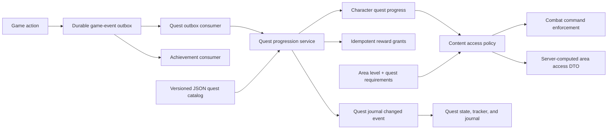

# Quest System and Tutorial Replacement Plan

## Implementation Status

Implemented on 2026-08-09 across the API, Core, Infrastructure, Persistence,
worker event flow, content, and Angular client. The reusable quest journal API,
header tracker, objective guidance, realtime state, reward processing, legacy
progress backfill, and server-authoritative combat-area gates are in place.

A functional quest journal page is available at `/game/quests`, including
active and completed views; objective and reward progress; quest pinning; and
objective navigation. Locked definitions have no character progress row and
become Active automatically when their prerequisites are met. The later
automatic-activation change supersedes the Available/manual-acceptance design
notes retained below as historical implementation planning. Its two-pane journal layout
implements the supplied visual reference while remaining responsive for the
game's smaller layouts.

## Outcome

Replace the one-off First Steps tutorial state machine with a reusable,
character-scoped quest system. The opening quest chain teaches combat,
Essences, crafting, equipment, and gathering, while the same quest framework
continues into normal progression and unlocks the correct combat areas.

The finished system should have these properties:

- onboarding is authored as ordinary quests rather than hard-coded tutorial
  steps;
- quest definitions, prerequisites, objectives, rewards, and presentation are
  data-driven;
- the server is authoritative for quest progress, reward grants, and combat
  access;
- combat areas require both their existing level requirement and any authored
  quest prerequisite;
- objectives advance from existing durable game events and tolerate retries;
- completion and rewards are idempotent;
- the Angular client shows a reusable quest tracker and quest journal;
- tours and guides remain optional presentation attached to quest objectives,
  not progression authority;
- existing characters keep their progress and access during the migration;
- all tutorial-specific services, endpoints, models, cache entries, messages,
  and UI conditionals are removed after cutover.

## Recommended Product Scope

Build a focused non-repeatable quest system first. The first release should
support:

- character-scoped quests;
- locked, available, active, and completed states;
- automatic acceptance for the onboarding chain;
- manual acceptance for later quests;
- sequential or all-at-once objectives;
- counter and current-state objectives;
- item rewards;
- quest prerequisites and minimum levels;
- combat-area access requirements;
- optional destination, guide, and tour metadata;
- automatic, transactional reward grants on completion;
- one pinned quest in the game header plus a quest journal.

Do not include daily quests, repeatable quests, branching dialogue, seasons,
shared party progress, account-wide quests, random objectives, or a general
quest editor in the first release. The model should not prevent those later,
but implementing them now would make the tutorial replacement larger and
riskier than necessary.

Player-facing tutorial skipping should be retired. Quest completion becomes a
real progression requirement, and skipping it while also granting items and
area access would be a second completion path to maintain. Existing players
are grandfathered by the data migration, and development environments should
use a local-only onboarding auto-complete option. If a player-facing bypass is
still required, implement it as an explicit onboarding-chain completion
command with the same transaction and reward idempotency as normal completion,
not as generic quest skipping.

New characters should begin with Training Day already active and its tracker
visible. Replace the current blocking welcome/skip modal with a short,
non-blocking quest introduction. Optional objective tours can still provide
the guided behavior of a tutorial without creating a separate tutorial
lifecycle.

## Current System Inventory

The existing implementation is more than a walkthrough overlay. Replacing it
requires work across the API, Core, Infrastructure, Persistence, content, and
Angular presentation layers.

### Current progression and content

- `Data/tutorials/first-steps.v1.json` defines one seven-step linear tutorial.
- `TutorialConstants` duplicates tutorial IDs, step IDs, area IDs, item IDs,
  and reward quantities in code.
- `CharacterTutorialProgress` stores one current step plus tutorial-specific
  counters, timestamps, and reward flags.
- `JsonTutorialDefinitionProvider` loads and validates the single-purpose JSON
  schema.
- `TutorialService` creates/synchronizes progress, matches triggers, grants
  starter rewards, supports skipping, publishes realtime messages, and decides
  combat-area access.
- `InMemoryTutorialProgressCache` optimizes the active/inactive tutorial check.
- `TutorialBattleService` runs the synchronous Training Area encounter.

### Current event and API integration

- `TutorialGameEventOutboxConsumer` consumes equipment, Essence, crafting,
  combat, and client tutorial events.
- `GameEventOutboxConsumerRegistry` routes those events to the tutorial
  consumer and, for several event types, the achievement consumer as well.
- `TutorialController` exposes get, welcome, client-step, training-battle,
  starter-attunement, and skip endpoints.
- `StartCombatActionCommand` asks `ITutorialService` for permission and then
  emits a tutorial trigger after starting Lumo Ruins combat.
- `GetGameBootstrapQuery` includes a single nullable `TutorialStateDto`.
- `TutorialProgressedMsg` and `TutorialCompletedMsg` drive client updates.

### Current combat access behavior

The Training Area is available only during the first tutorial step. Lumo
Ruins is available at the final tutorial step, and all other non-training
areas are unavailable until the tutorial is complete. After completion, the
special tutorial gate permits all non-training areas; the normal action setup
still enforces `Area.LevelRequirement`.

This logic is duplicated in the Angular `CombatAreaCardComponent`, which also
checks level requirements locally. `RegionComponent` hides the Training Area
unless its tutorial step is active. Access rules therefore exist in both UI
and command code and are coupled to exact tutorial step strings.

### Current presentation coupling

- `TutorialStateService`, `TutorialPresenterService`, and `TutorialService`
  manage one active tutorial and its welcome/skip/completion transitions.
- `TutorialQuestComponent` is already visually quest-like but hard-codes the
  First Steps step order and wording.
- the game bootstrap, game header, sidebar, combat cards, Essences page,
  inventory, equipment state, Essence state, and crafting page reference
  tutorial services or constants;
- first-party tour and guide assets are reusable in principle, but several
  IDs and paths are tutorial-named;
- realtime event mappings are specific to tutorial progressed/completed
  messages.

### Existing pieces to reuse

- the durable game-event outbox and its multi-consumer registry;
- the achievement consumer's event-ledger pattern for idempotent processing;
- `ILootRewardWriter`, `IInventoryItemFactory`, and existing inventory APIs;
- the combat engine used by `TutorialBattleService`;
- first-party guides, tours, route destinations, and `data-tour` anchors;
- the current header tracker styling and attention cues;
- the JSON-content loading and startup-validation pattern.

Do not merge quests into achievements. They can share game events and
implementation patterns, but achievements are mostly retrospective and may be
account-scoped, while quests have availability, acceptance, ordered objectives,
rewards, navigation, and content-access consequences.

## Target Architecture



### Layer ownership

- **Core Domain:** quest progress entities, status/value objects, and stable
  IDs. It must not depend on API, Infrastructure, or Presentation.
- **Core Application:** quest DTOs, service interfaces, queries/commands,
  objective event contracts, and content-access policy interfaces.
- **Infrastructure Service:** JSON catalog, objective evaluators, progression
  orchestration, rewards, quest encounters, access-policy implementation,
  outbox consumer, and realtime publication.
- **Infrastructure Persistence:** EF configurations, repositories or
  `IDbContext` sets, concurrency controls, event ledger, and migrations.
- **API.LL:** quest and region endpoints plus content files and startup wiring.
- **Angular presentation:** quest API/state, tracker, journal, objective cues,
  and consumption of server-computed area access.

## Quest Content Model

Keep authored definitions in versioned JSON under `Data/quests/`. Persist only
player state. This follows the current gameplay-content approach, keeps normal
quest authoring deployable with code, and avoids a database-backed editor in
the first release.

A definition should contain:

```json
{
  "id": "quest.onboarding.training_day",
  "version": 1,
  "title": "Training Day",
  "summary": "Prove that you can survive your first encounter.",
  "category": "Tutorial",
  "sortOrder": 10,
  "objectiveMode": "Sequential",
  "availability": {
    "minimumLevel": 1,
    "completedQuestIds": []
  },
  "objectives": [
    {
      "key": "win_training_encounter",
      "type": "CombatEncounterCompleted",
      "requiredAmount": 1,
      "filters": {
        "areaId": "tutorial_area_training_grounds",
        "requiresVictory": true
      },
      "presentation": {
        "actionLabel": "Go to the Training Area",
        "destinationRoute": "/game/world/shenic?area=tutorial_area_training_grounds",
        "guidePageId": "onboarding-training",
        "tourPageId": "onboarding-training-area"
      }
    }
  ],
  "rewards": [
    {
      "key": "goblin_essence",
      "type": "Item",
      "itemBaseId": "item.essence.goblin",
      "quantity": 1
    }
  ]
}
```

Use stable string IDs for definitions and objective keys. IDs must never be
recycled. Store the accepted definition version with player progress. A
definition version must remain readable while any player can still reference
it, or a migration must explicitly upgrade those rows.

The first-release objective types should correspond to existing authoritative
events or server state:

- combat encounter completed, with area and victory filters;
- combat action started, with area filter;
- Essence absorbed, with definition filter;
- Essence equipped in the active loadout;
- equipment crafted, with tier and item-base filters;
- qualifying equipment currently equipped;
- character level reached.

Counter objectives increment from events. Current-state objectives, such as
equipping an Essence or weapon, should treat the event as a prompt to query
authoritative state rather than trusting a client payload. Definitions may opt
into a state snapshot when accepted; otherwise progress starts at acceptance
and actions performed while a quest is locked do not count.

The catalog validator must fail startup for duplicate quest/objective/reward
keys, missing prerequisites, cycles, unsupported objective or reward types,
invalid counts, invalid next references, and missing initial definitions.
Cross-catalog validation should also verify referenced areas and item bases.

## Persistence Model

Add three tables.

### `CharacterQuestProgresses`

- `CharacterId` and `QuestId` composite key;
- `DefinitionVersion`;
- `Status` (`Available`, `Active`, or `Completed`; locked is derived);
- `AcceptedAt`, `CompletedAt`, and `RewardsGrantedAt`;
- `PinnedAt` or a separate single pinned-quest setting;
- `CreatedAt` and `UpdatedAt`;
- a concurrency token following the repository's existing EF pattern.

### `CharacterQuestObjectiveProgresses`

- `CharacterId`, `QuestId`, and `ObjectiveKey` composite key;
- `CurrentAmount` and `RequiredAmount` snapshot;
- `CompletedAt` and `UpdatedAt`;
- foreign key to `CharacterQuestProgresses` with cascade delete.

### `QuestEventLedgers`

- unique `OutboxMessageId`;
- nullable `CharacterId` plus `EventType` and `ProcessedAt` for diagnostics.

The ledger and progress/reward changes must commit in the same unit of work.
Cap counter progress at the required amount. Completion, reward grants, and
newly available quests must be calculated transactionally. A retried event or
duplicate completion command must not grant a second reward.

Do not add a second table that stores permanent area unlocks in the first
release. A completed quest is the source of truth for quest-gated access. This
avoids divergence between quest progress and unlock rows. The completion DTO
can still report which areas became newly accessible.

## Initial Quest Chain

Split the current seven tutorial steps into ordinary quests with clear reward
boundaries.

| Order | Quest ID                          | Objectives                                                                         | Completion result                                                        |
| ----- | --------------------------------- | ---------------------------------------------------------------------------------- | ------------------------------------------------------------------------ |
| 1     | `quest.onboarding.training_day`   | Win the Training Area encounter                                                    | Grant one unbound Goblin Essence; make Soul Archive available            |
| 2     | `quest.onboarding.soul_archive`   | Absorb the Goblin Essence, then equip it in the active loadout                     | Grant 10 ore and 3 wood; make First Weapon available                     |
| 3     | `quest.onboarding.first_weapon`   | Craft an eligible Tier 1 one-handed weapon, then equip a qualifying crafted weapon | Grant the three basic gathering tools; make Tools of the Trade available |
| 4     | `quest.onboarding.tools_of_trade` | Equip any matching gathering tool                                                  | Unlock Lumo Ruins; make Into the Ruins available                         |
| 5     | `quest.region01.into_lumo_ruins`  | Start and win a Lumo Ruins encounter                                               | Finish guided onboarding; enable the normal regional quest chain         |

The first four quests should auto-accept when their prerequisites are met.
`Into the Ruins` may auto-accept as the last guided quest. After that, use the
normal quest-journal acceptance flow.

The Training Area should be visible and enterable only while Training Day is
active. Lumo Ruins should require completion of Tools of the Trade. Blood Grove
should keep its level 5 requirement and additionally require completion of
Into the Ruins. For the remaining Shenic areas, author a regional chain in
which each area keeps its current level threshold and requires completion of
the preceding area's progression quest:

| Area              | Existing level | Proposed quest gate                           |
| ----------------- | -------------: | --------------------------------------------- |
| Training Area     |              1 | Training Day active; hidden otherwise         |
| Lumo Ruins        |              1 | Tools of the Trade completed                  |
| Blood Grove       |              5 | Into the Ruins completed                      |
| Crystal Creek     |             10 | Blood Grove progression quest completed       |
| Moonlit Graves    |             15 | Crystal Creek progression quest completed     |
| Twilight Clearing |             20 | Moonlit Graves progression quest completed    |
| Old Forest        |             25 | Twilight Clearing progression quest completed |
| Thornroot Hollow  |             30 | Old Forest progression quest completed        |
| Embercap Burrows  |             35 | Thornroot Hollow progression quest completed  |
| Moonveil Marsh    |             40 | Embercap Burrows progression quest completed  |
| Duskmire Hollow   |             45 | Moonveil Marsh progression quest completed    |

Exact regional quest names, narratives, kill counts, and rewards are content
design work. The unlock structure should be implemented now, while only the
onboarding chain and Into the Ruins need complete authored content for the
first cutover. Do not enable a later area's quest gate until the quest that
satisfies it ships in the same release; until then, that area remains governed
by its existing level requirement. This prevents the framework release from
locking established players out of unfinished regional content.

## Combat Access Design

Add quest requirements to each area definition, for example:

```json
{
  "id": "region_01_area_02",
  "name": "Blood Grove",
  "levelRequirement": 5,
  "access": {
    "completedQuestIds": ["quest.region01.into_lumo_ruins"],
    "hideWhenLocked": false
  }
}
```

Introduce one application-facing content access policy that returns a result,
not just a boolean:

```text
CanAccess
IsVisible
UnmetLevel
UnmetQuestIds
ReasonCode
PlayerMessage
```

Use it in both `StartCombatActionCommand` and quest-encounter commands. Return
the same access result in region/area DTOs so Angular displays the server's
decision and lock reason instead of reconstructing it from tutorial state.
The command must always re-evaluate access, because client state can be stale
or manipulated.

The policy evaluates all configured requirements. Completing a quest does not
bypass the area's level requirement. Missing or invalid access configuration
must fail closed for combat while surfacing a content-validation error during
startup and tests.

## Backend Work Plan

### Phase 1: Quest foundation alongside the tutorial

- [ ] Add Core quest entities, enums/value objects, DTOs, and interfaces.
- [ ] Add `CharacterQuestProgress`, objective progress, and event-ledger EF
      configurations and `IDbContext`/`LLDbContext` sets.
- [ ] Add a versioned JSON quest catalog and startup validator.
- [ ] Implement quest availability, acceptance, objective evaluation,
      completion, and journal queries.
- [ ] Implement idempotent reward handlers by reward type; item rewards should
      reuse the existing inventory and loot services.
- [ ] Implement the quest outbox consumer and register it alongside tutorial
      and achievement consumers during the transition.
- [ ] Add realtime quest-journal changed/completed messages.
- [ ] Add a local-development onboarding auto-complete option to replace
      `TutorialDebugOptions` behavior.

### Phase 2: Access policy and onboarding content

- [ ] Extend area content and DTOs with access requirements and computed
      access state.
- [ ] Add the server-side content access policy and enforce it in all idle
      combat entry points.
- [ ] Author and validate the five initial quest definitions.
- [ ] Generalize `TutorialBattleService` into a quest encounter service, or a
      training encounter handler addressed by quest/encounter IDs; it must not
      depend on tutorial constants.
- [ ] Move starter Essence, crafting material, and gathering-tool grants into
      quest reward definitions and reward handlers.
- [ ] Replace tutorial reconciliation methods with explicit objective-state
      evaluators where events alone are insufficient.
- [ ] Resolve the current Goblin Essence identifier mismatch during content
      migration: backend content uses `essence.goblin`, while the Angular tutorial
      constant currently uses `essence.legacy.goblin`.

### Phase 3: Quest API and Angular experience

- [ ] Add `QuestController` endpoints to list the journal, get quest detail,
      accept a quest, pin a quest, and start a quest encounter.
- [ ] Replace the single bootstrap `Tutorial` property with a compact quest
      journal snapshot containing active/available quests and the pinned quest.
- [ ] Add Angular quest models, API service, signal-based state service, and
      realtime mappings.
- [ ] Convert `TutorialQuestComponent` into a generic pinned quest tracker with
      objective progress, destination action, and completion feedback.
- [ ] Replace the blocking tutorial welcome/skip modal with a non-blocking
      Training Day quest introduction.
- [x] Add a quest journal reachable from the existing quest/navigation icon.
- [ ] Drive sidebar attention, tours, guides, crafting filters, Essence cues,
      inventory cues, and area targeting from the pinned objective's presentation
      metadata and semantic objective type.
- [ ] Replace all frontend area-lock calculations with server-provided access
      state and reason text.
- [ ] Preserve reduced-motion and stale-response protections from the current
      tutorial state service, generalized for multiple quests and per-quest
      versions.

### Phase 4: Data migration and cutover

- [ ] Generate an EF Core migration; do not apply it to shared or production
      databases from this repository task.
- [ ] Backfill quest progress from every legacy tutorial step using the mapping
      below.
- [ ] Mark historical quest rewards as already granted whenever the equivalent
      tutorial reward was already granted or the mapped quest is completed.
- [ ] For existing characters without a tutorial row, preserve the current
      grandfathering behavior: characters with established progression are marked
      through the onboarding chain; genuinely new level-1 characters start at
      Training Day.
- [ ] Enable quest reads/progression and quest-based combat access behind
      separate cutover flags so progress can be compared before removing the old
      path.
- [ ] Stop registering the tutorial outbox consumer before deleting its code;
      confirm no pending outbox delivery still targets the `tutorial` consumer.
- [ ] Remove the temporary dual-write/read or comparison code after one stable
      release.

### Legacy step migration mapping

| Legacy current step                                   | Quest state to create                                                       |
| ----------------------------------------------------- | --------------------------------------------------------------------------- |
| `defeat_training_creature`                            | Training Day active                                                         |
| `absorb_essence`                                      | Training Day completed; Soul Archive active                                 |
| `equip_essence`                                       | Training Day completed; Soul Archive active with absorb objective completed |
| `craft_equipment`                                     | Training Day and Soul Archive completed; First Weapon active                |
| `equip_equipment`                                     | First Weapon active with craft objective completed; prior quests completed  |
| `equip_gathering_tool`                                | First Weapon completed; Tools of the Trade active; prior quests completed   |
| `start_lumo_ruins`                                    | Tools of the Trade completed; Into the Ruins active; prior quests completed |
| `defeat_lumo_ruins`, `complete`, or `CompletedAt` set | All five initial quests completed and onboarding rewards marked granted     |

Migration assertions must cover partially completed counters, reward flags,
welcome state, skipped/completed players, missing tutorial rows, and repeated
migration execution. Do not infer reward eligibility only from inventory,
because a player may have consumed or sold a previously granted item.

### Phase 5: Remove the tutorial system

- [ ] Remove `TutorialController` and all Tutorial commands, queries, DTOs, and
      service interfaces.
- [ ] Remove `Domain.Models.Tutorials`, `Services.LL.Tutorials`, tutorial DI
      registrations, progress cache, tutorial outbox consumer/name/registry
      entries, and tutorial realtime contracts.
- [ ] Remove `ClientTutorialStep` only after confirming no deployed client or
      pending outbox message can emit it; replace any still-useful client
      presentation signal with a quest-neutral event.
- [ ] Remove `CharacterTutorialProgresses` from the context in a later contract
      migration after rollback is no longer required.
- [ ] Remove the old tutorial JSON and appsettings section.
- [ ] Remove Angular tutorial services/models/realtime files and rename the
      tracker directory/component.
- [ ] Remove tutorial step constants and special cases from combat cards,
      regions, sidebar, Essences, inventory, equipment, and crafting.
- [ ] Rename retained guide/tour assets and IDs from `tutorial-*` to
      `onboarding-*` or `quest-*`, updating validation and `data-tour` anchors.
- [ ] Remove obsolete tutorial-specific starter items only after a reference
      audit confirms they are neither migrated inventory nor balance fixtures.

## API Shape

Suggested endpoints:

- `GET /api/v1/quest` returns the character's available, active, and recently
  completed quests plus the pinned quest ID;
- `GET /api/v1/quest/{questId}` returns one resolved definition and progress;
- `POST /api/v1/quest/{questId}/accept` accepts an available manual quest;
- `PUT /api/v1/quest/pinned` changes the pinned quest;
- `POST /api/v1/quest/{questId}/encounters/{encounterKey}/start` starts an
  authored synchronous quest encounter such as Training Day.

Use response DTOs resolved from the current definition plus persisted state.
Do not expose persistence entities. Return stable reason codes for unavailable
quests and locked areas so the client does not parse English error text.

A coarse `QuestJournalChangedMsg` containing changed quest IDs is preferable
to encoding every transition in the client. On receipt, the client refreshes
the affected journal snapshot. The server response and persisted state remain
authoritative if realtime delivery is delayed or missed.

## Important Design Decisions

1. **Quests and achievements stay separate.** They share events, not lifecycle
   or persistence models.
2. **Definitions live in JSON; player state lives in PostgreSQL.** This matches
   current content practices and is manageable for a solo developer.
3. **Quest completion is the area-unlock source of truth.** Do not duplicate
   it into an unlock table until a non-quest unlock source actually requires
   one.
4. **Level and quest gates are cumulative.** A quest never silently bypasses
   an area's level requirement.
5. **The backend returns resolved access state.** Angular presents it but does
   not decide it.
6. **Events are durable triggers, not unquestioned facts.** Evaluators query
   current state for equipment/loadout objectives.
7. **Rewards auto-grant transactionally in the first release.** Manual claim
   adds states and failure modes without helping the onboarding flow.
8. **No quest progress cache initially.** Multiple concurrent quests make the
   current active/inactive cache shape unsafe. Add caching only after profiling,
   with explicit invalidation and persisted state as authority.
9. **Use expand/migrate/contract.** Keep legacy data for rollback through at
   least one stable release, then remove it with a later migration.

## Verification Plan

### Backend unit and integration coverage

- [ ] catalog rejects duplicate IDs, missing prerequisites, cycles, unknown
      objective/reward types, and invalid item/area references;
- [ ] availability respects minimum level and all quest prerequisites;
- [ ] auto-accept activates each onboarding quest exactly once;
- [ ] manual accept rejects locked, active, and completed quests;
- [ ] each supported event progresses only matching active objectives;
- [ ] sequential objectives do not receive premature credit;
- [ ] current-state evaluators verify the active Essence loadout and actually
      equipped crafted weapon/tool;
- [ ] duplicate/retried outbox messages do not increment or reward twice;
- [ ] concurrent matching events cannot over-increment or grant twice;
- [ ] quest completion, reward writes, ledger writes, and new availability are
      atomic;
- [ ] missing reward content rolls back completion with a diagnostic error;
- [ ] combat access enforces both level and quest requirements server-side;
- [ ] Training Area visibility/access follows active Training Day state;
- [ ] all legacy tutorial steps migrate to the expected quest/objective state;
- [ ] established characters remain grandfathered and new characters start the
      chain;
- [ ] quest progress and completion realtime messages target only the correct
      character.

### Angular coverage

- [ ] bootstrap initializes the quest journal and pinned tracker;
- [ ] stale HTTP responses cannot overwrite newer realtime progress;
- [ ] tracker navigation uses server-authored presentation metadata;
- [ ] completion selects/pins the next onboarding quest predictably;
- [ ] journal correctly separates available, active, and completed quests;
- [ ] locked area cards display server-provided level and quest reasons;
- [ ] existing guide/tour flows still anchor correctly after renaming;
- [ ] reduced-motion users do not depend on transition-end events;
- [ ] logout clears all character quest state.

### Commands to run during implementation

```powershell
dotnet build LL\LegendsLegacy.sln
dotnet test LL\tests\EssenceSystem.Tests\EssenceSystem.Tests.csproj

Set-Location LL\src\Presentation\ll
npm run test -- --watch=false
npm run build
```

Also generate the migration from `Persistence.LL` with `API.LL` as the startup
project, inspect the SQL and model snapshot, and test the migration against a
disposable database containing representative rows for every legacy tutorial
step. Do not apply it to a shared database as part of implementation.

## Cutover Acceptance Criteria

- [ ] A new character automatically receives Training Day and can enter only
      the Training Area among quest-gated combat areas.
- [ ] Completing the five initial quests teaches the same core actions and
      grants at least the same starter resources as the current tutorial.
- [ ] Lumo Ruins unlocks after Tools of the Trade, and Blood Grove requires
      both level 5 and Into the Ruins completion.
- [ ] Starting combat through a direct API request cannot bypass a quest gate.
- [ ] Duplicate events and requests never duplicate quest progress or rewards.
- [ ] Every pre-cutover tutorial state maps without losing access or granting
      rewards twice.
- [ ] The game bootstrap, tracker, journal, sidebar cues, guides, tours,
      crafting filters, inventory/Essence cues, and area cards use quest state.
- [ ] No runtime code depends on tutorial entities, services, endpoints,
      constants, cache entries, outbox consumers, or realtime messages.
- [ ] The old tutorial table remains only for the documented rollback window
      and is removed in the later contract migration.
- [ ] Backend tests, frontend tests, frontend production build, catalog
      validation, and migration tests pass.

## Risks and Mitigations

- **Double rewards during migration:** backfill reward-granted state from
  durable tutorial flags and mapped completion, then enforce unique/idempotent
  reward keys.
- **Lost progress during dual running:** give tutorial and quest consumers
  independent outbox deliveries, compare results, and cut over at a known
  outbox boundary.
- **Definition edits invalidating active rows:** retain versioned definitions
  or migrate progress explicitly; never reinterpret old progress silently.
- **UI/server access disagreement:** include resolved access state in area DTOs
  and keep command-side enforcement authoritative.
- **Event retries or concurrency:** use a unique event ledger, transaction,
  capped counters, and a progress concurrency token.
- **Quest chain dead ends:** validate prerequisite cycles and add an integration
  test that walks a new character through the full authored chain.
- **Content references drifting:** validate quest area/item/Essence IDs against
  loaded catalogs. Include the existing Goblin Essence ID mismatch in the
  first cleanup.
- **Oversized first release:** ship only the objective/reward types used by the
  onboarding and first regional gate, then add types with real quest content.

## Delivery Sequence

Implement this as reviewable slices:

1. quest domain, persistence, catalog, and validation;
2. progression engine, objective evaluators, outbox ledger, and rewards;
3. content access policy plus server-resolved area access;
4. initial quest content and generalized training encounter;
5. quest API, bootstrap, realtime refresh, tracker, and journal;
6. migration, compatibility flags, and dual-run verification;
7. backend cutover and tutorial consumer shutdown;
8. frontend tutorial-reference removal and asset renaming;
9. stable-release observation followed by the legacy-table contract migration.

Each slice should keep Core dependency direction intact, avoid unrelated
refactors, and include its own tests. No step requires infrastructure-as-code
changes or deployment from this repository. The database migrations and API
contract changes do have deployment-order implications and must be coordinated
with the Angular client cutover.
