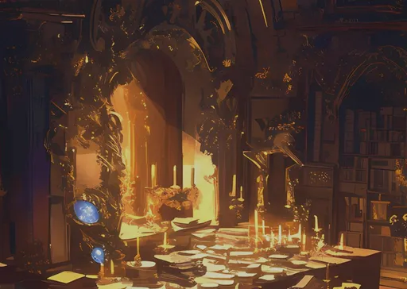

<!-- Imported from the Claude Design artifact (D-090). Files live in assets/Backgrounds/; keep this page in step with them. -->
# Assets · Backgrounds

5 files under `assets/Backgrounds/`, stored as files in this repository. Reference one by its relative path (from a component preview: `../../assets/Backgrounds/<file>`). Copy assets, never approximate them.

## Use

```html

```

## Usage notes

# Backgrounds

Painted, candle-lit scenes, 512px wide, used as Stage art — never as content. The Stage darkens, warms and blurs them.

- `background.webp` — the study (character screens)
- `colosseum.webp` — the arena
- `market-place.webp` — the alchemist's market (Cinder Bazaar)
- `tavern.webp` — the tavern
- `temple.webp` — the temple (regions, prophecies)

## Files

| file | open |
| --- | --- |
| `assets/Backgrounds/background.webp` | [background.webp](../../assets/Backgrounds/background.webp) |
| `assets/Backgrounds/colosseum.webp` | [colosseum.webp](../../assets/Backgrounds/colosseum.webp) |
| `assets/Backgrounds/market-place.webp` | [market-place.webp](../../assets/Backgrounds/market-place.webp) |
| `assets/Backgrounds/tavern.webp` | [tavern.webp](../../assets/Backgrounds/tavern.webp) |
| `assets/Backgrounds/temple.webp` | [temple.webp](../../assets/Backgrounds/temple.webp) |
