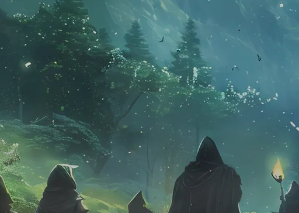

<!-- Imported from the Claude Design artifact (D-090). Files live in assets/Cards/; keep this page in step with them. -->
# Assets · Cards

3 files under `assets/Cards/`, stored as files in this repository. Reference one by its relative path (from a component preview: `../../assets/Cards/<file>`). Copy assets, never approximate them.

## Use

```html

```

## Usage notes

# Cards

Activity art from the game's action cards, 512px. Use in wide ItemSlots (professions) or as Stage art for archive screens.

- `combatArea.webp` — hooded party in a lit forest (combat)
- `mining.webp` — violet crystal vein (mining)
- `woodcutting.webp` — the great tree (woodcutting)

## Files

| file | open |
| --- | --- |
| `assets/Cards/combatArea.webp` | [combatArea.webp](../../assets/Cards/combatArea.webp) |
| `assets/Cards/mining.webp` | [mining.webp](../../assets/Cards/mining.webp) |
| `assets/Cards/woodcutting.webp` | [woodcutting.webp](../../assets/Cards/woodcutting.webp) |
