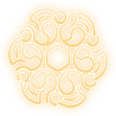

<!-- Imported from the Claude Design artifact (D-090). Files live in assets/Logos/; keep this page in step with them. -->
# Assets · Logos

1 file under `assets/Logos/`, stored as files in this repository. Reference one by its relative path (from a component preview: `../../assets/Logos/<file>`). Copy assets, never approximate them.

## Use

```html

```

## Usage notes

# Logos

- `Logo.svg` — the Legend's Legacy knot emblem (hexagon heart), 116×116 with its own drop-shadow filter. Ink is baked in: a pale-to-deep gold gradient (#FEEFD0 → #FCD587). Use it on `ground`, `surface` or `folio`. Pair it with the name set in Marcellus — there is no separate wordmark file.

## Files

| file | open |
| --- | --- |
| `assets/Logos/Logo.svg` | [Logo.svg](../../assets/Logos/Logo.svg) |
