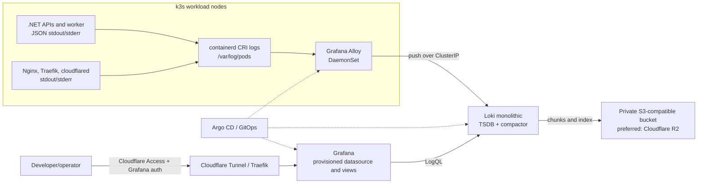

# LegendsLegacy Production Logging System Plan

Status: Phase 1 application foundation implemented; infrastructure deployment pending  
Date: 2026-08-18  
Scope: `legends-legacy` plus read-only source inspection of the separate `ll-infrastructure` checkout

This document records the recommended design and incremental implementation sequence. Phase 1 application changes are now implemented in `legends-legacy`; infrastructure deployment remains intentionally separate. The Phase 0 source findings and remaining live checks are captured in `LOGGING_DEPLOYMENT_BASELINE.md`.

## Evidence boundary

The application repository was inspected in full for .NET entry points, logging calls, exception handling, `Activity`/`Meter` usage, Dockerfiles, Helm charts, Nginx configuration, and GitHub release workflows. The separate private `ll-infrastructure` checkout was subsequently found at `C:\repos\Legends-Legacy\ll-infrastructure` and inspected read-only. It confirms the dev Argo CD hierarchy, namespace, component chart pins, Traefik/cloudflared topology, mixed SealedSecret/legacy Secret conventions, and static PostgreSQL storage described in `LOGGING_DEPLOYMENT_BASELINE.md`. `kubectl` is not installed here, so live cluster state, capacity, StorageClasses, rotation, and log-volume measurements remain unverified.

Accordingly:

- application findings and paths in this document are confirmed;
- the checked-in k3s, Argo CD, Traefik, and Cloudflare source configuration is confirmed, while runtime state remains unverified;
- proposed infrastructure paths are deliberately marked **proposed**, not presented as existing files;
- the first infrastructure implementation step must complete the live checks listed in `LOGGING_DEPLOYMENT_BASELINE.md` and replace remaining capacity/runtime placeholders;
- this repository's instruction that infrastructure-as-code lives elsewhere means the production logging stack must be committed to `ll-infrastructure`, not added here.

## 1. Executive Summary

LegendsLegacy should use a small, Kubernetes-native Grafana logging stack:

- every deployed .NET process writes one-line structured JSON to stdout/stderr using the built-in `Microsoft.Extensions.Logging` JSON console formatter;
- Nginx, Traefik, cloudflared, and selected platform workloads also write to stdout/stderr, with JSON enabled where the component supports it;
- Grafana Alloy runs as a DaemonSet, tails the node's Kubernetes container log files, attaches carefully selected Kubernetes metadata, drops noisy or sensitive records, and forwards logs to Loki;
- Loki runs in **monolithic** mode as one replica, using the TSDB index and a private S3-compatible object store; Cloudflare R2 is the preferred initial object store because the deployment already has a Cloudflare operational boundary and R2 avoids coupling retained logs to the single k3s node;
- Grafana runs as one private replica with Loki provisioned as code. It is exposed only through the existing Cloudflare Tunnel/Traefik path and protected by both Cloudflare Access and Grafana authentication;
- all components are pinned and reconciled by Argo CD from `ll-infrastructure`.

This is intentionally not an Elasticsearch-sized platform. Loki monolithic mode is designed for small log volumes and can handle far more than the expected initial LegendsLegacy volume; Alloy is the supported successor to Promtail and can later collect OpenTelemetry metrics and traces without changing the log transport. The application should keep its existing `ILogger<T>` abstraction rather than adopt Serilog or NLog. The existing parameterized log templates are already largely suitable; the missing pieces are JSON formatting, consistent scopes, safe HTTP request summaries, trace/request correlation, level tuning, and collection infrastructure.

The preferred physical storage design is:

- private R2 bucket: retained Loki chunks and TSDB index objects;
- 10 GiB Loki PVC: write-ahead log, active index/cache, compactor working data, and safe restart state;
- 5 GiB Grafana PVC: embedded database and local state, while datasources and important dashboards remain provisioned from Git;
- node container logs: short-lived collection buffer only, governed by k3s/containerd rotation.

If R2 or another S3-compatible store is not acceptable, a 50 GiB filesystem PVC is a viable single-node fallback, but it has a worse failure mode: a node/disk failure can destroy both the workload and the evidence needed to investigate it.



## 2. Current State

### 2.1 Repository and runtime architecture

The repository has two .NET solution boundaries and several browser applications:

| Runtime                         | Confirmed role                                                                      | Data/dependencies                                                               | Deployment evidence                                                                                                 |
| ------------------------------- | ----------------------------------------------------------------------------------- | ------------------------------------------------------------------------------- | ------------------------------------------------------------------------------------------------------------------- |
| `LL/src/API/API.LL`             | Main ASP.NET Core game API, SignalR game hub, and several in-process hosted workers | PostgreSQL through EF Core/Npgsql; optional Redis SignalR backplane             | `build/ll-backend.dockerfile`; `LL/deploy/ll-backend`                                                               |
| `LL/src/Worker/Worker.LL`       | Separate Quartz.NET scheduler for durable global jobs                               | PostgreSQL-backed Quartz store and game database                                | `build/ll-worker.dockerfile`; optional worker Deployment in `LL/deploy/ll-backend/templates/deployment-worker.yaml` |
| `LL/src/API/API.LiveOps`        | Production operator API plus the built LiveOps Angular UI served as static files    | Game PostgreSQL database, OIDC identity provider, chat moderation HTTP endpoint | `build/ll-liveops.dockerfile`; `LL/deploy/ll-liveops`                                                               |
| `LL/src/API/API.AdminDashboard` | Development-only content workbench API                                              | Game services/database                                                          | It refuses to start outside Development (`Program.cs:18-22`) and has no production Helm chart                       |
| `LL-Chat/API/API.Chat`          | Independent chat API and SignalR hub                                                | Separate PostgreSQL chat database; optional Redis backplane and presence leases | `build/ll-chat.dockerfile`; `LL-Chat/deploy/ll-chat`                                                                |
| `LL/src/Presentation/ll`        | Player Angular SPA served by Nginx                                                  | Static content; browser calls APIs directly                                     | `LL/src/Presentation/ll/dockerfile`; `LL/src/Presentation/ll/deploy/ll-frontend`                                    |
| `LL/src/Presentation/liveops`   | Angular LiveOps SPA                                                                 | Built into and served by `API.LiveOps`                                          | Packaged by `build/build-ll-liveops.ps1`; no separate runtime chart                                                 |
| `LL/src/Presentation/dashboard` | Development-only Angular content workbench                                          | Local AdminDashboard API                                                        | Dockerfile exists, but no production chart and project documentation says it is not a production boundary           |

The main API also owns hosted loops for outbox delivery, World Tower simulation/playback, and a title backfill. This matters operationally: filtering only for a future `ll-worker` pod would miss substantial background processing that currently runs inside the API pod.

The separate worker uses Quartz persistent storage, clustering, deterministic job identities, and graceful shutdown. Its chart is present but disabled by default (`LL/deploy/ll-backend/values.yaml:14-23`). Production overrides in `ll-infrastructure` determine whether it is actually enabled.

### 2.2 Deployment and release shape

The application repository contains Helm application charts for backend/worker, chat, LiveOps, and the player frontend. They create Deployments and ClusterIP Services; the backend, chat, and frontend charts also contain optional Ingress and HPA templates. Default ingress and autoscaling values are disabled. The chart helpers define useful standard labels including `app.kubernetes.io/name`, `app.kubernetes.io/instance`, `app.kubernetes.io/version`, and Helm ownership. However, each pod template currently renders only the selector labels, so `app.kubernetes.io/version` is on the Deployment metadata but not reliably available to pod-log discovery (`LL/deploy/ll-backend/templates/deployment.yaml:16-23`, with the same pattern in Chat, LiveOps, and frontend). The worker does add `app.kubernetes.io/component: worker` to its pod (`LL/deploy/ll-backend/templates/deployment-worker.yaml:8,15,24`). Phase 1 should add non-selector metadata such as version and component to pod templates without changing immutable Deployment selectors.

Confirmed shortcomings of the checked-in defaults are relevant to logging capacity planning:

- backend, worker, chat, and frontend resource blocks are empty (`LL/deploy/ll-backend/values.yaml:23,78`, `LL-Chat/deploy/ll-chat/values.yaml:67`, and `LL/src/Presentation/ll/deploy/ll-frontend/values.yaml:64`);
- LiveOps is the exception and requests 50m CPU/128 MiB with a 512 MiB memory limit (`LL/deploy/ll-liveops/values.yaml:37-43`);
- no PVC, StatefulSet, DaemonSet, StorageClass, or storage provisioner definition exists in this repository;
- the application charts do not create namespaces;
- Secret resources are not present. Charts accept arbitrary environment entries, including `secretKeyRef`, so concrete credentials are evidently supplied externally;
- the main API and chat apply EF Core migrations at application startup (`LL/src/API/API.LL/Program.cs:226-233` and `LL-Chat/API/API.Chat/Program.cs:175-182`), but this is separate from logging storage.

GitHub Actions build immutable .NET/Angular artifacts, publish images to GHCR, package the application Helm charts to GHCR OCI, then update per-component version files in `ll-infrastructure`. This confirms that Argo CD's desired state and environment overrides are external to this repository.

### 2.3 Current application logging

All deployed .NET entry points use the default Microsoft hosting logging pipeline. No Serilog, NLog, OpenTelemetry SDK, custom provider, file sink, or explicit `AddJsonConsole` registration exists. `appsettings.json` generally sets `Default=Information` and `Microsoft.AspNetCore=Warning`; the worker additionally leaves Quartz at `Information`.

With the default console provider, logs do reach stdout/stderr, which is Kubernetes-compatible, but they are human-oriented text rather than one-line JSON. Parameter values are retained by `ILogger` internally, but the current formatter renders them into the message instead of emitting a stable, easily parsed field map.

Repository-wide (excluding EF migration code), the audit found 70 explicit logging calls across 26 files:

| Level       | Explicit calls | Observation                                                             |
| ----------- | -------------: | ----------------------------------------------------------------------- |
| Trace       |              0 | No extremely verbose production logging                                 |
| Debug       |              1 | Very little diagnostic-only logging                                     |
| Information |             26 | Some useful lifecycle logs, but several high-frequency success paths    |
| Warning     |             19 | Mostly retry, timeout, concurrency, or degraded-operation records       |
| Error       |             22 | Exceptions are normally supplied to the logger, preserving stack traces |
| Critical    |              2 | Both represent outbox dead-letter conditions                            |

No logging call passes an interpolated string directly to `ILogger`; existing calls use message templates. Examples of good current practice include:

- transaction failure includes the exception and command type (`LL/src/Core/Application/MediatR/Behaviors/TransactionBehavior.cs:128-129`);
- background jobs include job name, business key, execution ID, attempt, and elapsed duration (`LL/src/Infrastructure/Persistence/Persistence.LL/BackgroundJobs/BackgroundJobExecutionService.cs`);
- outbox delivery uses `ActivitySource`, metrics, a structured scope, exception-preserving retries, and explicit dead-letter Critical logs (`LL/src/API/API.LL/HostedServices/GameEventOutboxWorker.cs:18-22,102-125,181-209`);
- the outbox record persists `Activity.Current.TraceId` in its `CorrelationId` column (`LL/src/Infrastructure/Service/Services.LL/Outbox/GameEventOutbox.cs:24-33`);
- idle combat, World Tower, Tournament Grounds, state sync, and outbox code already define `System.Diagnostics.Metrics` instruments. They are not currently exported, but they correctly keep numeric telemetry out of most log messages.

The main API adds `ProblemDetails`, one concurrency-specific exception handler, and `UseExceptionHandler` (`LL/src/API/API.LL/Program.cs:61-62,240`). Chat and LiveOps do not install equivalent global ProblemDetails/exception middleware. Framework hosting will still emit many unhandled exceptions, but response shape and application context are inconsistent.

There is no application request-summary middleware, no explicit response request ID, no documented correlation contract, and no request-wide identity/logging scope. ASP.NET Core creates `Activity` instances and W3C trace IDs for requests, but the current formatter and scope settings do not make this a reliable searchable contract.

### 2.4 Current non-.NET logging

The player frontend uses the official Nginx Alpine image. Its server config sets `error_log /var/log/nginx/error.log info` and does not define an application-specific structured access format (`LL/src/Presentation/ll/nginx.conf:1-40`). The official image normally links its standard log files to stdout/stderr, but that behavior should be asserted in an image smoke test rather than treated as a durable application contract. Most successful static-asset access logs would be low-value volume.

Traefik, cloudflared, Argo CD, k3s system components, PostgreSQL, and Redis logging configuration cannot be audited from this checkout. Their live values and namespaces are an explicit preflight item.

### 2.5 Environment separation and current observability

The source supports normal ASP.NET Core environment names and environment-specific appsettings. Release workflows distinguish `main-*` and `release-*` tags, but that does not establish which tag maps to Development, Staging, or Production. No monitoring, centralized logging, metrics backend, trace backend, Grafana, Loki, Prometheus, or collector configuration is present here.

Environment must therefore become an explicit deployment label, not something inferred from an image tag or namespace spelling.

## 3. Problems Identified

### High severity

1. **No durable central copy of pod logs.** When container-runtime rotation, pod deletion, node failure, or a crash removes local records, there is no repository evidence of another retained copy.
2. **No reliable request-to-log correlation contract.** The runtime creates W3C trace context, and the outbox captures a trace ID, but request logs and business logs do not consistently expose it. A player-facing failure cannot currently be followed through the request, transaction, and outbox paths.
3. **Unstructured console presentation.** Existing template properties are rendered as text. Queries for `CharacterId`, `JobName`, status, duration, or exception type would depend on fragile text parsing.
4. **Cluster-wide infrastructure is not reproducible from this repository alone.** This is expected because `ll-infrastructure` is the IaC boundary, but logging work cannot safely proceed without inspecting its Argo CD, Secret, storage, Traefik, and cloudflared conventions.
5. **Sensitive-data policy is implicit.** There is no enforceable list of forbidden fields and no review/test mechanism for request headers, bodies, query strings, tokens, cookies, email addresses, chat content, or connection strings.

### Medium severity

1. **High-volume success paths are at Information.** Every realtime send is logged at Information (`GameRealtimeBroadcaster.cs:34-40` and `RealtimeDeliveryGameEventOutboxConsumer.cs:44-51`). Idle action resolution can produce two Information records for one interaction (`CombatService.cs:111-118` and `CharacterActionService.cs:127-137`). These should become Debug or slow/anomalous-only logs before central ingestion.
2. **Duplicate exception potential.** `TransactionBehavior` logs an Error and rethrows; the HTTP exception boundary can log the same failure again. The useful command name should be placed in a scope, while the owning boundary logs the exception once.
3. **Inconsistent exception boundaries.** Main API has exception handling; Chat and LiveOps do not. An operator should get a stable ProblemDetails response with a safe request/trace identifier from each API.
4. **No HTTP completion record.** There is no single structured record containing route template, method, status, and duration for failed/slow requests. Traefik alone cannot supply application operation or identity context.
5. **No stable service/environment/version fields in application logs.** Kubernetes can add most source metadata, but non-Kubernetes runs and cross-service queries still benefit from a consistent service resource identity. Version already exists as a Helm label, but is not consistently exposed as a searchable field.
6. **Two production-inappropriate `Console.WriteLine` calls live in domain level-up actions.** `IncreaseEssenceSlotAction.cs:12` and `IncreaseEssenceReserveSlotAction.cs:12` bypass level control, scopes, and structured fields. Simulator console output is development tooling and can remain isolated.
7. **Chat detailed SignalR errors are always enabled.** `LL-Chat/API/API.Chat/Program.cs:43` enables `EnableDetailedErrors=true`; this should be Development-only because detailed hub errors can expose internals to clients. This is primarily a security issue, but it also affects what users may report and what the server records.
8. **Version metadata does not reach current pods.** The helpers define `app.kubernetes.io/version`, but pod templates use selector labels only. The collector cannot reliably answer “did this begin after release X?” until version is copied to pod metadata or otherwise added as structured metadata.

### Low severity / maintainability

1. Logging configuration is repeated across entry points without a documented shared schema.
2. The worker's Quartz category at Information can become noisy after more schedules are added.
3. Frontend Nginx logs are not explicitly JSON and successful assets/health probes are not filtered.
4. Several log templates embed `key=value` text inside an already structured template. This remains queryable after JSON formatting but should gradually become natural prose plus named fields.
5. Some operational failures are persisted as database error strings as well as logged (background execution and outbox). That is intentional durable workflow state, but retained payload length and sensitivity need review.

## 4. Recommended Architecture

### 4.1 Technology selection

Use:

- **Microsoft.Extensions.Logging JSON console formatter** in deployed .NET workloads;
- **Grafana Alloy** as the node-level log collector;
- **Grafana Loki in one-replica monolithic mode**, TSDB schema, single tenant;
- **private Cloudflare R2 bucket** through Loki's S3-compatible client;
- **Grafana OSS**, one replica, with Git-provisioned Loki datasource and operational views;
- **Cloudflare Access plus Grafana authentication** for operator access;
- **Helm and Argo CD** in `ll-infrastructure`, with chart and image versions pinned.

Do not add Serilog, NLog, Fluentd, Logstash, Kafka, Elasticsearch, or an OpenTelemetry Collector solely for this logging rollout.

### 4.2 Why this fits LegendsLegacy

Loki indexes source labels rather than every word in every log. LegendsLegacy's primary questions start with time, environment, service, workload, severity, or route and then narrow to a request/player ID. That query shape matches Loki well and avoids the JVM and indexing overhead of Elasticsearch/OpenSearch.

Monolithic Loki is the right starting mode. Current Loki guidance describes it as suitable for small volumes up to roughly 20 GB/day, far above a sensible initial budget for this game. The newer Simple Scalable Deployment mode should not be selected: it is deprecated for removal in Loki 4.0. Distributed mode adds components and failure modes that a single small k3s cluster does not need.

Alloy is preferred over Promtail because Promtail has been deprecated and its functionality moved into Alloy. Alloy also provides a clean future path to collect the `Meter` and `ActivitySource` signals already present in the codebase. This plan does not require adding metrics or a trace backend now.

The built-in .NET JSON console provider is sufficient. Existing code already uses `ILogger<T>` and parameterized templates. Keeping the provider avoids a broad dependency and behavior migration. Serilog would be justified only if a later requirement needs advanced in-process sinks, destructuring policies, or redaction that the built-in provider cannot deliver.

### 4.3 Failure-domain choice

R2 is preferred over a Loki filesystem-only PVC because centralized logs are most valuable when the node or cluster is unhealthy. R2 is S3-compatible, and Loki supports S3-compatible endpoints. Use a dedicated private bucket and bucket-scoped read/write token. The bucket must never be public.

Loki still needs a modest PVC for restart-safe WAL/index/cache/compactor state. The first deployment is not highly available: one Loki process and one Grafana process can be temporarily unavailable during a node outage. Retained objects survive, and Argo CD can reconstruct services. This is the right cost/reliability compromise for one k3s cluster. A three-replica Loki design on one physical node would create complexity without a distinct failure domain.

### 4.4 Upgrade path

Change components only when measurements justify it:

1. Increase Loki memory/cache and local PVC if queries or compaction pressure rise.
2. Increase Alloy resources if parse/drop pipelines fall behind.
3. Add a second/third physical node and move to three-replica HA monolithic Loki with shared object storage if availability becomes important.
4. Move to distributed Loki only when sustained ingestion/query load exceeds practical monolithic scaling or independent component scaling is required.
5. Add Tempo/OpenTelemetry trace export later; preserve the same W3C `TraceId` used in logs.

## 5. Alternatives Considered

| Candidate                                         | Strengths                                                                                                                                     | Costs/weaknesses here                                                                                                                                                                                                            | Decision                                                                           |
| ------------------------------------------------- | --------------------------------------------------------------------------------------------------------------------------------------------- | -------------------------------------------------------------------------------------------------------------------------------------------------------------------------------------------------------------------------------- | ---------------------------------------------------------------------------------- |
| Loki monolithic + Alloy + Grafana                 | Kubernetes-native; low index overhead; first-class LogQL/Grafana workflow; modest footprint; structured metadata; Alloy can later handle OTel | Full-text searches scan selected streams; label design must be disciplined; one replica is not HA                                                                                                                                | **Chosen**                                                                         |
| Loki + Fluent Bit                                 | Mature and often somewhat leaner collector; good CRI parsing; Loki output available                                                           | Adds a second ecosystem/config model; weaker strategic fit with future Grafana/OTel collection; no compelling repository-specific advantage                                                                                      | Reject for initial rollout; valid fallback if Alloy resource measurements are poor |
| Loki + Promtail                                   | Familiar Loki pipeline                                                                                                                        | Promtail is deprecated and superseded by Alloy                                                                                                                                                                                   | Reject                                                                             |
| OpenSearch + Fluent Bit + Dashboards              | Powerful indexed field/full-text queries; familiar search UI; granular retention/index policies                                               | JVM heap, index/shard management, upgrades, and Dashboards materially increase memory and operational load; a useful production node generally starts in multi-GiB memory; disproportionate for ~five services on one small node | Reject                                                                             |
| Elasticsearch + Elastic Agent/Fluent Bit + Kibana | Strong search, mature ecosystem, APM integrations                                                                                             | Similar resource/operational cost to OpenSearch; ECK adds an operator; licensing and feature boundaries add maintenance; official quickstart already assumes at least 2 GiB free memory before Kibana/collectors                 | Reject                                                                             |
| Managed Grafana Cloud Logs                        | Lowest cluster maintenance; off-cluster durability; integrated UI                                                                             | Recurring external dependency/cost, egress and quota governance, operational data leaves the self-hosted boundary, and existing GitOps/private-access goals are less direct                                                      | Keep as contingency if self-hosted Loki proves burdensome                          |
| Filesystem Loki PVC                               | Simplest credentials/storage setup                                                                                                            | Logs share the single-node failure domain and disk-full risk with workloads                                                                                                                                                      | Supported fallback, not preferred                                                  |

No additional datastore is justified. In particular, PostgreSQL should not become an application-log table, and the existing outbox/audit tables must not be repurposed as an operational log index.

## 6. Application Changes Required

### 6.1 Structured console output

Configure JSON console output only for deployed environments; retain readable simple-console output in Development. The JSON formatter must use UTC, one record per line, and include scopes. Do not serialize objects to JSON inside message text.

Apply this to:

- `LL/src/API/API.LL/appsettings.json` and a new `appsettings.Production.json`;
- `LL/src/Worker/Worker.LL/appsettings.json` and a new `appsettings.Production.json`;
- `LL/src/API/API.LiveOps/appsettings.json` and a new `appsettings.Production.json`;
- `LL-Chat/API/API.Chat/appsettings.json` and a new `appsettings.Production.json`;
- optionally AdminDashboard only for schema parity; it is not a production ingestion target.

Use appsettings/environment selection rather than a hard-coded formatter so local runs remain pleasant.

### 6.2 HTTP context and request summaries

Add small API-local middleware to Main API, Chat, and LiveOps. Avoid introducing a new shared cross-solution package only to remove a few lines of duplication.

For every API request, the middleware should:

1. rely on the ASP.NET Core request `Activity` and W3C Trace Context;
2. define `TraceId = Activity.Current.TraceId`, `SpanId`, and `RequestId` in a logging scope;
3. add `AccountId` and `CharacterId` only after successful authentication and only when claims parse as GUIDs;
4. return a safe `X-Request-ID` response header using the trace ID so a player can report it;
5. emit one completion record with `HttpMethod`, route template (not raw query), `HttpStatusCode`, and `DurationMs`;
6. exclude `/healthz/live`, `/healthz/ready`, ordinary static files, and SignalR transport chatter from success summaries;
7. log 2xx/3xx at Debug, expected 400/401/403/404 at Information, 429 and slow requests at Warning, and 5xx at Error;
8. never log headers, cookies, raw query strings, request/response bodies, JWTs, remote IPs, or user agents by default.

Do not introduce an independent random `CorrelationId` for normal HTTP requests. `TraceId` is the cross-service correlation identifier and `RequestId` is the user-facing alias for that request. Reserve a distinct `CorrelationId` for a business workflow that intentionally spans multiple traces.

ASP.NET Core and `HttpClient` already propagate W3C `traceparent`. Designing the log contract around `Activity.TraceId` makes later OpenTelemetry export straightforward without deploying tracing now.

### 6.3 Exception ownership

- Keep `ConcurrencyExceptionHandler` as a handled Warning and enrich its scope with the request trace.
- Add a final unhandled exception handler/ProblemDetails response to Chat and LiveOps, returning the safe request ID but never the exception message.
- Ensure the exception is logged once at the outer API/background boundary with its stack trace.
- Change `TransactionBehavior` from “log Error and rethrow” to a command-name scope plus rethrow; retain Error for rollback failure. This prevents duplicate error counts while preserving `Operation=<CommandName>`.
- BackgroundService and Quartz boundaries remain responsible for logging failures they catch. Cancellation during normal shutdown is not Warning/Error.

### 6.4 Level tuning

The production philosophy is:

| Level       | LegendsLegacy usage                                                                                                                                                                                                              |
| ----------- | -------------------------------------------------------------------------------------------------------------------------------------------------------------------------------------------------------------------------------- |
| Trace       | Temporary, explicitly enabled diagnosis inside tight algorithms; never individual combat ticks, damage events, SQL rows, or SignalR frames in normal production                                                                  |
| Debug       | Successful high-frequency operations: realtime sends, ordinary action resolutions, cache decisions, successful HTTP requests, per-item/batch details                                                                             |
| Information | Low-frequency lifecycle and business-operation boundaries: service start/stop, job start/completion, migration version, feature enablement, successful operator action reference; never every combat encounter or static request |
| Warning     | Recoverable abnormal condition: retry, timeout, stale lease, rate limit, slow request, handled concurrency conflict, degraded external dependency, malformed input pattern suggesting abuse                                      |
| Error       | An operation failed and could not produce its intended outcome: unhandled HTTP 5xx, exhausted external call, database operation failure, background job attempt failure; include exception and identifiers                       |
| Critical    | Service cannot safely operate, configuration is invalid after startup, durable work dead-lettered, or data-integrity risk requires immediate intervention                                                                        |

Specific changes:

- downgrade the two realtime send success logs to Debug;
- consolidate/downgrade normal idle combat/action completion logs and keep Warning for a configurable slow threshold or excessive batch count;
- keep background job start/completion at Information because global jobs are low frequency; consider Debug for “already completed” skips;
- keep outbox lag Warning and dead-letter Critical;
- suppress noisy framework categories (health checks, successful EF command logs, Quartz internals) at Warning unless temporarily debugging.

### 6.5 Logs versus metrics versus audit/events

**Logs** answer “what failed, where, and with what context.” Use them for exceptions, retries, lifecycle, slow operations, and specific failed workflows.

**Metrics** answer “how often/how much.” HTTP request rate/status/duration, restart count, queue depth/lag, CPU, allocations, combat resolution time, SignalR connection counts, storage usage, and failure rates belong in Prometheus/OpenTelemetry metrics. The existing `Meter` instruments are a good foundation and should eventually be exported instead of converted to logs.

**Audit/event data** answers “who changed valuable or privileged state.” LiveOps grants/bans, moderation, economy transfers, marketplace settlement, and durable game events belong in the existing append-only administration/moderation/economy/outbox data models, not Loki. Loki may contain the audit record ID and outcome but must not be the authoritative history. Chat messages and gameplay analytics must not be copied wholesale into operational logs.

### 6.6 Redaction and sensitive-data rules

Never log:

- passwords, password hashes, reset codes;
- JWTs, refresh/session tokens, SignalR `access_token` query values;
- authorization, cookie, `Set-Cookie`, Cloudflare authentication, or internal moderation headers;
- API/OIDC/R2 keys and client secrets;
- database/Redis connection strings;
- request or response bodies by default;
- chat message content or moderation evidence payloads;
- raw SQL parameters or EF sensitive-data logging;
- email addresses, Google identity tokens, IP addresses, device fingerprints, or user agents unless a separately reviewed security use case and retention policy requires them;
- exception data copied from an untrusted upstream response without sanitization;
- payment information (if payments are introduced).

Allowed searchable identity fields are internal pseudonymous GUIDs: `AccountId` and `CharacterId`. They remain fields/structured metadata, never Loki labels, and should only be added on authenticated operations where they are useful. Do not log player display names merely for convenience.

A centralized “regex away secrets after logging” mechanism is not a sufficient primary control. The primary control is allow-listed middleware fields and reviewable message templates. Add defense-in-depth tests that fail on banned property names in the request logger and code-review guidance for logging calls. Collector-side replacements may mask obvious bearer-token patterns, but they must be treated as a last safety net, not proof that logs are safe.

### 6.7 Existing Activity and outbox correlation

Keep `GameEventOutbox.CorrelationId` populated from `Activity.Current.TraceId`. When processing a delivery, add the persisted value to the scope as `OriginTraceId`; keep the new processing `TraceId` separate. A future tracing phase can persist full trace context or create an `ActivityLink`. Avoid silently treating a 32-hex trace ID as a complete parent span context.

## 7. Kubernetes Changes Required

All production infrastructure changes below belong in the separate `ll-infrastructure` repository.

### 7.1 Namespace and releases

Create or adopt one `observability` namespace. Deploy three independently versioned Helm releases/Argo CD Applications:

1. `loki` from the current pinned `grafana-community/loki` chart, `deploymentMode: Monolithic`;
2. `alloy-logs` from the current pinned Alloy chart, controller type DaemonSet;
3. `grafana` from the current pinned `grafana-community/grafana` chart.

Independent Applications make upgrades and rollbacks clearer than a custom umbrella chart. If `ll-infrastructure` already uses an app-of-apps/ApplicationSet convention, follow it exactly.

### 7.2 Loki workload

- one monolithic replica; all distributed/simple-scalable replica counts zero;
- TSDB schema with 24-hour index period and structured metadata enabled;
- `auth_enabled: false` only because Loki remains ClusterIP-only in a trusted, NetworkPolicy-constrained namespace;
- private S3-compatible R2 storage credentials from a Secret;
- 10 GiB PVC for WAL/active index/cache/compactor work;
- PodDisruptionBudget is not useful for a single replica unless it prevents voluntary disruption during maintenance; do not claim HA;
- readiness/liveness probes, termination grace, and a `Recreate` or chart-supported safe stateful rollout strategy;
- no public Ingress.

### 7.3 Alloy workload and RBAC

- one Alloy pod per node;
- mount `/var/log/pods` read-only and tail CRI files so logs immediately before a container restart remain available while the node file exists;
- persist positions/checkpoints in the chart-supported host path or small per-node directory so Alloy restarts do not resend the whole file;
- restrict discovery to `spec.nodeName` for the current node;
- RBAC only for get/list/watch on pods, namespaces, nodes, ReplicaSets and other owner metadata needed to resolve workload names; no Secret read access;
- add a separate one-replica Alloy Deployment only if Kubernetes Events are enabled, to avoid every DaemonSet pod duplicating the same event stream;
- expose Alloy's own metrics endpoint internally for later monitoring, but do not deploy a metrics backend as part of this task;
- exclude the `observability` namespace initially to prevent a Loki outage from causing a self-amplifying collector error stream.

### 7.4 Grafana workload and access

- one replica, ClusterIP Service, 5 GiB PVC;
- provision Loki datasource and dashboards/query views from Git;
- disable anonymous access and self-registration;
- load admin credentials from an existing Secret, never Helm plaintext values;
- route only the dedicated operator hostname through cloudflared and Traefik;
- protect the hostname with Cloudflare Access and retain Grafana login as a second boundary;
- do not expose Loki or Alloy through the tunnel;
- add NetworkPolicies if the installed k3s CNI/policy controller actually enforces them.

### 7.5 Secrets and external resources

Create externally:

- private R2 bucket dedicated to Loki;
- bucket-scoped token with only list/get/put/delete on that bucket;
- Kubernetes Secret containing endpoint, bucket, access key, and secret key through the repository's existing encrypted-secret mechanism;
- Grafana admin Secret;
- Cloudflare Access application/policy and tunnel hostname mapping.

Do not add an unencrypted Secret manifest or credential-bearing Helm value. Whether the repository uses Sealed Secrets, SOPS, External Secrets, or another controller must be determined from `ll-infrastructure`.

### 7.6 Existing application charts

Add stable pod labels/annotations or environment variables where external values do not already provide them:

- `app.kubernetes.io/component: api` on the main backend and chat;
- retain `component: worker` for Worker.LL;
- `app.kubernetes.io/component: liveops` and `frontend` where useful;
- `legendslegacy.io/environment: production|staging|development` on namespaces or pods;
- immutable `app.kubernetes.io/version` from the released chart;
- `OTEL_SERVICE_NAME`/`OTEL_RESOURCE_ATTRIBUTES` only when OpenTelemetry export is introduced, not as dead configuration now.

The collector should derive service/environment/version from Kubernetes metadata rather than requiring each application to duplicate pod, namespace, node, or container values.

## 8. Log Schema

### 8.1 Core fields

| Field                                             | Source                       |            Required? | Loki treatment      | Notes                                                                                                              |
| ------------------------------------------------- | ---------------------------- | -------------------: | ------------------- | ------------------------------------------------------------------------------------------------------------------ |
| `Timestamp`                                       | .NET/component               |                  Yes | entry timestamp     | UTC/RFC3339; collector uses CRI time only if payload time is absent                                                |
| `Level`                                           | .NET/component               |                  Yes | bounded label       | Normalize to `trace`, `debug`, `information`, `warning`, `error`, `critical`; infra sources may map `warn`/`fatal` |
| `Message`                                         | .NET/component               |                  Yes | log line field      | Human-readable rendered message                                                                                    |
| `MessageTemplate` / `{OriginalFormat}`            | .NET state                   |            Preferred | field               | Groups recurring exception/message patterns without parsing rendered values                                        |
| `ExceptionType`, `ExceptionMessage`, `StackTrace` | .NET exception               |           On failure | fields              | Keep stack; query type; message may contain sensitive upstream data and needs review                               |
| `Category`                                        | .NET logger category         |                  Yes | field               | Fully qualified logger category; not a label initially                                                             |
| `EventId` / `EventName`                           | .NET logger                  |             Optional | field               | Introduce stable event IDs for important recurring errors later                                                    |
| `Service`                                         | Kubernetes app label         |                  Yes | label               | `ll-backend`, `ll-worker`, `ll-chat`, `ll-liveops`, `ll-frontend`, `traefik`, etc.                                 |
| `Component`                                       | Kubernetes component label   | Yes where applicable | label               | `api`, `worker`, `frontend`, `ingress`, `tunnel`, `gitops`                                                         |
| `Environment`                                     | explicit namespace/pod label |                  Yes | label               | Never infer from image tag                                                                                         |
| `Cluster`                                         | static Alloy configuration   |                  Yes | label               | Stable name such as `ll-production-eu`; supports future clusters                                                   |
| `Namespace`                                       | Kubernetes discovery         |                  Yes | label               | Low cardinality                                                                                                    |
| `Container`                                       | Kubernetes discovery         |                  Yes | label               | Stable container name                                                                                              |
| `Workload`                                        | owner resolution             |                  Yes | label               | Deployment/StatefulSet/DaemonSet name without ReplicaSet hash                                                      |
| `Pod`                                             | Kubernetes discovery         |                  Yes | structured metadata | Useful but unbounded over deployments; do not index as label                                                       |
| `Node`                                            | Kubernetes discovery         |                  Yes | structured metadata | Useful for node-local incidents; do not index initially                                                            |
| `Version`                                         | `app.kubernetes.io/version`  |            Preferred | structured metadata | Searchable field, not a label because every release creates values                                                 |
| `Stream`                                          | CRI                          |                  Yes | label               | stdout/stderr; bounded and useful                                                                                  |

### 8.2 Correlation and operation fields

| Field                                                                      | Meaning                                                             | Loki treatment                                      |
| -------------------------------------------------------------------------- | ------------------------------------------------------------------- | --------------------------------------------------- |
| `TraceId`                                                                  | W3C trace ID for current request/operation                          | field/structured metadata, never label              |
| `SpanId`                                                                   | current Activity span ID                                            | field/structured metadata, never label              |
| `RequestId`                                                                | support-facing identifier; initially the request TraceId            | field/structured metadata, never label              |
| `OriginTraceId`                                                            | trace that enqueued durable async work                              | field/structured metadata, never label              |
| `CorrelationId`                                                            | explicit business correlation only                                  | field/structured metadata, never label              |
| `Operation`                                                                | route name, MediatR command, job name, or outbox consumer           | field; promote only if bounded and proven useful    |
| `HttpMethod`                                                               | normalized HTTP method                                              | field                                               |
| `HttpRoute`                                                                | route template such as `/api/v1/dungeons/{id}`, never raw URL/query | field                                               |
| `HttpStatusCode`                                                           | completion status                                                   | field                                               |
| `DurationMs`                                                               | operation duration                                                  | field; aggregate in metrics for dashboards/alerts   |
| `JobName`, `ExecutionId`, `Attempt`                                        | background job context                                              | fields                                              |
| `OutboxMessageId`, `OutboxDeliveryId`, `OutboxEventType`, `OutboxConsumer` | durable delivery context                                            | fields                                              |
| `AccountId`, `CharacterId`                                                 | internal pseudonymous IDs                                           | restricted fields/structured metadata, never labels |

Do not use `PlayerId`, `UserId`, and `CharacterId` interchangeably. In this codebase, the authenticated account/user claim and active character claim are distinct. Standardize on `AccountId` and `CharacterId`; document any legacy `UserId` mapping.

Use `Service` as the canonical application identity. Do not emit a second `Application` field containing the same value; if a vendor or OpenTelemetry pipeline later emits `service.name`, normalize it to the same concept at query time.

### 8.3 Loki label policy

Initial labels should be limited to:

```text
cluster, environment, namespace, service, component, workload, container, stream, level
```

Even this set must be observed with `logcli series`/Loki cardinality metrics. Keep `pod`, `node`, `version`, logger category, route, status, exception type, request ID, trace ID, account ID, character ID, job execution ID, and outbox IDs out of the label index. Parse/filter them after selecting a bounded stream, or attach them as Loki structured metadata where supported.

## 9. Collection Rules

### 9.1 Collect by default

| Source                | Default collection                                                                       | Filters                                                                                                           |
| --------------------- | ---------------------------------------------------------------------------------------- | ----------------------------------------------------------------------------------------------------------------- |
| Main game API         | All Warning/Error/Critical; Information lifecycle/job records; Debug normally disabled   | Drop health probes and successful request summaries; retain slow requests and 5xx                                 |
| Worker.LL             | Information and above; Debug on temporary override                                       | Keep job boundaries, retries, failures, shutdown; tune Quartz internals to Warning                                |
| Chat                  | Information and above, with request success at Debug                                     | Never log chat bodies; retain hub/presence failures and moderation operation IDs only                             |
| LiveOps               | Information and above                                                                    | Retain safe operator operation/audit IDs; never export grant payloads, subject email, OIDC tokens, or snapshots   |
| Player frontend Nginx | stderr/error logs and 4xx/5xx access records                                             | Drop 2xx static assets, `/index.html` probes, and routine cache traffic                                           |
| Traefik               | JSON access errors (4xx/5xx) and service Warning/Error logs                              | Consider keeping a sampled or short-retention 2xx access stream only during rollout; redact headers/query strings |
| cloudflared           | Information and above, JSON if supported                                                 | Exclude debug protocol chatter; retain reconnect/tunnel routing failures                                          |
| Argo CD               | Application controller/repo-server/server warnings, errors, and meaningful sync failures | Exclude routine reconciliation success spam and bundled Redis/Dex unless diagnosing them                          |
| Kubernetes Events     | Optional one-copy stream, short retention                                                | Include Warning events and selected Normal lifecycle events; do not treat Events as durable audit data            |

### 9.2 Exclude initially

- all application Debug/Trace in normal Production;
- full kube-system logs, CoreDNS query logs, kubelet/containerd journald, and every controller log;
- observability namespace logs from its own Alloy pipeline;
- PostgreSQL statement logs, query parameters, and general Redis command logs;
- successful health/readiness/liveness probes;
- successful frontend asset access;
- chat content and gameplay event payloads;
- one-log-per-combat-tick, per damage event, per database row, or per SignalR frame.

Onboard an excluded source only for a defined question, with volume and sensitivity measured first. `kubectl logs` remains a valid emergency tool for a source intentionally not centralized.

### 9.3 Crash/restart behavior

Alloy should tail node CRI files, not merely poll the current pod log API. This gives the best chance of shipping final stdout/stderr lines before and after a container restart. It cannot guarantee delivery if the node loses power before data is flushed. The application should log graceful `ApplicationStopping`/shutdown completion at Information and unexpected fatal startup/configuration failure at Critical where the runtime permits. Kubernetes restart count and termination reason belong to metrics/status, while the preceding application lines belong in Loki.

## 10. Storage & Retention

### 10.1 Preferred storage

- Loki object store: dedicated private R2 bucket, TSDB schema, 24-hour index period;
- Loki local PVC: 10 GiB, ReadWriteOnce, on the cluster's reliable default class after it is identified;
- Grafana PVC: 5 GiB, ReadWriteOnce;
- Alloy positions: chart-supported small host path/per-node state; no large persistent queue initially.

The R2 lifecycle must not blindly delete the entire bucket by age because Loki also stores index/cluster/delete-request state. Let Loki Compactor perform retention. If an R2 lifecycle is used as a safety net, scope it only to confirmed chunk prefixes and make it longer than Loki retention plus deletion delay.

### 10.2 Initial retention

Use bounded `level` and source labels for these stream policies:

| Stream                                                    | Retention |
| --------------------------------------------------------- | --------: |
| Production Information                                    |   14 days |
| Production Warning/Error/Critical                         |   30 days |
| Production Debug/Trace during temporary incident override |    3 days |
| Staging                                                   |    7 days |
| Shared Development, if ever ingested                      |    3 days |
| Kubernetes Events                                         |    7 days |
| Traefik/frontend successful access sample, if enabled     |    3 days |

Do not create separate Loki instances or buckets per severity. Compactor per-stream retention is sufficient. Retention must be enabled explicitly; Loki otherwise retains data indefinitely.

### 10.3 Capacity method

Before final sizing, measure one representative production day or a staging load test:

```text
daily retained bytes = compressed bytes ingested per day
required object storage ~= daily retained bytes * weighted retention days * 1.3 safety factor
```

Start with a 5 GB/day hard operational budget, although expected traffic should be much lower after filtering. At 1 GB/day and the proposed mix, retained object data is roughly 20-30 GB. At 5 GB/day it can approach 100-150 GB. Configure Loki ingestion limits and an R2 cost/bucket-size alert so an accidental Debug flood cannot grow without notice.

### 10.4 Full-storage behavior

Object storage prevents the primary chunk store from filling the k3s node, but the Loki local PVC can still fill from WAL, cache, compactor markers, or an R2 outage. Alert at 70%/85%; treat 90% as urgent. Loki will eventually reject writes, Alloy will retry with bounded backoff, and container-runtime rotation can then cause data loss. Do not configure an unbounded on-node buffer. Document emergency steps: stop temporary Debug logging, identify the noisiest stream, restore object-store connectivity, expand the PVC, and only then shorten retention if necessary.

### 10.5 Backup stance

Operational logs are not the system of record, so a second backup copy is not initially justified. R2 provides the durable retained copy; provisioning files in Git reconstruct datasources/dashboards. Back up or snapshot Grafana's PVC only if locally managed users, alert state, or non-provisioned dashboards become important. Critical audit/game state remains in its authoritative database backup process, outside this logging plan.

## 11. Resource Requirements

These are conservative starting values for a small cluster and must be tuned from actual ingestion/query metrics:

| Component                        | Replicas | CPU request | CPU limit | Memory request | Memory limit | Persistent storage         |
| -------------------------------- | -------: | ----------: | --------: | -------------: | -----------: | -------------------------- |
| Loki monolithic                  |        1 |        250m |     1000m |        512 MiB |      1.5 GiB | 10 GiB PVC plus R2 bucket  |
| Alloy log collector              |   1/node |    50m/node | 250m/node |    96 MiB/node | 256 MiB/node | Small positions state only |
| Grafana                          |        1 |        100m |      500m |        256 MiB |      512 MiB | 5 GiB PVC                  |
| Optional Alloy Kubernetes Events |        1 |         25m |      100m |         64 MiB |      128 MiB | none                       |

Expected baseline total for a one-node cluster is approximately 425m requested CPU and 928 MiB requested memory including optional Events, with burst headroom controlled by limits. Loki query bursts may consume the largest CPU. Avoid a low CPU limit that makes incident-time queries unusable.

If filesystem-only Loki is selected, start with a 50 GiB PVC rather than the 10 GiB local-state PVC and enforce 14-day retention. The exact StorageClass and volume expansion capability must be confirmed in `ll-infrastructure`.

Scale first by:

- reducing/drop-filtering noisy streams;
- increasing Loki memory and query concurrency carefully;
- increasing object-store capacity/cost guardrails;
- increasing Alloy memory only if its forwarding queue or parsing pipeline shows pressure;
- moving to multiple physical nodes and HA monolithic Loki before adopting distributed mode.

## 12. Security Model

### Access

- Grafana has no anonymous access and no open sign-up.
- Grafana is a ClusterIP with no directly public origin.
- A dedicated Cloudflare Tunnel hostname reaches Traefik, and Cloudflare Access restricts it to named operator identities/MFA.
- Grafana keeps its own authentication enabled as defense in depth. Do not trust an arbitrary forwarded identity header unless the origin is technically unreachable except through a correctly validated proxy.
- Loki and Alloy have no public ingress.

### Kubernetes and network

- Alloy gets read-only discovery/log permissions; never `get secrets`, mutate workloads, or use cluster-admin.
- Loki and Grafana service accounts do not need Kubernetes API tokens; disable automount where charts allow.
- NetworkPolicy should permit Alloy-to-Loki, Grafana-to-Loki, DNS, and Loki-to-R2 egress, then deny unrelated ingress/egress. Verify the k3s policy engine actually enforces policies.
- Use TLS for R2 and the external Grafana hostname. In-cluster Loki HTTP over a policy-constrained network is acceptable initially; add service TLS only if the threat model or multi-cluster transport changes.

### Secrets

- Use bucket-scoped R2 credentials, not a global Cloudflare API token.
- Store R2 and Grafana credentials through the existing encrypted GitOps mechanism.
- Do not render Secret values into Argo CD diffs, pod annotations, command arguments, or application logs.
- Rotate R2 credentials and Grafana admin credentials with a documented procedure.

### Log content

- Treat log access as production-data access because internal IDs, topology, stack traces, and operational behavior aid attackers.
- Keep the pseudonymous ID and retention policy documented.
- Review on-call/export permissions. Do not give broad users the ability to download unbounded production logs.
- Use Loki deletion support only for exceptional privacy response; normal cleanup follows retention.

## 13. Developer Workflow

### Investigating an exception

1. Open the private Grafana hostname through Cloudflare Access.
2. Select `environment=production`, the time range, and `level=error|critical`.
3. Select the service/workload and inspect exception type, stack trace, pod, version, and message template.
4. Copy `TraceId`/`RequestId`.
5. Query the same service and time window for that ID; include `OriginTraceId` for outbox work.
6. Compare preceding Warning/Information records from the same pod and operation.

### Investigating a pod or restart

1. Select cluster, namespace, workload, then the pod structured-metadata field.
2. Set the time range around the restart.
3. Inspect stderr and the final records from the previous container instance.
4. Use Kubernetes metrics/status for restart count, termination reason, OOMKilled, and node pressure; use logs for what the process reported immediately beforehand.

### Investigating a player report

1. Ask for the displayed Request ID and UTC/local time if available.
2. If not, obtain the internal Character ID through an authorized support workflow; do not search by email/display name.
3. Select the smallest time range and relevant service.
4. Filter the parsed `CharacterId` field, then follow `TraceId`, `Operation`, outbox IDs, and related errors.
5. Move to the authoritative audit/game database only when the question is about durable state rather than runtime behavior.

### Useful initial Grafana views

1. **Application Errors:** variables for environment/service/workload; Warning through Critical table with exception type, message, pod, version, and trace ID.
2. **HTTP Failures and Slow Requests:** route, status, duration, service, request ID; logs provide exemplars, not time-series SLA metrics.
3. **Kubernetes Workload Logs:** namespace/workload/container selection with optional pod field filter.
4. **Infrastructure:** separate rows/queries for Traefik, cloudflared, and Argo CD failures.
5. **Explore saved queries:** “Correlated Request” and “Character Investigation.” A dedicated dashboard adds little beyond a text variable and Explore link.

Do not build dashboards for every logger category. Most debugging should happen in Grafana Explore after a small number of high-value overview views narrows the search.

## 14. Implementation Phases

### Phase 0 - Infrastructure preflight and baseline

**Objective:** remove the current evidence gap and measure the volume the design must handle.

**Application changes:** none.

**Infrastructure changes:** read `ll-infrastructure`; inventory actual namespaces, Argo CD hierarchy, chart sources, Traefik/cloudflared values, Secret controller, default StorageClass, volume expansion/snapshot support, node count/capacity, containerd rotation, and existing monitoring. Capture 30-60 minutes of representative `kubectl logs` byte rates per workload without storing sensitive samples in Git.

**Expected outcome:** a short checked-in deployment decision record with real names, available capacity, expected GB/day, and chosen R2 bucket/hostname.

**Dependencies:** access to `ll-infrastructure` and cluster read access.

**Risks:** live config may differ from Git; log samples may contain secrets. Inspect securely and record counts/configuration, not raw content.

**Verification:** render/list Argo desired state; `kubectl get namespaces,storageclass,pv,pvc`; inventory relevant Deployments/DaemonSets; confirm node log path and rotation; compare Git to live labels.

### Phase 1 - Structured logging and correlation foundation

**Objective:** make every deployed .NET record safe, structured, source-identifiable, and request-correlatable before central ingestion.

**Application changes:** add production JSON console configuration to Main API, Worker, Chat, and LiveOps; keep Development simple console; add request context/completion middleware and ProblemDetails boundaries; return `X-Request-ID`; tune noisy Information logs; replace domain `Console.WriteLine`; add correlation and redaction tests; make Chat detailed hub errors Development-only.

**Infrastructure changes:** pass explicit environment labels and, only if needed, logging formatter overrides through existing Helm environment values.

**Expected outcome:** one-line JSON records with scopes, trace/request IDs, route/status/duration on failures, and no request secrets.

**Dependencies:** agreed schema in section 8.

**Risks:** duplicate console providers can emit every event twice; middleware ordering can omit endpoint route/auth claims or fail to capture 500; JSON field nesting may differ across .NET versions.

**Verification:** integration tests exercise 200, 401, 409, 429, 500, slow request, SignalR negotiation, and shutdown; parse every captured line as JSON; assert no token/query/body appears; assert the response Request ID matches related log fields; confirm exactly one owning exception record.

### Phase 2 - Loki and object storage

**Objective:** deploy a durable, queryable backend without collecting production logs yet.

**Application changes:** none.

**Infrastructure changes:** create private R2 bucket/token; encrypted Secret; `observability` namespace; Argo CD Application and pinned Helm values for monolithic Loki; TSDB schema; 10 GiB PVC; retention/limits; NetworkPolicy; no ingress.

**Expected outcome:** Loki survives a pod restart, writes/reads test records, and stores chunks in R2.

**Dependencies:** Phase 0 storage/Secret conventions; external bucket provisioning.

**Risks:** S3 endpoint/path-style incompatibility, incorrect retention/delete store, PVC class unavailable, or accidental public exposure.

**Verification:** Helm template/schema validation; Loki config validation; push a synthetic non-sensitive log; query it; restart Loki; query again; verify R2 objects; confirm unauthenticated external network cannot reach Loki; verify retention configuration is active.

### Phase 3 - Alloy collection and Kubernetes enrichment

**Objective:** ship only approved workload streams with stable metadata and bounded cardinality.

**Application changes:** optionally make player Nginx access output explicitly JSON and filter successes.

**Infrastructure changes:** deploy Alloy DaemonSet with read-only node log mount, RBAC, node-local discovery, CRI parsing, .NET/Traefik/cloudflared JSON parsing, allowlists/drop rules, structured metadata, and internal Loki write endpoint. Optionally add singleton Kubernetes Events collector.

**Expected outcome:** app, worker, chat, LiveOps, frontend errors, Traefik, cloudflared, and selected Argo logs are searchable by cluster/environment/service/workload while pod/request/player identifiers are not labels.

**Dependencies:** Phase 1 JSON schema and Phase 2 Loki endpoint.

**Risks:** duplicate targets, incorrect owner resolution, feedback from observability logs, multiline stack splitting, label explosion, or missing pre-restart lines.

**Verification:** compare Alloy target count to pods on every node; deliberately restart a test pod after emitting a marker; query marker before/after restart; inspect Loki series/cardinality; deploy a second test replica and confirm workload label stays stable while pod remains metadata; verify excluded health/static records are absent.

### Phase 4 - Grafana and operator access

**Objective:** provide a secure, reproducible investigation UI.

**Application changes:** none.

**Infrastructure changes:** deploy Grafana with PVC; provision Loki datasource, variables, saved queries/dashboards; add Cloudflare Tunnel/Traefik route, Cloudflare Access policy, Grafana Secret/auth settings, and network restrictions.

**Expected outcome:** an authorized operator can execute the three workflows in section 13 without SSH or `kubectl logs`.

**Dependencies:** working Loki queries; actual Cloudflare/Traefik conventions.

**Risks:** origin bypass, proxy-header trust, datasource misconfiguration, dashboards drifting from Git.

**Verification:** unauthorized external and in-cluster access tests; MFA login; datasource health; correlated 500 drill; pod restart drill; dashboard reprovision after deleting/recreating Grafana pod.

### Phase 5 - Retention, resource tuning, and operational hardening

**Objective:** prove bounded cost and useful failure behavior.

**Application changes:** tune category levels and slow-operation thresholds from observed data; add stable EventIds to recurring important failures where grouping needs them.

**Infrastructure changes:** finalize stream retention; ingestion/query limits; R2/PVC cost and capacity notifications; resource requests; runbooks; optional Grafana/Loki alert rules only where logs are the correct source.

**Expected outcome:** predictable retention/cost, no noisy dominant stream, and documented recovery for Loki/R2/Alloy failures.

**Dependencies:** at least one week of measured usage.

**Risks:** retention rules based on missing labels, query alerts loading Loki during an incident, or undersized local disk during an object-store outage.

**Verification:** confirm records expire in a disposable short-retention stream; load-test representative query windows; simulate R2 denial briefly in staging and observe bounded Alloy/Loki behavior; confirm resource throttling/OOM/restart metrics remain healthy.

### Phase 6 - Complementary metrics and optional traces (separate follow-up)

**Objective:** move numeric alerting to the correct signal and export existing instrumentation.

**Application changes:** register OpenTelemetry resources/instrumentation and export existing `Meter`/`ActivitySource` signals; no rewrite of `ILogger` calls.

**Infrastructure changes:** Prometheus-compatible metrics backend and alert routing; Tempo only if trace retention is justified.

**Expected outcome:** HTTP rates/latency, pod restarts, queue lag, and storage alerts no longer depend on log counting; logs link to traces by TraceId.

**Dependencies:** stable logging foundation.

**Risks:** scope expansion. Treat this as a separate reviewed project, not a hidden part of logging rollout.

**Verification:** metrics/tracing-specific acceptance plan.

## 15. File-Level Change Map

Paths marked **proposed** do not exist yet. Paths under `ll-infrastructure` must be renamed to match that repository after inspection.

| Area                 | Existing file/directory                                                                                                      | Change required                                                                             | Reason                                                 |
| -------------------- | ---------------------------------------------------------------------------------------------------------------------------- | ------------------------------------------------------------------------------------------- | ------------------------------------------------------ |
| Main API             | `LL/src/API/API.LL/Program.cs`                                                                                               | Register/order request context, completion, and final exception handling; return Request ID | Correlated failed-request investigation                |
| Main API             | `LL/src/API/API.LL/Common/ConcurrencyExceptionHandler.cs`                                                                    | Include safe trace/request ID in ProblemDetails and rely on scope fields                    | Connect handled 409 to logs                            |
| Main API             | **proposed** `LL/src/API/API.LL/Common/RequestLogContextMiddleware.cs`                                                       | Add trace, request, authenticated Account/Character scope                                   | Structured correlation                                 |
| Main API             | **proposed** `LL/src/API/API.LL/Common/RequestCompletionLoggingMiddleware.cs`                                                | Emit filtered route/status/duration summary                                                 | Find failed/slow HTTP requests                         |
| Main API             | `LL/src/API/API.LL/appsettings.json` and `appsettings.Development.json`                                                      | Category level policy; readable local formatter                                             | Consistent levels/local DX                             |
| Main API             | **proposed** `LL/src/API/API.LL/appsettings.Production.json`                                                                 | One-line UTC JSON with scopes                                                               | Kubernetes ingestion                                   |
| Worker               | `LL/src/Worker/Worker.LL/Program.cs`                                                                                         | Ensure configured JSON provider and startup/shutdown context                                | Structured worker logs                                 |
| Worker               | `LL/src/Worker/Worker.LL/appsettings.json`                                                                                   | Reduce Quartz noise; define provider settings                                               | Volume control                                         |
| Worker               | **proposed** `LL/src/Worker/Worker.LL/appsettings.Production.json`                                                           | One-line UTC JSON with scopes                                                               | Kubernetes ingestion                                   |
| Chat                 | `LL-Chat/API/API.Chat/Program.cs`                                                                                            | Add request/exception boundary, correlation, and Development-only detailed SignalR errors   | Safe consistent chat diagnostics                       |
| Chat                 | **proposed** `LL-Chat/API/API.Chat/Common/*LoggingMiddleware.cs`                                                             | API-local request scope and completion record                                               | Avoid cross-solution abstraction while matching schema |
| Chat                 | `LL-Chat/API/API.Chat/appsettings.json` and **proposed** `appsettings.Production.json`                                       | Level policy and production JSON                                                            | Structured chat logs                                   |
| LiveOps              | `LL/src/API/API.LiveOps/Program.cs`                                                                                          | Add request/exception boundary and safe operator/audit context                              | Diagnose private operator failures                     |
| LiveOps              | **proposed** `LL/src/API/API.LiveOps/Hosting/*LoggingMiddleware.cs`                                                          | Trace/request scope and summaries without sensitive OIDC/body fields                        | Correlation and privacy                                |
| LiveOps              | `LL/src/API/API.LiveOps/appsettings.json` and **proposed** `appsettings.Production.json`                                     | Level policy and production JSON                                                            | Structured LiveOps logs                                |
| Application pipeline | `LL/src/Core/Application/MediatR/Behaviors/TransactionBehavior.cs`                                                           | Scope command operation; avoid logging/rethrowing same exception twice                      | Accurate error counts and context                      |
| Realtime             | `LL/src/Infrastructure/RealTime/RealTime.LL/GameRealtimeBroadcaster.cs`                                                      | Change success log to Debug and use discrete audience fields                                | Reduce production volume/cardinality ambiguity         |
| Realtime/outbox      | `LL/src/Infrastructure/RealTime/RealTime.LL/RealtimeDeliveryGameEventOutboxConsumer.cs`                                      | Change success log to Debug                                                                 | Reduce production volume                               |
| Outbox               | `LL/src/API/API.LL/HostedServices/GameEventOutboxWorker.cs`                                                                  | Add current TraceId and persisted `OriginTraceId` to scope; keep metrics                    | Async correlation                                      |
| Domain               | `LL/src/Core/Domain/Components/Leveling/LevelActions/IncreaseEssenceSlotAction.cs` and `IncreaseEssenceReserveSlotAction.cs` | Remove `Console.WriteLine`; emit at an owning service boundary only if operationally useful | Preserve domain purity and level control               |
| Idle actions         | `LL/src/Infrastructure/Service/Services.LL/CharacterActions/CombatService.cs` and `CharacterActionService.cs`                | Downgrade/consolidate normal success logs; warn on measured anomaly threshold               | Avoid double high-volume records                       |
| Frontend             | `LL/src/Presentation/ll/nginx.conf`                                                                                          | Explicit JSON/error/access-to-stdout policy; drop routine assets/probes                     | Predictable frontend collection                        |
| Backend chart        | `LL/deploy/ll-backend/templates/deployment.yaml`, `deployment-worker.yaml`, `_helpers.tpl`, `values.yaml`                    | Ensure stable api/worker and environment metadata; logging env overrides only if required   | Collector enrichment                                   |
| Chat chart           | `LL-Chat/deploy/ll-chat/templates/deployment.yaml`, `_helpers.tpl`, `values.yaml`                                            | Stable component/environment metadata                                                       | Collector enrichment                                   |
| LiveOps chart        | `LL/deploy/ll-liveops/templates/deployment.yaml`, `_helpers.tpl`, `values.yaml`                                              | Stable component/environment metadata                                                       | Collector enrichment                                   |
| Frontend chart       | `LL/src/Presentation/ll/deploy/ll-frontend/templates/deployment.yaml`, `_helpers.tpl`, `values.yaml`                         | Stable component/environment metadata                                                       | Collector enrichment                                   |
| Tests                | **proposed** main/chat API integration tests in their existing test projects                                                 | Parse JSON; assert level, trace/request IDs, 500 response, and forbidden-data absence       | Prevent schema/privacy regression                      |
| GitOps               | **proposed** `ll-infrastructure/deploy/observability/loki/values.yaml`                                                       | Pinned monolithic Loki, R2, PVC, retention, limits                                          | Central storage                                        |
| GitOps               | **proposed** `ll-infrastructure/deploy/observability/alloy/values.yaml` and `config.alloy`                                   | Node collection, parsing, relabeling, filters, RBAC                                         | Collection/enrichment                                  |
| GitOps               | **proposed** `ll-infrastructure/deploy/observability/grafana/values.yaml`                                                    | Private Grafana, PVC, auth, provisioned datasource/views                                    | Operator UI                                            |
| GitOps               | **proposed**, actual Argo hierarchy unknown                                                                                  | Argo Applications/ApplicationSet entries and namespace                                      | Reproducible deployment                                |
| Cloudflare/Traefik   | Existing location unknown in `ll-infrastructure`                                                                             | Private Grafana hostname, Access policy, tunnel route; no Loki route                        | Secure access                                          |
| Secrets              | Existing encrypted-secret location unknown in `ll-infrastructure`                                                            | R2 and Grafana Secrets through existing controller                                          | No plaintext credentials                               |

## 16. Configuration Examples

These examples are illustrative only. Chart keys and generated JSON shape must be verified against the exact pinned versions during implementation.

### 16.1 .NET production console formatter

```json
{
  "Logging": {
    "LogLevel": {
      "Default": "Information",
      "Microsoft.AspNetCore": "Warning",
      "Microsoft.EntityFrameworkCore.Database.Command": "Warning",
      "Quartz": "Warning"
    },
    "Console": {
      "FormatterName": "json",
      "FormatterOptions": {
        "SingleLine": true,
        "IncludeScopes": true,
        "UseUtcTimestamp": true,
        "TimestampFormat": "yyyy-MM-dd'T'HH:mm:ss.fff'Z'"
      }
    }
  }
}
```

### 16.2 Request context concept

```csharp
var traceId = Activity.Current?.TraceId.ToString()
    ?? context.TraceIdentifier;

context.Response.Headers["X-Request-ID"] = traceId;

using (logger.BeginScope(new Dictionary<string, object?>
{
    ["TraceId"] = traceId,
    ["SpanId"] = Activity.Current?.SpanId.ToString(),
    ["RequestId"] = traceId,
    ["AccountId"] = TryGetGuidClaim(context.User, ClaimTypes.UserData),
    ["CharacterId"] = TryGetGuidClaim(context.User, "CharacterId")
}))
{
    await next(context);
}
```

The implementation must add authenticated claims only after authentication middleware, use a route template rather than raw URL, and place the completion logger so exception handling returns a measurable 500.

### 16.3 Alloy pipeline concept

```alloy
discovery.kubernetes "pods" {
  role = "pod"
  selectors {
    role  = "pod"
    field = "spec.nodeName=" + sys.env("HOSTNAME")
  }
}

discovery.relabel "pod_logs" {
  targets = discovery.kubernetes.pods.targets

  // Keep only explicitly approved namespaces/workloads here.
  rule {
    source_labels = ["__meta_kubernetes_namespace"]
    regex         = "(legendslegacy|argocd|kube-system)"
    action        = "keep"
  }

  rule {
    source_labels = ["__meta_kubernetes_namespace"]
    target_label  = "namespace"
  }
  rule {
    source_labels = ["__meta_kubernetes_pod_label_app_kubernetes_io_name"]
    target_label  = "service"
  }
  rule {
    source_labels = ["__meta_kubernetes_pod_label_app_kubernetes_io_component"]
    target_label  = "component"
  }
  rule {
    target_label = "cluster"
    replacement  = "ll-production-eu"
  }
  rule {
    target_label = "environment"
    replacement  = "production"
  }
}

loki.source.file "pod_logs" {
  targets    = discovery.relabel.pod_logs.output
  forward_to = [loki.process.pod_logs.receiver]
}

loki.process "pod_logs" {
  // Add the chart/version-specific CRI stage first.
  // Parse .NET JSON conditionally, normalize severity, attach pod/node/version
  // as structured metadata, and drop probes/static successes.
  forward_to = [loki.write.cluster.receiver]
}

loki.write "cluster" {
  endpoint {
    url = "http://loki.observability.svc.cluster.local:3100/loki/api/v1/push"
  }
}
```

Do not copy this namespace regex blindly; actual names belong to Phase 0. Owner/workload extraction and structured metadata stages are intentionally omitted until the exact Alloy chart/version is pinned.

### 16.4 Loki values concept

```yaml
deploymentMode: Monolithic

loki:
  auth_enabled: false
  schemaConfig:
    configs:
      - from: "2026-08-01"
        store: tsdb
        object_store: s3
        schema: v13
        index:
          prefix: loki_index_
          period: 24h
  limits_config:
    allow_structured_metadata: true
    retention_period: 336h
    retention_stream:
      - selector: '{environment="production", level=~"warning|error|critical"}'
        priority: 10
        period: 720h
      - selector: '{environment="production", level=~"debug|trace"}'
        priority: 20
        period: 72h
  compactor:
    retention_enabled: true
    retention_delete_delay: 2h
    delete_request_store: s3
  storage:
    type: s3
    bucketNames:
      chunks: legendslegacy-loki
      ruler: legendslegacy-loki
      admin: legendslegacy-loki
    s3:
      endpoint: https://ACCOUNT_ID.r2.cloudflarestorage.com
      region: auto
      s3ForcePathStyle: true

singleBinary:
  replicas: 1
  persistence:
    enabled: true
    size: 10Gi

backend: { replicas: 0 }
read: { replicas: 0 }
write: { replicas: 0 }
```

Credentials must be injected from a Secret using the pinned chart's supported mechanism. Current community chart naming is evolving (`SingleBinary` has been renamed to `Monolithic` in recent guidance), so validate exact keys rather than committing this sample verbatim.

### 16.5 Grafana datasource provisioning

```yaml
apiVersion: 1
prune: true
datasources:
  - name: Loki
    uid: loki
    type: loki
    access: proxy
    url: http://loki.observability.svc.cluster.local:3100
    isDefault: true
    editable: false
```

### 16.6 Query examples

Exact JSON/structured-metadata field names depend on the verified formatter/parser output.

```logql
# Application errors
{environment="production", service=~"ll-backend|ll-worker|ll-chat|ll-liveops", level=~"error|critical"}

# Failed HTTP requests
{environment="production", service="ll-backend"} | json | HttpStatusCode >= 500

# Correlated request
{environment="production", service=~"ll-.*"} | json | TraceId="0123456789abcdef0123456789abcdef"

# Player/character investigation after selecting a narrow stream and time window
{environment="production", service="ll-backend"} | json | CharacterId="00000000-0000-0000-0000-000000000000"

# One workload/pod
{cluster="ll-production-eu", namespace="game", workload="ll-backend"} | pod="ll-backend-..."
```

## 17. Open Decisions

Only three decisions genuinely require external input or unavailable live evidence:

1. **Live cluster access:** run the read-only Phase 0 inventory and volume measurement from a host with `kubectl`; source inspection cannot establish node capacity, StorageClasses, rotation, free disk, runtime versions, or GB/day.
2. **External log storage authorization:** approve creating and paying for a private Cloudflare R2 bucket and bucket-scoped token. If external object storage is intentionally disallowed, accept the documented 50 GiB local-PVC failure tradeoff.
3. **Grafana operator identity:** select the Cloudflare Access identity policy (specific email identities or an existing identity-provider group) and whether Grafana remains local-password-authenticated initially or uses an already managed OIDC provider. Anonymous access is not an option.

Everything else in the initial design can be determined through repository/cluster inspection and measured tuning.

## 18. Recommended Next Implementation Task

When implementation is authorized, start with **Phase 0 plus Phase 1 only**; do not deploy Loki in the same change.

Exact scope:

1. inspect `ll-infrastructure` read-only and record the real environment/namespace/label/Secret/storage conventions;
2. add production one-line JSON console configuration with scopes to `API.LL`, `Worker.LL`, `API.Chat`, and `API.LiveOps`, while preserving readable Development output;
3. implement safe W3C TraceId/RequestId scopes and `X-Request-ID` on the three HTTP APIs;
4. add filtered request completion records and consistent ProblemDetails exception boundaries;
5. add authenticated `AccountId`/`CharacterId` fields without logging headers, bodies, query values, chat content, or personal contact data;
6. remove duplicate exception logging and downgrade the identified high-volume realtime/idle success records;
7. replace the two domain `Console.WriteLine` calls;
8. add integration tests that parse JSON, correlate a forced 500 to its response Request ID, and assert representative secrets are absent;
9. update application Helm metadata/environment overrides only as needed; do not deploy or change external infrastructure yet.

Acceptance criteria: every deployed .NET service produces valid single-line JSON in Production; a forced API failure has exactly one owning exception record with stack trace, service/workload metadata available for the collector, and a response-visible Request ID matching related logs; local Development output remains readable; existing tests pass.

## Appendix A - Alerts and signal ownership

| Condition                         | Correct primary signal                                  | Initial action                                                                                        |
| --------------------------------- | ------------------------------------------------------- | ----------------------------------------------------------------------------------------------------- |
| Rapid HTTP 500 increase           | HTTP metrics                                            | Add after Prometheus/OpenTelemetry metrics; a temporary Loki query alert is acceptable during the gap |
| Repeated same unhandled exception | Logs grouped by exception type/message template/EventId | Grafana/Loki alert after noise baseline and notification channel exist                                |
| Outbox dead-letter Critical       | Log plus durable outbox state/metric                    | Immediate log alert is justified                                                                      |
| Pod CrashLoop/restart/OOMKilled   | Kubernetes metrics/status/events                        | Do not infer only from log absence                                                                    |
| Logging backend unavailable       | Loki/Alloy health and scrape metrics                    | Metrics/blackbox alert, not Loki querying itself                                                      |
| Loki local PVC almost full        | kubelet/volume metrics                                  | Alert at 70/85%; urgent at 90%                                                                        |
| R2 failures                       | Loki error/health metrics                               | Metrics alert; inspect Loki logs via emergency `kubectl logs` if central path is impaired             |
| Authentication failure increase   | Security/HTTP metrics with bounded dimensions           | Do not retain tokens or one warning per routine expired token                                         |
| Background job failure/retry      | Existing job logs plus current/future counters          | Log alert on exhausted/dead-letter; metrics for rate/lag                                              |

Grafana unified alerting can evaluate Loki queries, but notification configuration and Alertmanager/metrics architecture should be a small follow-up. Do not make the logging backend responsible for detecting every failure of the logging backend itself.

## Appendix B - Local development

The default developer workflow should remain normal human-readable console logging with current category levels. Developers should not need k3s, Loki, or Grafana to run an API.

Provide two optional tools only after production parsing is stable:

- an environment/configuration switch to run the same JSON formatter locally for schema troubleshooting;
- an opt-in Docker Compose profile containing Loki/Grafana/Alloy or a direct test log sender for engineers working specifically on logging queries.

Never send developer-machine logs to the shared Production Loki instance. A shared Development Loki tenant/stream is acceptable only with a 3-day retention policy and no production credentials/data.

## Appendix C - Current external references used for technology lifecycle decisions

- [Grafana Loki deployment modes](https://grafana.com/docs/loki/latest/get-started/deployment-modes/) - monolithic sizing guidance and Simple Scalable deprecation.
- [Install Loki in monolithic mode](https://grafana.com/docs/loki/latest/setup/install/helm/install-monolithic/) - current community chart direction and deployment shape.
- [Grafana Alloy Kubernetes log collection](https://grafana.com/docs/alloy/latest/collect/logs-in-kubernetes/) - DaemonSet/node discovery and collection components.
- [Loki label guidance](https://grafana.com/docs/loki/latest/get-started/labels/) - low-cardinality labels and structured metadata for pod/service-instance fields.
- [Loki retention](https://grafana.com/docs/loki/latest/operations/storage/retention/) - Compactor requirements and per-stream retention.
- [Loki storage](https://grafana.com/docs/loki/latest/configure/storage/) and [Cloudflare R2 S3 compatibility](https://developers.cloudflare.com/r2/get-started/s3/) - S3-compatible object storage design.
- [.NET console log formatting](https://learn.microsoft.com/en-us/dotnet/core/extensions/logging/console-log-formatter) - built-in JSON formatter and scope support.
- [.NET distributed tracing concepts](https://learn.microsoft.com/en-us/dotnet/core/diagnostics/distributed-tracing-concepts) - W3C Trace Context and built-in `Activity` propagation.
- [OpenTelemetry .NET logging](https://opentelemetry.io/docs/languages/dotnet/logs/) - future `ILogger` correlation/export path.
- [Grafana provisioning](https://grafana.com/docs/grafana/latest/administration/provisioning/) and [Grafana Helm deployment](https://grafana.com/docs/grafana/latest/setup-grafana/installation/helm/) - Git-provisioned datasources/dashboards and persistent deployment.
