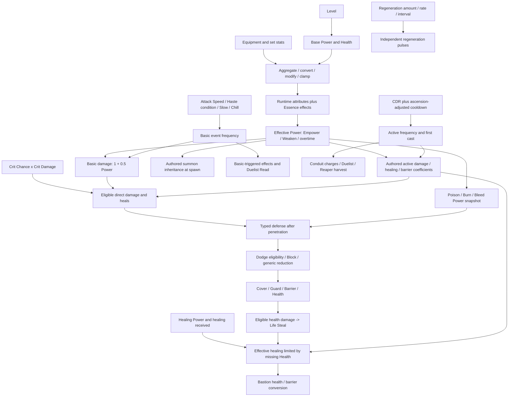

# Character attributes and equipment: analysis and redesign proposal

**Status:** review proposal; no gameplay implementation. **Date:** 25 September 2026. **Source baseline:** working tree at `c47cc3de1`; attribute/stat-unit version 17, equipment model version 2, combat-style content v9.

This review concerns the primary LL game, its combat engine, equipment content, persistence contracts and Angular game UI. It does not concern LL-Chat or infrastructure. Equipment acquisition below means current combat drops, dungeon rewards and current variant/reinforcement systems, not retired crafting or gathering.

**Evidence boundary.** Source inspection establishes implemented behavior. Analytic examples establish conditional mathematical comparisons, not measured player win rates. No production character, equip-rate or discard dataset was available. Accordingly, “dominant” below means dominant under stated conditions, not a claim that the live population has been measured. The proposed coefficients are concrete starting values for calibration, not a claim of simulated balance. Only Regions 1–2 and their ordinary equipment tiers are currently authored in the inspected regional catalogs; Region 10 is an explicit stress projection.

The existing [calculation script](attribute-equipment-calculations.py) and [reproducible evidence tables](attribute-equipment-evidence-2026-09-25.md) were present before this review and were preserved. Their current-source fingerprints and calculations reproduce exactly. Their “Proposed” tables describe the matching isolated candidates discussed below; they are not a simulation of the complete redesign.

## 1. Executive Summary

The game already has a formal stat budget, an attribute catalog, rating aggregation, equipment replacement projections, deterministic combat and a substantial balance harness. The solution is to improve the rules and calibration of those systems, not introduce parallel ones.

The principal problems are:

1. **Some weak stats do not do what their descriptions promise.** Standard conditions bypass both resistance duration functions. Custom timed statuses use resistance even when beneficial. Thus resistance can have zero value against ordinary Poison/Stun and negative value against a friendly timed status.
2. **Power has unusually broad coverage, while specialized multipliers have very different prices and eligible output.** Power scales attacks, most authored damage/healing/barriers, standard DoTs and multiple summons. Attack Speed costs 1 normalized budget per percentage point; Crit Chance costs 6. At base critical damage, +30% speed beats +5% crit whenever more than one sixth of eligible output is basic-attack-linked, before additional proc synergies.
3. **There are two modifier/cap systems.** Character preparation clamps attributes; `RuntimeCombatant.AdjustAttribute` adds values without those catalog clamps. Most consumers clamp locally, but critical damage and healing power do not enforce their catalog maxima at consumption. A catalog cap is not a reliable runtime contract.
4. **Defense mixes rating and effective-percentage units.** Equipment Armor/Resistance are ratings, normalized by character level, then converted to effective percentages. Subsequent set/ability modifiers operate on those percentages. Aegis says “rating” but multiplies the converted value. Penetration reverses the conversion; at exactly 80% defense the inverse sentinel can make penetration ineffective.
5. **Progression introduces an artificial loss of defense.** Fixed gear drops from 40% mitigation to 31.33% at a 50-level normalization boundary. Tier eligibility and normalization also differ by one level. Direct percentage affixes have no analogous level penalty.
6. **Cooldown Reduction and broad damage reduction have increasing returns in output rate/EHP.** Hard caps stop infinity but concentrate optimal allocation near caps. Ten Essences magnify cast-frequency, timing, proc and support interactions.
7. **Equipment is already structured, but structure is restrictive in the wrong places.** Stats are authored bundles, not independently randomized affixes. There is no ordinary Dodge source; many utility/sustain stats appear only in a small variant bonus. Crit Damage can appear before any Crit Chance. Set abilities add substantial unpriced value.
8. **Encounter and event rules matter as much as price.** Live actives start on cooldown. Short fights favor immediate basic attacks; long fights reward sustain and cumulative procs. Boss Stagger replaces some control. `ProcCoefficient` is validated and copied, but is not consumed by the fast engine, so it does not currently attenuate proc chains.

**Recommended direction:** keep Power as a core magnitude stat, keep Health and typed defenses, give items a 70% core/30% specialization allocation, replace direct CDR with linear ability haste, unify harmful-duration resistance as Tenacity, and retain 14 ordinary equipment stats. Move Dodge, generic Damage Reduction and Life Steal out of ordinary equipment into explicitly priced build mechanics. Keep separate physical/magical penetration. Keep the existing budget and drop architecture, with audited style/set opportunity costs. Fix status/cap/unit correctness first; then calibrate a versioned candidate with real Essence/Doctrine loadouts.

Two builds should choose different equal-budget items because their **eligible output, triggering events, required survival window, enemy damage/defense profile and Doctrine timing** differ. Sections 9 and 12 demonstrate actual decision reversals, rather than asserting identical DPS for every stat.

## 2. Current Attribute System

### 2.1 Sources, units and aggregation

There are **19 active enum attributes**, 18 eligible for equipment; Threat is not. Enum value 18 is retired and must not be reused. There is no separate Strength, Intelligence, mana pool, accuracy, shield-power, buff-duration or summon-power equipment stat. Damage bonuses, healing received, regeneration rate, barriers, threat state, Doctrine resources and conditions exist as combat mechanics outside `AttributeType`.

Player base attributes at level `L >= 1`:

```text
Power = 10 + 0.25(L - 1)
MaxHealth = 140 + 20(L - 1)
CritDamage = 100  (bonus %, therefore a normal crit is 2x)
HealthRegeneration = 2 HP/5 seconds
Threat = 100
Everything else = 0
```

`LevelingService` writes the level-derived values. Equipment, set modifiers and combat effects are the other actual stat sources traced. Essence attunement currently returns **no unconditional attribute modifiers**: `EssenceCombatLoadoutFactory` returns an empty modifier list. Essence stats come from active/passive effects during battle. Do not add a nonexistent passive “Essence stat budget” to comparisons. [S1–S4, S12]

Preparation uses:

```text
value = max(0, (base + sum(flat)) * (1 + sum(additive%)/100)
               * product(1 + each multiplicative%/100))
```

Flat modifiers on percentage attributes add **percentage points**. Additive modifiers multiply the underlying stat and add with one another. Multiplicative modifiers multiply independently. Ratings from distinct equipped items are summed before conversion. Two-handed items appear in both hand slots but are counted once. Set modifiers enter after equipment projection. Catalog minima are zero; preparation applies catalog maxima. Health is synchronized when MaxHealth changes.

**Runtime caveat applying to every row below:** fast-engine `ModifyAttribute` directly adds a calculated integer, and percent-of-initial effects add a delta from initial battle attributes. They do not route back through the preparation formula. Runtime values may cross metadata bounds; actual effective bounds are enforced only where the consumer does so. Timed effects remove their recorded contribution on expiry. This distinction prevents falsely documenting preparation caps as universal. [S3, S8–S9]

### 2.2 Complete stat inventory

`pp` means percentage points; `N` means normalized defense rating; `d(N)=0.8[1-2^(-(N/165)^1.1)]`. The equipment cost column is **normalized budget**, not raw numeric equality. For flat stats it buys the listed unit at tier 1 and proportionally more at higher tiers. Source availability is expanded in §3 and the evidence tables.

| Internal name | Player-facing name; base | Equipment cost/unit | Formula, consumption and scaling | Effective limits / diminishing returns |
|---|---|---:|---|---|
| `Power` | Power; `10+.25(L-1)` | 22.5/point | Basic raw damage `round(1+.5P)`; authored `base+kP`; healing, barriers, standard condition snapshots, summon inheritance. Linear magnitude; multiplicative with rate, crit, healing bonuses and penetration | Preparation >=0; effective Power >=0; no cap. Relative gain falls as existing Power rises |
| `MaxHealth` | Max Health; `140+20(L-1)` | .185/HP | Health capacity; health-scaled effects, summon health, cover budget, barrier ceiling, threshold conditions. Linear buffer, multiplicative with mitigation | Preparation >=0; no finite cap. Not all health costs or incoming effects are ordinary mitigable damage |
| `Armor` | Physical Damage Reduction on character; Armor Rating on gear; 0 | .9/rating | Sum raw ratings / character-tier scale -> `100d(N)`; Physical and Bleed mitigation. Nonlinear; then effective-percent modifiers | 80% preparation cap/asymptote. Runtime consumer caps through inverse conversion; not simple linear EHP |
| `Resistance` | Magical Damage Reduction / Resistance Rating; 0 | .9/rating | Same as Armor; Magical, Burn, Poison and Shadow | Same 80%; other damage types bypass typed mitigation |
| `CritChance` | Crit Chance / Critical Chance; 0 | 6/pp | Expected eligible output `1+c*k`, where `c=chance/100`, `k=CritDamage/100`. Basics and default direct active damage; default nonperiodic heals; eligibility overrides subject to the damage delivery gate | Consumer clamps 0–100 including effect bonus and Exposed's +10 pp. Periodic damage cannot crit even with `Allowed` because the outer gate requires Direct. No smooth DR; positive cross-synergy with crit damage |
| `CritDamage` | Crit Damage / Critical Damage; 100 | 2.2/bonus pp | Crit multiplier `1+max(0,bonus)/100`; condition-specific crit bonuses add | Preparation cap 500 bonus (=6x total). **Consumer has no 500 clamp**; runtime/conditional bonuses can exceed it. Worth zero without eligible crits |
| `ArmorPenetration` | Armor Penetration; 0 | 3.5/pp | Ignore `p` fraction of remaining normalized Armor before reconverting. Physical/Bleed output; source/effect bonuses add | Consumer 0–60%. No effect at zero defense; nonlinear marginal value, including near-cap pathology |
| `MagicPenetration` | Magic Penetration; 0 | 4/pp | Same against Resistance; magical and corresponding periodic damage | Consumer 0–60%; identical mechanical formula has a different equipment price |
| `DodgeChance` | Dodge; 0 | 30/pp | Avoid direct Melee/Ranged hit; probability `q`. Triggers OnDodge. Attack delivery, not damage school, determines eligibility | Consumer 0–40%; no ordinary authored base/style source. Expected eligible EHP `1/(1-q)` has increasing returns; variance matters |
| `BlockChance` | Block; 0 | 5.7/pp | Direct Melee/Ranged hit has probability `b` to halve typed damage. No engine shield requirement | Consumer 0–60%; block amount fixed 50%. Expected eligible EHP `1/(1-.5b)`; does not block spells merely because physical |
| `DamageReduction` | Damage Reduction; 0 | 6/pp | After typed defense and block: multiply remaining damage by `1-g`; broad damage-path protection | Preparation 0–40%; consumer allows **-100–40** (negative values amplify damage). EHP convex; health payments bypass ordinary damage mitigation |
| `HealingPowerPercent` | Healing Power; 0 | 4.5/pp | `RestoreHealth` multiplies by `max(0,1+h/100)`, including Life Steal; eligible heals can then crit. Does not amplify barriers or normal regen | Preparation cap 300. **No consumer 300 clamp.** Some explicit recovery paths pass `applyHealingModifiers:false` |
| `HealthRegeneration` | Health Regen; 2 HP/5s | 3/(HP/5s) | Pulse every 50 ticks by default. Regen-rate and interval effects alter frequency; Renewal/Decay and healing received alter amount | Amount >=0; no stat cap. Discrete pulses, missing-health/overheal ceiling. Does not use Healing Power or crit |
| `LifeSteal` | Life Steal; 0 | 8/pp | `(actual eligible health damage)*l`, then Healing Power and healing-received modifiers; no second healing crit | Combined attribute+effect percentage clamps 0–100. Basics and Direct damage-effect paths call it; periodic, stored and self-delivered damage do **not** |
| `Cooldown` | Cooldown Reduction; 0 | 7.5/pp | `max(1,ceil(C*(1-cdr/100)-1e-9))` ticks for positive active cooldown. Initial cooldown also reduced | Consumer 0–40%; authored 0 remains 0. Frequency `1/(1-cdr)` is convex; integer tick breakpoints. Does not reduce passive internal cooldowns through this stat |
| `StatusResistance` | Status Resistance; 0 | .82/pp | Custom non-Control status duration `max(1,ceil(T*(1-s/100)-1e-9))`; status-owned effect durations also scale | Consumer 0–80%; permanent durations unchanged. **Standard conditions bypass it; beneficial custom statuses can be shortened** |
| `CrowdControlResistance` | Crowd Control Resistance; 0 | .82/pp | Same duration formula for custom statuses tagged `Control.*` | Consumer 0–80%; **standard Freeze/Stun/Silence do not use it**; boss Stagger is a separate resource |
| `Threat` | Threat; 100 | Not on gear | Base attention plus combat threat generation/decay, taunt/mark/stealth. Weight approximately `(threat/median)^2.5`, clamped .05–20, then normalized across eligible targets | Runtime >=0; no fixed attribute cap. Relative party resource with targeting overrides; exponent applies to weight, not guaranteed target probability |
| `AttackSpeed` | Attack Speed; 0 | 1/pp | Basic rate factor `clamp(((1+a/100)/weaponInterval)*(1+.25Haste-.25Slow)*(1-.01Chill),.25,4)` | Preparation cap 300 pp; consumer rate cap 4x, floor .25x. Useful cap changes with weapon/conditions. Linear rate before ceiling; discrete attack timing |

**Combat-only quantities:** barriers start empty unless effects/Doctrine grant them; cumulative barrier cap is 250% MaxHealth. Healing received is an additive multiplier channel including Recovery (+30%) and Wound (-30%). Renewal/Decay change regen amount ±30%. Empower/Weaken change effective Power ±20%. Damage dealt/taken percentages add in the same pre-crit multiplier channel, rather than each independently multiplying. Corrosion removes up to 50% of the **effective defense percentage** before penetration. Guard removes 25% on eligible direct ability hits but basics explicitly cannot consume it. Vulnerable adds 25% and consumes a charge on a qualifying direct hit. These are not purchasable equipment stats. [S8–S10]

### 2.3 Damage, healing, condition and summon dependencies



This is a dependency map, not a complete temporal ordering: dodge happens before damage amplification; §5 gives the arithmetic pipeline. Summons do not inherit all owner stats. Current player-accessible examples: Shadow Image inherits .3 Power and owner CritDamage but no CritChance; its Shadow Strike has no authored crit bonus, so inherited CritDamage normally does nothing unless another effect supplies chance (such as Exposed on the target). Totemic Ward inherits .03 MaxHealth and full Power, and grants party barriers. Lightning Elemental inherits .1 MaxHealth, .3 Power, owner CritChance +20 pp and CritDamage, but starts at normal speed and does not respawn. Summon snapshots omit overtime Power to avoid recursively inheriting that multiplier. Boss-only summons are not evidence that players can use the same build. [S8, S10–S12]

Standard Poison: 12 seconds, tick every 2; Burn: 4 seconds, tick every 1; Bleed: 8 seconds, tick every 2. Each tick's raw damage is `PowerSnapshot*.01*conditionValue*castMultiplier`, rounded. Doom resolves stored damage or a Power snapshot on expiry. These standard paths cannot crit and do not call Life Steal. Explicit periodic `Damage` effects also cannot crit or steal life in the current fast engine: their delivery is Periodic, while both operations require Direct. `CanCrit` itself accepts an explicit `Allowed` flag, but that does not bypass the outer Direct-only damage gate. Periodic **healing** uses a different consumer and can opt into crits. This is an implementation distinction from apparently more permissive effect metadata.

### 2.4 Essence and Doctrine progression

Essence slots: `clamp(floor(level/10)+1,1,10)`; all ten unlock at level 90. Ascension tiers 0–3 scale selected effect coefficients: damage +12%/tier, healing/barriers +10%, attribute modifiers +8%; eligible duration +5% up to 15%; active and trigger internal cooldowns reduce 5%/tier up to 15%, generally with a one-second ascension floor. Integer rounding and standard-condition hardcoded durations mean authored scaling is not automatically effective duration scaling. At maximum ascension plus 40% gear CDR, a sufficiently long active cooldown is approximately `.85*.6=.51` of original, not `.45`. [S12]

The user's Doctrines are represented by **Combat Styles** in this checkout; four are required by validation:

| Doctrine | Actual identity | Stat interaction |
|---|---|---|
| Bastion | Ordinary healing recovery splits 25% Health /75% Barrier; opening barrier 5% MaxHealth; refinements change conversion, Reprisal or sharing | Health supports barriers/thresholds; healer throughput can become a barrier engine; Reprisal stores absorbed damage up to a Health-based cap. Normal regen directly adjusts health and does not automatically use this conversion |
| Conduit | First occupied Essence is channeled; other distinct Essence casts charge it (base cap 3); base channeled multiplier `.8+.2*charges`, plus mastery/refinements | Loadout order, cooldown ratios and eligible cast effects determine value; globally faster casting does not necessarily improve charge count per channeled cast |
| Reaper | An eligible active direct hit consumes future ticks of the owner's existing Bleed/Burn/Poison, delivering 110% of consumed damage plus mastery | Cast rate realizes damage sooner; it is not free duplication of all future DoT ticks. Crit on the triggering hit does not make stored harvest damage crit |
| Duelist | Basic/direct-damaging actions build Read; at 3 Read the next qualifying damaging Essence consumes it for 145% direct damage, subject to tuning; switching targets resets Read | Basic rate, cast timing, stable target and burst stats cooperate. Multi-target churn can make invested Read ineffective |

Descriptions are useful context; engine branches and resolved tuning are authoritative. Doctrine upgrades/mastery change these numbers. Snapshot their exact state when testing. [S13]

## 3. Current Equipment Itemization

### 3.1 Generation actually in use

Eight occupied slots: Head, Chest, Legs, Ring, Necklace, Relic, MainHand, OffHand. Nine equipment types distinguish OneHanded, TwoHanded and OffHand. A 2H item consumes two slots and gets twice a one-slot budget; two 1H items or 1H+offhand have the same combined baseline. All other slots currently have equal baseline budgets. There are no boots, gloves or second ring slots; “Gauntlets” is a two-handed weapon archetype. [S5–S7]

There **is a formal budget system**, with different prices for every stat:

```text
S(t) = 15.2^((t-1)/9)
B_base = 100*S(t)*slotUnits       slotUnits=2 for 2H, otherwise 1
B = B_base*rarity*quality*(1+.04*rank)*roll
rank = 0..5; roll = one shared uniform multiplier in [.95,1.05)
new styled item budget = 1.15*B

flat/rating amount = allocatedBudget / cost
direct percentage amount = allocatedBudget / (cost*S(t))
```

Rarity factors Common/Uncommon/Rare/Epic/Unique/Legendary/Legacy: **1/1.1/1.3/1.6/2/2.5/3**. Quality Crude/Standard/Fine/Exceptional/Masterpiece: **.90/1/1.12/1.26/1.42**. Tier 10 one-slot baseline is 1,520. Rarity changes magnitudes, not a random affix count. Tier increases flats and raw ratings, while direct percentage values stay constant at equal rarity/quality/rank. Maximum combined rarity/quality/rank/roll/style factor is about **6.17274**, so cap interactions already occur without Region 10. [S5–S6]

The allocator normalizes positive weights, distributes budget, respects **per-item** caps, and redistributes overflow according to authored weights. The evaluator currently passes an empty list of cross-stat linear constraints. It does not know the character's existing caps or build. MaxHealth rounds to whole HP; other equipment quantities round to two decimals. Rounding can create a small difference between target and materialized spend, so use tolerances when auditing.

New style variants **add** a 15% bonus allocated from style weights, preserving the base. Historical `AdditiveVariantBonus=false` variants instead partition 85% base/15% style within the same budget. Frozen item descriptors preserve rolled stats, model/balance version, base stats, ownership, provenance, quality, rank and style. Do not silently reinterpret those historical items. [S6, S17]

### 3.2 Slot pools and stat counts

No independent “pick three random stats” occurs. Randomness selects an authored archetype/variant and its quality/magnitude. An unstyled archetype has **1–4 distinct stats**; the union with a compatible style reaches **7** (e.g. Spirit Tower Shield), before separate set effects. There is no formal core/secondary category in the allocator, although weapon profiles often use 70% Power/30% one other stat.

| Slot/type | Authored base allocation |
|---|---|
| Head, Chest, Legs | Heavy: 40% Health/30% Armor/30% Resistance. Medium: 35% Power/25% Health/20% Armor/20% Resistance. Light: 70% Power/10% Health/10% Armor/10% Resistance |
| Ring | 100% Power |
| Necklace | 100% Health |
| Relic | 100% Regeneration |
| Shortsword / Greatsword / Longbow | 70% Power, 30% Crit Chance; greatsword/longbow use two slots |
| Dagger / Spear / Gauntlets | 70% Power, 30% Attack Speed; last two are 2H |
| Hatchet / Battle Axe | 70% Power, 30% Crit Damage |
| Mace / Maul / Crossbow | 70% Power, 30% Armor Penetration |
| Wand / Staff | 70% Power, 30% Magic Penetration |
| Tower Shield / Spirit Ward | 35% Health, 35% Block, 30% Armor or Resistance |
| Grimoire | 70% Power, 30% CDR |

The evidence appendix lists all 28 exact tier-1 profiles and every style's compatible archetypes. All currently authored base attack interval/damage multipliers are 1, so a dagger's speed comes from its stat, not a faster hidden weapon baseline.

Style weights, as shares of the **15% bonus**, are:

| Style | Stat bundle |
|---|---|
| Fury | Power .45, Crit .30, CritDamage .25 |
| Arcane | Power .35, MagicPen .25, CDR .20, Crit .20 |
| Execution | Power .35, ArmorPen .40, CritDamage .25 |
| Aegis | Armor .25, Resistance .25, Health .35, DamageReduction .15 |
| Warden | Health .35, CCResistance .25, Armor .20, Regen .20 |
| Endurance | Regen .35, Health .30, Armor .20, StatusResistance .15 |
| Phoenix | Regen .35, HealingPower .25, Health .20, StatusResistance .20 |
| Spirit | HealingPower .35, Resistance .25, CDR .20, Regen .20 |
| Primal | Health .30, CCResistance .20, Power .50 |
| Venom | Power .30, LifeSteal .25, Crit .25, AttackSpeed .20 |
| Hive | AttackSpeed .30, StatusResistance .25, Crit .25, LifeSteal .20; dagger only |

Eligibility is a compatibility list, not a global offensive/defensive affix rule. Dodge is equipment-eligible in metadata but appears in **zero** base profiles, styles or set-stat entries. Other rare sources must not be inferred just because the enum allows them. Sets activate at 2/4, sometimes 6 occupied slots; a 2H contributes two. Set stat bonuses and granted abilities are additional value **outside the item allocator**. [S7, S14]

### 3.3 Drop randomness and quality

Ordinary area rewards use deterministic encounter identities for stable random streams. Current selection weights are weapons 40%, armor 35%, jewelry 25%; weapon selection uses 60% one-handed/offhand and 40% two-handed, then uniform selection within the chosen eligible group. Missing groups redistribute probability. This makes expanding one group change individual archetype availability without changing its category probability.

Region pools set tier directly (currently Region 1 -> tier 1, Region 2 -> tier 2). Area drops are rank 0; dungeon equipment rank 1. The inspected area profile chance is approximately .0011574 per eligible encounter. Dungeon completion base chance .5, miniboss .25; mastery adds completion chance. Dungeon grade shifts rarity ranges. Quality probabilities are .125/.5/.25/.1/.025; one magnitude roll affects all item stats together. Variant chances in the blueprint catalog are .15 area/.5 dungeon, filtered to source-compatible styles. Current blueprints change variants on dropped equipment; they are not the removed crafting system. [S7]

This architecture already prevents many nonsensical random combinations, but a bad **authored bundle** is reproduced consistently. Examples: CritDamage with zero CritChance; Venom/Hive pairing Life Steal with standard Poison that cannot itself steal life; a healing variant on a build with no eligible healing; a seventh desired set slot adding no new threshold; a high-rarity item spending heavily into already capped character stats.

## 4. Mathematical Problems

### 4.1 Correctness defects must precede tuning

| Finding | Actual path / consequence | Required correction |
|---|---|---|
| Standard conditions ignore duration resistance | `ApplyCondition` uses fixed or value-derived timers, then `AddIndependentCondition`; neither calls resistance. Poison/Slow/Stun are not shortened | One explicit condition-duration resolver for both condition systems |
| Beneficial custom status shortened | `CalculateStatusDuration` selects non-Control resistance for every timed status, including `status.transparent_dodge_boost` | Explicit beneficial/harmful/control classification; beneficial timers unchanged |
| Custom harmful tags inconsistent | Harm check uses prefixes `Debuff`/`Affliction`; authored examples use `Status.Debuff` or `Status.Curse` | Validate explicit classification; audit Ward/Cleanse as well as durations |
| Runtime caps incomplete | Direct attribute mutation can exceed preparation caps; crit/healing consumers have no maximum clamp | Preserve raw contributions, clamp the effective value once at consumption/projection; do not clamp each applied delta and corrupt expiry |
| Periodic damage crit override is ineffective | `CanCrit(Allowed)` is nested inside a Direct-only damage gate | Keep periodic damage noncrit for this candidate and reject misleading `Allowed` content on that delivery; add a separate explicit mechanic only if intentionally designed |
| Defense unit mismatch | Equipment becomes percentage before multiplicative set bonus; Aegis's stated rating bonus changes effective reduction instead | One explicit rating channel, separate bounded conditional damage modifiers |
| Penetration fails at exact defense cap | Inverse(80%) -> `double.MaxValue`; special branch keeps it unchanged by penetration | Keep finite raw rating until contested; no inverse-from-clamped-value path |
| Proc attenuation field inactive | `ProcCoefficient` is copied/validated but has no fast-engine consumer | Define one event-propagation meaning, implement deliberately with compatibility version; do not merely multiply every damage value |

These are source findings, not newly added failing regression tests. Existing passing tests cover custom status resistance and metadata, so they do not disprove the standard-condition gap. [S3, S5, S8–S10]

### 4.2 Convexity, thresholds and nonlinear coupling

**CDR:** output-limited rate `1/(1-c)`. Going 0->10% yields 11.11% more casts; 10->20 yields 12.5%; 20->30 yields 14.29%; 30->40 yields 16.67%, relative to each interval's start. Higher marginal return encourages finishing the cap. It also changes first-cast time, because production starts actives on cooldown.

**Damage Reduction / Dodge:** eligible EHP has the same `1/(1-x)` convexity, unlike a linear health buffer. A broad DR stat multiplies defenses, barriers and recovered health; it can displace more specialized defenses. At 40% typed mitigation, 40% generic DR, 40% dodge and 60% block, expected direct blockable/dodgeable incoming fraction is `.6*.6*.6*.7=.1512`: **6.61x health-equivalent buffer** before shields/healing. Spell/periodic pressure does not get all four factors.

**Typed mitigation:** the exponent 1.1 gives a small increasing marginal segment near zero rating; the derivative starts at zero. Diminishing reduction percentage later does not automatically mean diminishing EHP. At normalized rating 165/330/660, mitigation is 40/61.89/76.69%, and typed EHP is 1.667/2.624/4.290 times Health. Near the 80% asymptote, penetration's relative value becomes nonmonotonic: it is not always more valuable against a more armored target.

**Exact timing:** 10 engine ticks/second; default base attack interval 30 ticks. At 0% speed attacks average one per 3 seconds; +100% one per 1.5 seconds; ceiling one per .75 seconds on average, with 7/8-tick spacing from the accumulator. It is **4x baseline, not four attacks per second**. Progress is retained, so do not model each attack as `ceil(30/rate)` independently. Finite fights still have extra-attack breakpoints.

CDR has `ceil` boundaries; for a 30-tick ability, <3.333...% CDR saves no tick, the next threshold saves one. A 1-tick status cannot be shortened below 1. Regeneration initially contributes no recovery before its first pulse unless an effect advances frequency. DoTs cross whole-tick-count breakpoints. Periodic proc internal cooldowns, every-Nth attacks, charge caps, summon caps and changing targets add distinct plateaus. Durations expressed as charges rather than time cannot be balanced by “seconds saved.”

**Feedback:** faster attacks can generate Poison, Read, healing or other attacks, while Power increases several outputs produced by that event stream. CDR accelerates up to ten actives and Conduit charge providers. Crit-triggered Power (Fury) improves later crits. Life Steal converts already-amplified offense into sustain and then receives Healing Power. A recursion guard at depth 64 is a crash defense, not a balance limit. [S8–S14]

## 5. Attribute Value Analysis

### 5.1 Evaluation objectives and formulas

Evaluate a vector rather than one score:

```text
{time to first useful action, effective DPS, effective healing, absorbed barrier,
 burst survival, time alive, ally survival, enemy action denial,
 win probability, clear time, damage school coverage, outcome variance}
```

For a smooth offensive screen, define `U(P)=b+kP`, crit chance `c`, bonus crit multiplier `kcrit`, attack-linked fraction `fB`, cast-linked fraction `fA`, and eligible-crit fraction `fC`. Fractions describe the selected build and encounter; they are not constants for the whole game.

```text
Basic DPS ≈ (1+.5P) * (attackRate/3) * (1+c*kcrit) * outgoingFactors
            * (1-d(N*(1-penetration))) * remainingDefenseFactors
Ability DPS ≈ sum(actual casts of ability j * effective damage per cast j)/fightSeconds
DoT output ≈ sum(surviving/harvested ticks * snapshot damage * mitigation)
Summon output ≈ sum(alive seconds * summon-specific rate/output), plus utility

small-change d(log eligible crit output)/d(crit pp) = kcrit/[100*(1+c*kcrit)]
d(log eligible crit output)/d(crit-damage pp) = c/[100*(1+c*kcrit)]
d(log Power-scaled output)/dPower = k/(b+kP)
d(log basic rate)/d(speed pp) = 1/(100+speed pp), before ceilings
```

Divide a derivative by the stat's materialized price, multiply by eligible-output exposure, and include effects on other objectives. Discrete finite differences through the engine supersede these derivatives near thresholds. A build whose crit-eligible damage is 20% cannot claim the full crit gain on total output.

For homogeneous incoming hits, a useful average EHP screen is:

```text
EHP ≈ (Health + useful pre-existing barrier)
       / [(1-typedMitigation)*(1-genericDR)*(1-dodge)*(1-.5*block)]
```

Include dodge/block only for eligible hit deliveries. With mixed incoming schools/types, calculate each damage stream separately and add **residual damage rates**; do not average physical and magical EHP. For sustained pressure, approximate `timeToDeath ≈ buffer/(incomingAfterDefense-effectiveRecovery)` only when rates are stable and the denominator is positive. Nonpositive denominator means this stationary model predicts sustain, not immortality against burst, control or enrage. Quantiles of survival matter more than expected EHP for a fragile character with Dodge.

Healing is `min(missing Health, rounded eligible heal*(1+HealingPower)*crit*(1+healingReceived))`, subject to Doctrine conversion. Barrier value is damage actually absorbed before expiry, capped by capacity. Life Steal uses actual eligible health damage, not raw damage, overkill or barrier absorption. Regen has a separate pulse/frequency formula. Health also raises barrier capacity and some authored damage/heal/summon effects, so it is not merely redundant Armor.

Utility remains multidimensional: count harmful ticks prevented, seconds of usable actions recovered, lethal casts interrupted, ally deaths prevented, target-selection stability and resource/cast opportunities. There is a resource enum including Mana, but the live payment path cannot pay Mana costs; no Mana regeneration item stat exists. Doctrine charges, cooldown restoration, Health and Barrier costs need dedicated accounting. Movement speed is not an applicable combat attribute. [S8–S13]

### 5.2 Equal-budget marginal returns for every equipment stat

Reference: tier 1, Power 20, Health 2,000, normalized Armor/Resistance 165; zero other percentages except base CritDamage 100. CritDamage's row uses 20% CritChance so it has a nonzero effect. These are deliberately isolated comparisons, before rounding, event feedback, overheal and tick ceilings. Percentage gains are relative to the beginning of each spending interval. Columns spend the **first 10, next 10, then next 50 normalized budget**. Different objective units are not interchangeable.

| Stat | Objective | 0–10 B | 10–20 B | 20–70 B |
|---|---|---:|---:|---:|
| Power | Power-scaled output gain % | 2.222 | 2.174 | 10.638 |
| Health | EHP gain % | 2.703 | 2.632 | 12.821 |
| Armor | Physical EHP gain % | 3.463 | 3.423 | 17.514 |
| Resistance | Magical EHP gain % | 3.463 | 3.423 | 17.514 |
| Crit Chance | Eligible direct output gain % | 1.667 | 1.639 | 8.065 |
| Crit Damage | Eligible output gain % at 20% crit | .758 | .752 | 3.731 |
| Armor Penetration | Physical output gain % vs 40% defense | 1.466 | 1.472 | 7.669 |
| Magic Penetration | Magical output gain % vs 40% defense | 1.281 | 1.286 | 6.666 |
| Dodge | Eligible EHP gain % | .334 | .336 | 1.707 |
| Block | Eligible EHP gain % | .885 | .893 | 4.673 |
| Damage Reduction | Damage-path EHP gain % | 1.695 | 1.724 | 9.434 |
| Healing Power | Eligible HPS gain % | 2.222 | 2.174 | 10.638 |
| Regeneration | Additional HP/s | .667 | .667 | 3.333 |
| Life Steal | Additional HP/s per 100 eligible DPS | 1.250 | 1.250 | 6.250 |
| CDR | Cooldown-limited rate gain % | 1.351 | 1.370 | 7.353 |
| Status Resistance | Seconds saved from 10s custom status | 1.220 | 1.220 | 5.561 |
| CC Resistance | Seconds saved from 10s custom control | 1.220 | 1.220 | 5.561 |
| Attack Speed | Basic rate gain % | 10.000 | 9.091 | 41.667 |

For both resistance rows, savings against standard conditions are currently **zero**. A beneficial custom status gives an undesirable reduction, so even the sign depends on the path.

The requested raw **first 10 points, next 10, next 50 points** are also useful, but have unequal prices:

| Stat | Objective as above | +0–10 units | +10–20 units | +20–70 units |
|---|---|---:|---:|---:|
| Power | output % | 50.000 | 33.333 | 125.000 |
| Health | EHP % | .500 | .498 | 2.475 |
| Armor / Resistance | typed EHP % | 3.113 | 3.081 | 15.749 |
| Crit Chance | output % | 10.000 | 9.091 | 41.667 |
| Crit Damage | output % | 1.667 | 1.639 | 8.065 |
| Either penetration | output % | 5.254 | 5.323 | 23.461 |
| Dodge / Damage Reduction | eligible EHP % | 11.111 | 12.500 | 33.333 |
| Block | eligible EHP % | 5.263 | 5.556 | 28.571 |
| Healing Power | healing % | 10.000 | 9.091 | 41.667 |
| Regeneration | added HP/s | 2 | 2 | 10 |
| Life Steal | added HP/s per 100 eligible DPS | 10 | 10 | 50 |
| CDR | rate % | 11.111 | 12.500 | 33.333 |
| Either resistance duration stat | custom seconds saved | 1 | 1 | 5 |
| Attack Speed | rate % | 10.000 | 9.091 | 41.667 |

Caps are included; e.g. CDR's last interval stops gaining at 40, penetration at 60. Threat has no gear price: at a fixed median 100, Threat 100/110/120/170 produces weights 1/1.269/1.577/3.768 before probability normalization and targeting overrides. More Threat is desirable for a tank and harmful for some supports. [Calculation evidence]

### 5.3 Crossovers that explain actual decisions

* At zero crit and base 100 bonus CritDamage, **+1 pp Crit = +1% eligible output for 6 B**. The same budget buys +6% basic rate, so speed wins when `fB > fC/6`. It buys .267 Power: at Power 20 that is +1.333% pure Power-scaled output, or +1.212% basic damage because basics include a constant 1.
* A point of CritDamage costs 2.2 B. It beats CritChance per budget when `c > (2.2/6)*kcrit`. At base bonus `kcrit=1`, the crossover is **36.67% CritChance**. At zero chance, the hatchet's secondary has no damage value at all.
* +1 pp penetration raises eligible damage by about **.114% at 10% target mitigation, .510% at 40%, .768% at 60%, .235% at 79%**. Price and eligible damage share then decide whether it beats Crit/Power. There is no universal penetration priority.
* One budget of current Regen adds `1/15` HP/s. One budget of Life Steal adds `.00125*eligibleDPS` HP/s before Healing Power. They cross at **53.33 eligible DPS**. Overheal, burst, blocked attacks and standard DoTs shift the realized result. This is a structural offense-to-sustain feedback loop, not just a small numeric discrepancy.
* Health versus typed defense depends on current Health, existing rating, incoming school mix and penetration. At the reference, Armor wins same-school EHP per budget; against bypass damage, Armor yields zero and Health remains useful. A party healer further raises the practical value of mitigation by making every restored HP last longer.

## 6. Dominant Attribute Analysis

**Attack Speed is the leading cheap multiplier for attack-driven builds**, especially early while actives wait on initial cooldown. Venomous Snake's 12% Poison application on basic attacks and Goblin Warrior's every-third-attack bonus expose much more than basic weapon damage to speed. Duelist adds another route into active burst. Treating attack speed as only `.5P` weapon DPS understates it.

**Power is the widest magnitude stat.** The authored Essence inventory contains 167 directly referenced abilities and 235 direct effects: 93 use Power explicitly, 8 Health, 2 Armor and 2 Resistance; additional standard-condition and summon paths also use Power. Counts are coverage, not weighted strength. Power is not literally universal: fixed charges/control durations, no-damage utility and some Health/defense scaling do not benefit. Nevertheless, “give the healer Power” frequently also buys damage and barriers, and “give the damage dealer Power” can buy healing or summons. Removing all optional Power choice would also erase legitimate hybrids; separating core allocation is preferable to inventing three interchangeable main stats.

**CDR becomes more broadly valuable as loadouts fill**, but not for every proc. It can improve ten active schedules, first-action timing, healing, barriers and repeated summon opportunities. Passive internal cooldowns and innate once-per-battle summons do not gain direct frequency from equipment CDR. Conduit and Reaper make simple DPS derivatives incomplete.

**Crit is build-dependent, not a proven global best.** CritChance+CritDamage+Fury produces compounding benefits, but ordinary DoTs, many passive hits and barriers do not get default crits. Crit also amplifies direct healing, making it broader than an exclusively offensive multiplier. Boss/control encounters can reverse priorities.

**Generic DR is a universal defensive candidate once accessible**, while typed defenses and Health have clearer encounter roles. Its current scarcity does not remove the structural problem: adding more DR sources later could create an easy cap-first priority.

The expected priorities can therefore shift from cheap speed early, to cast/crit synergy with full loadouts, to penetration/defense/sustain against a specific hard encounter. These are hypotheses grounded in formulas; player telemetry is needed to establish their actual prevalence.

## 7. Redundant / Weak Attribute Analysis

| Stat/problem | Why it can underperform | Design conclusion |
|---|---|---|
| Dodge | 30 B/pp, limited delivery coverage, random survival, no ordinary sources | Keep as an explicit evasive Essence/Doctrine mechanic; remove misleading ordinary gear eligibility |
| Block | Same delivery restrictions; fixed half-hit reduction; generic DR often covers more for comparable cost | Keep a predictable defensive build option, expose eligibility, price within a restricted defensive pool |
| Status and CC Resistance | Important promised role is absent on standard conditions; two small affixes split demand; some effects are actually harmed | Fix classification and application; merge ordinary itemization into one Tenacity stat |
| Crit Damage | No output at zero CritChance; starter hatchet/axe do not supply that chance | Keep a specialization with an authored compatible crit source/bundle, not an arbitrary isolated low-level affix |
| Healing Power | Power already improves healing plus many other outputs; no barriers, no regen; actual overheal can erase value | Specialize into explicit Restoration for authored healing/barriers; remove Life Steal amplification |
| Regen | Delayed first pulse, weak against burst, fixed per-time output versus offense-scaled leech | Keep independent recovery for durable low-offense builds; do not make it secretly scale with attack output |
| Life Steal | Competes with Regen only when able to deal eligible health damage; scales with all offensive multipliers | Move to explicit Essence/Doctrine effects with declared eligibility and limits |
| Armor / Resistance | Need correct school; percentage/rating presentation differs; level-boundary loss; buffs can bypass rating curve | Keep distinct defenses, fix units/normalization. Different enemy damage profiles provide a real reason to choose |
| Penetrations | No value against low defense; Corrosion can substitute; nonmonotonic near defense cap | Keep typed opposition, remove inverse/sentinel behavior; show target context |
| Health | May lose stationary same-school EHP contest but survives burst/bypass/control and scales several effects | Keep; do not collapse into defense or imply all health-heavy items are traps |
| Threat | Non-monotonic player benefit, strong dependence on party role | Remain an ability/Doctrine/targeting system, outside ordinary loot |

The proposed ordinary pool removes three existing item affixes and merges two, rather than adding dozens of new stats. Raw damage bonuses, shielding capacity, summon count, proc chance, duration and resource generation remain authored mechanics. Their powerful effects are paid through Essence slots, Doctrine choices and a separately audited set allocation.

## 8. Proposed Attribute Architecture

### 8.1 Core power versus specialization

Retain Power, Health and typed defense as understandable core quantities. Do not split Power into Strength/Intelligence or add a new universal “Potency.” Such a split mostly changes item compatibility while leaving the same multiplicative problem. Instead, **70% of each item budget establishes its core identity; 30% purchases a specialization**. Power cannot consume the specialization allocation. A player can still choose a light core for offense, heavy for durability or medium for a hybrid.

Keep the count of ordinary item stats to **14**:

1. Power, MaxHealth, Armor, Resistance.
2. CritChance, CritDamage, ArmorPenetration, MagicPenetration, AttackSpeed.
3. BlockChance, HealthRegeneration, Restoration, AbilityHaste, Tenacity.

Restoration is the revised role of `HealingPowerPercent`, not a second competing healing stat. AbilityHaste replaces equipment `Cooldown`; Tenacity merges equipment Status/CCResistance. Dodge, generic DamageReduction, LifeSteal and Threat remain internal/ability mechanics, not randomly awarded gear stats. Keep old identifiers readable in historical data; introduce explicit identifiers for changed units instead of renaming stored CDR percentages into haste points.

### 8.2 Proposed formulas

```text
Power/Health/base level growth: initially unchanged
core and specialization amounts: materialize from budget, as in §9

ArmorNormalized = sum(itemArmorRating / S(itemTier)) + normalized rating contributions
ResistanceNormalized = same for Resistance
typed mitigation m(R) = 0.8*R/(R+165), R>=0
net R = max(0, R*(1-corrosionFraction)*(1-typedPenetrationFraction))

basic rate: keep current accumulator and explicit Haste/Slow/Chill factors
crit: eligible output multiplier 1 + chanceFraction*bonusCritFraction

AbilityHaste h: activeCooldownTicks = max(1,ceil(ascendedTicks/(1+h/100)-epsilon))
positive authored extra cooldown costs join ascendedTicks before this conversion
authored zero cooldown stays zero; passive internal cooldowns are not affected by gear haste

eligible authored heal or barrier: base magnitude*(1+Restoration/100)
Life Steal, regeneration, health transfer and percent-Health cost refunds: no Restoration
crit eligibility stays explicit; barriers do not crit by default

Tenacity t: harmful timed duration=max(1,ceil(authoredTicks*(1-t/100)-epsilon))
beneficial/permanent/charge-only effects unchanged; no application-chance reduction
```

**Defense normalization is by each item's recorded tier, not character level.** Its raw rating still scales with tier for item presentation and currency accounting; its normalized protective allocation does not spontaneously decay on level-up. This deliberately gives defense the same tier-neutral behavior as other secondary percentages. Higher tier still improves Health/Power/Regen; rarity, quality, rank and allocation shape defense. An older high-quality item can remain useful for defense, just as older direct-percentage gear can today. Test that retention explicitly rather than secretly penalizing level-ups.

Why this defense curve: it preserves 40% at 165 rating, has a useful first point, and has strictly decreasing EHP marginal value: `EHP/HP=(R+165)/(.2R+165)`. Rating 330 now means 53.33% mitigation rather than 61.89%; 660 means 64% rather than 76.69%. It reduces extreme stacking while improving low investment. It is not an all-purpose buff. Keep raw finite rating through the hit calculation and expose the effective percent separately. All percentage changes described as “Armor” act on rating; explicit damage-reduction mechanics stay separate. Corrosion becomes a rating reduction, with its numeric cap initially unchanged, and needs content recalibration.

A bounded defense curve still makes very small fractional penetration less useful at enormous ratings. That is a real consequence of the chosen bounded model, not fully cured by changing curves. The redesign removes the **exact-cap inverse sentinel** and makes the finite rating transparent. Use high-defense encounter targets within a calibrated range instead of pushing every enemy arbitrarily close to the asymptote.

Ability haste removes the reciprocal marginal-return incentive from the purchased unit: +10 haste gives +10% cooldown-limited rate before caps/tick rounding. It does not eliminate first-cast thresholds, Conduit scheduling or the value of extra actions. Preserve the current maximum effective reduction of 40% as a safety envelope (`h <= 66.6667`), rather than simultaneously increasing maximum casting frequency.

Restoration gives healers and barrier supports a deliberate specialization. Excluding lifesteal breaks the universal damage -> recovery -> healing-multiplier chain. Regen remains independent recovery, useful while unable to attack or cast. Do not add summon scaling to Restoration: Totemic Ward's own barrier output would use its own explicitly inherited stats; owner Restoration should not silently pass through summons.

Tenacity applies to standard and custom harmful timed effects, including Stun, Freeze, Silence, Slow, Chill, Weaken, Wound, Decay and timed DoTs. Mark follows its explicit harmful classification; Taunt is an attention mechanic with authored semantics rather than automatically a debuff. Doom needs special treatment: simply shortening its timer would accelerate harmful damage. For Doom, Tenacity reduces stored expiry damage by the same fraction while retaining its original countdown. Indefinite Vulnerable/Soaked stacks remain charge mechanics countered by consumption/cleanse, not duration. Boss Stagger remains separate and is clearly labeled as unaffected. These exceptions must be declared in condition metadata, not scattered across ability IDs.

### 8.3 Proc and recovery boundaries

Use the already-authored effect/trigger system, with explicit event eligibility:

* Root basic/active actions emit full-strength events; secondary proc effects do not recursively emit full-strength attack/crit/cast events by default.
* Give `ProcCoefficient` one meaning: scale the downstream trigger opportunity of the originating hit/event, once. Zero must mean no downstream proc opportunity, not be silently converted to one. Do not use it as a hidden damage multiplier. Periodic effects explicitly opt into eligible listeners and carry their coefficient.
* A listener may activate once per root action unless its definition explicitly says per target/per tick. Every-third-attack abilities continue counting natural basic actions. Explicit repeat/echo mechanics declare whether they create a new action opportunity.
* Preserve meaningful on-hit/on-crit builds; do not flatten all procs into a fixed proc-per-minute system. Internal cooldowns belong on mechanics whose output is too sensitive to event density.
* Life Steal abilities declare which damage events qualify, exclude secondary recursion and standard DoTs unless explicitly opted in, and receive no Restoration bonus. Existing caps remain consumer safeguards. Individual ability cooldowns, magnitude and slot cost carry the balance; no new blanket healing hard cap is proposed.

This is a prospective behavior change and requires a new combat ruleset version. It is not a claim that current `ProcCoefficient` values already implement these rules.

## 9. Proposed Itemization Budget

### 9.1 Currency and weights

Keep `S(t)`, slot budgets and the current rarity/quality/rank multipliers for the **first calibrated candidate**. Separating formula changes from economy rarity changes makes the outcome attributable and reduces migration shock. There is no evidence yet that rarity ratios themselves should be replaced. Keep one shared roll; do not add independently lucky affixes on top of every existing multiplier.

| Attribute | Purpose and proposed formula | Normalized item cost | Cap / DR | Main users | Opportunity cost |
|---|---|---:|---|---|---|
| Power | Shared magnitude; current coefficients | 22.5/point at tier 1 | Linear, no cap | Damage, hybrid, summoner, baseline support | Core Health/defenses; cannot buy it from specialization budget |
| MaxHealth | Buffer, thresholds, barrier capacity, authored scaling | .185/HP at tier 1 | Linear, no cap | Tank, burst survival, Health-scaled support/summons | Power or typed defense core |
| Armor | `80R/(R+165)` physical reduction % after opposition | .9/normalized rating | Smooth asymptote 80% | Physical-pressure tank/bruiser | Magical protection or Health |
| Resistance | Same for magical families | .9/normalized rating | Same | Magic/DoT-pressure survival | Physical protection or Health |
| CritChance | Chance for explicitly eligible events | 4/pp | 0–100%; no extra DR | Direct burst, direct heal, eligible summon inheritance | Attack/cast frequency or penetration |
| CritDamage | Bonus critical multiplier | 2/bonus pp | 500 bonus safety cap at consumer | Established crit build | Poor before chance; cannot justify damage on noncrit events |
| ArmorPenetration | Ignore fraction of remaining Armor rating | 1.5/pp | 60%; target-dependent | Physical/Bleed offense against defense | Crit/speed; zero benefit against unarmored targets |
| MagicPenetration | Ignore fraction of remaining Resistance rating | 1.5/pp | 60%; target-dependent | Magical/Poison/Burn offense | Crit/haste; no healing/barrier benefit |
| AttackSpeed | Current basic rate and accumulator | 2/pp | 4x contextual rate ceiling | Basic/proc/Duelist builds | Crit or cast specialization |
| BlockChance | Chance to halve eligible direct hit | 3/pp | 60%, fixed 50% block | Sustained attack-pressure defender | Health/typed defense; no spell/periodic protection |
| HealthRegeneration | Independent health per five seconds | 3/(HP/5s) at tier 1 | Linear; useful recovery capped by missing health | Attrition tank, low-offense solo build | Burst buffer, Restoration or Tenacity |
| Restoration | Authored healing and barriers, excluding regen/leech/refunds | 3/pp | 300% consumer safety cap | Healer/barrier support | Crit/haste; no personal damage benefit |
| AbilityHaste | Active rate bonus; `C/(1+h/100)` | 4/haste point | 66.6667 points = current 40% CDR envelope | Repeated active healing/control/damage; some summons | Basic rate or per-cast magnitude |
| Tenacity | Harmful-duration fraction; explicit Doom exception | 1.5/pp | 80%, 1-tick floor | Disrupted tank/support, PvP counter-build | Recovery/output; zero against encounters without relevant effects |

These are **versioned calibration seeds**, selected from conditional derivatives rather than universal DPS equivalence:

* At Power 20, 30 core budget buys +1.333 Power, approximately +6.67% pure Power output; it improves more than healing. Thirty specialization budget buys +10% Restoration, which improves a narrower set including barriers. A specialist can rationally choose Restoration while a hybrid chooses a higher-Power core.
* Thirty specialization budget buys +15% basic rate, +7.5 pp crit, or +7.5% active rate. Different eligible fractions choose different winners. Crit retains CritDamage synergy; haste retains control/summon/first-cast value.
* Under the proposed defense curve, 30 B buys +20 pp penetration: +1.99% damage against 10% mitigation, +7.41% against 40%, +8.82% against 60%. The 1.5 price follows the changed curve: retaining the old 3.5/4 prices after reducing penetration's payoff would make it broadly unattractive. Against 40% defense, its initial derivative is about .335% output/pp; 1.5 B/pp gives .223%/B, versus crit's .25%/B at zero chance/base bonus. This is a close contest only in the appropriate damage school, not equivalence everywhere.
* At 165 rating, 30 B of typed defense yields about +6.51% same-school EHP; 30 B of Block gives +10 pp block or +5.26% eligible EHP from zero. Block covers both damage schools when delivered as attacks; typed defense covers that school's spells/periodic effects. Thirty B of Health gives +162.16 HP, +8.11% at Health 2,000, but smaller relative gains on larger health pools.
* Tenacity's price is a utility hypothesis: 30 B prevents about two seconds of a ten-second timed harmful effect, before tick rounding and overlap. Its launch price must be calibrated on action denial and survival, not assigned an arbitrary DPS equivalent.

No static weights remain optimal for every loadout. The intended invariant is that weights describe **budget spent**, while simulations and telemetry describe **value obtained**. Do not make the generator reprice a stat for the current buyer; that creates trade/exploit problems and obscures item identity.

### 9.2 Total budget and slot rules

```text
CoreBudget = .70*B
SpecializationBudget = .30*B
StyleStatBudget = .15*B when styled (same 15% increment as current drops)
TotalStatBudget = B or 1.15*B
```

Rarity does not add mandatory affix lines. Core funds only Power/Health/Armor/Resistance, except a regeneration relic's authored core. Specialization buys one stat or one small authored paired profile. Style stats obey the same slot and exclusion rules and share premium restrictions with the specialization; they are not an escape hatch for every multiplier. Style abilities/set thresholds need a separate, visible identity allowance (§10).

| Tier | One-slot baseline | Two-hand baseline | Rare/Fine/rank 3/styled one-slot, roll 1 |
|---|---:|---:|---:|
| 1 | 100 | 200 | 187.5328 |
| 3 | 183.0762 | 366.1524 | 343.3279 |
| 6 | 453.5026 | 907.0052 | 850.4661 |
| 10 | 1,520 | 3,040 | 2,850.4986 |

Prices for direct percentages/haste still multiply by `S(t)` during materialization; Power, Health, Regen and raw defense rating scale with tier. Armor/Resistance normalize each item by its own tier for combat. No separate affix-tier multiplier is needed: rarity/quality/rank already express strength. An affix tier can later indicate availability/complexity, but must not be an uncharged multiplier.

### 9.3 Concrete before/after comparisons

**Example A — real Shortsword versus Dagger.** Common/Standard/tier 1/rank 0/roll 1, no styles:

```text
Current Shortsword: +3.11 Power, +5 pp Crit
Current Dagger:     +3.11 Power, +30% Attack Speed
Proposed Shortsword: same core Power, +7.5 pp Crit
Proposed Dagger:     same core Power, +15% Attack Speed
```

Assume zero starting crit, base critical bonus 100, unsaturated rates, direct output eligible for crit and no event feedback. Basic fractions are measured **after the common Power addition**, so that common component cancels:

| Build exposure | Current sword / dagger total output gain | Proposed sword / dagger gain | Rational choice |
|---|---|---|---|
| Basic-driven, `fB=.70` | +5% / +21% | +7.5% / +10.5% | Dagger remains useful to an attack specialist |
| Ability-driven, `fB=.15` | +5% / +4.5% | +7.5% / +2.25% | Sword rewards direct ability output |

These are equal-budget items with **different winners by build**. A DoT application build may also value the dagger through attack-linked application; a crit-ineligible spell build must reduce the sword's eligible fraction. Current inequality is not proof that every player should use daggers.

**Example B — real Heavy Helm versus Light Hood.** Current item stats: Heavy +216 Health/+33.33 Armor/+33.33 Resistance; Light +3.11 Power/+54 Health/+11.11 of each defense. Reference other gear: Power 20, Health 2,000, normalized defense 100. Compare one typed blockable damage stream, no penetration, no other recovery.

Under the proposal both use 70 B of their existing core proportions and the same 30 B defensive specialization (+10 pp Block). Exact unrounded math:

| Model/item | Total Power | Total Health | Typed mitigation | Expected EHP |
|---|---:|---:|---:|---:|
| Current Heavy | 20.000 | 2,216.22 | 33.77% | 3,346.04 |
| Current Light | 23.111 | 2,054.05 | 28.92% | 2,889.85 |
| Proposed Heavy | 20.000 | 2,151.35 | 34.22% | 3,442.64 |
| Proposed Light | 22.178 | 2,037.84 | 31.61% | 3,136.51 |

Current Light buys +15.56% pure Power output over Heavy while Heavy has +15.79% eligible EHP. Proposed Light buys +10.89% Power output while Heavy has +9.76% eligible EHP. Neither is a universal upgrade. A healer-backed tank near a lethal threshold can prefer Heavy; a safe damage dealer prefers Light. Against spells the common Block contribution disappears; do not display this EHP as protection against all damage.

**Example C — specialist healing versus hybrid.** A hypothetical 30 B exchange at tier 1 (not a claim that an unrestricted current affix is droppable) buys +1.333 Power or +6.667 pp Healing Power today. At Power 20, both improve a Power-scaled heal by 6.667%, but Power also improves barriers/damage/summons. The redesigned exchange gives +10 pp Restoration, improving authored heals and barriers by 10% but no damage or leech. The hybrid can still prefer Power in its core; the dedicated healer has a compelling specialty. Measured overheal can still reverse this choice toward haste, Tenacity or Health.

**Example D — different enemies.** Thirty proposed specialization budget buys +7.5 pp Crit or +20 pp typed penetration. A direct attacker with zero crit/base bonus chooses Crit against 10% defense (+7.5% vs +1.99%); against 60% matching defense it can prefer penetration (+8.82%). A pure standard-DoT attacker gains no damage from Crit but does gain from matching penetration. At 40% pre-existing crit, another +7.5 pp Crit gives only +5.36% relative eligible output; penetration gains are unchanged if the target state is unchanged.

**Example E — resistance becomes an actual option.** Current 30 B of either duration resistance adds 36.59 pp but saves **zero** time from standard Stun. Proposed 30 B buys 20 pp Tenacity: a 3s standard Stun becomes 2.4s, returning .6s of possible actions; a 10s Slow becomes 8s. Against an opponent without these effects, that same allocation is intentionally worse than Block, Regen or offensive specialization. Doom retains its timer and loses magnitude instead.

## 10. Equipment Affix Design

### 10.1 Extend profiles; do not replace them with unrestricted affix RNG

Use the existing archetype/style-weight architecture to describe **core profile + specialization profile + optional style**. Keep deterministic drops and frozen roll descriptors. Add explicit pool/category/exclusion metadata, not a prefix/suffix framework with dozens of independent rolls.

| Slot | Core | Permitted specialization examples | Identity constraints |
|---|---|---|---|
| Head | Existing heavy/medium/light proportions, funded with 70% | Tenacity, Regen, typed defense, Restoration | No AttackSpeed/CDR/crit trio; support and protection choice |
| Chest | Same armor core | Health, Armor, Resistance, Block, Restoration | Main durable body slot; Block is attack-delivery protection, no new shield prerequisite |
| Legs | Same armor core | Tenacity, Regen, typed defense | Utility/durability identity |
| Ring | Power or explicitly authored Health hybrid core | Crit, paired precision, typed penetration, Restoration | Primary offensive specialization jewelry; no haste+speed combination |
| Necklace | Health / typed-defense core | Tenacity, Regen, Health, Restoration | Survival/support identity |
| Relic | Regeneration core, with explicit Power or Health support archetypes if authored | AbilityHaste, Restoration, Tenacity | Caster/sustain choice; no AttackSpeed |
| 1H weapon | 70% Power | Speed, Crit, typed penetration, paired precision; support weapon may use Restoration/haste | One premium specialization; source flags stay data-driven |
| 2H weapon | Double the corresponding 1H budget | Same profiles, twice specialization allocation | One coherent specialization; trades off mixed 1H/offhand composition |
| Offhand shield/ward | Reallocate the core among Health and matching defense | Block, Tenacity, typed defense | Old Block base moves to explicit specialization |
| Offhand grimoire | Power core | AbilityHaste, Restoration, magical penetration | Caster counterpart to shield |

One item cannot roll both AttackSpeed and AbilityHaste across its specialization and style. Allow Crit+CritDamage as one “Precision” profile; its internal split is budgeted, e.g. 60% chance/40% damage. Do not roll isolated CritDamage on a low-level base with no compatible chance source; reserve it for that paired profile or an explicitly crit-oriented style. Do **not** globally ban a character from combining speed, crit and haste across different slots: that would remove viable hybrids and Doctrine timing experiments. Their opportunity cost is the limited specialization budget and slot pools.

Two-handed and mixed-hand combinations retain equal total budgets, but do not have to offer identical combinations. Test both against the same scenarios; if 2H's specialization inflexibility loses everywhere, allow a small number of authored hybrid 2H profiles at the same total budget, not a hidden 2H power multiplier.

### 10.2 Style and set power

Retain current style acquisition and the +15% stat allowance initially, with a **versioned style catalog**. Remap removed ordinary stats in affected styles: Aegis's generic DR to Health/typed defense, Venom/Hive leech to their supported attack/condition identity, both resistance stats to Tenacity. Remap CDR to haste through the new budget, not by equal numeric substitution. Restrict premium additions so style does not invalidate the base profile's exclusion rule.

Set effects cannot be meaningfully priced by summing flat affixes alone. Give each set a separately recorded **identity allowance**: start with at most 10 normalized stat-budget-equivalent per occupied set slot contributing to a threshold. A four-slot set can use at most 40 such units for its aggregate enabled static modifiers; triggered abilities must be evaluated against spending the same reserved allowance on legal ordinary stats in an otherwise identical loadout. The 10 is a candidate calibration allowance, not a universal conversion of utility into DPS. For new-generation balancing, this allowance is carved out of the styled item's 15 B increment (e.g. 5 B ordinary style stats +10 B identity per slot), so **the final candidate may not award 15 B of free stats plus uncharged set power**. The old 15%-all-stats calculation in §9 is the migration/reference upper envelope, and launch content must declare which share it actually spends.

Concretely, a styled one-slot item at base `B=100` has 70 core +30 specialization +5 style stats +10 reserved identity =115 total. A two-handed item doubles all allocations. Disabled/non-set styles may use the full 15 as legal stats. Reservations exist even below a threshold: the player sacrifices some immediate stats to build a set. At 2/4/6 slots, do not spend the same reserved allowance again at each threshold; the total of all active bonuses must fit cumulative reservation. Counterfactual tests judge utility separately, so a support set need not equal a damage set's DPS.

### 10.3 Drop quality and hybrids

Keep meaningful variance in archetype, specialization, rarity, quality and style. A lower roll can be valuable because it fills a useful role or completes a set. Validate pools for “has an eligible consumer” rather than “matches the player's current top stat.” Medium armor, mixed defense and damage-plus-survival items are not inherently junk: they can pass an encounter's survival requirement while preserving output.

Reject structurally incoherent bundles (removed stats, unmet intrinsic crit pairing, forbidden tempo pair, full per-item cap waste). Do not mutate a rolled item's budget to the current character cap; another buyer/build may value it. Offer a visible source-targeting preference or limited specialization reroll on **combat-dropped items** only if telemetry shows a drought, preserving rarity/quality/rank and using idempotent reward rules. Do not initially implement hidden smart loot that narrows drops to the current build and makes changing builds harder.

## 11. Diminishing Returns and Caps

| Mechanic | Decision | Problem solved / reason not to add more |
|---|---|---|
| Armor/Resistance | Replace current curve with §8 rational curve; raw finite rating throughout | Removes low-end increasing segment, makes EHP marginal returns decrease and stops unit/sentinel bugs |
| AbilityHaste | Linear rate unit; retain effective 40% reduction safety envelope | Removes accelerating returns per purchased unit without an extra piecewise formula |
| CritChance | Keep direct percentage, 100% probability limit | CritDamage synergy is understandable; budget/pool limits address synergy before adding opaque rating conversion |
| CritDamage | Keep additive bonus, enforce 500 at effective consumer including conditional bonus | Existing safeguard should actually hold; lower future limit requires burst evidence |
| AttackSpeed | Keep direct percentage and 4x contextual rate maximum | Clear basic-attack identity; show unused points when Haste reaches ceiling. No extra soft cap |
| Typed penetration | Keep direct percentage, 60% limit | Preserve counterplay and finite defense value; tune price against enemy profiles |
| Block | Keep 60%, fixed 50% block amount | Partial protection cannot by itself grant immunity; delivery restrictions matter |
| Restoration | Keep 300% safeguard, exclude leech/regen/refunds | Scope and opportunity cost do the work, not arbitrary stacking DR |
| Tenacity | Keep 80%, one-tick minimum | Cannot grant total timed immunity; measure chains/refreshes and action denial |
| Power, Health, Regen | No artificial DR or caps | Linear quantities with natural relative diminishing value, costs and practical overheal/burst tradeoffs |
| Ability-only Dodge/DR/LifeSteal | Retain explicit existing consumer limits | Scarce, declared mechanics rather than universal loot priorities |

Do not add crit rating, penetration rating and haste rating merely for symmetry. Typed defenses need a rating because they are contested; probabilities can stay readable percentage points. Do not equate a metadata “maximum” with a cap on storage: preserve uncapped contributions so buff removal is reversible, then clamp the projected effective value. Recompute contextual speed headroom with weapon and conditions.

## 12. Build Examples

These are **theoretical loadout cores from actual content**, not completed optimizer winners. Named Essence cores can be expanded up to the legal slot count; hold filler Essences, ascension, mastery and target selection constant during an item comparison. Do not equip both variants of one family without verifying legality. Where the redesigned column describes new stat semantics, it is explicitly prospective.

| Archetype and existing Essence/Doctrine core | Current likely priorities | Proposed priorities and reason | When to avoid its normally preferred stat |
|---|---|---|---|
| Basic attacker: Goblin Warrior, Venomous Snake, Duelist | Speed, adequate Power/Health; crit once other output supports it | Speed specialization, offensive core, physical penetration or precision depending enemy; Read/action identity remains | At speed ceiling, frequent target resets or high attack avoidance |
| Direct burst: Skeleton Bone Smash + Lumo Sentinel, Conduit or Duelist | Power, crit pair; CDR to reach first important cast | Crit/penetration for hit quality; haste only when it changes action timing; enough Health to survive opener | Crit when much of selected output is ineligible or healing/control determines win |
| Poison/Burn attrition: Venomous Snake, Flame Imp, Viper, Reaper | Power, application frequency, magic penetration; speed if application is basic-linked | Magic penetration and application-appropriate speed/haste; Tenacity/Health for long uptime | Crit on standard DoTs; haste after harvest consumes most useful future ticks |
| Bleed duelist: Blood Zombie/Blood Harpy, Bloodfang Wolf, Duelist or Reaper | Power, physical penetration, crit if direct conditional bonuses matter | Different specializations by direct-hit versus bleed share; no forced magical penetration for all DoTs | Raw CritDamage when crit frequency/bleed condition uptime is low |
| Tank/protector: Wood Nymph, Brown Slime, Treant Guardian, Bastion | Health, typed defenses, heal sources; set DR; regen | Heavy core, matching defense or Block, Tenacity against disruption; Regen for independent attrition | Block against spell/periodic/bypass pressure; offensive Power when ally protection is limiting |
| Healer: Lumo Wisp, Forest Spirit, Lizardfolk Shaman, Conduit | Power, CDR, eligible heal crit; HealingPower after adequate Power | Restoration, haste, own survival/Tenacity; targeted heal timing rather than basic speed | More Restoration while already heavily overhealing; crit for noncrit paths |
| Barrier support: Wood Nymph, Lumo Wisp, Gnoll Shaman | Power, CDR, Health; HealingPower does not improve direct barriers | Restoration for owned authored barriers, haste where barriers expire/are consumed, Health for own capacity | Restoration if contribution is exclusively a summon barrier without inheritance |
| Summoner: Shadow Imp, Gnoll Shaman, Lizardfolk Elementalist | Power and Health; crit only where inherited; CDR for repeatable summons | Core Power/Health; haste for repeatable summons; precision for Lightning Elemental inheritance; protective specialty for uptime | Owner AttackSpeed for pets that do not inherit it; haste for innate nonrespawning Elemental |
| Crit specialist: Goblin Archer, Glade Panther, Bloodfang Wolf, Fury set/Duelist | Chance then damage, Power, speed/cast support | Budgeted precision pairing; conditional crit damage remains an identity; choose correct typed pen against heavy defense | CritDamage below meaningful chance; target churn or crit-ineligible periodic focus |
| Defensive damage dealer: Thornback Boar, Brown Slime, Bastion Reprisal | Health, defenses, sustain, then adequate output | Durable core, Block or Restoration/recovery mechanics depending loadout; Reprisal Health cap matters | Dodge can prevent retaliatory/absorption opportunities; more protection is not always more retaliation damage |
| Hybrid solo: direct attack + Lumo Wisp + a condition source | Broad Power/CDR often buys everything | Medium core; choose haste, penetration or Tenacity for specific failure mode; Restoration sacrifices damage | Specializing in healing if the encounter is an output check; specializing in speed if recovery fails first |

There are intentionally common **core needs**, but the preferred **specialization** differs. Basic attacker -> speed; direct burst -> precision/penetration; DoT -> matching penetration/application rate; healer -> Restoration/haste; defender -> school defense/Block/Tenacity; summoner -> exact inheritance and uptime. The architecture would fail if measured equal-budget loadout tests still selected the same specialization across nearly all these rows.

### 12.1 Synergy matrix

Current structural interactions, before proposed restrictions. `+` = positive synergy; `!` = multiplicative/event feedback needing stress tests; `0` = usually independent; `~` = diminishing, conditional or competing. `D` groups typed defenses; `Pen` means the matching school only. This does not turn a positive interaction into proof of overpowering strength.

| | Power | Health | D | Crit | CritD | Speed | CDR | Pen | HealPower | Regen | Leech | Tenacity* |
|---|---|---|---|---|---|---|---|---|---|---|---|---|
| Power | ~ | + | + | + | + | ! | ! | + | ! | 0 | ! | + |
| Health | + | ~ | + | 0 | 0 | 0 | + | 0 | + | + | + | + |
| D | + | + | ~ | 0 | 0 | 0 | + | 0 | + | + | + | + |
| Crit | + | 0 | 0 | ~ | ! | ! | + | + | + | 0 | ! | + |
| CritD | + | 0 | 0 | ! | ~ | + | + | + | + | 0 | ! | + |
| Speed | ! | 0 | 0 | ! | + | ~ | ~ | + | 0 | 0 | ! | + |
| CDR | ! | + | + | + | + | ~ | ! | + | ! | ~ | ! | + |
| Pen | + | 0 | 0 | + | + | + | + | ~ | 0 | 0 | + | + |
| HealPower | ! | + | + | + | + | 0 | ! | 0 | ~ | 0 | ! | + |
| Regen | 0 | + | + | 0 | 0 | 0 | ~ | 0 | 0 | ~ | ~ | + |
| Leech | ! | + | + | ! | ! | ! | ! | + | ! | ~ | ~ | + |
| Tenacity* | + | + | + | + | + | + | + | + | + | + | + | ~ |

`Tenacity*` describes the intended combined resistance role **when its duration path works**; current standard-condition cells are effectively zero. Health/Power synergy is ability-specific, not a generic formula. Armor and Resistance protect different streams; do not multiply their factors for one hit. Dodge/Block/generic DR multiply Health and other eligible protection, but Dodge and Block compete for the same hit opportunities, and all can reduce incoming-hit retaliation triggers. Threat shifts who receives the pressure instead of multiplying everyone's EHP.

The proposal changes CDR's self-cell from convex to linear-rate/relative diminishing, removes equipment Leech and broad DR loops, removes Restoration-to-Leech, and gives speed/haste an item-level opportunity cost. It keeps desirable crit pairing and Health×defense synergy, with explicit proc boundaries. Ten-Essence combinations still need engine testing: matrix entries cannot validate event ordering or summon feedback.

## 13. PvE/PvP Considerations

The same fast engine and preparation architecture serve both. Formula divergence is not the first remedy. Ordinary encounters are normally limited to 6,000 ticks (10 minutes); production actives start on cooldown. Tournament configuration includes an overtime period and Power escalation (default +10% per interval of 10 seconds after overtime starts); exact live configuration must be recorded. Increased effective Power also increases Power-scaled healing and barriers, so a Power-based tiebreaker is not automatically an anti-sustain solution. [S8, S16]

PvP creates three additional stresses:

* Opponents can coordinate burst, control and healing, so average DPS/EHP understates synchronized lethality and action denial. Measure probability of dying before first useful action, longest control chain and recovery after a chain.
* A sustain loop that is harmless against a boss enrage can create player-vs-player draws. Track effective recovery and barrier absorption separately; overheal conversions and repeated summons need inclusion.
* Matching defenses/penetration matter more when players can deliberately counter each other. Mandatory penetration is not established just because some PvP tanks require it; test whether low-penetration builds have alternate coherent win conditions.

Use the same stats, units, caps and proc rules for PvE/PvP. First repair control resistance and remove universal recovery multipliers. If PvP draw rate remains above the agreed target after those fixes, prototype a **mode-level elapsed-time recovery dampener** affecting healing, regen and new barriers consistently, shown in battle rules. It is an optional experiment, not part of the baseline redesign or an excuse to invent a separate PvP stat sheet. Do not covertly rescale each stat by mode. Boss Stagger immunity/counters remain encounter rules rather than making Tenacity mandatory everywhere.

## 14. Progression Scaling

### 14.1 Current representative characters

Analytic fixture: three Medium armor pieces, Band, Amulet, Vial and Greatsword; eight occupied slots, Common/Standard, rank 0, no styles/Essences. Values below omit final per-item rounding. Levels 100/250/450 use the newly eligible next tier intentionally, exposing the one-level mismatch. They are **stress fixtures, not sampled players or verified late-region builds**.

| Stage | Level / item tier | Power | Health | Each typed mitigation | Regen HP/5s | Crit |
|---|---|---:|---:|---:|---:|---:|
| Early | 1 /1 | 25.33 | 1,085.95 | 18.06% | 35.33 | 10% |
| Mid projection | 100 /3 | 62.82 | 3,851.80 | 24.00% | 63.03 | 10% |
| Late projection | 250 /6 | 141.79 | 9,409.89 | 24.00% | 153.17 | 10% |
| Endgame projection | 450 /10 | 355.32 | 23,498.38 | 24.00% | 508.67 | 10% |
| Same gear after level-up | 451 /10 | 355.57 | 23,518.38 | **18.06%** | 508.67 | 10% |
| End of tier-10 band | 500 /10 | 367.82 | 24,498.38 | 18.06% | 508.67 | 10% |

The separate 165-rating reference loses 12.62% typed EHP at fixed Health when normalization advances a tier. This is a progression implementation effect, not enemy counterplay. At higher tiers flat gear grows exponentially while player base Power/Health grows linearly; direct percentage amounts stay tier-neutral. Thus marginal Power/Health value per normalized budget changes as gear overtakes level bases, even if all costs remain constant.

### 14.2 Encounter scaling is a separate balance input

Ordinary monster baseline is 60 Health, 7 Power, 10 Armor/Resistance, 5% CritChance, 50 bonus CritDamage and .25 HP/5s. These defenses are **effective percentages**, not equipment ratings. `CreatureScaler` applies regional growth, archetype, damage/defense profiles, overrides and crit limits. Tanks multiply Health 1.6, damage .6 and defenses 1.4; DPS archetypes .7/1.5/.8. Regional profiles mix polynomial curves and linear tails, plus additive speed, penetration and crit growth. Dungeon difficulty and Tower/Raid rules add distinct pressure profiles. Do not extrapolate equipment's exponential curve as though every enemy already follows it. [S15]

Encounter bias is therefore real, but its observed prevalence is unmeasured. Low-defense early enemies lower penetration value; initial cooldowns can bias toward attacks; high enemy offense makes survival/cast completion the binding constraint; narrow physical/magical coverage biases matching defenses; very long fights permit sustain and persistent-condition payoffs. Regional base penetration starts at zero but increases by progression step, so “all monsters have no penetration” would be false.

### 14.3 Long-term candidate

1. Keep flat tier scale `S(t)` for the first redesign. At tier 10 it is 15.2, not ten times tier 1. At very distant tiers enforce finite representability; current support declares up to tier 100 and gameplay magnitudes frequently use integers, so that range is not evidence of safe indefinite combat growth.
2. Normalize defense per item tier. In the proposed 70%-core fixture, three Medium pieces contribute `3*(.70*100*.20/.9)=46.667` normalized rating at every matching tier, producing **17.638%** mitigation before specialization. This is unchanged by leveling. Choosing more defense specialization changes it deliberately.
3. Make eligibility and displayed tier boundaries agree; choose tiers 1/51/101/... for newly generated eligibility, with grandfathered existing tier-2+ equipment at the old boundary. Item normalization no longer depends on either boundary.
4. Tune ordinary enemy **normalized defense profiles** separately from Health/Power growth; an example test set is R=25/82.5/165/330 (10.53/26.67/40/53.33% mitigation). These are proposed scenario anchors, not current monster values. Keep distinct armored/magical/low-defense enemies in every region.
5. Scale encounter Health/Power against reference build output, survival and reward cadence, including one/4/10 Essence stages and ascensions. Do not automatically copy the item-budget growth into all enemy stats or force a single 85% win-rate target on every encounter type.
6. Test tiers 1,2,3,6,10 and boundaries 49/50/51, 99/100/101, 449/450/451. Early players have fewer counter-tools; late players can combine ten Essences, not merely larger stat numbers.

Until Regions 3–10 encounters are authored and simulated, claim only that these formulas avoid the identified mathematical discontinuities and have explicit scaling rules. Do not claim that Region 10 content has been balanced.

## 15. UX Recommendations

The frontend already has attribute metadata, tooltips, raw rating formatting and a server-calculated **Complete character result** comparison. The server correctly aggregates the whole loadout, replaces both hand slots for a 2H change and recomputes set stat modifiers. Extend that path; do not independently reimplement the equations in Angular. Current comparison shows projected attributes, not runtime Essence/Doctrine outcomes. Current `CombatRatingCalculator` explicitly excludes Essence abilities, duplicates its offense number into single/multi-target fields and returns zero ControlUtility; it is not a reliable build-performance recommendation. [S18]

Show three layers:

1. **Item facts:** tier, rarity, quality, rank, core/specialization/style, rolled values and normalized budget. Label budget as allocation size, not “better gear.” Show set threshold gained/lost and identity reservation.
2. **Complete-character changes:** raw rating and effective reduction separately; crit multiplier (e.g. “2.35x on eligible crits”); basic interval/rate; example selected ability cooldowns; regen per pulse and next-pulse cadence; Health/barrier capacity; Tenacity duration examples. Mark unused cap allocation and explain what context caused it.
3. **Optional encounter preview:** selected real enemy or clearly labeled reference profile, estimated direct/periodic damage, physical/magical survival, effective healing/barrier output and action denial. State loadout/Doctrine/mode, horizon and assumptions; expose an uncertainty range for simulation-derived outcomes. No auto-equip arrow or opaque aggregate winner.

Example compact comparison:

```text
For: your Duelist loadout · physical attacker reference · 30 seconds
Basic rate             +12.0%
Eligible crit chance    -5.0 pp
Physical mitigation    31.6% -> 34.2%
Health                 2,038 -> 2,151
First Bone Smash       unchanged
Changes a set bonus:   Fury 4-piece becomes inactive
```

Do not infer the displayed +12% from the sword example; this is proposed UI copy showing fields, not a computed result. Default to exact stat/cooldown/defense deltas; run expensive encounter estimates only on request or cached by complete snapshot hash. Label “unaffected: standard DoTs cannot crit” and “Block: direct melee/ranged hits” in tooltips. For Tenacity, show which enemy effects it counters rather than an arbitrary utility score. Use the existing dense fantasy panels and responsive comparison modal.

Add a stat breakdown for base levels, equipment core/specialization, set bonuses, innate/battle-start modifiers, temporary effects, effective caps and conditional modifiers. A pre-battle view must distinguish predicted battle-start changes from persistent character stats. Support activity-specific Essence loadouts and Doctrine selection in comparisons; the current query resolves the default activity.

## 16. Telemetry Plan

### 16.1 Minimal events and snapshots

Reuse the existing acquisition provenance, command/outbox infrastructure, compact combat telemetry and non-overlapping damage-prevention accounting. Do not send every tick to an analytics database. Record structured, versioned events with pseudonymous character IDs and item instances; raw player names/chat are unnecessary.

| Event/snapshot | Required fields | Purpose |
|---|---|---|
| Equipment awarded | Stable reward/item ID; source/region/tier/slot; rarity/quality/rank/roll; model/stat/combat versions; core/affix/style IDs; budget by stat and reserved identity | Offered distribution and opportunity denominator |
| Equipment decision | Item ID; equip/unequip/discard/dismantle/sell/transfer; timestamp; prior item; unlocked alternatives; initial and subsequent equip duration | Equip rate, true intentional use, replacement and discard latency |
| Build committed / daily active build | All slots, normalized allocations, effective values and overcap; Essence IDs/ascensions/order; Doctrine/mastery/refinement; level/progression | Distribution by build, slot and stage; cap saturation; useful combinations |
| Battle aggregate | Encounter ID/version/mode/enemy profile; participants' snapshot hashes; win/loss/draw; duration; first action/death; direct/periodic/summon outputs; effective healing/overheal; barrier granted/absorbed/expired | Conditional performance and failure modes |
| Defense/utility aggregate | Typed reduction, dodge, block, generic reduction, cover and barrier accounting; incoming school/delivery mix; harmful duration prevented; control uptime/longest chain; useful casts prevented/restored | Attribute realized value, avoiding double-counted prevention |
| Upgrade comparison requested | Compared item IDs, selected context, changes viewed; decision afterward | Whether tooltips/comparisons expose misleading values; do not equate a preview with an intentional equip |
| Migration | Before/after versions, budget/attributes, mapping reason and compensation IDs | Verify preservation and identify disproportionately affected builds |

Deduplicate acquisition/decision events by stable IDs so retry-safe rewards do not inflate counts. Snapshot on meaningful build changes and combat commit, not every UI render. Sample ordinary successful battles if volume requires it, with known inclusion probability; retain failures/draws and use weights when comparing populations. Keep a short raw-event window and longer aggregate cohorts according to the project's retention policy.

### 16.2 Metrics that can distinguish popularity from imbalance

* Stat allocation distributions (P10/P50/P90/P99), both normalized spend and effective value, by progression/slot/rarity/Essence count/Doctrine/activity. Report **overcap spend**, not only displayed capped values.
* Pair/triple co-occurrence and specialization diversity within archetypes; “everyone has Health” is unsurprising if it is core, but “every healer and attacker spends every specialty on Speed” is actionable.
* Seven-day equip probability **conditional on receiving a usable item**, equip duration, discard/sale rate, time-to-first-equip and replacement direction. Exclude collection, upgrade-material and market items from naive “junk” denominators where appropriate.
* PvE success/clear-time/survival and PvP outcome/draw rate stratified by enemy, level, budget, party composition, Essence ascension, Doctrine and balance version. Repeated battles from one character are clustered, not independent evidence of population size.
* Flexible response curves for crit/haste/mitigation, including a 40% crit indicator plus continuous values. Compare within similar budget/content/loadout cohorts and use matched before/after equipment swaps. Correlation is an alarm, not proof the stat caused success; skilled/endgame players may have both higher crit and better Essences.
* For a “2% intentionally use stat X” alarm, measure availability, eligibility, minimum sustained equipped duration and alternative items owned. Low use is acceptable for an intentional counterstat if its relevant encounters show adoption and benefit.

Initial review triggers (product targets, not established game facts): >60% of specialization spend concentrated into the same two stats across most archetypes; >10% specialization spend wasted at caps; a matched cohort with >5 percentage-point unexplained win-rate difference around a stat threshold; <2% sustained use despite comparable offered opportunities in a stat's intended encounter; rising draws or deaths before first action. Require uncertainty intervals and adequate distinct-player/encounter counts before acting.

Use the findings to choose the intervention: no relevant encounters -> content/availability; correct situations but no effect -> implementation; useful only at cap -> formula; systematically lower benefit per equal budget -> price; misleading comparisons -> UI. Preserve a changelog linking each balance adjustment to evidence and a reproducible simulation suite. Do not tune every unpopular stat upward until usage is equal.

## 17. Simulation / Testing Plan

### 17.1 Reuse what exists

The repository already contains `AbilityBalanceSimulator`, `CanonicalEquipmentBuildFactory`, `CombatEngineExecutor`, `FastCombatEngine`, and `LL/tools/BalanceHarness` with run/suite/compare/evaluate, saved scenarios, Tower studies, paired statistics and replay artifacts. Build an **attribute-allocation study mode within this infrastructure**, not a second combat implementation. Existing harness studies have their own archives and policies; this review neither changes nor resumes those studies. [S19]

Current analytic tables are useful screening tools. They cannot prove balance across ten Essences, targeting, survival, summons and Doctrine state. No redesigned-engine win-rate study was executed because the redesign is deliberately not implemented.

### 17.2 Exact proposed study protocol

1. **Freeze inputs:** commit/content/ruleset hashes; legal item catalog/version; budget/slot limits; level, ascension and Essence slots; Doctrine tuning; initial cooldown behavior; encounter/wave settings. Candidate and reference use identical scenario definitions apart from the intended ruleset difference.
2. **Generate legal characters:** real item profiles first, then controlled equal-budget exchanges within allowed pools; never a theoretical stat vector that cannot be equipped. Include empty-specialization controls, mixed/core-heavy choices, both hand layouts and style/set thresholds. Maintain a second unrestricted diagnostic allocation mode clearly marked non-droppable to find mathematical failure boundaries.
3. **Coverage:** reference builds from §12; early/4-slot/10-slot Essence configurations; tiers 1/2/3/6/10; low/medium/high rarity; balanced, physical-heavy, magical-heavy, mixed/periodic, burst, healer/control, summon-clearing, boss-Stagger and multi-wave enemies. Include actual Region 1/2, dungeons, Tower and PvP scenarios; future Region 10 fixtures are synthetic until authored.
4. **Marginal exchange:** move 10/20/70 normalized B from stat X to Y, holding total budget/other attributes fixed. Also test requested raw +10/+10/+50 increments as diagnostics, explicitly recording their unequal prices. Detect plateaus and threshold crossings; record consumed and unspent/capped budget.
5. **Paired trials:** use the same seed schedule for reference/candidate and mirror PvP sides. Random draw ordering can diverge after a build change, so paired seeds reduce noise but do not guarantee identical event realizations. Report intervals over paired outcome differences and side sensitivity.
6. **Separate search from confirmation:** use an exploratory seed set to choose allocations, then freeze finalists and evaluate a separate held-out seed set. Start with 128 trials/cell for screening; use around 1,024 on finalists when precision requires it. At win probability .5, 1,024 independent trials give an approximate unpaired 95% half-width of 3.1 percentage points; detecting a 1-point effect generally needs substantially more. Choose counts from the desired precision, not a ritual “thousands means certain.”
7. **Metrics:** effective DPS, direct/periodic/summon share, actual healing and overheal, useful barrier absorption, raw/mitigated/health damage, clear time, death/first-cast time, teammate survival, control occupancy, resource/cast efficiency, win/loss/draw. Report timeout-censored survival, not an invented death time for survivors. Effective HP is a diagnostic against defined pressure, not an all-encounter score.
8. **Decision:** display Pareto frontiers and per-archetype/encounter rankings. Search for a common allocation that dominates all alternatives, not simply a high global average. A deliberately specialized counter-build may lose other cells. Record magnitude and opportunity cost of every tradeoff.
9. **Artifacts:** JSON scenario/character snapshots, per-trial aggregates, content fingerprints, paired statistics, summary Markdown/CSV, and a handful of deterministic replays near thresholds/failures. Keep compact telemetry for bulk runs and full logs for sampled failures.

A practical first grid is 10 archetypes ×4 progression stages ×6 enemy profiles ×8 allocations =1,920 cells. At 128 seeds that is 245,760 fights; do **not** launch it automatically on each PR. Begin with a stratified subset and measure runtime before selecting a bounded batch budget. Cache immutable content and prepared snapshots, parallelize independent fights inside the harness, and honor cancellation/resource limits.

### 17.3 Automated checks and adoption criteria

Fast deterministic correctness checks on relevant PRs:

* Every enum has unit/source/cap metadata; retired IDs remain readable; random generators cannot emit removed ordinary stats.
* All condition classes route through intended Tenacity semantics; positive buffs unchanged; Doom does not detonate earlier; refresh/reapplication obey the same rule; charge/permanent effects unchanged; Stagger exception explicit.
* Raw contributions survive temporary overcap and removal; crit/healing consumers enforce limits; negative debuffs work as defined.
* Finite rating/penetration path, zero defense, enormous finite defense, mixed-school and bypass damage, Corrosion order; no inverse sentinel; level-up with unchanged gear does not lower mitigation.
* Budget conservation within canonical rounding tolerance; 2H = two occupied slots; all style/specialization combinations validate; no double-spending the set reserve; frozen migration idempotence.
* Haste rate monotonicity and tick boundaries; initial casts use same formula; passive ICD unchanged; proc eligibility/zero coefficient and once-per-root listener rules.
* UI comparison equals actual preparation after replacement, including set changes, active loadout and both-hand replacement.

Keep a small fixed-seed combat regression suite in CI and a separate bounded distributional suite for content/formula changes. Acceptance targets should include: each intended archetype has at least one non-dominated legal specialization; no single two-stat specialization dominates nearly all matched contexts; deliberate counterstats outperform generic alternatives in their intended situations; no control/proc infinite loop; no unexplained increase in pre-action deaths or PvP draws; controlled variance and baseline economy/reward cadence. The exact performance bands need product approval before judging a candidate; do not silently rewrite baselines when a test fails.

### 17.4 Verification performed for this review

* Existing analytic script: `attribute-equipment-calculations.py` without `--write` — **PASS**, tables and recorded source hashes reproduce. Invoked with the bundled Python executable because `python` is not on this session's PATH.
* `build/run-tests.ps1` with filter `FullyQualifiedName~AttributeCombatSystemTests|FullyQualifiedName~EquipmentComparisonProjectorTests|FullyQualifiedName~StandardConditionSystemTests|FullyQualifiedName~EquipmentProgressionTests` — **60 passed**. The last filter term matched no dedicated class; the result is not evidence for nonexistent tests. Build completed with 45 existing warnings, zero errors.
* Additional equipment verification, `-NoBuild`, filter `FullyQualifiedName~EssenceSystem.Tests.EquipmentTests|FullyQualifiedName~EquipmentRarityScalingTests|FullyQualifiedName~EquipmentHandRuleTests|FullyQualifiedName~EquipmentBlueprintTests` — **39 passed** after setting the supported `LL_TEST_API_ROOT` to `LL/src/API/API.LL`.
* Initial build was blocked by sandbox access to the existing user NuGet.Config; the approved rerun completed. The first equipment content run had 11 content-root lookup failures/28 passes because binaries were under TEMP; the explicit content-root setting resolved all 11. These were environment failures, not changes to combat code.
* Builds used `-ArtifactsPath "$env:TEMP\ll-attribute-analysis-tests-20260925"`. No redesign, content, frontend, migration or production database changes were made. Frontend tests/full repository suite and redesigned-engine simulations were not run: no UI/production implementation is part of this task.
* Document verification — **PASS**: all 20 required sections and phases A–H are present; all 73 local source links resolve; code fences, whitespace and final newline are valid. Independent arithmetic checks cover the candidate defense fixture, penetration comparisons and CDR-to-haste equivalence. These checks do not substitute for combat validation.

## 18. Migration Plan

An existing item is a frozen descriptor, not just an archetype lookup. Changing catalog prices or reinterpreting `Cooldown` in place would silently alter stored equipment and historical battles. Migration must be explicit and preserve ownership/provenance, rarity, quality, rank, roll percentile, upgrades, bindings, favorites, inventory position and loadouts. [S17]

1. **Version contracts first.** Introduce a new equipment balance/stat-unit version and combat ruleset version. Separate stored raw rating, normalized contribution and effective value in typed records. Preserve old enum numbers; new AbilityHaste/Tenacity receive new IDs. Keep historical CDR and two resistance fields readable in their old schema. Avoid merely incrementing `ModelVersion` while using current formulas for old snapshots.
2. **Inventory audit, read-only.** Count instances by model/version/source/style, including inventory, equipped items, marketplace escrow, guild vault loans, pending rewards, administrative grants, loadouts and historical snapshots. Compute old target/materialized budget with recorded tier and old prices; never price old percentages using the new price table before establishing their old allocation.
3. **Shadow conversion.** Generate a conversion proposal per item from its old budget shares and archetype intent, using recorded base stats where present. Preserve deterministic roll rank/percentile. Produce per-character before/after stat and encounter comparisons; aggregate change by archetype and progression. Do not assert exact win-rate preservation across a formula redesign.
4. **Unit mappings.** Old CDR `c` maps to haste `100c/(100-c)` when preserving an effective character rate; clamp old effective c to its 40% envelope. This mapping is nonlinear: converting each item's CDR separately and summing does **not** preserve aggregate cooldown. For migrated items, allocate haste by their old budget share and new cost; separately audit complete-loadout effective rates, and offer choice/compensation rather than promise impossible per-item and every-loadout equivalence. Old Armor/Resistance amounts become raw ratings with recorded tier, then new normalization. Old Status/CCResistance budget contributions pool into Tenacity at the new price; do not sum their old effective percentages for free.
5. **Removed affixes.** Convert their historical budget into an authored compatible specialization, with a one-time player choice among equivalent legal profiles where there is no obvious equivalent (e.g. leech gear -> attack identity or sustain). Keep the original descriptor and a conversion ledger. Budget equality alone cannot guarantee identical defense or build identity; expose the before/after result and provide a deterministic respecialization allowance.
6. **Migration rollout.** New backend can read both versions before new awards start. Switch ruleset and item generation coherently; historical replays retain historical rules/snapshots. Use a versioned adapter for still-unconverted live inventory during a bounded rollout, so migration timing cannot buy legacy CDR plus new haste double benefits. Current equipped items, pending rewards and marketplace items must be covered before the new competitive ruleset is enabled.
7. **Idempotent persistence.** Conversion ID, source hash, target version, before/after payload and compensation transaction share the existing command transaction/outbox boundary. Retries do not reroll or compensate twice. Frozen base, reinforcement and style-switch arithmetic use the matching versioned evaluator.
8. **Rollback.** Disable new award/ruleset activation, restore original snapshots from the migration ledger, and reconcile only migration-specific compensation; do not delete legitimate later gameplay. Historical battle outputs remain immutable. Trial rollback on a copy before production scheduling.

Likely schema changes: affix/core profile IDs and allocations, normalized/item-budget breakdown, identity reserve, stat-unit/combat-ruleset versions and migration receipts; exact columns depend on whether existing JSON descriptors carry the fields. Telemetry tables/events are separate. EF migrations would be generated only in the later authorized implementation task and must not be applied to shared/production databases here.

## 19. Implementation Plan

Paths below are repository-relative and refer to existing files unless marked **new**. Infrastructure persistence access stays in repositories; domain rules stay in Core; Application exposes CQRS contracts; services orchestrate and do not return DTOs. No infrastructure-as-code changes are required.

### Phase A — Foundation

**Affected:** `LL/src/Core/Domain/Models/Attributes/{AttributeType,AttributeDefinition,AttributeCatalog,AttributeCombatRules}.cs`; `LL/src/Core/Domain/Components/Attributes/AttributeCalculator.cs`; `LL/src/Core/Domain/Models/Items/Equipments/Progression/{EquipmentState,EquipmentData,EquipmentStatBudgetCatalog}.cs`; new domain stat/ruleset version definitions; `AbilityRuntime.cs` and `AbilitySpec.cs` for explicit condition/proc metadata.

**Changes:** document and type raw/normalized/effective units; version snapshots; preserve all legacy readers; inventory source/cap semantics; add explicit condition classification and one effective-stat projection contract. Add characterization tests for the identified discrepancies before changing expected behavior.

**Dependencies:** none; baseline suite/content hashes recorded first. **Risks:** enum serialization breaks, accidental legacy reinterpretation, clamping contributions rather than consumers. **Tests:** catalog completeness, serialization round trips, effect add/remove above cap, snapshot equality, all current preparation consumers. **Exit:** old rules remain reproducible and candidate rules can be selected explicitly.

### Phase B — Formula Changes

**Affected:** `AttributeCombatRules.cs`, `AttributeCalculator.cs`, `EquipmentStatBudgetCatalog.cs`; `LL/src/Infrastructure/Service/Services.LL/Combat/Engine/{FastCombatEngine,AbilityRuntime,AbilityCompiler,AbilityCatalog}.cs`; `FastCombatEngine.{CombatStyles,Reaper,Duelist}.cs`; `EssenceAbilityProgressionScaler.cs`; combat statuses/abilities JSON where unit semantics change.

**Changes:** shared harmful-duration resolution; Doom semantics; rating-space defense/Corrosion/penetration; per-item tier normalization; haste; Restoration scope; runtime cap projection; explicit proc event lineage/coefficient interpretation. Audit every Armor/Resistance scaling effect, conditional crit bonus, leech and regeneration path. Preserve default crit eligibility rather than silently enabling crit for all effects.

**Dependencies:** A; candidate formulas in §8. **Risks:** proc ordering, Reaper paid-tick duplication, Tenacity reducing or accelerating unintended effects, summon snapshot inheritance, old battle parity. **Tests:** §17 invariants; parameterized custom/standard conditions; exact cast/attack schedules; mixed-damage mitigation; Bastion recovery; all four Doctrines. **Exit:** candidate mechanics correct independently of content tuning.

### Phase C — Itemization

**Affected:** `Progression/{EquipmentBalance,EquipmentStatBudgetCatalog,EquipmentBudgetAllocator,EquipmentBudgetEvaluator,EquipmentLinearBudgetConstraint,EquipmentTierBudgetCurve,EquipmentEvaluator}.cs`; `EquipmentProgressionEquipmentDefinitions.cs`; `AttributeValueQuantizer.cs`; `LL/src/Infrastructure/Service/Services.LL/PowerRatings/{CanonicalEquipmentBuildFactory,EquipmentReferenceBuildFactory,CombatRatingCalculator}.cs`.

**Changes:** versioned candidate prices, core/specialization buckets, slot/premium rules, identity reserve accounting, explicit rounding tolerance and cap overflow behavior. Keep historical evaluators; make “budget” separate from predicted output. Normalize defense by item tier. Align eligibility for new awards while honoring existing items.

**Dependencies:** A/B. **Risks:** impossible-to-spend pools, hidden double-priced percentages, rounding leakage, 2H imbalance, misleading CombatRating compatibility. **Tests:** exhaustive legal archetype/style/rarity/quality/rank combinations at tiers 1/2/10/representability boundaries; conservation and hand equivalence; old frozen evaluations. **Exit:** every legal candidate has a deterministic, explainable allocation.

### Phase D — Equipment Generation

**Affected:** `LL/src/API/API.LL/Data/equipment/equipment-{starters,styles,sets,ordinary,named,blueprints,upgrades}.v1.json` (introduce versioned successors, preserve historical data); `Services.LL/Items/{JsonStarterEquipmentCatalog,JsonEquipmentBlueprintCatalog,EquipmentAcquisitionService,EquipmentUpgradeService}.cs`; `Combat/Layers/Rewards/Idle/CombatAcquisitionRewardProcessor.cs`; domain `EquipmentSelectionWeights.cs`, `EquipmentData.cs`, `EquipmentState.cs`, `EquipmentSetBonusResolver.cs`; relevant equipment repositories.

**Changes:** author slot-legal specialization/paired profiles; remap removed stats; allocate style/set reserve; freeze profile/version/roll/provenance in awards; keep stable reward identities, quality randomness and current combat sources. Propagate rules to dungeon/quest/chest/admin/market/vault paths so secondary acquisition cannot bypass restrictions. Do not introduce a replacement crafting economy.

**Dependencies:** C and an initial G calibration subset. **Risks:** item availability distortion, retries rerolling, lost variant base stats, pending rewards under wrong catalog, sets consuming double allocation. **Tests:** deterministic/idempotent drops, source coverage, style switching and reinforcement commute where intended, old/new variant round trips, category probability checks. **Exit:** candidate loot can be generated, exchanged and previewed consistently offline.

### Phase E — UI

**Affected:** `LL/src/Core/Application/UseCases/Equipments/Queries/CompareEquipment/CompareEquipmentQuery.cs`; new separate comparison/snapshot DTO files; existing attribute metadata API contract; `LL/src/API/API.LL/Controllers/V1/EquipmentController.cs`; Angular `shared/models/{attribute-definition.ts,enums/attributeType.ts}`, attribute formatting pipes/tooltips, `shared/components/equipment/equipment-display/`, `shared/components/modal-container/equipment-modals/equipment-modal/`, `features/game/character/character-overview/`, `core/services/api/equipment/equipment.service.ts`. Update dashboard enum/contract consumers too.

**Changes:** exact build-context comparison, full stat source breakdown, effective cooldown/defense/cap fields, style/set change disclosure and optional reference-encounter estimates. Reuse current components; no new client combat formula library or automatic equip advice.

**Dependencies:** A/C/D contracts; G for optional estimates. **Risks:** stale comparison cache, wrong activity loadout, overclaiming DPS accuracy, raw-percent/rating confusion, mobile density. **Tests:** DTO/enum contract alignment, server replacement parity, formatter tests, component cases for two-hand/set/cap changes, keyboard/mobile visual checks. Use npm only and put cache beneath TEMP. **Exit:** player sees costs and consequences without an opaque winner score.

### Phase F — Telemetry

**Affected:** domain `Models/Combat/{EntityStats,CompactCombatTelemetry,CombatResult}.cs`; `Services.LL/Combat/Stats/CombatStatsAggregator.cs`; existing economy/acquisition provenance; `Application/UseCases/Outbox/`, equipment mutation handlers and battle settlement; persistence configurations/repositories for new event aggregates; existing admin diagnostics boundary.

**Changes:** §16 events/denominators, normalized stat allocation snapshots, realized utility and overcap waste, versioned cohort queries. Reuse existing damage-prevention categories. Add sampling/deduplication and bounded retention; keep database queries in Infrastructure repositories.

**Dependencies:** A and stable B/C definitions; can develop alongside D/E. **Risks:** high cardinality/storage, double-counted retries, comparing incompatible rulesets, treating correlation as causation. **Tests:** reconciliation, idempotency, sampling weights, swap lineage, omitted personal data, query performance. **Exit:** a known test cohort produces explainable offer -> choice -> outcome metrics.

### Phase G — Balance Simulation

**Affected:** `LL/tools/BalanceHarness/{Program,OfflineContent,PairedStatistics,SampleStatistics}.cs`, existing suite/scenario contracts and new **attribute-allocation study** files; `Services.LL/Combat/Engine/AbilityBalanceSimulator.cs`; canonical build factories; `LL/tests/EssenceSystem.Tests`.

**Changes:** implement §17 using production preparation/engine, legal equal-budget allocations, controlled raw-point diagnostics, mirrored PvP, held-out confirmation, Pareto/threshold reporting and reference content hashes. Do not modify unrelated historical search ledgers/archives.

**Dependencies:** A for baseline; B/C for candidate; D for legal loot, F for metric parity. Start this work early, before final coefficients or loot activation. **Risks:** overfitting seeds/enemy mix, expensive grid, implicit simulator/production divergence, illegal hypothetical builds. **Tests:** preparation parity, deterministic replays, paired-statistics fixtures, allocation legality, cancellation/resource accounting. **Exit:** confirmed differentiated choices and acceptable survival/PvP/progression behavior, with explicit unresolved cells.

### Phase H — Migration

**Affected:** domain frozen descriptors and snapshot version contracts; `LL/src/Infrastructure/Persistence/Persistence.LL/Configurations/Items/{EquipmentDataConverter,EquipmentInstanceConfiguration}.cs`; snapshot configurations/repositories; equipment/market/guild-vault/pending-reward repositories; new migration-ledger model/repository and CQRS preview/apply commands; EF migration files only when separately requested; item loadout/upgrade/acquisition read adapters.

**Changes:** inventory shadow audit, deterministic per-item conversion, complete-loadout comparison, player respecialization/compensation, consistent competitive switch, immutable historical replay and tested rollback. Execute no shared-database operations as part of analysis or unit tests.

**Dependencies:** A–G acceptance gates. **Risks:** permanent legacy advantage, duplicate compensation, lost provenance/binding, converting each CDR item independently, marketplace timing exploit, impossible rollback after later trades. **Tests:** copied-data rehearsal; idempotency/interruption; all ownership states; mixed-version reads; compensation ledger; replay/rollback. **Exit:** reviewed impact report, migration rehearsal and operational activation plan. Deployment scheduling/production application requires a separate request.

**Practical order for a solo developer:** A -> the status/cap correctness portion of B -> baseline G -> remaining B/C -> preliminary G -> D/E/F -> held-out G -> H. Keep these as reviewable increments with narrow tests. Do not merge all formula/economy/UX changes into one unmeasurable release.

## 20. Recommended Final Model

The candidate to implement after review is:

* **Fourteen ordinary equipment stats:** Power, Health, Armor, Resistance, CritChance, CritDamage, two typed penetrations, AttackSpeed, Block, Regen, Restoration, AbilityHaste and Tenacity. Dodge/DR/Leech/Threat remain explicitly authored mechanics, not ordinary gear rolls.
* **One allocation currency:** `100*S(t)` per occupied slot, existing rarity/quality/rank/roll multipliers; 70% core, 30% specialization. Styled increment 15% is budgeted as up to 5% immediate style stats plus 10% reserved set identity per slot when it grants set mechanics. Identity-free styles may use all 15% as ordinary legal stats. No additional uncharged set power.
* **Final starting prices:** Power 22.5, Health .185, Armor/Resistance .9, Crit 4, CritDamage 2, each penetration 1.5, Speed 2, Block 3, Regen 3, Restoration 3, Haste 4, Tenacity 1.5. Flat prices refer to tier-1 materialization; percentage prices scale with item-tier currency as defined in §9.
* **Defense:** aggregate finite normalized rating by each item's tier; `m=.8R/(R+165)` after rating-space Corrosion and penetration. No level-up penalty, no reverse conversion from capped percentage. Enemy defense profiles calibrated in the same units.
* **Frequency:** existing fractional attack accumulator; haste makes active frequency linear in the purchased unit, with initial cooldowns included. Retain contextual 4x basic and current 40%-equivalent cooldown envelope. Passive ICDs remain separately authored.
* **Support:** Restoration improves authored heals/barriers, not regeneration/leech/refunds. Normal regen remains its independent pulse path. Explicit summon inheritance and Bastion exceptions stay visible.
* **Control:** one Tenacity policy for harmful timed effects; positive/charge/permanent effects exempt; Doom magnitude reduced without earlier detonation; boss Stagger exempt and visible. Effective runtime caps apply consistently without destroying raw buff contributions.
* **Loot:** existing combat-drop system, coherent core/specialization/style profiles, one tempo specialty per item, compatible crit pairing, no hidden build-dependent item prices. Keep legitimate medium/hybrid items and source variety.
* **Validation:** legality-preserving swaps through production combat, held-out seeds, different builds/enemies/modes/tiers, and real equip/opportunity/outcome telemetry. UI shows context-specific consequences and set/cap changes, not an authoritative gear-score winner.

These are complete candidate rules, not proven final coefficients. The required release gates are correctness, legal equal-budget build differentiation, progression stability, acceptable burst/control/sustain distributions and a reviewed migration impact report. The proposal should be revised if those gates fail; numeric prices are the first calibration knobs after the semantics and opportunity costs are correct.

**Answer to the final question:** an attack-driven Duelist can choose a speed weapon because it advances basic procs and Read; a direct-ability burst build can choose the equal-budget crit weapon because most of its damage does not use basic frequency; a Poison build can prefer matching penetration because its standard ticks cannot crit; a support can choose Restoration because useful healing/barriers decide ally survival; a tank can choose Tenacity or Block because its limiting failure is control or attack pressure. The items are equally expensive to generate, but their useful events and encounter constraints differ. That is the source of rational disagreement the system should preserve.

## Appendix A. Source index

Links are relative to this document for repository portability. Method/class names identify the relevant implementation even if line numbers move.

| Key | Primary evidence |
|---|---|
| S1 | [Attribute enum](../../LL/src/Core/Domain/Models/Attributes/AttributeType.cs), [catalog](../../LL/src/Core/Domain/Models/Attributes/AttributeCatalog.cs), [metadata](../../LL/src/Core/Domain/Models/Attributes/AttributeDefinition.cs), [quantization](../../LL/src/Core/Domain/Models/Attributes/AttributeValueQuantizer.cs) |
| S2 | [Base player values](../../LL/src/Core/Domain/Helpers/EntityBaseAttributeHelper.cs), [level updates](../../LL/src/Infrastructure/Service/Services.LL/Levels/LevelingService.cs) |
| S3 | [AttributeCalculator](../../LL/src/Core/Domain/Components/Attributes/AttributeCalculator.cs): `CalculateModifiedValue`, `ProjectEquipmentModifiers`, preparation caps |
| S4 | [CombatSetupService](../../LL/src/Infrastructure/Service/Services.LL/Combat/CombatSetupService.cs), [CharacterService](../../LL/src/Infrastructure/Service/Services.LL/Entities/Characters/CharacterService.cs) |
| S5 | [Combat formulas](../../LL/src/Core/Domain/Models/Attributes/AttributeCombatRules.cs), [budget prices and rating conversion](../../LL/src/Core/Domain/Models/Items/Equipments/Progression/EquipmentStatBudgetCatalog.cs), [tier curve](../../LL/src/Core/Domain/Models/Items/Equipments/Progression/EquipmentTierBudgetCurve.cs) |
| S6 | [EquipmentBalance](../../LL/src/Core/Domain/Models/Items/Equipments/Progression/EquipmentBalance.cs), [EquipmentEvaluator](../../LL/src/Core/Domain/Models/Items/Equipments/Progression/EquipmentEvaluator.cs), [allocator](../../LL/src/Core/Domain/Models/Items/Equipments/Progression/EquipmentBudgetAllocator.cs), [budget evaluator](../../LL/src/Core/Domain/Models/Items/Equipments/Progression/EquipmentBudgetEvaluator.cs) |
| S7 | [Base profiles](../../LL/src/API/API.LL/Data/equipment/equipment-starters.v1.json), [style profiles](../../LL/src/API/API.LL/Data/equipment/equipment-styles.v1.json), [ordinary pools](../../LL/src/API/API.LL/Data/equipment/equipment-ordinary.v1.json), [blueprint/variant sources](../../LL/src/API/API.LL/Data/equipment/equipment-blueprints.v1.json), [selection weights](../../LL/src/Core/Domain/Models/Items/Equipments/Progression/EquipmentSelectionWeights.cs), [area reward generation](../../LL/src/Infrastructure/Service/Services.LL/Combat/Layers/Rewards/Idle/CombatAcquisitionRewardProcessor.cs), [dungeon acquisition](../../LL/src/Infrastructure/Service/Services.LL/Items/EquipmentAcquisitionService.cs) |
| S8 | [FastCombatEngine](../../LL/src/Infrastructure/Service/Services.LL/Combat/Engine/FastCombatEngine.cs): `PerformBasicAttack`, `ApplyDamage`, `CanCrit`, `ApplyTypedDefense`, `RestoreHealth`, `ApplyLifeSteal`, `ApplyCondition`, `CalculateStatusDuration`, `ResolvePeriodicCondition`, `TickHealthRegeneration`, `CreateSummonAttributes`, `CalculateValue`, `GetEffectivePower` |
| S9 | [AbilityRuntime](../../LL/src/Infrastructure/Service/Services.LL/Combat/Engine/AbilityRuntime.cs): `AdjustAttribute`, `RuntimeAbility.StartCooldown`, `RuntimeStatus.Refresh`, barrier limits; [compiler](../../LL/src/Infrastructure/Service/Services.LL/Combat/Engine/AbilityCompiler.cs), [ability schema](../../LL/src/Core/Domain/Models/Combat/Abilities/AbilitySpec.cs) |
| S10 | [Authored abilities](../../LL/src/API/API.LL/Data/combat/abilities.json), [custom statuses](../../LL/src/API/API.LL/Data/combat/statuses.json), [summon definitions](../../LL/src/API/API.LL/Data/combat/summons.json) |
| S11 | [Essence definitions](../../LL/src/API/API.LL/Data/essences/essences.json), [slot progression](../../LL/src/Core/Domain/Models/Essences/EssenceSlotProgression.cs) |
| S12 | [Empty persistent Essence modifier projection](../../LL/src/Infrastructure/Service/Services.LL/Essences/EssenceCombatLoadoutFactory.cs), [EssenceSystemService](../../LL/src/Infrastructure/Service/Services.LL/Essences/EssenceSystemService.cs), [progression constants](../../LL/src/Core/Domain/Models/Essences/EssenceProgressionConstants.cs), [ability ascension scaler](../../LL/src/Core/Domain/Models/Essences/EssenceAbilityProgressionScaler.cs) |
| S13 | [Combat style content](../../LL/src/API/API.LL/Data/combat-styles/combat-styles.v1.json), [style validation/snapshots](../../LL/src/Core/Domain/Models/CombatStyles/CombatStyleRules.cs), [style engine](../../LL/src/Infrastructure/Service/Services.LL/Combat/Engine/FastCombatEngine.CombatStyles.cs), [Reaper](../../LL/src/Infrastructure/Service/Services.LL/Combat/Engine/FastCombatEngine.Reaper.cs), [Duelist](../../LL/src/Infrastructure/Service/Services.LL/Combat/Engine/FastCombatEngine.Duelist.cs) |
| S14 | [Set content](../../LL/src/API/API.LL/Data/equipment/equipment-sets.v1.json), [set resolver](../../LL/src/Core/Domain/Models/Items/Equipments/Sets/EquipmentSetBonusResolver.cs), [threat options](../../LL/src/Infrastructure/Service/Services.LL/Combat/Engine/ThreatAndTankingOptions.cs) |
| S15 | [Monster baseline](../../LL/src/Core/Domain/Models/Entities/Creatures/CreatureBaseStats.cs), [archetypes](../../LL/src/Core/Domain/Models/Entities/Creatures/Templates/Archetypes.cs), [creature scaling](../../LL/src/Infrastructure/Service/Services.LL/Entities/Creatures/CreatureScaler.cs), [regional provider](../../LL/src/Infrastructure/Service/Services.LL/Regions/RegionCreatureScalingProvider.cs), [regional balance content](../../LL/src/API/API.LL/Data/progression/region-combat-balance.json), [released regional layout](../../LL/src/API/API.LL/Data/world/regions.json), [dungeon difficulty](../../LL/src/Infrastructure/Service/Services.LL/Combat/Layers/Resolution/Dungeon/DungeonEnemyDifficultyScaling.cs) |
| S16 | [Combat executor and production options](../../LL/src/Infrastructure/Service/Services.LL/Combat/Engine/CombatEngineExecutor.cs), [arena orchestration](../../LL/src/Infrastructure/Service/Services.LL/Colosseum/ColosseumService.cs), [tournament options](../../LL/src/Infrastructure/Service/Services.LL/Colosseum/Tournaments/TournamentGroundsOptions.cs), [tournament execution](../../LL/src/Infrastructure/Service/Services.LL/Colosseum/Tournaments/TournamentGroundsService.cs) |
| S17 | [Frozen EquipmentData](../../LL/src/Core/Domain/Models/Items/Equipments/Progression/EquipmentData.cs), [EquipmentState](../../LL/src/Core/Domain/Models/Items/Equipments/Progression/EquipmentState.cs), [current instance unit selection](../../LL/src/Core/Domain/Models/Items/Equipments/EquipmentInstance.cs), [persistence converter](../../LL/src/Infrastructure/Persistence/Persistence.LL/Configurations/Items/EquipmentDataConverter.cs) |
| S18 | [Server comparison](../../LL/src/Core/Application/UseCases/Equipments/Queries/CompareEquipment/CompareEquipmentQuery.cs), [comparison modal](../../LL/src/Presentation/ll/src/app/shared/components/modal-container/equipment-modals/equipment-modal/inventory-equipment-modal.component.html), [attribute metadata client](../../LL/src/Presentation/ll/src/app/shared/models/attribute-definition.ts), [CombatRating limits](../../LL/src/Infrastructure/Service/Services.LL/PowerRatings/CombatRatingCalculator.cs) |
| S19 | [AbilityBalanceSimulator](../../LL/src/Infrastructure/Service/Services.LL/Combat/Engine/AbilityBalanceSimulator.cs), [canonical equipment builds](../../LL/src/Infrastructure/Service/Services.LL/PowerRatings/CanonicalEquipmentBuildFactory.cs), [harness entry point](../../LL/tools/BalanceHarness/Program.cs), [harness paired statistics](../../LL/tools/BalanceHarness/PairedStatistics.cs), [backend test entry point](../../build/run-tests.ps1), [attribute combat tests](../../LL/tests/EssenceSystem.Tests/AttributeCombatSystemTests.cs), [condition tests](../../LL/tests/EssenceSystem.Tests/StandardConditionSystemTests.cs), [equipment tests](../../LL/tests/EssenceSystem.Tests/EquipmentTests.cs) |

## Appendix B. Per-stat content source coverage

This completes the stat source inventory alongside §2 formulas and §3 exact slot profiles. Counts in the linked calculation evidence enumerate base/style/set entries. Examples below identify directly referenced player Essence modifiers; triggered custom statuses and set abilities add further conditional channels. They are **not unconditional character bonuses**, and their magnitude follows the effect/ascension formula and trigger conditions. A zero means no direct `attribute`-modifying effect in the current 167 Essence-referenced abilities, not that no mechanic interacts with the stat.

| Stat | Direct player Essence modifier examples / other effect interaction | Equipment / set availability |
|---|---|---|
| Power | Savage Leader (initial-Power percentage), Focused Energy (status stacks), Strength of the Pack (living allies); Empower/Weaken and Fury/Arcane set abilities | 21 base archetypes, 5 styles; set modifiers/abilities |
| Health | Large Rat's Big; percentage-Health ability/summon/Doctrine scaling | 12 bases, 5 styles, 3 static set entries |
| Armor | Thickened Carapace, Layered Mud, Barkskin, enemy-targeted Piercing Horn reduction, Protective Instinct allies | 10 bases, 3 styles, Aegis static modifier |
| Resistance | Cracked Core above/below Health thresholds; Corrosion affects both defenses | 10 bases, 2 styles, 2 static set entries |
| CritChance | Spider Eyes, Echolocation, Hunting Instinct; Exposed adds hostile-target chance | 3 bases, 4 styles, Fury static entry |
| CritDamage | Resonant Chime, Razor Claws, Recharging Core, Ruthless Instinct; Cruel Precision/other condition-specific channel | 2 bases, 2 styles, Execution static entry |
| ArmorPenetration | No direct attribute modifier; next-basic and per-effect penetration bonuses exist | 3 bases, Execution style/static set entry |
| MagicPenetration | No direct attribute modifier; damage-type coverage determines use | 2 bases, Arcane style/static set entry |
| Dodge | Erratic Flight, Shadowy Presence, Midnight Shroud; custom Evasive Shift status adds another timed source | No base/style/static set source |
| Block | No direct Essence attribute modifier | Two shield/ward bases; no style/static set entry |
| DamageReduction | Hollow Core conditional increments; separate ModifyDamageTaken effects are a different multiplier channel | Aegis style; no base/static set entry |
| HealingPower | No direct Essence attribute modifier; healing-received effects are separate | Phoenix/Spirit styles, 2 static set entries |
| Regen | No direct Essence attribute modifier; regeneration rate/interval and Renewal/Decay are separate | Vial base, 4 styles, 2 static set entries |
| LifeSteal | No direct attribute modifier; abilities such as Bloodthirsty Fangs supply per-effect leech | Venom/Hive styles; no base/static set entry |
| CDR | No direct attribute modifier; explicit cooldown restoration and ascension operate separately | Grimoire base, Arcane/Spirit styles, 2 static set entries |
| StatusResistance | No direct attribute modifier | Endurance/Phoenix/Hive styles, 2 static set entries |
| CCResistance | No direct attribute modifier | Warden/Primal styles, 2 static set entries |
| Threat | Dynamic threat operations, ability threat generation, taunt/mark/stealth; base universal 100 | Excluded from equipment |
| AttackSpeed | Battle Rhythm synchronizes per status stack; Haste/Slow/Chill are separate rate factors | 3 bases, Venom/Hive styles; no static set entry |

All attributes share the equipment/set/preparation modifier formula only when entering that path; fast-engine buffs use their explicit operations. This is why an apparently simple “+10% defense” or “healing bonus” must carry its unit and consumer scope in both content and UI.
