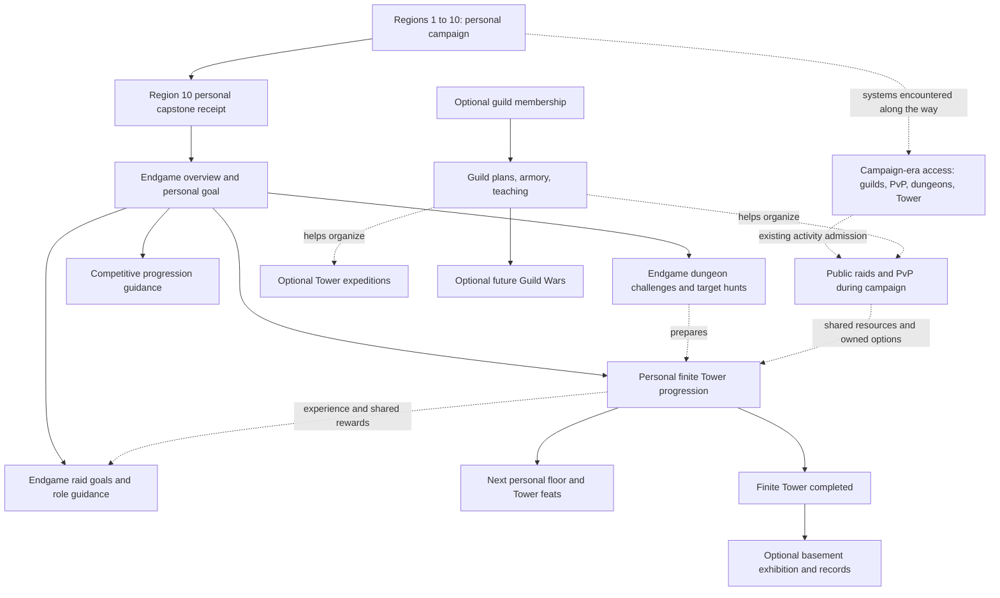
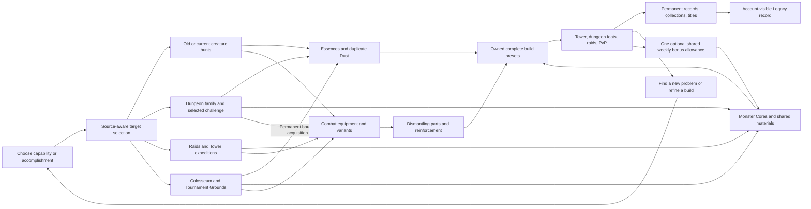

# LegendsLegacy — Endgame Architecture

Repository review: 10 September 2026. **Design analysis only; no gameplay implementation.**

## 1. Executive Summary

**After Region 10, a LegendsLegacy player should be building a repertoire of distinctive characters-in-one: a few deeply developed builds that can solve different combat problems, contribute to cooperative victories, and leave a visible history of mastery.**

Recommend a **bounded hybrid endgame**: finish a finite amount of numerical development, then expand what the character can accomplish. The three pillars are **build mastery, encounter conquest, and a lasting personal legacy**. Collection serves build mastery; guilds make conquest social; PvP tests preparation against other people. They are supporting systems rather than five additional progression ladders.

The central loop is:

> Choose a problem worth solving → identify a missing capability → target an Essence or equipment configuration → develop and save the build → attempt the problem → retain the accomplishment and pursue a different problem.

Regions supply creature identities and hunt locations. Dungeons provide targeted development. The finite Tower provides a visible PvE mastery curriculum. Raids test coordination and division of responsibility. PvP provides an alternative progression livelihood and competitive recognition. Guilds organize people, knowledge, and equipment. All feed the same character repertoire and achievement history.

Commit to these boundaries:

- **No automatic Region 11, tier 11, fourth Essence ascension, or endlessly stronger raid loot.** Future campaigns expand the world at the existing endgame budget.
- **No exclusive permanent combat multiplier from Tower clears, raid attendance, guild membership, PvP rank, account age, or seasonal participation.** Those activities can award resources and equipment that develop existing power systems.
- **No new endgame currency.** Retire Tower Tokens, Raid Trophies, and paid Fate Echo rerolls through a reviewed conversion plan. Keep existing materials with distinct purposes; do not replace them with one universal token.
- **A good build should be attainable deliberately.** Rare drops accelerate a goal or express identity. An extremely rare roll must not be the only answer to a Guardian.
- **A player can finish their chosen build.** Continued play comes from new solutions, identities, opponents, and accomplishments. Taking a break is an acceptable outcome.

The repository already contains much of the machinery. It also contains contrary assumptions: open-ended character/equipment progression, infinitely increasing raid `+` levels, a server-owned Tower progression model, and collection-based acquisition advantages that could grow with every added collection. These require explicit policy changes before substantial endgame content production.

At 1,000 hours, the exciting drop is the missing piece for a new strategy, a sought-after version of a favorite item, an unfinished creature entry, or a rare visual identity. The exciting victory is succeeding with a build or group that could not previously solve that encounter. **Neither requires next month's monsters to have 20% more health.**

## 2. Current-State Repository Analysis

### Scope and strength of evidence

The review covers the current working tree of the primary game: Core models, Application use cases, Infrastructure services and persistence, API content catalogs, worker-related settlement paths, Angular integration, and relevant test sources. It includes existing uncommitted work as visible evidence and does not modify it. `LL-Chat` and infrastructure deployment are outside the proposed changes.

“Implemented” means a substantive code path or authored catalog exists. It does not prove that it is enabled in production, that all migrations are deployed, or that its economy works at scale. No live database, player telemetry, server inventory, or production configuration was accessed. All future pacing, reward rates, and power shares in this document are **design targets requiring simulation and playtesting**, not measured outcomes.

### What actually exists

| System | Verified repository state | Endgame implication |
|---|---|---|
| Regions | The canonical **balance diagnostic** policy names ten authored Regions and ten areas per Region. The checked-in world catalog contains **two Regions**, Shenic and Meran. The policy's Region-10 endpoint is level 495; it does not prove ten populated Regions exist. [S01] | Region-10 completion needs authored content and a durable personal completion rule. Do not describe it as an already shipped transition. |
| Character growth | Runtime XP uses a quadratic configurable curve. Leveling keeps increasing level, Power, and MaxHealth without an explicit endgame cap in the inspected loop. [S02] | A soft slowdown alone cannot prevent eventual numerical dominance. |
| Essences | The catalog contains 80 definitions from 77 source creatures; 19 Codex collections. Acquisition, absorption, leveling, ascension, focus, duplicate conversion, and three loadouts exist. Slots reach ten at character level 90. [S03], [S04], [S05] | Hundreds of future Essences are plausible content, not the current catalog size. Build breadth already has a foundation. |
| Essence strength | Ascension gates maximum levels at 10/30/60/100. Ordinary Essence level is not itself a passive stat ladder; current attuned attribute modifiers are empty, while combat effect scaling uses ascension. [S03], [S04] | Do not add a second level-based multiplier while budgeting ascension as though it were the only multiplier. |
| Equipment | Equipment drops from combat. The current model supports target selection, archetypes, quality/rarity, variants, reinforcement to rank 5, dismantling, ownership/binding, and three equipment loadouts. Blueprint application modifies existing equipment. The shared tier curve supports beyond tier 10, but ordinary acquisition and upgrade prices are authored only for tiers 1–2. [S06], [S07], [S08] | Retain the combat lifecycle. Author the campaign's remaining gear economy and stop the tier treadmill at the endgame policy boundary. Blueprint application is not a reason to restore Crafting. |
| Combat Styles | Four defined styles have finite progression and configuration choices; the repository does not expose a separate active Doctrine system in the inspected paths. [S09] | Use Combat Styles for specialization. A parallel Doctrine tree would duplicate an existing job. |
| Dungeons | Family/run content, routes, Vigor, retained rewards, sigils, mastery, cores, and equipment rewards already exist. [S10] | Extend target farming and encounter mastery rather than replacing dungeons with an infinite tier ladder. |
| World Tower | There are 15 authored floors. Progress and first clears are server-owned, with 5/10/15-player party rules. Floor 10 unlocks Meran. An Echo reward is limited to one per character per ISO week across floors; the sovereign floor cannot Echo. A reward curve extending to 100 is not 100 authored floors. No basement runtime was found. [S11], [S12] | A personal endgame curriculum requires additional progression records and solo-compatible encounters. Preserve existing world records separately. |
| Raids | Two bosses and public party/wing mechanics exist. Guild membership is not the core admission rule. Runtime Regular/`+n` progression is open-ended; rewards default disabled and the Trophy vendor has no authored stock. [S13], [S14] | Cooperative combat is real. “Guild raids” should organize this system; they need not be a separate combat implementation. Rework its progression before enabling the reward economy. |
| PvP | Colosseum and weekly Tournament Grounds are implemented. Tournament teams have up to three members. Both use character progression and snapshots without the proposed competitive normalization. Monthly tournament standings are derived from completed placements. [S15], [S16], [S17] | PvP is not a missing feature. Normalization and durable season settlement are missing policies/infrastructure. |
| Guilds | Missions, orders, shops, buildings, contributions, and an equipment vault exist. Guild Wars was not found as a functioning combat loop; War Room scaffolding is not an implemented war system. [S18] | Finish useful cooperation before building a separate war economy. |
| Collection and recognition | Creature archive, Codex collections, achievements, titles, and account-scoped achievement/title ownership exist. Most combat development remains character-owned. [S05], [S19] | Extend these for a Legacy record; do not invent inherited account stats. |
| Economy and objectives | Cinders, Soulstones, Fate Echo, Guild Favor, Tower Tokens, Raid Trophies, Arena Glory, materials, sigils, and several progress counters exist. Prophecies already offer choices and weekly milestones. [S20], [S21], [S22] | Simplify the existing economy and clocks before adding new ones. |
| Technical foundation | CQRS commands, transaction behavior, outbox delivery, event ledgers, snapshots, reward definitions, and deterministic balance tools exist. Some service/persistence boundaries and snapshot versioning need attention. [S23], [S24], [S25] | Extend concrete shared contracts. A new generic game platform or microservice split is unnecessary. |

### Legacy assumptions that must not drive the design

The active character action enum contains only Idle and Combat. The equipment pipeline and frontend tests explicitly reflect removed crafting. Historical migrations, old documents, resource names, comments about recipes, and old item entries can remain after a feature is removed. They are not evidence that players should gather ore or level a profession. [S06], [S22]

Two potentially misleading names are **Soul Dust** and **Boss Soul Core**. Soul Dust is the active item ID `soul_dust` used by the Essence service for what its messages call Essence Dust; these are the same resource, not two wallets. Standardize its player-facing name rather than retire it. Boss Soul Core belongs to an evolution concept without authored catalyst requirements in the inspected Essence catalog. Do not turn that incomplete concept into a required sink just because the item exists. Verify live holdings before retiring unused data. Do not rewrite historical migrations to make history look cleaner.

### Current connections worth preserving

Combat → gear → dismantled parts → reinforcement already works conceptually. Creature drops → duplicate Essence Dust → development of other Essences is a useful breadth loop. Dungeons → Monster Cores → ascension connects encounter play with builds. PvP's Glory market already offers shared Soulstones, sigil fragments, and Monster Cores. Guild equipment sharing already supports preparation. The architecture extends these connections and changes their limits; it does not start from an empty game.

## 3. Endgame Design Problem

The real problem is **too many independently extensible sources of advantage without a common definition of a finished character**. Slowing XP does not solve that if equipment tiers, raid levels, collection bonuses, and future account perks continue growing. Nor does adding seven activities solve motivation when each rewards the same stronger build.

Three questions must have clear answers on every content definition:

1. **What capability does this encounter test?** Examples: burst timing, sustained pressure, threat control, recovery, add management, or coordination.
2. **What does its reward help the player do?** Develop an existing build, assemble an alternative, gain recognition, or contribute socially.
3. **Why return after numerical development is finished?** A different feat, target, composition, opponent, collection goal, or social commitment.

An activity may be worth completing once. Not every floor and every old dungeon needs a perpetual weekly reward. The goal is a healthy set of reasons to play, not universal relevance at all times.

The design succeeds when a solo player, a PvP specialist, and a guild organizer can all develop viable characters through their preferred play, while choosing other modes because those modes are interesting. A reward graph is interconnected when useful outcomes overlap; its access graph must not force everyone through every branch.

## 4. Recommended Endgame Philosophy

| Pillar | Player fantasy | Design consequence |
|---|---|---|
| **Build mastery** | “I understand these Essences and can make several identities work.” | Three to five meaningful builds are more valuable than hundreds of mandatory maxed entries. Configuration should be inexpensive and quick. |
| **Encounter conquest** | “My preparation and our coordination can solve difficult problems.” | Visible mechanics, multiple counters, readable failure reports, and finite accomplishments outrank automatic stat escalation. |
| **Lasting legacy** | “My character has a history that new releases cannot erase.” | Preserve collections, historical clears, season results, titles, and distinctive appearance. Age does not grant an uncapped combat multiplier. |

Collection is a means and a satisfying optional end in its own right. Competitive ranking is one expression of conquest, not a universal scoreboard for character worth. Guild membership enhances cooperation; it does not certify that a character deserves endgame power.

This fits an idle RPG: much of player skill lies in choosing where to invest, assembling a configuration, assigning party roles, and interpreting combat outcomes. Encounters should reward those decisions. Do not suddenly require real-time reaction mechanics that the combat interface and simulation do not support.

## 5. Post-Region-10 Transition

### Define completion as a personal accomplishment

Create a versioned **Region 10 campaign completion** record when the character completes the mandatory Region-10 campaign chain and defeats its authored capstone in a valid personal encounter. The chain requires visiting its final mandatory area and completing its story objectives. A solo-compatible capstone must exist. A public boss kill, a server Tower unlock, reaching a level, or purchasing equipment is insufficient on its own.

Do not require 100% Essence collection, every dungeon difficulty, rare equipment, a guild, or a PvP victory. Track optional regional completion separately. Persist the completion receipt even after campaign content is revised. Existing players receive credit only from equivalent recorded facts; where history is insufficient, offer a short capstone verification rather than replaying the whole campaign or fabricating a historical first clear.

### Concrete transition

The recommended terminal combat level is **500**, with **equipment tier 10** as the terminal campaign/endgame tier. These are proposed policy values, anchored to the existing diagnostic Region-10 endpoint of 495 and 50-level equipment cadence. They are not existing runtime caps. Finalize them only after the remaining Regions are authored and the full campaign is benchmarked. Fix any level/tier boundary disagreement centrally; do not scatter special cases at level 500.

Completing Region 10 unlocks an **Endgame overview** with a selected personal goal, build presets, relevant sources, and accomplishment history. It introduces endgame dungeon challenges, the appropriate Tower challenges, raid preparation, and competitive rules explanations. It does not pretend that PvP, guilds, or the Tower first become available here; those can already be encountered during the campaign.

Migrate required campaign/dungeon/basic-raid access away from the existing server Tower-10 gate to equivalent **personal campaign facts**. A server's first clear may open optional events or celebrations, but a fresh server must not prevent solo progression to Meran or beyond. A solo-compatible personal milestone can be an alternative certification where appropriate; participation in someone else's world expedition cannot be the sole route.

| At the transition | Decision |
|---|---|
| Character level | Continue the small remaining journey to 500, then stop granting combat levels. Do not add a parallel combat Paragon bar. |
| Region progression | The numbered vertical campaign ends at ten. Future places can be new campaigns, chapters, and zones without becoming higher stat tiers. |
| Equipment | Acquire terminal-tier foundations, improve within the existing rank/rarity/quality envelope, then pursue alternatives. |
| Essences | Retain all ownership and earned progress. Finish the finite 100-level/three-ascension structure where relevant; develop additional configurations. |
| Combat Styles | Finish finite style development and explore alternative refinements. No separate Doctrine grind. |
| XP at combat cap | Continue existing Essence/style progression according to explicit eligibility and conversion rates. If all chosen sinks are complete, stop awarding that unusable combat XP; do not secretly bank future stat levels. Ordinary loot and accomplishments continue. |
| Previously acquired gear | Keep usable items and configurations. Low-tier generic items need not equal tier-10 gear; favorite build identities need an accessible endgame-budget counterpart. |
| Collections and records | Remain permanent; new collection entries do not increase the global passive power ceiling. |

### First 10–20 active hours

These are **active decision/play hours**, not a promise about elapsed idle time or XP throughput. Assuming a functional campaign build, target this sequence:

| Active time | Experience and concrete outcome |
|---|---|
| 0–2 hours | Celebrate the capstone; save the current build; select a goal such as solving a recovery-heavy Guardian. The UI identifies two broadly obtainable counters and where to find them. |
| 2–6 hours | Run a relevant dungeon and set an idle creature focus. Obtain guaranteed progress toward a selected missing Essence/variant; improve a weak gear slot using ordinary materials. |
| 6–12 hours | Assemble a second usable configuration, run low-cost practice, and clear a challenge that the first build struggled with. A rare drop may accelerate this; it is not a prerequisite. |
| 12–20 hours | Finish another personal milestone, attempt a public raid with an assigned role, or begin ranked PvP. Choose one as the next commitment. The character has a plan and at least two practical build options. |

The first several months should develop three to five builds, a recognizable preferred role, meaningful Tower progress, and perhaps a raid or competitive specialty. Those months must not be prerequisite attendance for all later releases.

## 6. Endgame Progression Model

### Compare the alternatives

| Model | Advantages | Failure in LegendsLegacy | Verdict |
|---|---|---|---|
| Infinite vertical | Clear next number; cheap enemy scaling; easy reward messaging. | Uncapped tiers invalidate old gear, punish breaks, amplify guild/PvP gaps, and collapse Essence choice into throughput. Infinite raid `+` already points this way. | Reject as the permanent architecture. |
| Pure horizontal immediately at Region 10 | Stable balance and strong investment preservation. | Abruptly removes familiar development goals; leaves players with partially developed equipment/Essences and a confusing transition. Requires a broad, polished challenge library immediately. | Too abrupt for this game and current content capacity. |
| **Bounded hybrid** | A finite finishing journey preserves investment satisfaction; most future content expands options and mastery. | Requires a real ceiling, deterministic acquisition, and discipline around exceptional rewards. | **Recommend.** |
| Seasonal borrowed power | Recurring growth inside a contained mode without permanently raising the world ceiling. | Another balance surface and reset obligation; can devalue persistent builds or become mandatory. | Permit only a later optional exhibition mode; do not use as the foundation. |

### Make the bound enforceable

Define an endgame-ready reference character at combat level 500, a coherent terminal-tier equipment set, a mature primary Essence loadout, and a developed style. The target gap between that character and a numerically optimized equivalent build is **approximately 20–25% on neutral benchmark performance**, not 2× or 10×. A freshly completed campaign character may have additional foundational work; that is explicitly catch-up work, not an infinite veteran tier.

That target must be tested across damage, survival, resource-free sustain, and party contribution. It is not a new `Combat Power` formula and not a guarantee about every matchup. A well-matched strategy should outperform an unsuitable one by more than a perfect quality roll does. The highest optional feats can demand specialization, but ordinary new endgame releases must be approachable with a mature, accessible build.

Once the finite envelope is reached, updates change **available choices and problems**. They do not refresh every player's obligation to fill the same power bar.

## 7. Full System Relationship / Dependency Diagram

The maps separate **access/guidance** from **reward flow**. Solid arrows in the first map show unlocks or explicitly labeled access to guidance. Dotted arrows in either map represent optional preparation/help or earlier availability, not required attendance.

The campaign-era box describes available systems, not a requirement to play all of them. Only the personal campaign/capstone gates the endgame overview. Tower progress gates further Tower challenges; raid success gates that raid's advanced encounter variants. Neither gates basic access to the other. Guild Wars necessarily requires a guild; equivalent personal development does not.

**Convergence is the owned repertoire and its history**, not a Tower currency shop. Primary rewards keep source identity: hunt a creature for its Essence, a dungeon for its family/variant, a raid for its encounter-themed equipment. Shared materials prevent those sources from becoming isolated economies. Competitive acquisition provides bound equivalents and its own identity rewards.

Four example loops make the connections concrete:

1. A Guardian's recovery phase exposes weak sustained pressure → focus an early creature with a useful existing effect → use dungeon cores/Dust to mature that Essence → save a pressure build → clear the Guardian. The original creature remains useful without receiving Region-11 stats.
2. A raid wing needs reliable protection while another handles adds → a player practices the role in a dungeon/Tower encounter → the guild lends appropriate real equipment → the raid clear develops the same equipment/Essence systems and records the group's accomplishment.
3. A PvP specialist earns a bound acquisition choice and shared development materials → obtains a permanent alternative Essence or item → experiments in PvP and can use the owned result in PvE. Ranked placements add prestige, not exclusive PvE strength.
4. A collector finishes a set → unlocks a dossier, appearance, or collection identity → tries a themed feat. Collection breadth suggests play without multiplying every existing build's stats.

## 8. Power Progression Architecture

### Where power belongs

The following are **budget allocations for design**, not measurements of current damage attribution. Combat interactions are nonlinear; these percentages cannot be read off character sheets or multiplied as independent bonuses. Validate them with controlled substitution/ablation across a representative encounter suite, reporting ranges where systems interact.

| Source | Target share of mature character combat capability | Permanent vertical boundary |
|---|---:|---|
| Character base level/attributes | 20% | Combat level 500; no uncapped growth after it. |
| Equipment, including item effects and reinforcement | 35% | Tier 10, rank 5, finite quality/rarity budget; effects pay for their value within that envelope. |
| Equipped Essence abilities and their finite development | 40% | Ten slots; level 100 and ascension 3. Level/ascension are one development system, not separately multiplying budgets. |
| Selected Combat Style/refinements | 5% | Existing finite style levels/choices; no second Doctrine multiplier. |
| Collections, Soulstones, account age, Tower, raids, guild membership, achievements, season history | 0% additional direct power | They may accelerate or supply the sources above; they do not add another multiplier. |
| **Total** | **100%** | All direct power must have an owner in the table. |

Soulstone constellations currently support acquisition/progression efficiency rather than a simple direct attack-stat ladder. Preserve that distinction. Faster acquisition can still create temporary advantage and needs an efficiency ceiling. Dungeon mastery should affect that dungeon's information, routing, and rewards; it must not silently become universal character strength.

For the final approximately 25% finishing margin, allocate a provisional **15 percentage points to equipment optimization, 8 to remaining Essence development, and 2 to remaining style development**. This is a target ceiling across matched neutral benchmarks, not a promise that a damage multiplier and a survival multiplier are interchangeable. If current reinforcement/ascension curves exceed it, rebalance the entry reference or the curves before content release; do not claim the current formulas already satisfy it.

For that example margin, the reference loadout has its essential primary effects at A3 and a small, explicitly benchmarked subset of supporting Essences still at A2. Completing those ascensions supplies the proposed Essence margin. A reference already entirely at A3 has **zero remaining Essence combat growth**; its unused 8-point allowance is not replaced with new power or awarded for levels 61–100. Publish the actual benchmark preset so this distinction is testable.

### Classification and limits

| System | Vertical | Horizontal | Prestige | Mastery |
|---|---|---|---|---|
| Equipment | Finite budget/rank/quality | Stat distribution, variants, mutually constrained effects | Appearances and provenance | Optimizing a chosen role |
| Essences | Finite ascension/effect development | Abilities, order, synergies | Rare appearance variants and collection completion | Knowing and demonstrating a build's use |
| Tower | Shared resource rewards only | Tests and practice unlocks | Personal/world records | Solving a visible curriculum |
| Dungeons | Materials/gear inside common budget | Targeted families and variants | Challenge feats | Routes and encounter knowledge |
| Raids | Common-budget gear/materials | Cooperative roles and encounter-themed alternatives | Clear records, cosmetic trophies | Guild/team coordination |
| PvP | Owned development through alternative rewards; normalized in ranked | Owned options and experimentation | Rating, season results, titles | Opponent and composition knowledge |
| Guilds | No exclusive member combat multiplier | Actual armory access and organization | Guild history and appearance | Coordinated objectives |
| Achievements | None | Dossiers/practice access where appropriate | Primary purpose | Evidence of specific feats |
| Collections | No direct combat stats; capped acquisition efficiency | Broader repertoire and knowledge | Completion/rare variants | Themed feats |
| Legacy record, proposed | None | Shared knowledge/preset convenience | Permanent historical identity | Aggregates accomplishments; no new XP grind |
| Seasons/basement | None outside the mode | Rotating challenges | Dated records | Adapting existing builds |

Adding an Essence slot, extra active equipment effect, or another simultaneous collection bonus is usually **vertical power**, even if called horizontal. New abilities also create contextual advantage. Content review must evaluate combinations and counter availability, not just compare printed stat totals.

## 9. Essence Endgame

### Acquisition: recognizable sources, useful guarantees

Keep creature identity attached to Essence acquisition. A marsh creature can remain the best source of its effect years later. Endgame versions of its encounter may offer appropriate general rewards, but the original source remains available for focused idle hunting.

Current base source chances are 0.01% in the inspected creature tables. Focus multiplies that chance by three. Ordinary resonance reaches only a 1% **relative** increase after 12,000 failed eligible kills: 0.01% becomes 0.0101% before other modifiers. It is not a guarantee and resets on any successful source drop, including an unwanted variant. Dungeons apply much stronger featured-enemy modifiers, but those still do not establish a desired-variant guarantee. [S04], [S10]

Replace the claim of bad-luck protection with a real **selected-source guarantee**:

- Select one Essence target within a discovered source's available pool. Eligible victories advance a non-spendable acquisition counter alongside natural drops. A successful target drop or a redeemed guarantee resets that target's counter; an unwanted variant does not.
- Preserve progress by target when changing focus. Do not permit banking an easy creature's progress and cashing it out on an unrelated rare boss.
- Author a guaranteed threshold per source class, calibrated to wins and actual spawn rates. Start testing a common counter Essence at **one to three days of relevant idle hunting or two to four substantial active sessions**. This is a pacing target, not a claim that current 0.01% odds deliver it.
- Boss-only identities can use encounter completion progress and an alternate solo study encounter or competitive acquisition route. Require an appropriate activity achievement for its prestige appearance, never for the only functioning version of an essential counter.
- Show eligible sources, progress, and the exact guarantee condition. Keep rare visual variants outside the guarantee if desired; avoid stronger “shiny” Essences.

The counter is a delivery guarantee, not a new wallet or collection XP track. Normal drops can arrive sooner. Acquisition remains exciting because source choice and luck change the journey; luck cannot veto a player's build indefinitely.

### Development and ascension

Keep ten slots and three ascensions. Current thresholds are levels 10/30/60 with costs of 6 Lesser, 12 Greater, and 24 Primal Monster Cores. Existing breadth discounts reduce subsequent A1/A2 costs after ten qualifying Essences; preserve and improve that idea. [S03]

Current A3 effects can include +36% damage/summon scaling, +30% healing/barrier, +24% attribute effects, and up to 15% cooldown reduction. That is substantial power. The design must not describe acquiring A3 as purely horizontal or assume an unascended new player is only 8% behind. The finishing-margin target begins from an already mature primary build; missing essential ascension belongs to the accessible foundation path.

**Keep levels 61–100 as optional mastery completion and recognition, and label them honestly.** The current engine already reaches full ordinary Essence potency at level 60 plus A3. Add useful records or mastery presentation to that tail, not hidden additional stat scaling. Do not require level 100 for ordinary raid/PvP participation. Future balance can shorten that tail if players find it unrewarding; preserving a cap is not a reason to preserve empty grind.

Dust already levels an Essence without forcing it into the active fighting build. Use it as the principal alternate-build development resource. Add a training allocation only if Dust cannot meet the desired alternative-build pace; do not immediately introduce another parallel training subsystem. Current equipped Essences each receive full adjusted XP, so any redesign must preserve or deliberately replace that rule rather than assuming XP is divided among slots.

### Collection, variants, mastery

Codex collections currently provide Essence acquisition/XP efficiency, scaled by minimum member ascension, not direct combat stats. Preserve zero direct collection combat power. Place an explicit ceiling on combined Codex/constellation/focus efficiency so adding 20 collections does not make every new set mandatory for economic competitiveness. New completions beyond that ceiling add source information, identity, challenge feats, and recognition. Rebalance actual thresholds after inspecting earnings; do not invent a combat bonus to justify collecting.

Allow alternative forms to change a tactical role within the same budget: a longer setup for a stronger payoff, a single-target versus distributed effect, or a tradeoff between immediate protection and delayed recovery. Preserve the existing same-creature exclusivity rule. A variant is not automatically horizontal merely because its icon differs; measure dominance and combined uptime.

Evolution has an endpoint but no authored catalyst requirements in the current catalog. Defer it. Existing abilities, ascension, variants, styles, and equipment sets already provide enough axes for the first endgame release.

### Multiple builds without respec administration

Replace three separate limited configurations with **complete named presets** containing equipment references, Essence choices/order, Combat Style/refinement/upgrades, and explicit activity assignments. Start with eight free preset slots and at least three useful suggested roles. That capacity is a proposal, not eight required builds.

Switch freely outside a locked attempt. For the initial implementation, **lock the complete dungeon run**: choose its build at entry/route selection, then retain that snapshot until completion or retreat. Tower attempts and raid/tournament registrations similarly retain their captured configurations until their explicit update windows. Settle accrued idle progress against its original snapshot before changing the active setup. Validate missing, sold, loaned, or returned items and offer an explicit fallback preview; never silently change a preset because its name sorts differently. Keep equipment instances shared by reference across presets instead of requiring duplicate sets for every saved configuration.

Use encounter cards with two or three relevant pressures and explainable combat evidence. Examples below are **proposed encounters**, not claims that every predicate already exists in the engine:

| Pressure | Counter A | Counter B | Avoid |
|---|---|---|---|
| Recovery phase rewards sustained pressure | Persistent damage | Burst timed around recovery | A permanent immunity to all DoTs |
| Frequent adds overload single-target damage | Distributed damage | Durable control and focused cleanup | Requiring one exact summon Essence |
| Repeated ability pattern triggers retaliation | Diversified Essence order | Slower, protected casting | Respec after every trash fight |
| Large predictable strike | Barrier/mitigation | Recovery plus sufficient survival | An unexplained instant kill |
| Critical-hit retaliation window | Non-critical pressure | Survive retaliation with protective support | Making the entire crit archetype unusable everywhere |

Build switches belong before a dungeon run, Guardian attempt, raid roster lock, or match registration lock. Wing assignments choose among players' already prepared roles; they do not allow swapping captured builds halfway through a raid. Most ordinary fights should tolerate a favorite generalist build. Hard counters should be rare, telegraphed, and supported by more than one accessible answer.

**After 1,000 hours, an Essence drop is exciting because it completes an unfinished source, opens a genuinely different configuration, reduces the cost of an alternative through Dust, or carries a rare identity.** A fully complete collection can stop producing acquisition excitement; new challenges and occasional new abilities must carry that player instead of endless duplicate potency.

## 10. Equipment Endgame

### Choose a model that fits the existing implementation

| Model | Decision and reason |
|---|---|
| Traditional rarity chase | Keep rarity as excitement, but compress its endgame performance spread. Today rarity and quality multiply strongly; terminal-tier Common versus Legendary cannot define years of unavoidable disadvantage. |
| Affix optimization | Use current budgeted archetypes/stat distributions/variants first. Do not add an unrestricted random-affix engine merely because other games use one. |
| Build-defining equipment | Make existing sets and variant behaviors the center. Effects consume a finite item/set budget and must have tradeoffs. |
| Boss-specific drops | Keep encounter identity, distinctive appearance, and earlier access to its signature variant. Provide an accessible functional alternative or deterministic alternate route. |
| Target farming | Add selected slot/archetype and selected variant guarantees to the existing selection and blueprint systems. |
| Equipment evolution | Defer as an independent system. A favorite appearance and a learned variant can move to an endgame-budget item without inventing another upgrade tree. |
| Limited upgrading | Keep rank 5 and existing Parts/Cinders sinks. No monthly extra reinforcement rank. |
| Equipment collections | Record discoveries/appearances and set accomplishments. Owning everything grants no stacking global stats. |
| Seasonal equipment | New aesthetics and sidegrade behaviors at the permanent budget; no expiration of owned gear or stronger seasonal item level. |
| Extremely rare chase items | Permit exceptional provenance, visual treatment, unusual sidegrades. A mandatory best-in-slot multiplier is unacceptable. |

### A finished item and a deliberate path to it

At endgame, tier 10 establishes the base budget; reinforcement ends at rank 5. A selected stat distribution and variant determine its job. Rarity, quality, rolls, and set effects together fit the finishing margin in section 8. The current multipliers are too wide to assume this is already true: rarity ranges from 1× to 3× in the balance model, quality from 0.9× to 1.42×, reinforcement adds 4% budget per rank, and variants add another budget share. [S07]

Author an attainable **functional reference quality** for all roles and a much narrower remaining optimization range. Do not simply put the same 3× spread on tier-10 drops. Budget proc frequency, cooldown loops, sustain, and multi-target effects as carefully as printed stats. Allow at most one exceptional build-defining behavior package unless benchmark evidence supports stacking; ordinary existing set combinations still need evaluation.

Keep a combat-only item lifecycle:

> Combat drop or earned selection reward → choose/equip → apply a discovered variant → reinforce with Parts and Cinders → reuse in presets, trade/donate while eligible, or dismantle.

An earned equipment selector is a combat reward fulfillment mechanism. It does not require Gathering, crafting recipes, profession XP, or a crafting station. Deterministic rewards should be bound; random eligible discoveries may retain current trade/donation rules.

Extend existing blueprint protection, which currently guarantees **a random family blueprint within four eligible completions since the previous award** (three misses trigger the next guarantee), into visible progress toward a **chosen missing family variant**. Start testing a selected useful variant within four to eight eligible full clears. For a selected functional gear slot, test a six-to-ten-clear maximum through the associated reward pool; adjust per run length so a one-minute encounter does not equal a full dungeon. No guarantee needs to promise perfect quality.

Once a variant is learned, allow reapplying it to compatible owned gear for a small Cinder fee, preserving existing stats/rank. This is a proposed change from consuming another blueprint each switch. Duplicate blueprints retain a defined dismantle/trade use. Avoid making build experimentation consume a scarce weekly resource.

Old physical tier-1 items need not become tier-10 items. Preserve their appearance, discovery, and variant identity; provide a tier-10 counterpart through terminal-budget challenges or selectors. Do not create a cheap conversion loop that turns unlimited tutorial drops into premium materials. A permanent variant/appearance unlock preserves the meaningful investment without preserving every old numerical roll.

**After 1,000 hours, a gear drop should offer a missing role distribution, an interesting set combination, a modest optimization, a rare appearance/provenance, or useful value to another player.** After a player's favorite set is perfect, it remains perfect at its job. Next month's equipment must win in a different context or create a tradeoff, not automatically win the same benchmark.

## 11. World Tower Architecture

### Role: the PvE mastery curriculum

The Tower should be the clearest **map of PvE accomplishments**, not the root of every unlock or the owner of exclusive character strength. Its curriculum shows increasingly demanding applications of existing combat systems. It can introduce strategies useful in raids without making raid admission depend on a Tower rank.

Preserve two distinct records:

1. **Personal Tower progression:** permanent floor/challenge clears by character and ruleset. This supports the finite journey and late arrivals.
2. **World expedition history:** server first clears and optional group variants, preserving the current server-owned model and its participants.

The current 15 floors all require groups; a personal solo-compatible track is real new encounter and persistence work. Do not silently relabel server progress as personal mastery. Retain existing first-clear history and distinguish original expedition versions from later solo variants.

### Finite structure

Keep approximately 100 main floors as a **long-term authored destination**, not a launch prerequisite. Use milestone Guardians roughly every ten floors, with intervening floors teaching or recombining a limited set of mechanics. Suggested eventual bands are introductory/campaign-compatible challenges, mature single-build tests, build-breadth tests, and a final mastery chapter. Assign exact floors after auditing the current encounters; do not promise that floor 31 always corresponds to Region-10 completion before balance work.

Every required personal milestone must have a solo-compatible route. Optional expedition variants can use fixed 5/10/15-player rules where those are already supported and enjoyable. Do not implement arbitrary player-count scaling across every floor. Maintain separate records by supported format. Prove a small personal chapter before committing to the remaining chapters; even adaptations of the current 15 group floors need solo encounter validation.

| Clear type | Reward/access |
|---|---|
| Personal first clear | Next personal challenge, record, modest shared materials, relevant source guidance. |
| Milestone Guardian | Title/appearance/record; unlock its practice and optional feat variations. No exclusive Essence slot or ascension. |
| Server first | Dated Hall of Fame and participant recognition. Avoid a large material windfall that compounds first-mover strength. |
| Repeat clear | Practice, selected ordinary reward opportunities, assistance credit, optional shared weekly bonus eligibility. |
| Mastery feat | Specific accomplishment such as controlled casualties or a role constraint, under a versioned ruleset. |

Make every milestone replayable, including sovereign encounters. The current floor-10 no-Echo rule is incompatible with a late player's ability to experience the full journey. World first remains unique; the fight must not disappear forever.

Current weekly preparation/scouting can contribute combat bonuses. Replace compulsory repeated contribution clicks with automatically accumulated intelligence from attempts and a small, equal per-attempt preparation choice. Keep information and cooperative planning; remove a weekly contribution advantage from ranked records. The current preparation cap and reward entitlement also need consistent rules across API and workers.

### After floor 100

The finite conquest remains completed. Offer optional Guardian feats, role/composition variants, group assistance, and occasional additional story sections at the same terminal budget. Archive the original 100-floor completion even if a later wing appears.

The basement is **optional exhibition content**, unlocked by the personal finite completion, with no exclusive permanent power or resource-efficiency advantage. Use seeded sequences of validated encounter modules. Beyond a modest set of difficulty steps, measure depth, resource management, and consistency under a fixed budget rather than exponentiating enemy stats forever. End attempts with explicit duration/tick/encounter limits; “infinite” describes renewable challenges, not infinite server computation.

Rank by comparable ruleset, seed cohort, and party format, with dated archives. Reward prestige and a small ordinary participation allowance independent of deepest floor, within the shared weekly allowance. A player who ignores the basement can remain equally capable in all ordinary endgame content.

## 12. Dungeon Architecture

Dungeons are **targeted preparation and repeatable mastery**, the best place to deliberately assemble a capability. They should remain shorter and easier to schedule than raids and less dependent on a permanent sequence than the Tower.

Retain the existing Normal/Heroic/Mythic authored difficulties for the campaign. Add an explicit **endgame challenge band** to selected families, separate from their original Region and from their difficulty enum. The present enemy scaling derives progression from difficulty/Region; it cannot make a Region-1 dungeon suitable for a level-500 character merely by calling it Mythic. [S10]

For each selected endgame family, offer one accessible terminal-budget baseline and a small number of authored optional challenge rules. Keep familiar routes, rest/treasury choices, and Vigor. Avoid Mythic 1–100 and a weekly list of random modifiers that can generate impossible matchups.

Give each family a clear target: a variant family, creature Essences, or a weighted mix of existing core grades/gear slots. Retain the original source permanently. A weekly highlighted family can offer freshness and fill the shared bonus allowance, but a player must not wait six weeks for their required variant to become obtainable.

Use existing sigils/fragments for ordinary rewarded runs. Provide free or inexpensive practice after discovery; consume a reward entry only when the player commits to the rewarded run, with transparent failure rules. Do not require a sigil merely to inspect a boss or test a build. No additional endgame key currency.

Current family mastery has ten levels and substantial rewards, including +5 percentage points of equipment drop chance per level. Its long XP curve and shared difficulty XP can make repetitive easy clears optimal. Change future mastery toward earlier route information, modest reward efficiency, and feat recognition. Cap combined acquisition acceleration, reward relevant challenge completion appropriately, and make the final mastery reward independent of the difficulty on the last run. Preserve already-earned records and review existing reward investments before changing rates.

Not every old dungeon receives a level-500 conversion immediately. Start with two families covering complementary tactical needs. Other families remain valid campaign/collection content and retain variant access. Add a challenge version when its mechanics support a worthwhile endgame problem.

## 13. Guild Raid Architecture

### Preserve the cooperative mechanics already built

Raids already divide preparation into three jobs: rear-guard add control affects survivors joining the final battle; vanguard damage against an objective weakens boss defenses; main-guard survival weakens and delays signature attacks. These create legitimate roles beyond dealing damage to a large health bar. [S13]

Develop that structure into readable guild planning. A defensive player can be valuable because a wing survives; a pressure build can be valuable because it breaks an objective; an area-damage build can prevent the final encounter being overwhelmed. The report must show each wing's contribution and resulting changes to the final assault. Do not rank all players by total damage.

Keep **public raids**. Add optional guild sponsorship and guild records to the existing party system. Small guilds may invite allies and recruits. A sponsored record requires a declared roster and an explicit membership/contribution rule; individual eligibility and loot never depend on belonging to a top guild.

### Cadence and progression

Retain asynchronous muster/locked combat preparation. Target one or two scheduled attempts per interested group per week, with practice and repeat attempts available at other times. The current bosses support different fixed roster ranges; first finish and balance those formats rather than create a universal raid-size scaler.

Replace unlimited `+n` with three authored **Standard, Veteran, and Mastery** encounter rulesets. Standard teaches wing roles; Veteran tightens execution and changes selected phase interactions; Mastery tests composition breadth and coordination. Their gear budget remains the same. A prior clear can gate the next difficulty of that boss; it must not require replaying an endless chain of +levels or every historical raid.

Remove mandatory Epic styled armor in three exact slots as a blanket entry rule. It currently uses “Blueprint-crafted” language despite Crafting's removal and can reject a workable build. Use transparent recommendation/role readiness, required basic system unlocks, and practice evidence where a gate is necessary. Mechanical success is the final test.

### Loot, lockouts, and catch-up

- Unlimited reasonable attempts; preserve the existing one-active-raid restriction and define conflicts with other modes explicitly. Current per-mode restrictions do not establish a universal cross-mode lock. Permit independent captured activities unless they create an actual settlement or scheduling conflict.
- Ordinary repeats can grant bounded-rate materials and target progress. Replace the current unlimited 25%-of-scaled-reward model; its income must not rise without limit with difficulty.
- Offer one meaningful weekly **raid selection opportunity across active bosses**, with partial progress/positive-difference credit so an early failed or lower result does not waste the week. If it grants an extra shared material bonus, it consumes the same allowance available through solo/PvP play. Do not add one mandatory chest per historical raid.
- Signature drops use existing tier/variant systems and shared materials. Provide functional equivalents through solo dungeon/study objectives and competitive acquisition. Raid appearances, guild trophies, and first-clear records remain exclusive accomplishments.
- Favor personal loot/target choice over officer-controlled power distribution. No raid-only ascension catalyst, fourth ascension, permanent guild combat aura, or mandatory weekly consumable.
- Veteran/Mastery award distinctive records and cosmetics more than additional material efficiency. A small speed advantage may exist; it must fit the total acquisition-efficiency budget.

Record first slay, server first, guild first, and personal first distinctly, preserving existing slay history and adding the missing guild/personal history where needed. First-clear recognition must not depend on enabling material rewards, as the current raid title grant path does. A late player can learn one contemporary raid role in an accessible format, reach its higher difficulties, and join modern groups without clearing a chronological raid ladder.

## 14. PvP / Tournament / Guild War Architecture

### Recommended combat rules

| Choice | Assessment |
|---|---|
| Entirely live stats everywhere | Strong expression of investment; weak competitive entry and difficult age-gap management. Retain only as explicitly unranked/open character combat. |
| Identical characters and fully fixed builds | Very fair numerical baseline but erases much of LegendsLegacy's character-building identity. Useful for occasional exhibition presets, not the main model. |
| **Normalized numerical budget with owned configuration identity** | **Recommend for ranked Colosseum, Tournament Grounds, and future Guild Wars.** Equalize maturity while preserving strategic choices. |
| Separate PvP gear/stat progression | Creates another economy and forces duplicate maintenance. Reject. |

At the shared combat-preparation boundary, normalize combat level, equipment tier/rank/rarity/quality/roll budget, Essence ascension potency, and style mastery to the competitive reference. Give every ranked participant the same **ten-slot competitive Essence budget**, including early-campaign players; these competitive slots do not unlock owned PvE slots. Retain selected Essence definitions/order, stat distribution, compatible equipment behaviors, style choices, and role decisions; rarity can retain its appearance without retaining an unequal budget multiplier. Remove PvE acquisition/mastery/preparation bonuses from ranked combat. Use a small versioned set of PvP effect coefficients only where normal combat produces degenerate competitive outcomes; do not fork every ability into a separately maintained system.

**Owned choices still create an access advantage.** Supply a permanent basic counter toolkit to all ranked participants and a small publicly visible rotation of loaned options so a new player can answer common strategies. Loaned competitive choices are available equally in that ruleset and do not create owned PvE items. Let PvP participation deliberately acquire permanent bound choices at a viable rate, including essential style/refinement options, so competitive specialists do not need months of PvE collection first. Unique prestige appearances remain earned in their originating mode.

### Mode identities

| Mode | Job | Reset/commitment | Rewards |
|---|---|---|---|
| Colosseum | Convenient asynchronous testing and ranked individual competition. Optional open-stat challenges for character expression. | Soft rating reseed each competitive season; preserve lifetime peaks and archived ranks. Reduce pressure from ticket overflow/daily-first-win mechanics by banking a modest allowance. | Shared development choices, Glory for PvP identity, rating history. |
| Tournament Grounds | Scheduled 3v3 team composition and bracket achievement. | Keep weekly events; registration snapshots lock at the published cutoff. One season aggregates their results. | Participation development comparable to ordinary alternatives; placements primarily titles, appearance, permanent results. |
| Guild Wars | Later, optional roster/assignment competition and guild identity. | Reuse normalized combat and season records. Begin with a small number of asynchronous squad assignments, not a territory simulation. | Guild banners/trophies/history and ordinary personal development within the shared allowance. |

The existing tournament system has registration, team combat, rewards, replay, and Hall of Fame. Its monthly standings query is not a complete season lifecycle. Preserve those working features while adding durable rulesets and settlement. Snapshots currently re-resolve some live definitions; equal competition needs a captured rules version as well as a captured loadout. [S15], [S16], [S17]

### Reward independence in both directions

PvE players must obtain all essential permanent combat capabilities without PvP. PvP specialists must acquire viable permanent configurations and materials through PvP, not merely cosmetics after being forced to farm PvE gear. This does not mean identical loot tables: sources, appearance, pace within a narrow band, and activity identity can differ.

Do not gate essential Monster Cores behind Gold rating. Competitive rank can unlock cosmetic Glory stock and historical status; functional resources belong to accessible participation/goal completion. Keep win-trading and deliberate losses from becoming the optimal reward method by validating real matches, matching reasonable opponents, and limiting bonus entitlements. Avoid paying only for wins, which would trap new players without useful progression.

Glory persists and serves PvP choice/identity. No tournament marks or war shards. Rebalance current placement differences in Soulstones so a champion wins recognition rather than compounding permanent economic dominance. PvP grants **zero unique permanent account combat power**. Its owned items, Essences, resources, and account-scoped recognition persist normally.

## 15. Guild & Social Endgame

Guilds should make difficult preparation easier and accomplishments more meaningful. Their advantage is **people, shared knowledge, coordination, and real equipment**, not an exclusive multiplier a solo player can never replace.

Build on the actual guild vault: members donate eligible unbound equipment; borrowed items remain guild-owned and obey return/departure rules. Extend it with role requests, clear availability, and preset validation. Do not generate infinite copies of donated gear. Make guild-sponsored raids and Tower expeditions visible alongside shared goals and replay notes.

Replace fixed high-volume mission obligations with one selected weekly guild objective sized to a stable eligible active-roster band. Lock the roster basis for the period to prevent kicking inactive players to shrink a target. Reward participating members for a meaningful contribution even if the guild narrowly misses the stretch goal; reserve the shared celebration for full completion. Carry forward slow long-term building projects.

Current guild benefits are mostly economic, while planned Training Grounds/Essence Sanctum combat perks are scaffolding. Keep future buildings organizational or cosmetic. The Mission Board's reward acceleration still matters economically; cap and include it in the overall acquisition budget. Give new/small guilds core organizational tools early. Do not make a useful raid interface require months of guild leveling.

Retain Guild Supplies as communal construction/decor funding. Simplify personal Guild Favor into identity purchases and optional resource selection within the shared bonus rules. If it remains only a redundant material conversion shop after this change, retire Favor later; do not simultaneously redesign every guild contract just to remove one wallet.

For players outside guilds, provide public party admission, clear role requirements, private personal goals, and assistance recognition. Social features succeed when joining a guild feels desirable rather than economically compulsory.

## 16. Resource and Currency Economy

### Audit and disposition

This distinguishes stored currencies, inventory materials, entry items, and non-spendable progress. The last category must not masquerade as a new currency. Current default tradability is derived from item flags and seeding, not a live marketplace inspection. [S20], [S21], [S22]

| Existing resource/state | Current role | Recommendation |
|---|---|---|
| Cinders | Character wallet; combat/reward income, trade, fees and equipment spending. | Keep the common monetary resource. |
| Soulstones | Character wallet; finite constellation purchases with reset refunds. | Keep for finite acquisition conveniences and later non-power identity choices. No endless attack upgrades. |
| Essence Dust | Duplicate conversion and rewards; Essence leveling. Repository-default item is tradable. | Keep the primary alternate-build development material. |
| Lesser/Greater/Primal Monster Cores | Finite Essence ascension; dungeon and shop/reward sources. Repository-default items are tradable. | Keep three existing grades; never add a fourth for each expansion. |
| Reinforcement Parts | Bound dismantling output; equipment reinforcement. | Keep, with bounded endgame costs and no recursive profitable dismantle/upgrade loop. |
| Sigil Fragments/family sigils | Bound dungeon entry and assembly; currently ten fragments per sigil. | Keep as entry tools; no parallel challenge keys. |
| Blueprints | Combat/dungeon discovery of equipment variants; current application consumes one. | Keep identities; add permanent learned variants and a defined duplicate use. They are unlock items, not a fungible endgame currency. |
| Arena Glory | Arena/tournament reward wallet and Champion Market. | Keep one PvP identity/choice currency; no season-specific replacement. |
| Guild Favor | Personal guild shop resource. | Narrow to guild identity and optional choice; avoid separate mandatory power stock. Reassess after migration. |
| Guild Supplies | Guild-owned building resource. | Keep: communal ownership is a genuine distinct purpose. |
| Tower Tokens | Tower grants with no spending path found. | Retire new issuance; preserve historical earned total as a record. |
| Raid Trophies | Guarded raid rewards; empty vendor, disabled reward default. | Retire rather than populate a new power shop. Record raid trophies as achievements/visuals. |
| Fate Echo | Paid prophecy rerolls; currently 40/80 costs after a free reroll. | Retire paid reroll economy. Make goal choice sufficiently broad/free that preferred play needs no reroll tax. |
| Prophetic Favor | Weekly milestone counter, not an inventory wallet. | Reuse for the optional shared weekly bonus progress; change earning paths and display. |
| Soul Dust/Boss Soul Core naming | Soul Dust is the same active `soul_dust` item as Essence Dust, including raid/event grants. Boss Soul Core is an incomplete evolution concept. | Standardize Dust naming. Audit the evolution item separately; do not retire active Dust. |
| XP/mastery, rating, guild XP, Renown, resonance, target guarantees | Progress, standings, or delivery state. | Keep only where they have an intelligible job; none should become another spendable token. |

### Recommended resource contract

No new currency is proposed. Reusing an existing item still requires a concrete source/sink/ownership policy:

| Resource | Sources → purposes/sinks | Storage/caps | Trade and ownership | Seasonal? | Progression role |
|---|---|---|---|---|---|
| Cinders | Combat, normal rewards, legitimate player sales → reinforcement, low-cost variant application, market fees, optional identity purchases. | Checked integer storage; transaction limits; no low wallet cap that forces spending. | Character-owned and transferable under existing rules. | No | Finite power development and economic choice. |
| Soulstones | Broad PvE/PvP/objective rewards → finite constellations; later optional appearances or archive presentation. | Persistent balance; finite efficiency ceiling; no arbitrary conversion into attack stats after completion. | Character-bound wallet. | No | Acquisition/convenience, then identity. |
| Essence Dust | Duplicate Essences and selected shared rewards → leveling owned alternatives and mastery completion. | Persistent item stack; validate quantity arithmetic; diminishing demand is acceptable. | Ordinary Dust remains tradable. A bound bonus selector redeems directly into chosen development rather than releasing tradable Dust. | No | Finite Essence development and breadth. |
| Three core grades | Dungeons, raid outcomes, accessible PvP/goal rewards → A1/A2/A3 costs. | Persistent stacks; no new grades; optional one-way surplus conversion only after rate testing. | Preserve ordinary tradable cores; do not silently bind existing market holdings. | No | Finite ascension. |
| Parts | Gear dismantling and modest equipment-focused rewards → rank reinforcement. | Persistent bound stacks; rank 5 limit; avoid farming free guaranteed items into net profit. | Character-bound. | No | Finite equipment development. |
| Fragments/sigils | Combat and chosen ordinary rewards → rewarded dungeon entry/assembly. | Persistent entries; practice bypasses spending; monitor stock rather than impose a tiny daily cap. | Character-bound. | No | Access to rewarded preparation. |
| Blueprint/learned variant | Associated dungeon/boss discovery or guaranteed target completion → compatible gear configuration; duplicates trade or dismantle. | Permanent learned identity; inventory copies follow existing stack rules. | Existing unbound discoveries tradable; learned identity character-owned, never revoked on switching. | No | Horizontal configuration. |
| Glory | Valid arena/tournament participation → PvP appearance/title choices and continued ordinary functional acquisitions. Only extra bonus value consumes the shared weekly allowance. | Persistent integer wallet; no season wipe. Limit bonus earning, not accumulated savings. | Character-bound. | No | Horizontal/permanent development access and prestige. |
| Guild Favor | Meaningful guild participation → guild identity and selected ordinary rewards. | Persistent; optional shared bonuses cannot exceed the cross-mode allowance. | Personal, not transferable to a guild leader. | No | Identity/choice, no exclusive power. |
| Guild Supplies | Stable guild contributions/objectives → finite organizational upgrades and recurring guild decoration projects. | Guild-owned persistent stock; authority/audit on spending. | No personal trading/withdrawal. | No | Social goals. |

**Bound bonus provenance requires actual infrastructure.** Today Dust/cores are ordinary unbound item types, so writing them into inventory and calling them “bound rewards” would be false. Prefer bound selection containers that grant bound equipment/Essence ownership or consume resources directly for a chosen development action; if item-instance binding is needed, implement it explicitly. Do not duplicate every material into a second wallet. A marketable reward's transfer value counts in economy comparisons.

### One optional weekly bonus, ordinary play always rewarding

Adapt Prophecies/Weekly Revelation into a chosen goal with several equivalent paths. Use **three optional bonus milestones** per week, with the existing weekly counter as entitlement accounting. A player might fill them through dungeon progression, meaningful raid outcomes, Tower milestones, or competitive matches. Activities award different progress amounts based on validated effort; a ten-second fight is not one full milestone.

Bank up to two missed weeks of **bonus opportunity**, earned when the player returns through eligible play. No automatic free items and no daily attendance streak. Unclaimed earned rewards remain claimable. The account owns the shared bonus allowance; receiving a reward identifies the character, preventing multiplying weekly bonuses across alts. Ordinary character drops and character development remain separate.

This allowance limits **extra cross-mode bonus rewards**, not all drops, income, personal first clears, or selected-source guarantee progress. Once it is filled, ordinary hunts/dungeons/PvP still make useful progress at tested comparable rates. Completing all activities must not add eight independent power caches. Keep any raid-specific selection entitlement within the same accounting when it awards extra development value; cosmetic trophies and ordinary target progress do not need that budget.

Do not make rotation-only resource discounts, rank-gated cores, or weekly vendor refreshes so efficient that players must visit every shop. Show the shared allowance in each activity and the Endgame overview; claim once with a target choice or auto-deliver to the selected goal.

### Retiring currencies without destroying investment

Stop new issuance only when replacement rewards are ready. Inspect live balances, spent histories, inventory, and market obligations; replay reward ledgers into a dry-run conversion report. Convert valid Tower Tokens/Raid Trophies/Fate Echo into an explicit choice of existing resources or direct existing cosmetic unlocks at rates derived from their prior acquisition effort and purchasing value. Do not introduce a conversion-credit wallet or announce a numerical exchange rate without that data. Preserve earned totals and first-clear records.

Freeze affected trades only for the smallest necessary migration window, settle open obligations, make conversions idempotent, retain an audit trail, and support rollback before final activation. If a resource truly never reached live players, remove its unused source/schema through ordinary reviewed migration instead. This document performs none of those actions.

## 17. Reward Matrix

“Power” below means rewards that develop the **shared finite equipment/Essence/style envelope**, never an additional activity-specific multiplier. “Bonus” means the optional shared weekly allowance. Normal rewards and target progress continue beyond that allowance at tested rates.

| Activity | Primary reward | Secondary reward | Power | Horizontal | Prestige | Repeatable? |
|---|---|---|---|---|---|---|
| Regions / creature hunts | Source-specific Essences, ordinary gear | Dust, Cinders, sigil fragments, acquisition guarantee progress | Finite foundation | High: source collection | Creature/archive feats | Yes; main idle livelihood |
| Dungeon | Targeted variant/gear pool and cores | Mastery, shared materials, optional bonus progress | Finite, reliable development | High: build preparation | Family/challenge feats | Yes; no infinite tier escalation |
| Personal Tower | Permanent challenge/milestone record | Modest first-clear materials, optional bonus progress | Indirect only | Practice, problem coverage | High | Yes; personal first rewards once per versioned entitlement |
| Tower expedition | Group victory and world record | Ordinary shared rewards, assistance recognition | Indirect only | Cooperative application of builds | Very high for firsts/feats | Yes, including old sovereign fights |
| Basement | Dated comparable score/depth record | Fixed participation reward within bonus allowance | No depth-scaled power | Challenge variation | Primary reward | Yes; bounded attempts/runtime |
| Raid | Encounter-themed equipment/variant selection and team mastery | Shared materials, guild record | Finite; functional alternatives elsewhere | High: roles and synergies | High | Yes; reward selection/bonus bounded, attempts open |
| Colosseum | Rating development and permanent configuration acquisition | Glory, shared materials/bonus progress | Finite owned progress; normalized in ranked | High | Rating/season identity | Yes; banked participation allowance |
| Tournament Grounds | Placement/team record | Glory and modest shared participation rewards | No exclusive power | Team composition | Primary reward | Weekly events; practice separately |
| Guild War, future | Guild competitive record/banner | Ordinary personal reward choice | No guild-exclusive power | Squad assignment | Primary reward | Seasonal schedule; optional |
| Guild goals | Communal Supplies and shared accomplishment | Favor/identity, optional bonus progress | No exclusive member stats | Armory/organization | Guild history | One selected weekly goal plus persistent projects |
| Prophecies | Guidance and selected shared bonus | Existing materials chosen toward current goal | Bounded acceleration | Supports chosen path | Optional objective feats | Weekly flexible pursuit; no mandatory daily chain |
| Server events | Collective event outcome and participation history | Ordinary rewards with an accessible contribution threshold | No exclusive power | Temporary encounter opportunities | Server history | Periodic; essential targets remain available afterward |
| Achievements / collections | Permanent identity, dossier, completion | Capped existing acquisition convenience | No direct combat stats | Knowledge/options | Primary reward | Each achievement once; new feats over time |

Reward overlap is intentional for materials. **Identical primary rewards everywhere are not intentional.** Dungeons provide the best control over a chosen family, raids express cooperative encounter identity, the Tower records personal conquest, and PvP records competition. Economic equivalence means viable alternative development rates, not identical item provenance or identical hour-by-hour loot.

## 18. Permanent vs Seasonal Progression

Use seasons as **competitive and challenge calendars**, not character resets. Recommend a roughly **12-week competitive season** shared by ranked Colosseum, tournament aggregation, and later Guild Wars. Weekly tournaments continue inside that calendar. The current derived monthly tournament ranking can be archived during transition; do not pretend a 12-week lifecycle already exists.

| Permanent | Resets/refreshes | Permanent prestige |
|---|---|---|
| Combat level, owned gear, Essences/ascension, learned variants, style development | Ranked rating soft reseed and placement calibration | Season final ranks, peak ranks, titles, appearances |
| Personal campaign/Tower clears and accessible practice | Basement seed/rules cohort and seasonal leaderboard | Ruleset-stamped basement records |
| Collections, family mastery, earned source guarantees | Optional weekly bonus earning window; banked opportunity retained within stated limit | Original completion dates and exceptional feats |
| Cinders, materials, Glory, guild resources | Featured target recommendations and optional challenge selection | Tournament brackets, winners, guild/server firsts |
| Guild organization, donated gear, historical contributions | Competitive guild roster registration and results | Named roster and guild history |

Do not delete a player's gear, unlearn an Essence, reset ascension, or re-grind all styles at season start. A returning player sees the same character and new competitive contexts. Seasonal challenge rules may alter what is effective within a clearly marked mode; those changes do not silently modify ordinary world combat.

Settle seasons with explicit IDs, start/end times, rules versions, eligible matches, tie-breakers, and idempotent reward grants. Freeze ranked rules during a season except urgent exploit/balance fixes; version and explain those changes, split incomparable records where necessary. Missed cosmetics should be distinguishable as original-season prestige, with later thematic alternatives rather than permanent functional exclusion.

Avoid borrowed-power seasons until the persistent architecture works. A solo developer gains more from rotating a few tested constraints than from designing a new temporary progression tree every quarter.

## 19. Server-Level Progression & Prestige

Use the server as a place with a history. Preserve first Tower expedition clears, raid first slays, tournament champions, and meaningful collective events. Display the date, ruleset, roster, encounter format, and original server identity. Server mergers must preserve provenance instead of declaring multiple conflicting “first” winners.

Collective victories may unlock an event chapter, change the presentation of a location, or open a temporary optional encounter. They must not permanently block essential campaign access or build capabilities on a low-population server. For any world gate, author a time-based catch-up opening or personal route. Review the existing Meran floor-10 world gate under that principle.

Reuse the event quest system's global progress, personal contribution thresholds, and receipt-based claims. Make participation credit meaningful for defenders/support and smaller contributors, not only the highest damage dealer. Do not make a resource reward depend on being online during a ten-minute random signup window. Current Region Boss infrastructure includes such windows and a reward-disabled encounter; it is not an appropriate mandatory campaign capstone. [S26]

Server firsts reward recognition, not a permanent monopoly on important equipment or the sole ability to enter the basement. Firsts can be scarce because recognition is their purpose. Resources and functional capabilities need ongoing routes.

Defer global power-buff races and endless server boss levels. A collective goal is valuable when players care about its outcome, not merely because everyone must donate materials before the next numerical tier opens.

## 20. Catch-Up Architecture

Catch-up should shorten obsolete preparation while preserving **ownership, knowledge, accomplishments, and identity**. It should not reproduce three years of accumulated attendance.

| Gap | Catch-up mechanism | Veteran investment retained |
|---|---|---|
| Campaign length | Guide mandatory story efficiently; improve old campaign XP pacing when measured necessary; keep capstones and essential mechanic learning. | Original clear dates, discoveries, optional completion, experience. |
| Basic terminal gear | Selected functional gear rewards from capstone/ordinary endgame play; deterministic slot targeting. | Optimized rolls, alternative sets, appearances, trade history. |
| Essential Essence access | Basic counter toolkit, selected-source guarantees, accessible alternative acquisition routes. | Broad collection, rare identities, mastered combinations. |
| Ascension of a new build | Shared Dust/cores, existing ten-Essence breadth discounts, reduced obsolete costs when justified; no historical weekly key. | Existing fully developed repertoire, mastery records. |
| Style development | Accessible finite training through preferred play; loan normalized competitive choices while ownership develops. | Permanent ownership and familiarity. |
| Dungeon knowledge | Early route information, practice, clear source maps; cap long-grind efficiency advantages. | Family feats, advanced route mastery, original completion. |
| Raid participation | Standard/public format, role practice, real guild loans, current-boss access without old raid chain. | Harder clears, group cohesion, distinctive rewards. |
| Competitive readiness | Numerical normalization plus essential/loaned options, placement calibration, permanent PvP acquisition choices. | Breadth and skill, permanent history, cosmetics. |
| Missed weeks | Up to two weeks of banked optional bonus opportunity; ordinary targets never rotate out. | Earned rewards remain; no free replacement of exceptional feats. |

For a new player arriving in year three, test a target of **eight to twelve calendar weeks at roughly six to ten active hours per week plus normal idle progression** to complete the essential journey and field one viable contemporary PvE build. Ranked normalized play should become accessible much earlier during the campaign. This is a production acceptance target, not a forecast from current XP rates; the remaining eight Regions are not authored in the reviewed catalog.

A returning endgame veteran should be able to understand changes, repair an invalid preset, and attempt ordinary current content in one or two sessions. They may choose to hunt a new capability, but an old successful build should not be numerically obsolete on login.

Keep earned guarantees attached to the character/target and shared weekly bonuses attached to the account. Account-level dossiers, appearance collections where appropriate, and preset templates can carry across characters; avoid cloning bound equipment, ascension, or infinite economic bonuses. Catch-up exceptions require explicit scope so an alternate-character factory cannot multiply transferable rewards.

Measure time-to-first-viable-build, time-to-second-build, percentile bad luck, and access gaps between solo/PvP/guild paths. If the only way to meet the target is a daily checklist, reduce the preparation requirement instead.

## 21. Content Obsolescence Strategy

| Content | Intended relevance | How to preserve it | What may become obsolete |
|---|---|---|---|
| Old Regions | Introductory content plus permanent source/collection relevance | Original creatures, story, focus hunts, selected endgame encounters or events. | Their ordinary XP/gear efficiency for a level-500 character. |
| Old monsters | Permanent source identity; some periodically featured | Essential abilities remain budget-competitive; source guarantees and optional scaled encounters. | Routine kill count as an endless universal power requirement. |
| Old Essences | Permanently usable strategic choices | Same terminal ascension budget, regular dominance review, counters independent of release date. | A specific overtuned combination after a justified balance correction. |
| Old dungeons | Selected families permanently targeted; others introductory/collection or periodically revisited | Variant access remains; a subset gains terminal-budget challenges. | The need to run every family every week. |
| Old raids | Historical conquest and collection; selected ones periodically featured | Replayable Standard fights, role practice, signature appearance/variant sources. | Being a prerequisite chain for each new raid. |
| Old equipment | Endgame-budget gear remains useful; early physical gear is introductory | Preserve appearances/learned variants, allow new compatible bases, retain records. | A generic low-tier item's numerical viability at cap. |
| Old Tower floors | Permanent record and practice; selected feats periodically relevant | Replayable milestones, assistance credit, rebalanced variants with separate records. | Farming every cleared floor for full weekly power rewards. |
| Old seasonal challenges | Historical prestige; selected mechanics may recur | Versioned archives and later thematic variants. | Their leaderboard as the current competitive contest. |

This deliberately does **not** preserve universal farming efficiency. If every old activity must be equally lucrative forever, new content loses identity and reward maintenance becomes unmanageable. Preserve access to unique functional identities and a curated set of current challenges; allow completed tutorials and generic leveling drops to finish their job.

## 22. Player Goal Ladder

The ladder assumes meaningful but variable engagement. These are possible outcomes, not retention promises or mandatory schedules.

| Point | Pursuing | Content | Meaningful decisions | Realistic accomplishment | Still aspirational |
|---|---|---|---|---|---|
| First day after Region 10 | A concrete next capability and a coherent foundation | Capstone aftermath, source map, first endgame dungeon/Tower practice | Improve current weak point or build a counter configuration? | Save the main build, select a target, begin a guarantee, understand one challenge. | A second mature build and difficult Guardian. |
| First week | First alternative build and initial personal milestones | Focus hunt, targeted dungeon, chosen Tower/PvP/raid introduction | Which Essence/variant solves the selected problem at lowest investment? | One functional alternative, visible challenge progress, chosen optional weekly bonus. | Advanced group role or tournament success. |
| First month | A recognizable specialty plus breadth | Several targeted families, Tower Guardians, chosen social/competitive path | Generalist versus specialist; which role to offer a group? | Two or three mature configurations and several meaningful clears. | Mastery difficulty, a high Tower chapter, rare collection identity. |
| Three months | Consistent mastery across distinct problems | Tower progression, raid wings or ranked PvP, selective hunts | Which second role adds the most coverage? Which tradeoffs improve consistency? | Three to five useful builds, strong participation in a preferred activity. | Finite Tower completion, advanced raid feats, elite competitive placement. |
| Six months | Distinctive feats, optimization, social contribution | Advanced challenges, group teaching, collection gaps, competition | Pursue an exceptional record or help others while testing another build? | Favorite gear nearly finished; meaningful personal/guild history. | Difficult format-specific feats and rare identity drops. |
| One year | A deep repertoire and a visible legacy | New sidegrade content, selected old favorites, fresh competitive contexts | Adopt an unfamiliar strategy or perfect an existing specialty? | Some long-term collections/finite conquests completed; durable seasonal history. | Exceptional prestige goals and genuinely new encounter problems. |
| Multi-year veteran | Character authorship, community standing, unusual mastery | Expansion campaigns at stable budget, periodic new encounters, competitive seasons, teaching | Which new possibilities suit this character's identity? What is worth returning for? | Modern-content participation without rebuilding numerical foundations; a distinctive history. | New releases, rare feats, new opponents—not unreachable stat totals. |

If the content library is exhausted, the player can take a break with a completed character. Do not manufacture compulsory yearly numerical development to prevent that. A sustainable game earns returns through interesting additions and relationships.

## 23. Player Archetype Analysis

| Archetype | Viable long-term path | Owned development source | Meaningful exclusivity/tradeoff | Failure test |
|---|---|---|---|---|
| Solo PvE | Personal Tower, focused collection, dungeon variants and feats | All essential gear/Essence capabilities and core grades through solo play | Misses cooperative first-clear identities; gains scheduling freedom | Can a solo mature build attempt ordinary new PvE without a guild-only item? |
| Competitive PvP | Ranked Colosseum, team tournaments, seasonal improvement | Bound acquisitions and shared materials through competitive participation | Needs team coordination for tournament prestige; normalized numerical maturity | Can a newcomer answer common strategies and develop ownership without mandatory PvE farming? |
| Guild-focused | Sponsored raids, group Tower, armory, optional wars | Ordinary raid/guild rewards plus shared development economy | Group scheduling; special guild history and recognition | Does leaving a guild remove a permanent personal combat multiplier? It must not. |
| Collector/completionist | Creature/Essence/variant/appearance archive and themed feats | Focused sources and guarantees; optional rarities | Some prestige records remain format-specific or historically unique | Does each new collection add unavoidable global strength? It must not. |
| Build optimizer | Controlled experiments, presets, role benchmarks, contextual gear chase | Targeted dungeons/hunts, market where permitted | Optimizing one matchup can weaken another | Are several strategies competitive across the encounter suite? |
| Casual long-term | Idle target selection, one or two useful sessions, persistent goals | Ordinary drops, deliberate guarantees, banked optional bonuses | Slower breadth/prestige accumulation, equal eventual numerical ceiling | Can a missed week be a delay rather than permanent loss? |
| Hardcore progression | Advanced Tower/raid feats, early race participation, top PvP | Faster completion within the same finite envelope | Prestige depends on skill, planning, and availability during optional races | Does finishing first create a compounding exclusive resource monopoly? It must not. |

Not every player receives every title. Every major archetype receives a coherent character-development livelihood and reachable contemporary relevance. An exclusive **appearance** can celebrate a mode; an exclusive universal defensive mechanic cannot be the only answer to unrelated mandatory content.

## 24. Example Weekly Endgame Loop

Example: a player has a mature defensive build and is preparing a pressure build for a Guardian. Their chosen goal persists until completed. This week they prefer cooperative PvE; next week they could choose PvP without starting a separate progression ladder.

| When | Example choice | Purpose |
|---|---|---|
| Monday, about 30 minutes | Review the last Guardian report, adjust one preset, choose a target dungeon/source. | Core progression: a concrete capability gap. |
| During idle periods | Hunt the selected creature; collect ordinary loot and guarantee progress. | Long-term preparation with no daily task switch. |
| Wednesday, about 60–90 minutes | Run the targeted dungeon and spend accumulated Dust/Parts. | Core progression toward the alternative build; may fill optional bonus progress. |
| Friday or weekend, one group session | Join a raid wing using the saved defensive role. | Chosen cooperation, shared rewards, and group mastery. It can replace another bonus-earning activity. |
| Another short session, if desired | Try the Guardian with the new pressure build. | Test the investment and retain a permanent accomplishment. |
| Optional competitive time | Register/play a tournament or Colosseum matches. | Competition and recognition, not an additional mandatory PvE stipend. |

**Core progression:** pursue a selected capability using ordinary play. **Optional optimization:** improve quality or a secondary stat distribution. **Competitive activity:** rating/brackets/basement records. **Long-term goal:** finish a collection, Tower chapter, or difficult guild feat.

There is no expectation to clear every raid, every dungeon, Tower Echo, Guild War, tournament, daily prophecy, and guild order each week. The optional bonus reaches its useful limit through the selected activities. A busy week can contain only an idle focus and one purposeful session; a highly active week can contain many attempts because the player enjoys them.

## 25. Multi-Year Progression Model

### What comes after Region 10?

| Possibility | Value | Cost/risk | Decision |
|---|---|---|---|
| Region 11, 12, 13 with higher stats | Familiar short-term direction | Repeats the same numerical replacement and catch-up problem | Reject as the default release pattern. |
| New continents/campaigns at terminal budget | Story, creatures, identities, and meaningful exploration | Significant writing/art/encounter production | Use for occasional major expansions. |
| Persistent endgame zones | Focused hunts and an inhabited world | Can become one mathematically optimal idle location | Use selectively, with source identity rather than universally superior rewards. |
| Tower-driven advancement | Clear finite PvE goals and recognizable milestones | Becomes mandatory if it gates everything | Use as the PvE mastery curriculum, not universal access/power spine. |
| Account/Legacy progression | Preserves a visible history across characters and breaks | An uncapped account multiplier makes veterans unreachable | Extend existing Renown/achievements for prestige and knowledge only. |
| Horizontal character expansion | Makes existing Essence/gear breadth useful | Requires affordable experimentation and anti-dominance balancing | Make this the main long-term character direction. |
| Cyclical challenge content | Reuses encounters and exposes unfamiliar strategies | Random affix chores and unfair combinations | Rotate a curated, tested library with permanent target access. |

In year one, most long-term players deepen their repertoire and complete selected finite goals. In year two, new encounters and sidegrades create reasons to revisit builds, while seasons produce new competitive histories. In later years, a veteran's advantage is breadth, knowledge, organization, and identity. A newer player can reach equivalent strength in a particular role and contribute meaningfully before matching the veteran's collection.

Do not promise infinite novelty from a finite set of combinatorial modifiers. Familiarity will eventually grow. Release a worthwhile new mechanic, encounter, creature family, or story chapter when it justifies its maintenance cost. Preserve the option for players to finish, leave satisfied, and return.

## 26. Future Expansion Framework

Every addition declares its tactical purpose, budget owner, source/guarantee, access dependency, permanence, reward entitlement, and rules version. A content review must answer: **which existing strategy can still succeed, which new strategy becomes possible, and why does this addition not simply dominate both?**

| Addition | How it fits without raising caps | Required checks |
|---|---|---|
| New raid | New wing/final-phase interactions, terminal-tier alternatives, unique group identity. Uses common cores/Parts/Cinders and the shared bonus framework. | Public access, solo functional alternatives, support-role contribution, repeat reward rate, fixed difficulty bands. |
| New dungeon | New or reused family with a distinct target and route problem; optional endgame challenge band. | No superior universal material farm, reasonable selected-target guarantee, old source access intact. |
| 20 new Essences | New effects/tradeoffs at the existing ten-slot/A3 budget. Collections reward identity/capped efficiency. | Dominance, cooldown/proc/summon loops, common counters, desired-variant acquisition, PvP availability. |
| New equipment | New archetype distribution or mutually constrained behavior/appearance at tier 10/rank 5. | Full combined budget including sets/procs, no automatic upgrade to every existing build, deterministic functional path. |
| New PvP season | New schedule, rank archive, limited curated rule change or loaned-option rotation. | Ruleset frozen/versioned, rewards settled once, owned progress retained, matchmaking/reward abuse checks. |
| New Tower section | New mastery problems beside or after completed chapters; preserve original completion record. | Replayable milestones, solo route, format-specific records, no exclusive material tier. |
| Major expansion | A new campaign/continent, creature identities, a small curated encounter set, shared progression budget. | Existing mature characters remain viable; newcomers access modern roles without historical content chain. |

If a genuinely new combat subsystem changes the whole budget, treat it as a deliberate versioned redesign, not an innocuous content patch. Prototype and benchmark it separately, explain migration effects, and preserve comparable historical records. Do not silently increase the level cap merely because a new continent feels insufficiently marketable without a number.

## 27. Solo-Developer Sustainability Analysis

| Work type | Relative ongoing cost | Reuse and payoff | Constraint |
|---|---|---|---|
| Source maps, target guarantees, complete presets | Moderate foundation; low content cost afterward | Makes every existing Essence/variant easier to pursue and use | Keep explicit data and small services; avoid generic scripting platform. |
| Curated challenge rules | Low-to-moderate per validated combination | Reuses monsters, effects, snapshots, telemetry and environments | Compatibility tags and a small approved set; do not ship arbitrary Cartesian combinations. |
| Dungeon endgame bands | Moderate | Reuses routes, Vigor, rewards, creatures, art | Convert selected families first; avoid maintaining all content at every band. |
| New Essence using existing effects | Moderate data/balance cost, small art cost | Large combination space | Every new synergy still needs abuse/dominance tests. |
| New engine effect or Combat Style | High implementation/balance cost | Can unlock many encounters if genuinely reusable | Current styles validate four identities; a fifth is not a JSON-only addition. |
| Guardian milestone | Moderate-to-high handcrafted design | One encounter can support practice, feats, group variation | Unique mechanics must justify their maintenance. |
| Raid boss | High handcrafted phase/role/report/balance effort | Strong cooperative replay through composition | One well-tested raid is better than an untested raid calendar. |
| PvP season | Low content/art if using stable rules; meaningful balance/operations cost | Existing opponents create variation | Avoid a new temporary progression system every season. |
| Guild Wars | High roster/matching/abuse/settlement work | Can reuse competitive combat and history | Defer until normalized PvP and guild raid records are proven. |
| Expansion continent | Highest art/story/content cost | Broad returning-player appeal | Occasional release, never the monthly retention requirement. |

Prioritize **one complete vertical slice**: one capstone contract in a test environment, two practical presets, two targeted families, a personal Guardian, a public raid role, and one equivalent PvP reward route. Prove the loops and economic independence before scaling content counts.

Use balance tools to compare accessible versus optimized builds, multiple seeds, support roles, and counter coverage. The existing harness can help with encounter/loadout evaluation, but it does not replace player economy telemetry or demonstrate retention. Reuse its capabilities rather than assume every proposed benchmark already exists. Record balance version and distinguish working-tree experimental tools from stable validation.

Set a content cadence only after measuring production cost. A quarterly season can run without quarterly handcrafted raids. Publish fewer, durable content additions instead of promising an unsustainable stream of zones.

## 28. Major Risks / Failure Modes

| Risk | Architectural prevention | Signal that the prevention is failing |
|---|---|---|
| 1. Vertical inflation through several small bonuses | Single power budget; terminal caps; no external multipliers; benchmark combined effects. | Old reference builds lose neutral viability after routine content additions. |
| 2. Horizontal additions secretly dominate | Tradeoff requirement, effect/uptime budget, representative opponent suite. | One new Essence/set appears in nearly every successful build. |
| 3. Currency proliferation | Zero new currencies; retire unfinished Tower/raid/reroll wallets; preserve only distinct materials/ownership. | A content proposal needs another weekly shop token. |
| 4. Mandatory PvP | All essential PvE capabilities have PvE routes; shared bonuses do not stack; rank rewards mainly identity. | PvE guides prescribe weekly tournament participation for materials. |
| 5. PvP progression feels pointless | Normalized play plus permanent bound acquisition through PvP. | Competitive players must idle-farm PvE just to obtain basic answers. |
| 6. Mandatory guild participation | No guild-exclusive stats/catalysts; public raids and solo functional alternatives. | Leaving a guild permanently lowers personal encounter capability. |
| 7. Old content loses all purpose | Preserve creature/variant identities; selected challenge bands; historical records. | Desired old ability/appearance has no worthwhile or available source. |
| 8. Build breadth becomes constant respec | Complete presets, cheap switching, explicit snapshot windows, encounter-sized decisions. | Players spend more time repairing loadouts than interpreting attempts. |
| 9. Rare drops block basic function | Selected-target guarantees, accessible counters, rare cosmetics separated from potency. | Extreme percentile acquisition time greatly exceeds published targets. |
| 10. Weekly chore overload | One optional shared allowance, banked opportunity, ordinary persistent goals. | Most players visit every mode only to claim a cache. |
| 11. Infinite Tower defines all worth | No depth-scaled power/efficiency; multiple accomplishment surfaces; finite conquest remains complete. | Economy or recruitment revolves around basement depth. |
| 12. Veterans become impossible to catch | Stable ceiling, accessible role foundation, no account-age stats, old costs reviewed. | New players cannot contribute in a role within the target catch-up window. |
| 13. Reward duplication or double grants | Stable entitlements, transactions, unique settlement keys, recovery tests. | Repeated jobs/claims increase balances more than the recorded entitlement. |
| 14. Solo developer cannot sustain output | Curated reuse, small pilot chapters, defer wars/evolution/expansion art. | Feature work repeatedly ships empty reward catalogs or placeholder progression. |
| 15. Cheap old content dominates income | Separate original versus endgame reward bands; effort-calibrated grants; no free-item conversion arbitrage. | Optimal development becomes repeating tutorial encounters. |
| 16. Shared bonuses feel like a hard play cap | Ordinary rewards and guarantee progress continue; bonus clearly labeled extra. | Players believe nothing useful can be earned after three milestones. |
| 17. Group support roles are unrewarded | Objective-aware reports and valid participation credit. | Tanks/control/support receive weak loot because damage is the only measure. |
| 18. Low-population servers stall | Personal access routes and timed fallback openings for world gates. | Modern campaign/raid access waits on a full 15-person server group. |
| 19. Snapshot/replay unfairness | Captured ruleset/content version, immutable inputs, segregated incomparable records. | A saved fight changes outcome after a content patch. |
| 20. Economic surplus after completion | Finite goals accepted; optional identity sinks, healthy trade demand for alternatives; no new power sink by reflex. | Finished Soulstone nodes trigger an uncapped stat tree solely to consume stock. |
| 21. Currency migration erases investment | Holdings/obligation audit, reviewed conversion value, dry run, idempotency, provenance. | Legitimate purchases or existing marketplace orders lose value unexpectedly. |
| 22. Account bonus farming/win trading | Account-scoped bonuses, valid-match rules, bound selected rewards, economic value counted across transfers. | Alts or repeated matched opponents outperform normal activity rewards. |

The hardest unresolved risks are contextual power creep and sustainable encounter variety. No currency policy solves those automatically. They require disciplined content review, combat evidence, and willingness to rebalance dominant choices while preserving ownership and history.

## 29. Required Changes to Existing Systems

### Already supported and suitable for reuse

Keep the current combat engine's status/effect, threat, stagger, summon, equipment-set, and style mechanics. Reuse idle settlement, activity-specific loadouts, item provenance, inventory ownership, dungeon routes/mastery, raid wings, Tower expedition management, tournament registration/replays, guild vaults, event quests, achievements/titles, and outbox processing. These are implementation assets, not guarantees that every proposed cross-system policy is already handled.

### Modification versus missing work

| Area | Required modification | Missing infrastructure/content |
|---|---|---|
| Character/Region progression | Enforce a terminal combat policy and remove implicit infinite extrapolation from gameplay decisions. | Personal campaign/capstone receipts; the remaining authored Regions and their completion chain. |
| Equipment acquisition/budget | Cap gameplay tiers at 10, compress endgame rarity/quality spread, retain rank 5, budget behavior combinations. | Acquisition/upgrade prices beyond currently authored tiers 1–2; terminal reference items and target guarantees. |
| Essence acquisition | Replace ineffective ordinary resonance protection with selected-target guarantees; preserve valid progress. | Target persistence and reliable alternate acquisition paths for essential functions. |
| Essence development | Preserve A3 and same-creature exclusivity; explain the non-combat 61–100 tail. | Meaningful optional mastery records/presentation and tested catch-up pace. |
| Codex/Soulstones | Keep efficiency identity; cap aggregate acquisition advantages as catalogs expand. | Combined efficiency policy and telemetry, additional non-power sinks only if useful. |
| Complete presets | Coordinate existing Essence, equipment, and style selections; eliminate alphabetical fallback surprises. | Named complete preset/version and explicit activity assignment model. |
| Dungeons | Separate original Region, difficulty, and endgame budget band; adjust mastery incentives and entry/practice behavior. | Selected endgame family definitions and readable capability/target metadata. |
| Tower | Separate personal progression from server firsts; replay sovereign fights; retire Token grants/preparation chores. | Personal challenge progression and validated solo encounters; basement later. |
| Raids | Replace unlimited plus scaling, remove arbitrary blueprint-armor admission, keep useful wing mechanics. | Fixed difficulty definitions, actual coherent loot, guild sponsorship/records, equivalent solo functionality. |
| PvP | Normalize the complete numerical budget, preserve configuration identity, remove rank-only core access. | Competitive rulesets, loaned toolkit, permanent acquisition choices, durable season settlement. |
| Guilds | Cap economic advantages, right-size missions, connect actual raid participation and vault needs. | Guild accomplishment attribution; Guild Wars remains a later new feature. |
| Prophecies/rewards | Replace daily attendance/reroll pressure and independent bonus caches with flexible shared allowance. | Account-scoped bonus entitlements and chosen reward fulfillment. |
| Server events | Keep collective progress but remove essential narrow-window/world-clear access dependence. | Personal fallback gates, richer durable server history. |
| Legacy record | Extend existing account achievement Renown and title history. | Unified view of clears, seasons, collection identities and rules versions; no new combat progression bar. |

### Dangerous technical debt

**Open-ended formulas and authored-content limits disagree.** The Region diagnostic policy accepts positive numbers beyond ten, the equipment curve supports tiers beyond ten, runtime leveling has no 500 cap, and raid rewards scale with unlimited plus levels. Meanwhile the actual world/gear data mostly stops in Region 2. Introduce one explicit gameplay budget policy and distinguish diagnostics extrapolation from supported content. Do not infer content readiness from a formula's ability to return a number. [S01], [S02], [S07], [S13]

**Access scope is inconsistent.** World Tower progress is server-scoped, while at least one raid access query checks Tower progress without the same server filter. Dungeon access evaluates a specific subset of modeled requirements. Centralize the actual personal/server/season semantics and test every consumer, rather than exposing fields the service does not enforce. [S10], [S11], [S12], [S13]

**A loadout snapshot is not always an immutable combat rules snapshot.** Some equipment/Essence behavior definitions are re-resolved from current content. Capturing items and level alone cannot guarantee replay or season comparability after a balance patch. Preserve frozen item descriptors and add explicit rules resolution/versioning at the combat boundary. [S17]

**Several large services mix orchestration, DTOs, and direct EF access.** Tower, raid, tournament, guild, and Codex paths include patterns contrary to current repository instructions requiring persistence behind repositories and service results mapped in Application. When changing those flows, extract the specific required repository operations and domain/service outcomes. Do not pause the design for an unrelated repository-wide refactor. [S23]

**Reward systems have different identity and timing rules.** Tower currently rewards the first Echo of a week regardless of later improvement; raids support positive-difference upgrades and repeats; tournaments have their own grants and auto-claim; Prophecies use separate period/claim state. Preserve useful idempotency patterns while unifying bonus eligibility and period identity. An outbox alone does not prove exactly-once economic outcomes.

**Scaffolding and naming overstate readiness.** Empty Trophy stock, disabled raid/Region Boss reward defaults, Tower unlock labels without corresponding shop/gating consumers, planned guild buildings, unused evolution content, and “Blueprint-crafted” admission text must be classified separately. Standardize Soul Dust/Essence Dust naming without deleting the active resource. [S03], [S11], [S12], [S13], [S14], [S18], [S26]

### Migration and operational implications

Future implementation requires reviewed schema/data migrations for personal progression, complete presets, acquisition guarantees, rulesets, season/bonus receipts, and retired-currency conversion. It also requires coordinated API/worker configuration and Angular contracts. Existing levels above the new cap, higher-tier gear, saved battle snapshots, unclaimed rewards, owned currencies, market orders, and guild-owned equipment require an explicit inventory of live state before any conversion policy is finalized.

Do not silently clamp paid-for/earned items or discard excess level history. Preserve original identity/history and convert combat values through a reviewed versioned policy. If no such live items/levels exist, prove that in the preflight audit instead of assuming it. The future rollout needs dry-run reports, reversible migration stages, and reward grant monitoring. **No migrations were generated/applied, configuration changed, or services deployed for this analysis.**

## 30. Technical Foundation Requirements

Prefer a small number of explicit contracts within the existing primary service. Domain owns rules and identifiers; Application commands/queries coordinate and map DTOs; Infrastructure repositories own persistence; workers settle scheduled outcomes using the same rules. Keep Core independent of API, Infrastructure, and Presentation. No infrastructure-repository work is needed for this architecture proposal.

| Foundation | Minimum useful contract | Integrity/ownership requirements |
|---|---|---|
| Gameplay progression policy | Supported combat level/tier/rank/ascension, content budget band, version. | Validate grants, equipment evaluation, preparation, and authored catalog references consistently. Diagnostic extrapolation cannot grant unsupported gameplay items. |
| Completion/access facts | Subject scope, content ID/version, completion kind, timestamp, evidence/attempt ID. | Character, account, guild, server, and season scope explicit; stable unique receipt. Never equate world first with personal completion. |
| Complete build preset | Equipment instance references, Essence IDs/order, style choices, explicit activity mapping, revision. | Ownership validation; safe snapshot capture; no duplication of guild equipment; no rename-driven fallback. |
| Encounter definition/ruleset | Format, budget band, phase/objective modules, supported counters, limits, immutable version. | Reuse actual effect primitives; validated combinations; deterministic seed and captured rules identity. No general scripting language initially. |
| Reward entitlement | Beneficiary scope, source outcome, bonus period, target choice, base/earned delta, grant ID. | Atomic claim and entitlement consumption; stable idempotency keys; one account bonus budget; compatible recovery after job retries. |
| Acquisition target | Character, source pool/version, target, eligible progress, guarantee threshold, redeemed outcome. | Atomic progress/grant; target-specific progress retention; unwanted variants do not reset target guarantee. |
| Season/history | Season ID, ruleset, boundaries, participant/roster identity, final standings, grant receipts. | Settlement repeat-safe; archived rules/records remain readable; no retroactive recomputation under changed rules. |
| Goal/source projection | Chosen owned goal, missing capabilities/items, verified sources, relevant challenges and progress. | Derive from authoritative content/ownership; no duplicate source catalog in Angular; tolerate missing/retired targets explicitly. |

These need not be eight new generic frameworks. Extend existing tables/services where their semantics fit. Use narrow adapters for activity outcomes into the common reward/access policy. Continue to use explicit CQRS commands implementing `ICommand<T>` for mutations and repository-backed services. Avoid spreading direct persistence through new gameplay classes.

### Validation required before implementation phases graduate

1. **Progression boundaries:** level 499/500/501, tier 10/11, rank 5/6, A3/A4, and preserved historical/excess states. Verify ordinary and normalized combat use the intended policy.
2. **Reward integrity:** double claim, retry after interruption, concurrent completion from two modes, UTC reset rollover, missed-week bank, alt/account scope, positive-difference improvement, inventory overflow, guild departure.
3. **Target guarantees:** natural target award, unwanted variant award, focus switch, source version change, partial settlement, and duplicate event delivery.
4. **Build integrity:** sold/returned gear, changed names, explicit fallback, changing idle selection after earned time, registration cutoff, legacy preset conversion, and immutable replay inputs.
5. **Access:** new low-population server, personal campaign completion, server first already taken, replayable sovereign, missing historical proof, and raid admission without an arbitrary gear label.
6. **Combat balance:** accessible versus optimized presets; multiple reliable counters per required mechanic; role contribution; repeated seeds/variance; hard-control/proc/summon loops; normalized budget equality including rarity and ten competitive Essence slots before character level 90.
7. **Economy:** earnings per meaningful session/idle period by preferred path, extreme bad luck, guarantee ceilings, market transfer value, free-reward dismantling loops, material sinks, and stacking of all weekly bonuses.

Use the existing balance harness for the combat questions it can answer; add narrowly scoped fixtures/scenarios where missing. Use actual reward simulations and later telemetry for time/economy questions. Run all future backend correctness tests through `build/run-tests.ps1`; use the frontend's npm scripts with cache outside the checkout for affected Angular behavior. Do not invent unit tests that merely assert a design document's preferred percentages.

## 31. Recommended Final Architecture

**This is how I believe LegendsLegacy's endgame should work.**

A character completes the personal Region-10 campaign and capstone. The world continues, but the vertical campaign has reached its destination. Combat level finishes at 500; gear reaches tier 10/rank 5; Essences retain the ten-slot/A3 envelope; Combat Styles remain finite. A small final optimization journey exists, followed by indefinite ownership of the resulting character.

The Endgame overview asks what the player wants to accomplish and shows the next useful preparation. Regions and old creatures provide specific Essences. Dungeons provide targeted equipment identities, cores, and manageable tests. Dust and ordinary reinforcement materials make a second build practical. Complete presets make the resulting repertoire usable.

The Tower is the most legible personal PvE mastery journey, with replayable milestone Guardians, separate world expedition history, and an optional prestige basement after finite completion. It teaches capabilities that help elsewhere; it does not own raid admission or an exclusive power currency.

Raids turn those capabilities into complementary wing roles and a shared final assault. Public parties remain viable, guilds organize rosters and real equipment loans, and difficult clears build a social history. Raid equipment fits the same permanent budget, with functional alternatives available outside the raid. Cooperation is valuable because people can accomplish something interesting together.

Ranked PvP normalizes numerical maturity while preserving builds and supplying accessible counter choices. Colosseum supports frequent competition, tournaments support scheduled team achievement, and later Guild Wars express guild identity using the same competitive foundations. PvP develops owned characters through ordinary resources and permanent acquisition choices; PvE players can obtain equivalent functional capability through PvE.

The economy uses Cinders, Dust, three core grades, Parts, sigils, and existing identity/social resources. Tower Tokens, Raid Trophies, and paid Fate Echo rerolls do not become three more required shops. One optional shared weekly bonus can be earned through preferred activities. Ordinary target progress persists, so the weekly system guides rather than dictates play.

Achievements, collections, Renown, titles, guild records, and seasonal history preserve the character's legacy. Seasons refresh competition and curated challenges while leaving owned development intact. Catch-up accelerates an accessible modern role; veteran value lies in repertoire, knowledge, optimization, and history rather than accumulated years of unique multipliers.

Future dungeons, raids, Essences, items, Tower chapters, and continents add new contexts and identities at the established budget. A new release can make an old Essence newly interesting because it answers a new problem. It does not need to make all existing equipment insufficient.

**At 1,000 hours the player is still developing the character because they can choose a new identity to master, conquer a problem with it, and retain that achievement. Tower, PvP, raids, guilds, Essences, and equipment form one game because they develop, test, and remember the same repertoire.**

## 32. 10–15 Phase Implementation Roadmap

Fourteen phases are ordered by technical dependency. **Foundation** phases establish shared rules; **content** phases prove and expand actual play. A later phase number is not a demand to defer all campaign writing: author future Regions alongside foundation work, but do not activate the final transition until the integrated progression/reward paths pass acceptance. Early endgame fixtures belong in development/balance tooling, not placeholder player-facing features.

### Phase 1 — Agree on the terminal budget and benchmark it [Foundation]

- **Objective / systems:** Turn the recommended level 500/tier 10/rank 5/A3 policy into a measured proposal covering character stats, gear, Essences, styles, and efficiency bonuses.
- **Backend:** Separate supported gameplay bounds from diagnostic extrapolation; build representative accessible/optimized comparison fixtures in the existing harness. Inventory every stat and acquisition multiplier.
- **Frontend:** Specify cap, ascension, rarity, normalized-stat, and post-cap XP explanations; identify confusing current labels.
- **Data/content:** Author reference presets and a small representative encounter suite. Audit potential live states above proposed caps through a future read-only preflight.
- **Dependencies:** None; requires design decisions before production mutations.
- **Risks / exit:** Current rarity/ascension scales may greatly exceed the desired finishing margin. Exit with measured ranges, explicit tradeoffs, and a reviewed migration specification; no cap silently applied to live characters.

### Phase 2 — Progression scope, snapshots, and durable outcomes [Foundation]

- **Objective / systems:** Make personal, account, guild, server, and season facts distinct across campaign, Tower, raids, PvP, and rewards.
- **Backend:** Extend repositories/receipt contracts; define ruleset/content version capture and stable outcome IDs; fix changed access consumers to use the right scope.
- **Frontend:** Show personal completion versus world first and captured build/rules version where relevant.
- **Data/content:** Version existing encounter identities; map legacy world records without inventing personal clears.
- **Dependencies:** Phase 1 policy identifiers.
- **Risks / exit:** Existing snapshots/history may lack reconstructable facts. Exit with replay compatibility rules, tested concurrent outcomes, and explicit handling of unverifiable history.

### Phase 3 — Complete build presets and safe switching [Foundation]

- **Objective / systems:** Unite equipment, Essence order, and Combat Style into practical reusable builds.
- **Backend:** Add complete preset references/revisions and explicit activity mapping; reuse ownership/idle settlement and capture rules; migrate existing three-loadout selections.
- **Frontend:** One compact build editor, eight initial slots, compare/duplicate/assign actions, missing-item validation and lock explanations.
- **Data/content:** Provide a few optional role templates using actual accessible items/Essences, not generated equipment grants.
- **Dependencies:** Phase 2 snapshot semantics.
- **Risks / exit:** Sold gear, guild returns, and registration updates can invalidate references. Exit when rename, loan return, idle change, and locked-run cases behave predictably.

### Phase 4 — Reliable Essence acquisition and breadth development [Foundation + targeted content]

- **Objective / systems:** Make the next chosen capability attainable through Essences, Dust, cores, focus, and Codex.
- **Backend:** Target-specific guarantee receipts; preserved focus progress; current Dust identity unified in contracts; bounded efficiency composition; retain/improve breadth discounts.
- **Frontend:** Source/guarantee visibility, target pinning, explicit ascension potency and optional level-61–100 mastery presentation.
- **Data/content:** Classify essential counters and source pools, author guarantee thresholds, and define accessible alternate acquisition routes.
- **Dependencies:** Phases 1–3.
- **Risks / exit:** Variant resets, alt farming, and economic acceleration. Exit with tested target bounds and a playable second-build path that requires no rare exclusive.

### Phase 5 — Terminal equipment economy and variant investment [Foundation + content]

- **Objective / systems:** Finish combat-dropped gear progression through the intended campaign and terminal budget.
- **Backend:** Enforce the selected tier policy; target slot/variant delivery; learned blueprint application; budget effects and ownership; retain Parts/Cinders reinforcement.
- **Frontend:** Useful item comparison, target progress, learned variants, reinforcement costs, and appearance/provenance separation.
- **Data/content:** Author missing tier 3–10 acquisition and reinforcement economics, compress endgame rarity/quality spread, define accessible reference sets.
- **Dependencies:** Phases 1–3; guarantee patterns from phase 4.
- **Risks / exit:** Existing item value, gear conversion exploits, and multiplicative sets. Exit with an attainable functional set, a narrow finishing margin, and no profitable free-grant dismantle cycle.

### Phase 6 — Shared reward choice and currency consolidation [Foundation]

- **Objective / systems:** Unify optional weekly development bonuses across Prophecies, dungeons, Tower, raids, PvP, and guild objectives.
- **Backend:** Account-scoped entitlement/period records, positive-difference grants where appropriate, bound direct-development selectors, banked opportunity, atomic reward application.
- **Frontend:** One selected goal/reward choice, visible shared allowance, automatic or persistent claims, no paid reroll requirement.
- **Data/content:** Effort-calibrated outcome values, common material choices, ordinary-versus-bonus labeling, dry-run Tower Token/Trophy/Fate Echo conversion tables based on verified holdings/value.
- **Dependencies:** Phases 2, 4, 5.
- **Risks / exit:** Cross-mode double grants and loss of existing economic value. Exit with migration review, retry/reset/account tests, and no obligation to collect every mode's weekly cache.

### Phase 7 — Encounter rules, practice, and useful reports [Foundation]

- **Objective / systems:** Make build decisions understandable and content combinations maintainable across PvE/PvP.
- **Backend:** Small validated challenge modules, counter/capability metadata, explicit combat limits, objective-aware telemetry projection, practice reward isolation.
- **Frontend:** Encounter pressure cards, accessible source suggestions, attempt comparison, wing contribution reports, concise failure evidence.
- **Data/content:** A compact approved module library and representative pressure/counter pairs using existing engine effects.
- **Dependencies:** Phases 1–3; acquisition source projection from phase 4.
- **Risks / exit:** Unsupported mechanics, misleading explanations, uncontrolled combinations. Exit with multiple real solutions per required challenge and deterministic/reward-safe practice.

### Phase 8 — Two endgame dungeon families [Content pilot]

- **Objective / systems:** Prove targeted preparation using existing routes, Vigor, mastery, and terminal-budget rewards.
- **Backend:** Separate challenge band from original Region/difficulty, apply common rewards/guarantees, revise mastery incentives, lock each full run's build.
- **Frontend:** Clearly choose original versus challenge content, inspect targets and entry cost, track family feats.
- **Data/content:** Convert two complementary families, with one baseline and a few validated optional challenges each; retain original source access.
- **Dependencies:** Phases 4–7.
- **Risks / exit:** Old easy-run mastery farming and overly generous drop rates. Exit with two viable target loops and no infinite difficulty ladder.

### Phase 9 — Personal Tower chapter and replayable expeditions [Content pilot]

- **Objective / systems:** Establish personal PvE mastery while preserving the existing server Tower history.
- **Backend:** Personal floor/feat receipts, replayable milestone variants including sovereign encounters, separate records by format, shared reward integration.
- **Frontend:** Personal path and world history shown distinctly; preparation/practice and assistance flows; retire Token messaging when replacement is ready.
- **Data/content:** A small validated solo chapter adapting selected existing encounters, plus one optional supported group variant. Migrate required campaign gates to personal facts.
- **Dependencies:** Phases 2, 3, 6, 7; phase 8 provides accessible preparation content.
- **Risks / exit:** Relabeling group content without true solo balance or falsifying old personal clears. Exit with a late/new-server solo path and preserved first-clear history.

### Phase 10 — Bounded raids and guild accomplishment [Content + integration]

- **Objective / systems:** Complete one existing raid's cooperative/economic loop before adding more bosses.
- **Backend:** Fixed Standard/Veteran/Mastery rules; remove arbitrary blueprint gate; common reward entitlements; sponsorship/membership facts; separate recognition from material reward switches.
- **Frontend:** Wing role assignment, actual armory needs, public recruitment, meaningful result reports, personal/guild history.
- **Data/content:** Rebalance one boss first; author real common-budget loot and functional alternative routes; remove unused Trophy shop dependency.
- **Dependencies:** Phases 5–8 and durable history from phase 2. Tower completion is **not** a player admission requirement.
- **Risks / exit:** Roster scaling, mandatory guild rewards, unlimited repeat income. Exit with distinct useful roles, feasible public access, and comparable solo development.

### Phase 11 — Normalized competition and persistent seasons [Foundation + existing-mode integration]

- **Objective / systems:** Make ranked Colosseum and Tournament Grounds viable without inherited numerical dominance.
- **Backend:** Normalize level and all item multipliers, Essence/style maturity and ten competitive Essence slots; loaned toolkit; ruleset snapshots; persistent season standings/reward settlement; abuse-resistant participation grants.
- **Frontend:** Explain normalized versus owned stats, show available choices, preserve current team/bracket/replay interfaces, archive results.
- **Data/content:** Competitive reference budget, accessible counter kit, curated loan rotation, Glory stock/reward revision and season identity assets.
- **Dependencies:** Phases 2–7; shared economy proven in phases 8–10 informs reward rates.
- **Risks / exit:** Hidden rarity/option gaps and definition changes during a bracket. Exit with reproducible competition and a PvP-only acquisition path to viable owned configurations.

### Phase 12 — Complete the campaign transition and catch-up journey [Content + integration]

- **Objective / systems:** Make the actual Region-10 destination exist and connect it to the proven endgame loops.
- **Backend:** Final personal capstone completion, cap behavior/XP routing, old-state migration, personal access fallbacks, banked bonus and catch-up policies.
- **Frontend:** Endgame overview, chosen-goal onboarding, capstone celebration, returning-player repair guidance and source-aware next steps.
- **Data/content:** Finish the missing Regions/areas/story/creatures and equipment economy; author the Region-10 solo capstone and essential new/returning-player routes. Work can be authored earlier but releases only when coherent.
- **Dependencies:** Phases 1–11 for an integrated launch, with campaign authoring parallel to those phases.
- **Risks / exit:** Eight missing Regions are substantial content work; time targets may fail. Exit with an end-to-end playtested journey, no essential group/PvP gate, and measured first/second-build acquisition.

### Phase 13 — Legacy history and optional server/social competition [Integration; optional new content]

- **Objective / systems:** Consolidate lasting personal/guild/server identity; add only social competition the existing audience supports.
- **Backend:** Extend Renown/achievement projections, historical roster/server provenance, collective-event outcomes; prototype Guild Wars using established normalized squad combat if justified.
- **Frontend:** Unified history, guild achievements/banners, event contribution clarity, war roster/schedule only when functional.
- **Data/content:** Non-power identity rewards, accessible event goals, a small war format rather than territories/building destruction.
- **Dependencies:** Phases 2, 10–12; season infrastructure from phase 11.
- **Risks / exit:** Low participation, scheduling chores, scope expansion. Guild Wars can remain deferred; exit requires complete history and events, not an empty war menu.

### Phase 14 — Expand validated chapters, then optional basement/expansions [Content production]

- **Objective / systems:** Grow the proven architecture toward the finite Tower destination and multi-year content.
- **Backend:** Add only reusable modules justified by new encounters; bounded basement sequence/record infrastructure after finite completion is genuinely available.
- **Frontend:** New chapter/target discovery, archived records, clear optional competition and expansion access.
- **Data/content:** Additional Guardians, selective dungeon/raid content, sidegrade Essence/equipment batches, and eventually an at-budget campaign expansion. No routine cap increase.
- **Dependencies:** Phase 12's working endgame, phase 13 history, measured results from earlier pilots; basement requires a completed finite personal journey.
- **Risks / exit:** Content promises outrun a solo developer. Release in tested increments with shared budgets, alternate routes, and sustainable maintenance; do not require monthly handcrafted raids or all 100 floors at the first launch.

### Verification of this design deliverable

This change adds only this Markdown document. Repository inspection included authored JSON counts, runtime services/models, persistence/worker-related paths, UI integration, and relevant test source. Source paths, all 32 requested numbered sections, diagram fences, and whitespace are checked before delivery. Backend tests and frontend builds are intentionally not run because no executable code/configuration changed; inspected test files are evidence of existing coverage, not claimed passing results. No verification is blocked by permissions. Future gameplay implementation must run the relevant tests described in phase exit criteria and section 30.

## Source Register

References point to the reviewed working-tree files. Line numbers below identify inspected anchors, not immutable Git revisions; unrelated ongoing work can move them. Relative links keep this document usable from the repository. Linked runtime/catalog evidence takes precedence over older design documents.

| Reference | Primary evidence and useful anchors |
|---|---|
| **S01 — Regions and access** | [Canonical policy][S01], lines 10–29: diagnostic ten-Region assumption and open-ended formula. [World catalog](../../LL/src/API/API.LL/Data/world/regions.json), lines 3/364: Shenic/Meran; Meran Tower gates at 373/407/441/475. [Area access](../../LL/src/Infrastructure/Service/Services.LL/Quests/CombatAreaAccessService.cs), lines 62/119: server and personal checks. |
| **S02 — Character progression** | [Leveling service][S02], lines 24–46: uncapped runtime level loop. [Base attributes](../../LL/src/Core/Domain/Helpers/EntityBaseAttributeHelper.cs), lines 6–7/53–69: Power/HP growth. [XP catalog](../../LL/src/API/API.LL/Data/progression/character-experience.json) and [curve calculation](../../LL/src/Core/Domain/Models/Progression/CharacterExperienceCurveSettings.cs), lines 22–28: current quadratic XP. |
| **S03 — Essence development and Dust** | [Essence service][S03], lines 27/188/227: `soul_dust` is current Essence Dust; 199–257: Dust/ascension; 305–316: same-creature exclusion; 489–524: equipped XP and empty attuned stat modifiers. [Progression constants](../../LL/src/Core/Domain/Models/Essences/EssenceProgressionConstants.cs), lines 5–107: caps, costs, discounts, effect scaling. [Ability construction](../../LL/src/Infrastructure/Service/Services.LL/Combat/Engine/CombatEngineExecutor.cs), lines 460–494: ascension rather than level scales abilities. [Scaler](../../LL/src/Core/Domain/Models/Essences/EssenceAbilityProgressionScaler.cs), lines 8–48. |
| **S04 — Essence acquisition and limits** | [Resonance constants][S04], lines 5–9. [Creature focus](../../LL/src/Core/Domain/Models/Essences/CreatureFocusRules.cs), lines 5–6. [Essence service][S03], lines 680–709/866–878: successful source drop reset and variant roll. [Slot progression](../../LL/src/Core/Domain/Models/Essences/EssenceSlotProgression.cs), lines 5–8; [loadout limits](../../LL/src/Infrastructure/Service/Services.LL/Essences/EssenceLimitServices.cs), lines 12–14; [loadout selection](../../LL/src/Core/Domain/Models/Essences/EssenceLoadoutSelection.cs), lines 5–36. [Creature source tables](../../LL/src/API/API.LL/Data/world/creature-essence-loot-tables.json): 77 authored tables with base chance 0.0001. |
| **S05 — Essence catalog and Codex** | [Essence catalog][S05]: 80 definitions, no nonempty evolution catalyst requirements. [Collection catalog](../../LL/src/API/API.LL/Data/essences/essence-codex-collections.json): 19 collections. [Collection service](../../LL/src/Infrastructure/Service/Services.LL/Essences/EssenceCodexCollectionService.cs), lines 44–105: character ownership/minimum ascension. [Allowed bonuses](../../LL/src/Infrastructure/Service/Services.LL/Essences/JsonEssenceCodexCollectionDefinitionProvider.cs), line 11, and [bonus provider](../../LL/src/Infrastructure/Service/Services.LL/Essences/EssenceCodexBonusProvider.cs), lines 16–23: acquisition effects, no direct combat stats. |
| **S06 — Combat equipment acquisition** | [Acquisition service][S06], lines 41–71/98–167: blueprint protection and gear acquisition. [Ordinary catalog](../../LL/src/API/API.LL/Data/equipment/equipment-ordinary.v1.json), lines 2/131: only Region 1/2 pools. [Idle acquisition processor](../../LL/src/Infrastructure/Service/Services.LL/Combat/Layers/Rewards/Idle/CombatAcquisitionRewardProcessor.cs), lines 26–67: victory-based grants. [Starter catalog](../../LL/src/Core/Domain/Models/Items/Equipments/Progression/StarterEquipmentCatalog.cs), lines 5–7: independent of retired crafting. |
| **S07 — Equipment power and upgrade bounds** | [Tier curve][S07], lines 10–50: tier-10 reference, supported tiers, equip/expected-level formulas. [Equipment balance](../../LL/src/Core/Domain/Models/Items/Equipments/Progression/EquipmentBalance.cs), lines 11–19/51–70: rank/rarity/quality/variant factors. [Evaluator](../../LL/src/Core/Domain/Models/Items/Equipments/Progression/EquipmentEvaluator.cs), lines 94–117: combined budget. [Upgrade prices](../../LL/src/API/API.LL/Data/equipment/equipment-upgrades.v1.json), lines 5–17: tiers 1/2; [upgrade models](../../LL/src/Core/Domain/Models/Items/Equipments/Progression/EquipmentUpgradeModels.cs), lines 52–66: missing-price failure and dismantle values. |
| **S08 — Variants, ownership, presets** | [Upgrade policy][S08], lines 36–39/57–70: binding/application. [Frozen equipment data](../../LL/src/Core/Domain/Models/Items/Equipments/Progression/EquipmentData.cs), lines 67–181: preserved descriptors and mutations. [Ownership state](../../LL/src/Core/Domain/Models/Items/Equipments/Progression/EquipmentState.cs), lines 48/147–155/181–232. [Blueprint definitions](../../LL/src/API/API.LL/Data/equipment/equipment-blueprints.v1.json), [set definitions](../../LL/src/API/API.LL/Data/equipment/equipment-sets.v1.json), and [equipment loadouts](../../LL/src/Core/Domain/Models/Items/Equipments/Loadouts/EquipmentLoadout.cs), line 8. |
| **S09 — Styles and Soulstones** | [Combat Style rules][S09], lines 25–35/66–89: refinements, mastery, four explicit styles. [Style progression](../../LL/src/Core/Domain/Models/CombatStyles/CombatStyleProgression.cs), lines 7–12: finite levels/unlocks. [Style catalog](../../LL/src/API/API.LL/Data/combat-styles/combat-styles.v1.json). [Soulstone catalog](../../LL/src/API/API.LL/Data/progression/soulstone-upgrades.json): seven finite efficiency nodes. [Soulstone service](../../LL/src/Infrastructure/Service/Services.LL/Soulstones/SoulstoneUpgradeService.cs), lines 117–134/194: reset refunds. |
| **S10 — Dungeon runs, bands, rewards, mastery** | [Dungeon run service][S10], lines 150/294/396/507/637: entry, route, retreat, completion. [Definitions](../../LL/src/API/API.LL/Data/dungeons/dungeons.json): four families and three difficulties each. [Access policy](../../LL/src/Infrastructure/Service/Services.LL/Dungeons/DungeonAccessPolicy.cs), lines 173/278. [Enemy scaling](../../LL/src/Infrastructure/Service/Services.LL/Combat/Layers/Resolution/Dungeon/DungeonEnemyDifficultyScaling.cs), lines 12/54: Region/difficulty-derived progression. [Dungeon reward calculator](../../LL/src/Infrastructure/Service/Services.LL/Combat/Layers/Rewards/Dungeon/DungeonCombatRewardCalculator.cs), lines 21/99/113: featured Essence modifiers and reward calculation. [Completion rewards](../../LL/src/Infrastructure/Service/Services.LL/Combat/Layers/Rewards/Dungeon/DungeonCompletionRewardApplier.cs), lines 166/357–382: mastery/cores. [Mastery benefits](../../LL/src/Core/Domain/Models/Dungeons/Mastery/DungeonMasteryBenefits.cs), line 20; [mastery progression](../../LL/src/Core/Domain/Models/Dungeons/Mastery/DungeonMasteryProgression.cs), line 6; [sigil assembly](../../LL/src/API/API.LL/Data/dungeons/sigil-assembly.json), line 2. |
| **S11 — Tower catalog and runtime** | [Tower service][S11], lines 232/311: replay/history; 1081: full party; 1200/1261: weekly contributions; 1377/1390: Echo/eligibility; 1533: preparation; 1777/1824/1842/1858: first clear/Echo. [Tower catalog](../../LL/src/API/API.LL/Data/world-tower/tower-floors.json), lines 2–5: release 15/reward curve 100; later entries include unlock labels and slots. [Definition provider](../../LL/src/Infrastructure/Service/Services.LL/WorldTower/JsonWorldTowerDefinitionProvider.cs), lines 23/39/72: authored floors, release filter, allowed slots. |
| **S12 — Tower scope and reward persistence** | [Tower models][S12], line 64: server-owned floor progress. [Party rules](../../LL/src/Core/Domain/Models/WorldTower/WorldTowerPartyRules.cs), line 5: party size. [Reward definitions](../../LL/src/Core/Domain/Models/WorldTower/WorldTowerDefinitions.cs), lines 20/47: 4× first-clear grant and curve. [Persistence constraints](../../LL/src/Infrastructure/Persistence/Persistence.LL/Configurations/WorldTower/WorldTowerConfigurations.cs), lines 13–14/145: server first and character-week uniqueness. |
| **S13 — Raid mechanics and unbounded plus progression** | [Raid service][S13], lines 451/503: previous-plus clear gate; 1555–1673: admission/active raid/wing rules; 1594: Tower access query; 1635: legacy blueprint language. [Raid definitions](../../LL/src/Core/Domain/Models/Raids/RaidDefinitions.cs), lines 12–154: difficulty/reward curves. [Combat resolver](../../LL/src/Infrastructure/Service/Services.LL/Raids/RaidCombatResolver.cs), lines 131–162/234/297/339–398: wing consequences and final assault. [Boss catalog](../../LL/src/API/API.LL/Data/raids/raid-bosses.json), lines 4/425: two authored bosses. |
| **S14 — Raid rewards and incomplete economy** | [Raid options][S14], line 7: disabled reward default. [Trophy catalog](../../LL/src/API/API.LL/Data/raids/trophy-vendor.json): empty stock. [Reward rules](../../LL/src/Core/Domain/Models/Raids/RaidRewards.cs), line 41: weekly base/upgrade/repeat logic. [Raid service][S13], lines 991/1350–1369/1462–1474: claims, first recognition, reward flag and grants. |
| **S15 — Arena and existing shared rewards** | [Colosseum service][S15], lines 72–119/694: live attacker/snapshot defender and ticket recharge. [Arena rewards](../../LL/src/Core/Domain/Models/Colosseum/ArenaRewards.cs), line 7: Glory. [Champion Market](../../LL/src/API/API.LL/Data/market/champion-market.json), line 33 onward: shared Soulstones/fragments/cores and rank gates. [Arena profile](../../LL/src/Core/Domain/Models/Colosseum/CharacterArenaProfile.cs): character-owned Glory/rating. |
| **S16 — Tournament implementation and season limits** | [Tournament service][S16], lines 45/433/451–511/759/1039/1113/1383/1585/1632/2434: rewards/history/derived monthly standings, snapshots, teams, claims, seeding, combat. [Tournament UI](../../LL/src/Presentation/ll/src/app/features/game/city/colosseum/tournament-grounds/tournament-grounds.component.html), lines 16/704: weekly 3v3 and standings. [API settings](../../LL/src/API/API.LL/appsettings.json), line 78 onward, and [worker settings](../../LL/src/Worker/Worker.LL/appsettings.json), line 40 onward: schedule configuration, not production-state proof. |
| **S17 — Combat preparation and snapshot limits** | [Preparation pipeline][S17], lines 60–81: shared live/snapshot preparation. [Combat setup](../../LL/src/Infrastructure/Service/Services.LL/Combat/CombatSetupService.cs), lines 127–163: selections and attributes. [Snapshot repository](../../LL/src/Infrastructure/Persistence/Persistence.LL/Repositories/Snapshots/CharacterSnapshotRepository.cs), lines 63–75: captured state. [Snapshot builder](../../LL/src/Infrastructure/Service/Services.LL/Combat/Layers/Resolution/SnapshotCombatantBuilder.cs), lines 25–29: current-definition resolution. |
| **S18 — Guilds and planned buildings** | [Guild mission service][S18], lines 114/703–787: orders, weekly missions, rewards and level/economic formulas. [Guild content](../../LL/src/API/API.LL/Data/guilds/guild-content.json), lines 158/195/232/382: planned War Room/Training Grounds/Sanctum and real shop stock. [Guild vault](../../LL/src/Infrastructure/Service/Services.LL/Guilds/GuildVaultService.cs), lines 23/142: lending/donations. [Guild shop](../../LL/src/Infrastructure/Service/Services.LL/Guilds/GuildShopService.cs), lines 65/231: Favor/resource exchange. |
| **S19 — Achievements, titles, Legacy** | [Achievement service][S19], lines 21/1221/1282: account Renown, completion, scope. [Title definition](../../LL/src/Core/Domain/Models/Achievements/TitleDefinition.cs): presentation/history without combat effects. Existing title/achievement scope is not blanket account inheritance of character development. |
| **S20 — Wallets, inventory, trade** | [Character wallets][S20], lines 24–29. [Item definitions](../../LL/src/API/API.LL/Data/items/items.json), lines 122–148/200–224: Parts/Dust/core flags. [Item defaults](../../LL/src/Core/Domain/Models/Items/ItemBase.cs), lines 9–10, and [instance binding](../../LL/src/Core/Domain/Models/Items/ItemInstance.cs), line 5. [JSON seeding](../../LL/src/Infrastructure/Persistence/Persistence.LL/Seeds/JsonSeeding/DbJsonSeeder.cs), lines 24–27/72–109: no Dust/core binding override. [Marketplace](../../LL/src/Infrastructure/Service/Services.LL/MarketPlaces/MarketPlaceService.cs), lines 76/289/483/563: binding checks; [market options](../../LL/src/Infrastructure/Service/Services.LL/MarketPlaces/MarketPlaceOptions.cs): fees/limits. |
| **S21 — Prophecies and weekly counters** | [Prophecy service][S21], lines 122–394: daily choice/rerolls/claims; 1236–1259: milestones/periods. [Reroll economy](../../LL/src/API/API.LL/Data/prophecies/economy.json), [weekly revelation](../../LL/src/API/API.LL/Data/prophecies/weekly-revelation.json), and [progress model](../../LL/src/Core/Domain/Models/Prophecies/WeeklyRevelationProgress.cs), line 12: Favor is progress, not a spendable wallet. |
| **S22 — Removed crafting and misleading residues** | [Active action enum][S22]: Idle/Combat only. [Starter equipment catalog](../../LL/src/Core/Domain/Models/Items/Equipments/Progression/StarterEquipmentCatalog.cs), lines 5–7: retired crafting independence. [Essence service][S03], line 27: Dust naming identity; [Essence catalog][S05]: empty authored evolution requirements. [Raid service][S13], line 1635: “Blueprint-crafted” message validates a style ID. |
| **S23 — Transaction and layering evidence** | [Command transaction behavior][S23], lines 44–145: command marker, locks, transaction/save/commit. Existing direct persistence/orchestration debt is visible in [Tower][S11], [raids][S13], [tournaments][S16], [guild missions][S18], and [Codex collection service](../../LL/src/Infrastructure/Service/Services.LL/Essences/EssenceCodexCollectionService.cs). [Service instructions](../../LL/src/Infrastructure/Service/Services.LL/AGENTS.md) establish the repository boundary for future changes. |
| **S24 — Outbox and durable reward building blocks** | [Outbox model][S24] and [outbox writer](../../LL/src/Infrastructure/Service/Services.LL/Outbox/GameEventOutbox.cs): messages/delivery records. [Quest event ledger](../../LL/src/Core/Domain/Models/Quests/QuestEventLedger.cs). [Raid persistence](../../LL/src/Infrastructure/Persistence/Persistence.LL/Configurations/Raids/RaidConfigurations.cs), lines 97–117: reward claim/purchase indexes. [Reward roller](../../LL/src/Infrastructure/Service/Services.LL/Rewards/RewardRoller.cs): shared reward definitions/rolling. |
| **S25 — Verification tools and existing tests** | [Balance harness][S25]: existing diagnostic/benchmark capabilities, including work in progress in the current checkout. [Test entry point](../../build/run-tests.ps1). Inspected coverage includes [Tower service tests](../../LL/tests/EssenceSystem.Tests/WorldTowerServiceTests.cs), [raid system tests](../../LL/tests/EssenceSystem.Tests/RaidSystemTests.cs), [dungeon mastery tests](../../LL/tests/EssenceSystem.Tests/DungeonMasteryServiceTests.cs), and [dungeon access tests](../../LL/tests/EssenceSystem.Tests/DungeonAccessPolicyTests.cs). These tests were read, not run for this document. |
| **S26 — Server events and Region Bosses** | [Event quest service][S26], lines 63/142/191/262: collective progress and claims. [Region Boss catalog](../../LL/src/API/API.LL/Data/region-bosses/region-bosses.json), lines 4/45/49: Mad King, timing, disabled rewards/empty brackets. [Region Boss definitions](../../LL/src/Core/Domain/Models/RegionBosses/RegionBossDefinitions.cs), line 6: format/tick limits. |

[S01]: ../../LL/src/Infrastructure/Service/Services.LL/Regions/CanonicalRegionProgressionPolicy.cs
[S02]: ../../LL/src/Infrastructure/Service/Services.LL/Levels/LevelingService.cs
[S03]: ../../LL/src/Infrastructure/Service/Services.LL/Essences/EssenceSystemService.cs
[S04]: ../../LL/src/Core/Domain/Models/Essences/CreatureResonanceConstants.cs
[S05]: ../../LL/src/API/API.LL/Data/essences/essences.json
[S06]: ../../LL/src/Infrastructure/Service/Services.LL/Items/EquipmentAcquisitionService.cs
[S07]: ../../LL/src/Core/Domain/Models/Items/Equipments/Progression/EquipmentTierBudgetCurve.cs
[S08]: ../../LL/src/Core/Domain/Models/Items/Equipments/Progression/EquipmentUpgradePolicy.cs
[S09]: ../../LL/src/Core/Domain/Models/CombatStyles/CombatStyleRules.cs
[S10]: ../../LL/src/Infrastructure/Service/Services.LL/Dungeons/DungeonRunService.cs
[S11]: ../../LL/src/Infrastructure/Service/Services.LL/WorldTower/WorldTowerService.cs
[S12]: ../../LL/src/Core/Domain/Models/WorldTower/WorldTowerModels.cs
[S13]: ../../LL/src/Infrastructure/Service/Services.LL/Raids/RaidService.cs
[S14]: ../../LL/src/Infrastructure/Service/Services.LL/Raids/RaidOptions.cs
[S15]: ../../LL/src/Infrastructure/Service/Services.LL/Colosseum/ColosseumService.cs
[S16]: ../../LL/src/Infrastructure/Service/Services.LL/Colosseum/Tournaments/TournamentGroundsService.cs
[S17]: ../../LL/src/Infrastructure/Service/Services.LL/Combat/Layers/Resolution/CombatPreparationPipeline.cs
[S18]: ../../LL/src/Infrastructure/Service/Services.LL/Guilds/GuildMissionService.cs
[S19]: ../../LL/src/Infrastructure/Service/Services.LL/Achievements/AchievementService.cs
[S20]: ../../LL/src/Core/Domain/Models/Entities/Characters/Character.cs
[S21]: ../../LL/src/Infrastructure/Service/Services.LL/Prophecies/ProphecyService.cs
[S22]: ../../LL/src/Core/Domain/Models/CharacterActions/CharacterActionType.cs
[S23]: ../../LL/src/Core/Application/MediatR/Behaviors/TransactionBehavior.cs
[S24]: ../../LL/src/Core/Domain/Models/Outbox/GameEventOutboxMessage.cs
[S25]: ../../LL/tools/BalanceHarness/README.md
[S26]: ../../LL/src/Infrastructure/Service/Services.LL/Quests/Events/EventQuestService.cs
