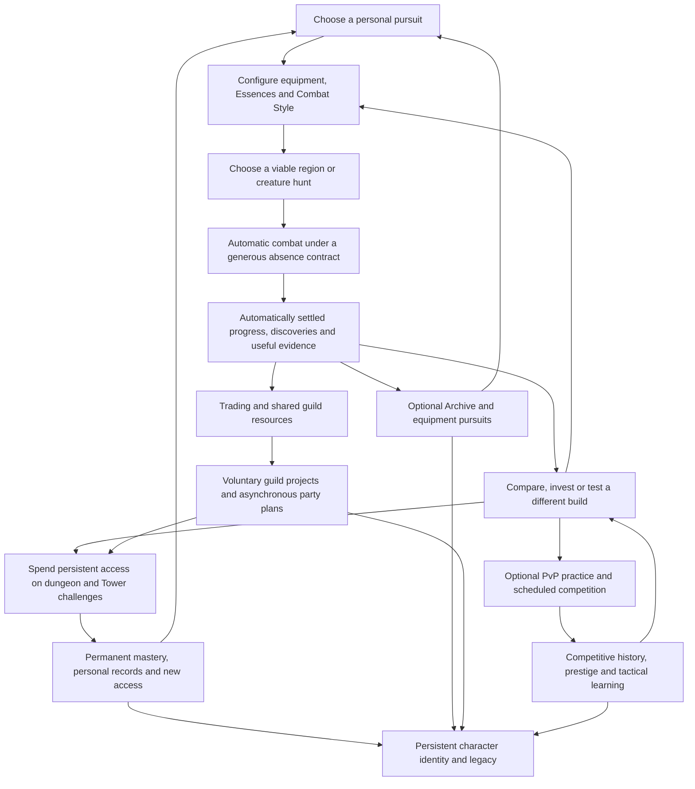

# LegendsLegacy: retention without chores

Repository analysis · 10 September 2026 · Design recommendations, not gameplay changes

**LegendsLegacy should retain players through unfinished ambitions, useful discoveries, and growing mastery. Its existing combat, collection, and challenge systems can support that. The immediate priority is removing attendance advantages from those systems before adding more content with timers.**

The largest conflicts found are the 24-hour offline combat cap, Prophecy rewards that require participation on distinct days, a 15-hour Colosseum ticket reservoir, daily guild orders, and short participation or claim windows. Several are connected to the same equipment and Essence progression. Their combined effect matters more than their individual labels.

A player who configures a hunt and returns three times a week should receive the value of that configured hunt between visits. More frequent players can improve their strategy sooner, play additional encounters, trade, and coordinate. Merely refreshing a page should not buy substantially more productive character time.

For decisions and implementation order, see the [prioritized roadmap](#13-prioritized-recommendations). For the full diagnosis, begin with the [current-system audit](#1-audit-of-the-current-retention-model).

## Scope and evidence

This report audits the primary game in `LL/`: domain and service rules, checked-in content/configuration, and the Angular player interface. It distinguishes substantive implementation from documents, unfinished reward paths, and proposals. Existing uncommitted changes were read as part of the working tree and left untouched. No external environment, live database, player telemetry, or deployed feature availability was inspected.

“Implemented” means a meaningful code path exists; it does not establish that a feature is enabled in production or balanced. Numbers below are source/configuration values, calculations from those values, or explicitly labeled design estimates. Emotional responses and retention effects are hypotheses to validate with players. Crafting and Gathering are treated as removed; references to them in older documents are not recommendations to restore them.

The user’s “Doctrines” map most closely to the implemented **Combat Styles** system. No separately implemented Doctrine system was found in the searched source. A personal Stronghold is a proposal, whereas guild construction and Soulstone Constellations already provide investment systems. The World Tower is especially important to describe correctly: its frontier belongs to the server, with party attempts and Echo replays; it is not currently a conventional personal floor ladder.

Source links appear beside findings and in the evidence register at the end. This is a code-grounded design audit, not a claim to have playtested the current build.

## 1. Audit of the current retention model

### The useful foundations

Current authored content includes 80 Essence definitions, 19 Codex collections, four Combat Styles, two regions, four dungeon families with three difficulties each, and 15 released Tower floors. These are catalog counts, not counts of equally viable builds or equally replayable challenges. Hundreds of future Essences would increase the curation and balance problem as much as the collection opportunity. [Essence catalog][essence-data] [Collections][collection-data] [Styles][style-data] [World][world-data] [Dungeons][dungeon-service] [Tower][tower-data]

The following two matrices cover the major mechanisms found. “Day/week” means ignoring that system, including a full game absence where its underlying idle cap also applies. A loss of a time-limited opportunity is distinguished from deletion of earned progress.

### Persistent and player-directed mechanisms

| System and primary classification | Reason to return; effect of ignoring it for a day / week | Quality of decisions and likely experience after 100 repetitions | Reset verdict and irregular-player impact |
|---|---|---|---|
| Area combat and region access — progression, exploration | Reach the next area, improve win rate, find a target. Existing unlocks remain after either absence; offline earnings have a separate 24-hour limit. | Target selection is meaningful when XP, loot, and encounter matchups differ. Repeatedly selecting the highest-level area is shallow; repeating the same resolved fights need not be interactive. | No world reset needed. Keep progress; make viable target tradeoffs visible. [World][world-data] [Idle planner][idle-plan] |
| Equipment drops, sets, reinforcement, dismantling — progression, optimization | Find a build component or afford an upgrade. Owned gear and invested ranks remain after a day/week. | Exciting when a drop changes a decision; tiresome if every visit means sorting dozens of inferior rolls. Reinforcing the only sensible item is administration after the early learning period. | No attendance reset justified. Preserve scarce investment decisions and improve comparison/filtering. [Equipment][equipment-service] |
| Essence discovery, attunement, loadouts — collection, optimization | Find a specific ability package and test a combination. Collection remains after absences; missed combat reduces acquisition under the offline cap. | Potentially excellent replayability, provided several encounters reward different combinations. Hundreds of duplicates do not create hundreds of decisions. | Keep persistent ownership and stored loadouts. No daily Essence allocation. [Essences][essence-service] |
| Essence XP and Ascension — progression | Reach a breakpoint and unlock further growth. XP caps at Ascension gates can stop further XP even while other combat rewards continue. | Ascension can mark a meaningful commitment; checking whether an XP bar has blocked is a chore. Repeating the same leveling burden on every experiment discourages experimentation. | No calendar reset, but a manual gate can function like a resource cap. Bank overflow or make training policy configurable. [Essences][essence-service] [Ascension][ascension] |
| Creature Archive, Codex collections, Focus and resonance — collection, exploration, resource timer | Discover a creature, complete a set, hunt a missing Essence. Existing records persist; Focus switching has an eight-hour cooldown. | Source knowledge creates anticipation, but current resonance is only a tiny probability increase, not a guarantee. Stat-bearing collection completion risks making every creature mandatory. Focus is a choice; waiting to correct a poor choice is not. | Keep records and target progress. Replace the arbitrary switching delay if it chiefly prevents convenient experimentation. [Archive][archive-service] [Codex][codex-service] |
| Combat Styles — optimization, identity, progression | Develop Bastion, Conduit, Reaper, or Duelist and change refinements/mastery choices. Unlocks survive both absence lengths. | A rule-changing identity can remain interesting; incremental style levels alone cannot. Preserve contextual alternatives rather than requiring all styles to be leveled for universal power. | Persistent progression; no maintenance XP or seasonal wipe. [Styles][style-service] |
| Soulstone Constellations — progression, investment | Work toward finite upgrade ranks. Purchased ranks persist. | Useful medium-term planning, but finite upgrades eventually conclude. They should support another pursuit instead of becoming an endless background multiplier. | Keep finite investment. Avoid duplicating it with a Stronghold upgrade tree. [Constellations][soulstone-service] |
| Ordinary quests and area unlocks — progression, exploration | Continue a story, choose a reward, unlock a destination. Ordinary quest progress persists across both absences. | Strong onboarding and regional direction; authored quests are usually completed once, not repeated 100 times. That is a feature, not a retention failure. | Preserve non-expiring objectives. Update the existing “complete a daily Prophecy” side quest if Prophecies change. [Quests][quest-service] [Prophecy quest][prophecy-quest] |
| Dungeon sigils and family mastery — progression, optimization | Spend earned access on a route, core, blueprint, or harder clear. Sigils/mastery persist; an active run has a separate expiry problem. | Routes, Vigor, rest, and retreat support decisions. Mastered routes become procedural unless challenge goals differ. | Entry is already resource-based, not a daily allowance. Do not introduce dungeon dailies. [Dungeons][dungeon-service] [Mastery][mastery-service] |
| Achievements, Titles, leaderboards — achievement, identity, competition | Complete a feat, display a history, compare a record. Owned achievements/titles generally persist; rankings can move as others play. | Feats remain meaningful; enormous kill-count ladders eventually become passive counters. Completionist incentives can pressure participation even without a timer. | Keep history and finite categories. Evaluate any time-window requirement separately. [Achievements][achievement-service] |
| Marketplace, equipment trade and buy orders — economy, player-created goals | Find a desired roll, finance a build, satisfy another player's demand. Assets are persistent; seven-day orders expire and return escrow rather than destroying it. | Pricing and specialization provide continuing decisions if supply and demand remain healthy. Constant relisting and undercutting can become labor. | Expiry can protect stale-price orders, but must not erase ownership or demand attendance. [Market][market-service] [Market configuration][market-config] |
| Guild membership, chat, equipment bank/loans, construction — social, investment | Help someone progress, plan a build, finish a shared project. Membership is not automatically a daily task; human guild policies may still create pressure. | Shared purpose can outlast content. Donation-score competition and permanent mandatory buffs can convert friendship into quota enforcement. | Preserve projects; avoid upkeep and attendance-based entitlement. Separate from daily orders below. [Guild vault][guild-vault] [Buildings][guild-buildings] |

### Calendar, timer, and interface mechanisms

| Mechanism and primary classification | Day / week absence consequence | Anticipation versus obligation; 100-repeat quality | Does the timing improve the game? |
|---|---|---|---|
| Offline combat cap — resource timer, habit | At roughly 24 hours the allowance is used. After three days, about two days cannot be credited; after a week, about six days cannot. | A productive hunt becomes a “refresh before losses” habit. Repeating the same check has no strategic value. | Bounded computation/economic issuance are legitimate constraints; this particular daily horizon conflicts with the requested play pattern. [Idle configuration][idle-config] [Planner][idle-plan] |
| Daily Prophecy selection and expiry — daily obligation, progression | Choose one of three daily offers. Acceptance precedes eligible progress. An absent day supplies no selected daily; a week crosses multiple unavailable opportunities. | A choice of chores still becomes obligatory when efficient progression depends on choosing every day. After 100 days, target variation is unlikely to offset acceptance/claim administration. | No demonstrated gameplay reason for midnight expiry. Replace with persistent pursuits. [Prophecies][prophecy-service] |
| Greater Prophecy and Weekly Revelation — weekly obligation, attendance incentive | Current-week milestones must be claimed within the week. Daily claims give one Favor, Greater gives two; thresholds are 3/5/7. The last tier needs five distinct daily completions with the Greater, or seven without it. | “Perfect Week Bonus” makes missing days legible as failure. Moving the reward to a weekly screen has not made its underlying attendance requirement weekly-flexible. | Remove distinct-day requirements and claim deadlines. Preserve long-form themed goals. [Revelation][revelation-data] [Prophecies][prophecy-service] |
| Guild personal orders, weekly mission tiers and weekly shop limits — daily/weekly obligation, social pressure | Three daily orders, a fourth at Mission Board level 3; missed periods are not a bank. Weekly contribution/reward eligibility and purchase limits create additional deadlines. | Personal power and visible contributions can make players feel they are letting others down. More developed guilds unlocking another daily order is checklist inflation built into progression. | Shared planning is useful; three or four expiring orders per member are not necessary for it. [Guild missions][guild-missions] [Guild content][guild-data] [Shop][guild-shop] |
| Colosseum ticket regeneration and daily first win — resource timer, habit, competition | One ticket every three hours, maximum five: full in 15 hours from empty. Skipped time beyond that loses ticket generation. First win pays +20 Glory in addition to a normal 12-Glory win. | The bonus is large enough to distort why players queue. Ticket disposal remains repetitive even when combat itself is enjoyable. | Match supply and fair competition need rules, but neither requires a 15-hour clock or a daily first win. [Colosseum][arena-service] |
| Champion Market weekly stock — weekly obligation, optimization | Unused weekly purchase opportunities lapse. Stock includes PvE-relevant resources. Current stock is fixed; rotation capability exists but is not used by these catalog entries. | A PvE optimizer can rationally feel obliged to play PvP and shop weekly. Calling the mode optional does not remove the reward incentive. | Keep predictable purchases; remove expiring purchase-cap pressure from essential build access. [Champion Market][champion-data] |
| Suspended dungeon expiry — timer, loss aversion | A one-day break is within the 48-hour run lifetime if started recently. A week exceeds it; pending loot can be forfeited. | It asks the player to return to protect already accumulated expedition value. On a familiar run, the return may be rescue work rather than curiosity. | Run cleanup is an engineering concern, not sufficient reason to destroy stored progress. [Dungeons][dungeon-service] |
| Tower support and Echo rewards — weekly obligation layered on aspiration | Permanent frontier/records survive. Echo token reward is once per character per week across floors; checked-in limits allow three manual scouts and ten preparation actions weekly. | The server frontier is a strong shared ambition. A contribution quota and routine Echo reward can make everyone service it whether or not their actions change a plan. | Tactical preparation is justified; repetitive capped contributions and weekly token collection need redesign. [Tower][tower-service] [Tower options][tower-config] |
| Tournament brackets and monthly standings — scheduled, competitive | Missed registration means missing that bracket. A month view can exclude a skipped month's results; that is not erasure of the character. | Shared competition creates real anticipation. Standings that reward entering every bracket turn opportunity into attendance scoring. | A common registration/result window genuinely coordinates a contest. Separate that purpose from season-long power rewards. [Tournaments][tournament-service] |
| Public/group raids — scheduled, aspirational, social | Implemented signup uses a 24-hour window; stored snapshots permit resolution without live attendance. Weekly reward logic favors a first/high-water clear, with reduced repeat rewards. | Boss planning has value; compulsory weekly clears would add another PvE income obligation. Actual reward availability is unfinished/disabled by default. | Keep asynchronous readiness. Treat weekly reward design as a pre-release decision, not established live behavior. [Raids][raid-service] [Raid options][raid-options] |
| Region boss events — scheduled, potential attendance incentive | Authored boss timing uses random 4–8-hour spawn intervals and ten-minute signup, but eligible characters with recent action activity are enrolled automatically. That eligibility looks back only 24 hours at `CharacterAction.UpdatedAt`. | Automatic snapshots already remove much live-signup pressure. Enabling rewards without changing the activity cutoff would reward refreshing activity daily. Current Mad King rewards are explicitly disabled, so that reward-pressure claim is prospective. | Preserve asynchronous participation; replace daily recency with deliberate standing participation. A ten-minute manual signup is not the whole enrollment model. [Regional boss][region-boss-data] [Enrollment][region-boss-service] |
| Server event quests — scheduled content, FOMO | The enabled-in-source Treasure Hunt runs 6 September 22:00 to 13 September 22:00 UTC, with claims ending 20 September 22:00. A week away may miss participation or claiming depending on dates. | Shared discovery can be fun; forfeiting earned milestones because a player returned late creates avoidable anxiety. Event progress uses occurrence time, which is a good foundation for correct offline attribution. | A festival can end; already earned rewards need not. Exact dates establish checked-in content, not confirmed live operation. [Event][event-data] [Settlement][event-service] |
| Sidebar badges and combat summary — habit cue, information | Prophecy badges count a missing daily choice, claimables, and every owned cache. Colosseum badges depend on capped tickets and can include first-win availability. A week can produce more apparent work. | Useful information becomes an inbox to clear. Cache ownership is not an emergency. The existing combat summary is informational; it is not a required claim for offline earnings. | Preserve the summary, change its priorities, and reserve attention signals for chosen goals or actionable failures. [Prophecy badges][prophecy-notifications] [Arena badges][arena-notifications] [Summary][summary-service] |

No substantive login-streak reward, battle-pass system, personal Stronghold loop, or separate Doctrine implementation was found in the searched `LL/src` source. A Colosseum **win streak** is a competitive result streak, not a login streak. Planned guild buildings, empty vendors, and disabled rewards must not be counted as finished retention loops.

### The central contradiction, quantified

Assume an unchanged viable hunt, no intervening build changes, and enough time between visits to hit the offline limit. Seven daily resolutions can credit approximately 168 hours in a week. Three resolutions, each separated by more than 24 hours, can credit approximately 72 hours: **43% of the configured combat time**. One weekly resolution credits approximately 24 hours: **14%**. Boundary encounters do not materially change those ratios.

This is not primarily a reward for playing combat more. It is a reward for refreshing an idle plan more often. Better strategy may appropriately distinguish the daily visitor; the calendar should not separately multiply the same strategy's output. The planner clamps the starting time to the latest allowed window, rather than retaining older elapsed time as deferred work. Internal processing batch limits are a different concern. [Planner][idle-plan] [Configuration][idle-config]

## 2. How checklist inflation would happen

Consider an illustrative mature player with a developed guild, several builds, dungeon access, Tower participation, PvP, and a future Stronghold. The following is a **hypothetical risk scenario**, not measured current session duration or a claim that dungeon/Stronghold dailies already exist. Estimates count active administration/play time, exclude passive combat, and assume some activities overlap.

| If each feature acquires its own routine | Active minutes/day, illustrative | Why the player feels compelled |
|---|---:|---|
| Resolve idle progress and sort routine loot | 3–5 | Avoid the 24-hour ceiling and inventory overload |
| Choose/reroll/claim Prophecy work | 3–6 | Preserve weekly completion tier |
| Three or four guild orders and contributions | 4–8 | Personal rewards and visible guild contribution |
| Spend PvP tickets and secure first win | 5–10 | Avoid overflow and lost Glory |
| Hypothetical daily dungeon allowance | 8–15 | Bank the day's access/reward |
| Hypothetical daily Tower attempt/support quota | 2–4 | Keep shared progress moving |
| Hypothetical Stronghold collection/actions | 2–4 | Avoid full buildings and idle workers |
| Check rotating shops and dispose of claims | 2–3 | Avoid missing efficient purchases |
| **Total before a self-selected goal** | **29–55** | Eight reasons to clear a screen |

Add 45–90 minutes of weekly raid coordination, guild tiers, PvP brackets, shop spending, and event deadlines. That is **248–475 minutes per week**—about 4.1–7.9 hours—before generously assuming substantial overlap. It also excludes asynchronous waiting, reading new rules, and the burden of remembering different clocks.

A player with three 30-minute sessions has only 90 minutes. They cannot finish this imagined upkeep, let alone do something personal. A daily player may complete it efficiently for a while and then stop the whole game when the queue becomes exhausting. Neither outcome demonstrates weak motivation for the underlying RPG.

Overlap reduces minutes but can increase control: “farm this area because it completes your Prophecy, guild order, and weekly cache simultaneously” can crowd out the Essence the player actually wanted. Automatic kill-count objectives also become chores when they require acceptance before farming, redirect the hunt, stop credit at midnight, or require reward claims.

The unhealthy point is not a medical time threshold. It is when **protecting expiring value reliably takes priority over a player's chosen ambition**, or when taking a break converts opportunities into debt. Measure that displacement; do not diagnose burnout from playtime alone.

## 3. A retention philosophy for LegendsLegacy

### Progress belongs to the player; the schedule belongs to the contest

Character levels, discovered Essences, Archive records, build unlocks, completed challenges, and earned rewards should survive absence. A scheduled tournament can end because contestants need an outcome. An ordinary hunt objective does not need to disappear because the date changed.

Separate four things in every design: **ownership** (what is earned), **opportunity** (what may be attempted), **activity** (what the player chooses), and **presentation** (what the UI asks them to notice). A weekly maximum can limit issuance without expiring owned currency. Automatic settlement can remove a claim without removing its reward. A permanent challenge can coexist with a seasonal best-score table.

### Persistent goals need direction and an end

A non-expiring “kill 100,000 monsters” is still weak design if it does not express a desired outcome. A good goal names a destination and a strategic question: acquire an interrupt for a particular boss, finish a collection that supports a chosen build, or clear a dungeon using less rest.

Offer one primary pinned pursuit and, optionally, two secondary interests. Show the next useful step and why it matters. This is a view over existing content, not another currency, quest chain, or mandatory dashboard. Completed pursuits should end cleanly. Do not immediately replace a finished task with its larger identical successor just to keep a progress bar populated.

### Accumulate opportunity without manufacturing backlog

If an activity genuinely needs a rate limit, accumulate eligibility automatically even while the player is offline. Never require a login to generate the allowance. Prefer a reserve with **at least seven days of useful flexibility and some headroom**, and no weekly deletion. A hypothetical one-per-day allowance could hold 14 rather than seven; seven exactly still puts a weekly player against a cliff.

But a bank of 56 compulsory arena fights is not humane merely because it lasts a week. Banking solves scheduling, not workload. First lower the required work or remove the reward dependence, then size the bank. Display “available when wanted,” not a red “full” alarm. A player must be able to ignore a full optional reserve without losing essential progression.

### Weekly cadence is coordination, not a design cure

One common weekly boundary is easier to understand than seven different ones. It is still a deadline. Use it for publishing tournament results or an optional shared briefing, not to wipe unfinished personal goals. A Sunday evening completion spike can indicate the same pressure that midnight dailies create.

### Reward milestones that change possibilities

A major reward should unlock a viable tactic, encounter, role, target, or social opportunity. Small gains are useful when they visibly approach that change. Persistent percentages alone eventually turn every system into an obligatory source of global power.

Allow finite power growth within a release and longer horizontal pursuits. “Maxed this build” is a satisfying state that can lead to another build or a break. Do not punish it with recurring maintenance.

### Protect seven-day idle plans; treat longer absence honestly

Recommended initial contract: **at least seven days of the configured ordinary combat plan resolve at normal rules, with additional headroom where validated**, and rewards settle automatically. This protects the stated three-session week and a one-week break. It does not promise seven days of wins, automatic area advancement, or automatic spending of scarce Ascension materials.

Beyond seven days, preserve the character and goals, but do not silently simulate unlimited months of tradable wealth. Disclose the boundary when planning, without a countdown campaign. At return, offer a permanent route back to a useful build and, where balance/content changes justify it, help reaching an established content-entry floor. Distinguish this assistance from repayment of every hour absent.

A finite rested allowance is an optional Beta experiment, not a prerequisite: bank up to seven days of ordinary **character XP assistance**, applied gradually during subsequent play, never expiring and never affecting ranked results or tradable drops. If it encourages deliberate inactivity or turns into a visible debt bar, remove it. Do not introduce it to conceal an unnecessarily short ordinary offline cap. Later-stage assistance should depend primarily on distance from relevant content, not on performing a ritual of leaving and returning.

### Horizontal choice must have tolerable switching costs

Players cannot experiment freely if an alternative Essence requires weeks of compulsory leveling before its mechanic works. Let the mechanical identity function early; reserve full investment for mastery and high-end strength. Preview a candidate in a bounded practice encounter before committing scarce resources. Use existing loadouts and combat infrastructure.

Horizontal rewards must stay horizontal enough to remain optional. If every collection, Doctrine, title, guild building, and seasonal vendor grants stacking universal power, the rational optimizer needs all of them. That is a checklist without checkboxes.

### Use psychology as a hypothesis, not a promise

Autonomy, competence, and relatedness are useful questions: did the player choose a goal, learn something, and connect with someone? They are supported as motivational constructs in game research, but do not guarantee multi-year retention for this game. [A Motivational Model of Video Game Engagement](https://selfdeterminationtheory.org/SDT/documents/2010_PrzybylskiRigbyRyan_ROGP.pdf)

Research also challenges simplistic use of that framework in games. Validate the proposed mechanisms through observed choices and player explanations rather than attaching psychological labels to a feature specification. [Self-Determination Theory and HCI Games Research](https://arxiv.org/abs/2405.12639)

## 4. Eighteen natural reasons to return

These are extensions or presentations of existing systems unless explicitly marked as new. Complexity is relative: **low** means content/UI or contained rule work; **medium** crosses several existing layers; **high** changes settlement, combat evaluation, social state, or economic behavior. It is not an estimate in developer-days.

### 1. A pinned personal pursuit

**Mechanic:** Pin an Essence, collection, equipment component, dungeon clear, or Tower challenge; show its source and nearest useful milestone. **Return motive:** “How much closer am I?” **Horizon:** One session to several weeks. **Decision:** Choose the desired outcome and switch when interests change. **Idle:** Hunt results update the pursuit automatically. **Reset:** None. **Week away:** Goal remains and shows credited progress. **Downside:** Over-prescriptive recommendations can become another task list; offer explanations, not an optimal daily route. **Complexity:** Medium. **Integrates:** Quest pinning, Archive sources, loot tables, character unlocks, challenge records.

### 2. Targeted Essence hunts with persistent bad-luck progress

**Mechanic:** Extend existing Focus/resonance with clear odds or progress and stable target ownership. **Return motive:** A desired ability is becoming attainable. **Horizon:** Several days to weeks for a rare target. **Decision:** Choose between faster general growth and a particular Essence. **Idle:** Eligible kills advance the same hunt. **Reset:** No calendar reset; acquisition may conclude the guarantee cycle. **Week away:** Credited kills count; switching later should not destroy all prior target investment. **Downside:** Too generous a guarantee removes surprise; too opaque a guarantee feels fraudulent. **Complexity:** Medium. **Integrates:** Creature Archive, resonance, Essence loot and target UI.

### 3. Small, chosen Archive expeditions

**Mechanic:** Surface three-to-six-creature themed subsets within existing collections, with location/lore hints and useful but bounded rewards. **Return motive:** Finish a personally appealing family. **Horizon:** One to four weeks. **Decision:** Which subset fits the build or collection interest? **Idle:** Hunts discover entries and advance persistent counters. **Reset:** None. **Week away:** Collection is unchanged except for credited discoveries. **Downside:** Universal stacking bonuses make all subsets compulsory; favor unlocks, presentation, and selective benefits. **Complexity:** Low–medium. **Integrates:** Existing 19 collections, Archive, Titles, source locations.

### 4. An alternative Essence that becomes usable early

**Mechanic:** Make an Essence's defining mechanic available before maximum investment; use duplicate Dust for optional acceleration and preserve capped XP as training reserve. **Return motive:** Try the newly found combination. **Horizon:** A session to several weeks of refinement. **Decision:** Whether to use an imperfect alternative now or invest further. **Idle:** Configured training advances without daily servicing. **Reset:** None; Ascension remains an explicit investment. **Week away:** XP reserve survives rather than disappearing at the gate. **Downside:** Free unlimited overflow can collapse intended progression; reserve rules and costs need balance. **Complexity:** Medium. **Integrates:** Essence XP, Dust, Ascension, loadouts.

### 5. Evidence-based build experiments

**Mechanic:** Compare saved loadouts against a previously encountered challenge, showing deaths, damage patterns, sustain, and ability contributions. **Return motive:** Test a hypothesis after a new drop or insight. **Horizon:** 10–30 minutes, recurring over months. **Decision:** Which change addresses the actual failure? **Idle:** Compare subsequent hunt outcomes with the prior setup. **Reset:** None. **Week away:** Saved setups and useful results remain. **Downside:** A perfect optimizer can solve the game for the player; show diagnostic evidence, not a universally correct build button. **Complexity:** Medium–high. **Integrates:** Combat telemetry/replays, existing equipment and Essence loadouts, balance-harness concepts adapted to player access.

### 6. A targeted equipment project

**Mechanic:** Let players identify a desired slot/mechanic and compare known combat/dungeon sources, then choose between reinforcement and continued hunting. **Return motive:** Find a meaningful replacement. **Horizon:** Days to weeks. **Decision:** Improve a good current item or save for a different role. **Idle:** Gear and reinforcement inputs arrive from combat. **Reset:** None. **Week away:** Items and earmarked resources remain. **Downside:** Layered rarity/quality/affix lotteries can make the actual target implausible; tune the whole acquisition path. **Complexity:** Medium. **Integrates:** Equipment drops, sets, reinforcement, dismantling, marketplace; no restored crafting profession.

### 7. A matchup collection of builds

**Mechanic:** Encourage two or three loadouts with distinct purposes: safe hunting, burst-window boss damage, support or PvP. **Return motive:** Complete the missing role and revisit a troublesome enemy. **Horizon:** Weeks to months. **Decision:** Where a second build solves something the first cannot. **Idle:** A selected build earns resources for alternatives. **Reset:** None. **Week away:** Configurations persist. **Downside:** Forcing a different loadout for every enemy becomes equipment administration; reuse archetypes and make switching coherent. **Complexity:** Medium. **Integrates:** Existing loadouts, Styles, Essence packages, encounter mechanics.

### 8. Combat Style proof-of-mastery feats

**Mechanic:** Add a small permanent feat sequence that demonstrates a style's rule-changing mechanic in actual encounters. **Return motive:** Become a recognizable specialist. **Horizon:** Weeks to months. **Decision:** Which encounters and refinements express that identity? **Idle:** Natural use can progress practice; final feats can require a deliberate attempt. **Reset:** None. **Week away:** All progress remains. **Downside:** “Use ability 10,000 times” merely disguises an XP bar; assess successful decisions or outcomes. **Complexity:** Medium. **Integrates:** Combat Styles, achievements, Titles, dungeons/Tower.

### 9. Dungeon route mastery

**Mechanic:** Extend existing family mastery with permanent records for differing route/risk choices. **Return motive:** Conquer the next difficulty or improve a meaningful result. **Horizon:** A session to a month. **Decision:** Rest, push, take treasure, or retreat. **Idle:** Ordinary combat acquires persistent access; the player can suspend the decision sequence safely. **Reset:** None; remove punitive run expiry. **Week away:** Resume the stored state or safely settle if an update invalidated it. **Downside:** Optimal-route repetition; use a few authored tradeoffs, not random chores. **Complexity:** Medium. **Integrates:** Dungeon Vigor, routes, treasury rewards, sigils, family mastery.

### 10. A personal Tower record beside the server frontier

**Mechanic:** Track a character/party's first meaningful clear of each released Echo floor and optional feat records. **Return motive:** “Our group can now beat floor X.” **Horizon:** Weeks to months. **Decision:** Select a floor, role, and preparation. **Idle:** Normal progression prepares the build; it does not auto-win Tower floors. **Reset:** Personal first clears and server history never reset. **Week away:** The server may advance, but earlier floors and personal rewards remain available. **Downside:** Rewarding every record with stacking power can become compulsory; keep repeat rewards modest and core rewards once-only. **Complexity:** Medium. **Integrates:** Existing Tower/Echo encounters, parties, Hall of Fame, Titles.

### 11. Community boss discovery

**Mechanic:** Shared scouting reveals persistent tactical information and finite preparation choices for the current frontier boss. **Return motive:** Learn what the guild/server discovered and help apply it. **Horizon:** Days to several weeks. **Decision:** Which unresolved boss question to investigate. **Idle:** Relevant hunts can provide evidence without separate daily clicks. **Reset:** Only a new boss presents a new problem; recorded lore persists. **Week away:** Read the digest and join at the current understanding. **Downside:** Spoilers and dominant guides; retain encounter variation and make information an aid, not an automatic victory. **Complexity:** Medium–high. **Integrates:** Tower scouting/preparation, combat logs, guild chat.

### 12. One guild construction ambition

**Mechanic:** Choose a persistent shared project using existing supplies/construction; contributions can come from a voluntary standing policy with explicit spending limits. **Return motive:** See a place or shared capability develop. **Horizon:** Weeks to months. **Decision:** Project priority and affordable contribution. **Idle:** Chosen ordinary activity can contribute automatically when appropriate. **Reset:** No weekly project wipe or upkeep. **Week away:** Project advances with other members; the absent member incurs no debt. **Downside:** Large guild advantage and social coercion; use roster-sensitive project sizing and avoid universal combat requirements. **Complexity:** Medium. **Integrates:** Guild supplies, construction, contribution records, vault.

### 13. Asynchronous raid plans

**Mechanic:** Store an opt-in party roster, loadout snapshots, and roles; members prepare over a generous window and can replay the result later. **Return motive:** See whether the shared plan worked and improve it. **Horizon:** Several days to weeks. **Decision:** Role allocation, composition, and difficulty. **Idle:** Members can be offline at resolution; ordinary hunts support preparation. **Reset:** Encounter resolves, but progress records and earned rewards persist. **Week away:** No involuntary signup, penalty, or lost earned reward. **Downside:** Roster waiting and loot entitlement disputes; clear readiness, substitutes, and minimum contribution rules are needed. **Complexity:** Medium–high. **Integrates:** Implemented public raid snapshots/wings, party invitations, guild coordination; not an assumed guild-only raid service.

### 14. Reusable guild expertise

**Mechanic:** Attach a shareable loadout and short tactical note to a challenge, and lend suitable bank equipment. **Return motive:** Help someone succeed or see what they learned. **Horizon:** Sessions to years. **Decision:** Advice, loan, or a joint attempt. **Idle:** The recipient can test the advice during their next hunt. **Reset:** None. **Week away:** The note persists; loans need clear terms that do not confiscate unrelated progress. **Downside:** Mentor quotas and farmable helper rewards would spoil it; recognition should not require daily service. **Complexity:** Low–medium. **Integrates:** Chat, equipment loans, inspection, loadouts, encounter records.

### 15. Bounded competitive campaigns

**Mechanic:** A season provides a shared ruleset, placements, and a limited number of counted best results; practice stays available. **Return motive:** Test an improving plan against other people. **Horizon:** Sessions to an eight-week pilot season. **Decision:** Composition, opponents, counters, team readiness. **Idle:** Defense/registered team snapshots resolve without requiring live spectating. **Reset:** Public standings close; character progression and historical achievements do not wipe. **Week away:** Some contests pass, but sufficient remaining opportunities and best-result scoring prevent automatic exclusion. **Downside:** Small population and smurfing; validate matchmaking and avoid excessive queue fragmentation. **Complexity:** High. **Integrates:** Colosseum, Tournament Grounds, snapshots, Glory, records.

### 16. An economic specialization

**Mechanic:** Pursue a known combat-drop niche, maintain a commodity buy order for an eligible input, and use equipment listings or a proposed saved search for a desired piece. **Return motive:** A sale funded an upgrade or an order filled. **Horizon:** Days to months. **Decision:** What to hunt, sell, keep, or purchase. **Idle:** Combat supplies trade; orders execute asynchronously under explicit limits. **Reset:** No reward reset; order expiry protects price commitments with automatic escrow return. **Week away:** Review a compact settlement history and optionally renew. **Downside:** Alt farming, market concentration, and excessive offline supply; balance against issuance and useful consumption. **Complexity:** Medium. **Integrates:** Existing marketplace, buy orders, trade chat, equipment drops and reinforcement demand. Current buy orders support unbound stackables, not arbitrary equipment.

### 17. Persistent Prophecy chapters

**Mechanic:** Choose a thematic prediction that culminates in a meaningful feat, with intermediate progress from ordinary goals. **Return motive:** Fulfill a story attached to the character's ambition. **Horizon:** Several sessions to a month. **Decision:** Which chapter suits the current build or desired challenge. **Idle:** Relevant progress counts automatically after choosing, with safe future switching and no daily acceptance. **Reset:** None. **Week away:** Resume the same chapter; completed rewards are already owned. **Downside:** A thinly reskinned grind is worse than removing the feature; require distinct purposes. **Complexity:** Medium–high because period/state/reward semantics change. **Integrates:** Existing Prophecy event hooks, ordinary quests, achievements, caches, narrative.

### 18. An earned personal legacy display

**Mechanic:** Begin with a small profile/Archive display of meaningful drops, records, collections, and guild memories; expand into a cosmetic Stronghold only if players value it. **Return motive:** Build and show a recognizable history. **Horizon:** Months to years. **Decision:** What represents this character. **Idle:** Adventures unlock display choices; there are no buildings to collect. **Reset:** None. **Week away:** Nothing decays or needs maintenance. **Downside:** Large housing scope and limited audience; prove interest with existing profile UI first. **Complexity:** Low–medium for the first version, high for a full estate. **Integrates:** Titles, Archive, equipment, Tower/raid records, guild history.

## 5. Connect the progression horizons

Use one continuing story: **a player wants their party to beat a Tower guardian; combat results suggest a survivability problem; they hunt a missing Essence and improve a support loadout; a dungeon funds Ascension; the improved party clears the encounter; that opens another strategic pursuit.** The exact guardian, mechanic, and tuning must come from validated encounter content; this is a proposed player journey, not a claim that every link is already surfaced in the UI.

| Horizon | Meaningful experience in that same chain | What the player carries into the next horizon |
|---|---|---|
| Session: 10–30 minutes | Read the last failure, compare two loadouts, choose a hunt, or make several dungeon route decisions. Continuing is worthwhile because the next decision is interesting. | A hypothesis, an improved configuration, and a clear stopping point. The game does not need to occupy the full 30 minutes. |
| Tomorrow: optional curiosity | Look for a desired drop, see whether survival improved, or read a teammate's idea. The same information will still be useful three days later. | Visible evidence and incremental resources toward the chosen change. |
| Week | Acquire or prepare a usable component, clear a harder route, or reach an Ascension milestone. Some rare hunts remain unfinished, but progress toward them is legible. | A new tactical option rather than only a larger number. |
| Month | Complete a coherent second build and beat the previously blocking challenge. Try the new route or role that the clear enables. | A meaningful accomplishment and a reason to reconsider targets. |
| Several months | Become known for a style/role, develop a curated Archive, contribute to guild history, and own several effective builds. | Character identity, useful expertise, relationships, and durable records. |
| Years | Return to new encounters that ask new questions of existing collections, maintain friendships, compete in selected campaigns, trade useful discoveries, and commemorate a history. | Continued relevance of prior investment plus fresh strategic problems. Breaks are part of this pattern. |

Do not pace every player to these exact dates. The table is a content/value structure, not a promise that the median player must spend one month on a particular boss. During Beta, measure time to a **usable build** separately from time to a maximized build. A new player should learn the combat loop well before encountering month-long commitments.

The hard challenge to the multi-year ambition: two authored regions and 15 released Tower floors cannot by themselves establish years of interesting strategic play. Neither can a nominal 100-floor reward curve or an achievement asking for 500 Essences when 80 are authored. A solo developer needs reusable encounter rules, manageable balance, community value, and occasional substantive additions. Extending every XP curve to make the existing content last longer risks boredom instead of longevity. [World][world-data] [Tower][tower-data] [Essence achievements][essence-achievements]

## 6. Decisions for the named systems

### Essences: make the collection a toolbox, not an account tax

Keep discovery, explicit source knowledge, stored loadouts, persistent Focus, duplicate Dust, and Ascension. Current Ascension retains levels and occurs at levels 10/30/60, using 6 lesser, 12 greater, and 24 primal cores. After ten qualifying Ascensions, lower-tier costs improve to 3 and 8 cores respectively. This already helps later alternative builds through accomplishment; it is a better foundation than a daily Essence XP bonus. Combat XP goes to each attuned Essence, and Dust can supply a level's XP up to its cap. [Ascension rules][ascension] [Essence operations][essence-service]

Three specific problems deserve attention:

1. **The current luck protection is not strong protection.** All 77 authored creature Essence loot tables inspected use base probability 0.0001 per eligible kill. Focus multiplies the Essence chance by three and the creature's spawn weight by 1.2. At 12,000 failed kills, resonance adds only 1% *relative* chance: 0.01% becomes 0.0101%, not 1.01%. A focused 0.03% becomes 0.0303%, before other bonuses. It resets on a successful drop. Do not describe this as a guarantee or a substantial safety net. [Loot tables][essence-loot] [Focus rules][focus-rules] [Resonance][resonance-rules]
2. **Ascension gates can destroy training value.** Excess XP is discarded at the cap; the player must ascend before later XP can count. Across many equipped/alternative Essences this rewards servicing bars promptly. Bank XP without automatically spending cores; explain that the power unlock still needs the player's decision. [XP progression][essence-progression]
3. **Collection power can eliminate optionality.** A collection's bonus scales with its lowest member's Ascension tier, and unlocked bonuses apply automatically. That makes the least interesting member a tax on the whole set. With hundreds of Essences, stacking general bonuses can require leveling the entire catalog. Put a bounded budget on universal power; favor chosen-set benefits, sidegrades, cosmetics, lore, and character expression. [Codex][codex-service] [Bonus application][codex-bonuses]

For scale, a constant 0.01% drop probability has a median first drop at 6,932 eligible kills and a 95th percentile at 29,956. At 0.03%, those are 2,311 and 9,985. These are simplified probability calculations that ignore resonance, other bonuses, and mixed spawns, not live acquisition forecasts. Their purpose is to show why an average acquisition time is insufficient: an unlucky collector can take over four times the median before source availability is considered.

Use a persistent first-discovery guarantee or a source-specific choice after meaningful hunting. Do not make the rarest Essence the sole solution to a progression gate. After the first discovery, duplicates and near-perfect investment can retain longer optional tails. Distinguish “can try this build” from “has perfected this build.”

Unusual combinations need encounters that recognize them: support, interruption, burst windows, defense, attrition, summons, and other supported combat mechanics should matter in differing circumstances. Merely collecting another statistically inferior ability is not horizontal progression. Expand useful search/filter/source views and saved profiles before scaling the catalog dramatically. There are currently three Essence loadouts and three equipment loadouts; hundreds of Essences will stress that organization. [Essence limits][essence-limits] [Equipment profiles][equipment-loadouts]

Evolution has a service operation, but all inspected definitions have empty catalyst IDs and empty evolution changes. Treat meaningful authored evolution as unfinished. Do not add it as another daily responsibility. Finish the existing discovery-to-experiment path first. [Essence catalog][essence-data]

### Equipment: make the drop change a choice

Combat acquisition, deterministic reinforcement, dismantling, partial recovery, set/variant choices, and blueprints already provide several axes. No ordinary equipment durability/repair or inventory-cap stop was found in the inspected current paths. Do not introduce either to manufacture return visits.

Ordinary-area equipment is drawn from regional acquisition rules; a comprehensive named-monster-to-named-item hunt system was not verified. Recommend source targeting as an extension, not something already delivered. Show the difference between “this region can produce the style I need” and “this creature drops the exact item.” [Acquisition][equipment-service] [Ordinary reward rules][ordinary-equipment]

At the checked-in ordinary drop rate and an illustrative uninterrupted 100% win rate, combat produces roughly ten equipment drops and two sigils per 24 hours, before other activities. The ordinary table includes 3% Rare equipment and 2.5% Masterpiece quality. If those rolls are independent, their conjunction alone averages one Rare Masterpiece per roughly 133 fully credited days, before requiring a particular slot or mechanic. This is not a claim that such an item is required or that all sources share that rate. It demonstrates why adding rarity layers can produce enormous tails without adding decisions. [Ordinary equipment][ordinary-equipment]

Keep a strong usable-item floor. A player should complete an effective equipment concept through achievable drops, reinforcement, and trade; exceptional rolls can remain aspirational. Make special mechanics legible, provide meaningful tradeoffs, and avoid a single “higher score always wins” replacement rule.

Blueprints already have a persistent guarantee by the fourth eligible completion, but the guarantee selects from a source pool rather than ensuring the exact desired blueprint. This is a useful precedent: retain the persistent counter and consider eventual selection when duplicate-tail frustration appears. Reinforcement is deterministic, with 50% rank-part recovery on dismantling; that supports commitment without making replacements entirely punitive. These are existing equipment progression operations, not a reason to restore removed professions. [Blueprints][blueprint-data] [Acquisition][equipment-service] [Upgrade policy][equipment-upgrade-data]

### Doctrines: use Combat Styles as the identity layer

The current four styles are selectable at base level zero. Their ten-level progression unlocks refinements and later options, including upgrades, an opening technique, and mastery choices. Introducing a lengthy acquisition quest for every style would add a gate to something players can already explore. That needs a stronger justification than “months of retention.” [Style service][style-service] [Style rules][style-rules]

Keep initial access broad. Let substantial mastery arise from using the style, completing permanent proof-of-mastery feats, and solving more demanding encounters. A mastery choice should alter how the player handles a problem; a global +1% reward for mastering every style would push everyone to complete all bars.

If future Doctrines are distinct from Styles, require a clear design boundary first. Two parallel identity trees with overlapping passives would confuse build ownership and increase balance cost. Prefer evolving the existing style schema and saving style selections with the full loadout. Respecialization should preserve prior mastery and permit experimentation; character identity can come from a player's preference rather than an irreversible mistake.

### World Tower: permanent server history plus personal achievement

**Keep the main Tower permanent. Do not seasonally reset its frontier.** A first-clear history represents actual shared accomplishment; wiping it makes the world less credible. First clears already unlock server progress, and current Meran areas require server Tower floor 10. That connection is important: a small, stalled server can block later-region access for everyone. Monitor time-to-unlock and whether viable parties exist; use balanced party accessibility or an alternative unlock path if population cannot sustain the gate. Do not solve it by requiring daily scouting contributions. [Tower resolution][tower-service] [Region gates][world-data]

Add personal first-clear and feat records on released Echo floors so latecomers still have a Tower journey. Server-first prestige may remain historically unique, but baseline power and encounter access should remain attainable later. An absent player can miss being first without being locked out of being accomplished.

Change these current rules:

- **Preparation should persist for the unresolved floor or attach to a committed expedition.** Current preparation considers only the current week, so communal power evaporates on Monday while the boss may remain undefeated. Scouting already persists; retain that distinction only if it serves an actual strategic choice, not a replenishing contribution quota.
- **Replace ten one-unit preparation clicks and three one-unit scouting actions with an intentional contribution or expedition policy.** Current operations accept only one unit at a time. A weekly batch button would reduce taps but preserve a chore unless the contribution itself affects a decision.
- **Protect helping.** The first successful Echo across any floor consumes that week's token reward. Helping on a lower floor can cost a player a later higher-floor payout. Remove this reward cadence if possible; otherwise bank eligibility and grant upgrades by difference for better results, as the raid reward design already attempts.
- **Give Tower Tokens a defined purpose before expanding them.** A grant path plus a “quartermaster preparing stock” message is not a finished retention loop. Prefer one-time milestones and bounded prestige purchases; do not finish the shop by creating another weekly supply checklist. [Tower mechanics][tower-service] [Configuration][tower-config] [Shop state][tower-shop]

A later competitive Tower challenge can reset its **leaderboard** under a fixed ruleset. Keep it separate from permanent floors, earned rewards, and personal records. That gives a reset a clear purpose without forcing the whole population to climb again.

### PvP: seasons should answer who competed well

Ordinary Colosseum already has asynchronous defense, rating movement, attack history, and a performance win streak. No runtime seasonal rating wipe or passive rating-decay operation was found in the searched paths. Defense losses can still change rating while the owner is absent; lifetime highest rating remains. Preserve history and explain current placement on return. [Colosseum][arena-service]

Remove the +20 daily first-win bonus and redistribute the intended reward budget into ordinary play or persistent achievements. Rework the five-ticket/three-hour system at the same time as weekly PvE vendor supplies. Changing just one leaves the other reasons to visit every day.

For a concrete Beta prototype, test a **small rated series** instead of eight separate daily ticket opportunities: one entitlement accrues every 48 hours, reserve of eight, with a series of perhaps three saved-opponent fights producing one scored/rewarded result. This protects more than a week of scheduling flexibility and reduces repetitive entry work. Those numbers are tuning proposals, not validated balance. Let practice remain available without economic rewards. Compare diversity, queue health, reward issuance, and obligation surveys before adopting it; retaining the current fight interface with better banking is the smaller implementation alternative.

Tournament Grounds already saves builds during registration, resolves automatically, and automatically settles older outstanding awards when a later bracket begins. Keep those good properties. Registration currently closes Saturday at 00:00 UTC before Saturday's noon battles, so a Saturday-only player cannot join that week's bracket then. Standing opt-in or compatible alternative registration windows can help without requiring live round attendance. Do not add free signup to every future event automatically without explicit player preference. [Tournament service][tournament-service] [Tournament schedule][tournament-config]

Current monthly standings sum every completed tournament placement, so more appearances raise score. This is a monthly results view, not a fully implemented seasonal contract. For a genuine season, test eight weeks with eight weekly opportunities, count the best four results, and retain peak ratings, results, and cosmetic records. This permits skipped weeks without adding another weekly commitment. New and returning players need a provisional entry path; do not force weaker opponents to absorb experienced returnees indefinitely. Population data must decide whether separate normalized competition is sustainable.

Skipping a season should mean “I was not in that contest,” not “I lack a permanent combat bonus required in the next one.” Seasonal cosmetics can return through a permanent legacy catalog; titles that literally record winning a specific past contest can stay historical. Guild Wars 2's official support documentation provides a concrete precedent for keeping prior unique rewards purchasable, though its daily/weekly task structure is not the model recommended here. [Official Wizard's Vault description](https://help.guildwars2.com/hc/en-us/articles/19617357502867-Secrets-of-the-Obscure-Wizard-s-Vault)

### Guilds: reward belonging without taxing it

Keep construction priorities, shared property, equipment lending, recruitment, and chat. Current building purchases upgrade immediately; there is no inspected building-income collection timer or upkeep. A Stronghold-style chore loop is not necessary to make a shared place valuable. Some guild building benefits are explicitly future work; Raid Hall plans are not evidence of a finished guild-only raid system. [Buildings][guild-buildings] [Vault][guild-vault] [Guild catalog][guild-data]

Replace daily orders with one persistent shared campaign or building objective. Credit normal contributions automatically, and permit multiple useful routes: combat, relevant dungeon results, voluntary donations, lending, or coordination where it can be recognized without an abusable power faucet. A player may choose a standing contribution limit, but never spend scarce inventory on their behalf without that explicit policy.

The existing daily orders include kill 100, clear five rooms, complete a dungeon, and an unlocked absorb/shatter Essence task. Two dungeon objectives can overlap; they are not necessarily separate runs. Kill contributions already receive historical idle credit at processed combat boundaries; automatic objective progress is partly present today. Nevertheless, manual claims grant guild XP and supplies, making absence mechanically relevant to guild construction. The proposed change is automatic reward settlement and persistent objectives. The Mission Board unlocks a fourth daily task and increases reward efficiency. Change that upgrade into additional project choice or helpful coordination capacity. [Mission service][guild-missions] [Idle guild credit][idle-guild-credit] [Orders][guild-data]

Current weekly targets are fixed, including 432,000 kills or 100 dungeon completions; personal tiers require 2.5–10% of the guild target and the collective target must complete. This structure can be disproportionately difficult for smaller guilds. Size persistent projects to a declared/established participation roster with stable rules; never shrink the target immediately after a kick or enlarge it midway because someone joins. Preserve contribution if someone changes guild, with clear anti-double-claim rules. Recognition should describe accomplishments and help, not merely weekly volume rankings.

Do not promise to eliminate all interpersonal obligation. Friends arranging a raid may reasonably expect a committed participant or substitute. The game's job is to make commitments explicit, bounded, and voluntary, with absence tolerated outside them. Asynchronous public raid snapshots, generous muster windows, saved roles, and substitutes are a better basis than attendance-buff buildings. Claims in the inspected raid path do not expire, but rewards default to disabled and the trophy vendor is empty. Design the reward economy before enabling it. [Raids][raid-service] [Reward model][raid-rewards] [Vendor][raid-vendor]

### Prophecies: retire the calendar implementation

**Recommendation: replace daily/weekly Prophecies with persistent optional chapters; remove the feature if that replacement adds no distinct value over ordinary quests.** Do not merely make current daily tasks weekly or accumulate seven identical kill contracts.

The current benefit is directed goals and flavorful prediction. The current cost is daily acceptance, rerolls, expiry, manual claims, weekly Favor, caches, and attention badges. Daily profiles award meaningful XP, Soulstones, Sigil Fragments, and Fate Echo; weekly profiles can award 25–35% of next-level XP alongside other rewards. These are progression incentives, not just harmless suggestions. Fate Echo rerolls spend an earned game currency; this is not evidence of real-money payment. [Rewards][prophecy-rewards] [Reroll rules][prophecy-economy]

A replacement should work as follows:

1. Choose one focused chapter and, optionally, a longer aspiration from an always-available eligible library. Keep suggested chapters separate from accepted ones; suggestions create no badge debt.
2. Let each chapter point toward a distinct outcome: a first boss clear, a chosen collection, or an encounter feat supporting a build. Count ordinary progress without requiring daily visits.
3. Preserve completed stages and relevant factual accomplishments when switching. Prevent reward farming through stable stage IDs and one-time settlement, not punitive abandonment losses.
4. Automatically settle deterministic rewards. Where a reward choice matters, retain a non-expiring choice token and surface it once in the digest.
5. Replace weekly Favor with cumulative chapter milestones, or remove Favor entirely if it duplicates ordinary quest rewards. Caches can be opened in a batch; owning them should not inflate a red action count.
6. Migrate already earned individual rewards and historical Favor milestones before retiring old period paths. Preserve existing achievement/title unlocks; update daily-Prophecy and guild-order achievement triggers to durable accomplishments.

There are immediate claim-access defects to fix even if the larger redesign waits: completed old Prophecies are still claimable by ID, but normal overview exposes current periods and milestone claiming loads only the current week. Old completed personal guild orders likewise remain claimable by ID while the overview exposes only today's orders. Guild weekly missions store an extra seven-day claim deadline while normal claim/query paths select only the current week. These are not proof that database records are deleted; they are evidence that earned rewards can become inaccessible in the normal player flow. [Prophecy claims][prophecy-service] [Guild claims][guild-missions]

### Stronghold: justify it as a place before making it an economy

A new personal estate should express accumulated history and elective specialization. Start with the existing profile/Archive: a trophy display, favored build, collection room, or persistent commission of an earned visual improvement. Build a full place only after players demonstrate a desire to curate and visit it.

If productive buildings are later justified, use an explicit long-term allocation: invest resources, choose a function, and have eligible output settle automatically into the normal ledger. No per-building bins, eight-hour claims, daily boosts, decay, feeding, or repair. The global absence policy governs output; buildings do not each invent a shorter cap. Do not create a passive tradable-income faucet without modeling its issuance and demand.

Prefer bounded conveniences, display slots, planning tools, and selected specialization over stacking universal combat buffs. A cosmetic trophy room can be finished. A 30-level farm that every player must upgrade to keep pace would recreate removed professions and add a mandatory economic system. Existing Constellations and guild construction already occupy much of the investment role; defer Stronghold until its distinct value is proven.

### Two adjacent systems to preserve carefully

**Marketplace:** the implemented service uses fixed-price listings and commodity orders, not a verified timed bidding/sniping auction loop. Seven-day expiry returns unsold items or remaining escrow, and trades settle automatically. Keep those protections. Saved searches, clear history, bulk renewal, and optional chosen-item alerts support economic goals without daily trading quotas. Longer offline combat increases supply, so evaluate actual sinks and prices before issuing more items through every other subsystem. [Marketplace][market-service]

**Region bosses and server events:** keep a world that changes without asking everyone to observe it live. Replace recent-action enrollment with deliberate standing participation, respecting character eligibility and explicit preferences. Preserve occurrence-time attribution for offline event actions, and make earned event rewards durable. Historical participation or server-first recognition may be unique; build-enabling rewards should have later equivalent access. Do not claim the current disabled region-boss rewards already cause economic coercion. [Region boss enrollment][region-boss-service] [Event logic][event-service]

## 7. Returning after an absence

### One digest, then the game

Extend the existing combat summary rather than adding a separate comeback subsystem. The current summary already combines resolved combat rewards; its primary button dismisses information rather than claiming the earnings. Preserve that automatic settlement. [Summary service][summary-service] [Summary UI][summary-ui]

A proposed return screen, with illustrative copy rather than fabricated account results:

```text
Your journey continued

Current pursuit: prepare your support build for the next Tower attempt
Progress: one useful Essence discovered; an upgrade is now affordable
Hunt: your saved area · credited duration · results and any stop reason

Your choice
  Review the new Essence     Continue this hunt

Also happened
  Your guild completed its chosen construction project
  A saved market order filled

Details: loot, encounter results, reward history, relevant world changes
```

Cap the initial digest at three meaningful developments. Automatically settle currencies and fixed rewards. Batch identical items and caches; keep deliberate reward choices available without expiry. Never require 14 reward screens before moving the character. A user may close the digest immediately or turn it off and revisit its history later.

Report **actual absence, credited simulation duration, and any uncredited duration separately**. Do not call a truncated 24-hour interval “the time you were gone.” Do not disguise losses, but do not lead with a theatrical list of everything missed. A failed hunt, invalid saved build, or unavailable target deserves one actionable explanation.

The following is the **proposed experience after the redesign**, not current behavior. Seven days of normal configured combat is the minimum recommended allowance; an additional buffer is preferable if performance/economy validation permits it. Long-absence assistance is distinct from infinite offline earning.

| Absence | First view and progress while away | Accumulated opportunity and what was missed | Re-entry and assistance |
|---|---|---|---|
| 24 hours | A compact result, useful drops, progress toward the pinned pursuit. Approximately the whole configured day is eligible; losses and other combat rules still apply. | Earned loot/XP and persistent challenge access. No missed daily objective or first-win obligation. A registered competition may have resolved automatically. | Under a minute to continue the hunt; a few minutes if the player chooses an upgrade. No comeback bonus. |
| 3 days | Three days of eligible hunt results, grouped discoveries, capped-Essence XP reserves, and any completed goal. | Automatically banked optional rated entries, sigils, and earned non-expiring rewards. Some unregistered public contests may have passed. | One or two suggested actions grounded in the current goal; aim for two minutes to understand the state. No bonus merely for absence. |
| 1 week | Seven days of eligible results, milestone changes, a brief guild/world digest, and preserved dungeon state. | Persistent goals, accumulated access, and stored choices. The server may have achieved first clears; market orders may have expired with escrow returned. The player is not charged with unfinished weeklies. | Aim for five minutes or less to choose a useful action. Offer build validation if a patch changed something. Routine weekly players should not need a special comeback campaign. |
| 1 month | A clear statement of the credited offline interval, character/build status, and the two or three relevant changes since last play. | Seven days of ordinary hunt credit under the minimum policy, finite optional reserves, preserved projects and earnings. Later idle time is not silently awarded as a month of tradable loot. Contests and market conditions may have changed. | Aim for five to ten minutes to resume. Offer a short permanent refresher and an established route to currently relevant content. A non-expiring, bounded XP reserve may be tested; no seven-day comeback attendance track. |
| 6 months | The character's history, a usable saved build or transparent compatibility repair, a concise content map, and one suggested pursuit at an appropriate level. | Original ownership and records persist. Finite idle results/reserves remain; there is no mountain of expired task panels. Missed competitive histories stay historical, while ordinary mechanics and equivalent power remain attainable. | Aim for a useful hunt within ten minutes; deeper catch-up is optional. If balance invalidated choices, provide free reselection or fair conversion. Content-floor assistance can accelerate obsolete prerequisites while requiring actual play; never pretend six months of progression occurred. |

These comprehension times are usability targets, not measured current results. Test them with returning players who have not followed development. Give them the account and ask them to act; do not explain the new UI first.

Technical consequences matter: longer catch-up must preserve ordering across level changes, equipment/build snapshots, quest events, and reward settlement. A saved hunt should not gain a new loadout retroactively. The game must survive reconnects during catch-up without duplication, lost rewards, or repeated popups. Completed event actions must use the event occurrence time, not the return date. Preserve unclaimed choice rewards across content-version changes with an explicit compatible alternative.

## 8. A deliberate chore budget

**Set the budget at zero mandatory daily PvE obligations, zero manual claims for deterministic earnings, and at most one optional recurring competitive commitment in a normal week.** “Mandatory” includes economic necessity: an activity that supplies a dominant or exclusive route to general power counts even if the UI calls it optional.

This is a product constraint, not a quota to fill. Do not add a chore simply because the budget is unused. Deeply engaged players should get more strategic depth, replayability, and social possibilities—not a larger maintenance allocation.

### Classify every timer before approving it

| Treatment | Systems | Rule |
|---|---|---|
| Persistent | Main hunts/goals, quests, Essence/Style progress, Archive, ordinary sigils, dungeon mastery/checkpoints, guild projects, Tower frontier/scouting/preparation, earned rewards | No scheduled loss of ownership or unfinished goal progress. |
| Automatically accumulating, only if needed | Rated match eligibility; a narrowly justified paced reward allowance | At least a week of practical flexibility, preferably longer. No login-to-generate rule; no weekly wipe; manageable work when used. |
| Scheduled for an actual shared experience | Tournament brackets, voluntary raid plans, occasional server events | Automatic snapshot resolution where possible; durable earned rewards; flexible or advance commitment; no exclusive permanent power for attendance. |
| Operational lifetime | Market price commitments, temporary server processing state | Explain the real purpose. Return escrow/secure loot; cleanup does not confiscate accomplishments. |
| Remove | Daily Prophecy selection/Favor attendance tiers, daily first win, daily guild supply claims, expiring Tower preparation, repeated one-point support chores | Replace their useful rewards/functions in the underlying persistent loop. |

### How many clocks are acceptable?

Target **one common weekly publishing/competition cadence plus one clearly visible season boundary** for the optional competitive layer. Avoid extra recurring personal reward resets. Use eight weeks for the proposed pilot so eight weekly opportunities fit without another commitment; it need not align with calendar months. No reset to personal PvE progress is attached to either clock.

If temporary weekly rules must remain during migration, align them to the same UTC boundary and expose a single localized explanation. That is transitional simplification, not the desired final architecture. Rolling banks still have a fill rate; they consume attention budget if users feel they must avoid their cap. A unified Monday deadline does not excuse stacking six capped shops and activities behind it.

### A feature admission test

Before adding a recurring mechanic, require a short answer to these questions:

1. What interesting decision remains after the hundredth use?
2. What is the exact consequence of ignoring it for one day, three days, or a week?
3. Can the same reward budget and gameplay purpose be delivered persistently or automatically?
4. Does it redirect players away from their chosen goals, or pressure their guildmates?
5. What player benefit requires its timing? “More visits” is not sufficient.
6. Which existing obligation is removed if this one adds recurring administration?

Keep an internal register of deadline count, claim count, administrative clicks, active time, capped issuance, rewards, and links to other progression. Evaluate the **whole account**, including sidebar badges. The target is less than five minutes of unavoidable administration in an ordinary returning session and no attendance-driven power gap for unchanged three-times-weekly PvE plans. Those are release/usability guardrails, not a claim that five minutes of any activity is harmless.

### Currency and ticket decisions

Do not collapse everything into one universal token. Different currencies can preserve different choices and economies. Consolidate **duplicated claims and artificial calendar faucets** before consolidating materials with distinct sources and uses.

| Current resource/system | Recommendation |
|---|---|
| Cinders, reinforcement inputs, equipment | Keep clear acquisition/spending roles. Deterministic reinforcement is useful. Model increased offline supply and replacement sinks. |
| Soulstones and Constellations | Keep finite investment, with predictable non-calendar sources. Avoid making every optional mode another compulsory Soulstone faucet. |
| Essence Dust, Monster Cores, sigils/fragments | Keep distinct roles where they express duplicates, Ascension, or saved dungeon access. Use existing fragment-to-access paths; do not add separate daily dungeon tickets. Ensure core build access has reasonable PvE sources. |
| Fate Echo, daily rerolls, weekly Favor | Retire daily-escape spending and weekly Favor attendance scoring. Convert outstanding Echo/earned entitlements transparently into a useful existing resource or a limited permanent chapter choice, based on a published fair conversion. Favor is progress in a period track, not interchangeable with Guild Favor. |
| Guild Favor | Keep if it recognizes elective contribution and supports a fixed catalog. Remove daily generation rituals and expiring weekly purchase pressure; it must not become a guild attendance wage. Current catalog is fixed, not rotating. |
| Glory and arena tickets | Keep Glory for competitive identity and spending choices. Replace ticket overflow pressure and daily bonuses together. Do not force PvE players into the calendar for cores. Current Champion stock is also fixed despite rotation capability. |
| Tower Tokens and Raid Trophies | Define a distinct permanent reward purpose before expanding them. Tower spending is unfinished and the raid vendor has no stock. Prefer fewer complete reward loops to another pair of weekly vendors. Preserve already earned balances if consolidating. |

Free weekends should not create resource windfalls beyond the intended issuance budget; flexible timing and economy balance are compatible. Evaluate a banked allowance over a month, not only the daily maximum. Do not destroy banked value to enforce the cap.

## 9. Anti-patterns

# DO NOT BUILD

| Specific mechanic | Why it would hurt LegendsLegacy | Replace it with |
|---|---|---|
| A new daily “kill 100 monsters” for each unlocked region | Turns world expansion into multiplying task lists and redirects targeted Essence hunts. | Permanent regional feats and a chosen hunt that advances naturally. |
| Login streaks paying cores, rare Essences, or cumulative permanent stats | Losing a day becomes a visible account setback unrelated to combat decisions. | One-time milestones and persistent discovery routes. |
| Essence XP quests that must be selected every morning | Servicing a progression bar becomes more important than using an interesting build. | Automatic chosen training, banked capped XP, and milestone Ascension. |
| Mission Board levels that unlock a fifth and sixth daily order | Guild progression adds work instead of capability. | More meaningful project options or better coordination tools. |
| Guild login donation multipliers | Makes an absent member economically inferior and rewards attendance over generosity. | Persistent voluntary donations and recognition of useful contributions. |
| “Absorb or shatter an Essence today” as a required guild income source | Encourages timing or destruction of collection resources to satisfy a clock. | Credit useful discoveries/investment toward a persistent project. |
| Stronghold income bins filling every eight hours | Adds a parallel set of timers to a combat idle game. | Automatic settlement under the common absence contract. |
| Daily Stronghold repair, worker feeding, or upkeep | Makes absence damage owned investments and revives removed profession-style maintenance. | Permanent improvements and optional allocation decisions. |
| One daily dungeon attempt that cannot carry over | Replaces existing saved sigil access with attendance gating. | Keep persistent sigils and safe paused runs. |
| Tower attempts or support power that reset daily/weekly | Makes communal ambition require servicing; current weekly preparation already illustrates the problem. | Permanent floor projects and deliberately configured expeditions. |
| A weekly Echo payout that is consumed by helping on an easier floor | Punishes generosity and encourages players to refuse newer groups. | Permanent first-clear rewards or reward upgrades by difference. |
| A rotating PvP shop containing the only practical route to a required Essence/core | Makes PvE build agency depend on a mode and calendar the player may dislike. | Fixed catalog, fair PvE access, prestige for competition. |
| A battle pass balanced around nearly perfect attendance | Replaces finishing a personal goal with racing an expiring purchase/track. | A permanent optional campaign with durable ownership and no required calendar pace. |
| An exclusive build-enabling Essence from a ten-minute boss signup | Converts asynchronous combat into alarm-clock gameplay. | Standing participation, persistent acquisition, later equivalent access. |
| A seven-day comeback login chain | Greets a returning player with the obligation that may have driven them away. | A concise digest, permanent refresher, and non-expiring relevant assistance. |
| A red badge for every unopened cache, unused ticket, or unchosen optional objective | Makes the interface feel perpetually unfinished regardless of the player's goals. | Chosen-goal updates and a quiet consolidated reward history. |
| Seasonal wiping of the main Tower, Archive, or mastered Styles | Devalues identity and repeats solved progression without a fresh strategic reason. | Fresh competitive standings or optional challenge rules over permanent ownership. |
| Daily trade-volume rewards or compulsory market refresh bonuses | Encourages artificial transactions and relisting work rather than an organic economy. | Saved orders, natural trade demand, lifetime economic accomplishments. |
| A universal permanent stat bonus for mastering every future Essence | Makes hundreds of supposed alternatives a mandatory collection grind. | Bounded collection power, selected specialization, history, cosmetics. |
| Event rewards that were earned but disappear before a return visit | Rewards are made contingent on a second attendance event with no new decision. | Automatic settlement and durable reward-choice storage. |

## 10. Who should want to return?

These are overlapping motivations, not fixed demographic categories. Current service strength below describes implementation support, not observed player satisfaction.

| Player motivation | Natural reason to return | Current support and missing piece | Design danger |
|---|---|---|---|
| Progression-focused | Reach the next meaningful power/region/challenge breakpoint. | **Strong foundations:** levels, upgrades, Ascension, mastery, unlocks. **Weakness:** offline clipping and too many parallel efficient reward sources. | Confusing a longer XP curve with more interesting progression. |
| Collectors | Discover a missing Essence, complete a chosen family, preserve a history. | **Strong catalog foundation:** 80 Essences, Archive/Codex, source Focus. **Weakness:** weak bad-luck protection and universal collection-power pressure. | Making total completion necessary to play the builds they like. |
| Optimizers/theorycrafters | Explain a failure and test an improved interaction. | **Substantial mechanics:** Styles, abilities, loadouts, encounters and diagnostic infrastructure. **Underserved workflow:** comparison, coherent full-build profiles, accessible evidence, low-cost trials. | Solving everything with one score or making experiments too costly to attempt. |
| Competitive players | Improve against rivals and demonstrate performance. | **Real arena/tournament systems:** snapshots, brackets, ratings. **Weakness:** ticket scheduling, daily Glory, attendance-weighted monthly score, unvalidated population health. | Mistaking a large number of farmed matches for fair competition. |
| Social/guild players | Help friends, complete a shared project, discuss and solve encounters. | **Useful infrastructure:** chat, guild property, construction, public raids. **Underserved incentives:** daily contribution volume is more explicit than helpfulness. | Turning membership into employment and officers into attendance managers. |
| Achievement hunters | Complete a distinctive feat and display the result. | **Strong framework:** automatic achievements/Titles and persistent milestones. **Weakness:** some count/period goals can attach completionism to chores, and future catalog targets may exceed current content. | Endless numerical escalation or permanently missable general completion. |
| Economy/trading players | Fill an order, finance a build, recognize a valuable roll, serve a niche. | **Real marketplace and settlement:** listings, buy orders, trade channels. **Unproven:** liquidity and long-term demand; crafting removal changes where supply comes from. | Reintroducing busywork or permitting unlimited passive supply without meaningful demand. |
| Casual idle players | Make a plan, leave, receive useful progress, choose again. | **Good automated-combat basis; weak fit to the stated cadence:** 24-hour clipping and small ticket reservoirs punish irregular visits. | Calling the game idle while expecting daily maintenance across systems. |

The clearest underserved audiences are **irregular idle players**, **players who want affordable experimentation**, and **guild members whose value is helping rather than daily production**. Progression and collection already receive many systems. Give those systems better absence behavior and strategic clarity before adding another progression track.

## 11. A coherent retention architecture



| Layer | Owns | Must not become |
|---|---|---|
| Core progression | Hunt selection, build configuration, combat results, investment, unlocks. | A reward settlement ritual gated by visits. |
| Secondary pursuits | Alternative equipment, Essence targets, Archive subsets, permanent quests. | A list of equally mandatory global-power tracks. |
| Aspirational content | Dungeon difficulty/mastery, personal Tower feats, server frontier, raid Plus challenges. | A roster of bosses that must be cleared every reset for income. |
| Social retention | Advice, trading, loans, guild projects, opt-in parties and shared history. | An attendance ledger attached to mandatory bonuses. |
| Competitive retention | Opponent adaptation, placements, seasons, historical records. | A superior general-PvE economy for daily ticket users. |
| Collection retention | Ownership, discovery, source knowledge, chosen sets and identity. | Mandatory maximum mastery of every collectible. |
| Recurring content | Shared tournament moments and occasional world stories. | The main route to character viability. |

Prophecies become a narrative presentation of selected pursuits, not a parallel economy. Stronghold, if eventually justified, becomes a representation of earned identity rather than another production engine. Achievements recognize actual accomplishments; they do not dictate the daily agenda.

Connections should create **options, not dependency chains through every feature**. It is healthy for dungeon drops to help an Essence build. It is unhealthy if the necessary cores require PvP, PvP entry requires a guild buff, and the buff requires daily orders. Preserve more than one reasonable route to core build viability, while letting optional modes retain distinct prestige and tactical experiences.

For a solo developer, implement this through existing content definitions, event progression, build profiles, encounter records, and settlement services. A new “retention platform” is unnecessary. Shared durable reward/goal semantics are valuable; a universal abstraction that rewrites every subsystem before players can benefit is not.

## 12. Metrics that protect the design

Use a joint outcome: **players return over long intervals, can articulate a chosen goal, and report that stopping or taking a break feels acceptable**. DAU remains operational context, not the success criterion. Ten minutes of useful play can be a success; a player leaving because they are finished for now is different from leaving in frustration.

| Metric, with a usable definition | What a pattern could mean | How to avoid misreading it |
|---|---|---|
| Rolling 28/90/180-day return: share of a starting cohort returning for meaningful play in later windows; show days played separately | Stable long-window return despite fewer daily visits may support the intended pattern. | Compare account age, content exposure, progression stage and acquisition channel. Report raw counts for small Beta cohorts. |
| Return after 3/7/30/180-day inactivity: among accounts that enter each absence band, share returning within a stated later interval | Good return-after-break behavior suggests preserved investment and manageable re-entry. | Use only cohorts with enough observation time; account for players still absent. A short study cannot establish six-month outcomes. |
| Voluntary visit motivation: an infrequent sampled “what brought you back?” question, with hunt/build/social/competition/deadline reasons | Increasing goal/social reasons and decreasing loss-avoidance reasons support the philosophy. | Visits near a reset are not automatically coerced; combine timestamps with self-report. Never require the survey for rewards. |
| Same-plan absence parity: simulated and Beta comparisons of seven daily settlements versus three or one weekly settlement under the same hunt and elapsed time | Material reward differences identify timing taxes, event-boundary bugs, or cap losses. | Hold decisions/eligibility constant. Frequent players are allowed to benefit from better decisions made sooner. Target near-equal earned ordinary outcomes, with stochastic confidence bounds. |
| Progression velocity: median and tail time from chosen goal to usable build, then separately to optimized build | Fast initial viability plus a worthwhile optional tail can support experimentation. | Do not collapse these into average level gain. Break down outcomes by target, source, and play pattern. |
| Goal completion and abandonment: attempts started, completed, switched, paused, and why | A goal abandoned after a long zero-progress tail may need better access. Switching after a fun discovery may be healthy. | Avoid rewarding easy goals merely to increase completion rate; retain optional hard ambitions. |
| Feature use among eligible players and repeat-choice rate after first completion | Players voluntarily returning after rewards are reduced may value the activity itself. | Low use can be appropriate for a niche feature. All eligible players are not obliged to become fans. |
| Build diversity by comparable encounter and investment band | Several successful approaches suggest real optimization room; one dominant loadout may indicate an imbalance. | Different loadouts are not necessarily meaningful diversity. Track tactics and outcomes, and inspect sample sizes. |
| Cap exposure: players affected, duration clipped, and value clipped by each reservoir | High clipping among three-session players reveals a bad fit to the desired cadence. | A full optional practice bank with no distress is different from lost ordinary combat XP. Measure stakes, not only fullness. |
| Deadline concentration: share of completions/claims in the last 10% of a period; compare with a time-of-week baseline | A sharp last-minute rush plus annoyance reports indicates obligation or poor scheduling. | Weekend convenience and coordinated contests can produce legitimate clustering. |
| Administrative burden: time/clicks before chosen activity, number of reward dialogs, badge-clearing sessions | A growing maintenance share means feature accumulation is displacing play. | Classify actions by player purpose; inventory comparison can be the chosen activity for an optimizer. |
| Re-entry success: time to understand saved state and start a useful action after an absence | Long hesitation, repeated screen switching, or immediate departure reveals comprehension debt. | Observe and interview returnees; do not infer confusion from a single short session. |
| Social health: shared clears, helpful loans/advice, repeat voluntary parties, exits citing contribution pressure | More voluntary cooperation with fewer attendance disputes supports the intended guild model. | Total guild contributions alone can reward coercive management. Protect private communications; use opt-in reports and minimal aggregate events. |
| Economy health: issuance/consumption, price trends, order-fill time, useful-item trade, concentration | Longer offline credit can improve access or overwhelm demand; vendor redesign can reveal alternative progression routes. | Separate release inflation, player population changes, and duplicated reward bugs from steady-state design. |
| Satisfaction after removing a mandatory incentive, with later return and goal progression | Fewer visits but equal/better satisfaction and 90-day return can be a success. | Do not measure only the immediate reward-loss reaction; preserve reasonable earnings and allow adjustment time. |

Instrument settlement at the source: eligible elapsed time, credited time, stop/cap reasons, goal stage, reward origin, deadline status, and chosen activity. Keep economic and competitive telemetry server-authoritative. Avoid building invasive player profiling; retention design does not require reading private guild conversations or collecting unrelated personal data.

Example interpretations:

- **90% daily participation, high annoyance, sessions ending immediately after claims:** likely compliance, not proof of enjoyment. Remove the required incentive and examine longer-term behavior.
- **DAU falls, three-times-weekly play rises, 90-day return and satisfaction improve:** consistent with the requested outcome; do not reinstate chores to repair the DAU chart.
- **Prophecies become persistent and participation falls, while desired hunt completion rises:** players may be exercising better choice. Retire the extra feature if its remaining value is small.
- **Weekly completion peaks on Sunday, and players describe “catching up”:** likely deadline displacement. Extending the task list to a week did not solve it.
- **More collected Essences, no growth in successful build diversity:** acquisition is expanding faster than tactical usefulness or affordable experimentation.
- **Good return rates, but every new release invalidates old builds:** retention may depend on coercive replacement cycles; track perceived relevance of prior investment.

For Beta, first establish the current baseline and investigate failure cases. Then stage changes with coherent reward budgets. Where practical, compare matched cohorts or transparent opt-in variants; never leave known earned-reward loss defects in place just to preserve an experiment. Predefine success as a combination of satisfaction, absence tolerance, goal progress, long-window return, and economy stability. Show uncertainty; a small Beta cannot validate years of retention.

## 13. Prioritized recommendations

### Keep

- Automated combat with meaningful target choice and automatic earnings settlement.
- Persistent equipment/Essence ownership, deterministic reinforcement and partial replacement recovery.
- Stored loadouts, activity assignments, freely accessible base Combat Styles, and mastery choices.
- Persistent Archive/collection records, Focus ownership, Ascension accomplishments and existing cost reductions.
- Dungeon sigils, route decisions, family mastery, and safe voluntary retreat.
- Permanent server Tower history, scouting knowledge, asynchronous party snapshots, and personal records where present.
- Guild construction priorities, property and loans; automatic achievements/Titles; marketplace escrow and settlement.
- Tournament advance preparation, automatic resolution, and durable outstanding rewards.

### Modify

- Extend ordinary offline credit to at least seven days and validate it end to end.
- Preserve Essence training overflow at manual Ascension gates.
- Replace nominal resonance with meaningful persistent first-discovery protection.
- Turn collection bonuses into a bounded source of power with elective specialization.
- Rework Prophecies into persistent chapters only if they add distinctive direction.
- Replace guild daily output with persistent automatic contribution, and make projects viable for different guild sizes.
- Redesign arena pacing, first-win rewards, and PvE vendor dependency together.
- Preserve suspended dungeon state; make mastery progression reveal new choices rather than merely multiply clear counts.
- Make Tower preparation persistent and protect lower-floor helpers from reduced reward entitlement.
- Change monthly tournament attendance accumulation into a deliberate competition scoring policy.
- Make earned historical claims accessible/automatic; consolidate the return digest and attention indicators.

### Remove

- Daily Prophecy acceptance deadlines, “Perfect Week” rewards, and daily reroll pressure.
- Daily Colosseum first-win incentive and any dependence on avoiding a 15-hour ticket cap.
- Daily guild supply claims and upgrades whose benefit is more required orders.
- Wall-clock failure of suspended dungeons and weekly evaporation of unresolved Tower preparation.
- Claim expiry for already earned server-event rewards and inaccessible historical reward paths.
- Badges whose only message is that an optional offer is unchosen or stored loot has not been opened.

“Remove” concerns the incentive/rule, not arbitrary confiscation of existing rewards or deletion of player history. Redistribute necessary progression income and migrate existing entitlements fairly.

### Add

- One integrated pursuit view over existing sources, goals, and unlocks.
- A compact return digest focused on discoveries, useful changes, and the chosen next step.
- Complete saved builds combining equipment, Essences, activity selection, and Style choices.
- Player-facing encounter diagnostics and a bounded way to test alternatives before investment.
- Personal Tower first-clear/feat records on Echo content and permanent Style mastery feats.
- Persistent guild project choices and easier asynchronous coordination.
- Only after validation: relevant re-entry assistance, legacy displays, and any larger personal estate.

### Protect

- Missing a day must not damage permanent ownership or forfeit an earned deterministic reward.
- A configured hunt's ordinary earnings should not depend materially on daily page refreshes.
- Core build viability must not require every optional feature or seasonal attendance.
- Persistent first-clear/collection history must not be wiped merely to populate another season.
- Social generosity must not cost a player their best weekly reward or create compulsory labor.
- Every new resource, reset, timer, and claim must justify its game value and cumulative burden.
- Finishing a goal, finishing a session, and taking a break are valid outcomes.

### Top 5 highest-impact changes

| Rank and change | Why it matters / problem solved | Systems and player impact | Difficulty | Timing |
|---|---|---|---|---|
| **1. Protect the idle plan and the return visit** | The 24-hour clamp makes three weekly visits worth roughly 43% of the same configured combat time. Hidden capped XP and dungeon expiry create further return pressure. | Combat settlement, Essence XP, active dungeon storage, return summary. Makes the advertised idle pattern credible and prevents avoidable loss. | **High** end-to-end validation; the option change itself is small. | **Before Beta:** define and deliver the absence contract, safe dungeon behavior, and correct earnings reporting. Refine the digest during Beta. |
| **2. Retire calendar Prophecies and recover earned rewards** | The highest weekly tier structurally requires five daily completions with the weekly objective. Historical claims can become inaccessible. | Prophecies, Favor/Echo, side quests, achievements, notifications and reward ledger. Players choose ambitions without attendance grades. | **Medium–high:** state/content migration and reward rebalance. | **Before Beta:** remove attendance dependence and fix historical claims. Ship persistent chapters during Beta only if they justify their existence. |
| **3. Remove attendance-linked guild production and Tower upkeep** | Shared resources generated by daily claims give members a reason to police one another. Weekly Tower preparation deletes communal effort. | Guild missions/buildings/shop, project records, Tower preparation/reward eligibility, social UI. A week away no longer creates guild debt; helping remains worthwhile. | **Medium–high:** contribution rules and migration, less new content. | **Before Beta:** stop loss/claim traps and extra daily-order expansion. **During Beta:** refine project sizing and social recognition. |
| **4. Make acquisition lead to affordable experimentation** | Weak Essence luck protection, training gates, and scattered build controls can turn the core loop into waiting and inventory work. | Essence hunts/Archive, equipment targets, loadouts, Combat Styles, combat evidence. Players return to try a viable idea and overcome a specific challenge. | **Medium–high:** staged UI/rule/diagnostic work. | **Before Beta:** honest source/probability information and safe progression. **During Beta:** first-discovery protection, integrated builds, focused diagnostics. |
| **5. Untangle competition from daily PvE efficiency** | Five arena tickets fill in 15 hours, the daily first-win bonus is substantial, and weekly stock feeds core PvE progression. | Colosseum, Champion Market, tournament registration/scoring, reward budgets. PvP becomes an elective contest, with a practical path back after a skipped season. | **Medium–high**, depending on whether rated series replace tickets. | **Before Beta:** remove daily bonus/cap pressure and secure fair PvE routes. **During Beta:** test paced series and season scoring with real population data. |

### Delivery order and acceptance criteria

**Before Beta — repair the contract.** Recover all earned historical entitlements first. Remove destructive deadlines and attendance-specific rewards, retain existing ownership, and settle changed currencies transparently. Update player copy and stale guides alongside rules. The minimum acceptance case is the same unchanged hunt resolved daily, three times weekly, and once weekly receiving equivalent eligible ordinary progress over seven days, within actual random variation. Offline processing failures must retain unprocessed work rather than silently discard it.

**During Beta — prove the core loop.** Implement a thin pursuit view and coherent saved builds, then observe whether players voluntarily test ideas, pursue specific discoveries, and return after breaks. Tune reward issuance, target acquisition tails, guild projects and competitive opportunities. Test a quiet return digest with actual lapsed testers. Do not use a more generous bank as a reason to double the list of banked activities.

**After Beta — expand demonstrated strengths.** Add encounter variations, useful new Essence niches, meaningful personal Tower feats, and larger community ambitions. Expand the world when it brings new decisions. Add Stronghold only if the smaller legacy display proves desirable. Do not enable raid/region-boss reward faucets or complete new token vendors without first giving them a defined role and checking cumulative obligations.

### Engineering and migration implications of the recommendations

These are future implementation requirements, **not changes made by this analysis**:

- A longer offline allowance affects both API/worker configuration and settlement behavior. At ten-second cadence, seven days is approximately 60,480 encounter slots. The checked-in API envelope allows 1,000 encounters per internal batch and 100 batches per resolution, so a seven-day case is below that count envelope; acceptable latency, transactions, memory, reward volume, and worker behavior are unproven. Benchmark actual multi-day scenarios, not just the options class default. [Idle options][idle-options] [API settings][idle-config]
- Preserving progress across interrupted resolution, content updates, and reward generation needs authoritative timestamps and idempotent settlement. Reuse existing outbox/version/snapshot patterns. Separate unprocessed work from truly ineligible elapsed time.
- Persistent Prophecies/projects, capped-XP reserves, personal Tower records, and durable reward choices may require EF Core schema migrations. Plan and review conversions; do not generate or apply migrations merely to implement this report's recommendations.
- Preserve old achievements, claimed flags, balances, purchase records, and already earned choices. Historical claims should be recovered before retiring period keys; never pay a second copy of an already claimed reward.
- Reducing daily income requires redistribution into appropriate ordinary/permanent sources, not blanket removal of progression. Validate time to build viability and economy issuance together. No precise conversion rates can be justified from code alone without balance/economy modeling.
- Relevant future backend verification must run through `build/run-tests.ps1`. Cover midnight/week transitions, long offline windows, partial settlement/retries, active dungeon return after eight days, capped Essence XP, historical claims, lower-floor helping, and return after a content change. Frontend checks should confirm that a returning player can act without sequential claim dialogs. These are proposed validation cases, not tests executed for this document.

### Work completed and verification

Changed file: this report only. Existing gameplay, configuration, infrastructure, and uncommitted work were not modified. The analysis uses actual implementation to distinguish persistent systems worth keeping from calendar rules to redesign, and it favors changes to existing systems over a larger feature inventory.

Verification for this documentation task: repository searches and targeted source/content reads; direct calculation of cap and probability examples; validation of all 68 local source references and line numbers; all 13 requested parts and 180 fields across 18 mechanisms; and `git diff --check`. The new report also passed a separate whitespace check because it is untracked. The repository's normal check passed with line-ending conversion warnings; an additional probe disabling conversion flagged CRLF in unrelated existing edits, which were left untouched. Backend tests, frontend builds, playtesting, performance benchmarks, live telemetry queries, and economy simulations were **not run** because this task changes no executable code and no live game was inspected. No required code-test command was blocked. Search-path misses and an initial section-count script issue were corrected.

No migration, configuration change, service deployment, or external-environment action was performed. Future deployment would require separately implementing, verifying, and reviewing the recommendations under repository rules.

## Evidence register

The linked files are the inspected working-tree sources. Line anchors identify the relevant implementation or catalog entry; nearby code may supply additional conditions. Service code takes precedence over older design/status documents.

| Evidence group | Primary sources |
|---|---|
| Idle contract and settlement | [Configuration][idle-config], [planner clamp][idle-plan], [batch options][idle-options], [resolution service][idle-combat-service] |
| Actual world content and gates | [Regions][world-data], [Tower catalog][tower-data] |
| Essence acquisition and progression | [Service][essence-service], [XP handling][essence-progression], [Ascension costs/caps][ascension], [catalog][essence-data], [loot probabilities][essence-loot] |
| Focus and collections | [Archive][archive-service], [Focus multipliers][focus-rules], [resonance constants][resonance-rules], [Codex][codex-service], [bonus application][codex-bonuses], [collections][collection-data], [loadout limits][essence-limits] |
| Equipment | [Acquisition][equipment-service], [ordinary drop tables][ordinary-equipment], [blueprint guarantees][blueprint-data], [upgrade rules][equipment-upgrade-data], [loadouts][equipment-loadouts] |
| Combat Styles and investment | [Style operations][style-service], [rules][style-rules], [catalog][style-data], [Constellations][soulstone-service] |
| Dungeons | [Run operations][dungeon-service], [48-hour lifetime][dungeon-factory], [mastery][mastery-service], [mastery thresholds][mastery-progression] |
| Goals and earned identity | [Quests][quest-service], [daily-Prophecy side quest][prophecy-quest], [achievements][achievement-service], [Essence achievement catalog][essence-achievements] |
| Prophecies | [Service][prophecy-service], [weekly Favor][revelation-data], [reward profiles][prophecy-rewards], [rerolls][prophecy-economy] |
| Guild | [Mission rules and claims][guild-missions], [orders/targets/buildings/shop catalog][guild-data], [buildings][guild-buildings], [vault][guild-vault], [shop limits][guild-shop] |
| Arena and competitions | [Colosseum][arena-service], [reward constants][arena-rewards], [Champion stock][champion-data], [Tournament service][tournament-service], [schedule][tournament-config] |
| Tower | [Server progression and weekly mechanics][tower-service], [configured support limits][tower-config], [unfinished shop UI][tower-shop] |
| Raids | [Raid service][raid-service], [reward option][raid-options], [entitlement rules][raid-rewards], [empty vendor][raid-vendor], [frontend flag][frontend-environment] |
| Events | [Boss definition][region-boss-data], [automatic enrollment][region-boss-service], [Treasure Hunt dates][event-data], [occurrence time and claim rules][event-service] |
| Economy and returning UI | [Market settlement][market-service], [order configuration][market-config], [summary aggregation][summary-service], [summary view][summary-ui], [Prophecy attention count][prophecy-notifications], [arena attention count][arena-notifications] |

[idle-config]: <C:/repos/Legends-Legacy/legends-legacy/LL/src/API/API.LL/appsettings.json:59>
[idle-plan]: <C:/repos/Legends-Legacy/legends-legacy/LL/src/Infrastructure/Service/Services.LL/Combat/Layers/Orchestration/Idle/IdleCombatPlanner.cs:40>
[idle-options]: <C:/repos/Legends-Legacy/legends-legacy/LL/src/Infrastructure/Service/Services.LL/Combat/Layers/Orchestration/Models/IdleCombatProgressionOptions.cs:7>
[idle-combat-service]: <C:/repos/Legends-Legacy/legends-legacy/LL/src/Infrastructure/Service/Services.LL/CharacterActions/CombatService.cs:48>
[idle-guild-credit]: <C:/repos/Legends-Legacy/legends-legacy/LL/src/Infrastructure/Service/Services.LL/Combat/Layers/Rewards/Idle/IdleCombatRewardApplier.cs:78>
[world-data]: <C:/repos/Legends-Legacy/legends-legacy/LL/src/API/API.LL/Data/world/regions.json:366>
[essence-data]: <C:/repos/Legends-Legacy/legends-legacy/LL/src/API/API.LL/Data/essences/essences.json:1>
[collection-data]: <C:/repos/Legends-Legacy/legends-legacy/LL/src/API/API.LL/Data/essences/essence-codex-collections.json:1>
[style-data]: <C:/repos/Legends-Legacy/legends-legacy/LL/src/API/API.LL/Data/combat-styles/combat-styles.v1.json:1>
[tower-data]: <C:/repos/Legends-Legacy/legends-legacy/LL/src/API/API.LL/Data/world-tower/tower-floors.json:2>
[essence-service]: <C:/repos/Legends-Legacy/legends-legacy/LL/src/Infrastructure/Service/Services.LL/Essences/EssenceSystemService.cs:237>
[essence-progression]: <C:/repos/Legends-Legacy/legends-legacy/LL/src/Infrastructure/Service/Services.LL/Essences/EssenceProgressionService.cs:18>
[ascension]: <C:/repos/Legends-Legacy/legends-legacy/LL/src/Core/Domain/Models/Essences/EssenceProgressionConstants.cs:5>
[essence-loot]: <C:/repos/Legends-Legacy/legends-legacy/LL/src/API/API.LL/Data/world/creature-essence-loot-tables.json:6>
[archive-service]: <C:/repos/Legends-Legacy/legends-legacy/LL/src/Infrastructure/Service/Services.LL/Essences/CreatureArchiveService.cs:299>
[codex-service]: <C:/repos/Legends-Legacy/legends-legacy/LL/src/Infrastructure/Service/Services.LL/Essences/EssenceCodexCollectionService.cs:84>
[codex-bonuses]: <C:/repos/Legends-Legacy/legends-legacy/LL/src/Infrastructure/Service/Services.LL/Essences/EssenceCodexBonusProvider.cs:20>
[focus-rules]: <C:/repos/Legends-Legacy/legends-legacy/LL/src/Core/Domain/Models/Essences/CreatureFocusRules.cs:5>
[resonance-rules]: <C:/repos/Legends-Legacy/legends-legacy/LL/src/Core/Domain/Models/Essences/CreatureResonanceConstants.cs:5>
[essence-limits]: <C:/repos/Legends-Legacy/legends-legacy/LL/src/Infrastructure/Service/Services.LL/Essences/EssenceLimitServices.cs:14>
[equipment-service]: <C:/repos/Legends-Legacy/legends-legacy/LL/src/Infrastructure/Service/Services.LL/Items/EquipmentAcquisitionService.cs:40>
[ordinary-equipment]: <C:/repos/Legends-Legacy/legends-legacy/LL/src/API/API.LL/Data/equipment/equipment-ordinary.v1.json:15>
[blueprint-data]: <C:/repos/Legends-Legacy/legends-legacy/LL/src/API/API.LL/Data/equipment/equipment-blueprints.v1.json:3>
[equipment-upgrade-data]: <C:/repos/Legends-Legacy/legends-legacy/LL/src/API/API.LL/Data/equipment/equipment-upgrades.v1.json:4>
[equipment-loadouts]: <C:/repos/Legends-Legacy/legends-legacy/LL/src/Infrastructure/Service/Services.LL/Items/EquipmentLoadoutService.cs:51>
[style-service]: <C:/repos/Legends-Legacy/legends-legacy/LL/src/Infrastructure/Service/Services.LL/CombatStyles/CombatStyleService.cs:35>
[style-rules]: <C:/repos/Legends-Legacy/legends-legacy/LL/src/Core/Domain/Models/CombatStyles/CombatStyleRules.cs:26>
[soulstone-service]: <C:/repos/Legends-Legacy/legends-legacy/LL/src/Infrastructure/Service/Services.LL/Soulstones/SoulstoneUpgradeService.cs:1>
[dungeon-service]: <C:/repos/Legends-Legacy/legends-legacy/LL/src/Infrastructure/Service/Services.LL/Dungeons/DungeonRunService.cs:104>
[dungeon-factory]: <C:/repos/Legends-Legacy/legends-legacy/LL/src/Infrastructure/Service/Services.LL/Dungeons/DungeonRunFactory.cs:78>
[mastery-service]: <C:/repos/Legends-Legacy/legends-legacy/LL/src/Infrastructure/Service/Services.LL/Dungeons/DungeonMasteryService.cs:30>
[mastery-progression]: <C:/repos/Legends-Legacy/legends-legacy/LL/src/Core/Domain/Models/Dungeons/Mastery/DungeonMasteryProgression.cs:5>
[quest-service]: <C:/repos/Legends-Legacy/legends-legacy/LL/src/Infrastructure/Service/Services.LL/Quests/QuestService.cs:167>
[prophecy-quest]: <C:/repos/Legends-Legacy/legends-legacy/LL/src/API/API.LL/Data/quests/side-quests/an-omen-fulfilled.v1.json:17>
[achievement-service]: <C:/repos/Legends-Legacy/legends-legacy/LL/src/Infrastructure/Service/Services.LL/Achievements/AchievementService.cs:1221>
[essence-achievements]: <C:/repos/Legends-Legacy/legends-legacy/LL/src/API/API.LL/Data/achievements/essences.json:42>
[prophecy-service]: <C:/repos/Legends-Legacy/legends-legacy/LL/src/Infrastructure/Service/Services.LL/Prophecies/ProphecyService.cs:73>
[revelation-data]: <C:/repos/Legends-Legacy/legends-legacy/LL/src/API/API.LL/Data/prophecies/weekly-revelation.json:3>
[prophecy-rewards]: <C:/repos/Legends-Legacy/legends-legacy/LL/src/API/API.LL/Data/prophecies/rewards.json:8>
[prophecy-economy]: <C:/repos/Legends-Legacy/legends-legacy/LL/src/API/API.LL/Data/prophecies/economy.json:2>
[guild-missions]: <C:/repos/Legends-Legacy/legends-legacy/LL/src/Infrastructure/Service/Services.LL/Guilds/GuildMissionService.cs:114>
[guild-data]: <C:/repos/Legends-Legacy/legends-legacy/LL/src/API/API.LL/Data/guilds/guild-content.json:306>
[guild-buildings]: <C:/repos/Legends-Legacy/legends-legacy/LL/src/Infrastructure/Service/Services.LL/Guilds/GuildBuildingService.cs:67>
[guild-vault]: <C:/repos/Legends-Legacy/legends-legacy/LL/src/Infrastructure/Service/Services.LL/Guilds/GuildVaultService.cs:23>
[guild-shop]: <C:/repos/Legends-Legacy/legends-legacy/LL/src/Infrastructure/Service/Services.LL/Guilds/GuildShopService.cs:152>
[arena-service]: <C:/repos/Legends-Legacy/legends-legacy/LL/src/Infrastructure/Service/Services.LL/Colosseum/ColosseumService.cs:689>
[arena-rewards]: <C:/repos/Legends-Legacy/legends-legacy/LL/src/Core/Domain/Models/Colosseum/ArenaRewards.cs:7>
[champion-data]: <C:/repos/Legends-Legacy/legends-legacy/LL/src/API/API.LL/Data/market/champion-market.json:31>
[tournament-service]: <C:/repos/Legends-Legacy/legends-legacy/LL/src/Infrastructure/Service/Services.LL/Colosseum/Tournaments/TournamentGroundsService.cs:451>
[tournament-config]: <C:/repos/Legends-Legacy/legends-legacy/LL/src/API/API.LL/appsettings.json:78>
[tower-service]: <C:/repos/Legends-Legacy/legends-legacy/LL/src/Infrastructure/Service/Services.LL/WorldTower/WorldTowerService.cs:1194>
[tower-config]: <C:/repos/Legends-Legacy/legends-legacy/LL/src/API/API.LL/appsettings.json:2>
[tower-shop]: <C:/repos/Legends-Legacy/legends-legacy/LL/src/Presentation/ll/src/app/features/game/world/tower/overview/tower-overview.component.html:756>
[raid-service]: <C:/repos/Legends-Legacy/legends-legacy/LL/src/Infrastructure/Service/Services.LL/Raids/RaidService.cs:460>
[raid-options]: <C:/repos/Legends-Legacy/legends-legacy/LL/src/Infrastructure/Service/Services.LL/Raids/RaidOptions.cs:7>
[raid-rewards]: <C:/repos/Legends-Legacy/legends-legacy/LL/src/Core/Domain/Models/Raids/RaidRewards.cs:13>
[raid-vendor]: <C:/repos/Legends-Legacy/legends-legacy/LL/src/API/API.LL/Data/raids/trophy-vendor.json:2>
[frontend-environment]: <C:/repos/Legends-Legacy/legends-legacy/LL/src/Presentation/ll/src/environments/environment.ts:29>
[region-boss-data]: <C:/repos/Legends-Legacy/legends-legacy/LL/src/API/API.LL/Data/region-bosses/region-bosses.json:44>
[region-boss-service]: <C:/repos/Legends-Legacy/legends-legacy/LL/src/Infrastructure/Service/Services.LL/RegionBosses/RegionBossService.cs:852>
[event-data]: <C:/repos/Legends-Legacy/legends-legacy/LL/src/API/API.LL/Data/event-quests/the-great-treasure-hunt.2026-09-07.json:7>
[event-service]: <C:/repos/Legends-Legacy/legends-legacy/LL/src/Infrastructure/Service/Services.LL/Quests/Events/EventQuestService.cs:191>
[market-service]: <C:/repos/Legends-Legacy/legends-legacy/LL/src/Infrastructure/Service/Services.LL/MarketPlaces/MarketPlaceService.cs:978>
[market-config]: <C:/repos/Legends-Legacy/legends-legacy/LL/src/API/API.LL/appsettings.json:66>
[summary-service]: <C:/repos/Legends-Legacy/legends-legacy/LL/src/Presentation/ll/src/app/core/services/client-side/session-summary/session-summary.service.ts:15>
[summary-ui]: <C:/repos/Legends-Legacy/legends-legacy/LL/src/Presentation/ll/src/app/shared/components/session-summary-popup/session-summary-popup.component.html:1>
[prophecy-notifications]: <C:/repos/Legends-Legacy/legends-legacy/LL/src/Presentation/ll/src/app/core/services/api/prophecies/prophecy-notification.service.ts:47>
[arena-notifications]: <C:/repos/Legends-Legacy/legends-legacy/LL/src/Presentation/ll/src/app/core/services/api/colosseum/colosseum-state.service.ts:465>
