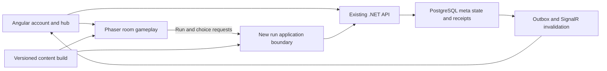

# LegendsLegacy: 2D Roguelite Conversion Assessment

Analysis date: 16 September 2026. Repository baseline: `bfb1023fe`, including the working tree present during inspection. **Analysis only; no conversion has been implemented.**

This report distinguishes **observed implementation**, **recommended design**, and **hypotheses to test**. It covers the main game, its administrative clients/APIs, background processing, and the separate chat service. Source inspection and catalog inventories establish architecture and content facts; they do not establish production usage, performance, asset ownership, commercial demand, or whether the proposed game is fun. Existing uncommitted work was left intact.

## 1. Executive Summary

**A convincing conversion would effectively create a new gameplay product within the LegendsLegacy universe, while retaining selected online infrastructure, content definitions, and dungeon-management ideas.** It is not primarily a rendering upgrade.

The current game makes most consequential combat decisions before the fight: permanent progression, equipment, Essence loadouts, and Combat Styles feed a server-side automatic simulation. A roguelite needs consequential decisions during combat and throughout a run. If the same persistent power stack continues to determine victory, adding movement and animated enemies will produce the interface change the brief warns against.

The strongest feasible direction to test is a **single-player, room-based, top-down dungeon crawler with hybrid combat and Essence drafting**. The player moves, dodges, and deliberately uses one signature Essence ability; basic attacks and a few other Essence abilities operate automatically. Four equipped Essences, acquired and evolved within the run, are a starting hypothesis. Persistent progression chiefly opens choices, world knowledge, equipment patterns, and difficulty rather than multiplying damage indefinitely.

For a browser-first experiment, keep Angular for account and hub screens and embed a Phaser gameplay surface. Keep .NET, PostgreSQL, authentication, command transactions, reward receipts, and state invalidation for persistent operations. Build a separate spatial simulation; do not attempt to turn the existing batch engine into a live game loop by attaching coordinates to it. A native-first product could justify Godot instead; browser delivery has not been explicitly confirmed, so this is a conditional recommendation.

Three findings materially improve or constrain the reuse case:

- Current dungeons already have seeded routes, room types, Vigor, rest sites, pending/secured loot, retreat, failure analysis, and reward claiming. Their orchestration is a useful starting reference, although their encounters still resolve from snapshots.
- The authored catalog contains 85 Essences and 244 abilities, including substantial status, trigger, and summon semantics. That is valuable design material, but neither a spatial ability library nor 85 finished roguelite builds.
- The client has no inspected spatial dungeon runtime or local animated enemy/environment pipeline. Art, readable enemy behavior, and moment-to-moment feel are major new workloads.

**Do not commit to full conversion yet.** Authorize a bounded prototype only after choosing the initial platform and acceptable trust model. Test hybrid and movement-only automatic combat in the same tiny arena. If neither is compelling without permanent rewards, stop or consider a tactical alternative. A credible one-biome slice should follow only after that gate. Keeping the PBBG remains a rational option if the desired product is primarily long-term collection and asynchronous progression.

## 2. What LegendsLegacy Is Today

### Observed architecture and service boundaries

The executable game API is `LL/src/API/API.LL`, not the shortened API path in the repository overview. There are also `API.AdminDashboard`, `API.LiveOps`, a separate `Worker.LL`, and independently deployable `LL-Chat`. Core contains Domain and Application; most game implementations, including combat, live in `Services.LL`. Persistence uses EF Core/Npgsql. The inspected main projects target .NET 10. Angular clients are separate applications, with the main client declaring Angular 20.3, the content dashboard 18.1, and LiveOps 21.2; these are manifest ranges, not a claim that all installed packages match.

The main flow is an Angular command/query UI calling versioned HTTP endpoints, MediatR handlers, services, and repositories. Persistent commands use transaction handling and character locks. Domain revisions and outbox messages drive invalidation and refresh through SignalR. Background work includes scheduled economy/social activities and queued battle resolution. This is useful online RPG infrastructure, not an existing real-time multiplayer simulation service.

Representative evidence:

| Evidence | Source | What it establishes |
|---|---|---|
| E1 | [API startup](C:/repos/Legends-Legacy/legends-legacy/LL/src/API/API.LL/Program.cs:80) and [Core target](C:/repos/Legends-Legacy/legends-legacy/LL/src/Core/Domain/Domain.csproj:4) | SignalR/backplane setup, service wiring, hosted workers, .NET target; startup also applies migrations at line 253 |
| E2 | [Transaction pipeline](C:/repos/Legends-Legacy/legends-legacy/LL/src/Core/Application/MediatR/Behaviors/TransactionBehavior.cs:47) and [persistence registration](C:/repos/Legends-Legacy/legends-legacy/LL/src/Infrastructure/Persistence/Persistence.LL/DependencyInjection.cs:77) | Commands, locking, database transactions, revision invalidation, PostgreSQL |
| E3 | [Character](C:/repos/Legends-Legacy/legends-legacy/LL/src/Core/Domain/Models/Entities/Characters/Character.cs:14) | Permanent character, inventory, six progression currencies, Essence loadouts, PvP and guild relationships |
| E4 | [Dungeon run](C:/repos/Legends-Legacy/legends-legacy/LL/src/Core/Domain/Models/Dungeons/Runs/DungeonRun.cs:3), [run state](C:/repos/Legends-Legacy/legends-legacy/LL/src/Core/Domain/Models/Dungeons/Runs/DungeonRunState.cs:6), [factory](C:/repos/Legends-Legacy/legends-legacy/LL/src/Infrastructure/Service/Services.LL/Dungeons/DungeonRunFactory.cs:28) | Existing run aggregate, frozen character snapshot, seeded graph, loot bags, Vigor, 48-hour expiry |
| E5 | [Run persistence](C:/repos/Legends-Legacy/legends-legacy/LL/src/Infrastructure/Persistence/Persistence.LL/Configurations/Dungeons/DungeonRunConfiguration.cs:15) | Unique character index, concurrency token, JSONB state, snapshot relationship |
| E6 | [Combat engine](C:/repos/Legends-Legacy/legends-legacy/LL/src/Infrastructure/Service/Services.LL/Combat/Engine/FastCombatEngine.cs:186) | Team/wave batch simulation rather than a player-input simulation |
| E7 | [Essence catalog](C:/repos/Legends-Legacy/legends-legacy/LL/src/API/API.LL/Data/essences/essences.json:1), [abilities](C:/repos/Legends-Legacy/legends-legacy/LL/src/API/API.LL/Data/combat/abilities.json:1), [world regions](C:/repos/Legends-Legacy/legends-legacy/LL/src/API/API.LL/Data/world/regions.json:1) | Authored content, IDs, progression and encounter associations |
| E8 | [Combat Style rules](C:/repos/Legends-Legacy/legends-legacy/LL/src/Core/Domain/Models/CombatStyles/CombatStyleRules.cs:66) | Four specific implemented styles; this is the closest implemented analogue to the proposed Doctrine concept |
| E9 | [Main client manifest](C:/repos/Legends-Legacy/legends-legacy/LL/src/Presentation/ll/package.json:1) | Angular, RxJS, SignalR, npm, build and test scripts; no game engine dependency |
| E10 | [Nobility benefits](C:/repos/Legends-Legacy/legends-legacy/LL/src/Core/Domain/Models/Nobility/NobilityBenefits.cs:3) | Offline duration, loadout counts, arena tickets, focus, market and prophecy benefits tied to the current genre |

### System map and dependence on the current genre

| System family | Current responsibility and location | Important consumers/dependencies | Genre assumption |
|---|---|---|---|
| Accounts, characters, authorization | `Users`, `Players`, `Entities`, API authorization | Nearly every command; chat/admin identity | Account identity transfers; persistent character power does not transfer unchanged |
| Idle combat/actions | `CharacterActions`, combat services | Time, snapshots, combat, loot, XP, activity events | Elapsed time and automatic resolution create progression |
| Combat and statistics | `Services.LL/Combat`, Domain combat/attributes | PvE, dungeons, PvP, raids, tower, styles, harness | Teams and targeting rules, not physical space |
| Essences | Domain/Services `Essences`, JSON catalogs | Inventory, collection, loadouts, combat compiler, progression | Long-term acquisition/ascension and many pre-equipped abilities |
| Equipment | `Items/Equipments`, `Inventories`, `Loots`, `Rewards` | Stats, loadouts, world rewards, progression | Persistent numeric advancement and source-specific rewards |
| Regions, areas, creatures | `Regions`, `Spawnings`, world catalogs | Level/quest gates, encounter generation, loot, archive | Area selection produces weighted stat-driven encounters |
| Dungeon delves | Domain/Services `Dungeons` | Character snapshot, sigils, graph definitions, combat, inventory, mastery | A run already exists, but play is a sequence of menu actions |
| Region bosses, tower, raids, Colosseum | Respective service/domain folders | Snapshot combat, queues/workers, schedules, rewards and currencies | Asynchronous and calendar-based modes; multiple permanent economies |
| Achievements, titles, quests, prophecies | Respective service/domain folders | Activity events, ledgers, rewards, claims | Some achievements transfer; objective vocabulary and cadence change |
| Guilds, market, chat | Guild/market services and `LL-Chat` | Shared economic integrity, membership/permissions, timers, inventory | Shared world and player-to-player effects raise trust requirements |
| Soulstones and Combat Styles | Progression services and catalogs | Character advancement, combat/loot/focus/dungeon modifiers | Multiple overlapping layers of permanent progression |
| Nobility | Membership, Signet redemption/trading and benefit services | Offline caps, inventories/loadouts, focus, market, prophecies | Current benefit package is built for an online PBBG; cash checkout is disabled and the former daily job retires itself |
| Operations/admin | Both admin APIs/frontends, Worker, diagnostics | Content definitions, moderation, jobs, auditing | Valuable infrastructure, with many mode-specific screens to retire later |

Crafting and gathering are **not treated as live game systems**. Retired folders, asset names, and historical data remain; their presence is not evidence of current gameplay. Combat-sourced equipment and its associated upgrade/blueprint systems are the relevant baseline.

The parsed current world catalogs contain **two regions and 16 areas**: Shenic has 11 including the tutorial, and Meran has five. There are **106 creature records**, **four dungeon families with three difficulty definitions each**, **two raid bosses**, **one region boss**, and **15 authored/released tower floors**. The dungeon families are Goblin Mines, Forgotten Catacombs, Tangled Cave and The Great Tree. These are authored file counts, not a census of a live database. In particular, a diagnostic policy constant referring to ten regions is not evidence of ten authored regions. Sources: [creatures](C:/repos/Legends-Legacy/legends-legacy/LL/src/API/API.LL/Data/world/creatures.json:1), [dungeons](C:/repos/Legends-Legacy/legends-legacy/LL/src/API/API.LL/Data/dungeons/dungeons.json:1), [raid bosses](C:/repos/Legends-Legacy/legends-legacy/LL/src/API/API.LL/Data/raids/raid-bosses.json:1), [region boss](C:/repos/Legends-Legacy/legends-legacy/LL/src/API/API.LL/Data/region-bosses/region-bosses.json:1), [tower floors](C:/repos/Legends-Legacy/legends-legacy/LL/src/API/API.LL/Data/world-tower/tower-floors.json:1).

### Important architectural and design debt

1. The layer names do not guarantee clean separation. Application transaction handling uses EF interfaces; some older services directly use `IDbContext` or return DTOs despite current repository rules. Extract a small run boundary when needed, rather than performing a repository-wide cleanup first.
2. The combat engine is large and contains style-specific partial implementations. Data-driven abilities coexist with code-driven mechanics. Adding a new tag does not automatically add a new spatial behavior.
3. Character is connected to many economic and social subsystems. Reusing it as mutable in-run state would import those dependencies and permit hub edits to affect ongoing runs.
4. Snapshotting, deterministic combat seeds, visual checkpoints, persistent run state, and deterministic reward generation are different capabilities. Existing support for one must not be credited as support for all five.
5. Multiple reward sources and currencies create balancing obligations. Porting them preserves complexity before the new combat loop has earned it.
6. Main API startup applies migrations and seeds. This audit did not launch the application against a configured database. Future prototype startup must not accidentally mutate the existing environment.

## 3. What Must Fundamentally Change

| Today | Required change | Why an interface-only conversion fails |
|---|---|---|
| Select activity and improve permanent build | Make moment-to-moment positioning and run choices affect outcomes | Walking between predetermined victories is not meaningful play |
| Character power is the primary unit of progression | Separate a bounded starting profile from disposable run state | Legacy levels and ascensions otherwise solve the run before entry |
| Automatic attacks resolve against target lists | Add space, collision, range, line of sight where useful, timing, and input | Sprites cannot make abstract target selection spatially fair |
| Abilities predominantly contribute numerical combat effects | Give effects clear delivery, shape, timing and counterplay | Hundreds of invisible procs create noise rather than depth |
| Dungeon combat uses a frozen loadout | Mutate a dedicated run loadout after drafts and equipment decisions | A roguelite build must develop after the first room |
| Regions are progression gates and encounter tables | Curate biomes, enemy roles and encounter grammar | Old level bands do not constitute interesting environments |
| Lots of permanent systems provide reasons to return | The next run itself must be attractive | Daily obligations cannot compensate for weak action gameplay |
| Menu- and panel-based UI drives gameplay | Create a playable scene, concise HUD, readable feedback and input | Most existing panels interrupt action and obscure danger |

Some existing mechanics would actively make the proposed game worse: ten simultaneously firing Essence packages; compulsory idle grinding for entry sigils; permanent stats that bypass mechanics; random misses on attacks that visibly connect; long hard crowd control on the player; stacked currencies and dailies; gear drops whose only purpose is replacing a slightly smaller number. Preserve their implementation only for the legacy game unless a specific new purpose survives testing.

## 4. Recommended Roguelite Direction

### Alternatives worth comparing

| Direction | Fit to current strengths | New burden | Main concern | Judgment |
|---|---|---|---|---|
| Fully manual top-down action | Essence identity and enemy themes | Complete action system, weapon feel, aiming, animations, responsive enemy patterns | Requires action-game craft and many distinct presentations | Viable new product, highest initial risk |
| Movement with automatic combat | Existing triggers/cooldowns and build combinations | New spatial simulation, targeting, avoidance, threat management | Can become passive kiting while account stats do the work | Best low-cost combat control variant to test |
| Hybrid action/automatic combat | Buildcraft plus moments of player intent | Spatial runtime plus one deliberate ability/dodge system | Overlapping auto effects can still erase tactical choices | **Recommended hypothesis** |
| Turn-based or pause-and-command room crawler | Most compatible with abstract effects and explicit choices | New turn/action economy, spatial rules and tactical UI | Slower rhythm; batch auto engine is still not a turn-based engine | Credible fallback if build strategy matters more than reflexes |
| Node-based expedition with brief auto battles | Highest route/UI reuse | Stronger drafting and encounter decisions | Could be a good roguelite, but does not meet a movement-driven dungeon fantasy | Best limited expansion of the PBBG, not the recommended full conversion |
| Connected action world / full online dungeon game | World lore and social aspirations | Streaming, navigation, recovery, networking and much more content | Scope overwhelms solo production | Reject for the initial product |

The proposed identity is **learning enemy powers, then recombining their active and passive aspects into a small evolving build**. Room geometry and enemy behaviors should make these combinations behave differently, rather than relying on a huge menu of stat multipliers.

**Prototype decisions:** one arena; automatic attacks versus automatic attacks plus one manual Essence; one dodge; no persistent power; no online dependency required. Use the same encounters to make the comparison fair.

**Vertical-slice decisions:** single-player, one biome, short branching run, four Essence capacity, one manual channel, limited equipment, minimal persistent unlocks, browser-first unless platform priorities change.

**Production decisions left open:** final run length, number of biomes, precise Essence capacity, native distribution, offline support, co-op, and competitive verification. None should be silently promised by the slice architecture.

## 5. Core Gameplay Loop

1. Enter a compact hub and choose a dungeon, base weapon and one starting Essence from unlocked choices.
2. Begin with normalized health/power and a deliberately incomplete build. The starter gives identity, not an already solved combination.
3. Explore a small room, identify threats, move and dodge, use the signature ability deliberately, and let complementary effects fire automatically.
4. Clear the encounter and choose from a small draft. Choose an Essence, improve its active or passive aspect, or take a meaningful equipment alternative.
5. Choose a route using visible reward categories and risks. A healing room, an Essence opportunity, and an elite should answer different needs.
6. Add a limited number of synergies and one evolution that changes how the build plays.
7. Fight a boss that checks earlier lessons. Die, retreat at a safe boundary, or complete the objective.
8. Resolve rewards once. Show what was learned, permanently unlocked, and lost with the run.
9. Use a small amount of persistent progress to open choices, inspect the codex, and begin another run quickly.

The run is the primary unit of play. The hub supports it. No mandatory idle activity should supply the permission to attempt another ordinary run.

| Within the run | Between runs |
|---|---|
| Current health, healing charges, cooldowns and temporary statuses | Character identity, cosmetics and settings |
| Four-slot Essence build, ranks and active/passive upgrades | Discovered/unlocked Essence definitions and codex knowledge |
| A run evolution or mutation | Alternative starting options and optional draft-pool preparation |
| Temporary weapon modifications, armor/charm effects | Armory patterns and equal-budget starting kits |
| Run currency, purchases, blessings and curses | Small, capped hub unlock progression |
| Room choices, risk, boss state and challenge modifiers | Dungeon access, difficulty clears, achievements and titles |

Persistent progression must not restore an entire powerful run build on entry. Starting with one chosen element makes collection matter while leaving the majority of build construction inside the dungeon.

## 6. Run Structure

Target a **15–25 minute complete run as a design hypothesis**, with an 8–12 minute slice. Combat rooms should usually take roughly 30–90 seconds; the right duration is a playtest result, not an acceptance metric by itself.

Use a readable branching graph of small handcrafted arenas. A production expedition could have two or three short sections with a biome-specific boss. The slice needs only one section and one boss. Offer two or occasionally three meaningful routes, not a screen full of interchangeable nodes.

Existing route generation, node forecasts, traversal state, reward categories and retreat semantics are references worth reusing. Replace the fixed character snapshot as the fight input with mutable run state derived from a bounded entry profile. Keep the original snapshot immutable as an audit of starting conditions.

Recommended run state transitions are **Preparing → Active → RewardChoice / RoomTransition → Active → Completed, Failed or Retreated → Settled**. Suspension is a separate operational state, not a victory or reward grant. These are boundary concepts, not a proposed final schema.

Replace current Vigor with persistent run health and limited healing in the slice. Vigor models expedition attrition after snapshot-resolved fights; preparation, route choices, rest and retreat influence it. Once positioning and health directly create attrition, another mandatory attrition meter may duplicate punishment. Reintroduce exhaustion only if playtests reveal a distinct decision it improves.

Save at room boundaries. For the early noncompetitive slice, a crash may restore the same room-start state, seed, and already-committed reward choices; acknowledge that this permits retrying a room. Do not reroll drafts on reconnect. Production must decide whether mid-room snapshots or stricter resumptions are worth their complexity.

## 7. Combat Model Analysis

### What the engine actually does

`FastCombatEngine` advances an entire battle at ten simulation ticks per second, looping until an outcome or time limit. Ready abilities and basic attacks execute automatically. It supports teams, waves, summons, statuses, events, cooldowns, shields, damage/healing, control effects and outcome statistics. Target selection is over eligible entity/team/party collections. It does not contain the movement/input/hitbox/projectile world required by any of the action options. See the [tick configuration and run loop](C:/repos/Legends-Legacy/legends-legacy/LL/src/Infrastructure/Service/Services.LL/Combat/Engine/FastCombatEngine.cs:37) and [target resolution](C:/repos/Legends-Legacy/legends-legacy/LL/src/Infrastructure/Service/Services.LL/Combat/Engine/FastCombatEngine.cs:4785).

Ten hertz is an implementation choice for batch resolution, not evidence that live gameplay must run at ten hertz. Increasing that number would not add an input model or responsive movement. Checkpoint output is useful observation/telemetry; it is not a complete resumable simulation snapshot containing every cooldown, effect trigger and RNG state.

### Comparison across the requested dimensions

| Dimension | A: Fully manual | B: Movement + automatic | C: Hybrid | D: Tactical / pause-and-command |
|---|---|---|---|---|
| Engineering cost | Very high | High, despite automatic casts | High, with bounded extra manual control | Moderate–high; new action economy required |
| Existing engine compatibility | Effect semantics and formulas; batch loop replaced | Same limitation; targeting/cast scheduling adapted | Same, plus explicit manual commands | More abstract rule reuse, but current automatic tick-based loop still changes |
| Gameplay depth | Execution, aim, timing and buildcraft | Positioning, route and build decisions | Positioning, timing one key intervention, buildcraft | Action planning, resource timing, encounter knowledge |
| Essence fit | Many abilities compete for buttons and animations | Strong scalable automation, danger of unreadable proc storms | Strong if roles and one manual channel stay clear | Excellent explicit combinations, danger of slow turns |
| Hundreds of abilities | Expensive bespoke feel unless delivery families are shared | Feasible with template limits and selective pools | Feasible with few delivery families and bounded activation rules | Feasible data reuse; AI/search and rules text still grow |
| Accessibility | Highest motor/aim demand | Lower button load; still demands movement | Auto-aim, remapping and optional assists help | Best for reaction accessibility and pausing |
| Long-term burden | Weapon animation, hit feel, enemies and balance | Targeting, density, avoidance and synergy balance | Both, contained by a small manual action budget | Encounter puzzles, readable intent, combinatorial rules |
| Server implications | High-frequency authority needs prediction and reconciliation | Movement still makes low-latency authority expensive | Same spatial authority cost as B, more command intent | Discrete authoritative commands are much cheaper |
| Cheating | Client simulation can forge survival/hits | Auto attacks do not make movement/result claims trustworthy | Same issue; server seed alone does not validate combat | Server can cheaply validate each allowed action |
| Multiplayer | Demanding synchronization and latency tolerance | Still demanding; crowd effects add replication cost | Still demanding; pause and draft choices need coordination | Easier latency tolerance, but session/turn management remains |
| Client requirement | Full game runtime and rich input/animation | Full spatial runtime with simpler controls | Full spatial runtime, selective manual HUD | Engine or canvas tactical board; Angular menus can contribute more |

### What to retain, and what to redesign

Retain the *meaning* of damage types, status application, shields, summons, trigger predicates, scaling descriptions and deterministic test cases where they remain useful. Extract or translate a small supported subset. Do not port all 244 abilities first. A TypeScript game client cannot directly execute the existing C# implementation; shared IDs/definitions are possible, but semantics still need implementation and conformance checks.

Ordering is particularly important: current actors execute in sequence, and all ready actives may fire in the same tick without an action-animation occupancy budget. Reaper also changes condition-versus-action timing for an encounter, and recursive reactions are capped at depth 64. Define cast overlap, event ordering and trigger budgets deliberately for the selected new rules. Mana is present in the schema but explicitly unsupported as a payable/executable cost in the current runtime; a mana-based manual-action economy would be new work. [Casting](C:/repos/Legends-Legacy/legends-legacy/LL/src/Infrastructure/Service/Services.LL/Combat/Engine/FastCombatEngine.cs:621), [cost handling](C:/repos/Legends-Legacy/legends-legacy/LL/src/Infrastructure/Service/Services.LL/Combat/Engine/FastCombatEngine.cs:970), [reaction depth](C:/repos/Legends-Legacy/legends-legacy/LL/src/Infrastructure/Service/Services.LL/Combat/Engine/FastCombatEngine.cs:1101).

Rebuild movement, acceleration, aiming assistance, dodge timing, cast wind-up/recovery, attack volumes, projectile life cycles, collision, spatial queries, AI movement, telegraphs and hit feedback. Also rebuild the event vocabulary where necessary: “hit” now needs a resolved spatial contact, not simply a selected opponent. Keep effect calculation separate from delivery so a projectile, cone and ground pulse can apply the same status rules.

For the proposed hybrid, the player has movement, a dodge, and one manual signature cast. The weapon provides a predictable automatic attack with an obvious target/facing indicator. Other equipped Essence actives use visible automatic conditions. The signature Essence's active is manual rather than also firing automatically; allow changing the signature at safe boundaries. Do not add four manual buttons merely because four Essences are equipped.

Replace unsuitable batch assumptions deliberately:

- Visible contact generally lands. Defenses should use armor, barriers, telegraphed dodge or explicit immunity, not unexplained random misses.
- Range, target count, attack density and projectile speed become balance dimensions alongside damage and cooldown.
- Cap trigger depth and proc budgets; distinguish direct damage from triggered damage to prevent feedback loops.
- Hard control on the player is brief and readable. Bosses use stagger budgets or resistance windows instead of permanent stun chains or total unexplained immunity.
- Summons need spatial targeting, spawn placement, a population cap and a stuck/reposition policy. A summon record is not an implemented pet AI.
- Use fixed-step simulation with a separate rendering cadence. Choose rates from measurements; do not promise exact determinism from floating-point engines without testing.

The current harness and tests are valuable for mathematical regressions and long-run effect interactions. They cannot assess whether a dodge feels responsive, an arena traps the player, or a dangerous attack is visible through four overlapping effects.

## 8. Essences

### Observed strengths and limits

The current authored API catalogs contain **85 Essences from 82 distinct creature sources**, **244 abilities: 133 active and 111 passive**, **26 statuses**, **9 summon definitions**, and **105 creature ability sets**. Essence rarity is currently 77 Common and 8 Rare. These are file-content counts at audit time, not all player-owned instances or evidence of equal gameplay quality.

Each Essence connects a creature identity to active and passive abilities. Collection, loadouts, experience/ascension, focus and acquisition systems make this more distinctive than an arbitrary spell inventory. However, all 85 catalog `tags` and `attributeBonuses` arrays are empty, and authored evolution mechanical modifier/tag arrays are empty. Abilities themselves already contain tags and real status/summon interactions; the empty arrays are Essence-level metadata. The schema's evolution vocabulary must not be mistaken for a completed fusion or mutation system. [The catalog illustrates this directly](C:/repos/Legends-Legacy/legends-legacy/LL/src/API/API.LL/Data/essences/essences.json:3).

Current collection/progression belongs to a character, not the whole account. Slots start at one, increase every ten character levels, and reach ten at level 90. Essence level caps are 10/30/60/100 across ascension tiers. Individual levels mainly gate ascension in the inspected scaling path; ascension changes combat values. This structure suits pre-battle construction and character advancement better than a readable short run. Account-wide discovery below is a proposed change. [Ownership](C:/repos/Legends-Legacy/legends-legacy/LL/src/Core/Domain/Models/Essences/PlayerEssence.cs:3), [slots](C:/repos/Legends-Legacy/legends-legacy/LL/src/Core/Domain/Models/Essences/EssenceSlotProgression.cs:5), [progression](C:/repos/Legends-Legacy/legends-legacy/LL/src/Core/Domain/Models/Essences/EssenceProgressionConstants.cs:35).

Acquisition shows the genre gap sharply: all 82 authored source loot tables use a **0.01% base Essence drop chance**, before modifiers. Focus multiplies drop chance by three and spawn weight by 1.2, with an eight-hour baseline switch cooldown. After 12,000 failed eligible kills, resonance contributes only **+1% relative chance**, not one percentage point and not a guaranteed drop. These are idle-progression rules, not a viable short-run draft economy. [Loot tables](C:/repos/Legends-Legacy/legends-legacy/LL/src/API/API.LL/Data/world/creature-essence-loot-tables.json:1), [focus rules](C:/repos/Legends-Legacy/legends-legacy/LL/src/Core/Domain/Models/Essences/CreatureFocusRules.cs:5), [resonance](C:/repos/Legends-Legacy/legends-legacy/LL/src/Core/Domain/Models/Essences/CreatureResonanceConstants.cs:5).

### Proposed structure

| Concept | Slice recommendation | Production possibility / constraint |
|---|---|---|
| Permanent collection | Unlock an Essence definition and its codex entry | Mastery unlocks sidegrade variants, challenge information or cosmetics |
| Starting loadout | One chosen Essence plus a base weapon | One secondary preparation choice only if it does not solve the run |
| Equipped capacity | Four Essences, each with an active and passive aspect | Test three versus four before adding a fifth; never preserve ten automatically |
| Manual control | One Essence is the signature channel | Other actives remain automatic; clear UI shows which behavior is manual |
| Acquisition | Choose one of three offers at selected room rewards | Biome/theme-weighted drafts and encounter discoveries |
| Full build replacement | At a safe reward screen, replace an equipped Essence or choose another reward; new Essence starts at its offered rank | Preview discarded upgrades; test a bounded compensation rule only if replacement otherwise never makes sense |
| Upgrades | Choose active improvement or passive improvement | Branches should change behavior before adding more ranks |
| Duplicates | Improve a chosen aspect instead of adding another copy | At cap, reroll/alternative resource; no mandatory duplicate grind |
| Evolution | One authored behavior-changing choice for a few slice Essences | Wider evolutions only after proven combinations |
| Fusion | Exclude from slice | A few explicit recipes that consume/reconfigure slots; no all-pairs fusion matrix |
| Mutation | Exclude until base choices are clear | Tradeoffs such as larger area but slower cadence; not another permanent grind |
| Rarity | Indicates availability/complexity, not guaranteed superiority | Common utility remains viable; rare options need compatible support |
| Levels and ascension | Temporary run ranks/evolution; no imported account multipliers | Rename or retire legacy terminology if it implies permanent numerical supremacy |

The active/passive relationship should create decisions: improve a short-range active because this run can safely close distance, or improve the passive because the build attacks from range. An Essence should not simply add two unconditional DPS multipliers.

For hundreds of eventual Essences, the scalable unit is a **mechanic family**, not a bespoke script per Essence. Candidate delivery families include bolt, arc/cone, pulse, ground field, orbiting protection and summoned helper. Candidate interaction tags include bleed, burn, barrier, summon, movement and marked targets. The roguelite needs a curated draft/synergy vocabulary mapped to existing effect semantics, plus new spatial tags; current empty Essence metadata does not supply that draft system already.

Keep the total library separate from the active run pool. Begin with 12 Essences in the slice. A production run might draw from a curated subset of roughly 18–30 compatible and wildcard options, regardless of how many the account has collected. Offer weighting should make supporting options reasonably available without guaranteeing one predetermined build. Optional pool preparation needs a budget and limits so players cannot reduce every run to the same three-card draft.

Control combinatorial cost with trigger provenance, per-effect caps, stacking categories, explicit incompatible combinations, and authored expectations. Require each new Essence to offer a distinct role or interaction. If it differs only by damage color and a larger coefficient, it expands maintenance more than replayability.

Most of the identity value survives; much of the current progression pacing should not. Killing the same static encounter for a low-probability permanent drop is not the desired core acquisition experience inside a short run. Let seeing, defeating and understanding a creature meaningfully contribute to discovering its Essence, with deterministic progress toward unlocks alongside chance.

## 9. Equipment

The current baseline is persistent equipment obtained mainly through combat, with loadouts and progression/blueprint support. There is no reason to recreate the retired crafting or gathering professions. The useful inheritance is source identity, item presentation, ownership rules and upgrade receipts, not the existing power curve.

### Alternatives

| Equipment model | Benefit | Cost / problem | Decision |
|---|---|---|---|
| All gear permanently carried into runs | Strong collection and existing inventory reuse | Builds become solved before entry; item-level grind dominates | Reject as default |
| All gear temporary | Clean run choices and balance | Long-term collection needs another outlet | Good combat foundation |
| Permanent patterns, temporary run instances | Collection opens choices without stockpiling unbeatable gear | Must clearly distinguish pattern from usable run item | **Recommended** |
| Extraction with owned gear loss | Strong tension and economy | Hoarding, replacement grind, support and cheating costs; different product | Reject for initial roguelite |

Use a permanent armory of unlocked patterns and equal-budget starting weapons. During a run, find a few meaningful weapon alterations, defensive items and charms. A slice can use one base weapon and six equipment options across three functional slots; production might add two or three weapon styles before expanding item quantity.

Weapons should define range, rhythm and basic attack delivery. Essences should define the more unusual build interactions. Equipment can bridge them: a defensive charm may turn a limited portion of successful barrier absorption into a pulse, or a weapon modifier may change a bolt into a short piercing shot. These examples are proposed mechanics, not claims about current items.

Keep rarity, but have it indicate a larger specialization budget or a distinctive drawback/benefit rather than mandatory replacement. Use small affix pools with compatibility rules. One authored modifier plus at most one simple roll is enough initially. Avoid independent rolls for item level, rarity, several affixes, sockets, set bonuses and Essence scaling on the same drop.

Repeated items should improve a bounded run rank or convert to a clearly useful run resource. Permanent duplicates contribute to a selected pattern unlock, not a growing warehouse of near-identical gear. Allow deterministic pattern progress after enough relevant encounters, so a desired playstyle is not indefinitely blocked by bad luck.

Equipment drops should remain a major *decision reward*, not the largest number of objects generated. Target a few consequential equipment decisions per run. Compare new items in terms of changed behavior and the current build, with small readable statistics beneath that explanation.

On death, lose temporary run items. Keep unlocked patterns and the starting kit entitlement. Completion may grant a new pattern or pattern progress; it should not export the exact overpowered temporary item back into the next run. This preserves loot anticipation without requiring extraction insurance, gear-loss recovery, or a player market.

## 10. Dungeons

| Structure | Advantages | Solo-development burden | Fit |
|---|---|---|---|
| Fully procedural geometry | Unpredictable navigation | Connectivity, encounter fairness, visual quality and testing are hard | Low initial value |
| Handcrafted rooms assembled procedurally | Good combat spaces with repeatable variation | Moderate tooling and room grammar | **Best starting structure** |
| Branching encounter map | Explicit risk/reward; existing route concepts | Low–moderate; choices need distinct value | Combine with playable arenas |
| Floor-based dungeon | Clear escalation and milestones | More environments/boss pacing if floors are long | Useful production extension |
| Connected explorable zones | Strong exploration fantasy and secrets | Navigation, backtracking, minimaps, persistence and pacing | Later only if exploration proves central |
| Fixed authored challenge dungeon | Easy testing and tuning | Limited layout variety, strong need for build variation | Best prototype and useful challenge mode |

Start with authored rooms and controlled composition. A room definition should specify entrances/exits, traversable areas, obstacles, enemy spawn anchors, hazard anchors, encounter budget, and allowed encounter roles. Pick among validated alternatives using a seed. Do not scatter enemies randomly and call it procedural design.

For the slice, use six arena layouts and a route that visits a subset, with normal fights, an elite, a safe rest/reward room and a boss. Test the same layout with different role combinations. Fixed geometry is acceptable if combat/build choices keep it interesting.

Production room roles can include treasure, merchant, shrine, challenge, event, mini-boss and secret rooms, but each needs a distinct decision. A shrine trades a cost for a build change; a merchant spends run currency on a missing function; an optional challenge raises exposure for an extra draft. Do not build all room types at once.

Secret rooms must have learnable clues; they should not reward checking every wall after every fight. Shortcuts should change route opportunity cost without letting players bypass all build development. Optional objectives can alter a fight, such as protecting a focus object or defeating an elite before reinforcements, rather than adding checklist chores.

Biomes should affect enemy roles, hazards and draft opportunities. “Forest has green walls and ten percent more health” is not a new biome. Endless scaling should wait until the finite loop has enough combinations and a sensible performance ceiling. Extraction should initially mean choosing to end at a safe boundary, not a separate survival-economy system.

Existing [dungeon family content](C:/repos/Legends-Legacy/legends-legacy/LL/src/API/API.LL/Data/dungeons/dungeons.json:1) provides encounter identity and route/reward material. Its room templates are encounter definitions, not authored collision maps. Keep that distinction in the content budget.

## 11. Enemies and Bosses

Existing creature names, lore, role labels, Essence associations and some signature effects can be retained conceptually. **Spatial behavior and presentation need new authoring for essentially every enemy admitted to the new roster.** This does not mean every catalog creature should enter the roster.

Build six initial roles: a pursuing melee attacker, a charging attacker with recovery, a ranged shooter, a stationary area-denial caster, a support enemy, and a fragile flanker. Use four to six of them for the slice. Encounter composition creates much more variety than six melee enemies with different health totals.

Every enemy needs a readable silhouette, movement rule, preferred range, attack preparation, execution, recovery, interruption behavior, death response and difficulty budget. Add line-of-sight rules only where they generate useful decisions. Begin with circle/rectangle collision and simple steering on small arenas; complex pathfinding is not automatically necessary.

Telegraphs must communicate shape, direction, timing and threat. Use animation, sound and shape as well as color. Threats must remain legible under allied VFX. Limit simultaneous high-pressure attacks so random room composition cannot create unavoidable damage. Formation and spawn budgets should protect an initial safe space and keep exits reachable.

An elite should change one recognizable rule: a charger leaves a temporary hazard trail, or a shooter fires a delayed follow-up. Stacking several opaque modifiers on a normal enemy is cheaper to author but harder to read and balance. The slice needs one elite variant, optionally a second after the first works.

The boss should reuse two learned enemy patterns and introduce one new spatial combination. Two phases are sufficient: a clear threshold changes spacing, timing, or safe zones. Avoid huge health pools as the primary phase mechanic. Boss summons must have capped count and defined cleanup rules. Stagger/control resistance needs explicit feedback.

Environmental interactions should begin with one well-tested rule, such as cover blocking selected projectiles or a visible hazard affecting both sides. If effects interact with destructible terrain, that creates additional collision, navigation and state persistence work; postpone it until it demonstrates value.

Do not quote a numerical “percentage of monsters reusable” from a name count. The defensible estimate is: names and thematic concepts are broadly reusable; existing stats and effects need rebalance; no inspected catalog establishes a completed spatial behavior/animation package. The first six enemies should be chosen for distinct combat roles and affordable shared rigs, not because they occupy the first six legacy level bands.

## 12. Regions and World Structure

The region catalog currently ties areas to level/difficulty requirements, quest conditions, spawn probabilities and creature pools. For example, Shenic contains Training Area and Lumo Ruins. Those are progression/encounter definitions, not a navigable tile world. [World catalog](C:/repos/Legends-Legacy/legends-legacy/LL/src/API/API.LL/Data/world/regions.json:3).

| Existing concept | Possible new role | What must not be inherited blindly |
|---|---|---|
| Region | A coherent biome or group of related expeditions | One region need not require a separate full art set |
| Area | Room theme, encounter palette or route landmark | Existing level gates and spawn percentages |
| Creature | Enemy family plus Essence source | Stat-only variants presented as distinct enemies |
| Dungeon family | A named expedition with boss and draft themes | Entry sigil grind and every tier variant |
| Region boss | Candidate expedition boss or optional elite | Current shared-event timing and abstract damage race |
| World Tower | Later challenge sequence using existing room grammar | Existing queued party simulation and escalating stat ladder |

Use one recognizable theme such as Goblin Mines for the slice, subject to asset feasibility. Do not start by converting all regions. Later unlock biomes through demonstrated play and discoveries, not an account-level requirement that forces old-area farming. Difficulty should be selectable separately from geographic identity.

Keep a compact world overview in the hub. A location can remain valuable lore or codex content without becoming a playable zone. Merge locations whose intended combat experiences are indistinguishable. Preserve recognizability through names, enemy powers and a few signature landmarks rather than promising a one-to-one world conversion.

## 13. Persistent Progression

Favor **horizontal unlocks with a small, finite comfort budget**. A new account must be able to win the base dungeon with sufficient skill and sound choices. A mature account gains breadth, expression, information and challenges; it should not trivialize encounters merely through multiplicative permanent power.

Proposed layers are: Essence collection; equal-budget armory patterns; dungeon/difficulty access; codex discoveries; cosmetic/title achievements; and a compact hub unlock track. Keep character identity, but do not import legacy character level, gear level, Essence ascension, Soulstone modifiers, Combat Style mastery and guild bonuses into one starting stat calculation.

The existing Soulstone system is already more nuanced than a generic damage tree. Its seven authored upgrades cover Essence acquisition/pity, duplicate materials, focus, combat XP and idle defeat XP retention, plus an enabled Rest Site Satchel definition whose advertised retention behavior is not reflected in the inspected rest action. Keep the capped/rule-driven unlock concept where useful, but reassess each benefit. Idle XP retention has no automatic place in the new loop; unused schema effect kinds should not be counted as working upgrades.

To avoid **runs feeling pointless**, show a durable discovery, progress toward a selected unlock, a learned boss pattern, or a new achievement condition. Award progress at meaningful completed-room boundaries, not only for final victory. Do not force a permanent reward for every failed opening encounter: learning and the desire to replay must carry some of the experience.

To avoid **meta progression overwhelming runs**, do not add an uncapped stat tree. If later testing supports permanent comfort improvements, cap them tightly, exclude compounding damage multipliers, and compare new versus established profiles on the same seed/loadout. Begin the prototype and most slice playtests with identical normalized stats. Publish baseline and capped-profile test results before introducing more power.

Use at most two spendable currencies initially: one temporary run currency and one persistent unlock currency. Existing Cinders and Soulstones can supply familiar names, but keep new-mode balances separate. Fate Echo, Guild Favor, Tower Tokens, Raid Trophies and paid/entitlement items should not enter the slice merely because fields already exist.

Collection breadth can itself be power. More choices, rerolls and starting alternatives must be evaluated as balance changes, even if their statistics are equal. Provide a useful starter pool and avoid unlocks that only dilute drafts with inferior options. Permanent progress should increase viable routes through the game, not increase the number of mandatory menus.

## 14. Doctrines

No separate implemented Doctrine state was found in the inspected current source. The relevant existing system is **Combat Styles: Bastion, Conduit, Reaper and Duelist**. These have genuine mechanics, versioned catalog data and code-specific engine support. They are not simply four names for stat bonuses.

Bastion changes healing/barrier behavior; Conduit channels the first occupied Essence and gains charges from other distinct Essence casts; Reaper interacts with future damage-over-time ticks; Duelist builds a target-specific payoff. Current style levels run to ten, with refinements at three, upgrade slots at five/eight, an opening technique at seven and mastery at nine. See [rules](C:/repos/Legends-Legacy/legends-legacy/LL/src/Core/Domain/Models/CombatStyles/CombatStyleRules.cs:25) and [progression](C:/repos/Legends-Legacy/legends-legacy/LL/src/Core/Domain/Models/CombatStyles/CombatStyleProgression.cs:7).

Conduit is particularly promising inspiration for the one-manual-channel experiment: one focal Essence and three contributors naturally suit a four-Essence build. Its charge behavior is implemented in [the style runtime](C:/repos/Legends-Legacy/legends-legacy/LL/src/Infrastructure/Service/Services.LL/Combat/Engine/FastCombatEngine.CombatStyles.cs:99). Manual activation would change its balance substantially; this is a design seed, not a ready-to-port control scheme.

**Recommendation: omit a separate Doctrine progression system from the slice.** Adapt a strong mechanic into the core Essence interaction if useful. Do not stack a Doctrine tree on top of Combat Style levels, weapon mastery, permanent Essence ascension and temporary run ranks.

If later playtests reveal that starting builds lack identity, introduce a single selected philosophy with a meaningful tradeoff: protect-and-counter versus consume-status-for-burst, for example. It should change priorities and starting rules, not add another universal permanent bonus. Unlock alternative philosophies through play; avoid mandatory experience grinding on each. If weapons and Essences already provide sufficient identity, remove the separate system from the new product altogether.

## 15. Stronghold / Hub

A personal Stronghold runtime was not found. Existing guild buildings are a different ownership and economy system and should not be repurposed wholesale into a personal base.

Use a small hub with three primary destinations: **Expedition**, **Essence Archive**, and **Armory/Research**. Settings, achievements and cosmetics can remain secondary. The slice can present these as one illustrated scene or a compact Angular screen. Walking through a large empty town is unnecessary to establish the fantasy.

The hub selects starting kit/difficulty, shows discoveries, spends limited persistent resources, and explains the next available objective. A training encounter should be one click away if it helps test a newly unlocked combination. Reward summaries should link directly to the relevant unlock and back to the next run.

Later NPC unlocks may introduce a meaningful service or short story event. Merchants can offer deterministic pattern progress or exchange duplicate discovery material. Such services are not a reason to restore mining, gathering queues or a crafting profession tree. An NPC who reconfigures a starting weapon is sufficient; a production chain is a separate game.

Avoid building timers, resource production, decorative room placement, visitor schedules and multiple currencies until the hub demonstrably adds enjoyment. Keep cosmetic Stronghold personalization optional. The test is whether players find the next decision quickly and want to return to the dungeon, not whether the hub has enough panels to resemble the current city.

## 16. Existing Feature Survival Analysis

Classifications describe the proposed roguelite product, **not instructions to delete features from the running PBBG now**. KEEP permits contract/content adjustments; LATER means excluded from the slice and not automatically promised for release. Source locations below name current implementation families beneath `LL/src/Infrastructure/Service/Services.LL` unless otherwise linked. Dependencies are listed because they determine the actual removal/reuse cost.

| System | Current purpose and key dependencies | Classification | Rationale and required change |
|---|---|---|---|
| Accounts, login, guests, authorization | Users/Authorization, identity, sessions, ownership | **KEEP** | Preserve online account infrastructure; remove assumptions that every account operation needs legacy gameplay bootstrap |
| Character identity/profile | Entities, inventory, levels, guild/PvP/currencies | **ADAPT** | Separate persistent identity/collection from a disposable run avatar |
| Idle actions and offline combat | CharacterActions, time, combat, rewards | **REMOVE** | Active runs must not depend on a stronger passive farming loop |
| Essence archive/collection | Essences, inventory, creature sources, progression | **ADAPT** | Preserve collection identity; replace acquisition pacing and run loadouts |
| Essence focus timer/resonance grind | Essences, weighted spawns, benefits, repeated kills | **REMOVE** | Replace with readable drafts and deterministic discovery progress |
| Combat engine and summary statistics | Combat, all battle modes, effects/styles | **REBUILD** | New spatial runtime; selected rules and analysis outputs survive |
| Equipment drops and ownership | Items/Inventories/Loots/Rewards | **ADAPT** | Temporary run gear plus permanent patterns, fewer progression axes |
| Equipment upgrade/loadout machinery | Items, receipts, payments, provenance, locks | **ADAPT** | Reuse integrity patterns; drop activity-specific and permanent-power assumptions |
| Regions and areas | Regions/Spawnings, gates, encounter tables | **ADAPT** | Curate biomes and encounter themes rather than porting the level ladder |
| Monsters and bosses | Entities, abilities, stat curves, loot | **REBUILD** | Keep identities, rebuild spatial behavior and presentation |
| Dungeons and mastery | Dungeons, snapshots, sigils, Vigor, rewards | **REBUILD** | Partial lifecycle/route reuse; new within-run build and encounter state; remove entry grind |
| Soulstone progression | Soulstones, caps/prerequisites, loot/focus/retention modifiers | **ADAPT** | Small finite hub progression; remove obsolete idle effects and audit leftover effect definitions |
| Combat Styles / Doctrine concept | CombatStyles, snapshots, engine partials | **LATER** | Extract one useful interaction; do not retain another cumulative mastery tree initially |
| Personal Stronghold | No implemented personal hub located | **REBUILD** | New minimal hub; no building economy |
| Achievements | Achievements, event ledgers, many activity adapters | **ADAPT** | Keep progress infrastructure; rewrite objectives to exploration, builds and mastery |
| Titles | Achievements/title metadata and display | **KEEP** | Cosmetic recognition fits the genre; update unlock sources |
| Quests and onboarding | Quests, events, inventory grants, world gates | **ADAPT** | Reuse journal/claim patterns, rewrite teaching sequence and remove idle objectives |
| Prophecies | Prophecies, daily offers, rerolls, weekly claims, benefits | **REBUILD** | Optional run contracts with clear tradeoffs, without compulsory calendar chores |
| Timed community/event quests | Quests/Events, authored time windows, global contributions, claims | **LATER** | Operating burden before the base game has earned repeat play |
| Guild membership/roles/social UI | Guilds, identity, permissions, chat | **LATER** | Could support asynchronous community after solo play works |
| Guild buildings/orders/shop/vault | Guilds, shared currency, loans, weekly caps, power | **LATER** | Redesign around non-power social rewards; exclude shared gear/economy initially |
| PvP arena | Colosseum, tickets, defense snapshots, ratings | **REMOVE** | Separate balance/control product; no value to the initial PvE loop |
| Tournament Grounds | Colosseum, registration, teams, scheduled rounds/replays | **REMOVE** | Existing asynchronous tournaments do not supply real-time multiplayer |
| Champion market | Colosseum, arena rewards, titles/items | **REMOVE** | Retire its economy dependency; suitable cosmetics can get new sources |
| World Tower | WorldTower, shared floors, parties, queues, workers, rewards | **LATER** | Could become a solo challenge ladder; current design is not a playable endless dungeon |
| Raids | Raids, party snapshots, battle plans, worker resolution | **LATER** | Reuse boss concepts; no existing co-op movement/network simulation to preserve |
| Region-boss schedules | RegionBosses, signup, party scaling, fury, recovery | **ADAPT** | Reuse candidate boss identities/mechanics; remove calendar signup from core play |
| Leaderboards | Leaderboards, level/collection/PvP/guild/dungeon metrics | **LATER** | New rankings need version/difficulty partitions and trustworthy results |
| Marketplace and player transfers | MarketPlaces, expiry, ownership, restrictions | **REMOVE** | Shared economic consequences conflict with a cheap client-simulated first release |
| Currencies and economy auditing | Character balances, payments, receipts, ledgers | **ADAPT** | Keep atomic accounting, consolidate spendable currencies, isolate legacy balances |
| Nobility/subscription benefits | Nobility, Signets, offline limits, focus, rerolls, caps | **LATER** | Preserve legitimate entitlements, replace the benefit model; no paid run power or revives |
| Cash checkout / old Nobility daily job | Disabled purchase gateway; retiring scheduler entry | **LATER** | Not live cash checkout/daily grants to preserve; do not infer functionality from interface names |
| Chat and whispers | Separate LL-Chat, membership, moderation, SignalR | **LATER** | Mostly reusable if wanted; not required for solo gameplay or evidence of co-op readiness |
| Admin content workbench | API.AdminDashboard and Angular dashboard, catalogs | **ADAPT** | Retain development tools; add authoring validation only when slice needs it |
| LiveOps/support/moderation | API.LiveOps/client, staff identity, audits, restrictions | **KEEP** | Add run/version/settlement diagnostics; genre does not justify rewriting staff infrastructure |
| State revisions/outbox/SignalR | Transactions, audience subscriptions, client refreshes | **ADAPT** | Retain for meta and settlement; new protocol required for simulation traffic |
| Worker hosting/scheduling | Quartz and API-hosted workers, feature schedules | **ADAPT** | Retain hosting/operational patterns; retire jobs for omitted modes |
| Crafting and gathering | Removed runtime; historical files remain | **REMOVE** | Keep retired; equipment services do not require reinstating professions |

Key evidence for less visible systems: [achievement event adapters](C:/repos/Legends-Legacy/legends-legacy/LL/src/Infrastructure/Service/Services.LL/Achievements/AchievementService.cs:456), [daily/weekly prophecy state](C:/repos/Legends-Legacy/legends-legacy/LL/src/Infrastructure/Service/Services.LL/Prophecies/ProphecyService.cs:76), [guild mission schedule](C:/repos/Legends-Legacy/legends-legacy/LL/src/Infrastructure/Service/Services.LL/Guilds/GuildMissionService.cs:18), [disabled checkout](C:/repos/Legends-Legacy/legends-legacy/LL/src/Infrastructure/Service/Services.LL/Nobility/DisabledNobilityPurchaseGateway.cs:7), [retired daily job](C:/repos/Legends-Legacy/legends-legacy/LL/src/Worker/Worker.LL/BackgroundJobs/NobilityDailyRewardsJob.cs:5), and [development-only workbench](C:/repos/Legends-Legacy/legends-legacy/LL/src/API/API.AdminDashboard/Program.cs:19).

## 17. Difficulty and Replayability

Use a readable base difficulty and later a small set of earned challenge modifiers. The slice should ship one tuned base mode; one optional modifier is enough to test whether difficulty creates new decisions.

| Mechanism | Useful role | Limit |
|---|---|---|
| Dungeon tiers | A few clear skill/content bands | Avoid multiplying all loot tables and mandatory gear levels |
| Ascension/heat ladder | Long-term mastery path | Introduce changes individually so players understand failure |
| Enemy affixes | Add one readable behavior to familiar enemies | Cap combinations and VFX; exclude unavoidable overlaps |
| Challenge cards/contracts | Player-selected risk/reward and build constraints | No mandatory daily rotation or paid rerolls |
| Optional objectives | Change priorities within a room | Reward decisions, not tedious cleanup |
| Endless scaling | Tests build ceilings after finite content works | Performance and balance burden; postpone |

Good modifiers alter decisions: fewer safe cover positions; a support enemy accompanying an elite; hazards that rotate after a warning; an extra boss follow-up; a choice between healing and a powerful draft. Poor modifiers merely multiply health until every room becomes slower.

Retain modest health/damage scaling to preserve pacing, but bound it. Higher difficulty should require better understanding, not demand a higher permanent item level. Expose the selected modifier rules at entry and in death analysis. Keep normal-mode readability and accessibility separate from prestige challenges.

Replayability should first come from three interacting variations: encounter composition, route opportunity cost, and Essence/build evolution. Add biome and boss variation only after those three produce visibly different decisions. Procedural rooms with identical decisions are still repetitive.

Measure the diversity of successful builds, whether players change route for their current needs, and whether a modifier changes behavior rather than only win rate. A high number of theoretical combinations is not evidence of useful variety if one universally dominant interaction erases all alternatives.

## 18. Death / Failure / Extraction

Current dungeons clear pending XP, currencies and items on failure; retreat secures the pending haul, and claim requires Completed or Retreated. Claimed runs and dismissed failures are deleted. Rest sites currently recover Vigor; they do **not** bank loot. See [failure handling](C:/repos/Legends-Legacy/legends-legacy/LL/src/Infrastructure/Service/Services.LL/Dungeons/DungeonRunService.cs:637), [retreat](C:/repos/Legends-Legacy/legends-legacy/LL/src/Infrastructure/Service/Services.LL/Dungeons/DungeonRunService.cs:709), and [rest action](C:/repos/Legends-Legacy/legends-legacy/LL/src/Infrastructure/Service/Services.LL/Dungeons/DungeonRunService.cs:328).

There is migration debt here: the authored Soulstone “Rest Site Satchel” benefit advertises retention, but the inspected current rest action does not bank rewards and the effect is only found in formatting within Services.LL. Do not carry that advertised behavior into the new economy without implementing and testing a clear rule. [Authored benefit](C:/repos/Legends-Legacy/legends-legacy/LL/src/API/API.LL/Data/progression/soulstone-upgrades.json:223).

| Failure model | Consequence | Recommendation |
|---|---|---|
| Lose every reward | Strong stakes, weak discovery feedback | Too punitive for initial collection-focused design |
| Keep everything including temporary power | Low frustration | Destroys the fresh-build loop |
| Keep discoveries and earned unlock progress; lose temporary build | Clear boundary and useful failure | **Default** |
| Lose owned starting equipment | Extraction tension and recovery grind | Reject initially |
| Partial unbanked-resource retention | Tunable consolation | Adds explanation and farming incentives; unnecessary if room progress already persists |
| Safe-boundary retreat | Respect time constraints and current risk | Keep; grants earned progress but not unearned boss bonuses |
| Checkpoint reload | Crash recovery/accessibility | Restart the last committed room from its entry snapshot/seed, preserve choices, disclose retry policy |
| Limited revive | Accessibility or a rare run choice | At most a clear optional assist/consumable after testing; no cash resurrection |

Recommended slice policy: completed-room discoveries and earned persistent unlock progress are recorded once; run currency, temporary equipment, Essence ranks/evolutions and unearned completion rewards disappear at run end. Completion grants an additional finite reward. Retreat keeps already earned progress. Death never destroys the base kit or permanent collection.

Use one clear grant timing model: each accepted room checkpoint durably records uniquely identified earned entitlements, without immediately adding them to permanent inventory. One terminal settlement per run, recording Completed, Failed, Retreated or Abandoned, grants those entitlements exactly once plus any eligible completion bonus. Death/abandonment therefore preserve earned progress even though they grant no victory bonus. Starting a new run must first settle an abandoned previous run. Recovery reuses the entitlement ledger; it cannot re-earn a cleared room or create a second settlement under another outcome.

Keep the reward source and persistence state visible. “Discovered” and “available as a starting option” may be different milestones, but the player should not need to infer the difference. Avoid making the most efficient progression strategy repeatedly dying in the first room: reward distinct discoveries, objective completion and meaningful depth, with finite first-discovery awards and explicit encounter/room receipts. Test reward-per-minute incentives instead of adding arbitrary daily caps after exploitation appears.

Suspension is not extraction. A disconnect should neither mint a reward nor delete a permanent item. A resumed room uses the same committed choices; an abandoned run receives only already earned progress. For a client-simulated noncompetitive game, some save/retry abuse remains possible. Competitive modes would require a stricter design.

## 19. Client Technology Analysis

The recommendation is based on the existing Angular/TypeScript client, small top-down rooms, browser distribution as the provisional target, and solo development. It is not a claim that one engine is universally best. External technical constraints below were checked against official documentation on the analysis date; version-specific constraints should be rechecked before adoption.

| Option | Browser / desktop / mobile | Gameplay tooling | Fit with .NET, SignalR and Angular | Maintenance and judgment |
|---|---|---|---|---|
| Angular + raw Canvas | Natural web embedding; desktop wrapper possible; mobile input must be designed | Must build scene management, collision, animation, maps, asset handling and tools | Existing HTTP/SignalR integration easy; gameplay loop must be isolated | Useful for tiny experiments/tactical boards; too much engine work for this action scope |
| Angular + PixiJS | Strong browser rendering; wrapper possible; mobile needs profiling | Renderer, scene graph, assets, input and VFX foundation; additional game systems needed | TypeScript bridge is straightforward; existing account UI survives | Reasonable if deliberately building a custom simulation; more integration ownership than Phaser |
| Angular + Phaser | Browser-focused; desktop packaging separate; mobile browser possible after controls/performance work | Scenes, sprites, animation, physics, cameras, input and tilemap ecosystem | Keep menus/auth in Angular, game in Phaser; HTTP/SignalR available in JS | **Preferred browser slice**; one new runtime instead of a bespoke engine |
| Standalone Phaser client | Same rendering/platform foundation | Same gameplay tools | Can use .NET directly; must rebuild useful existing account/meta UI or embed it | Little initial benefit over a carefully bounded hybrid |
| Godot | Strong native game workflow; web export with constraints; mobile export options | Integrated editor, scenes, 2D collision/animation/tile tooling | .NET HTTP APIs remain useful; existing Angular UI is mostly separate; SignalR needs an adapter/bridge/library decision | Strong alternative if native/editor workflow is the priority |
| Unity | Native desktop/mobile workflows and web build option | Comprehensive editor, animation, physics, profiling and ecosystem | .NET backend remains; C# language overlap does not make current projects drop-in Unity code | Viable with existing expertise/assets; larger tool and integration footprint than this slice needs |
| Monogame/custom native framework | Good control for a code-driven native game; browser path less direct | Much game/editor/content tooling is yours to build | C# familiarity helps; Angular UI reuse poor | Weak solo fit unless already expert and intentionally avoiding editor workflows |

PixiJS describes itself as a rendering engine with an ecosystem of additional tools. This supports the distinction between a renderer and a complete gameplay framework; it does not mean PixiJS is incapable of games. [PixiJS ecosystem](https://pixijs.com/8.x/guides/getting-started/ecosystem).

Phaser's built-in Arcade Physics handles rectangles/circles and is intended for simple games including top-down play; Matter supplies more elaborate rigid-body behavior. Basic shapes are enough for the proposed rooms. Prefer Arcade or a small explicit kinematic model over adding complex physics without a design need. [Phaser physics](https://docs.phaser.io/phaser/concepts/physics).

Godot's stable documentation currently states that Godot 4 C# projects cannot export to web. Browser export uses WebAssembly/WebGL 2; threaded exports introduce isolation/header constraints, while single-thread export avoids that requirement. Therefore “reuse C# in Godot and keep the same browser product” is not a safe assumption. A browser Godot experiment should plan around supported scripting/export choices and a concrete integration test. [Godot web export](https://docs.godotengine.org/en/stable/tutorials/export/exporting_for_web.html).

Unity 6 documents support for some mobile browsers; it would be inaccurate to categorically say Unity cannot run there. Its web networking remains subject to browser restrictions and CORS, and its documented C# web execution has threading limitations. Engine choice does not remove those deployment constraints. [Unity browser support](https://docs.unity3d.com/6000.0/Documentation/Manual/webgl-browsercompatibility.html), [web networking](https://docs.unity3d.com/6000.0/Documentation/Manual/webgl-networking.html), [technical limitations](https://docs.unity3d.com/6000.0/Documentation/Manual/webgl-technical-overview.html).

### Recommended Angular/game boundary

The current SignalR client enters Angular's zone for received envelopes, and the state coordinator coalesces HTTP refreshes. That is appropriate for dashboard state, not a stream of projectile transforms. See [event delivery](C:/repos/Legends-Legacy/legends-legacy/LL/src/Presentation/ll/src/app/core/services/real-time/game-realtime/game-realtime-connection.service.ts:207) and [refresh coalescing](C:/repos/Legends-Legacy/legends-legacy/LL/src/Presentation/ll/src/app/core/services/real-time/game-realtime/state-sync-coordinator.service.ts:389).

Use one Angular host component with explicit ownership of engine startup/teardown. Run simulation/rendering outside Angular change detection. A typed bridge passes immutable entry configuration and content into the game and emits deliberate draft, pause, completion and coarse HUD events. Avoid two frameworks mutating the same inventory object.

Lazy-load the engine and biome assets. Separate simulation tests from Angular tests. On leaving the game, dispose loops, event listeners, audio and subscriptions. Test logout, character switch, route reentry, resizing, browser focus loss, pause/resume, reconnect and corrupted/missing asset handling. Resolve conflicts between gameplay keys, chat inputs, modal shortcuts and browser controls.

Angular remains a sensible technology for account, archive, settings, run selection and post-run explanation. It should not be responsible for individual enemies as component trees. If a native product is chosen later, reassess which menu UIs to rebuild in the engine instead of treating an embedded web shell as mandatory.

## 20. Backend Architecture Analysis

Keep the working backend infrastructure. Add a distinct run boundary and a game-runtime integration rather than rewriting identity, staff tools, repositories or the entire application layer.

### Three authority models

| Model | Authority and cheating | Latency / hosting | Complexity and suitability |
|---|---|---|---|
| Fully server authoritative | Server owns movement, collision, AI, abilities, damage and rewards; clients send intent | Continuous simulation, persistent sessions and bandwidth; client prediction required for responsive action | Strongest basis for shared economies/ranking/co-op, highest initial engineering and operations cost |
| Mostly client simulation, validate final summary | Server checks start and claimed totals; client determines what happened | Lowest server load and best immediate response | Final summaries can be fabricated; plausible-looking victories are not proof; suitable only for explicitly low-trust solo progression |
| Hybrid lifecycle/rewards authority with client encounters | Server owns run admission, committed routes/drafts/rewards/meta; client simulates rooms, server checks transitions and bounds | Low per-frame latency, moderate checkpoint traffic | **Recommended noncompetitive slice**, with an explicit trust concession; stronger than unrestricted grants, not verified combat |

“Hybrid” must specify the boundary. It does not mean server authority over damage if the client can simply claim all enemies died. A signed seed authenticates issuance, not honest execution. Obfuscation, hidden UI controls, checksums of client-supplied state and a minimum completion time do not solve that problem.

### Recommended responsibility allocation

| Responsibility | Prototype | Online vertical slice | Production decision |
|---|---|---|---|
| Movement, aiming, dodge | Local | Client simulation | Server/prediction only if the product requires stronger trust |
| AI, collision, projectiles, hazards | Local | Client simulation | Shared replay runtime or live authority requires dedicated work |
| Ability execution, damage, temporary status | Local selected rules | Client selected rules | Do not claim C#/TS parity without conformance evidence |
| Room geometry/content selection | Fixed authored room | Server-issued seed and versioned room manifest | Pin full content version; choose whether clients may see future rooms |
| Route/draft choices | Local | Server commits allowed choice IDs once | Durable ordered decisions; reject impossible transitions |
| Loot generation/offer eligibility | Local test data | Server chooses persistent entitlements and reward offers | Separate RNG streams and versioned tables; no client-specified arbitrary items |
| Run lifecycle | Local | Server owns owner/status/sequence and recovery policy | Session lease, cancellation, patch/resume policy |
| Temporary gear/Essence build | Local runtime | Run state checked against committed choices | Never directly mutate permanent inventory on pickup |
| Permanent inventory/unlocks/currencies | None | Server authoritative | Transactions, receipts, ownership and audit remain mandatory |
| Save state | Local optional | Room boundary checkpoint plus committed decisions | Full simulation checkpoint only if justified |
| Reward settlement | Local summary | One immutable terminal settlement per run, recording its outcome | Durable receipts survive cleanup; suspicious results must not affect shared competition |

Client-reported room success still permits cheating in the recommended slice. The server can prevent duplicate grants, invalid ownership, unoffered choices and excessive rewards; it cannot infer honest damage avoidance from a valid-looking sequence. Accept this only with nontradeable rewards, no competitive rankings, no shared guild power grants, and no conversion into the legacy market. If those constraints are unacceptable, choose authoritative simulation or tactical server commands before production.

### Boundaries and runtime placement

The diagram deliberately places no per-frame database or invalidation path between physics and the server. Run start, checkpoint, draft and settlement remain normal coarse commands. If a future server simulation is necessary, add an in-memory session runtime with bounded message queues and ownership/leases; persist checkpoints asynchronously at defined boundaries. Do not instantiate a transaction and acquire the character lock for every input.

Existing SignalR is useful transport, but its hub/subscription design is not prediction, rollback, reconciliation or simulation scheduling. Microsoft also documents connection resource and scaling requirements, including session-affinity cases when using multiple servers. A Redis backplane forwards messages; it does not provide ownership of a simulated room. [SignalR hosting and scaling](https://learn.microsoft.com/en-us/aspnet/core/signalr/scale?view=aspnetcore-10.0).

For future capacity estimates, measure per-session simulation cost and payload sizes. Illustrative arithmetic only: 100 sessions × 50 steps/second × 0.2 ms/step consumes 1,000 ms of CPU per second before networking, serialization or database work. A 3 KB snapshot at 10 updates/second for 100 sessions is roughly 3 MB/second outbound before overhead. Neither number is a benchmark of this repository; they show why concurrent-session targets are needed before choosing continuous authority.

A replay verifier is not free reuse of the current engine. It would need identical spatial rules, RNG algorithms, content versions, collision behavior, event ordering and input logs. The existing C# batch simulation cannot validate a Phaser room. A shared headless simulation module or deliberately shared rules runtime is a later option, not a reason to port every legacy effect now.

## 21. Multiplayer Analysis

| Model | Value | Cost and initial decision |
|---|---|---|
| Pure local single-player | Simplest experiment, pause works, no server required | Best prototype; persistent local saves can be edited, which may be acceptable |
| Single-player runs with online account/meta | Retains accounts, cloud progression and optional community | **Best slice hypothesis**; define connection/recovery and trust limitations |
| Asynchronous social | Profiles, build sharing, cosmetics, shared discussion | Later with little impact on room simulation; avoid shared economic power |
| Optional co-op | Cooperative builds and social sessions | Postpone; requires simultaneous input, enemy ownership, reconnect, loot rules and pause/draft design |
| Full multiplayer world | Ongoing social identity | Incompatible with the proposed initial solo budget |

The current raids, region bosses, tournaments and tower coordinate participants and snapshots. That is useful online orchestration but does not establish low-latency players moving together. The separate chat service is even less relevant to simulation correctness.

Co-op changes mechanics as well as networking: target scaling, revival, attack readability, body blocking, draft pauses, loot ownership and host disconnect all need answers. Do not keep every ability party-aware now to preserve a hypothetical future co-op release. Keep stable entity IDs and explicit ownership because they help single-player summons and saves anyway, without building a general multiplayer framework.

If co-op later becomes essential, decide dedicated authority versus peer host, acceptable cheating and latency, and whether a run can pause. Budget it as a new major phase. A peer host reduces some server cost but transfers trust and host-migration problems; it is not a zero-cost shortcut.

## 22. Domain / Data Model Changes

The repository already has `DungeonRun`, `DungeonRunState`, rooms, rewards and character snapshots. Reuse assessment should begin there, not with a claim that all run concepts are missing. Their current meaning is different enough that new-mode types or explicit versioned boundaries are safer than silently changing the legacy contracts.

| Boundary / concept | Major decision, without a final schema |
|---|---|
| Account / player meta progression | Existing Essence ownership is per character. Decide deliberately whether new unlocks are account-wide; recommendation: account-wide breadth, character-specific identity/cosmetics where useful |
| Run | Owner, mode, rules/content version, starting entitlement snapshot, seed, status, sequence and timestamps; distinguish active state from historical outcome |
| RunCharacterState | Current health, resource/cooldown state, run-derived stats, equipped temporary build; never the shared mutable `Character` aggregate |
| DungeonSeed / manifest | Pin RNG algorithm and streams as well as seed; preserve selected room/encounter IDs and content versions |
| Room definition / room instance | Static geometry/spawn sockets versus per-run choice, visited state, encounters and checkpoint reference |
| Encounter | Stable identity, participants, wave/objective state, completion receipt and simulation/rules version |
| TemporaryEssence / TemporaryItem | Run-scoped instances with definition IDs, ranks, upgrades and provenance; not permanent archive/inventory rows |
| RunModifier | Source, lifetime, stacking group, allowed targets and mutually exclusive rules; clear separation from permanent benefits |
| BossProgress | Phase, relevant objective state, optional stagger; only persisted mid-room if checkpoint policy requires it |
| Reward offer / choice | Server-authored options, sequence, selected ID and commitment; reconnect cannot create another offer |
| RunReward / settlement | Earned versus provisional entitlement, durable unique grant identity, outcome, content version and resulting meta changes |
| Extraction / retreat | Explicit outcome with earned reward rule; does not imply persistent gear export |
| PermanentUnlock | Definition ownership/discovery/mastery, source and scope; separate from a temporary item instance |
| DungeonDifficulty | Versioned modifier set and eligibility, independent of world location and legacy character level |
| Suspension / checkpoint | Checkpoint version, room-start or full simulation state, committed decision sequence and resume policy |
| Run telemetry / history | Build timeline, room choices, death cause, timing and diagnostics; retention limits separate from reward receipts |

The current unique `CharacterId` index means one stored current run, and current claimed/failed-run cleanup deletes rows. Retain a durable outcome/settlement record for the new mode so cleanup cannot remove the only duplicate-grant defense. The active-run constraint and run-history storage are distinct responsibilities.

Recommended persistence principles:

- Relational records for ownership, active-run identity, entitlements and reward receipts; versioned serialized checkpoints for transient room state if practical.
- Do not store a relational row for every projectile, damage number or simulation tick.
- Room checkpoints commit earned-entitlement records with unique room/reward identities. Atomically commit terminal outcome, the single durable settlement receipt for that run, its eligible meta grants and outbox publication. Retries return the existing receipt; an alternate outcome cannot create another receipt.
- Give draft/room transitions idempotency and expected-sequence checks, not just settlement.
- Restrict to one active run per profile, controlled by one renewable device/session lease. Explicit takeover revokes the previous lease, so a second browser cannot race the old session's transitions.
- Freeze starting loadout and applicable rules at entry; hub edits cannot inject power mid-run.
- Pin catalogs for active runs or define an explicit safe termination/migration policy on updates. A seed without the old catalog cannot reproduce the same dungeon.
- Separate new-mode events from legacy idle/quest/guild consumers so a test run cannot accidentally award old-market resources.
- Keep schema migration additive during experiments. No historical character power should be rewritten until migration policy is approved after the fun gate.

This is intentionally a domain-boundary plan, not final table definitions, migration code or API schemas.

## 23. Existing Code Reuse Matrix

Reuse ratings describe suitability for the recommended spatial hybrid, not the ease of leaving code untouched in the legacy product. “Mostly reusable” still includes contract testing. No major game system is honestly guaranteed 100% reusable without the eventual platform and product decisions.

| System | Current purpose | Roguelite relevance | Reuse level | Required change | Risk |
|---|---|---|---|---|---|
| Authentication/account restrictions | Identity, access, moderation | Online profiles | Mostly reusable | New-mode claims/bootstrap separation | Low–moderate |
| EF/PostgreSQL repositories/transactions | Durable state and concurrent writes | Meta state and settlement | Mostly reusable | Add run boundary, preserve transactional receipts | Moderate |
| Command/outbox/revision patterns | Atomic writes and refresh | Collection/run outcomes | Mostly reusable | New event scopes and coarse update contracts | Moderate |
| SignalR hubs/client invalidation | Audience events and cache refresh | Meta/social notifications | Partially reusable | Different protocol for any live simulation | High if mistaken for game netcode |
| Character aggregate | Permanent XP, inventories, economies | Identity and collection | Partially reusable | Split run avatar from permanent profile | High |
| Catalog IDs/readers/validators | Define and validate content | Versioned content pipeline | Partially reusable | Spatial fields, supported-op export, pinned versions | Moderate |
| Essence identities and active/passive pairs | Monster-derived abilities | Core product identity | Mostly reusable as content concepts | Curate and re-author delivery/balance | Moderate–high |
| Essence archive operations | Collection/ownership/absorption | Persistent discovery/starting choices | Partially reusable | Scope decision, remove inventory/grind coupling | Moderate |
| Slot/level/ascension/focus pacing | Permanent idle progression | Poor fit to run drafting | Should be replaced | New temporary ranks and unlock policies | High design risk if preserved |
| Ability compiler/interpreter | Batch effects and triggers | Selected rule semantics | Partially reusable | Small operation subset, spatial activation/delivery | High |
| FastCombatEngine loop/targeting | Automatic team/wave resolution | Not a spatial runtime | Should be replaced | New live simulation; keep legacy engine isolated | Critical gameplay dependency |
| Damage/status/CC rules | Arithmetic and reactions | Useful tested concepts | Partially reusable | Rebalance agency, range, timing and proc limits | High |
| Summons/threat/party rules | Roster-based allied actors and aggro | Some pet/enemy concepts | Conceptual reuse only for spatial behavior | Movement, collision, leash, targeting, cap | High |
| Boss stagger | Break/recovery mechanic | Useful boss counterplay | Partially reusable | Interrupt rules, visuals and tuning | Moderate |
| Snapshots/preparation pipeline | Freeze builds consistently | Entry profile and audit | Mostly reusable pattern; partial code | Normalize stats and separate mutable run state | Moderate |
| Combat checkpoints/telemetry | Playback and statistics | Run recap/diagnostics | Partially reusable | Full resume model separate; spatial event metrics | Moderate |
| Dungeon graph/factory | Seeded branching encounters | Run itinerary | Partially reusable | Replace room actions, add actual room manifests | Moderate |
| Dungeon service | Snapshot combat, Vigor, rewards | Lifecycle reference | Partially reusable | New state machine/build choices, idempotency/history | High |
| Equipment state/receipts | Ownership and valid paid transitions | Reward integrity and patterns | Partially reusable | Temporary/permanent separation, narrow progression | Moderate |
| Region/creature data | Gates, weighted stat encounters | World names/themes | Conceptual reuse only for geography/AI | Curate biomes, roles, patterns | High content burden |
| Achievements/quests/titles | Event progress and recognition | Mastery/discovery rewards | Partially to mostly reusable | Rewrite objective content; titles nearly unchanged | Low–moderate |
| Guild/market/PvP/tower schedules | Shared PBBG modes | Mostly outside initial product | Obsolete for slice; retained legacy code | Disable new-mode integration; selectively revisit | High scope/economy risk |
| Nobility entitlement infrastructure | Membership/benefits | Future account entitlements | Partially reusable | Honor ownership, replace benefit rules | Moderate |
| Admin/LiveOps | Catalog/support/moderation/audits | Ongoing operations | Mostly reusable foundations | Run diagnostics and authoring fields | Low–moderate |
| Balance harness/tests | Seeded batch balance and regressions | Rules references and tooling patterns | Partially reusable | Spatial metrics and human playtests | Moderate |
| Angular account/meta components | Dashboard workflows | Browser hub | Partially to mostly reusable | Simplified navigation, new progression semantics | Moderate |
| Current combat UI | Snapshots, timers, reports | Post-run explanation | Should be replaced for live gameplay | New game HUD/renderer | High |
| Crafting/gathering artifacts | Retired systems | None | Obsolete | Keep out of new dependencies | Low |

The most valuable assets are not necessarily the most reusable lines of code. The real-engine balance harness, existing reward integrity patterns, creature-to-Essence identities and clear activity histories may become more valuable. Conversely, a large successful idle-combat engine is still the wrong scheduler for direct action.

## 24. Frontend Rewrite Assessment

The assumption of a substantial gameplay rewrite is correct. It is **not** evidence that account, administrative and archive UIs should also be discarded.

| Frontend area | Survival judgment | Work needed |
|---|---|---|
| Account/login/session | Mostly retain | Adapt bootstrap assumptions; preserve guest/account binding and session refresh |
| Navigation | Partially retain | Compact hub and dedicated gameplay viewport; hide old activity clutter |
| Inventory | Partially retain | Separate permanent pattern/archive view from small temporary run inventory |
| Character screens | Partially retain | Distinguish base choices and current-run stats; retire misleading legacy power summaries |
| Settings | Mostly retain useful web portions | Add bindings, audio, gamepad if selected, VFX/readability and pause/focus controls |
| Guild UI | LATER | Exclude from first product surface even if technically reusable |
| Meta progression UI | Partially retain | Reorganize around unlocks and finite research; remove obsolete currencies/timers |
| Game HUD | Rebuild | Immediate health, cooldown/charge, damage direction, run resources and clear pause state |
| Dungeon gameplay | Rebuild spatial layer | New rooms, movement, collisions, camera and interactions |
| Combat presentation | Rebuild live view | Reuse selected summaries only after encounters/runs |
| Maps | Retain graph concept; rebuild room maps | Existing graph coordinates are route depth/lane, not physical positions |
| Ability panels/tooltips | Partially retain | Structured timing, targeting, upgrade and active/passive descriptions |
| Equipment display | Partially retain | Reuse rarity/comparison presentation; explain build changes rather than endless stat increases |
| Essence UI | Good partial hub reuse | Archive/search/codex survive; draft, four slots and evolution flow are new |
| Admin/LiveOps clients | Mostly retain foundations | Content previews and run recovery diagnostics |

The [current dungeon SVG/button graph](C:/repos/Legends-Legacy/legends-legacy/LL/src/Presentation/ll/src/app/features/game/world/region/dungeons/dungeon-page/dungeon-page.component.html:331) is a useful route-selection view. The [client `simulateFight` method](C:/repos/Legends-Legacy/legends-legacy/LL/src/Presentation/ll/src/app/core/services/client-side/combat/combat.service.ts:210) installs server results rather than running an action simulation. The [combat entity DTO](C:/repos/Legends-Legacy/legends-legacy/LL/src/Presentation/ll/src/app/shared/models/Dtos/combatResultDto.ts:82) lacks world transforms/hitboxes/projectiles. Naming and animated progress UI should not be mistaken for game-engine reuse.

There are 132 component files and 158 spec files by filename under the main app source. These demonstrate substantial existing UI surface, not a trustworthy percentage of code that survives. A precise percentage would require an agreed new UX and component-by-component implementation estimate.

Concrete debt to avoid propagating: [frontend region definitions](C:/repos/Legends-Legacy/legends-legacy/LL/src/Presentation/ll/src/app/core/services/client-side/region/region.service.ts:39) duplicate world knowledge; dungeon UI contains Vigor calculations and region mappings; Essence UI knows Conduit-specific slot behavior. New gameplay contracts should export content and resolved display values consistently, not add a second set of hidden world rules in components.

Keep the current dark fantasy typography, icon language and useful panels where they support comprehension. The active game HUD should be much less dense than the hub: players need space to read enemy attacks. Support keyboard navigation and readable text for draft screens; color alone should never distinguish friendly and hostile effects.

## 25. Art and Content Pipeline

### What is actually present

The main client's checked-out asset directory contains 133 files: 68 SVG, 22 PNG, nine WebP, 27 JSON, four fonts, two JavaScript files and one text file. Most are interface icons, backgrounds, textures, help material and portraits. A repository-visible search of common asset extensions found no audio files, sprite atlases, Aseprite files, TMX maps or skeletal-animation assets. This does not establish that no off-repository/CDN assets exist; their availability, animation readiness and licenses were not audited.

The important conclusion is that the inspected repository does not contain a ready dungeon art pipeline. Monster records and image paths do not prove usable directional sprites, animation sets, collision silhouettes or sound cues. Old gathering icons are historical interface assets, not live feature evidence.

### Visual approaches

| Approach | Workload and animation | Consistency / scale / identity | Cost and suitability |
|---|---|---|---|
| Pixel art | Small files, but direction × action × frame work remains | Strong consistency with fixed scale/palette; hundreds of bespoke monsters still expensive | Good with a coherent pack/shared animations; not inherently cheap |
| High-resolution painted sprites | Expensive bespoke frames and export cleanup | Distinctive portraits/UI; difficult to animate many different bodies consistently | Use selectively for portraits/hero accents, not hundreds of full actors |
| Skeletal 2D | Upfront rig/mesh work, efficient shared motion later | Good within shared body plans; many different anatomies need new rigs | Strong if one or two rig families cover most roster; validate tooling/runtime costs |
| Modular characters/equipment | Many combinatorial clipping/directional cases | Good cosmetic variety after a stable rig exists | Defer visible equipment changes; unnecessary slice burden |
| Prerendered 3D-to-2D | Requires models, rigs, lighting and render/export pipeline | Consistent direction sets if pipeline is controlled | Useful with existing expertise/assets; otherwise another discipline to learn |
| 2.5D world/presentation | Lighting/depth can add identity | Requires sorting, occlusion and often 3D content skills | Adds scope without solving the core combat question |
| Limited-animation illustrated actors | Low frame count, strong UI continuity | Works especially well for tactical play; action may look like sliding tokens | Credible tactical alternative; prototype action readability before adopting |
| Procedural shape-based VFX | Shared cones, rings, trails, flashes and particles | Scalable across Essence families, clear semantics | Excellent supplement; needs sound and restrained visual language |
| Coordinated asset pack + commissioned focal assets | Fast environment/common-enemy base; custom hero/boss/accent work | Requires palette, scale and silhouette discipline | **Recommended procurement approach**, conditional on a concrete asset audit |

Choose one consistent scale, camera angle, lighting convention and outline treatment before buying or commissioning more content. The report does not recommend a specific paid pack because no pack has been evaluated against this game’s exact asset needs. Compare an actual sample room and actor at gameplay zoom before spending broadly.

Do not budget art by monster count alone. As an illustrative frame calculation, six enemy bodies × five animation states × four directions × six frames already equals 720 frames before elites, weapons, bosses or effects. Reusing a rig, reducing directions or using mirrored motion can help, but attack readability cannot simply be omitted.

### A sustainable production unit

| Content | Slice budget | Scaling strategy | Unsustainable pattern to avoid |
|---|---|---|---|
| Rooms/environment | Six arena layouts, one tile/decor family | Recombine authored obstacles, spawn anchors and encounters | Bespoke environment art for every existing area |
| Enemies | Four to six distinct roles | Shared body families and movement/pattern primitives | A new rig and complete animation set for every stat variant |
| Elites | One or two clear variants | One rule change using recognizable base behavior | Random stacks of unreadable modifiers |
| Bosses | One, roughly two phases | Reuse learned attacks with one signature combination | Many bosses before normal combat feels good |
| Hero/weapons | One hero, one base weapon | A few differentiated attack styles later | Every visible armor/weapon combination from the start |
| Essences | Twelve definitions, selected upgrade branches | Delivery + effect + constrained interaction grammar | Unique animation/script and pairwise fusion for each Essence |
| Equipment | Six meaningful options | Small affix families and build interactions | Hundreds of incremental stat drops |
| UI | Hub, HUD, draft, recap, settings | Existing Angular controls and consistent descriptions | Rebuilding every legacy screen in the engine |
| Sound | Movement/attack/impact/danger/death/UI cues | Reusable sound families with restrained variation | Deferring all feedback until visual polish |
| Music | One coherent biome cue plus boss variation if available | Small adaptive layers/variants | Bespoke long soundtrack before the loop is proven |
| Events/NPCs | One optional simple event, minimal hub presence | Reusable choice templates with authored consequences | Branching campaign and voiced NPC roster |
| Generation | Seeded selection of validated rooms/encounters | Content validation and encounter budgets | Fully procedural geometry before authored rooms are fun |

A content pipeline should validate stable IDs, references, supported operations, tags, room connectivity, spawn clearance, encounter budgets and missing presentation assets. Provide an inexpensive arena preview and ability debug view before a large custom editor. Pin gameplay definitions and presentation manifests together for reproducible runs.

Maintain an asset provenance/license record and source/export distinction when acquiring production assets. Automated generation can assist concept exploration, but it does not remove animation consistency, export cleanup, readability or rights review. The principal replayability multiplier is combining a few reliable behaviors and choices, not maximizing raw asset count.

## 26. Solo Developer Feasibility

The recommended version is feasible as a constrained experiment. Converting every existing feature into an action equivalent is not a credible initial solo plan. A large catalog and mature backend reduce some setup and design costs, but they do not remove the work of making attacks, enemies and rooms enjoyable.

The scarce resource is likely to be **iteration across programming, game feel, content and art**, rather than writing database models. One person must switch between encounter design, animation integration, combat balancing, UI, testing and operations. Optimizing code reuse while ignoring those switches gives a misleading estimate.

### Planning ranges, not commitments

Assumptions: one experienced developer, approximately 30–35 focused hours per week, ready access to a coherent art pack or basic placeholder geometry for the experiment, existing .NET/TypeScript familiarity, no co-op, no shared economy, and one initial desktop-browser target. “Week” below means a focused development week; maintenance, holidays and part-time availability increase calendar time.

| Stage | Indicative effort | Deliverable and uncertainty |
|---|---|---|
| Control/feel prototype | 2–4 focused weeks | One arena, selected controls, three enemy behaviors, a few powers; learning the engine may increase this |
| Complete one-biome slice | Roughly 10–20 focused weeks total including prototype | Narrow online integration, 12 Essences, six equipment choices, boss, art/audio/readability and playtest iterations |
| Small production alpha after a successful slice | A further 6–12 full-time-equivalent months | Sustainable content pipeline, limited additional biomes, save/recovery, onboarding and progression tuning |
| Polished small release | Roughly 12–24+ months from starting the new product | A scenario range, not a promise; original art, engine learning and repeated redesign can push it materially higher |
| Full manual action + full legacy feature parity + authoritative co-op | Not responsibly bounded by the above ranges | Treat as a different, substantially larger project |

At 10–15 focused hours per week, convert effort to calendar time using actual availability rather than treating these as calendar estimates. For example, ten 35-hour development weeks represent 350 hours before maintenance overhead. The first prototype should produce measured throughput to replace these preliminary ranges.

Cap content by production capacity. If one finished enemy takes two weeks including integration and feedback, 30 distinct enemies imply a different release scope than if a shared rig makes one role variant take a day. Measure the first hero, normal enemy, boss phase, room and Essence upgrade before forecasting the full catalog.

Use external help, if available, for tightly specified focal art/audio rather than broad unsupervised asset generation. A coherent hero, boss and danger language matter more than filling the archive with hundreds of new illustrations. Keep engine choice stable after the spike unless it fails a demonstrated requirement.

The likely sustainable team-of-one product has a small initial roster, a modest number of truly different bosses, few weapon styles, a curated Essence pool and selective long-term unlocks. It does not initially have hundreds of fully distinct action abilities, co-op, a trading economy, guild progression, a construction simulation and a live-event calendar.

## 27. Vertical Slice

The slice must let a player begin, construct a build, lose or win, see a meaningful outcome, and voluntarily choose another run. A polished fight arena without build decisions is insufficient; a polished hub around weak fights is also insufficient.

### Scope

| Element | Smallest credible content |
|---|---|
| Character and controls | One character, one starting weapon, movement, dodge, automatic basic attack, one manual Essence channel |
| Biome | One coherent environment, provisionally Goblin Mines |
| Rooms | Six reusable combat layouts, one safe reward/rest presentation, one boss arena; a route visits a subset |
| Enemies | Four to six normal roles, one elite behavior variant; a second elite only if inexpensive and useful |
| Boss | One boss with two readable phases and a small pattern set |
| Essences | Twelve, four equipped capacity, three-option drafts, active/passive upgrades, a few authored evolutions |
| Equipment | Six purposeful options, no large inventory management or affix lottery |
| Run duration | About 8–12 minutes, containing enough draft/route decisions to produce a different second build |
| Progression | One finite unlock track and a few new starting choices; equal baseline combat stats |
| Death/retreat/restart | Temporary build loss, clear earned unlock progress, one-click restart; crash recovery restarts the last committed room from its entry snapshot/seed with committed choices preserved |
| Hub | Run selection, archive and armory/research; no construction |
| UI/audio | Playable HUD, draft/replacement screen, death/summary explanation, basic settings, necessary danger/impact sound |
| Backend | Isolated run start/choice/checkpoint/settlement flow with durable reward receipts; no legacy-market connection |
| Diagnostics | Build/route timeline, hit/death cause, performance counters, content/rules version |

Prototype geometry is acceptable for the first control gate. The later slice needs representative visuals and audio because readability is part of combat quality. This is a plan for future prototype work; no placeholder implementation is being added by this analysis.

### Gates that decide whether to continue

1. **Agency:** under equal starting stats, deliberate positioning and channel timing visibly change outcomes. If holding movement in a circle and casting on cooldown performs similarly to thoughtful play in most encounters, redesign before adding content.
2. **Build distinction:** at least three useful build directions change play, not just final damage. Each of the twelve Essences should have a reason to choose it in more than one context; record draft rates, but investigate low rates qualitatively rather than automatically buffing numbers.
3. **Readable failure:** unfamiliar testers can explain the main cause of death and name an action they could try differently. If effects hide danger, more effects are not the answer.
4. **Replay desire:** recruit roughly 8–12 testers beyond the developer, run some sessions with permanent rewards disabled, and observe whether they voluntarily replay. A provisional gate could be six of ten asking for or starting another run; this is directional evidence, not statistical market validation.
5. **Meaningful routes:** testers change route for build needs, health or risk. If the highest reward path is always correct, the branching system is cosmetic.
6. **Technical viability:** at milestone 2, choose a reference machine/browser and declare a stress envelope; a provisional starting budget is 16 enemies, four friendly summons and 100 combined active projectiles/hazard hit volumes. Target 60 FPS and set a p95 frame-time budget on that device, then measure it. Verify repeated entry/exit and a longer soak without continuing memory growth. These are test targets, not measured capability; reduce content limits if necessary.
7. **Persistent correctness:** duplicate finish requests grant once, reconnect preserves choices, two tabs cannot settle twice, old content versions are handled explicitly, and death/retreat cannot accidentally grant victory rewards.
8. **Production viability:** measure time to author a second room variant and a new Essence using the established templates. If every addition requires bespoke engine work, reduce the content promise.

Make one or two focused revisions based on evidence. If core combat and build choices still fail, stop full conversion, reduce to a tactical model, or continue the PBBG. Do not interpret “the prototype needs guilds, a second biome and permanent stats before it is fun” as a reason to expand scope.

## 28. What Not to Build Yet

Exclude the following from the prototype and vertical slice:

- Real-time co-op, matchmaking, shared combat worlds and rollback/prediction frameworks.
- PvP, arena tickets, tournament schedules, ranked leaderboards and shared-economic rewards.
- Guild wars, buildings, orders, vault lending and mandatory group progression.
- Player trading, auction markets, cash shops, premium power, paid rerolls and paid resurrection.
- Full Stronghold construction, production timers, NPC schedules or a resource-management game.
- Hundreds of Essences, all-pairs fusion, an elaborate mutation system or complete ability-engine parity.
- Ten-essence loadouts, the existing hundred-level Essence grind, parallel Doctrine/style/weapon mastery trees.
- Large equipment pools, procedural affix stacks, visible paper-doll gear for every combination and persistent gear-loss extraction.
- Fully procedural room geometry, destructible-world simulation, connected open zones and sophisticated secrets.
- Endless modes, many difficulty ladders, a multi-biome story campaign or seasonal resets.
- Daily/weekly chores, time-gated entry resources, offline progression and login streaks.
- Full mobile/touch support, multiple storefronts or simultaneous engine targets; keep input abstractions modest and choose one test platform.
- A general-purpose content editor, repository-wide architecture cleanup or Angular version unification.
- Converting every legacy screen, migration of existing player power, or removal of the legacy game before the experiment succeeds.

Exclusion is a production constraint, not merely a priority label. Any addition should displace something of similar effort and explain which unanswered slice question it resolves.

## 29. Migration Plan

### Phase 0: decision record and audit baseline

Use this report to choose the product hypothesis, platform and trust model. Preserve the current PBBG and its content/data. Record the initial slice budget and explicit stop criteria. Existing dirty working-tree changes are separate work and must not be folded into an experimental conversion by accident.

### Phase 1: isolated gameplay experiment

Create a separate gameplay module/client entry with a tiny curated content fixture. It may live in the same repository; a new repository or microservice is not intrinsically required. Do not call legacy progression services from the arena. Compare control models using the same encounter and normalized stats. Keep the old combat engine operational for the old game.

### Phase 2: one-biome vertical slice

Add a run-specific API boundary and isolated persistence namespace or clearly distinguished new-mode records. Connect entry configuration, server-authored choices, checkpoints, account unlocks and settlement. Reuse account and transaction infrastructure; do not share legacy item balances or activity rewards. Additive migrations may eventually be needed, but none should be generated before domain choices are settled, and none should be applied to shared environments during development.

Keep new behavior behind an explicit experimental entry/feature flag, using isolated local/test configuration. Because current API startup applies migrations, check connection targets before future local launches. Infrastructure-as-code remains in its separate repository; this plan does not call for editing or deploying it here.

### Phase 3: evaluate, then consolidate

Review playtest and production-throughput evidence. If the slice fails, archive the experiment without changing player progression. If it succeeds, decide whether this is an optional mode, a replacement product, or a separate client/product in the same universe. Extract shared catalog/receipt utilities only where both implementations genuinely use them; do not build a universal legacy/new combat abstraction preemptively.

### Phase 4: sustainable content production

Expand one enemy family, one room set and a few Essence combinations at a time. Add a second biome only after the first has repeatable authoring and validation. Stabilize content versions, balance fixtures, browser lifecycle handling and asset exports. Cut redundant systems rather than trying to restore the entire old feature list.

### Phase 5: account and economic transition decision

If a full replacement is chosen, inventory actual player data and existing entitlements. Candidate transfers are account identity, names where available, cosmetics, commemorative titles and selected collection recognition. Avoid importing old level/gear/ascension power. A bounded catalog-unlock credit may be fair, but it must not erase the new game's discovery phase or disadvantage newcomers.

Keep legitimate paid/earned entitlement records. Determine replacement benefits, credits or other treatment based on the actual obligations and user communication; this audit did not inspect purchases or establish a legal/accounting policy. Do not silently delete membership value. The disabled current cash gateway is not proof that no existing entitlement needs honoring.

Define data retention, historical access and rollback. During coexistence, avoid two-way gear/currency conversion: it couples balance, exploit handling and support across different games. A separate active-run/history model allows new content to evolve without rewriting old expeditions.

### Phase 6: beta hardening and release choice

Test progression without power creep, first-session teaching, accessibility, performance caps, save/recovery, duplicate grants, patch compatibility and support tools. Only then consider limited social features or monetization. Deployment, infrastructure changes and production database migrations require a separate implementation/release task; nothing in this analysis authorizes them.

The migration should be reversible through the prototype and slice. Supporting two full games indefinitely is expensive, so after evidence is available make an explicit product-support choice rather than allowing an experimental mode to become a permanent dual-maintenance commitment by inertia.

## 30. Risk Assessment

Ratings are relative to this repository and the proposed solo-developed spatial hybrid, not probability measurements.

| Risk | Rating | Why it matters | Mitigation / early signal |
|---|---|---|---|
| Core combat is not enjoyable | **Critical** | Backend/content reuse cannot compensate for weak moment-to-moment play | Tiny arena, equal-stat playtests, stop before progression/content expansion |
| Art/animation/content throughput | **Critical** | Existing records mostly lack action-ready presentation | Coherent pack, shared body/pattern families, measure first assets |
| Solo workload and scope | **Critical** | Every legacy feature creates another economy/UI/test obligation | Enforced exclusion list, budget gates, one platform/biome |
| Spatial runtime implementation | **High** | Scheduler, targeting, input, collision and AI are new | Use engine primitives, few effects, simple geometry, visible debug tools |
| Legacy architectural coupling | **High** | Character/snapshot/services reference many current modes | New run boundary, small adapters, no wholesale refactor |
| Networking/authority mismatch | **High** | Client reports cannot support trustworthy trade/ranks | Explicit low-trust solo product or budget authority before adding shared consequences |
| Performance/VFX density | **High** | Triggers, summons and projectiles multiply workload and obscure attacks | Entity/proc caps, pooling where measured, stress scenarios, VFX hierarchy |
| Combinatorial balance | **High** | Active/passive pairs, ranks and equipment produce indirect interactions | Small pool, provenance/budgets, structured tests plus playtest traces |
| Meta progression dominates | **High** | Inherited power erases player/run decisions | Normalized starting stats, horizontal unlocks, capped comfort budget |
| Runs feel unrewarding | **Moderate–High** | Players may dislike loss after long permanent-growth habits | Short runs, discoveries, clear earned rewards, strong moment-to-moment loop |
| Save/version/settlement integrity | **High** | Retries, patches and two tabs can corrupt state or duplicate rewards | Durable receipts, sequence checks, versioned checkpoints, explicit resume rules |
| Product/audience mismatch | **High** | Existing PBBG interest does not establish demand for active action play | Test actual target players, preserve old game through decision gate |
| Monetization fit | **High** | Existing convenience benefits depend on idle friction and shared economy | Defer; evaluate a product-appropriate model after fun and audience evidence |
| Loss of existing investment | **High** | Much gameplay/UI/balance work will not transfer directly | Reuse identity, infrastructure and evidence; do not preserve harmful mechanics |
| Calendar/live-operations burden | **High** if retained | Dailies, tournaments and raids consume ongoing design/support time | Remove from core conversion; finite replayability first |
| Engine/platform integration | **Moderate** for browser Phaser; higher if goals conflict | Browser lifecycle/input/assets and native export differ | Short compatibility spike on actual target devices; one delivery target |
| Infrastructure rewrite | **Low** if avoided | Existing online infrastructure is largely useful | Keep auth/database/operations; add only justified runtime responsibilities |

The most dangerous combination is retaining permanent power, adding partial action controls, and then using many legacy features to distract from weak combat. It consumes the cost of a new genre while preserving the design constraints of the old one.

## 31. Opportunity Cost of the Pivot

This is a product decision about desired player experience and the developer's work, not just a technical migration. No sales, retention or market-size evidence was gathered in this audit. Statements below describe likely product consequences, not forecasts of commercial success.

| Option | Existing investment | Time/complexity/content burden | Product and maintenance consequences | When it is sensible |
|---|---|---|---|---|
| **A. Continue the PBBG/idle RPG** | Most code, balance studies, account progression and UI remain directly useful | Lowest genre-change cost; still substantial balancing/UX work | Clear asynchronous product, strongest fit to current systems; avoids competing on action feel/art | You chiefly enjoy collection, systems design, asynchronous community and long-term growth |
| **B. Add roguelite dungeons gradually** | High account/UI/lifecycle reuse; spatial gameplay remains new | Moderate initial experiment, potentially very high long-term dual-mode cost | Safe way to test demand if economies are isolated; dangerous if idle grind becomes required preparation for runs | You want evidence before committing, or a deliberately small optional mode |
| **C. Fully transform the current game** | Infrastructure/world/Essences survive; large gameplay/progression/UI portions become obsolete | High migration, communication and content cost | One eventual product, but expectations and legacy balances constrain design | You want the existing product to become an active-play game and accept retiring core features |
| **D. New gameplay product/client inspired by LL** | Reuses backend services selectively, catalog identities and design knowledge; less pressure to preserve progression | High new-game cost, potentially cleaner boundaries than C | Frees rules and identity presentation; must establish its own audience and scope | The strongest design differs enough that legacy compatibility is mainly an obstacle |

Option B is the safest **experiment**, not automatically the safest final architecture. A permanently hybrid game can require two combat systems, two progression curves, two onboarding flows and difficult reward conversion policies. If one mode grants power needed by the other, the player may be compelled to play a mode they dislike. Keep experiments separate until the intended relationship is proven.

Option C preserves the name and account continuity, but it should be budgeted close to making a new game. The existing engine's age or sophistication does not reduce the need for readable attacks, movement, sound, environments and boss encounters. Much numerical balancing and activity-specific UI becomes obsolete. The retained backend reduces online service work, not most of the new moment-to-moment game production.

Option D may waste fewer future hours than a compatibility-heavy conversion. It need not mean rewriting authentication or starting an entirely separate infrastructure estate. A new mode boundary and client can reuse those services selectively. The downside is accepting that previous feature investment primarily supplied learning and source material rather than executable gameplay.

What becomes more valuable: the creature-to-Essence identity, paired active/passive design, structured ability catalog, rule regression tests, reproducible balance tooling, dungeon route/reward concepts, cosmetic recognition and durable reward infrastructure. What loses value: idle acquisition curves, offline timers, most competitive/social economies, stat-only encounter balance, and detailed summary UI used as the primary play surface.

The proposed game would be more distinctive only if Essence acquisition and active/passive recombination produce understandable, changing playstyles. “A fantasy action roguelite with many powers” is not by itself a differentiator. Neither procedural generation nor a larger catalog establishes an audience. A limited playable test and a clear description of what players do differently are better evidence than a conversion roadmap alone.

Choose A if the current product's strengths align with the game you want to operate. Choose a bounded B-style experiment to acquire evidence. Decide between C and D only after that experiment reveals whether continuity helps the new design or burdens it. The report recommends the next learning step, not an irreversible product choice on your behalf.

## 32. Example Player Session

This is a proposed session, not a description of features already implemented. Existing names such as Goblin Mines and Vampire Bat Essence provide world continuity; the spatial mechanics and rewards in this example would be newly designed.

The player signs in and sees the Stronghold expedition screen. Their previous run discovered a new Essence starting option. They choose a basic short-range weapon and Vampire Bat as their starting Essence. Everyone choosing this base kit begins with the same combat budget; the account's age does not add a large damage multiplier.

They enter Goblin Mines. In the first room, two pursuing enemies push them away from a wall while a shooter signals a straight attack. The automatic weapon handles nearby threats, but moving behind cover prevents the shot. The player saves their manual Essence burst for the pursuers' recovery rather than using it immediately. A brief impact and sound cue make its success clear.

After clearing the room, three reward choices appear. They select an Essence whose passive rewards gaining a small barrier. Its active automatically provides a short protective pulse under a visible condition. The player now has two powers with different roles, and can inspect what each does without opening a full character sheet.

The next draft offers an active upgrade to the starter, a passive upgrade, or a third Essence. They choose the passive upgrade because their current safe playstyle triggers it reliably. A later equipment reward offers a stronger close-range pattern or a charm that converts a limited amount of barrier absorption into an offensive pulse. The charm complements the new defensive Essence, so the numerically stronger weapon is not automatically the correct choice.

At a branch, a rest room offers healing while an elite offers a better Essence opportunity. The player has taken damage but believes the barrier interaction is working. They choose the elite. Its familiar charge now leaves a short-lived hazard trail. Their first approach fails because they dodge backward through the trail; the next time they move sideways and save the signature cast for the charge recovery.

The elite reward fills the fourth Essence slot. On the next reward screen a tempting fifth appears. The comparison shows exactly which passive and upgrades would be lost by replacing an equipped Essence. The player keeps the current combination and upgrades its protective active instead. This is a build decision, not an inventory-cleanup chore.

Before the boss they choose a temporary evolution: the signature cast becomes a narrower, piercing payoff rather than a wider pulse. The decision changes where they want enemies to stand. The boss first uses the shoot-and-charge patterns already taught, then combines them with a clearly marked unsafe area in phase two. The player times the piercing cast during a recovery window and wins with little health remaining.

The summary shows their route, final four-Essence build, major damage/defense contributors and the discovery that became permanent. Temporary equipment, ranks and the evolution end with the run. Their armory gains progress toward a pattern, and a challenge difficulty becomes available. There are no piles of nearly identical swords to sort.

Had they died in phase two, completed-room discoveries and earned unlock progress would still remain, but the boss reward and temporary build would not. The recap would identify the damaging pattern and offer a quick retry. They would not need to idle for another entry sigil or replace a lost owned weapon.

Back at the hub, they inspect the newly available starting option. They can attempt the same dungeon with a different first Essence and see how the drafts develop. That changed playstyle—not a daily checkbox—is the main reason to begin again.

## 33. Recommended Development Order

These are 15 major milestones, ordered by dependency. They are a proposed future implementation sequence, not work performed by this report. The earliest gates answer gameplay and platform questions before committing to integration or catalog conversion.

| # / stage | Objective and major systems | Existing systems reused | New systems required | Biggest uncertainty | Success evidence |
|---|---|---|---|---|---|
| **1. Product constraints — prototype** | Choose browser/native priority, player input model, trust boundary and test budget | This audit, current account/backend constraints | Short decision record and stop criteria | Is active play actually the intended product? | One target platform, one mode, explicit exclusions and a time budget |
| **2. Runtime compatibility spike — prototype** | Validate chosen engine embedding, input, loading, focus and teardown | Angular shell/auth only where helpful | Engine host, typed bridge, one room | Integration/performance on the real target device | Reenter/leave cleanly; controls/audio/focus work; no persistent resource leak |
| **3. Movement and threat — prototype** | Make movement, dodge and a basic attack feel reliable | Enemy/weapon themes, limited formulas | Spatial bodies, hit volumes, telegraphs, three enemy behaviors | Can positioning be satisfying with this visual/control budget? | Testers can avoid/understand attacks; no permanent progression needed |
| **4. Compare combat controls — prototype** | Compare movement-auto and one-manual-channel hybrid in the same arena | Selected active/passive concepts, Conduit inspiration | Command/cast occupancy and feedback | Does manual timing add useful agency? | Recorded equal-stat sessions show deliberate timing/position matters; choose or reject model |
| **5. Small Essence build test — prototype** | Add four to six Essences and draft/upgrade/replacement decisions | Catalog IDs, selected status/trigger semantics, rule tests | Narrow runtime operations, proc caps, draft UI | Do combinations change how players play? | Several comprehensible useful builds; reject harmful/unreadable combinations |
| **6. First complete short run — slice** | Connect room transitions, HP attrition, route choices, death/retreat/restart | Dungeon graph/lifecycle ideas | Mutable run state, safe boundaries, provisional summary | Does decision pacing encourage a second run? | Start-to-finish or failure loop works without account power rewards |
| **7. Art/audio production proof — slice** | Finish one representative room, hero, enemy family and boss pattern | Existing theme/UI accents; verified external assets if selected | Asset/export conventions, readable VFX/audio | Can required content be produced consistently and affordably? | Measured throughput and a sample matching the intended final readability |
| **8. Authority and settlement — slice** | Add server-issued run/choices, isolated unlocks and durable grants | .NET auth, transactions, repositories, receipts, outbox | Run boundary, sequences, recovery/settlement records | Is the trust concession acceptable; are retries safe? | Duplicate/reordered requests and two-tab tests cannot duplicate rewards or inject choices |
| **9. One-biome content — slice** | Reach 4–6 enemies, elite, boss, 12 Essences and six gear options | Curated world/ability/equipment identities | Authored rooms/patterns, selected evolutions and balance data | Does variety emerge without bespoke scripts for every addition? | Three useful build directions and a complete 8–12 minute run |
| **10. Minimal hub/progression — slice** | Add archive, starting choices, finite research and run recap | Angular account/archive/settings; achievement/title patterns | Simplified progression and onboarding | Do unlocks motivate without becoming mandatory strength? | New and established profiles can win at comparable base power; hub decisions are quick |
| **11. Independent playtest gate — decision** | Test agency, replay desire, clarity and production cost | Telemetry/statistics/testing approach | Playtest protocol and bounded revisions | Is this worth replacing/expanding the current product? | Meet section 27 gates or explicitly stop/change direction; no scope expansion as substitute |
| **12. Consolidate boundaries — production** | Stabilize selected runtime/content/save APIs and legacy isolation | Useful catalog/preparation/receipt helpers only | Versioned content build and compatibility policy | Which shared code genuinely reduces maintenance? | New gameplay can evolve without breaking legacy mode or accepting mismatched saves |
| **13. Controlled expansion/difficulty — production** | Add a second biome and a few genuinely new roles/build families | Proven room/pattern/Essence grammar | Limited new art/boss mechanics/challenges | Can pipeline scale without a content treadmill? | Measured authoring cost stays bounded; new content changes decisions |
| **14. Product transition and beta — production** | Choose C/D/optional-mode future; handle accounts, entitlements, support, performance/accessibility | LiveOps, identities, audits, cosmetic recognition | Migration rehearsal, recovery tooling, target-device QA | Does continuity help, and what data/value must be honored? | Documented migration/rollback policy; tested recovery and stable beta feedback |
| **15. Selective long-term systems — only after beta evidence** | Evaluate cosmetics, contracts, challenge ladder, asynchronous community; co-op separately | Titles/achievements/chat where useful | Only the features justified by observed player needs | Does each addition improve runs more than its maintenance cost? | Each feature has a measured purpose, budget and compatible authority model |

Do not start with database schema completeness, engine-wide parity, full collection migration or a large Stronghold. The correct first implementation is a cheap answer to the question “does this combat/build loop deserve the rest of the project?”

## 34. Questions That Must Be Answered Before Implementation

These are decision questions for the next task, not a request to answer all of them before reading or using this analysis.

| Question | Why it changes the plan | Decision deadline / default hypothesis |
|---|---|---|
| Is browser delivery essential, or is native desktop the actual goal? | Changes client engine, menu reuse and export/integration work | Before runtime spike; provisional browser-first Phaser |
| Is player mastery primarily movement/timing, build strategy, or both? | Selects action/hybrid versus tactical/auto expedition | Before/control prototype; test movement-auto against hybrid |
| How many focused hours and what art budget are available? | Determines feasible slice and calendar, not merely speed | Before prototype; cap effort explicitly |
| Is some cheating in nontradeable solo progress acceptable? | Determines whether client simulation is viable | Before online slice; accept only if no shared economic/ranked effects |
| Are offline runs required? | Changes reward issuance, content availability, save sync and trust | Before persistence work; local prototype, connected account slice, offline product promise deferred |
| Are unlocks account-wide or character-specific? | Current Essence ownership is character-based; migration/contracts differ | Before meta schema; recommend account-wide breadth for new mode |
| How much permanent combat power is acceptable? | Governs difficulty and whether builds matter inside runs | Before slice progression; normalized baseline and horizontal unlocks |
| Should any owned equipment ever be lost? | Changes the economy into extraction/survival territory | Before loot policy; no permanent gear loss |
| What run duration and interruption policy fit the intended player? | Changes room count, checkpoints, browser lifecycle and failure stakes | During short-run tests; 8–12 minute slice, safe-boundary suspension |
| Should Conduit-like channeling be universal or one optional archetype? | Determines the Essence identity and whether styles are redundant | After control/build prototype; avoid a separate style tree initially |
| Are co-op or competitive rankings truly required for the eventual product? | May force different authority/runtime decisions | Before production architecture lock; postpone, do not promise |
| What existing assets are available outside this checkout and licensed for this use? | Could change art approach and content costs significantly | Before production art commitment; audit a concrete sample set |
| What actual player data and entitlements exist? | Determines migration fairness/support obligations | After fun gate, before any replacement rollout |
| Is the current game to remain supported if the new loop succeeds? | Determines whether B becomes indefinite dual maintenance or transitions to C/D | At slice go/no-go; preserve legacy during experiment |
| What observable result will make you stop the pivot? | Prevents sunk cost from replacing evidence | Before prototype; set the agency/replay/budget gates in writing |

## 35. Final Findings

**The pivot is technically possible, but full conversion means building a new spatial game and reauthoring its progression—not extending the current combat presentation.** The backend can remain useful without controlling every animation or movement tick. Keeping working online infrastructure is sensible; preserving all its current gameplay economies is not.

The best existing foundations are the creature-derived Essence identities, real effect/trigger implementation and tests, dungeon route/reward concepts, account services, persistent integrity patterns and operational tooling. The largest missing foundations are spatial combat, readable enemy behavior, a gameplay client, animation/audio production and a run economy based on decisions rather than accumulated idle power.

A four-Essence hybrid, with one deliberately controlled channel and a small number of complementary automatic effects, is a specific hypothesis worth testing. It uses a recognizable LegendsLegacy idea and constrains buttons, animation and VFX workload. It is not yet evidence of a good game. The current Conduit mechanic makes that experiment more grounded, while current slot/grind/economy rules must be replaced for it to work.

The strongest immediate choice is a bounded, isolated prototype with a real stop gate. Continuing the PBBG remains valid. A successful prototype could justify either a full transformation or a separate LegendsLegacy product; a failed prototype should not trigger a year of feature porting in search of fun.

### Verification, changes and limits of this analysis

- **File created:** this report only. No application code, game content, package manifests, migrations, configuration or infrastructure files were changed by this task.
- **Repository inspection performed:** `git status --short`, `git diff --stat`, `git rev-parse --short HEAD`, targeted `rg --files` / `rg -n` searches and source reads across all executable boundaries, combat/catalog/data-model/UI review, parsed JSON catalog counts, and local asset inventories. Evidence reflects the existing working tree, not a clean released artifact.
- **Report verification:** PowerShell checks passed for all 35 requested numbered sections in order, 15 milestones, 55 local source links and their line bounds, and absence of trailing whitespace. The report-scoped `git diff --check` passed; because the new report is untracked, the direct whitespace check supplies the content check. Separate read-only reviews checked source accuracy, authority/settlement consistency and slice scope; their corrections are incorporated.
- **External verification:** official Phaser, PixiJS, Godot, Unity and Microsoft documentation was consulted for platform and networking constraints. It supports technical constraints, not a performance benchmark or endorsement of a particular paid asset/tool.
- **Intentionally not run:** backend builds/tests, frontend builds/tests, game/API startup, database queries/migrations, deployment commands and performance benchmarks. This is analysis-only work; executing them would not validate the proposed gameplay, and API startup currently applies database migrations. Future backend correctness checks must use [build/run-tests.ps1](C:/repos/Legends-Legacy/legends-legacy/build/run-tests.ps1:1); future main-client checks can use the existing npm build/test scripts with caches outside the checkout.
- **No blocked implementation commands:** implementation was not attempted. Live production behavior, data, player numbers, purchase history, off-repository art and actual frame/network performance remain unverified.
- **Future migration/configuration/deployment implications:** additive run/meta persistence, versioned content, an engine bundle/asset pipeline, new-mode isolation and explicit reward/resume contracts would be needed if implementation is approved. A future continuous authoritative server would add a separate operational responsibility. No such changes have been made, applied or deployed here.

The next decision is whether the intended active-play experience warrants the small control-and-build experiment in milestones 1–5. The full feature conversion should depend on its evidence.
