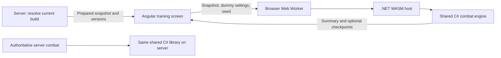

# Combat engine: WebAssembly training dummy feasibility

Analysis date: 2026-09-29. Scope: the primary LL game service and Angular game client. This is an analysis of the current working tree, including existing local changes. No implementation or deployment was performed.

## Recommendation

**Yes: the current engine is a good candidate for local training fights using .NET WebAssembly.** Reuse the C# engine in a shared library, load it on demand in an Angular-managed Web Worker, and keep practice results local. The substantial work is separating dependencies and faithfully preparing inputs, rather than rewriting the combat rules.

For the first version, the server should prepare the player's current loadout once. Subsequent fights with that snapshot, different dummy settings, and different seeds run on the player's device. Refresh the snapshot when the equipped build changes. This removes per-fight server simulation, while retaining an initial data request and static asset downloads. Completely offline build editing is a larger, separate feature.

Feasibility is supported by source inspection and existing native .NET tests. It is **not yet demonstrated by a browser build**; download size, startup time, mobile performance, and cross-runtime parity remain measurements for a prototype.

## What already exists

| Area | Evidence | Implication |
| --- | --- | --- |
| In-memory simulation | [FastCombatEngine.cs](../LL/src/Infrastructure/Service/Services.LL/Combat/Engine/FastCombatEngine.cs), `Run` at line 203 | Accepts runtime combatants and compiled definitions. The inspected combat loop has no database, HTTP, filesystem, or wall-clock dependency. |
| Bounded simulation time | Same file, `TicksPerSecond` at line 37 and loop at line 254 | Ten ticks represent one simulated second. A 60-second session is 600 ticks; it need not take 60 real seconds to calculate. |
| Seeded randomness | Same file, constructor at line 163 | Three seeded random streams govern combat, magnitude, and targeting. Useful for repeatable comparisons. |
| Existing isolated execution | [CombatEngineExecutor.cs](../LL/src/Infrastructure/Service/Services.LL/Combat/Engine/CombatEngineExecutor.cs), `ExecuteSimulationAsync` at line 189 | This path avoids the regular executor's entity-state synchronization and itemization outbox write. It still belongs to the server assembly. |
| Offline caller | [IdleBattleRunner.cs](../LL/tools/BalanceHarness/IdleBattleRunner.cs), `RunAsync` at line 38; [OfflineContent.cs](../LL/tools/BalanceHarness/OfflineContent.cs), line 154 | The balance harness already prepares and simulates file-backed encounters through production rules without a running game API. This is strong evidence of separability, not proof of browser compatibility. |
| Data-driven abilities | [AbilityCompiler.cs](../LL/src/Infrastructure/Service/Services.LL/Combat/Engine/AbilityCompiler.cs), line 5 | Compilation builds dictionaries and runtime records from ability specifications. It does not generate executable code with Reflection.Emit or a JIT compiler. |
| Existing output | [CombatCheckpoint.cs](../LL/src/Core/Domain/Models/Combat/CombatCheckpoint.cs); [CombatStatsAggregator.cs](../LL/src/Infrastructure/Service/Services.LL/Combat/Stats/CombatStatsAggregator.cs) | Checkpoints, entity statistics, ability statistics, and compact telemetry provide much of the data a practice screen needs. |
| Existing presentation | [combat.service.ts](../LL/src/Presentation/ll/src/app/core/services/client-side/combat/combat.service.ts) and shared combat components | The browser currently displays supplied results and playback frames. Its methods named `simulateFight` do not implement the C# combat rules. Reuse presentation through an adapter. |

The six `FastCombatEngine` partial files total approximately 7,300 lines, before the runtime, compiler, statistics, and domain types. Maintaining a second TypeScript or Rust implementation would create significant ongoing parity work.

## The boundary to extract

The engine currently lives inside `Services.LL`, which targets .NET 10 but references Application and includes EF Core, token libraries, and DeepCloner. Application also references EF Core, Google authentication, AutoMapper, and MediatR. Domain references Identity stores. These dependencies do not prove every referenced type is browser-incompatible, but they make shipping the entire service assembly a poor boundary and create trimming, size, and compatibility risks.

The proposed shared library, for example `LL/src/Core/Combat`, should contain:

- All engine partials, runtime combatants/effects/statuses, ability compilation, and necessary damage/statistics helpers.
- Pure rules/options currently declared in `ICombatEngineExecutor.cs`, separate from the service executor interface and encounter orchestration.
- Required attribute, damage, ability, and combat-style definitions/rules, plus transportable input and output contracts.
- An output with combat statistics and optional checkpoints, without inventory rewards or progression operations. Current `CombatResult` includes loot and experience and therefore reaches into inventory models.

Both server services and a small browser host should reference this library. Core must never reference Services.LL or the browser host. A prototype can initially reference Domain to limit code movement, but its transitive dependencies must be tested and trimmed; isolate additional pure types only where needed. Avoid reorganizing the entire domain as a prerequisite.

Keep these operations server-side:

- Authentication, character ownership, repositories, and resolving saved equipment/essence loadouts.
- Inventory, XP, essence/combat-style progression, quests, loot, resource spending, and game-event outbox writes.
- Encounter scheduling and authoritative PvE/PvP results.
- Filesystem-based content loading. `JsonAbilityCatalogProvider` currently reads abilities, statuses, summons, and an optional selected balance profile from server content files.

`SnapshotCombatantBuilder.BuildAsync` still queries EF Core for equipment definitions. Its `BuildFromItemBases` alternative helps the offline harness, but a persisted `CharacterSnapshot` is not a fully prepared browser input. `CombatSetupService.PrepareEntitiesForCombat` resolves loadouts, combat styles, essence modifiers/tags, equipment set bonuses, and calculated attributes. Further preparation in `CombatEngineExecutor` applies evolution/ascension and temporary ability modifiers and chooses basic-attack behavior. Extract a shared preparation/projection seam so the server executor and snapshot endpoint cannot silently diverge.

## Recommended data flow



The snapshot should be an explicit immutable contract rather than serialized `CombatEncounterRuntime`, `CombatEntity`, or `RuntimeCombatant`. Those objects include server context, mutable collections, callbacks, or runtime object relationships.

Include resolved attributes and their rules version, level, tags, combat-style snapshot/tuning, weapon attack behavior, and the selected character's resolved ability specifications. Preserve per-combatant ability variants: two characters can share an ability ID while having different progression modifiers. Include the necessary status and summon definitions, recursively including summon abilities and their dependencies. Include effective threat/tanking tuning and active content/balance-profile versions; copying the base `abilities.json` alone is insufficient.

Version the snapshot schema, engine build, and effective content together. Reject incompatible combinations and refresh. Preserve ordering of combatants and abilities and normalize enum names, dictionary keys, and numeric values at the JSON boundary. A source-generated JSON serialization context is a sensible way to make the small WASM boundary explicit and trimming-friendly.

A proposed browser interface is `simulate(preparedSnapshot, dummySettings, seed) -> summary + optional checkpoints`. Every run gets a fresh engine and fresh mutable combatants; only immutable definitions may be cached. Current engine instances retain ticks, logs, RNG state, and combat state. Existing executor caches also require deliberate ownership.

A local result adapter can populate existing Angular summary components. Use a distinct practice state so tutorial completion, gameplay experience, and other combat flows are not invoked accidentally. Fetching a snapshot grants no rewards, and there should be no trusted “submit dummy victory” endpoint.

## A training dummy needs explicit behavior

There is already a tutorial Training Battle. [QuestEncounterService.cs](../LL/src/Infrastructure/Service/Services.LL/Quests/QuestEncounterService.cs), lines 132–145, executes combat, processes a quest completion trigger, and adds progression loot. That feature must retain authoritative execution. The proposed local dummy is a separate practice mode, even if it reuses visual components.

The runtime already supports `canBasicAttack: false`, but ordinary combatants created by `CombatEngineExecutor` currently use its default. The new dummy factory/input needs to expose that choice and omit active/passive attacks for a passive target. A passive dummy measures damage output; it cannot meaningfully assess healing, retaliation, tanking, or damage-triggered builds. An optional attacking sparring target can cover those later.

Decide between two honest target models:

| Mode | Behavior | Work required |
| --- | --- | --- |
| Finite target | Representative level, defenses, and health; ends at death or duration cap; reports time-to-kill and actual elapsed time | Smallest first version; fits current engine semantics. |
| Sustained dummy | Remains available for a fixed duration and measures sustained damage | Requires explicit health/death and damage-accounting behavior in the shared engine. |

Do not implement sustained practice with invulnerability or effectively infinite health. Damage statistics currently use actual health lost (`healthBefore - target.Health`, around line 2338 of `FastCombatEngine.cs`); preventing health loss would distort those totals. Extremely large health also loses small decrements in floating-point arithmetic. Health affects rules: for example, Reaper's Last Rites checks the target's health fraction, and missing-health mechanics exist elsewhere in the engine.

An immortal implementation must specify whether health thresholds are fixed, cycle, or follow another explicit rule, how lethal hits are counted, and whether death/on-kill effects fire. Restoring health through an ordinary healing effect would itself activate mechanics. Keep sustained-dummy policy opt-in, preserve normal-combat behavior, and add targeted tests before exposing it.

Useful initial output: elapsed seconds, damage per second, damage by ability/type, hit and critical counts, ability uses, and summon contribution. Attribute summons consistently and avoid double-counting owner totals. Display a capped practice session as completed, even if the underlying engine reports a draw. Keep the raw engine outcome distinct from the practice completion reason. Use one seed for repeatability; bounded multi-seed comparisons can show variance later.

## Browser integration and performance

.NET supports calling C# from an existing JavaScript application through `[JSExport]`, without adopting Blazor. A small .NET 10 WebAssembly host can be integrated with Angular through generated runtime assets. This is a runtime/asset bundle, not necessarily one standalone `.wasm` file. See [Microsoft's JavaScript/.NET WebAssembly guidance](https://learn.microsoft.com/en-us/aspnet/core/client-side/dotnet-interop/wasm-browser-app?view=aspnetcore-10.0).

Use a persistent Web Worker, loaded when the player opens practice, so synchronous combat work does not block the game UI. Pass one input and one result, or coarse checkpoint batches, rather than making an interop call for each tick. Microsoft's [Web Worker guidance](https://learn.microsoft.com/en-us/aspnet/core/client-side/dotnet-on-webworkers?view=aspnetcore-10.0) documents this hosting pattern and its startup/data-transfer costs.

Start with bounded, single-threaded simulation in the worker. The current engine polls cancellation every 64 ticks, but a synchronous worker call does not yield to receive an ordinary cancellation message. Worker termination/recreation is a practical initial cancel mechanism; responsive cooperative cancellation would need yielding or another explicitly designed mechanism. Cancel on logout/navigation and suppress stale responses.

Measure compressed download size, cold startup, warm run time, memory, serialization overhead, and responsiveness on desktop and a representative phone. The native test duration is not a browser benchmark. Summons, status proliferation, full event logs, and repeated trials are more useful stress cases than basic attacks alone. Keep summaries as the default and make detailed logs optional.

Evaluate AOT only after measuring the first browser version. It can trade a larger download for faster CPU-heavy execution; it is not a prerequisite for proving feasibility. See Microsoft's [WebAssembly AOT explanation](https://devblogs.microsoft.com/dotnet/asp-net-core-updates-in-dotnet-8-preview-2/).

## Consistency and trust

Sharing C# prevents a second rules implementation but does not itself prove identical outcomes across server and browser runtimes. Existing tests verify seed determinism and checkpoint/logging consistency on native .NET. Browser parity tests must exercise the same prepared fixture, ordered inputs, tuning, and seed and compare outcomes, elapsed ticks, final health, and ability/entity statistics. Include legacy/current attribute rules, equipment behavior, evolved essences, summons, periodic effects, barriers, and combat styles.

The engine uses floating-point arithmetic and `Math.Pow`, and `System.Random` is not a durable cross-version randomness contract. Microsoft cautions against assuming identical sequences across runtime versions in its [Random documentation](https://learn.microsoft.com/en-us/dotnet/fundamentals/runtime-libraries/system-random). Pin runtime/build versions and test actual outputs; introduce a specified PRNG only if replay requirements or measured differences justify it. Changes to randomness must be versioned because they change existing seeded results.

Players control their local inputs and outputs. That is acceptable for private practice. Local results must not award loot, XP, mastery, quest credit, rankings, or resource refunds. Signing a snapshot does not establish that a client executed it honestly. Any future competitive use would require authoritative verification and would reduce the intended server savings.

Shipping a browser engine also makes shipped formulas and content inspectable and facilitates local optimization. Send only the player's prepared build and required public combat definitions, not unreleased encounters, other players' data, or secrets.

## Suggested implementation sequence

1. Extract the shared simulation boundary and keep the server executor using it. Preserve native behavior with the existing combat tests.
2. Build a minimal WASM worker with a frozen prepared fixture and finite passive dummy. Establish browser parity, download size, and device performance before creating a full screen.
3. Add a read-only prepared-build query and version checks, then connect the worker output to a separate Angular practice screen and reusable summaries.
4. Add sustained-dummy semantics if required, with focused accounting/threshold tests; then consider sparring targets and bounded multi-seed comparisons.

This is a medium-sized extraction and integration project, not a simple compiler switch. A prepared-current-build MVP is materially smaller than a fully offline equipment/essence editor. Precise effort and performance estimates should follow the prototype.

## Verification and operational implications

Ran the repository test entry point:

```powershell
./build/run-tests.ps1 -Filter 'FullyQualifiedName~FastCombatEngineOutcomeTests|FullyQualifiedName~FastCombatEngineListenerDispatchTests|FullyQualifiedName~CombatPreparationPipelineTests|FullyQualifiedName~CompactCombatTelemetryTests|FullyQualifiedName~AttributeCombatSystemTests|FullyQualifiedName~CombatStyleEngineTests|FullyQualifiedName~CombatStyleDuelistEngineTests|FullyQualifiedName~CombatStyleReaperEngineTests|FullyQualifiedName~TenacityCombatTests|FullyQualifiedName~AbilitySystemTests' -ArtifactsPath '.artifacts/combat-wasm-analysis-20260929'
```

Result: **487 passed, zero failed, zero skipped**. The build completed with 62 warnings in the existing working tree. Initial sandbox execution was blocked from reading the user's NuGet configuration; the permitted retry restored successfully. A first build under the system temporary directory produced 88 catalog-location test failures because those tests locate game content by walking upward from the output directory. Placing isolated build artifacts under the checkout resolved those failures; no source changes were needed.

`dotnet --list-sdks` showed SDK 10.0.401 available; `dotnet workload list` showed no installed workloads. A WASM publish/browser benchmark was not attempted, and no workload was installed. No frontend build was needed for this analysis. The source scan also found no existing WASM integration in the game frontend.

Changed file: this report only. No application code, migrations, or configuration was changed, and nothing was deployed. A future implementation would add WASM build tooling/assets, coordinated engine/content versioning, and a snapshot query; no database migration is inherently required. Hosting must serve the generated runtime assets correctly, including MIME types, compression, caching, and applicable worker/WebAssembly CSP rules. Any external hosting or infrastructure changes belong in the separate infrastructure repository and were not performed here.
