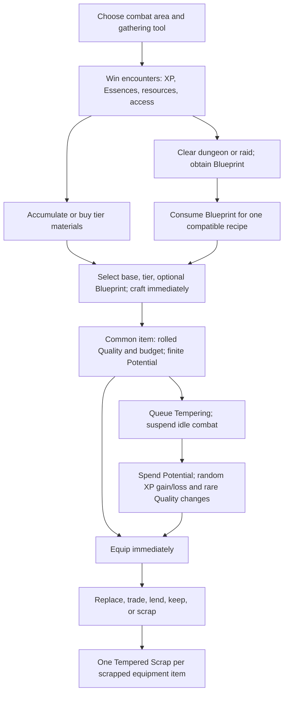

# LegendsLegacy Equipment, Gathering, Crafting, and Tempering design review

> Post-Alpha update (3 September 2026): the owner has dropped Alpha-data preservation. Cohort/conversion/retirement-adapter recommendations in this historical review are superseded by [the cleanup record](equipment-post-alpha-cleanup.md).

**Date:** 2 September 2026. **Status:** design recommendation; no implementation authorized by this document.

**Subsequent owner decisions and implementation:** this review is retained as the original comparison/evidence record. The selected [equipment progression specification](equipment-specification.md) supersedes its merchant fallback and balance-before-implementation recommendations: gear-selling merchants are excluded, and the complete loop is being built with provisional values before content balancing. Canonical equipment, starter grants, Forge, protected dungeon acquisition, baseline recovery and ordinary Region 1 acquisition/resource income now have backend implementations and an Equipment & Forge screen. Versioned main-quest replacements, first-entry/resource grants and earned plain-target recovery are implemented behind disabled flags; cohort-specific profession actions, optional profession branches and old combat/dungeon gear/material rewards are now retired with matching navigation/help. Prophecy objectives/cache awards and obsolete achievement goals now follow equipment progression retirement rules. Guild orders/shared missions and permanent equipment donation/loans are implemented. Guild shop/event rewards and raid Trophy vendors now use equipment progression resource/style rules, with compatible shared-event participation. Six obsolete Soulstone constellations now have cohort-specific purchase/bonus guards and an explicit refund that preserves active upgrades. Blueprint/item/market and guild-building descriptions follow the same cohort. The 3 September follow-up makes sigil income exclusive by saved cohort and adds Sigil Traces refunds. Exact equipment-market filters, canonical administrative grants and equipment reference builds are also implemented. Remaining consumer/operational cleanup, later-region coverage and conversion remain pending; raids are deferred. See [implementation status](equipment-implementation-status.md) for current scope, tests and unapplied migrations. Merchant examples and the original sequence below are historical proposals, not current requirements.

## 1. Executive Summary

**If I were designing LegendsLegacy, I would choose content-earned equipment, deterministic Tempering, and collectible Blueprint specializations, without Gathering professions or an equipment-production profession.** This is equipment progression below: a deliberately narrow development of Model D.

The intended loop is:

> Choose a combat/content target → obtain usable equipment, with a guaranteed acquisition ceiling → equip it immediately → invest in a few predictable Tempering improvements → choose a compatible Blueprint style → retain it through a substantial progression band → replace it when a new band or build justifies the change.

Equipment should provide the statistical foundation and physical configuration of a build. Essences should remain its principal ability and identity system. Tempering should turn equipment into a chosen investment. Blueprints should preserve a compact collection of reusable specializations. These are distinct jobs; three gathering levels, recipe mastery, production Quality, consumable Potential, and a separate Crafting level are not all needed to perform them.

The recommendation is substantial removal, not a request to build more systems around the current ones. Remove routine material harvesting, gathering tools, profession leveling, mass production of random-quality equipment, and destructive Tempering progress. Retain the useful item archetypes, combat budgets, existing set concepts, content definitions, market, and inventory infrastructure.

Several facts materially qualify the initial premise:

- **Gathering is already a passive combat reward layer.** It is not currently a separate woodcutting/mining idle activity. One equipped tool selects which node types can reward combat victories. Removing it would remove a tool/XP/reward-selection layer, not free a separate gathering timer. [S01] [S02]
- **Crafting is already one profession.** ArmorForging, WeaponSmithing, and JewelryCrafting survive as categories and queue metadata; they are not three current independent production progression tracks. [S04] [S05]
- **Base production is immediate; Tempering occupies the idle action.** The present friction is resource acquisition, production rolls, and subsequent investment that suspends idle combat. It is not a timed base-crafting job followed by another timer. [S05] [S10]
- **Equipment already drops in the broad type-system sense: gathering tools.** The inspected ordinary combat-equipment catalog remains production-centric. Dungeon tools, guaranteed first-clear Blueprints, and raid trophy purchases are important exceptions to “everything is crafted.” [S11] [S12] [S14]
- **Raids already have implementation and authored content.** The Hive's Abyss requires Epic-or-better Blueprint armor in three slots. That is particularly problematic alongside the current Tempering probabilities. [S15]
- **The checked-in world has two regions and recipes for equipment tiers 1–2.** Ten-region scalability and the Region 3 journey below are proposed future design, not descriptions of ten completed regions. The shared equipment budget curve does extend further. [S03] [S06] [S08]

The strongest existing idea is **base archetype + thematic Blueprint + equipment investment**. Its weakest foundation is making material conversion and repeated production the default route to almost every ordinary combat item, then making an individual item's improvement a finite random walk.

This is a judgment about the inspected design, not a claim that player telemetry proves players dislike it. The repository establishes behavior and constraints; it does not establish actual retention, market liquidity, player sentiment, or median item lifetime.

## 2. Current System

### 2.1 Scope and evidence

The target is the primary game under `LL/`: domain rules, Application commands, Services.LL, persistence, API content JSON, and the Angular player screens. LL-Chat and infrastructure-as-code are outside scope. The review describes the **working checkout**, including pre-existing edits, rather than assuming the deployed database matches it. Older design documents are not treated as runtime truth.

Source references at the end identify the implementations and authored content behind the findings. “Current” means observed there; “inference” means a design consequence; all recommended odds, prices, and time targets are explicitly provisional. No production data, accounts, or database were inspected.

### 2.2 Gathering: implementation and loop

| Aspect              | Observed behavior                                                                                                                           | Design consequence                                                                                  |
| ------------------- | ------------------------------------------------------------------------------------------------------------------------------------------- | --------------------------------------------------------------------------------------------------- |
| Professions         | Mining, Woodcutting, Skinning                                                                                                               | Three parallel progress bars for selecting commodity families                                       |
| Activity            | Equip a tool in the dedicated Tool slot, fight, and roll matching nodes on victories                                                        | Combat remains the actual activity; there is no separately selected gathering job in this path      |
| Selection           | One tool type; matching nodes must satisfy profession-level requirements and have rewards                                                   | Choice of resource family is real, although all three tracks can eventually be leveled              |
| Progress            | 50 base XP per eligible victory/attempt, including failed gathering rolls; only the first matching node grants XP                           | Gather success is unnecessary for XP; adding nodes does not multiply baseline profession XP         |
| Level curve         | Maximum 100; next level costs `474 × currentLevel²`                                                                                         | Long progression whose currently authored unlock payoff is weak                                     |
| Current gates       | Overworld requirements are absent or 1; authored dungeon gathering requirements inspected are 1                                             | Higher gathering levels currently do not reveal a substantial sequence of new resource access       |
| Idle timing         | Configured encounters every 10 seconds, with a 24-hour offline combat window                                                                | Gathering throughput follows eligible wins, not animation speed or enemies per second               |
| Overworld chances   | Typical node proc probability 0.0037 per eligible victory                                                                                   | Rare bundles rather than a resource every kill                                                      |
| Regions             | Shenic supplies tier-1 Ore, Wood, Hide; Meran supplies tier-2 Copper Ore, Bloodwood, Thick Hide                                             | Regional movement changes material tier; there is no tier-3–10 standard-material catalog yet        |
| Area identity       | Abundant areas show +50% yield; global base multiplier is 2/3                                                                               | Abundant nodes reach a 1.0 multiplier before tools; ordinary nodes yield 2/3 of authored quantities |
| Dungeon interaction | Matching tools also gather after victorious dungeon encounters; Goblin Mines/Catacombs contain explicit nodes                               | A dungeon is already a resource-farming choice, with different node opportunities                   |
| Improvement         | Tool base bonuses, random tool affixes, and Soulstone bonuses affect yield, proc chance, rare-entry weighting, extra rolls, or gathering XP | Tool optimization exists; a deep profession specialization tree does not                            |
| Trade               | Unbound materials/tools can enter the market or transfers                                                                                   | Purchasing can replace personal harvesting, but cannot remove economy-wide production dependence    |

Sources: [S01]–[S03], [S11], [S17], [S18].

The real loop is:

> Player equips a Pickaxe and chooses an area → wins combat encounters → sometimes receives an Ore bundle and a rare catalyst roll, while gaining Mining XP → spends Ore with another material family on a selected equipment recipe, sells it, or saves it → gains combat power through the produced item, while most Mining levels themselves do not currently unlock new authored choices.

For a no-bonus character winning every 10-second encounter, a 0.0037 node produces **1.332 successful procs/hour**. A Shenic 8–24 resource bundle averages 16 before modifiers, so an abundant node averages about **21.3 units/hour**. This is an expectation, not a delivery schedule. Approximately 26% of such one-hour sessions have no node proc at all.

The Shenic catalyst subtable has 96 no-drop weight and four entries of weight 1. Before bonuses, that means a 4% catalyst chance _after the gathering proc_, and 1% for a particular catalyst. The idealized mean waiting time for one specified catalyst through this overworld route is about **75 hours**. Dungeon opportunities, purchases, and selection caches materially change actual acquisition. This calculation does not claim all catalysts take 75 hours. [S03] [S12] [S18]

At the same perfect-win cadence, leveling one gathering profession from 1 to 100 would require 155,637,900 XP, or about **8,647 combat hours**, before bonuses. Switching tools divides progress. A long bar alone is not a long-term goal if its milestones do not unlock meaningful decisions.

### 2.3 Crafting: production, progression, and restrictions

The current authored catalog has **31 base recipes**, each enabled, each requiring Crafting level 1, and each permitting tiers 1–2. It includes:

- Heavy, medium, light, and cloth armor across Head, Chest, and Legs: 12 bases.
- A ring, necklace, and relic: 3 bases.
- Five one-handed weapons and eight two-handed weapons: 13 bases.
- Towershield, Spiritward, and Grimoire: 3 offhands.

Tools cannot be crafted or modified through this system. The profession enum retains obsolete jewelry/weapons entries, while `ResolveCraftingProfession` routes current equipment production to Crafting. [S04]–[S06]

Production selects **base recipe, optional learned compatible Blueprint, target tier, and quantity**. Quantity is clamped to 1–100. Validation checks enabled definitions, Blueprint compatibility and unlock, allowed tier, output slot, profession level, and materials. The command consumes materials and immediately adds equipment to inventory. It does not require completing a production timer. [S05]

Standard requirements resolve a material family at the selected tier. Quantity is `baseAmount + amountPerTier × (tier − 1)`. Tier-defining materials must agree with the output tier. For example, the Heavy Helm uses 8 Ore + 4 Hide at tier 1 and 11 Copper Ore + 5 Thick Hide at tier 2. Optional Blueprint catalysts add a separate requirement; the player does not choose arbitrary substitute ingredients to control stat weights. [S06] [S07]

There are **two different production-related progressions**:

1. **Recipe mastery**, per base recipe: 25 base XP per produced item, level 0–100, with each mastery level costing approximately `200 × 1.07^level`. It improves Quality odds and starting Potential. Bulk crafting evaluates mastery as each item is produced.
2. **Crafting profession level**: the inspected Tempering path awards 1 base profession XP per attempt and uses the general profession level curve. Its level increases starting Potential on future production. Base production awards recipe mastery; it does not use the same path to grant Crafting profession XP.

Ignoring bonuses, mastery 25/50/75/100 requires approximately **506 / 3,253 / 18,158 / 99,054 crafts of that base recipe**. That is an enormous repeat-production demand relative to a character needing one or two instances of a slot. It can sustain a material sink; that does not make it satisfying progression. [S05] [S09]

### 2.4 Blueprints, forms, stats, and item axes

The 13 authored Blueprints are Fury, Arcane, Execution, Aegis, Warden, Endurance, Phoenix, Spirit, Primal, Venom, Hive, Raidforged, and Gravebound. They overlay compatible recipes according to tags or explicit recipe IDs. A Blueprint is consumed to unlock **that Blueprint for one selected recipe on the character**. Learning Fury for a sword does not automatically teach Fury for a ring. First-clear dungeon rewards give specific Blueprints; repeated completions can supply further copies. Raidforged/Gravebound have trophy-vendor routes. [S05] [S06] [S14]

A composed design supplies a name, base stat profile, Blueprint bonus profile, combined Tempering weights, tags, optional behavior changes, and sometimes set membership. Fury, for example, adds a 20% bonus-budget profile emphasizing Power/Crit and requires a Fury Catalyst. A Blueprint is therefore both a specialization and, in inspected examples, an additional power budget—not merely a cosmetic recipe unlock. [S06] [S07]

| Item axis         | Current job                                                                                                   |
| ----------------- | ------------------------------------------------------------------------------------------------------------- |
| Base/behavior     | Slot, armor role, weapon configuration, basic-attack timing/damage characteristics, initial stat distribution |
| Tier              | Shared equipment-budget growth and character-level equip requirement                                          |
| Quality           | Crude, Standard, Fine, Exceptional, Masterwork; multiplies starting stats and starting Potential              |
| Rarity            | Every newly crafted item starts Common; Tempering can increase rarity and grant stat improvements             |
| Potential         | Finite attempt resource set at creation; not equivalent to item power or a chosen upgrade plan                |
| Recipe mastery    | Improves future Quality probabilities and Potential for that recipe                                           |
| Crafting level    | Improves future starting Potential                                                                            |
| Blueprint         | Additional thematic stats, Tempering profile, and possible set identity                                       |
| Instance variance | A single 0.95–1.05 budget multiplier on creation, allocated through the authored profiles                     |
| Set bonuses       | Multiple equipped pieces activate additional attributes and, for some thresholds, abilities                   |

Quality stat multipliers are **0.90 / 1.00 / 1.12 / 1.26 / 1.42**. Starting Quality probabilities at mastery 0 are **25 / 60 / 14 / 1 / 0 percent**; at mastery 100 they are **0 / 35 / 45 / 16 / 4 percent**, interpolated between authored mastery milestones. Quality rewards mastery without guaranteeing the best result. [S09]

Starting Potential is rounded from:

`(100 + 100 × tier) × slotPotentialWeight × qualityPotentialMultiplier + 10 × masteryLevel + 10 × craftingLevel`.

Current Potential slot weights are all 1. Quality Potential multipliers are **0.75 / 1 / 1.15 / 1.35 / 1.60**. A standard tier-1 item made at recipe mastery 0 and Crafting level 1 has 210 Potential. This is deterministic conditional on the rolled Quality; Potential itself is not another independent random roll. [S09]

The equipment budget is `100 × growth^(tier−1)`, with growth approximately **1.3531** and a tier-10 reference budget of 1,520. Two-handed items receive twice a normal slot's budget, matching the combined hand allocation. The model distinguishes flat stats, progression-normalized ratings, percentage stats, exchange costs, and constraints. This is considerably more deliberate than arbitrary random affix generation. [S07] [S08]

Tier-2 equipment requires character level **50** to equip. The expected-tier helper transitions at **51**. These are distinct functions; a design plan must decide how to align them rather than treating both as the same gate. No production character-level check equivalent to equipping was found in `CraftItemsAsync`; material access and the equip gate are different restrictions. [S05] [S08] [S16]

### 2.5 Tempering: actual mechanics

Eligibility requires an inventory equipment item with a resolvable recipe/Blueprint Tempering profile, at least 1 Potential, and rarity below Legacy. Tools and ordinary directly granted items without a recipe ID do not qualify. Equipping an item removes it from inventory, so an equipped item must first be made available to the queue. [S10] [S11]

Each **10-second** attempt spends 1 Potential. It spends no Ore, catalyst, Tempered Scrap, or Cinders in the inspected execution path. Negative results can spend one additional Potential. The real cost is finite item capacity plus the opportunity cost of suspending idle combat and its rewards. Tempering generates profession XP, can produce Soulstones, and advances associated objectives. [S05] [S10]

| Starting rarity | Positive chance | Negative chance before bonuses | Critical chance | Positive effect            |
| --------------- | --------------: | -----------------------------: | --------------: | -------------------------- |
| Common          |              6% |                             5% |          0.001% | +1 item XP                 |
| Uncommon        |              3% |                            10% |          0.002% | +1 item XP                 |
| Rare            |            1.5% |                            15% |          0.003% | +1 item XP                 |
| Epic            |            0.5% |                            20% |          0.004% | +1 item XP                 |
| Unique          |            0.1% |                            25% |          0.005% | +1 item XP                 |
| Legendary       |              0% |                            30% |          0.006% | No ordinary positive route |

Remaining probability is Neutral. Negative outcomes lose an additional Potential 80% of the time; otherwise they remove 1 item XP if any exists. Ten item XP raises rarity by one step and resets those ten XP. Rarity never decreases in this path, but progress toward the next rarity can decrease. [S10]

A rarity increase chooses an eligible stat by authored weights, adjusted for distribution and category, and allocates an improvement budget equal to **8% of the tier budget × slot weight × Quality multiplier**, subject to stat constraints. It can increase an existing stat or introduce a permitted stat. The name “directed improvement” describes weighted thematic steering; the player does not select the exact stat during the attempt. `MaxBudgetShare` is not currently enforced as a hard ceiling; actual stat constraints still matter. [S10]

A Critical result normally raises Quality one grade if possible and increases stats accordingly; it does **not** refill Potential. A 2% conditional branch instead flags `IsLevelingItem` and clears `IsMasterpiece`. The inspected references do not reveal a functioning cross-tier leveling lifecycle for that flag. Likewise, current mechanics do not set `IsMasterpiece` true, despite retained achievement/display concepts. Do not present these flags as fully supported long-lived equipment systems. [S10] [S19]

The queue can be reordered, paused, resumed, canceled, and configured to return an item after its next rarity increase. Exhausted/completed items return to inventory, and the game can automatically resume the prior combat area. The player screen exposes Quality/Potential sorting, item-XP progress, and the rarity-stop control. These are useful protections against idle-management friction, but they do not repair the underlying investment odds. [S05] [S10] [S24]

### 2.6 Current reward ownership outside production

| Source                    | What the inspected implementation/content actually provides                                                                                                                              |
| ------------------------- | ---------------------------------------------------------------------------------------------------------------------------------------------------------------------------------------- |
| Ordinary area combat      | Character XP, Cinders, Soulstones, Essence acquisition/resonance, dungeon-access drops, matching-tool gathering; no authored normal combat-gear loop found                               |
| Dungeons                  | Encounter rewards, boosted featured-boss Essence acquisition, completion currencies, Monster Cores, first-clear Blueprints, repeat Blueprint/catalyst opportunities, and gathering tools |
| Region boss               | The Mad King exists; its current definition has `rewardsEnabled: false` and empty reward brackets                                                                                        |
| World Tower               | Shared floor progression, unlocks, first-clear Tower Tokens, and Echo rewards limited per floor/character/week; authored release boundary is floor 15                                    |
| Raids                     | Existing multi-wing content, trophies and reward items; vendors sell specialized Blueprints and materials                                                                                |
| PvP/Champion Market       | Glory purchases such as titles, catalyst caches, Soulstones, Sigil Fragments, and Monster Cores                                                                                          |
| Guilds                    | Building/shop/mission progression and an equipment vault with donation/borrowing; crafting/tempering orders and catalyst/Blueprint-related stock                                         |
| Quests                    | Tutorial explicitly requires crafting and equipping a first weapon, then equipping a tool; later objectives include production/Tempering and reward resources                            |
| Prophecies                | Daily/weekly combat, gathering, Essence, and Tempering objectives, with currencies/caches and category rewards                                                                           |
| Auction House / transfers | Cinder-denominated listings and commodity buy orders; unbound equipment and materials can move between players                                                                           |

Sources: [S02] [S12]–[S18] [S20]–[S23]. Generic reward factories can instantiate equipment, but that technical capability is not evidence of an authored combat-equipment progression.

## 3. Current Equipment Lifecycle

The tutorial bootstraps this sequence rather than requiring a new player to gather without tools. Afterward, equipment can be acquired from another player, so an individual can skip personal production. Someone still has to produce ordinary combat gear. [S05] [S16] [S17] [S21]

| Point in lifecycle    | Agency                                                              | RNG / grind                                                       | Emotional payoff or problem                                                      |
| --------------------- | ------------------------------------------------------------------- | ----------------------------------------------------------------- | -------------------------------------------------------------------------------- |
| Area/tool selection   | Choose Essence targets, difficulty, material family, abundance      | Gathering proc, bundles, rare catalysts                           | Useful overlap, but another objective competing with the preferred combat target |
| Blueprint acquisition | Pick dungeon/family or buy a copy                                   | First-clear determinism; later reward RNG                         | A real named goal, followed by additional production requirements                |
| Blueprint learning    | Pick compatible base                                                | Repeated copies needed across bases                               | Commitment can inhibit experimenting with a different weapon                     |
| Base production       | Select exact slot, tier, archetype, style                           | Quality and small budget roll; mastery encourages mass production | Strong deterministic slot control; uncertain long-term investment value          |
| Tempering             | Choose item, queue order, stop condition                            | Lost XP/Potential, random improvement stat, finite attempts       | Anticipation mixed with irreversible disappointment                              |
| Equipping             | Hand rules, armor role, attributes, set thresholds, Essence synergy | No equip roll                                                     | Immediate build impact, often far removed from the combat reward moment          |
| Replacement           | Compare existing investment with new tier/style                     | Further production and investment                                 | Old investment has little systematic recovery                                    |
| Economic exit         | Sell, transfer, guild-lend, or scrap                                | Market uncertainty                                                | Trade preserves value if buyers exist; scrapping ignores investment              |

Scrapping grants **one Tempered Scrap per equipment item**, independent of tier, Quality, rarity, or remaining Potential. No active Tempered Scrap spending path was found in the searched game code/content. It is an item sink that currently creates a resource with an unclear implemented purpose, not a working enhancement-material cycle. [S17]

There is no evidenced current median item lifetime. Tier replacement pressure can be inferred from the budget curve, but Quality, Blueprints, set bonuses, and player access can keep an older item competitive. An honest review cannot turn “tier 2 is stronger” into “players replace gear every three days” without telemetry.

## 4. Design Problems

### 4.1 Reward distance

A difficult victory can yield an unlock or ingredient that must pass through material availability, the right recipe unlock, a production roll, and another idle activity before becoming the desired improvement. That weakens the connection between defeating the enemy and wearing its reward. Essences already supply direct combat excitement; this does not make the equipment gap harmless.

**Crafting itself is not the problem. Mandatory conversion with little new decision is the problem.** Choosing a shield over a second weapon is meaningful. Moving two commodity stacks through a fixed recipe after that choice usually is not.

### 4.2 Progression loops reward manufacturing surplus

Mastery improves the odds of producing better investment candidates. Tempering improves profession level, which improves Potential on the next candidate. The player can therefore be encouraged to make and process equipment principally to become better at making and processing equipment. The economy receives sinks; the player receives more prerequisites.

### 4.3 Investment safety is upside down

Higher-rarity items are harder to improve and more likely to lose XP or extra Potential. This is especially hostile to an idle game: a long absence can resolve a queue into exhausted capacity without a satisfying endpoint. A player cannot make a reliable plan merely by saving enough ordinary resources.

### 4.4 Content gates expose a mathematical mismatch

The Hive's Abyss raid checks Head, Chest, and Legs for tier-1-or-higher, Epic-or-better, Blueprint-crafted armor, plus other requirements. [S15] Meanwhile, default Rare Tempering has a 1.5% XP gain chance and a 3% XP loss chance whenever XP is above zero. A Soulstone upgrade can reduce negative probability by up to 1.5 percentage points; it does not reverse that Rare-level imbalance. [S10] [S18]

This is not proof no player can enter: accumulated profession levels, trading, older items, and modifiers matter. It is evidence that a required equipment state is gated by an extremely unfavorable process rather than a clearly paced achievement. Fixing probabilities would resolve a balance fault, but it would not establish why the mandatory production architecture is desirable.

### 4.5 Complexity audit

The classifications concern each mechanic's role in LegendsLegacy's recommended future, not the quality of the code implementing it.

| Mechanic                                              | Classification                      | Judgment                                                                                  |
| ----------------------------------------------------- | ----------------------------------- | ----------------------------------------------------------------------------------------- |
| Equipment archetypes, hand choices, armor roles       | Essential                           | Physical configuration makes builds readable and materially different                     |
| Tier / progression band                               | Essential                           | Content needs a clear statistical foundation and replacement rhythm                       |
| Gathering as a major system                           | Complexity Without Sufficient Value | Current actual activity is combat; few authored level-based decisions                     |
| Three gathering profession levels                     | Candidate for Removal               | Long duplicate ladders with weak current unlock payoff                                    |
| Resource choice/area abundance                        | Valuable                            | Can survive as ordinary content reward differences without profession scaffolding         |
| Standard Metal/Wood/Hide families repeated by tier    | Redundant                           | Mostly parallel tickets to the same deterministic conversion                              |
| A small equipment-investment material                 | Valuable                            | Gives duplicates and ordinary play a shared, comprehensible use                           |
| Crafting profession level                             | Candidate for Removal               | Adds future-item Potential to an already layered lifecycle                                |
| Base recipe definitions                               | Valuable                            | Reuse as authored item archetypes, even if no player crafts them                          |
| Per-recipe mastery                                    | Complexity Without Sufficient Value | Rewards extreme overproduction and discourages switching bases                            |
| Blueprints                                            | Valuable                            | Thematic collection and specialization are worth retaining after simplifying unlock scope |
| Routine equipment crafting                            | Candidate for Removal               | Targeted rewards and bounded acquisition can supply its strongest player benefit          |
| Rare bespoke item construction                        | Valuable only if exceptional        | Could support a future singular narrative project; not needed for this recommendation     |
| Quality                                               | Redundant                           | Duplicates numerical value and upgrade-capacity sorting; remove rather than rename        |
| Rarity as current improvement ladder                  | Redundant                           | Conflates loot prestige with item XP; separate provenance from investment                 |
| Potential                                             | Candidate for Removal               | Finite failure capacity undermines ownership without adding a strong choice               |
| Tempering's ownership/investment purpose              | Valuable                            | Keep the purpose; replace the random walk                                                 |
| Weighted/random stat improvements                     | Complexity Without Sufficient Value | Theme is useful, random irreversible allocation is not necessary                          |
| Set bonuses                                           | Valuable                            | Existing build interactions are real; audit their total power and threshold burden        |
| Random tool affixes                                   | Candidate for Removal               | Their target system disappears; no reason to transplant five yield stats elsewhere        |
| Masterpiece / LevelingItem flags                      | Candidate for Removal               | Current write/use paths do not deliver the implied lifecycle                              |
| Separate repair, reroll, socket, or affix professions | Candidate for Removal if proposed   | No active need established; do not create them to replace deleted complexity              |

## 5. Gathering Analysis

**If Gathering did not already exist, I would not build the current profession system.** I would build regional combat rewards and perhaps a simple resource preference if players demonstrably needed it.

The fair defense of current Gathering is that it asks little moment-to-moment attention. Selecting a tool changes a byproduct stream, area abundance can change a farming destination, rare tools create an economic chase, and asynchronous trading allows a material producer to support others. These are genuine decisions.

However, the identity is thin: a miner still spends their time winning the same battles. Profession levels currently provide little authored access differentiation. The best economic identity mostly comes from selecting which commodity to accumulate, not from a distinct activity or exclusive specialization. Random yield affixes and three long XP curves multiply optimization without substantially changing that activity.

| Treatment              | What would justify it                                                                                          | Cost and verdict                                                                      |
| ---------------------- | -------------------------------------------------------------------------------------------------------------- | ------------------------------------------------------------------------------------- |
| Keep as a major pillar | Distinct expeditions, exclusive contracts, resource ecologies, meaningful specialization and player dependence | Essentially designing a second game. Poor fit for current solo-development priorities |
| Simplify               | Remove levels, randomized tools, and production gates; optional resource preference only                       | Reasonable fallback if users strongly value selecting side income                     |
| Repurpose              | Exploration/consumable/guild supplies that do not gate ordinary combat builds                                  | Possible future feature, but no established demand warrants building it now           |
| Remove                 | Award useful equipment resources directly through existing content                                             | Recommended; preserves reward flavor without maintaining a profession facade          |

Do not replace “gather ore for every sword” with “gather tempering ore for every sword upgrade.” That preserves the mandatory dependency under a new label. Nor should guild supplies become a justification for making every member run a gathering checklist.

The loss is real: some players would lose a preferred producer identity and tool market. The proposed architecture deliberately accepts that loss in exchange for clearer combat progression. Migration should recognize prior investment, not claim it never mattered.

## 6. Crafting Analysis

### 6.1 What players currently get from crafting

| Purpose                   | Actually achieved?                             | Assessment                                                                                            |
| ------------------------- | ---------------------------------------------- | ----------------------------------------------------------------------------------------------------- |
| Progression necessity     | Yes at the economy/tutorial level              | Ordinary gear production and onboarding depend on it; individuals can buy other players' output       |
| Economic opportunity      | Mechanically supported                         | Quality/mastery can differentiate producers, but no evidence here proves profitable or liquid markets |
| Optimization              | Yes                                            | Select bases/Blueprints, seek Quality/Potential, repeat production                                    |
| Build customization       | Yes                                            | Armor roles, weapon behaviors, thematic stats, and sets materially matter                             |
| Collection                | Partially                                      | Blueprint unlocks create persistent goals; multiplying them by recipe can make completion mechanical  |
| Deterministic acquisition | Strong for base/slot/tier; weak for final item | Materials guarantee the chosen base, not Quality or the eventual Tempering result                     |
| RNG mitigation            | Partial                                        | Mastery shifts odds; it does not guarantee the investment outcome                                     |

Crafting's strongest benefits are **target selection and authored build composition**. Neither requires a profession or a production screen. They can be retained in content reward targeting and Blueprint application.

### 6.2 Could a hybrid avoid duplication?

Yes, if drops supply exciting item identities while crafting supplies a deliberately restricted floor. For example, crafted items could be plain bases, unable to reproduce boss identities, and modification could share the same Tempering interface. That is a defensible Model C.

But allowing players to craft the exact same best items that content drops creates two tuning obligations for one outcome. The cheaper route dominates; the other becomes insurance or an inferior tutorial. Conversely, exclusive top-tier crafted items would make production mandatory again. A broad hybrid also tempts adding rerolling, sockets, components, and several specialist professions to make crafting feel indispensable.

For this game, a content-earned guaranteed reward can fill missing slots without a second acquisition system. Keep the **function** of deterministic acquisition; remove unnecessary production around it.

## 7. Tempering Analysis

**The problem Tempering should solve is: “I have a useful item; how can I make deliberate progress with it before replacing it?”** Today it also supplies Crafting XP, item rarity generation, Quality correction, side currency generation, and objective counters. Those extra jobs obscure its purpose.

### 7.1 Quantifying the current investment problem

For a fixed rarity, let `p` be positive probability and `q = negativeProbability × 0.2` be the chance to lose item XP. Starting at zero XP, with a floor at zero and an upgrade at ten, the expected attempts with _unlimited_ Potential are:

`E = (1/p) × Σ[k=0..9] (10−k) × (q/p)^k`.

This follows the birth/death recurrence with self-loops; it includes neutral outcomes and XP loss. It is not the optimistic `10/p` calculation that ignores setbacks.

| Upgrade           | Expected attempts, unlimited Potential, no bonuses | At ten seconds/attempt |
| ----------------- | -------------------------------------------------: | ---------------------: |
| Common → Uncommon |                                                196 |           32.7 minutes |
| Uncommon → Rare   |                                              803.5 |             2.23 hours |
| Rare → Epic       |                                            135,733 |              377 hours |

Actual items have finite Potential and may never reach the target. Those times are **not promises of eventual acquisition**. Critical Quality changes do not replenish Potential or advance item XP, so they do not rescue this XP process. Legendary has zero ordinary positive chance and therefore cannot reach Legacy through this current positive-XP path. [S10]

A finite-Potential dynamic-program calculation using the same transitions gives a fresh **210-Potential Common item about a 59.45% chance to reach Uncommon** before exhaustion, but only **0.00496% to reach Rare**. At 310 Potential those figures are approximately **91.44% and 0.2648%**. These are no-bonus, zero-starting-XP examples, not population estimates. The recurrence and verification notes are included in section 22.

Thus an apparently reasonable instruction—“temper the new item until it improves”—can consume its entire capacity and leave it at the original rarity. A sequence of neutral outcomes is non-destructive to existing stats, but destructive to the item's remaining opportunity.

### 7.2 Design options

| Option                                            | Judgment                                                                                |
| ------------------------------------------------- | --------------------------------------------------------------------------------------- |
| Keep largely unchanged                            | Reject: fails predictable investment and competes with combat time                      |
| Merely improve success probabilities              | Useful short-term balance repair, insufficient architectural answer                     |
| Bounded RNG with permanent pity                   | Viable, but adds explanation and still leaves random allocation questions               |
| Deterministic ranks and selectable specialization | Recommended: clear costs, known outcomes, support for attachment                        |
| Quality/rarity/Tier upgrading all in Tempering    | Reject as the default: recreates several vertical ladders inside one menu               |
| Affix reroll casino                               | Reject: incompatible with low inventory burden and deliberate ownership                 |
| Remove Tempering entirely                         | Coherent for pure loot, but loses the opportunity for gradual investment in found items |

The current system complements crafting mechanically because it improves production output. It competes with equipment acquisition psychologically and with combat materially because it takes idle time away from farming the next base, Essence, or dungeon access. The recommended version should complement content without forcing this scheduling conflict.

## 8. Equipment Acquisition Analysis

Equipment drops are appropriate **because of the role they can play**, not because every RPG needs them. A recognized reward from a difficult enemy makes a combat achievement tangible. In an idle PBBG, the valuable event is opening the return summary and seeing a useful discovery—not manually evaluating hundreds of random objects.

| Reward structure                                                  | Fit                                                                              |
| ----------------------------------------------------------------- | -------------------------------------------------------------------------------- |
| Random items on most monsters                                     | Poor: inventory work scales with absence and encourages automatic disposal       |
| Very rare unrestricted items with no guarantee                    | Poor: low spam but weak targeting and long dead periods                          |
| Components only                                                   | Predictable, but retains distance between victory and wearable reward            |
| Blueprints only                                                   | Good collection payoff; incomplete equipment payoff unless application is simple |
| Sparse regional bases + targeted boss items + guaranteed ceilings | Best: discovery, clear goals, and bounded frustration                            |
| Only permanent upgradeable heirlooms                              | Weak replacement excitement and an increasingly closed item market               |

Do not add independently rolled Tier, rarity, Quality, Potential, affix count, and affix magnitudes to each drop. Fix the item's tier to content eligibility, author its archetype and style, and let later investment be predictable. Randomness can decide **when a recognizable item arrives**, without deciding six dimensions of whether it is secretly worthless.

Item lifespan should be **mixed, centered on medium-lived items**. Early/plain gear establishes a working build; selected styled gear deserves a substantial region or progression band of investment; exceptional finds may bridge into the next band. No ordinary item should be guaranteed to remain optimal forever, and entering a new region should not invalidate a full set immediately.

## 9. Interaction With Essences

Essences already provide collection, loadouts, abilities, XP, Ascension, and focused acquisition. Slot count grows with character level to a maximum of ten; the current loadout limit service returns three. Essence level caps are 10/30/60/100 across Ascension tiers 0–3. Ascension consumes Lesser/Greater/Primal Monster Cores, with collection-based catch-up discounts for the first two tiers. Dust from dismantled Essence items can buy levels within the current cap. [S20]

Creature resonance adds drop chance after eligible failed kills, capped after 12,000 failures; that is a probability boost rather than an unconditional guaranteed-drop threshold. Featured dungeon bosses receive stronger Essence drop/resonance modifiers. Equipment acquisition should reuse familiar targeting concepts without simply copying every Essence counter or competing for Monster Cores. [S13] [S20]

The desired division of responsibility is:

| Layer                           | Primary responsibility                                         | Guardrail                                                                  |
| ------------------------------- | -------------------------------------------------------------- | -------------------------------------------------------------------------- |
| Character level/attributes      | Baseline power and access                                      | Avoid using an extra profession ladder to duplicate access                 |
| Essences                        | Active/passive abilities, build identity, long-term collection | Equipment does not become a second full skill bar                          |
| Equipment base and tier         | Weapon configuration, defenses, resource/stat foundation       | Removing equipment should remain a major performance loss                  |
| Blueprint style / existing sets | A limited synergy choice supporting the Essence plan           | One style per item; audit set effects instead of stacking new proc systems |
| Tempering                       | Gradual improvement of owned equipment                         | Known cap and cost, no failure or hidden future capacity                   |

Existing sets already grant abilities, so “Essences are the only place any ability exists” would misdescribe the game. Keep a few readable equipment interactions that reinforce an Essence choice. Resist turning every named item into an independent triggered build engine.

A balance pass should compare complete builds, not assert an arbitrary percentage of character power belongs to equipment. With similar gear, appropriate Essence choices should change which encounters a build handles. With similar Essences, neglecting the equipment foundation should meaningfully hurt. Neither should compensate indefinitely for ignoring the other.

## 10. Economy Analysis

### 10.1 Present economy

Production consumes tier materials and catalysts. Repeated Quality rolls and mastery create demand beyond one item per slot. Tempering mainly destroys Potential and time, not circulating currency or stacks of materials. Replacement and scrapping remove items from active use; permanent tradeable equipment otherwise continues circulating.

The market supports instance listings, commodity matching/buy orders, Cinder payment, and a default **3% seller fee with minimum 1 Cinder**, with defaults of ten active listings and ten buy orders per character and seven-day order lifetime. Buy orders are for stackable unbound items; equipment uses instance listings. Direct inventory transfers and guild equipment borrowing also exist. The current ordinary binding check is the item base's `IsBound`; this is not a complete per-instance bind-on-equip implementation. [S17]

No evidence in this review establishes present inflation, average prices, profitable professions, or a functioning market for every material. “Tradeable” and “valuable” are different claims.

### 10.2 Consequences by architecture

| Model                                                     | Supply and demand                                                                  | Sinks / inflation                                                                                                                                      | Specialization, low-tier goods, and trading                                                                                                    |
| --------------------------------------------------------- | ---------------------------------------------------------------------------------- | ------------------------------------------------------------------------------------------------------------------------------------------------------ | ---------------------------------------------------------------------------------------------------------------------------------------------- |
| A: Crafting-centric                                       | Few gear sources; high commodity/catalyst demand, amplified by production retries  | Strong material destruction; needs Cinder sinks beyond existing fees; random waste is an unpleasant sink                                               | Strongest potential producer identity, but all players can level everything; tier-specific materials risk obsolescence                         |
| B: Loot-centric                                           | Gear supply follows content throughput; commodity demand shrinks sharply           | Requires restrained supply plus salvage/binding; otherwise old gear accumulates and prices collapse                                                    | Farmers specialize by content; rare identities trade well initially; low-tier supply needs catch-up buyers or a useful salvage floor           |
| C: Loot + Crafting                                        | Both routes feed equipment supply; modification/components can sustain commodities | Most tuning work: avoid profitable craft/salvage loops and one acquisition route undercutting the other                                                | Richest possible market, highest maintenance burden; professions must offer distinct outcomes without becoming mandatory                       |
| D: Loot + Tempering                                       | Base supply from content; steady enhancement-material demand                       | Predictable investment and replacement consume resources/Cinders; binding prevents endless resale                                                      | Target farmers and traders remain useful; fewer profession-based identities, less duplicated material progression                              |
| E: Targeted loot + guaranteed ceilings + Blueprint styles | Sparse discoveries plus bound acquisition guarantees; one shared gear material     | Tempering/material consumption, respecialization fees, partial salvage, and instance binding; preserves existing currencies rather than adding another | Content knowledge replaces profession levels; low-level materials retire, old gear feeds shared salvage; guild loans require explicit handling |

### 10.3 Recommended economic contract

Use **Cinders + the existing Tempered Scrap item** for ordinary equipment investment. Scrap becomes a real resource. Remove routine Metal/Wood/Hide/catalyst requirements from the new equipment loop; do not create ten new regional upgrade currencies. Existing Essence materials, dungeon access items, and established activity currencies retain their own roles.

Trade policy:

- Randomly found, uninvested ordinary/named gear is tradeable until equipped or tempered. Blueprint copies and earned ordinary Scrap are tradeable unless a specific reward is explicitly bound.
- A guaranteed missing-slot reward is character-bound on award. It protects access; it is not a repeatable market-production subsidy.
- Learning a Blueprint consumes the copy and permanently unlocks that style across compatible bases on the character. An item with a native style does not require that unlock merely to equip it.
- First equip or paid investment binds an instance to that character. Do not promise sellers a finished-item profession market while using this policy; the market is primarily bases, identities, Blueprint copies, and resources.
- Guild donation before personal binding can convert an item into guild property. Borrowing never makes it transferable personal property. Personal-bound items cannot be laundered through the vault. Guild loans retain their existing social purpose; persistent lending does reduce new-item demand and must be included in supply estimates.

Binding is a **new rule**, not assumed existing behavior. It sacrifices hand-me-down resale in exchange for a clearer sink and personal ownership. Fully tradeable finished gear is a coherent alternative, but its weaker sinks would require lower supply or heavier ongoing material consumption. Do not implement both incompatible economic promises.

Routine content should award Scrap directly; surplus items return a modest base salvage value plus a limited recovery of **recorded paid Tempering material**, never their notional shop value. No Cinders are refunded. A found rank does not mint refundable “investment.” Bound guaranteed and merchant items have **zero base salvage value** and no recovery for awarded ranks. They may still return half of Scrap the player actually paid into subsequent ranks: spending 20 and recovering 10 remains a sink, not a reward-conversion faucet. This avoids both repeat-guarantee farming and penalizing an unlucky player's later investment, without introducing a second Scrap inventory type.

Use the same Scrap across progression bands, with later eligible content awarding more and later investment costing more. This keeps early rewards useful without forcing veterans to farm starter areas. Calibrate reward-per-effective-hour and combat eligibility so trivial overleveled content is not the optimal endgame supply route. Tier access and content clears, not spending power alone, constrain equipment progression.

With long-lived items, demand eventually falls. That is acceptable. Do not add durability loss, repair chores, and mandatory daily consumption to preserve transaction volume. New build experimentation, new characters, content expansion, and optional style changes provide some recurring demand; the economy need not grow forever.

## 11. Candidate Architectures

### Model A — Make Crafting the center

Keep material gathering, production, Blueprints, and Tempering. To become strong, base crafting must be predictable, useful specialization must replace mass mastery grinding, and combat must yield recognizable decisive components or complete commissions. Gathering would need actual choices beyond three long XP bars. Tempering needs a safe endpoint regardless.

**Player experience:** clear shopping lists and anticipation of completing a named project; strong ownership through creation. Frustration comes from prerequisites, weak immediate boss rewards, and the temptation to optimize producers before enjoying builds. Inventory burden is mostly resource stacks until production rerolls create surplus.

**Economy:** strongest deliberate commodity demand and potential crafter identity. But specialization must have meaningful tradeoffs; unrestricted universal mastery is not division of labor. Adding exclusive professions risks mandatory interdependence in a small population.

**Verdict:** viable for a production/social-economy RPG, a poor strategic fit for the game revealed by this repository. Making it excellent requires investing most heavily in the subsystem whose necessity is least established.

### Model B — Make loot the center

Remove most production and let regions/bosses/dungeons award authored bases and named items. Keep small pools, no mandatory random affix soup, source-specific targeting, and explicit acquisition ceilings. Rarity represents authored distinction; Quality/Potential disappear. Blueprints could become collectible appearance/archetype records or be removed.

**Player experience:** highest direct discovery excitement and clear farming goals. Without an investment system, however, ownership becomes “wait for another drop,” with weak incremental progress between finds and greater dependence on content expansion.

**Economy:** supply comes from successful content; named pieces create trading targets. Permanent tradeable items saturate markets without binding or scarce supply. Item sinks cannot rely solely on hoping users delete old things.

**Verdict:** better reward connection than A, but leaves a useful gap for deterministic item investment. A pure loot model is not automatically an ARPG; it can be sparse and authored, yet still lacks the recommended attachment mechanism.

### Model C — Loot and substantial Crafting coexist

Drops provide named identities; crafting fills slots with plain bases or modifies existing items. Keep one shared item-generation model, one upgrade interface, and no exclusive crafted power ceiling. Professions would need to become optional economic specializations with comprehensible products.

**Player experience:** best toolbox for independent planning and trade, and good RNG mitigation. It also asks players to evaluate drop sources, recipe economics, upgrade services, and purchase options for the same slot. Adding every possible reforge/repair/component function turns flexibility into decision fatigue.

**Economy:** widest transaction variety. Highest risk of duplicate supply, recipe-cost arbitrage, and obsolete resource ladders. The authoring and balance surface expands with every region.

**Verdict:** strongest runner-up if producer identity becomes a stated product priority backed by player evidence. Do not select it merely because it removes less existing code.

### Model D — Loot and Tempering, minimal Crafting

Drops supply equipment; Tempering supplies deliberate improvement; ordinary production disappears. Gathering can be a lightweight optional supplier or vanish. Blueprints can provide Tempering techniques or item styles.

**Player experience:** easy to explain, attachment without production sorting, and modest return-session decisions. Its risk is that “minimal crafting” becomes an undefined bucket gradually filled with the removed mechanics, or that unchanged Tempering becomes a more important casino.

**Economy:** straightforward base/upgrade-material demand. Less profession identity, fewer sinks than A unless investment costs and trade rules are deliberate.

**Verdict:** the correct foundation, provided acquisition guarantees, lifespan, and specialization are specified rather than left to later patching.

### Equipment progression — Targeted equipment, guaranteed access, predictable investment

Develop D into a complete contract: sparse useful drops, source-local guaranteed acquisition, immediately usable named equipment, five deterministic Tempering ranks, one Blueprint style, no gathering or production levels, no Quality or Potential, and explicit ownership/salvage rules.

**Player experience:** “I know where my shield comes from, the maximum clears it takes, and what my next investment does.” A lucky drop is a shortcut and a story, while an unlucky player still advances. The absence of a huge affix lottery reduces spectacular jackpot variation, intentionally.

**Economy:** accepts a smaller but clearer market. Farmers differ by sources/build capability; collectors trade Blueprint copies; bases and Scrap support transactions. It does not claim to preserve a dedicated production career.

**Verdict:** best fit for LegendsLegacy's existing combat, Essence, dungeon, Tower, raid, guild, and daily/weekly breadth and a solo developer's maintenance capacity.

## 12. Comparison Matrix

Scores are comparative design judgments, **not measured player outcomes**. Candidates receive credit for the concrete improved versions described above, not imaginary perfect implementations. Complexity and development burden score higher when simpler/easier. Gathering/Crafting value scores are 1 when deliberately absent; absence is not secretly scored as a strength. Overall fit is a holistic judgment, not an average that forces the recommendation to retain every subsystem.

| Criterion                           | A: Crafting | B: Loot | C: Hybrid | D: Loot + Tempering | E: Recommended |
| ----------------------------------- | ----------: | ------: | --------: | ------------------: | -------------: |
| Player excitement                   |           5 |       9 |         8 |                   8 |              9 |
| Build depth                         |           7 |       6 |         9 |                   7 |              8 |
| Progression clarity                 |           5 |       7 |         5 |                   8 |              9 |
| Combat integration                  |           5 |       9 |         8 |                   9 |              9 |
| Economy                             |           8 |       5 |         9 |                   7 |              7 |
| Item longevity                      |           6 |       4 |         8 |                   8 |              9 |
| RNG control                         |           7 |       6 |         8 |                   8 |              9 |
| Gathering value                     |           7 |       1 |         6 |                   3 |              1 |
| Crafting value                      |           9 |       1 |         8 |                   2 |              1 |
| Tempering value                     |           6 |       2 |         7 |                   9 |              9 |
| System complexity: cleaner = higher |           4 |       9 |         3 |                   8 |              8 |
| Development burden: easier = higher |           4 |       8 |         3 |                   7 |              7 |
| Content scalability                 |           5 |       7 |         5 |                   8 |              9 |
| PBBG suitability                    |           6 |       6 |         7 |                   9 |              9 |
| Overall fit                         |       **5** |   **6** |     **7** |               **8** |          **9** |

E does not win on economic breadth or crafting identity. It wins because the useful combat/build decisions survive with fewer mandatory prerequisites and a reliable investment loop. C would win a different brief centered on player industry. The current brief and repository place greater value on combat progression, Essences, and manageable complexity.

## 13. Recommended Architecture

### 13.1 The complete decision

Adopt **Equipment progression**. Ordinary equipment is found or awarded through content. A small merchant floor protects basic functionality. Deterministic reward protection replaces routine crafting's acquisition-insurance role. Tempering improves owned equipment; Blueprints select one compatible style. There is no separate equipment-production profession.

| Existing concept            | Recommended destination                                                                                                                  |
| --------------------------- | ---------------------------------------------------------------------------------------------------------------------------------------- |
| Gathering activity          | Remove the named profession activity; migrate its useful rewards into ordinary content                                                   |
| Mining/Woodcutting/Skinning | Retire as progression tracks; preserve historical records/titles where warranted                                                         |
| Gathering tools             | Retire mechanical function and future drops; compensate existing holdings under a reviewed conversion policy                             |
| Routine tier materials      | Stop new equipment-related issuance and retire via conversion; do not drag ten families of obsolete stacks forward                       |
| Catalysts                   | Retire routine per-style consumption; use shared Scrap for style application, preserving content ownership through Blueprint acquisition |
| Crafting profession         | Retire level-based production advantages; recognize past progression separately from future power                                        |
| Recipe mastery              | Retire; no replacement mastery bar                                                                                                       |
| Base recipes                | Reuse as data-driven equipment archetypes/stat profiles                                                                                  |
| Blueprints                  | Learn a style once per character, usable across all compatible archetypes                                                                |
| Equipment acquisition       | Sparse random drops, targeted content rewards, bound guarantees, plain merchant fallback                                                 |
| Tier                        | Keep as a content progression band and equip requirement                                                                                 |
| Rarity                      | Authored identity/provenance category, not an improvement XP ladder                                                                      |
| Quality                     | Remove as a mechanical axis                                                                                                              |
| Potential / item rarity XP  | Remove                                                                                                                                   |
| Tempering                   | Five predictable investment ranks, plus a separate reversible style choice in the same interface                                         |
| Sets                        | Retain/rebalance existing useful themes; bind membership to the installed style, with one style per item                                 |
| Market                      | Trade unbound discoveries/resources/Blueprint copies, with explicit per-instance ownership rules                                         |

This is not a proposal to replace thirteen currencies with thirteen new ones, or three professions with three new “disciplines.” It deletes recurring requirements.

### 13.2 Power and identity

Use the existing archetype and budget machinery as a starting point, then tune a single acquisition-independent budget model. The same archetype, tier, style, and Tempering rank must produce the same mechanical result whether the item came from a drop, guarantee, merchant, or migrated item.

**Provisional model for design testing:** allocate 85% of the item's base stat budget through its archetype and 15% through a compatible style. An unstyled item uses its base profile for the entire budget. Installing a style reallocates that 15%; it does not append free bonus power. Native named styles follow the same rule. Existing set bonuses need an explicit additional balance allowance, including their ability effects; counting raw item attributes alone is insufficient.

Each Tempering rank adds 4% of the tier/slot baseline budget, up to +20% at rank 5. Apply those additions through the selected authored distribution and existing stat caps; show the resulting stats before purchase. Percentages here describe budget, **not a claim that every build gains exactly 4% DPS per rank**.

Use a small rarity vocabulary—**Common, Rare, Legendary** for ordinary, named, and aspirational authored identities. Rarity has no independent multiplier, no random probability of hidden Potential, and no higher rank cap. Named items arrive with a thematic style installed; some sources may award an already-earned rank. Legendary rewards may offer distinct appearances or a narrow authored specialization, never an unrestricted superior budget or extra upgrade ladder. A good Common base can be mechanically excellent after investment.

### 13.3 What not to add

No repair/durability loop, random sockets, affix extraction inventory, profession-specific enhancement fees, quality-refining ladder, universal tier ascension, or new player-facing equipment XP bar. If an existing concept cannot justify its job in this lifecycle, retire it rather than hiding it inside Tempering.

## 14. Recommended Equipment Lifecycle

1. **Establish a usable build.** A quest/first-clear choice gives an appropriate starter piece; plain bound merchant gear fills basic empty slots. Baseline equipment must permit the content that awards better equipment.
2. **Choose a target.** The content page shows available archetypes/styles, eligibility, random chance, and remaining guaranteed clears. It does not require finding an external spreadsheet.
3. **Receive a wearable item.** A drop has a known tier, authored distribution, and visible native style. It works at rank 0. There is no mandatory crafting confirmation to turn it into a usable object.
4. **Compare and commit.** Compare total loadout effects, including lost set thresholds and hand changes. Equip or invest when appropriate; that establishes personal ownership.
5. **Improve deliberately.** Buy ranks with Cinders and Scrap. Choose/change a compatible style when the build benefits. No chance of failure or permanent stat damage.
6. **Keep it while useful.** An invested previous-band item remains functional at the start of the next band, particularly when it supports a set or specialized role.
7. **Replace for a reason.** A new band, better-supported style, or changed Essence build justifies a replacement. Salvage recovers limited paid material; the old item may instead remain in an alternate loadout.

### Lifespan targets

| Item role                          | Intended lifespan                                                  | Investment expectation                                              |
| ---------------------------------- | ------------------------------------------------------------------ | ------------------------------------------------------------------- |
| Tutorial/plain gap filler          | Hours to a few return sessions                                     | Rank 0–1; cheap to abandon                                          |
| Chosen ordinary or named band item | A substantial band, provisionally 1–2 weeks of regular use         | Ranks 1–3 routine; rank 4–5 for pieces the player intends to retain |
| Exceptional late-band/endgame item | Several weeks; provisionally 4–8 where content cadence supports it | Rank 5 and one considered specialization                            |
| Previous-band favorite             | A bridge into the next band or an alternate build                  | Useful carryover, not permanently best in slot                      |

These are **design targets**, not existing observed lifetimes or promises that each region currently lasts two weeks. Tune progression bands, content supply, and rank costs together. If the game advances through a band in two days, the proposed two-week investment schedule must shrink before release.

Do not keep the current ~35.3% tier-budget jump unquestioningly. Test a smaller approximately **25% band-to-band baseline increase** against the proposed 20% maximum Tempering investment. That makes a fresh next-band base about 4.2% higher in raw budget than a fully tempered previous-band base, leaving room for distribution and set synergy to affect replacement. The actual normalized-rating system must be simulated; budget comparison alone cannot prove encounter balance.

No routine Tier raising is recommended. It would undermine content-owned replacement and create a second version of Essence Ascension. A future singular story item could break this rule explicitly, but it is not required to launch the architecture.

## 15. Content Reward Structure

### 15.1 Give each activity a job

| Source                                   | Equipment role                                                                                                 | What it should not become                                                            |
| ---------------------------------------- | -------------------------------------------------------------------------------------------------------------- | ------------------------------------------------------------------------------------ |
| Normal monsters / idle areas             | Shared investment Scrap, occasional regional plain bases, continued Essence/access rewards                     | Every kill dropping gear, or a source for every named boss item                      |
| Strong area encounters / authored elites | A modestly better chance at the local base pool and identifiable regional pieces                               | A separate mandatory elite currency                                                  |
| Area/region bosses                       | Memorable named items or a chosen first-clear regional piece; repeat access with a clear schedule              | A rewardless progression spectacle, or mandatory participation at inconvenient hours |
| Dungeons                                 | Primary target farming for named archetypes and Blueprint styles, plus their existing Essence/Core/access loop | All equipment, all styles, and every upgrade ingredient in every dungeon             |
| World Tower Guardians                    | Existing Tokens/unlocks; selected milestone style or appearance rewards; a bounded optional investment package | A weekly compulsory ingredient required for every ordinary upgrade                   |
| Tower bosses / Sovereigns                | Distinct milestones and aspirational identity; carefully limited named rewards at selected floors              | A second universal loot table duplicated across every floor                          |
| Raids                                    | Aspirational named/styles and existing trophy-based deterministic access                                       | The only way to achieve the ordinary statistical equipment cap                       |
| PvP                                      | Prestige, appearances, and optional bounded equivalent resource rewards via existing Glory                     | Exclusive mandatory PvE power or gear advantage that recursively gates competition   |
| Guilds                                   | Coordinated content access, loans, shared achievement, selective style/resource opportunities                  | Mandatory production quotas or an exclusive ordinary gear ladder                     |
| Quests                                   | Guaranteed early functionality, one or two meaningful milestone choices, introductions to targeting/investment | Repeated tutorial material chores after the player understands equipment             |
| Achievements                             | Recognition and cosmetics; occasional milestone utility                                                        | A competitive checklist for necessary stats                                          |
| Prophecies                               | Optional guidance and supplementary existing resources                                                         | Requirements to craft junk or consume upgrades solely to satisfy counters            |
| Merchant                                 | Plain, bound rank-0 bases after the relevant access requirement; modest Cinder floor                           | Best-in-slot vending or unrestricted purchase of locked-region power                 |
| Crafting                                 | No routine equipment production                                                                                | A concealed duplicate route to the complete drop catalog                             |

The current Mad King reward switch and raid entry conditions make this a content-contract change, not just adding equipment entries to a JSON table. Tower and raid participation must stay compatible with an asynchronous player; essential progression needs ordinary-play alternatives. [S15] [S22]

### 15.2 Provisional drop pacing and protection

Use these numbers to prototype and simulate, not as a final economy configuration:

- **Normal idle equipment:** approximately 0.03% per eligible victorious encounter. At the configured ten-second cadence and perfect wins, that is about 2.6 items per 24 hours. It is a low-volume discovery stream, not a critical acquisition guarantee.
- **Targeted dungeon named piece:** choose an eligible archetype/style target from that dungeon family; 20% matching-drop chance per qualifying completion, guaranteed by completion 8 if it has not arrived. The maximum wait is visible. An unrelated drop does not reset the target.
- **First meaningful content clear:** a bound choice appropriate to that source. This can replace one opening equipment gate, not award a full optimized set.
- **Blueprint acquisition:** a clear first-clear or milestone path for core styles; repeated copies can be rare tradeable drops. Optional prestige styles may have longer trophy/milestone routes.

The 20%-with-eighth-clear-guarantee example has `E[clears] = Σ[i=0..7] 0.8^i ≈ 4.16`, versus an unlimited 5-clear mean and unbounded tail without the guarantee. About 21% of players reach the eighth attempt without an earlier matching drop. At one or two runs per day this gives a clear multi-day goal. Dungeon entry access must be included in elapsed-time estimates; eight completions are not necessarily eight logins.

Protection is a **source-local completion record**, not a new tradeable currency or an additional level system. It is tied to the source/difficulty/band that can legitimately award the target. Easier or earlier-band clears cannot charge a later-band guarantee. Switching a target within the same eligible pool preserves progress; switching sources preserves each source's earned record. A matching drop or guaranteed award resets that record after the item is actually secured. Repeat guarantees are bound and have no base or awarded-rank salvage payout; only subsequent documented paid investment can be partially recovered.

Do not add another random affix/Quality test after the protected award. A guarantee that yields the right base with unusable rolls is not meaningful protection.

### 15.3 Idle delivery and inventory burden

Offline and online resolution must advance the same source records and produce the same expected rewards for the same eligible activity. No extra reward for repeatedly opening the screen, and no lost guarantee because an award container fills. Use the existing pending/claim concepts where applicable; preserve earned results across retries.

Return summaries should highlight new named items, planned-target completion, newly usable upgrades, and Blueprint discoveries. Aggregate routine Scrap. Offer a small list of actual equipment decisions with lock/favorite protection, compare, equip, keep, list, or salvage. Automatic salvage must be opt-in and must not consume a new identity, favorite, or requested target without a clear rule.

No hard per-login loot cap: otherwise players are punished for being absent. Pacing belongs in eligible activity and source rules. Balance total arrivals from idle, dungeon, raid, and quest sources together; “only two items/day” is false if every other activity also adds dozens.

## 16. Gathering's Future

**Remove Gathering as a progression system.** Keep regional resource flavor in reward descriptions if useful. Do not retain Mining/Woodcutting/Skinning XP or equipment yield bonuses just because their storage exists.

| Current reward/function               | Destination                                                                                                    |
| ------------------------------------- | -------------------------------------------------------------------------------------------------------------- |
| Standard materials used for equipment | Shared Scrap earned through ordinary eligible combat and salvage                                               |
| Shenic rare catalysts                 | Blueprint style acquisition from their associated content; paid application uses ordinary Scrap/Cinders        |
| Dungeon gathering bonuses             | Rebalance into explicit dungeon rewards, maintaining appropriate total value                                   |
| Gathering XP / profession ranking     | Historical recognition; no new power entitlement                                                               |
| Tool drops / affix optimization       | Replace future reward entries with useful base gear or resources; compensate existing tool holdings separately |
| Gathering Soulstone purchases         | Refund the affected invested currency under a documented migration rule                                        |
| Prophecy/guild gather objectives      | Replace with eligible combat/content participation; preserve completed rewards and ongoing fair progress       |
| Resource-selling identity             | A smaller target-farming/trading role; acknowledge that this does not reproduce the same profession fantasy    |

A radically simplified optional “prefer salvage/resources” setting is the fallback if subsequent player research strongly favors resource selection. It must have no level requirement, exclusive power material, or compulsory yield min-maxing. It is not part of the chosen launch architecture.

## 17. Crafting's Future

**Retire routine equipment crafting and the Crafting profession.** Keep an equipment improvement interface, which can be called the Forge for theme, with only meaningful actions: Temper and Apply Style. A theme/location does not need an XP ladder.

| Possible new role for Crafting           | Decision                                                                                                   |
| ---------------------------------------- | ---------------------------------------------------------------------------------------------------------- |
| Deterministic base production            | Replace with source guarantees and plain merchant fallback                                                 |
| Gap filling                              | Preserve the function without ingredient assembly                                                          |
| Modifying/specializing dropped items     | Keep within Tempering/Blueprint application, without profession gating                                     |
| Rerolling random affixes                 | Remove the random problem rather than sell its correction                                                  |
| Adding/removing properties               | Only the single style choice; no independent affix-slot subsystem                                          |
| Repair                                   | Reject: routine upkeep adds little decision                                                                |
| Tier upgrading                           | Reject for ordinary equipment; content acquisition owns new bands                                          |
| Converting resources                     | Migration utility where necessary, not a permanent profession activity                                     |
| Consumables/components                   | Do not invent a consumable economy to rescue the profession; evaluate separately if combat later needs one |
| Account/character profession progression | Reject as a replacement bar; Blueprints already supply persistent collection                               |
| Economic service profession              | Not part of this model; it would conflict with personal investment and binding rules                       |
| Legendary recipe                         | Reserve only for a future exceptional narrative project with a clear independent purpose                   |

The strongest objection is the loss of crafter identity. That is a product tradeoff, not a technical obstacle. The present game already asks players to develop Essences, character power, dungeons/mastery, Tower progress, raid readiness, guild participation, and recurring objectives. A separate manufacturing career should require a deliberate strategic commitment; it should not survive by default.

## 18. Tempering's Future

### 18.1 Rules

1. Every ordinary combat item uses the same five-rank system. Rank 0 is fully functional. Rarity does not alter the rank cap.
2. Each purchase has a known Cinder/Scrap price and an exact stat preview. No success probability, XP loss, Potential exhaustion, Quality roll, or destruction.
3. The result applies immediately. The time investment is earning the resources through play; there is no second long idle job interrupting combat. Applying changes follows existing safe combat/snapshot boundaries.
4. First personal investment binds the item if it is not already bound. A listed or borrowed item cannot be modified as unrestricted personal property.
5. A Blueprint style is one reversible selection. It uses the current rank and reallocates its authored share; it does not reset ranks or reroll values.
6. Rank completion does not require Tower, raid, PvP, or guild-only ingredients. Those activities can offer alternative resource opportunities within their existing reward roles.
7. Replacement can recover **50% of recorded paid Scrap** through salvage, rounded down, plus the item's modest ordinary base salvage value. No Cinder refund, no recovery for free/drop-granted ranks, and no recovery from bound guarantee/merchant reward value. Exact migration treatment is separate.

### 18.2 Provisional cost shape

At a reference progression band, prototype incremental rank costs of **5 / 10 / 20 / 40 / 80 Scrap**, paired with band-scaled Cinder costs. The useful fact is the shape: ranks 1–2 are inexpensive, ranks 4–5 ask for commitment. If ordinary play supplies about 20–30 Scrap/day, full material investment takes roughly 5–8 days before salvage, while the first two ranks take less than a day. These supply/cost figures are a paired prototype, not observations of current rewards.

Cinder prices should scale from actual net earnings at that band, with a target that full ordinary investment consumes a meaningful but minority share of the relevant play period's income. Do not specify a fixed large Cinder amount without measuring existing faucets and market fees. Before implementation, a content spreadsheet must replace these prototype targets with complete per-band prices and yields.

Style switching should be cheap relative to rank 5: for example, a small Cinder fee and no repeat rare-catalyst requirement. The first compatible style application after learning it should be free. This gives experimentation a cost boundary without making every Essence change a new equipment-production project.

### 18.3 Why this is more important and less burdensome

Tempering becomes the main intentional investment decision, rather than the place where initial production's uncertain future is resolved. It is more important to ownership and less intrusive in moment-to-moment play. Rank 5 is optional optimization, not a prerequisite for entering the content that funds rank 1.

Remove “perform X Tempering attempts” daily targets. Otherwise players with completed equipment must manufacture reasons to spend. Track genuine first-time upgrades for achievements and allow recurring objectives to recognize broader content progress.

## 19. Blueprint's Future

**Keep Blueprints as reusable equipment styles learned once per character across compatible bases.** Preserve recognizable themes such as Fury, Arcane, Aegis, and Warden, after a balance/content audit. This is an equipment collection, not another ability collection with its own levels.

Learning a Blueprint unlocks an authored specialization: a controlled stat distribution and, where appropriate, existing set membership. It does not unlock a new higher power cap. An item's native style is usable on acquisition without learning it; the Blueprint lets the player apply that style to other compatible equipment or return to it after switching.

| Interpretation                            | Decision                                                                                                          |
| ----------------------------------------- | ----------------------------------------------------------------------------------------------------------------- |
| Mandatory recipe for producing every base | Remove                                                                                                            |
| Equipment archetype unlock                | Avoid for baseline weapon access; a player should not need a rare drop to try a shield                            |
| Style/specialization                      | Primary role                                                                                                      |
| Individual affix unlock/extraction        | Reject: too many tiny collection entries                                                                          |
| Tempering technique                       | Only if it is the same style choice; no second technique tree                                                     |
| Transformation                            | Limited style reassignment on a compatible base; no tier escalation                                               |
| Cosmetic appearance                       | Useful secondary reward tied to discovery; not a required extra progression layer                                 |
| Legendary recipe                          | Exceptional future option, not normal equipment access                                                            |
| RNG protection                            | Keep core styles accessible through explicit milestones; equipment protection itself remains with content rewards |

Learning Fury for a mace should also make Fury available on compatible swords/rings without consuming new Fury books per recipe. This reduces collection depth numerically, but increases the number of builds one discovery enables. Duplicate books remain tradeable before learning; give bound unusable duplicate rewards a sensible predefined replacement rather than clogging inventory.

Migration must union existing per-recipe unlocks into the character's learned style set. Someone who unlocked Fury on four recipes retains Fury everywhere, with recognition/compensation for redundant consumed copies under an announced rule. Do not invent four new Fury mastery levels to preserve the old multiplication.

## 20. Example Player Journey

This is a **proposed Region 3**, which is not present in the current authored world. Names and rewards below illustrate the new rules, not an undiscovered implementation.

**Entry.** A player enters Region 3 with a tier-2, rank-4 Warden mace and shield, plus Essences supporting barriers and reliable single-target damage. The old weapon still works in the entry area. The region's plain tier-3 merchant inventory is unlocked by the entry quest, but the player is not required to replace everything before fighting.

**Choose the next goal.** The player inspects a proposed ruined-fortress dungeon. Its targeted pool supports defensive one-handed weapons and shields. They select a tier-3 “Bastion Mace” with a native Warden style. The UI shows 20% matching-drop chance and a maximum of eight eligible completions. A second source owns a different offensive style; it is not present in this dungeon's universal loot pool.

**First return session.** The player idles in a Region 3 area that advances their chosen Essence target and gives Scrap/Cinders. They receive two plain regional pieces and routine resources across a long absence. One piece fills a weak armor slot; the other is kept for sale or salvage. There is no tool choice or gathering-level requirement. No raw material trip is needed before equipping the useful armor.

**First dungeon clear.** They earn the existing kind of Essence/Core/content rewards, ordinary equipment-investment resources, and target progress 1/8. The named mace does not drop. The first-clear reward might instead be the source's Blueprint style or an appropriate bound starter choice, according to the authored source contract; it is not another mandatory ingredient stack. Their failure to get the mace is progress, not an empty evening.

**Third clear: a lucky find.** The Bastion Mace drops on clear three and arrives with its native Warden style and a source-awarded rank 1. It can be equipped immediately. The matching-target counter resets because the actual item was secured. If luck had not arrived, clear eight would have awarded the bound target, with identical base/style/rank rules. Randomness changed arrival time and whether the item could be sold before use, not whether its rolls secretly made it inferior.

**The decision.** The player compares the mace with their invested tier-2 weapon, including Warden set membership, attack behavior, and total defenses. They could sell the unbound random drop. They equip it instead, binding it, because the tier-3 base and native style fit the build. They are excited about a recognizable dungeon reward they can use now, not merely a ticket back to a production menu.

**Investment over the following week.** Ordinary play earns enough Scrap/Cinders for ranks 2–3 quickly and ranks 4–5 later. Each improvement is known in advance; combat continues while resources accumulate. The free rank 1 carries no refundable paid cost. The player learns Warden once and can apply it to a compatible replacement shield; no per-shield Blueprint copy or crafting mastery is required.

**Experiment.** A new Essence plan favors healing over barriers. The player tests a compatible support style using the same equipment and paid Tempering ranks. The change reallocates the style share and may alter set thresholds, so it is a real build decision. There is a small fee, not a new item lottery. If the old plan was stronger, switching back is possible.

**Toward Region 4.** The mace remains useful at entry, especially with its developed rank and matching set. A plain tier-4 weapon is not automatically a large improvement over the complete loadout. The player targets a meaningful replacement instead of replacing the mace merely because a new region number appeared.

**Replacement.** A tier-4 compatible named weapon eventually arrives. The player equips and improves it, then either retains the tier-3 mace for a second build or salvages it. Salvage returns half the recorded paid Scrap from ranks 2–5 plus the ordinary base return; no Cinders and no fictitious refund for the dropped rank. Had it been the guaranteed version, only that small base return would be absent; the player's paid ranks receive the same recovery. The material helps the successor without making replacements free. The mace mattered for a substantial band—provisionally one to two weeks, longer if acquisition/content pacing warrants it.

Across the whole journey: Gathering never appears; equipment production never appears; Blueprint collection appears when it expands choices; Tempering appears when the player commits to a useful piece; random discoveries and deterministic protection coexist; the market can supply unbound finds but cannot bypass region/equip eligibility.

## 21. Keep / Rework / Remove

### Keep

- Authored base equipment and weapon behaviors, slots/hand rules, armor distinctions, and useful stat-budget constraints.
- Combat and content identity: areas, dungeon families, first clears, Tower milestones, raid trophies, Essence systems, and guild social structures.
- Blueprint themes and useful existing set effects, subject to one explicit combined budget review.
- Item instances, provenance, inventory comparisons/favorites, reward summaries, pending reward delivery, marketplace fees/escrow, and transfer records.
- The principle that an owned item can improve and that players can target an acquisition.

### Rework

- One generation/stat path for all normal gear, independent of “crafted” provenance. Direct reward instances currently do not inherit recipe-generation state automatically. [S11]
- Recipe definitions into archetypes; Blueprint unlock scope and style application; set membership under a changed style.
- Tempering into ranks/costs/preview and a safe combat-state update, removing its role as an exclusive idle activity.
- Equipment rarity into an authored identity category; normalize current Quality/Potential-dependent stats when migrating.
- Reward ownership, source eligibility, guarantees, dungeon entry cadence, raid entry checks, and merchant access.
- Scrapping into a resource sink/recovery policy with real spending and no production/salvage arbitrage.
- Per-instance binding, marketplace eligibility, guild vault ownership, transfer behavior, and inventory/snapshot persistence.
- Soulstone bonuses, quest objectives, titles/achievements, Prophecies, guild orders/shops, tutorial steps, power rating reference builds, and player-facing guides.

### Remove

- Mining/Woodcutting/Skinning levels and mechanically active gathering tools/affixes.
- Routine equipment production, Crafting profession power advantages, and recipe mastery.
- Independent Quality rolls, randomized budget variance for ordinary drops, and finite Potential.
- Item rarity XP, negative Tempering outcomes, Critical quality/LevelingItem lottery, and unsupported Masterpiece progression assumptions.
- Obsolete material issuance/requirements and objectives that demand wasteful crafting or Tempering attempts.
- Any proposed replacement professions, repair loops, or currencies lacking a separate demonstrated player purpose.

Retirement of a mechanic does not mean deleting historical records immediately. Account history, provenance, refunds, and reproducible old combat snapshots require a deliberate compatibility period.

## 22. Migration Path

### 22.1 Design dependency order

1. **Approve the lifecycle contract.** Decide medium-lived equipment, no production professions, deterministic ranks, one style, and the ownership/trade policy. If these are unresolved, new loot tables will bake in contradictory assumptions.
2. **Establish progression bands and required power.** Align region/content eligibility, character equip levels, reference budgets, Essence expectations, and item lifetime targets. Remove hard dependencies on the old Epic Blueprint armor state from the future raid contract.
3. **Assign content reward ownership and acquisition guarantees.** Define each source's eligible pool, first-clear reward, repeat value, entry cadence, and maximum targeted wait. Include current Tower/raid/PvP/guild currencies; do not accidentally make every activity compulsory.
4. **Define the common item model.** Archetype, tier, native/current style, rank, provenance, binding/ownership, and paid-investment ledger. Specify migration normalization before generating items through multiple paths.
5. **Finalize Tempering and Blueprint economics.** Price ranks, validate previews/caps, select style shares and set allowances, decide salvage recovery, and union Blueprint unlock scope.
6. **Replace Gathering/production reward functions.** Route resources into ordinary play and repoint dungeon tools/catalysts, shops, objectives, and tutorials. Remove profession leveling only once no mandatory reward path depends on it.
7. **Balance supply, sinks, and reward pacing together.** Model low/mid/high-band characters, market purchases, guild loans, inactive returns, and players who never raid or PvP. Include total daily item arrivals across sources, not just overworld odds.
8. **Design the holdings conversion.** Inventory/equipped/queued/listed/vault items, materials, unlocks, professions, paid upgrades, purchases, and active objectives all need explicit rules and a player-readable preview.
9. **Prepare a representative conversion rehearsal.** Use a copy/export or generated fixtures in a separate implementation task, comparing full build effectiveness and ledger totals before/after. This design review does not apply migrations or alter environments.
10. **Only then implement and release under a separate approved plan.** Coordinate readers/writers, content definitions, clients, and migration order. Do not partially switch loot generation while old clients, queues, or gates still expect Quality/Potential.

### 22.2 Preserve existing investment without preserving every mechanic

| Existing holding                       | Conversion policy to design and verify                                                                                                                         |
| -------------------------------------- | -------------------------------------------------------------------------------------------------------------------------------------------------------------- |
| Crafted combat items                   | Map recipe to archetype and Blueprint to style; choose tier/rank using effective normalized budget and set contribution, not rarity label alone                |
| High-value outliers                    | Inventory explicitly; prefer a disclosed temporary compatibility allowance or individually justified compensation rather than silently deleting invested power |
| Low-quality/plain items                | Map to usable baseline without carrying a permanent inferior Quality roll                                                                                      |
| Potential / partial item XP            | Recognize documented existing investment under a fixed schedule; do not convert raw remaining Potential into unlimited new power                               |
| Equipped and alternate-loadout gear    | Preserve ownership and complete-build behavior during conversion; do not only migrate inventory rows                                                           |
| Queued items                           | Resolve earned work to a cutoff under old rules, return items once, preserve accrued value, then retire the queue                                              |
| Per-recipe Blueprint unlocks           | Union to character-wide compatible style unlocks; compensate redundant consumed copies under an announced capped schedule                                      |
| Unlearned Blueprint copies             | Preserve useful copies where the style remains; replace obsolete/duplicate bound reward entitlements predictably                                               |
| Materials and catalysts                | Convert using modeled replacement utility/effort, not manipulable recent market prices; publish exact rates before execution                                   |
| Tools and profession mastery           | Preserve recognition; provide finite compensation tied to recorded investment, not a permanent power advantage in the new model                                |
| Gathering/Crafting Soulstone purchases | Refund documented affected expenditures once; no refund for purchases that retain their full purpose                                                           |
| Listings/buy orders/transfers          | Settle or cancel affected orders safely and return escrow; never convert only one side of an order                                                             |
| Guild property/loans                   | Migrate the owned instance once, maintain loan links, and prevent conversion/binding from making it duplicate personal gear                                    |
| Active quests/Prophecies/orders        | Preserve completed progress/rewards; map or replace unfinished incompatible objectives without requiring impossible retired actions                            |
| Old combat snapshots/history           | Retain interpretable historical state; avoid retroactively changing old battle outcomes by rewriting shared definitions blindly                                |

Do not claim precise compensation can be set from code alone. Existing population holdings, past rules, and transactions are unknown here. Those facts are required to choose fair exact rates. That is a migration-design dependency, not a reason to avoid choosing the future architecture.

### 22.3 Decision tests before implementation

The next implementation plan should demonstrate:

- A new/self-found player can fill every basic combat slot without random luck, market participation, or a profession.
- Every required item/style has a reachable content path with a stated worst-case acquisition ceiling, including access-item time.
- A target guarantee produces usable gear and cannot be charged in lower-tier content for higher-tier rewards.
- Every ordinary item can reach its intended rank cap without mandatory guild/raid/PvP attendance.
- An invested previous-band item remains useful at transition, while new-band goals eventually justify replacement.
- A useful Essence loadout and useful equipment both matter in representative encounters; set/proc stacking does not overwhelm ability choices.
- Expected equipment arrivals fit a few decisions per return session, with no penalty for using the supported offline window.
- Buying, salvaging, converting, or cycling bound guaranteed gear cannot generate net Cinders or unlimited tradeable Scrap.
- Style changes preserve paid investment and support experimentation; they do not become a recurring full-set rebuild tax.
- All affected quest gates, raid gates, currencies, market rows, vault links, queued items, and snapshots have a migration rule.

### 22.4 Evidence limitations and verification performed for this review

Repository inspection traced the current reward processors, crafting command/service, item generation and stat model, Tempering mechanics/queue, equip rules, scrapping/market/transfer paths, dungeon completion rewards, raid eligibility/vendor, Tower rewards, Essences, and relevant content/objectives. Catalog reads found 31 base recipes, 13 Blueprints, two authored regions, and 30 shared reward tables. Existing Tempering tests were inspected to cross-check individual behavior; **the backend suite was not executed because this change is a Markdown design artifact, not a runtime change**.

Analytical checks recomputed the tier-growth factor, gathering-rate examples, cumulative gathering XP, mastery craft counts, rarity hitting times, and finite-Potential upgrade probabilities. For reproducibility, the latter uses this mathematical recurrence, not a Monte Carlo player simulation:

Let `F(P,r,x)` be the probability of reaching a chosen target rarity before exhausting Potential, from `P` remaining Potential, rarity `r`, and XP `x`. Set `F=1` on already reaching the target and `F=0` at nonpositive Potential before reaching it. With `p` positive and `n` negative probability:

`F(P,r,x) = p × F(P−1, advance(r,x)) + (1−p−n) × F(P−1,r,x) + 0.8n × F(P−2,r,x) + 0.2n × F(P−1,r,max(0,x−1))`.

`advance` increases XP by one, or increases rarity and resets XP when it reaches ten. Critical outcomes sit in the unchanged-XP term; their Quality/flag changes do not change these no-bonus XP/Potential transitions. Calculations assume starting XP 0, no Soulstone reduction, and no external modifications. They are sufficient to expose the progression problem, not to forecast a whole live economy.

Document verification covers required sections/questions, source-link targets, and whitespace. An optional Python availability probe was unavailable; calculations used JavaScript arithmetic and repository catalog checks used PowerShell instead. Some initial path/glob searches required correction to the actual repository paths. No required verification remains blocked by those probes. No code, dependency, configuration, migration, or deployment change is part of this review.

## 23. Direct Answers to the 18 Questions

1. **Should normal equipment be obtainable as drops? — Yes.** Sparse, authored, useful drops connect combat to equipment and reduce compulsory conversion. Pair them with deterministic baseline access.
2. **Should bosses have meaningful equipment drops? — Yes.** Named, source-owned pieces or first-clear choices should make a hard victory tangible; bosses need not all share the same gear pool.
3. **Should dungeons have targeted equipment rewards? — Yes.** They are the best place for explicit archetype/style farming with a visible maximum number of eligible clears.
4. **Should World Tower provide equipment or equipment progression resources? — Yes.** Use selected milestones, existing Tokens, and bounded optional investment rewards; avoid a universal mandatory weekly material.
5. **Should crafted equipment remain the primary source of equipment? — No.** The strongest current crafting functions can survive through content targeting and Blueprint styles.
6. **Should crafting equipment remain in the game at all? — No, for the ordinary repeatable system.** Do not retain a duplicate base-production route. A future exceptional story recipe would require a separate justification.
7. **Should Crafting instead primarily modify/improve equipment? — Partially.** Keep those useful actions in the Forge/Tempering interface; remove the profession and production ladder rather than renaming them.
8. **Should Gathering remain a major progression pillar? — No.** Current activity and decisions do not justify its parallel levels and equipment scaffolding.
9. **Would LegendsLegacy be better without Gathering? — Yes.** Under the recommended reward migration, combat keeps useful resource income while losing a weak progression layer. This is a design judgment, not a measured player-preference result.
10. **If Gathering remains, should it be dramatically simplified? — Yes.** At most retain an optional resource preference with no exclusive power gates, levels, or mandatory tools; removal is the actual recommendation.
11. **Should Blueprints remain? — Yes.** A reusable, character-wide compatible style unlock is a stronger collection payoff than consuming the same book per base recipe.
12. **Should Tempering remain? — Yes.** Owned equipment benefits from a deliberate, predictable investment system.
13. **Should Tempering become more important than it currently is? — Yes.** Make it the principal chosen improvement mechanic while removing its failure lottery and exclusive idle-time requirement.
14. **Should players invest heavily in individual equipment pieces? — Partially.** Invest substantially in selected long-enough-lived pieces; basic gap fillers should remain cheap. Heavy investment in every transient slot is a tax.
15. **Should equipment generally last longer than it currently does? — Partially.** Explicitly guarantee a useful investment horizon and reduce premature replacement pressure. Actual current lifetime is unmeasured, so a universal measured increase cannot be asserted.
16. **Are Gathering + Crafting + Tempering currently creating too many layers between receiving a reward and gaining power? — Yes.** Gathering already rides alongside combat and production is immediate, but resource families, recipe-specific unlocks, Quality/mastery, and finite-Potential investment still create excessive dependencies.
17. **Would changing equipment acquisition make combat content more rewarding? — Yes.** Immediately usable recognizable rewards and visible acquisition progress should strengthen the equipment payoff, alongside the existing Essence payoff. Validate the experience with player testing.
18. **Is the current equipment architecture fundamentally sound, or are we patching a weak foundation? — Partially sound.** The authored bases, budget model, Blueprint themes, and equipment interactions are valuable. The mandatory production route and unreliable investment contract are a weak foundation for this particular game; further profession layers would mostly patch it.

## 24. Final Verdict

**Choose equipment progression: earn equipment through content, protect targeted acquisition, improve it deterministically, and specialize it with reusable Blueprints. Remove Gathering professions and routine equipment crafting.**

LegendsLegacy does not need a second major game about becoming qualified to manufacture its combat rewards. Its existing combat, Essence, dungeon, Tower, raid, guild, and recurring progression already offer abundant goals. The equipment system should make those activities more satisfying and build choices more tangible.

Keep the crafted designs; stop requiring the player to be a crafter. Keep equipment investment; stop making ownership depend on a finite random walk. Keep the world rewarding; stop assuming every resource needs a profession around it.

### Repository evidence index

Links are relative to this document so the review remains usable in the repository. Paths identify current implementations, not a guarantee that a running environment has loaded identical data.

- **S01 — Gathering behavior and leveling:** [CombatGatheringRewardProcessor](../../LL/src/Infrastructure/Service/Services.LL/Combat/Layers/Rewards/Idle/CombatGatheringRewardProcessor.cs), [GatheringProfessionProgression](../../LL/src/Core/Domain/Models/Professions/Gathering/GatheringProfessionProgression.cs), [LevelingService](../../LL/src/Infrastructure/Service/Services.LL/Levels/LevelingService.cs).
- **S02 — Idle rewards, equipment tool selection, cadence:** [IdleCombatRewardCalculator](../../LL/src/Infrastructure/Service/Services.LL/Combat/Layers/Rewards/Idle/IdleCombatRewardCalculator.cs), [IdleCombatRewardFactBuilder](../../LL/src/Infrastructure/Service/Services.LL/Combat/Layers/Rewards/Idle/IdleCombatRewardFactBuilder.cs), [API settings](../../LL/src/API/API.LL/appsettings.json).
- **S03 — World/material authoring and abundance:** [regions.json](../../LL/src/API/API.LL/Data/world/regions.json), [materials.json](../../LL/src/API/API.LL/Data/crafting/materials.json), [AreaGatheringYieldBalance](../../LL/src/Core/Domain/Models/Regions/Areas/AreaGatheringYieldBalance.cs).
- **S04 — Profession consolidation:** [ProfessionType](../../LL/src/Core/Domain/Models/Professions/ProfessionType.cs), [CraftType](../../LL/src/Core/Domain/Models/Professions/Crafting/CraftType.cs).
- **S05 — Production, unlocks, mastery and queue orchestration:** [CraftingService](../../LL/src/Infrastructure/Service/Services.LL/Professions/Craftings/CraftingService.cs), [CraftingProgressionService](../../LL/src/Infrastructure/Service/Services.LL/Professions/Craftings/CraftingProgressionService.cs), [CraftingRepository](../../LL/src/Infrastructure/Persistence/Persistence.LL/Repositories/Professions/Craftings/CraftingRepository.cs).
- **S06 — Recipe/Blueprint/set catalogs:** [base-recipes.json](../../LL/src/API/API.LL/Data/crafting/base-recipes.json), [blueprints.json](../../LL/src/API/API.LL/Data/crafting/blueprints.json), [equipment-sets.json](../../LL/src/API/API.LL/Data/crafting/equipment-sets.json).
- **S07 — Composition/material/stat generation:** [EquipmentCraftingDesign](../../LL/src/Core/Domain/Models/Professions/Crafting/V2/EquipmentCraftingDesign.cs), [CraftingRequirementResolver](../../LL/src/Infrastructure/Service/Services.LL/Professions/Craftings/CraftingRequirementResolver.cs), [ItemStatRollService](../../LL/src/Infrastructure/Service/Services.LL/Professions/Craftings/ItemStatRollService.cs).
- **S08 — Budgets, constraints, scaling and equip levels:** [EquipmentTierBudgetCurve](../../LL/src/Core/Domain/Models/Professions/Crafting/V2/EquipmentTierBudgetCurve.cs), [EquipmentStatBudgetCatalog](../../LL/src/Core/Domain/Models/Professions/Crafting/V2/EquipmentStatBudgetCatalog.cs), [CraftingBalanceOptions](../../LL/src/Infrastructure/Service/Services.LL/Professions/Craftings/CraftingBalanceOptions.cs), [EquipmentConstraintProfile](../../LL/src/Core/Domain/Models/Professions/Crafting/V2/EquipmentConstraintProfile.cs).
- **S09 — Quality/Potential/mastery:** [ItemQualityRollService](../../LL/src/Infrastructure/Service/Services.LL/Professions/Craftings/ItemQualityRollService.cs), [ItemPotentialService](../../LL/src/Infrastructure/Service/Services.LL/Professions/Craftings/ItemPotentialService.cs), [CraftingMasteryProgression](../../LL/src/Core/Domain/Models/Professions/Crafting/CraftingMasteryProgression.cs).
- **S10 — Tempering mechanics, eligibility, actions and queue:** [TemperingMechanicsService](../../LL/src/Infrastructure/Service/Services.LL/Professions/Craftings/TemperingMechanicsService.cs), [TemperingService](../../LL/src/Infrastructure/Service/Services.LL/Professions/Craftings/TemperingService.cs), [TemperingProfileResolver](../../LL/src/Infrastructure/Service/Services.LL/Professions/Craftings/TemperingProfileResolver.cs), [TemperingConstants](../../LL/src/Core/Domain/Models/Professions/Crafting/V2/TemperingConstants.cs), [StartCraftingActionCommand](../../LL/src/Core/Application/UseCases/CharacterActions/Commands/StartCraftingAction/StartCraftingActionCommand.cs), [CharacterActionService](../../LL/src/Infrastructure/Service/Services.LL/CharacterActions/CharacterActionService.cs), [CharacterActionRepository](../../LL/src/Infrastructure/Persistence/Persistence.LL/Repositories/CharacterActions/CharacterActionRepository.cs).
- **S11 — Different direct-grant and crafted item paths:** [InventoryItemFactory](../../LL/src/Infrastructure/Service/Services.LL/Inventories/InventoryItemFactory.cs), [EquipmentInstance](../../LL/src/Core/Domain/Models/Items/Equipments/EquipmentInstance.cs), [LootService](../../LL/src/Infrastructure/Service/Services.LL/Loots/LootService.cs), [items.json](../../LL/src/API/API.LL/Data/items/items.json).
- **S12 — Shared loot and gathering tables:** [reward-tables.json](../../LL/src/API/API.LL/Data/rewards/reward-tables.json), [RewardRoller](../../LL/src/Infrastructure/Service/Services.LL/Rewards/RewardRoller.cs).
- **S13 — Dungeon encounter/first-clear rewards:** [dungeons.json](../../LL/src/API/API.LL/Data/dungeons/dungeons.json), [DungeonCombatRewardCalculator](../../LL/src/Infrastructure/Service/Services.LL/Combat/Layers/Rewards/Dungeon/DungeonCombatRewardCalculator.cs), [DungeonCompletionRewardApplier](../../LL/src/Infrastructure/Service/Services.LL/Combat/Layers/Rewards/Dungeon/DungeonCompletionRewardApplier.cs).
- **S14 — Raid trophy purchases:** [trophy-vendor.json](../../LL/src/API/API.LL/Data/raids/trophy-vendor.json).
- **S15 — Existing raid content/eligibility:** [raid-bosses.json](../../LL/src/API/API.LL/Data/raids/raid-bosses.json), [RaidService](../../LL/src/Infrastructure/Service/Services.LL/Raids/RaidService.cs).
- **S16 — Equip constraints and sets:** [EquipmentSlotRepository](../../LL/src/Infrastructure/Persistence/Persistence.LL/Repositories/Equipments/EquipmentSlotRepository.cs), [EquipmentSetBonusResolver](../../LL/src/Core/Domain/Models/Items/Equipments/Sets/EquipmentSetBonusResolver.cs).
- **S17 — Scrap, transfers, market, guild property:** [InventoryRepository](../../LL/src/Infrastructure/Persistence/Persistence.LL/Repositories/Inventories/InventoryRepository.cs), [MarketPlaceService](../../LL/src/Infrastructure/Service/Services.LL/MarketPlaces/MarketPlaceService.cs), [MarketPlaceOptions](../../LL/src/Infrastructure/Service/Services.LL/MarketPlaces/MarketPlaceOptions.cs), [GuildVaultService](../../LL/src/Infrastructure/Service/Services.LL/Guilds/GuildVaultService.cs).
- **S18 — Tool affixes and progression bonuses:** [ToolAffixGenerator](../../LL/src/Infrastructure/Service/Services.LL/Inventories/ToolAffixGenerator.cs), [soulstone-upgrades.json](../../LL/src/API/API.LL/Data/progression/soulstone-upgrades.json).
- **S19 — Tempering checks and retained flags:** [TemperingMechanicsServiceTests](../../LL/tests/EssenceSystem.Tests/TemperingMechanicsServiceTests.cs), [crafting achievements](../../LL/src/API/API.LL/Data/achievements/crafting.json), [EquipmentSnapshot](../../LL/src/Core/Domain/Models/Snapshots/EquipmentSnapshot.cs).
- **S20 — Essence acquisition, Dust, slots and Ascension:** [EssenceSystemService](../../LL/src/Infrastructure/Service/Services.LL/Essences/EssenceSystemService.cs), [EssenceProgressionConstants](../../LL/src/Core/Domain/Models/Essences/EssenceProgressionConstants.cs), [EssenceSlotProgression](../../LL/src/Core/Domain/Models/Essences/EssenceSlotProgression.cs), [EssenceLimitServices](../../LL/src/Infrastructure/Service/Services.LL/Essences/EssenceLimitServices.cs), [CreatureResonanceConstants](../../LL/src/Core/Domain/Models/Essences/CreatureResonanceConstants.cs).
- **S21 — Tutorial dependencies:** [first-weapon.v1.json](../../LL/src/API/API.LL/Data/quests/onboarding/first-weapon.v1.json), [tools-of-the-trade.v1.json](../../LL/src/API/API.LL/Data/quests/onboarding/tools-of-the-trade.v1.json).
- **S22 — Tower and region boss:** [tower-floors.json](../../LL/src/API/API.LL/Data/world-tower/tower-floors.json), [WorldTowerService](../../LL/src/Infrastructure/Service/Services.LL/WorldTower/WorldTowerService.cs), [region-bosses.json](../../LL/src/API/API.LL/Data/region-bosses/region-bosses.json).
- **S23 — Recurring/social/PvP economy:** [daily Prophecies](../../LL/src/API/API.LL/Data/prophecies/daily.json), [weekly Prophecies](../../LL/src/API/API.LL/Data/prophecies/weekly.json), [Prophecy rewards](../../LL/src/API/API.LL/Data/prophecies/rewards.json), [guild content](../../LL/src/API/API.LL/Data/guilds/guild-content.json), [Champion Market](../../LL/src/API/API.LL/Data/market/champion-market.json).
- **S24 — Player-facing production/investment screens:** [regular crafting template](../../LL/src/Presentation/ll/src/app/features/game/professions/crafting/regular-crafting/regular-crafting.component.html), [Tempering component](../../LL/src/Presentation/ll/src/app/features/game/professions/crafting/tempering/tempering.component.ts), [Tempering template](../../LL/src/Presentation/ll/src/app/features/game/professions/crafting/tempering/tempering.component.html).

[S01]: ../../LL/src/Infrastructure/Service/Services.LL/Combat/Layers/Rewards/Idle/CombatGatheringRewardProcessor.cs
[S02]: ../../LL/src/Infrastructure/Service/Services.LL/Combat/Layers/Rewards/Idle/IdleCombatRewardCalculator.cs
[S03]: ../../LL/src/API/API.LL/Data/world/regions.json
[S04]: ../../LL/src/Core/Domain/Models/Professions/ProfessionType.cs
[S05]: ../../LL/src/Infrastructure/Service/Services.LL/Professions/Craftings/CraftingService.cs
[S06]: ../../LL/src/API/API.LL/Data/crafting/base-recipes.json
[S07]: ../../LL/src/Core/Domain/Models/Professions/Crafting/V2/EquipmentCraftingDesign.cs
[S08]: ../../LL/src/Core/Domain/Models/Professions/Crafting/V2/EquipmentTierBudgetCurve.cs
[S09]: ../../LL/src/Infrastructure/Service/Services.LL/Professions/Craftings/ItemQualityRollService.cs
[S10]: ../../LL/src/Infrastructure/Service/Services.LL/Professions/Craftings/TemperingMechanicsService.cs
[S11]: ../../LL/src/Infrastructure/Service/Services.LL/Inventories/InventoryItemFactory.cs
[S12]: ../../LL/src/API/API.LL/Data/rewards/reward-tables.json
[S13]: ../../LL/src/Infrastructure/Service/Services.LL/Combat/Layers/Rewards/Dungeon/DungeonCombatRewardCalculator.cs
[S14]: ../../LL/src/API/API.LL/Data/raids/trophy-vendor.json
[S15]: ../../LL/src/Infrastructure/Service/Services.LL/Raids/RaidService.cs
[S16]: ../../LL/src/Infrastructure/Persistence/Persistence.LL/Repositories/Equipments/EquipmentSlotRepository.cs
[S17]: ../../LL/src/Infrastructure/Persistence/Persistence.LL/Repositories/Inventories/InventoryRepository.cs
[S18]: ../../LL/src/API/API.LL/Data/progression/soulstone-upgrades.json
[S19]: ../../LL/tests/EssenceSystem.Tests/TemperingMechanicsServiceTests.cs
[S20]: ../../LL/src/Infrastructure/Service/Services.LL/Essences/EssenceSystemService.cs
[S21]: ../../LL/src/API/API.LL/Data/quests/onboarding/first-weapon.v1.json
[S22]: ../../LL/src/Infrastructure/Service/Services.LL/WorldTower/WorldTowerService.cs
[S23]: ../../LL/src/API/API.LL/Data/prophecies/rewards.json
[S24]: ../../LL/src/Presentation/ll/src/app/features/game/professions/crafting/tempering/tempering.component.ts
