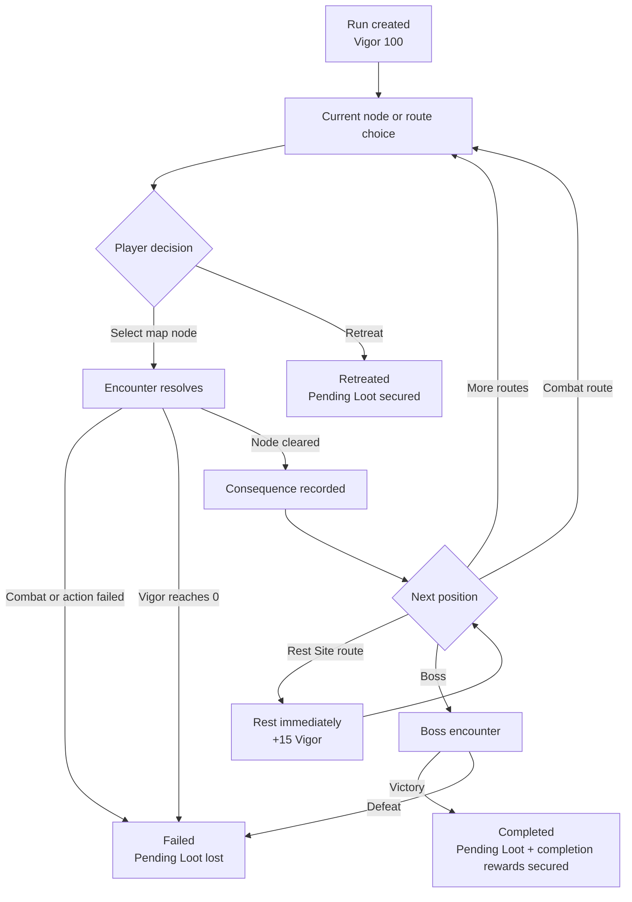
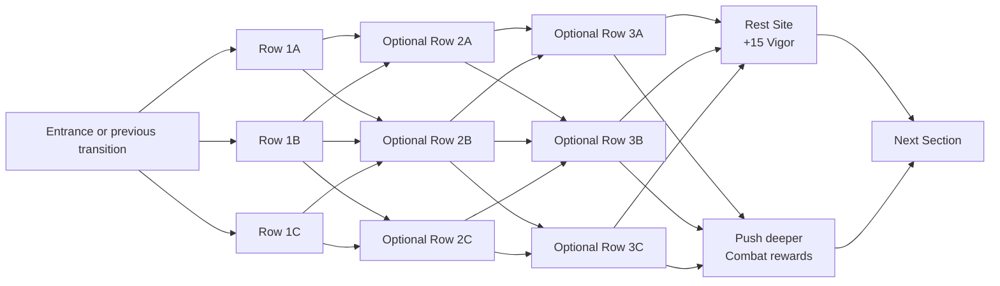

# Legends Legacy Dungeons

## Product Specification, Current Implementation, and Roadmap

**Status date:** 2026-07-20  
**Purpose:** Self-contained context for continuing dungeon development in a new Codex chat  
**Target application:** `LL/`  
**Primary services:** `LL/src/API/API.LL`, `LL/src/Core`, `LL/src/Infrastructure`, and `LL/src/Presentation/ll`

---

## 1. How to Use This Document

This document is the current source of truth for the dungeon run experience. It combines:

1. What dungeons are intended to become.
2. Product decisions made after the original dungeon design document.
3. What is implemented in the current worktree.
4. What remains partial or missing.
5. The recommended order for future implementation.
6. The important code, contracts, tests, and migration context.

When this document disagrees with the original _Dungeon Run Experience, Game Design Document v1.0_, this document wins.

The original document's **Phase 0 — Inspection**, **Phase 1 — Preparation**, and all statements about how long a dungeon or combat should take are intentionally excluded. This specification begins when a run is created.

Recommended prompt for a new chat:

> Read `docs/dungeon-run-experience-implementation-status.md` completely and treat it as the dungeon source of truth. Inspect the current worktree before editing, preserve existing changes, do not add legacy-run compatibility, and continue from the first unfinished roadmap item unless I specify another.

---

## 2. Finalized Product Decisions

These decisions are already made and should not be reopened accidentally.

| Topic                | Final decision                                                                                                                                    |
| -------------------- | ------------------------------------------------------------------------------------------------------------------------------------------------- |
| Run subdivisions     | Call them **Sections**, never Legs.                                                                                                               |
| Section count        | Dungeons can have different numbers of Sections. Three is not a universal rule.                                                                   |
| Section shape        | A Section contains one to three encounter rows, followed by an authored transition slot that may become a Rest-versus-Combat choice.             |
| Recovery nodes       | Use **Rest Sites**, never Wardstones or checkpoints.                                                                                              |
| Rest effect          | A Rest Site restores **15 Vigor**.                                                                                                                |
| Playable room scope  | Authored dungeons may contain only Entrance, Combat, MiniBoss, Rest Site, and Boss rooms. Hazard, Cache, Event, Elite, and Omen Site types have been removed. |
| Run modifiers        | Omens and Boss Aspects have been removed. Dungeon difficulty comes from authored encounters, Vigor attrition, and Vigor thresholds.                    |
| Safe exit            | A player can **Retreat & Secure Loot** at any active dungeon decision point. Retreat is not restricted to Rest Sites.                             |
| Rewards at risk      | Call them **Pending Loot**, never Pack, Run Loot, Unbanked Loot, or Unsecured Loot.                                                               |
| Route selection      | Players select an available route by clicking or tapping its map node. Do not restore the large choice overlay.                                   |
| Route automation     | The server must never automatically pick a branch.                                                                                                |
| Layout variation     | Each run uses its seed to select configured Rest Site slots, shuffle lanes, and regenerate safe adjacent-row connections. Sections, Depths, and Boss placement remain authored. |
| Map progression      | The map automatically scrolls as the run advances.                                                                                                |
| Node visibility      | Cleared nodes, the current node, and available choices are opaque. Unreached nodes remain subdued.                                                |
| Node colors          | Revealed nodes use the same semantic colors as the map legend.                                                                                    |
| Vigor color          | Low Vigor is red; high Vigor is green.                                                                                                            |
| Threshold UI         | Show the current Vigor threshold by default. Reveal all thresholds through hover, focus, or an explicit help/expand control.                      |
| Progress language    | Use authored **Depth X of Y** for graph position and **Section X of Y** for Section progress. Do not mix graph nodes with depths.                 |
| Legacy compatibility | There is no production dungeon data. Do not preserve or translate legacy dungeon runs, checkpoint state, old JSON field names, or old enum names. |

### Terms that must not return

- Leg.
- Wardstone.
- Checkpoint.
- Pack, when referring to rewards.
- Unbanked Run Loot.
- Unsecured Loot.
- Abandon Run as a distinct loss-producing player action.
- Extract only at a checkpoint.
- Fixed three-Section dungeon structure.

The word `Pack` may still exist in unrelated combat terminology such as an enemy pack. It must not describe dungeon rewards.

---

## 3. Product Vision

A dungeon is a short, authored expedition with a visible branching map, persistent Vigor attrition, combat encounters of different difficulty, and Pending Loot that remains at risk until completion or retreat.

The player should:

1. Read the available routes.
2. Compare their Vigor costs and encounter difficulty.
3. Select a node directly on the map.
4. Resolve an automated combat or authored non-combat encounter.
5. See exactly what changed.
6. Decide whether to push through an optional Combat route, take an available Rest Site, or retreat and secure Pending Loot.
7. Reach and defeat the final Boss.

The system is server-authoritative. The browser presents state and decisions; it does not own run progression.

### Design goals

- **Decisions happen between fights.** Dungeon combat remains automated.
- **Vigor makes costly victories matter.** Battle HP and cooldowns may reset, but Vigor persists.
- **Routes present honest tradeoffs.** The immediate Vigor cost, encounter type, and likely rewards should be visible before selection.
- **Different builds prefer different paths.** There should not be one universally correct route.
- **Failure is understandable.** The game should explain whether the run failed because of Vigor, party readiness, composition, or raw combat performance.
- **Runs are interruptible.** Refreshing or leaving the page must not silently advance or destroy a run.
- **New dungeons are data-driven.** New content should use the shared framework instead of requiring bespoke dungeon services.

### Non-goals

Dungeons are not:

- Procedural mazes.
- Endless modes.
- Roguelikes with a temporary upgrade after every node.
- Deckbuilders or tactical combat modes.
- A second dungeon currency economy.
- Fully automatic chains that choose routes for the player.
- A replacement for Rifts, raids, or other long-form combat modes.

---

## 4. Required Run Lifecycle

The run lifecycle starts after entry has already been confirmed.



### Run statuses

- `Active`
- `Completed`
- `Failed`
- `Retreated`
- `RewardsClaimed`

There is no dungeon `Abandoned` status in the intended model.

### Active decision points

The player can retreat whenever an active run is waiting for input, including:

- A route choice.
- A combat-node start decision.
- A Rest-versus-Combat route choice before either option resolves.
- A boss start decision.

Retreat during a server-side combat resolution is not required. Once combat has resolved and the run is waiting again, retreat must be available.

---

## 5. Dungeon Geography and Section Grammar

### Core rules

- Every dungeon has one Entrance.
- Every dungeon has one or more Sections.
- Section numbers are consecutive and start at 1.
- A dungeon chooses its own total Section count.
- Every dungeon has one terminal Boss.
- There is no backtracking.
- Every authored node must be reachable from the Entrance.
- Every non-terminal node must be able to reach the Boss.
- An individual node can connect to no more than three following nodes.
- Routes must reconverge; branches do not create independent dungeon endings.

### One Section

A Section is authored using this grammar:

1. The Entrance or previous Section transition feeds the Section.
2. The first encounter row contains one to three nodes.
3. A second encounter row may contain one to three nodes.
4. A third encounter row may contain one to three nodes.
5. The Section ends at an authored transition slot.
6. When that slot is activated by the dungeon's `restSiteCount`, it becomes a Rest-versus-Combat row whose paths reconverge immediately afterward.
7. The Rest route restores 15 Vigor and grants no combat rewards; the Combat route risks Vigor for another encounter's rewards.

The final Section transition may lead into a fixed boss approach and then the Boss.



Sections may contain one, two, or three encounter rows. Rows do not need to contain the maximum number of nodes.

### Seeded runtime variation

When a run is created:

1. Combat-only rows use their authored nodes as a candidate pool. Two-node rows resolve to one node 20% of the time and two nodes 80% of the time; rows with three candidates resolve to one, two, or three nodes with 15%, 55%, and 30% weights respectively.
2. The family-level `restSiteCount` selects that many authored Rest Site slots using the run seed.
3. Each selected slot keeps its Rest Site and gains a Combat sibling; each unselected slot becomes Combat-only.
4. Encounter nodes within each multi-node Depth row are shuffled among that row's authored lane values.
5. Connections are cleared and regenerated between each pair of adjacent Depth rows.
6. Every route entering a Rest-versus-Combat row can select either option, and both options expose the same following row.
7. Other multi-node rows guarantee at least one exit per source and one entrance per target, with controlled extra connections.
8. Generated connections never skip a Depth, backtrack, exceed three exits, create an unreachable node, or create a node that cannot reach the Boss.

The run seed fully determines this result. Generated `MapNodes` are persisted, so refresh and resume retain the exact same layout.

### Depth versus room count

- `Depth` is a horizontal graph column.
- Multiple nodes can share one Depth.
- `TotalRooms` in the run DTO currently represents distinct authored Depths when a graph exists.
- Global navigation and the dungeon header should report `Depth X of Y`.
- The sidebar can separately report the number of cleared rooms.

---

## 6. Encounter Taxonomy

The engine supports only Entrance, Combat, MiniBoss, Rest Site, and Boss. Removed room types have no enum values, runtime branches, DTO contracts, icons, or authored data.

| Room type  | Intended purpose                                                                          | Current implementation                                                             |
| ---------- | ----------------------------------------------------------------------------------------- | ---------------------------------------------------------------------------------- |
| `Entrance` | Starting node and first route origin.                                                     | Implemented.                                                                       |
| `Combat`   | Standard automated encounter and baseline Vigor toll.                                     | Implemented and used in all live maps.                                             |
| `MiniBoss` | Named, more demanding combat encounter.                                                   | Implemented; individual dungeons may omit it.                                      |
| `RestSite` | Optional route that restores 15 Vigor instead of granting another Combat reward.          | Implemented through dungeon-configured seeded Rest Site slots.                     |
| `Boss`     | Final automated encounter.                                                                | Implemented.                                                                       |

### Encounter authoring rules

- Costs and consequences must be visible before committing.
- A MiniBoss must be clearly named and forecast as a more demanding encounter.
- The first-authored creature in each MiniBoss and Boss composition is the featured monster. Only that monster uses 10x Essence drop chance, 1000x failed-roll resonance gain, and 10x the normal resonance drop-chance cap; supporting monsters use standard values.
- A Rest Site does not offer boons, extraction locks, or checkpoint choices.
- Any future room type requires a new product decision and a new end-to-end implementation; there is no dormant compatibility engine to reactivate.

---

## 7. Vigor

### Product rule

Vigor is a party-wide persistent run resource from 0 to 100.

- Runs begin at 100.
- Vigor is clamped to 0–100.
- Vigor changes only at visible encounter-resolution breakpoints.
- Reaching 0 fails the run and loses Pending Loot.
- Rest Sites restore 15 Vigor.
- Vigor must be costly enough that reaching 0 is a credible outcome on a poorly played or greedy route.
- The system should still reward clean combat and informed routing.

### Current combat toll

Each combat-capable authored node supplies `VigorCostMin` and `VigorCostMax`.

```text
damagePercent =
    total party damage taken / total party maximum health

performanceToll =
    interpolate from authored minimum to authored maximum
    using clamped damagePercent from 0% to 100%

rawCombatToll =
    authored minimum
    + performanceToll
    + 6 per downed party member

scaledCombatToll = round(rawCombatToll × 0.85)

final combat toll =
    clamp(scaledCombatToll, 0, 35)
```

Fallback authored range when authored data is absent:

- Minimum: 12.
- Maximum: 22.

The 15% combat-toll reduction is also applied to route forecasts, so the UI remains aligned with the server calculation. The fallback range is effectively 10–19 Vigor before downed-member modifiers.

Damage taken may exceed total maximum health when healing extends a fight, but the interpolation input is currently clamped at 100%.

### Other Vigor changes

- Rest Site recovery: +15.
- Every change records:
  - Room index.
  - Actual amount after clamping.
  - Vigor after the change.
  - Reason.

### Current threshold contract

| Tier | State       |  Range | Effect                                                                  |
| ---- | ----------- | -----: | ----------------------------------------------------------------------- |
| All  | `Steady`    | 41–100 | No Vigor penalty.                                                       |
| I–II | `Strained`  |  26–40 | Displayed route Vigor forecasts widen by 2.                             |
| III  | `Strained`  |  31–40 | Displayed route Vigor forecasts widen by 2.                             |
| I–II | `Exhausted` |   1–25 | Party members enter combat at 90% maximum health; forecasts widen by 2. |
| III  | `Exhausted` |   1–30 | Party members enter combat at 90% maximum health; forecasts widen by 2. |
| All  | `Spent`     |      0 | Run fails at the current breakpoint and Pending Loot is lost.           |

The API returns the full threshold list and marks the current threshold. The frontend shows only the current threshold by default and provides an expandable reference.

### Vigor UX that should exist

- Always-visible red-to-green Vigor bar.
- Current value and state label.
- Current threshold summary.
- Expandable full threshold reference.
- Route-node Vigor forecast before selection.
- A projected/ghost segment on the bar for the selected route.
- A post-node animation explaining the exact Vigor change and its cause.
- A combat toll estimate while combat is resolving, if the combat pipeline can expose it safely.

The first four are implemented. The Vigor bar uses a fixed red-to-yellow-to-green scale and masks its depleted portion, so its visible endpoint reflects the current value instead of rescaling the gradient. The projected segment, consequence animation, and live toll estimate are not.

### Tuning goals

Exact numbers should be telemetry-driven, but the desired behavior is:

- Clean routes should preserve substantially more Vigor than bruising routes.
- A player who repeatedly takes high-cost routes and performs poorly can reach 0 before the Boss.
- Rest Sites help but do not erase all previous mistakes.
- Vigor-0 failures should be meaningful without becoming the dominant failure outcome.
- Boss losses should remain common enough that final encounters feel consequential.

---

## 8. Rest Sites and Retreat

### Rest Sites

- Replace the old Wardstone/checkpoint concept completely.
- Restore exactly 15 Vigor.
- Originate from authored transition slots selected up to the dungeon family's `restSiteCount`.
- Always appear beside a Combat alternative that grants normal encounter rewards.
- Are available from every incoming route to that transition row.
- Complete once used.
- Resolve immediately when selected and advance the run after resting.
- Count toward Section progress.
- Use the Rest semantic color and camp icon.
- Do not contain boon selection.
- Do not control whether retreat is allowed.

### Retreat

- Canonical server action: `retreat`.
- Resulting status: `Retreated`.
- Outcome: `RunRetreated`.
- Sets `UsedRetreat = true`.
- Secures the current Pending Loot.
- Clears the Pending Loot snapshot.
- Grants no boss or completion rewards.
- Allows the secured rewards to be claimed.

The frontend button text is **Retreat & Secure Loot**.

---

## 9. Pending Loot and Outcomes

### Terminology

Use:

- `PendingLoot`
- `LostPendingLoot`
- `SecuredLoot`
- `PendingExperience`
- `PendingCinders`
- `PendingSoulstones`
- `PendingRewards`

Do not introduce new DTO or UI names containing `Pack`, `RunLoot`, `UnsecuredLoot`, or `UnbankedLoot`.

### Outcome rules

| Outcome            | Pending Loot | Completion rewards | Run status  | Can claim rewards            |
| ------------------ | ------------ | ------------------ | ----------- | ---------------------------- |
| Boss defeated      | Secured      | Granted            | `Completed` | Yes                          |
| Retreat            | Secured      | Forfeit            | `Retreated` | Yes                          |
| Combat defeat      | Lost         | Forfeit            | `Failed`    | No                           |
| Vigor reaches 0    | Lost         | Forfeit            | `Failed`    | No                           |
| Run expires        | Lost         | Forfeit            | `Failed`    | No                           |
| Refresh/disconnect | Unchanged    | Unchanged          | Unchanged   | Not until completion/retreat |

There is no separate player-facing Abandon action that intentionally destroys Pending Loot. Retreat is the active-run exit.

### Current technical shape

Reward data currently exists in two related forms:

1. Scalar/entity state on `DungeonRun`:
   - `PendingExperience`
   - `PendingCinders`
   - `PendingSoulstones`
   - `PendingRewards`
2. Presentation snapshots in `DungeonRunState`:
   - `PendingLoot`
   - `SecuredLoot`

`CreateLootBagFromRun` synchronizes the snapshot from the scalar/entity state. This works but creates two representations that must stay synchronized. A future cleanup should either make the authoritative source explicit or encapsulate synchronization behind one domain method.

---

## 10. Route Choice and Information

### Required route card/node information

Every available route should expose:

- Display name.
- Room type.
- Vigor cost range.
- Forecast text.
- Relevant tags.
- Possible Pending Loot.
- Requirements or missing requirements.
- Whether information is uncertain.

### Selection behavior

- Available choices are map nodes.
- Clicking a valid choice sends `choose_route` with `routeOptionId`.
- A route choice should resolve only once.
- Unrelated actions are rejected while a route choice is pending.
- No automatic safe-route selection.
- No countdown that picks for the player.
- No central overlay covering the map.

### Visibility behavior

Currently:

- Rooms at or before the current Depth plus one Depth ahead are revealed.
- Future Rest Sites follow the same fog-of-war rule as Combat and MiniBoss rooms.
- The Boss remains visible; other future rooms are returned as `Unknown`.
- Available nodes are opaque and interactive.
- Unreached nodes are transparent/subdued.

Future Scout and knowledge systems should refine information without changing the direct-node interaction.

---

## 11. Removed Run Modifiers

Omens and Boss Aspects are outside the current simplified dungeon scope and their legacy implementation has been deleted.

### Current state

- Delve definitions cannot author Omens, Boss Aspects, or node-to-Aspect links because those fields no longer exist.
- Run state, DTOs, combat orchestration, dependency injection, and persistence contain no modifier compatibility fields.
- The expedition sidebar ends after the current Vigor threshold; Pending Loot is the next section.
- Reintroducing either system would require a new schema and implementation rather than reviving dormant branches.

---

## 12. Boss Encounter

The Boss is a direct final automated encounter. It does not currently receive route-shaped Boss Aspects or a separate Boss Gate.

Before starting the Boss, the existing map node communicates:

- Boss name.
- Encounter type.
- Authored Vigor forecast.
- The option to enter combat by selecting the node.

Retreat remains available because there is no lock-in extraction rule.

---

## 13. Companion Expedition Layer

This is a desired system and is not implemented yet.

Each companion should contribute:

1. Their existing combat role and kit.
2. One expedition tag.

### Expedition tags

| Tag       | Intended effect                                                                   |
| --------- | --------------------------------------------------------------------------------- |
| `Scout`   | Exact or tighter route forecasts and better information.                          |
| `Medic`   | Small post-combat Vigor recovery and stronger treatment options.                  |
| `Warden`  | Negates or reduces environmental hazard tolls and dungeon-family debuffs.         |
| `Breaker` | Improves authored Elite or MiniBoss interactions.                                 |

Rules:

- Multiple companions must share each tag.
- Content checks a tag, never a specific companion name.
- Every route has a tagless resolution.
- Tags improve efficiency, information, or strategic options; they do not hard-lock completion.
- Tag effects and resulting Vigor changes must appear directly on route/event choices.

### Point member

Desired behavior:

- One expedition member can be marked Point.
- Point amplifies or specializes that member's tag.
- Point can affect who is targeted by authored events.
- Reassignment should be lightweight.
- Because Rest Sites no longer own all strategic choices, Point reassignment should either be allowed at any Rest Site or through a dedicated party-state control. It must not reintroduce checkpoint boons.

### Wounded and Out

Desired behavior:

- A companion downed in a won combat becomes `Wounded`.
- Wounded applies a clear effectiveness penalty and suspends the companion's expedition tag.
- A Wounded companion downed again becomes `Out`.
- Out companions do not participate for the rest of the run.
- Medic/event treatment can clear Wounded when explicitly authored.
- These states persist in the run and appear in forecasts, the sidebar, results, and failure analysis.

Current implementation only adds 6 Vigor loss for each downed party member. It does not persist Wounded or Out.

---

## 14. Removed Events, Omen Sites, Hazards, and Caches

These concepts are not part of the current playable dungeon scope. Their former enums, services, action IDs, DTOs, UI icons, content files, persistence fields, and prophecy objective have been removed. Any future version must be designed and implemented cleanly from the current model.

### Events

Every Event should:

- Belong to the dungeon's fiction.
- Present at least two meaningful choices.
- Display numeric costs and benefits.
- Use Vigor, Pending Loot, expedition tags, flags, routes, combat, or Wounds.
- Avoid a universally correct free-reward choice.
- Resolve server-side and persist its result.

No event engine or authored event catalog remains.

### Omen Sites

An Omen Site would need a newly approved purpose and a new implementation before returning.

### Caches

No Cache room behavior remains.

Desired variants:

- Unguarded pickup.
- Guarded combat.
- Trapped Vigor cost.
- Tag-resolved interaction.
- Optional Cache that can be skipped.

Every Cache should sharpen the decision between continuing with more Pending Loot at risk and retreating safely.

---

## 15. Combat in a Dungeon

### Required behavior

- Combat remains server-authoritative and automated.
- Selecting a combat node prepares or begins the standard dungeon combat flow.
- Vigor threshold effects are applied before combat.
- Victory:
  - Applies the combat Vigor toll.
  - Adds Pending Loot.
  - Updates Wounds when implemented.
  - Completes the node.
  - Advances or generates the next route choice.
- Defeat:
  - Fails the run.
  - Clears Pending Loot.
  - Records failure analysis.
- The run never auto-selects the next branch after combat.
- Leaving the page does not cancel server-side resolution.

### Current state

- Standard dungeon combat orchestration is integrated.
- Exhausted starts party members at 90% maximum health.
- Combat result statistics drive the Vigor toll.
- The frontend hands off to the existing combat viewer.
- Live toll estimation, Wounded/Out persistence, and fully verified mid-combat resume are missing.

---

## 16. Failure, Results, and Guidance

### Required failure analysis

Every failed run should answer:

1. Where did the run end?
2. What was the primary cause?
3. What evidence supports that cause?
4. What two concrete changes could improve the next attempt?
5. What Pending Loot was lost?

Desired cause categories:

- `Stat Gap`
- `Attrition`
- `Composition`
- `Combat Readiness`
- `Route Decision`

Potential evidence:

- Party power versus the dungeon's tier band.
- Vigor and threshold on entry.
- Damage absorbed by shields or summons.
- Party damage margins.
- Wounded or Out companions.
- Tagless hazard tolls paid earlier.
- Remaining route opportunities.

### Current failure result

The current model displays:

- Final location.
- Section.
- Broad primary cause.
- Explanation.
- Two static suggestions.
- Final Vigor.
- Rooms cleared.
- Lost Pending Loot currencies and items.
- Return-to-world action.

Current causes are broad and heuristic depth is limited.

### Required completion/retreat result

Dedicated result presentation should eventually include:

- Completed or Retreated outcome.
- Route taken.
- Sections and rooms cleared.
- Final Vigor.
- Vigor curve.
- Pending Loot secured.
- Completion rewards, when applicable.
- Mastery award breakdown.
- Wounded/Out summary.
- Per-dungeon records or notable bests.

Reward claiming works, but this result presentation is not implemented.

---

## 17. Persistence, Resume, and Expiry

### Required behavior

- Run state is persisted server-side.
- Refreshing restores the same node and decision state.
- No branch is chosen during a disconnect.
- A resolving combat can be rejoined or its result shown on return.
- The last consequence remains available for context.
- Active runs have a clear Resume Dungeon entry point.
- Expired runs become Failed and lose Pending Loot.
- Players receive warnings before expiry once notification infrastructure exists.

### Current behavior

- `DungeonRunState` is persisted as JSONB.
- Active runs are restored through `GetActiveDungeon`.
- Route and Event choices persist.
- Runs store `ExpiresAt`.
- Expiry is evaluated when the player submits a dungeon action.
- Expired runs fail and lose Pending Loot.

Missing:

- Background or load-time expiry conversion.
- Warning notifications.
- Dedicated resume banner.
- Replay of the last consequence.
- Verified combat rejoin behavior.

---

## 18. Active Dungeon UI

The active dungeon screen should follow the established Legends Legacy design system.

### Map

- Horizontal authored graph.
- Automatic scroll toward current progression.
- Entrance, encounter, Rest Site, and Boss nodes.
- Semantic node colors matching the legend.
- Opaque cleared/current/available nodes.
- Subdued unreached nodes.
- Highlighted available edges.
- Direct node selection.
- No route-choice overlay covering the graph.

### Header

- Dungeon name.
- `Depth X of Y`.
- `Section X of Y`.
- Current node/status note.

### Expedition sidebar

- Vigor value, state, and red-to-green bar.
- Current threshold.
- Expandable threshold reference.
- Current Section and total Sections.
- Cleared rooms.
- Pending Loot.
- Bottom warning that Pending Loot is lost on failure.
- **Retreat & Secure Loot** action inside that warning while the run is actively waiting for input. It must not share the combat summary's **Close Summary** screen position.

### Encounter panel

- Current node name and type.
- Clear action label.
- Forecast and Vigor cost.
- Rest action at Rest Sites.
- Boss readiness information before the Boss.

### Current implementation

The seeded map variation, scrolling, node states, semantic colors, direct node selection, Vigor UI, threshold expansion, Section progress, Pending Loot, Rest Site action, retreat button, combat handoff, invalid-map recovery, and failure screen are implemented.

The consequence strip, projected toll, companion state, richer success/retreat results, and live toll feedback are missing.

---

## 19. Tier Scaling and Replayability

### Current implemented tier differences

- Existing enemy and reward scaling from dungeon definitions.
- Tier III Exhausted threshold begins at 30 instead of 25.

### Desired future tier differences

| Dimension | Tier I                                                      | Tier II                                          | Tier III                                                   |
| --------- | ----------------------------------------------------------- | ------------------------------------------------ | ---------------------------------------------------------- |
| Learning  | More complete information and forgiving consequences.       | Baseline authored experience.                    | Tighter information and more interacting pressure.         |
| Routes    | Forgiving authored costs.                                   | Baseline.                                        | Controlled authored variance, never procedural generation. |
| Elites    | Fewer.                                                      | Baseline.                                        | More or stronger Elite formations.                         |
| Vigor     | More forgiving authored costs.                              | Baseline.                                        | Tighter authored costs and Exhausted at 30.                |

Rest Sites currently restore 15 at all tiers. Do not reintroduce tier-specific Rest Site recovery unless a new balancing decision is made.

### Replayability principles

- The authored Section/Depth structure and encounter roster are learnable.
- Tier, build, party tags, combat performance, and Pending Loot reprioritize routes.
- Each run deterministically shuffles encounter lanes and selects safe connections between adjacent rows from its seed.
- Every generated node remains reachable from the Entrance and able to reach the Boss.
- Controlled variance must not change Section count, the configured Rest Site count, or Boss placement. The seed may select among authored Rest Site slots.
- New combat formations and authored route layouts are the cheapest content-refresh tools.
- No route should become correct for every build.

---

## 20. Dungeon Authoring Contract

A dungeon definition should eventually describe:

| Field                  | Purpose                                                      |
| ---------------------- | ------------------------------------------------------------ |
| Fantasy and region     | Place, threat, and world grounding.                          |
| Primary test           | Main strategic or statistical challenge.                     |
| Secondary test         | Additional pressure.                                         |
| Enemy family           | Signature mechanics and damage profile.                      |
| Core hazard            | Environmental Vigor pressure and tag interactions.           |
| Attrition profile      | Expected split between combat, hazard, and event Vigor loss. |
| Section count          | Authored number of Sections.                                 |
| Section graph          | One to three encounter rows, then a transition slot.         |
| Rest Site count        | Family-level number of transition slots activated per run.   |
| Encounter nodes        | Room types, depths, lanes, routes, costs, tags, and rewards. |
| MiniBoss function      | Named, more demanding combat encounter.                      |
| Useful expedition tags | Scout, Medic, Warden, and Breaker interactions.              |
| Tier deltas            | Authored differences per tier.                               |
| Telegraphing           | Forecasts, bestiary text, and failure explanations.          |

### Current JSON node fields

- `id`
- `displayName`
- `roomType`
- `depth`
- `lane` (authored row slot; encounter nodes are shuffled among the row's slots per run)
- `section`
- `nextRoomIndexes` (authored validation graph; runtime edges are regenerated between adjacent Depth rows)
- `forecast`
- `vigorCostMin`
- `vigorCostMax`
- `tags`

### Required validation

- Unique IDs.
- Exactly one Entrance.
- Exactly one terminal Boss.
- Consecutive Sections.
- Consecutive Depths beginning at zero.
- One authored Rest Site candidate slot per Section under the current grammar.
- `restSiteCount` is required, non-negative, and cannot exceed the delve's candidate-slot count.
- Each activated Rest Site row also contains a Combat alternative.
- Every incoming route can reach both choices, and both choices expose the same following row.
- One to three encounter rows per Section.
- One to three nodes per row.
- Unique lanes within each Depth row.
- No node branches to more than three nodes.
- No backtracking.
- All route references point to existing nodes.
- Every node is reachable from the Entrance.
- Every node can reach the Boss.
- Omen pools, Boss Aspect definitions, and node-to-Aspect links are rejected.
- Every node uses one of the currently allowed playable room types.
- Expected Vigor pressure is simulated before content ships.

---

## 21. Current Live Dungeon Content

The current authored layouts and configured recovery counts are:

| Dungeon family       | Authored nodes | Depths | Sections | Rest slots | Active Rest Sites | Base Combat | MiniBoss | Boss |
| -------------------- | -------------: | -----: | -------: | ---------: | ----------------: | ----------: | -------: | ---: |
| Goblin Mines         |             22 |     12 |        3 |          3 |                 2 |          17 |        0 |    1 |
| Forgotten Catacombs  |             19 |     10 |        2 |          2 |                 1 |          14 |        1 |    1 |
| Hives Abyss          |             25 |     14 |        4 |          4 |                 3 |          18 |        1 |    1 |

Each dungeon family reuses the same authored node roster, Depth skeleton, Section structure, and `restSiteCount` across tiers through prefix matching. On every new run, the seed selects the configured number of candidate slots, adds one Combat alternative beside every active Rest Site, converts unused slots to Combat, shuffles eligible lanes, and regenerates connections between adjacent Depth rows. The Boss remains a fixed anchor.

Every live dungeon now contains one mandatory three-row Section:

- Goblin Mines Section 2.
- Forgotten Catacombs Section 2.
- Hives Abyss Section 3.

### Current Vigor ranges

- Goblin Mines:
  - Effective Combat forecast commonly 9–21.
  - Effective MiniBoss forecast 14–24.
  - Effective Boss forecast 15–27.
- Forgotten Catacombs:
  - Effective Combat forecast commonly 9–21.
  - Effective MiniBoss forecast 14–25.
  - Effective Boss forecast 15–27.
- Hives Abyss:
  - Effective Combat forecast commonly 9–24.
  - Effective MiniBoss forecast 14–26.
  - Effective Boss forecast 17–29.

These ranges intentionally make Vigor 0 possible when expensive routes are combined with poor combat performance.

---

## 22. Current Implementation Architecture

### Domain

- `DungeonDefinition`
- `DungeonDelveDefinition`
- `DungeonRun`
- `DungeonRunState`
- `DungeonMapNode`
- `RoomInstance`
- `RoomType`
- `DungeonActionOutcome`
- `DungeonRunStatus`

### Application contracts

Dungeon DTOs follow the repository mapping convention:

- Implement `IMapFrom<T>`.
- Provide a `Mapping(Profile profile)` method.
- Use explicit mapping only when projection behavior differs from a direct map.

Important DTOs:

- `DungeonRunDto`
- `DungeonRunStateDto`
- `DungeonMapNodeDto`
- `DungeonRouteOptionDto`
- `DungeonVigorThresholdDto`
- `DungeonVigorChangeDto`
- `DungeonFailureAnalysisDto`
- `ExecuteDungeonActionResponseDto`

### Services

- `DungeonRunFactory`: creates state and rooms, then applies seeded lane/connection variation to the authored Section skeleton.
- `DungeonRunService`: owns run actions and progression.
- `DungeonVigorService`: Vigor loss, recovery, state, and history.
- `DungeonRouteService`: route forecasts and pending choices.
- `JsonDungeonDelveDefinitionProvider`: loads and validates authored layouts.
- `DungeonRunRewardClaimer`: claims completed or retreated rewards.

The old checkpoint interface and service were removed.

### API

- `GET Dungeon/GetActiveDungeon`
- `GET Dungeon/GetAvailableDungeons`
- `GET Dungeon/GetDungeonRecords/{familyId}`
- `POST Dungeon/{dungeonId}/assemble-sigil`
- `POST Dungeon/StartDungeon`
- `POST Dungeon/ExecuteAction/{runId}`
- `POST Dungeon/ClaimDungeonRewards`
- `POST Dungeon/DismissFailedDungeonRun`

### Current action IDs

| Action         | Payload             | Purpose                                                                             |
| -------------- | ------------------- | ----------------------------------------------------------------------------------- |
| `fight`        | None                | Resolve a combat-capable current room.                                              |
| `choose_route` | `{ routeOptionId }` | Select an available map node.                                                       |
| `retreat`      | None                | Secure Pending Loot and end the run as Retreated.                                   |
| `rest`         | None                | Canonical Rest Site action used by the frontend.                                    |

---

## 23. Implementation Audit

| Capability                    | Required end state                                | Current state                                 | Status                       |
| ----------------------------- | ------------------------------------------------- | --------------------------------------------- | ---------------------------- |
| Server-authoritative run      | All progression and outcomes owned by server      | Implemented                                   | Implemented                  |
| Variable Sections             | Per-dungeon Section count                         | 2, 3, and 4 Section layouts live              | Implemented                  |
| Up to three choices per row   | Authored one-to-three-node rows                   | Implemented and validated                     | Implemented                  |
| Rest Sites                    | Configured optional +15 route versus Combat rewards | Seeded count and paired Combat choice implemented | Implemented               |
| Retreat anywhere              | Secure Pending Loot at active decisions           | Backend and active-page button implemented    | Implemented                  |
| Direct node selection         | Tap available node                                | Implemented                                   | Implemented                  |
| Map auto-scroll               | Follow current progression                        | Implemented                                   | Implemented                  |
| Seeded layout variation       | Vary lanes/routes without invalid graphs          | Deterministic lane and adjacent-row edge generation | Implemented              |
| Node opacity/colors           | Cleared/current/available visible; future subdued | Implemented                                   | Implemented                  |
| Depth and Section progress    | Correct distinct concepts                         | Implemented                                   | Implemented                  |
| Vigor history                 | Persist amount, result, and reason                | Implemented                                   | Implemented                  |
| Vigor thresholds              | Backend contract and expandable UI                | Implemented                                   | Implemented                  |
| Vigor economy                 | Reaching 0 must remain credible                   | Authored ranges use a 15% combat-toll reduction | Implemented; needs telemetry |
| Pending Loot terminology      | Consistent domain/DTO/UI wording                  | Implemented in dungeon system                 | Implemented                  |
| Completion and retreat claims | Correct claimable rewards                         | Implemented                                   | Implemented                  |
| Omens                         | Outside current simplified dungeon scope          | Removed from content, runtime, DTOs, and UI    | Removed                      |
| Boss Aspects                  | Outside current simplified dungeon scope          | Removed from content, runtime, DTOs, and UI    | Removed                      |
| Elite room type               | Outside current simplified dungeon scope          | Removed; named Combat rooms provide variation  | Removed                      |
| Events                        | Outside current simplified dungeon scope          | Removed end-to-end                             | Removed                      |
| Omen Sites                    | Outside current simplified dungeon scope          | Removed end-to-end                             | Removed                      |
| Companion tags                | Scout/Medic/Warden/Breaker                        | Not implemented                               | Missing                      |
| Point member                  | Lightweight expedition stance                     | Not implemented                               | Missing                      |
| Wounded/Out                   | Persistent companion consequences                 | Only downed-member Vigor toll exists          | Missing                      |
| Consequence strip             | Explain every result before continuing            | State message exists; rich UI missing         | Partial                      |
| Live/projected toll           | Show likely/accruing Vigor                        | Route ranges exist; projected/live UI missing | Partial                      |
| Boss Gate                     | Outside current simplified dungeon scope          | Direct Boss-node selection is implemented      | Deferred                     |
| Failure intelligence          | Evidence-ranked causes                            | Broad static analysis implemented             | Partial                      |
| Completion/retreat results    | Dedicated summary and Vigor curve                 | Basic post-claim reward summary implemented   | Partial                      |
| Resume experience             | Clear resume and restored context                 | Persistence exists; dedicated UX missing      | Partial                      |
| Automatic expiry              | Background/load-time failure and warnings         | Action-time expiry only                       | Partial                      |
| Knowledge progression         | Persistent discovered routes                      | Not implemented                               | Missing                      |
| Controlled Tier variance      | Authored higher-tier changes                      | Enemy/reward scaling and Vigor threshold vary | Partial                      |
| Telemetry                     | Route/Vigor/failure/retreat metrics               | Not implemented as a complete system          | Missing                      |

---

## 24. Known Technical and Product Gaps

1. Pending rewards exist both as `DungeonRun` scalar/entity fields and as a state snapshot.
2. Elite has a domain enum but live authored Elites are still `Combat` nodes with an `Elite` tag.
3. Route forecasts are not Scout-, tag-, or knowledge-aware.
4. Downed members affect Vigor but do not become Wounded or Out.
5. The rich consequence strip and Vigor projection are missing.
6. Failure suggestions are broad and static.
7. Completion and retreat have a basic claimed-reward summary, but still lack route, Section, Vigor-curve, and mastery details.
8. Expiry is only processed on the next action.
9. Combat rejoin has not been verified end to end.
10. There is no account-wide dungeon knowledge model.
11. There is no complete dungeon-specific telemetry.

---

## 25. Recommended Progression

The order below minimizes rework and produces useful vertical slices.

### Next 1 — Harden the current foundation

Goal: make the Rest Site/retreat/Vigor foundation difficult to regress.

Work:

- Add service-level integration tests for:
  - Retreat while a route choice is pending.
  - Retreat at each supported room decision.
  - Securing currencies and items.
  - Forfeiting completion rewards.
  - Rest Site +15 recovery, one-click route resolution, greedy Combat alternative, and Section advancement on either path.
  - Vigor reaching 0 from standard, Miniboss, and Boss combat resolution.
- Assert all live definitions pass graph validation.
- Add a test that no dungeon source/DTO/UI field reintroduces checkpoint or reward legacy terminology.
- Run the complete relevant dungeon test suite.

Acceptance criteria:

- Retreat and Rest Site behavior have direct automated coverage.
- `rest` is canonical.
- No legacy dungeon compatibility code is introduced.

### Next 2 — Consequence and Vigor feedback

Goal: make the new, harsher Vigor economy understandable.

Work:

- Return a structured consequence object instead of relying only on `LastConsequence`.
- Include Vigor before/after, exact cause, Pending Loot delta, and companion delta placeholders.
- Add the post-node consequence strip.
- Add a projected Vigor segment for hovered/selected routes.
- Make the consequence visible after refresh.
- Investigate a safe combat toll estimate from live combat statistics.

Acceptance criteria:

- Every resolved node visibly explains why Vigor and Pending Loot changed.
- Players can compare projected route cost against current Vigor before selecting.

### Next 3 — Companion expedition state

Goal: establish the data model before authoring tag-dependent content.

Work:

- Add companion expedition snapshots to `DungeonRunState`.
- Add tag enum/value model: Scout, Medic, Warden, Breaker.
- Add Point member state.
- Add Wounded and Out state.
- Apply downed-member transitions after combat.
- Surface companion state through `IMapFrom` DTOs.
- Display party condition in the sidebar.

Acceptance criteria:

- Companion state persists across refresh.
- Wounded suspends a tag.
- A second down transitions Wounded to Out.
- Existing combat remains functional without tags.

### Next 4 — Tag-aware choices and Vigor

Goal: make party selection materially affect route strategy.

Work:

- Scout tightens forecasts and reveals information.
- Medic applies authored post-combat recovery and treatment interactions.
- Warden reduces an authored subset of combat Vigor tolls.
- Breaker improves authored MiniBoss or Boss combat interactions.
- Point amplifies a defined subset of tag behavior.
- Add explicit tagless fallback combat routes.
- Show resolved tag effects on combat route choices.

Acceptance criteria:

- At least one live dungeon contains meaningful uses for all four tags.
- No route is impossible without a tag.
- Forecasts accurately reflect the current expedition.

### Deferred slice — Events, Omen Sites, Hazards, and Caches

This slice is not part of the active roadmap. No engine scaffolding remains; these concepts require a new end-to-end design if the simplified combat-only direction is explicitly revisited.

### Deferred slice — Omens, Boss Aspects, and Boss Gate

These modifier systems are not part of the active roadmap. Their former model, DTO, runtime, and content scaffolding has been removed; reintroduction requires a new design.

### Next 7 — Results and failure intelligence

Goal: make outcomes teach the player.

Work:

- Expand the basic Completed and Retreated reward summary into the full result experience.
- Show route, Sections, Vigor curve, secured rewards, and mastery.
- Capture evidence for failure analysis.
- Rank causes.
- Generate two specific suggestions.
- Show per-dungeon records where supported.

Acceptance criteria:

- A player can tell whether the failure was Vigor, stats, route, or composition.
- Completion and retreat have clear, distinct reward summaries.

### Next 8 — Tier depth, knowledge, and replayability

Goal: make mastery transfer upward without turning maps procedural.

Work:

- Tier-III controlled authored variation.
- Tier-III Elite/route pressure.
- Account-wide route knowledge.
- Bestiary integration.

Acceptance criteria:

- Higher tiers feel mechanically tighter, not merely numerically larger.
- The authored structure remains recognizable while each run offers a different valid route graph.

### Next 9 — Resume, expiry, and telemetry

Goal: make the system production-observable and resilient.

Work:

- Process expiry on load and/or in a background job.
- Add expiry warnings.
- Add first-class Resume Dungeon UI.
- Verify combat rejoin.
- Record route picks, Vigor curves, retreat points, failure causes, tag usage, and result outcomes.

Acceptance criteria:

- No expired run remains deceptively Active.
- Interrupted runs resume with complete context.
- Designers can identify dominant routes and unhealthy Vigor tuning.

---

## 26. Balance and Telemetry Questions

These are tuning questions, not reasons to delay the core implementation.

Track:

- Success rate by dungeon and tier.
- Failure cause distribution.
- Vigor at every node and at the Boss.
- Vigor-0 failure share.
- Retreat rate and retreat Depth.
- Pending Loot secured by retreat.
- Route pick rate split by build and expedition tags.
- MiniBoss participation rate.
- Companion/tag concentration.
- Resume and expiry rates.

Healthy directional targets:

- No route option should be nearly unused across all builds.
- Retreat should be meaningful but not the dominant outcome.
- Vigor 0 should be possible and visible, not surprising or overwhelmingly common.
- Boss failures should still matter.
- Strong play should preserve noticeably more Vigor.
- No single companion lineup should become mandatory.

---

## 27. Risks and Guardrails

| Risk                              | Guardrail                                                                                 |
| --------------------------------- | ----------------------------------------------------------------------------------------- |
| Vigor is irrelevant               | High-value routes and poor combat must create real attrition; monitor Vigor curves.       |
| Vigor snowballs unfairly          | Keep threshold penalties limited, show costs, fail at breakpoints, and preserve retreat.  |
| Rest Sites erase attrition        | Keep recovery fixed at 15, cap their configured count, and make each replace a Combat reward opportunity. |
| One route dominates               | Require each path to be correct for some build or Vigor state; track pick rates.          |
| Tags become mandatory keys        | Always author tagless resolutions.                                                        |
| Dungeons become automatic         | Never auto-pick combat routes.                                                             |
| Dungeons become random mazes      | Use authored controlled variance only.                                                    |
| UI hides the decision             | Keep choices on the map and avoid large overlays.                                         |
| Retreat becomes free completion   | Retreat secures Pending Loot but never grants completion rewards.                         |
| Terminology drifts                | Use Sections, Rest Sites, Retreated, and Pending Loot in domain, DTOs, data, and UI.      |

---

## 28. Primary Implementation Evidence

### Domain and application

- `LL/src/Core/Domain/Models/Dungeons/Definitions/DungeonDelveDefinition.cs`
- `LL/src/Core/Domain/Models/Dungeons/Definitions/Rooms/RoomType.cs`
- `LL/src/Core/Domain/Models/Dungeons/Runs/DungeonRun.cs`
- `LL/src/Core/Domain/Models/Dungeons/Runs/DungeonRunState.cs`
- `LL/src/Core/Domain/Models/Dungeons/Runs/DungeonRunStatus.cs`
- `LL/src/Core/Domain/Models/Dungeons/Runs/DungeonActionOutcome.cs`
- `LL/src/Core/Application/UseCases/Dungeons/Dtos/DungeonRunDto.cs`
- `LL/src/Core/Application/UseCases/Dungeons/Dtos/DungeonRunStateDto.cs`
- `LL/src/Core/Application/UseCases/Dungeons/Dtos/ExecuteDungeonActionResponseDto.cs`

### Backend services

- `LL/src/Infrastructure/Service/Services.LL/Dungeons/DungeonRunFactory.cs`
- `LL/src/Infrastructure/Service/Services.LL/Dungeons/DungeonRunService.cs`
- `LL/src/Infrastructure/Service/Services.LL/Dungeons/DungeonVigorService.cs`
- `LL/src/Infrastructure/Service/Services.LL/Dungeons/DungeonRouteService.cs`
- `LL/src/Infrastructure/Service/Services.LL/Dungeons/JsonDungeonDelveDefinitionProvider.cs`
- `LL/src/Infrastructure/Service/Services.LL/Combat/Layers/Rewards/Dungeon/DungeonRunRewardClaimer.cs`

### API and content

- `LL/src/API/API.LL/Controllers/V1/DungeonController.cs`
- `LL/src/API/API.LL/Data/dungeons/dungeon-delves.json`
- `LL/src/API/API.LL/Data/dungeons/dungeons.json`
- `LL/src/API/API.LL/Data/progression/dungeon-rewards.json`

### Frontend

- `LL/src/Presentation/ll/src/app/core/services/api/dungeon/dungeon.service.ts`
- `LL/src/Presentation/ll/src/app/core/services/api/dungeon/dungeon-state.service.ts`
- `LL/src/Presentation/ll/src/app/features/game/world/region/dungeons/dungeon-page/dungeon-page.component.ts`
- `LL/src/Presentation/ll/src/app/features/game/world/region/dungeons/dungeon-page/dungeon-page.component.html`
- `LL/src/Presentation/ll/src/app/features/game/world/region/dungeons/dungeon-page/dungeon-page.component.scss`
- `LL/src/Presentation/ll/src/app/shared/components/dungeons/dungeon-room-icon/dungeon-room-icon.component.html`
- `LL/src/Presentation/ll/src/app/shared/components/current-dungeon/current-dungeon.component.ts`

### Tests

- `LL/tests/EssenceSystem.Tests/DungeonVigorStateTests.cs`
- `LL/tests/EssenceSystem.Tests/DungeonDtoMappingTests.cs`
- `LL/tests/EssenceSystem.Tests/AchievementServiceTests.cs`
- `LL/tests/EssenceSystem.Tests/GameEventOutboxTests.cs`
- `LL/tests/EssenceSystem.Tests/SoulstoneConstellationDefinitionTests.cs`

---

## 29. Current Verification Baseline

The optional Rest Site/retreat/Vigor implementation is currently verified with:

- Angular development build.
- 12 focused Angular dungeon-page specs.
- 43 focused dungeon catalog, layout, Vigor, and DTO tests.
- 480 full backend tests.
- Source search confirming checkpoint/Wardstone and old Pending Loot terminology were absent from the dungeon application code.

The repository still contains existing nullable/compiler warnings unrelated to the dungeon feature.

Recommended commands after the next implementation slice:

```powershell
dotnet build LL/src/API/API.LL/API.LL.csproj --no-restore
dotnet test LL/tests/EssenceSystem.Tests/EssenceSystem.Tests.csproj --no-restore --filter "FullyQualifiedName~Dungeon"
```

```powershell
Set-Location LL/src/Presentation/ll
.\node_modules\.bin\ng.cmd build --configuration development
```

If the API is running and locks its normal output DLLs, build to an isolated `OutDir` rather than stopping the user's process.

---

## 30. Migration, Data, and Deployment Context

- There is no production dungeon-run data to preserve.
- Legacy run JSON and legacy enum/status compatibility are intentionally unsupported.
- The worktree currently replaces the earlier migration chain with a regenerated baseline:
  - `LL/src/Infrastructure/Persistence/Persistence.LL/Migrations/20260720110311_BaseMigration.cs`
  - `LL/src/Infrastructure/Persistence/Persistence.LL/Migrations/20260720110311_BaseMigration.Designer.cs`
  - `LL/src/Infrastructure/Persistence/Persistence.LL/Migrations/LLDbContextModelSnapshot.cs`
- The regenerated model uses `UsedRetreat`.
- Existing local databases created from the older baseline should be reset/recreated.
- Do not apply migrations to shared or production databases from this task.
- No dungeon-specific configuration values or environment variables were added.
- Backend and frontend processes must be restarted after contract changes.
- No deployment has been performed.

---

## 31. Immediate Handoff

If no new product direction is supplied, the next chat should begin with **Next 1 — Harden the current foundation**.

The first concrete implementation slice should be:

1. Add direct automated coverage for retreat and Rest Site progression.
2. Verify Pending Loot securing/claiming for currencies and items.
3. Verify Vigor-0 failure at each supported resolution type.
4. Re-run backend and Angular verification.

Do not start the companion/tag system until the current foundation is covered well enough that later changes cannot silently break retreat, reward security, or Section advancement.
