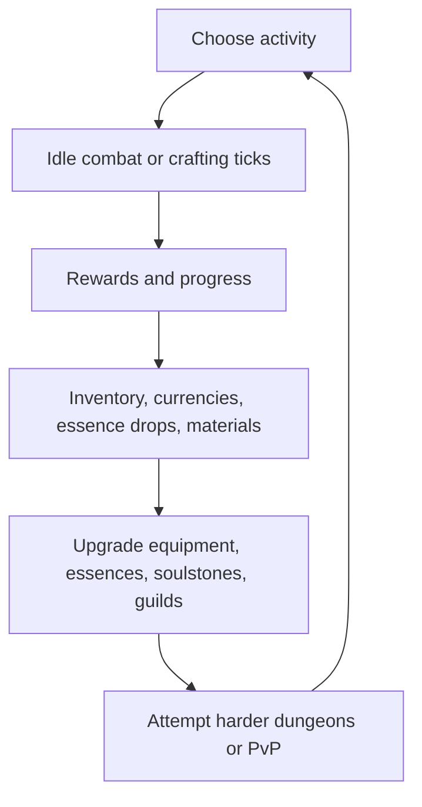
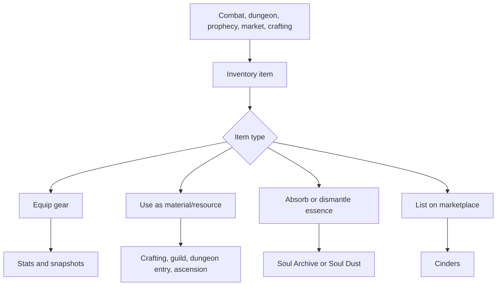
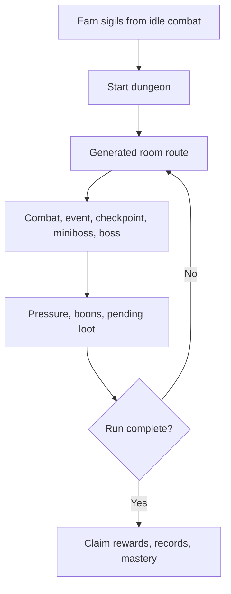
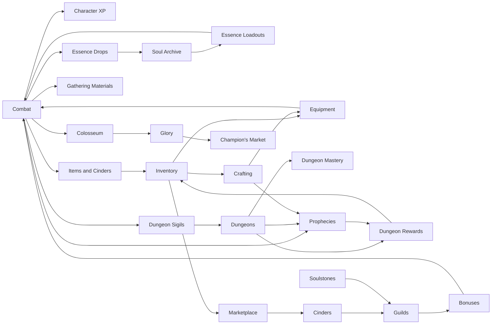

# Game Design Analysis Document

## 1. Executive Summary

Legends Legacy is currently an online idle RPG with active RPG layers. The strongest implemented fantasy is "build a character, leave them grinding monsters, collect rare essences and resources, then spend those resources on equipment, essence progression, dungeons, guild buildings, and PvP." The code supports a real game skeleton, not just a prototype: authentication, character state, idle combat, combat resolution, loot, inventory, equipment, essences, crafting, dungeons, Colosseum PvP, guilds, achievements, titles, prophecies, marketplace, realtime events, and chat are all present in some form.

The core loop is strongest when idle combat feeds other systems: defeated creatures grant experience, cinders, soulstones, loot, essence drops, gathering rewards, and dungeon sigils. Evidence: `LL/src/Infrastructure/Service/Services.LL/Combat/Layers/Rewards/Idle/IdleCombatRewardCalculator.cs`, `LL/src/Infrastructure/Service/Services.LL/Combat/Layers/Rewards/Idle/IdleDungeonSigilDropCalculator.cs`, and `LL/src/Infrastructure/Service/Services.LL/Essences/EssenceSystemService.cs`.

The weakest design layer is purpose clarity. Many systems are technically real, but the player-facing reason to care about each one is uneven. Dungeons are ambitious and have pressure, routes, boons, events, mastery, pending rewards, and records, but parts of the older richer design are still commented out in `LL/src/Infrastructure/Service/Services.LL/Dungeons/DungeonRunService.cs` and `LL/src/Core/Domain/Models/Dungeons/Runs/RoomInstance.cs`. Guilds have membership, invites, donations, and buildings, but no guild missions, wars, raids, shop, or shared activity loop. PvP has tickets, rating, Glory, records, defense snapshots, and a Champion's Market, but long-term reward identity is still thin outside currency conversion and durable cosmetic records.

Overall design maturity: medium. The architecture can support a serious game, and several systems are already data-driven through JSON under `LL/src/API/API.LL/Data`. The risk is feature sprawl: combat, essences, crafting, dungeons, prophecies, Colosseum, guilds, marketplace, and chat all exist, but the game does not yet appear to have one sharply communicated "why keep playing today" loop.

Biggest risks:

- Too many progression currencies and systems before the player has a simple priority ladder.
- Dungeon complexity may not yet produce enough meaningful choices to justify its UI and data surface.
- Guilds and PvP are implemented enough to be visible but not enough to be retention pillars.
- Crafting and essence progression have depth, but their relationship to combat power and player goals needs stronger presentation.
- Frontend has many feature pages, but onboarding/tutorial support is minimal and discoverability depends heavily on navigation literacy.

## 2. Current Game Identity

The game appears to be a browser-based idle/active RPG. The player fantasy is not tactical party command; it is long-term account and character optimization through combat, collection, crafting, and prestige. The player controls a character, starts activities, collects rewards over time, upgrades build systems, and occasionally makes active choices in dungeons, marketplace, Colosseum, guilds, and loadouts.

Main activity loop:

1. Start idle combat or crafting.
2. Let time convert into combat/crafting actions.
3. Receive currencies, items, essence drops, gathering materials, experience, and progression triggers.
4. Upgrade equipment, essences, soulstones, crafting mastery, guild buildings, or PvP standing.
5. Unlock or attempt harder content such as higher-tier dungeons and stronger opponents.

Progression style is mostly vertical power growth with collection layers. Character level, attributes, equipment stats, soulstones, essence levels, essence ascension, crafting quality, dungeon mastery, guild bonuses, achievement points, and PvP rating all exist. Horizontal build variety is implied through essence abilities and loadouts, but the implementation currently looks more like "equip better and stronger things" than "solve encounters with meaningfully different builds."

Session style is hybrid:

- Idle sessions: combat and crafting actions run in timed ticks through `CharacterAction` and action details.
- Active sessions: dungeon action selection, Colosseum opponent selection, market listings, guild management, essence loadout editing, prophecy claiming.

Idle/active balance is currently tilted toward idle production with active management. Dungeons are the main attempt to add roguelite decision-making. Colosseum is active but single-battle driven. Crafting has both instant craft queue creation and idle tempering.

Multiplayer/social emphasis is medium in implementation, weak in design payoff. Guilds, chat, marketplace, leaderboards, Colosseum rankings, and realtime events exist. However, most social systems do not create strong cooperation loops yet.

PvE/PvP balance leans PvE. PvP is implemented as a Colosseum feature using ratings, tickets, snapshots, Glory, and a shop, but PvE systems provide the broader progression foundation.

Economy depth is medium. Cinders act as the main trade currency, marketplace currency, and general reward. Soulstones, sigils, soul dust, monster cores, crafting materials, prophecy caches, Glory, and guild resources also exist. The risk is not lack of economy but unclear currency hierarchy.

Identity conflicts:

- Idle game vs active game: idle combat is the production base, but dungeons ask for active route/choice attention. The UI needs to make that shift feel intentional.
- Vertical growth vs build variety: essence abilities and loadouts suggest buildcraft, but many rewards are still raw stats/currencies.
- Solo progression vs guild progression: guild systems consume individual resources but do not yet give players shared goals beyond upgrades.
- PvP fairness vs PvE grind: Colosseum snapshots and rating help, but power still appears sourced from PvE progression and loadout state.
- Collection vs optimization: 60 essences and achievement/title systems support collection, while combat and crafting ask optimization. The game needs clearer priority guidance between them.

## 3. Feature Inventory

| Feature                       | Status                | Backend Evidence                                                                                          | Frontend Evidence                                                           | Data Evidence                                                   | Notes                                                                                           |
| ----------------------------- | --------------------- | --------------------------------------------------------------------------------------------------------- | --------------------------------------------------------------------------- | --------------------------------------------------------------- | ----------------------------------------------------------------------------------------------- |
| Authentication/account        | Implemented           | `LL/src/API/API.LL/Controllers/V1/AuthController.cs`; user models under `LL/src/Core/Domain/Models/Users` | `LL/src/Presentation/ll/src/app/features/public/landing/login` and `signup` | N/A                                                             | Includes register, login, guest login, guest conversion, Google login/bind, refresh, logout.    |
| Character creation/selection  | Mostly Implemented    | `CharacterCreatedEvent`, `UserCreatedEventHandler`, `CharacterController.cs`                              | `character` feature routes and character state services                     | N/A                                                             | Appears single-current-character oriented; no rich multi-character selection loop found.        |
| Character stats/attributes    | Implemented           | `AttributeType.cs`, `Character.cs`, `CombatStatsAggregator.cs`, snapshot models                           | Character overview and attribute display components                         | `levelTriggers.json`                                            | Attribute aggregation is mature enough to support equipment, essences, guild/soulstone bonuses. |
| Combat                        | Implemented           | `FastCombatEngine.cs`, `CombatEngineExecutor.cs`, `DefaultCombatEncounterResolver.cs`                     | Shared combat components and playback strategies                            | `abilities.json`, `ability-behaviors.json`, `creatures.json`    | Strong technical system with ability catalog and tests.                                         |
| Idle combat                   | Implemented           | `CombatService.cs`, `IdleCombatPlanner.cs`, `IdleCombatRewardCalculator.cs`                               | Region area cards and character action polling                              | Area/creature data in region/content seed                       | Core production loop.                                                                           |
| Areas/monsters/spawning       | Mostly Implemented    | `Area.cs`, `AreaCreature.cs`, `SpawningService.cs`, `CreatureService.cs`                                  | Region page and combat area cards                                           | `creatures.json` has 14 creatures; region seed tests exist      | Data scope is currently region-focused.                                                         |
| Loot/rewards                  | Implemented           | `LootService.cs`, `LootTableService.cs`, reward writers                                                   | Inventory reward display, dungeon reward summaries, realtime loot           | `items.json`, dungeon reward tables                             | Loot supports inventory, resources, essences, dungeon rewards.                                  |
| Inventory                     | Implemented           | `Inventory.cs`, `InventoryService.cs`, `InventoryController.cs`                                           | `features/game/character/inventory`                                         | `items.json`                                                    | Supports item stacks, marketplace movement, crafting material removal.                          |
| Equipment                     | Implemented           | `EquipmentInstance.cs`, `EquipmentSlotService.cs`, `EquipmentController.cs`                               | Equipment view, modal components, equipment slots                           | `items.json` and crafting recipes                               | Equipped gear feeds stats and snapshots.                                                        |
| Essences                      | Implemented           | `EssenceSystemService.cs`, `PlayerEssence.cs`, essence progression                                        | `features/game/character/essences`                                          | `essences.json` has 60 essence definitions                      | One of the strongest systems.                                                                   |
| Soul Archive                  | Implemented           | `GetSoulArchiveAsync`, `AbsorbUnboundEssenceAsync`                                                        | Soul Archive UI in essences page                                            | Essence item definitions in `items.json`                        | Clear collection/progression feature.                                                           |
| Abilities                     | Implemented           | Ability catalog/compiler/runtime under `Combat/Engine`                                                    | Combat display and essence detail components                                | 124 abilities, 129 behavior definitions                         | Good data-driven foundation.                                                                    |
| Combat styles                 | Not Found             | No dedicated combat style model found                                                                     | No dedicated style UI found                                                 | N/A                                                             | Builds are via attributes, equipment, essences, abilities.                                      |
| Dungeons                      | Mostly Implemented    | `DungeonRunService.cs`, `DungeonRunFactory.cs`, dungeon models/controllers                                | Dungeon list and active dungeon page                                        | 9 dungeons, 22 routes, 8 events, 45 boons, 10 mastery bonuses   | Ambitious but parts remain simplified/commented out.                                            |
| Dungeon keys/sigils           | Implemented           | `IdleDungeonSigilDropCalculator.cs`, `DungeonDefinition.SigilItemId`                                      | Dungeon entry requirements/cards                                            | Sigil resources in `items.json`, dungeon entry costs            | Sigils drop from idle combat at target rate.                                                    |
| Dungeon rewards               | Implemented           | `DungeonCombatRewardCalculator.cs`, `DungeonCompletionRewardApplier.cs`, `ClaimDungeonRewardsCommand.cs`  | Pending reward summaries and claim flow                                     | Dungeon reward tables                                           | Dungeon combat currently hardcodes 5 soulstones in reward calculator, a balance smell.          |
| Gathering                     | Partially Implemented | `AreaGatheringNode.cs`, `CombatGatheringRewardProcessor.cs`                                               | Profession/gathering references are indirect                                | Gathering nodes/materials in area/crafting data                 | Gathering exists as combat-adjacent passive rewards, not a full active profession loop.         |
| Crafting                      | Mostly Implemented    | `CraftingService.cs`, V2 crafting definitions, crafting controller                                        | Crafting and tempering pages                                                | materials, base recipes, blueprints, affixes, special modifiers | Strong system; UI and purpose still need clarity.                                               |
| Tempering/upgrading           | Implemented           | `TemperingService.cs`, `TemperingMechanicsService.cs`, crafting sessions                                  | Tempering page                                                              | special modifiers/affixes, tempering profiles in recipes        | Upgrades gear via potential, rarity, affixes, special modifiers.                                |
| Item rarity/affixes/modifiers | Implemented           | `Rarity.cs`, `InstanceAttributeModifier.cs`, tempering mechanics                                          | Inventory/equipment displays                                                | `affixes.json`, `special-modifiers.json`                        | Good item depth.                                                                                |
| Achievements                  | Implemented           | `AchievementService.cs`, `AchievementsController.cs`                                                      | Achievements page                                                           | 51 achievement definitions                                      | Tracks many systems and emits realtime/chat announcements.                                      |
| Titles                        | Implemented           | `TitlesController.cs`, title definitions/unlocks                                                          | Achievements/titles UI surfaces                                             | About 33 titles                                                 | Prestige system tied to achievements.                                                           |
| Daily/weekly tasks            | Implemented           | `ProphecyService.cs`, daily/weekly periods                                                                | Prophecies page                                                             | 20 daily, 8 weekly prophecies                                   | Branded as Prophecies, with weekly revelation milestones.                                       |
| Prophecies                    | Implemented           | `ProphecyService.cs`, `PropheciesController.cs`                                                           | `features/game/prophecies`                                                  | `Data/prophecies/*.json`                                        | Good retention hook.                                                                            |
| Colosseum/PvP                 | Mostly Implemented    | `ColosseumService.cs`, `ColosseumController.cs`                                                           | Colosseum page with battle, market, rankings, records                       | `champion-market.json`                                          | Real PvP loop but defense invalidation and reward identity still need polish.                   |
| PvP rankings                  | Implemented           | `GetRankings`, arena profile rating                                                                       | rankings/glory component                                                    | Rank tiers in code                                              | Leaderboard exists.                                                                             |
| Arena tickets                 | Implemented           | `ArenaTicketStatus.cs`, `GetArenaTicketStatusAsync`                                                       | Ticket display and opponent battle gating                                   | N/A                                                             | 5 max tickets, 3-hour restore interval.                                                         |
| Guilds                        | Partially Implemented | `GuildService.cs`, `GuildController.cs`, guild models                                                     | Guild page, no-guild/in-guild components                                    | `guild-building-upgrades.json`                                  | Membership and buildings exist; cooperation loop is shallow.                                    |
| Guild shop                    | Not Found             | No guild shop model/service found                                                                         | No shop UI found                                                            | N/A                                                             | Guild buildings are not a shop.                                                                 |
| Guild wars                    | Not Found             | No war service/model found                                                                                | No war UI found                                                             | N/A                                                             | Not implemented.                                                                                |
| Guild raids                   | Not Found             | No guild raid implementation found                                                                        | No guild raid UI found                                                      | N/A                                                             | Not implemented.                                                                                |
| Guild buildings               | Implemented           | `GuildBuildingUpgradeService.cs`, building models                                                         | `guild-buildings.component.*`                                               | 3 building upgrades                                             | Main guild progression sink.                                                                    |
| Guild missions                | Not Found             | No mission service/model found                                                                            | No mission UI found                                                         | N/A                                                             | Missing.                                                                                        |
| World bosses                  | Not Found             | No world boss system found                                                                                | No world boss page found                                                    | N/A                                                             | Some creature templates have boss ranks, but no world boss loop.                                |
| Raids                         | Frontend Only         | Raid orchestration request models exist, no full service/controller found                                 | `features/game/world/region/raids`                                          | N/A                                                             | Planned/shell.                                                                                  |
| Rifts                         | Not Found             | No rift system found                                                                                      | No rift route found                                                         | N/A                                                             | Missing.                                                                                        |
| World Tower                   | Not Found             | No tower system found                                                                                     | No tower route found                                                        | N/A                                                             | Missing.                                                                                        |
| Marketplace/Auction House     | Implemented           | `MarketPlaceService.cs`, `MarketPlaceController.cs`                                                       | Marketplace buy/sell/commodity pages                                        | N/A                                                             | Cinders-based listings and buyouts. No bidding found.                                           |
| Shop/premium/monetization     | Stubbed               | User transaction/payment models exist                                                                     | No premium shop UI found                                                    | N/A                                                             | No spendable premium loop found.                                                                |
| Mail/notifications            | Partially Implemented | Realtime contracts and notification services                                                              | Sidebar notification and toast services                                     | N/A                                                             | Mail not found; notifications/realtime exist.                                                   |
| Chat                          | Implemented           | Separate `LL-Chat` service with SignalR hub, history, channels, whispers                                  | `core/services/ll-chat`                                                     | Chat migrations                                                 | Independently deployable social layer.                                                          |
| Tutorials/onboarding          | Partially Implemented | No tutorial backend found                                                                                 | Some `data-tour` markers and landing/login                                  | N/A                                                             | Not a true onboarding system yet.                                                               |
| Admin tools                   | Implemented           | `API.AdminDashboard` controllers, diagnostics endpoints                                                   | `LL/src/Presentation/dashboard`                                             | Uses game data                                                  | Useful for items, creatures, essence catalog, diagnostics.                                      |
| Settings                      | Implemented           | N/A                                                                                                       | `features/game/settings`                                                    | N/A                                                             | UI present.                                                                                     |
| Realtime/SignalR features     | Implemented           | `RealTime.LL/GameHub.cs`, event contracts                                                                 | realtime facade and event consumers                                         | N/A                                                             | Covers character, guild, world audiences plus chat service.                                     |

## 4. Core Gameplay Loops

### 4.1 Primary Loop

The actual primary loop is an idle production loop with active upgrade management. Combat and crafting are time processors. The systems around them convert time into resources and then into power, collection, prestige, or market liquidity.

### 4.2 Combat Loop

Combat starts through character actions (`CharacterActionsController.StartCombat`) or through dungeon/Colosseum flows. Idle combat uses region areas and creature spawning; dungeon combat uses generated room encounters; Colosseum combat uses attacker/defender character combat entities and optional defense snapshots.

Resolution is handled by the combat engine and orchestration layers: `FastCombatEngine.cs`, `CombatEngineExecutor.cs`, `IdleCombatOrchestrator.cs`, `DungeonCombatOrchestrator.cs`, and `DefaultCombatEncounterResolver.cs`.

Enemy selection:

- Idle: area and creature configuration through `Area`, `AreaCreature`, spawning, and region data.
- Dungeon: `DungeonRunFactory` creates rooms and encounter ids from dungeon definitions.
- PvP: `ColosseumService.GetArenaOpponents` returns eligible opponents by rating context; battle rejects self, no-ticket, invalid, and recent same-defender cases.

Victory rewards:

- XP from defeated hostile creature experience rewards.
- Cinders via `DefaultIdleCinderRewardCalculator`.
- Soulstones via `PoissonSoulstoneRewardCalculator` for idle; dungeon combat currently grants a flat 5 soulstones in `DungeonCombatRewardCalculator.cs`.
- Loot through `LootService`.
- Essence item drops through `EssenceSystemService.RollEssenceDropsAsync`.
- Gathering rewards through `CombatGatheringRewardProcessor`.
- Dungeon sigils through `IdleDungeonSigilDropCalculator`.

Defeat appears to produce no normal idle reward beyond the combat log/result. In dungeons, non-victory can fail or alter the run depending on room context.

Idle processing works by calculating elapsed action time and performing batches of combat/crafting ticks. This is a good idle backbone, but reward presentation must make the time conversion feel satisfying.

### 4.3 Progression Loop

Player power grows through:

- Character level and base attributes.
- Equipment stats and equipment slots.
- Crafted item quality, potential, rarity, affixes, and special modifiers.
- Essence archive collection, essence levels, ascension tiers, evolution, loadouts, and active/passive abilities.
- Soulstone upgrades from `soulstone-upgrades.json`.
- Guild building bonuses from `guild-building-upgrades.json`.
- Dungeon mastery and first-clear rewards.
- Achievements and titles as prestige/completion systems.
- PvP rating/Glory through Colosseum.

The progression structure is wide but fragmented. The player can become stronger through many surfaces, but the code does not yet reveal a clear "early -> mid -> late" structure beyond content tiering and dungeon requirements.

### 4.4 Item Loop

Items are created by loot, dungeon reward appliers, crafting, prophecy rewards, marketplace movement, and definition loaders. They are equipped through `EquipmentController`, upgraded through tempering, consumed by crafting/dungeon/essence/guild systems, sold through marketplace listings, removed by crafting material spend or market listing creation, and returned through cancellation.

The item loop is mostly complete. The design gap is not capability but player motivation: it needs clearer item comparison, chase goals, and sink explanation.

### 4.5 Essence Loop

Essences are acquired as unbound essence items from monster drops. `EssenceSystemService.RollMonsterEssenceDropAsync` uses base drop chance plus resonance bonus from failed eligible kills. Absorbing an unbound essence creates a `PlayerEssence` in the Soul Archive; duplicates are blocked. Unbound essences can also be dismantled into soul dust.

Progression:

- Soul dust grants essence XP.
- Essence level caps depend on ascension tier.
- Ascension requires reaching the tier cap and spending monster cores.
- Evolution requires definition-specific ascension tier and catalyst.
- Equipped loadouts provide attribute modifiers and active/passive ability specs to combat.

This is one of the game's best systems because it links collection, combat identity, rare drops, bad-luck protection, progression, and build loadouts. The gap is UX and long-term chase clarity: players need to understand which essences matter, why dust should be spent on one over another, and how evolved essences change builds.

### 4.6 Dungeon Loop

Dungeons are entered through `DungeonController.StartDungeon` and cost entry resources defined in `dungeons.json`. Runs are generated by `DungeonRunFactory`: boss last, optional checkpoint, optional miniboss, and weighted combat/event rooms. Active actions are executed through `DungeonRunService.ExecuteActionAsync`.

They differ from idle combat by adding:

- Entry costs/sigils.
- Rooms and route choices.
- Pressure and reward multiplier state.
- Event choices.
- Boons and boss modifiers.
- Pending/unsecured rewards.
- Completion records and mastery.

The loop is promising but not fully compelling yet. The code still has large commented sections for treasure, shrine, trap, checkpoint essence swapping, and richer floor resolution. Current dungeons may feel like a dressed-up sequence of combat plus buttons unless choices significantly affect outcome and rewards.

### 4.7 PvP Loop

Colosseum PvP works as:

1. Ticket status restores over time.
2. Player selects eligible opponent.
3. System spends ticket and resolves battle.
4. Rating changes via rating service.
5. Attack/defense records and streaks update.
6. Attacker earns Glory, with daily first-win bonus.
7. Glory can buy Champion's Market items.
8. Rankings and match history update.

Evidence: `ColosseumService.cs`, `ArenaTicketStatus.cs`, `ArenaRewards.cs`, `CharacterArenaProfile.cs`, `champion-market.json`, and Colosseum frontend components.

Long-term purpose is present but thin. Rating and Glory are functional, but rewards mostly convert PvP into Cinders/Soulstones or durable cosmetic purchase records. PvP needs a clearer identity that matters without making PvE players feel forced.

### 4.8 Guild Loop

Guilds currently allow players to:

- Create, join, leave, disband.
- Invite/apply/approve/reject.
- View members, rankings, vault/resources.
- Donate Cinders/Soulstones/material-like guild resources.
- Upgrade guild buildings if leader.
- Subscribe to guild realtime groups.

Evidence: `GuildService.cs`, `GuildBuildingUpgradeService.cs`, `GuildController.cs`, guild frontend components, and `guild-building-upgrades.json`.

Guild progression exists through buildings, but meaningful cooperation is underdeveloped. There are no guild missions, wars, raids, guild shop, shared bosses, or recurring guild goals found. Guilds are currently a resource sink and social container, not yet a deep game feature.

## 5. System Interaction Map

| System A    | System B                | Interaction                                                            | Strength | Issue                                                                          |
| ----------- | ----------------------- | ---------------------------------------------------------------------- | -------- | ------------------------------------------------------------------------------ |
| Idle combat | Character progression   | Combat victories grant XP and level progression                        | Strong   | Needs clearer post-session reward summary.                                     |
| Idle combat | Essences                | Monsters can drop unbound essence items and build resonance            | Strong   | Rare drop purpose may be obscure before player learns Soul Archive.            |
| Idle combat | Dungeons                | Idle combat drops dungeon sigils                                       | Strong   | Sigil drop rate is hardcoded around 2/day target.                              |
| Idle combat | Gathering/crafting      | Combat victories can produce gathering rewards/materials               | Medium   | Gathering is not a distinct player-facing loop.                                |
| Combat      | Abilities               | Ability catalog drives active/passive combat behavior                  | Strong   | Many abilities increase balance surface.                                       |
| Essences    | Abilities               | Equipped essences provide active/passive abilities                     | Strong   | Build guidance is limited.                                                     |
| Essences    | Inventory               | Unbound essence items absorb or dismantle into dust                    | Strong   | Duplicate handling blocks archive duplicates but may limit collection economy. |
| Essences    | Achievements/titles     | Absorb, ascend, loadout actions feed achievement progress              | Medium   | Prestige is mostly meta, not gameplay-altering.                                |
| Dungeons    | Inventory/resources     | Entry costs and pending rewards use item/currency systems              | Strong   | Some dungeon rewards duplicate idle rewards.                                   |
| Dungeons    | Mastery                 | Completion can award mastery bonuses/reasons                           | Medium   | Mastery payoff needs stronger UI and design meaning.                           |
| Dungeons    | Prophecies              | Rooms, events, completions track prophecy progress                     | Strong   | Makes prophecies a good connective tissue.                                     |
| Crafting    | Inventory/equipment     | Materials create equipment, queued items are tempered                  | Strong   | Crafting outcome may be hard to evaluate without comparison goals.             |
| Crafting    | Achievements/prophecies | Crafting, blueprints, tempering feed progress                          | Medium   | Good retention hooks, but not core fantasy by themselves.                      |
| Guilds      | Character resources     | Donations convert personal resources into guild resources              | Medium   | Cooperation is mostly donation, not shared play.                               |
| Guilds      | Bonuses                 | Building upgrades can provide bonuses                                  | Medium   | Only 3 building upgrades currently.                                            |
| Colosseum   | Combat                  | PvP uses combat resolution and snapshots                               | Strong   | Power fairness depends on snapshot/loadout validity.                           |
| Colosseum   | Economy                 | Glory shop grants currencies/cosmetic records                          | Medium   | Reward identity is not yet distinct enough.                                    |
| Marketplace | Inventory/currency      | Items list, buyout transfers items and Cinders                         | Strong   | No auction/bidding or advanced economy controls found.                         |
| Realtime    | Progress feedback       | Events emit loot, level, achievements, market, arena, prophecy updates | Medium   | Helps responsiveness, but not a substitute for reward clarity.                 |
| Chat        | Achievements/social     | System chat can announce achievement unlocks                           | Medium   | Social context exists, but game loops rarely require communication.            |

## 6. Economy and Resource Analysis

| Resource                 | Source                                                                 | Sink                                                       | Used By                                | Current Purpose                                            | Design Risk                                                             |
| ------------------------ | ---------------------------------------------------------------------- | ---------------------------------------------------------- | -------------------------------------- | ---------------------------------------------------------- | ----------------------------------------------------------------------- |
| Cinders                  | Idle/dungeon combat, prophecies, Champion's Market cache               | Marketplace buyouts, guild donations, crafting/guild costs | Marketplace, guilds, crafting, rewards | Main soft currency/trade currency                          | Too central; inflation risk.                                            |
| Soulstones               | Idle reward calculator, dungeon rewards, prophecies, Champion's Market | Soulstone upgrades, guild donations                        | Character upgrades, guild upgrades     | Account/character power currency                           | Name overlaps with Soul Archive concept; needs clean explanation.       |
| Sigil fragments          | Character DTO and prophecy rewards                                     | Unclear from inspected code                                | Character progression/rewards          | Possible dungeon-related meta currency                     | Purpose appears weaker than actual sigil items.                         |
| Dungeon sigils           | Idle combat sigil drops                                                | Dungeon entry costs                                        | Dungeons                               | Gates dungeon attempts                                     | Hardcoded target rate may clash with dungeon reward tuning.             |
| Soul Dust / Essence Dust | Dismantle unbound essences                                             | Spend on essence XP                                        | Essences                               | Converts duplicate/unwanted essence items into progression | Naming inconsistency: code uses `soul_dust`, UI says dust/Essence Dust. |
| Monster cores            | Dungeon rewards and item definitions                                   | Essence ascension                                          | Essences                               | Tier-gated essence progression                             | Good sink, but drop/source clarity matters.                             |
| Evolution catalysts      | Item definitions/rewards                                               | Essence evolution                                          | Essences                               | Unlock evolved effects                                     | Strong chase item if surfaced well.                                     |
| Crafting materials       | Gathering/combat, dungeon/event rewards, market                        | Crafting recipes/blueprints                                | Crafting                               | Equipment creation                                         | Many materials with unclear tier ladder can overwhelm.                  |
| Equipment potential      | Crafted item stat                                                      | Tempering attempts consume potential                       | Tempering                              | Limits upgrade depth                                       | Good item sink, but negative outcomes need clear fairness.              |
| Glory                    | Colosseum battles and daily first win                                  | Champion's Market purchases                                | PvP                                    | PvP reward currency                                        | Needs distinctive rewards beyond generic currencies.                    |
| Arena tickets            | Time regeneration                                                      | Colosseum battles                                          | PvP                                    | Attempts/time gate                                         | Clear and standard, but can feel punitive if rewards are weak.          |
| Guild resources          | Donations from character inventory/currencies                          | Building upgrades                                          | Guilds                                 | Shared progression sink                                    | Cooperation is transactional; no shared earning loop yet.               |
| Prophetic Favor          | Completed prophecy claims                                              | Weekly revelation milestones                               | Prophecies                             | Weekly retention milestone currency                        | Good connective tissue, but another meta layer.                         |
| Prophecy caches          | Prophecy rewards/milestones                                            | Open cache                                                 | Prophecies/economy                     | Delayed reward bundle                                      | Potentially good reward anticipation.                                   |
| Achievement points       | Achievement unlocks                                                    | No meaningful sink found                                   | Prestige                               | Completion status                                          | Low gameplay value unless tied to account goals.                        |
| Premium currency         | Not found                                                              | Not found                                                  | N/A                                    | N/A                                                        | Monetization not implemented.                                           |
| Gold                     | Mostly not found as currency; appears as cosmetic name/payment concept | Not found                                                  | N/A                                    | N/A                                                        | Do not treat as economy currency.                                       |

There are many currencies and resources. The issue is not raw count alone; it is whether each has a memorable source and sink. Cinders, Soulstones, Soul Dust, monster cores, dungeon sigils, crafting materials, Glory, guild resources, and Prophetic Favor are all understandable individually, but together they create a high cognitive load.

Sources and sinks are partially balanced by structure, not necessarily by tuning. Long-term sinks exist for essences, soulstones, crafting, marketplace, guild buildings, and PvP shop, but several are shallow or finite. Dead-end risk exists for achievement points, cosmetic purchase records, guild resources after buildings, and sigil fragments if not surfaced. Generic resource risk is highest for Cinders because they do too much.

## 7. Progression Analysis

Early game likely works best if the player is pushed into idle combat, inventory, equipment, first essences, and a first dungeon key. The repository has systems to support this, but onboarding is not strong enough to guarantee players understand it.

Mid game appears to be where the design wants to bloom: essence loadouts, crafting recipes/blueprints, dungeons, prophecies, Colosseum, marketplace, and guilds. This is the most dangerous stage because too many systems unlock attention at once.

Late game is not yet clearly defined. Possible late-game pillars are high-tier dungeons, optimized essences, crafted/tempered gear, Colosseum rating, guild buildings, achievements/titles, and marketplace economy. None yet reads as the definitive endgame.

Account-wide progression:

- Achievements/titles include account scope.
- Auth/user models and title unlocks support account identity.
- Soulstone upgrades may feel account-like but are character-oriented in code.

Character-specific progression:

- Level, attributes, equipment, inventory, essences, action state, arena profile, guild membership, prophecy instances.

Horizontal progression:

- Essence collection/loadouts.
- Ability combinations.
- Equipment affixes/special modifiers.
- Titles/cosmetics.

Vertical progression:

- Level, stats, gear tier/quality/rarity, essence level/ascension, soulstones, guild bonuses.

Time gates:

- Idle action ticks.
- Arena ticket regeneration.
- Daily/weekly prophecies.
- Dungeon sigil drop rate.

Difficulty gates:

- Dungeon tiers and entry requirements.
- PvP rating tiers.
- Crafting material/tier requirements.
- Essence ascension caps.

Social gates:

- Guild membership for guild buildings/donations.
- Marketplace economy depends on other players.
- Chat exists but does not gate gameplay.

Players may ask:

- "What should I do next?" because many systems are side-by-side in navigation.
- "Why do I need this reward?" for soulstones, sigil fragments, caches, monster cores, and guild resources unless the UI ties them to next upgrades.
- "Why should I keep playing?" if the next milestone is not visible.
- "Why does this system matter?" especially for guilds, Colosseum, achievements, and crafting before item goals are clear.

## 8. Player Motivation Analysis

| Motivation            | Current Support | Supporting Systems                                                 | Weakness                                                             |
| --------------------- | --------------- | ------------------------------------------------------------------ | -------------------------------------------------------------------- |
| Power growth          | Strong          | Leveling, equipment, essences, soulstones, crafting, guild bonuses | Too many parallel power surfaces.                                    |
| Collection            | Strong          | 60 essences, achievements, titles, item catalog                    | Collection goals need better presentation and milestones.            |
| Optimization          | Medium          | Essence loadouts, gear affixes, crafting, PvP rating               | Build comparison and recommended goals are not obvious.              |
| Competition           | Medium          | Colosseum, leaderboards, dungeon records                           | PvP rewards and competitive identity need more payoff.               |
| Cooperation           | Weak            | Guilds, chat, guild resources                                      | No shared missions, raids, wars, or group challenges.                |
| Exploration           | Weak            | Regions, dungeons, route names/events                              | World content breadth is limited and map fantasy is unclear.         |
| Prestige              | Medium          | Titles, achievements, rankings                                     | Prestige is mostly display/status, not deeply aspirational yet.      |
| Economy/trading       | Medium          | Marketplace, Cinders, tradable items                               | No auction/bidding, price history, or economy health controls found. |
| Completionism         | Strong          | Achievements, titles, essences, dungeon records                    | Completion goals may overwhelm without better filters/roadmap.       |
| Build experimentation | Medium          | Essence loadouts, abilities, affixes                               | Need clearer encounter demands that reward different builds.         |

## 9. UX and Frontend Flow Analysis

Navigation is broad and functional. Routes expose world, character, city, professions, prophecies, settings, public login/signup, and nested feature pages. Evidence: `LL/src/Presentation/ll/src/app/app.routes.ts`, `features/game/world/world.routes.ts`, `features/game/character/character.routes.ts`, `features/game/city/city.routes.ts`, and `features/game/professions/professions.routes.ts`.

Discoverability is mixed. Major systems are reachable, but a new player may not know why to visit Soul Archive, Soulstones, Prophecies, Guild, Colosseum, Marketplace, or Crafting. The frontend has empty/loading/error states and polished shared primitives, but onboarding is not systematic. `data-tour="dungeons-introduction"` appears in dungeon UI, yet no complete tutorial backend or guided progression system was found.

Feedback after actions is better than expected in some systems:

- Dungeons show pressure, rewards, room progress, route rewards, pending rewards, and claim flow in `dungeon-page.component.html`.
- Colosseum shows tickets, rank, rating, Glory, streak, daily first win, defense snapshot, battle result, rankings, market, and records.
- Prophecies show progress bars, rewards, milestones, cache inventory, messages, and errors.
- Essences show archive count, dust, filters, selected details, ability descriptions, ascension/evolution requirements, and loadouts.

UX pain points:

- The UI exposes many systems as equal-weight destinations, which can make the game feel less directed than it is.
- Some systems have dense detail panels without prioritizing "next best action."
- Reward presentation exists but is fragmented across pages; there is no unified "what changed since last session" experience.
- Dungeons have a lot of interface complexity. If route decisions are shallow, the UI will feel heavier than the gameplay.
- Mobile friendliness cannot be fully judged from code only, but many dense panels and tables risk cramped mobile experience.
- Empty states exist and are generally better than placeholders, but feature-shell pages like raids still risk communicating unfinished scope.

## 10. Feature-by-Feature Design Review

### Combat

**Current State**  
Implemented with a data-driven ability catalog and reusable resolution/orchestration layers.

**How It Works**  
Combat entities are constructed from characters/creatures/snapshots, abilities compile from JSON behavior definitions, and outcomes produce logs/results.

**What Works Well**  
The ability data layer and tests give this system room to grow. Combat supports idle, dungeon, and Colosseum modes.

**Pain Points**  
The actual player decision during combat seems low; much of the skill is pre-combat build setup.

**Missing Pieces**  
Clear encounter mechanics that force build choices; player-facing explanation of ability interactions.

**Recommended Improvements**  
Add visible combat role/readiness summaries and post-fight insight: "you lost because of X", "this essence helped with Y."

**Priority**  
High

### Idle Combat

**Current State**  
Implemented and central.

**How It Works**  
Character action ticks resolve encounters and rewards over elapsed time.

**What Works Well**  
Feeds many systems: XP, loot, Cinders, Soulstones, essences, gathering rewards, sigils.

**Pain Points**  
Because it feeds everything, rewards can feel like a currency pile instead of a directed loop.

**Missing Pieces**  
Session recap and next-action guidance.

**Recommended Improvements**  
Create a session summary that groups rewards by purpose: power, dungeon entry, essence progression, crafting, market.

**Priority**  
Critical

### Areas/Monsters

**Current State**  
Mostly implemented, with 14 creature definitions and region/area systems.

**How It Works**  
Areas contain creatures and gathering nodes; spawning selects monsters for idle combat.

**What Works Well**  
Good creature template architecture and diagnostics.

**Pain Points**  
Content breadth appears region-one focused.

**Missing Pieces**  
More distinct area identities, enemy mechanics, and unlock pacing.

**Recommended Improvements**  
Make each area teach one resource or build lesson.

**Priority**  
Medium

### Inventory/Equipment

**Current State**  
Implemented.

**How It Works**  
Items enter inventory, equipment can be equipped/unequipped, crafted items carry quality/potential/affixes/modifiers.

**What Works Well**  
Supports marketplace, crafting, dungeon rewards, essences, and combat stats.

**Pain Points**  
Gear chase can become stat soup without comparison and goals.

**Missing Pieces**  
Strong item comparison, recommended upgrades, and clear sink indicators.

**Recommended Improvements**  
Add "why this item matters" signals: best slot, crafting source, upgrade potential, market value.

**Priority**  
High

### Essences

**Current State**  
Implemented and deep.

**How It Works**  
Unbound essence drops are absorbed into the Soul Archive, leveled with dust, ascended with cores, evolved with catalysts, and equipped through loadouts.

**What Works Well**  
Excellent bridge between collection and buildcraft.

**Pain Points**  
The system may be intimidating because it includes drops, resonance, dust, XP, caps, ascension, evolution, loadouts, abilities, attributes, favorites.

**Missing Pieces**  
Build recommendations and collection milestones.

**Recommended Improvements**  
Add "recommended next essence upgrade" and "new build unlocked" UX.

**Priority**  
Critical

### Soul Archive

**Current State**  
Implemented as the essence collection/progression hub.

**How It Works**  
Absorbed essences are stored; active slots/loadouts determine combat effect.

**What Works Well**  
The archive gives rare drops a permanent collection meaning.

**Pain Points**  
No clear duplicate progression beyond dismantling unbound items to dust.

**Missing Pieces**  
Collection set bonuses or archive milestones, if intended.

**Recommended Improvements**  
Add lightweight archive milestones before adding more essence complexity.

**Priority**  
Medium

### Abilities

**Current State**  
Implemented through JSON definitions and runtime compilation.

**How It Works**  
Abilities and behaviors define combat effects used by essence active/passive abilities and combat runtime.

**What Works Well**  
Data-driven and testable.

**Pain Points**  
Balance surface is large: 124 abilities and 129 behaviors.

**Missing Pieces**  
Designer-facing balance guardrails and player-facing explanation.

**Recommended Improvements**  
Build automated outlier reports around damage, healing, cooldown, uptime, and status stacking.

**Priority**  
High

### Dungeons

**Current State**  
Mostly implemented.

**How It Works**  
Sigils unlock generated runs with room progression, pressure, routes, boons, events, rewards, records, and mastery.

**What Works Well**  
Strong foundation for active play; much better than plain idle combat on paper.

**Pain Points**  
Some richer room mechanics are commented out; current room/event implementation risks being more UI than gameplay.

**Missing Pieces**  
Clear fail/withdraw strategy, richer treasure/shrine/trap choices, stronger room identity.

**Recommended Improvements**  
Finish one dungeon family to high quality before expanding dungeon count.

**Priority**  
Critical

### Crafting

**Current State**  
Mostly implemented.

**How It Works**  
Recipes consume materials to create equipment; blueprints unlock variants; mastery improves outputs; tempering spends potential for upgrades.

**What Works Well**  
Strong itemization foundation with quality, potential, affixes, and special modifiers.

**Pain Points**  
The reason to craft instead of rely on drops/market needs stronger framing.

**Missing Pieces**  
Crafting goals, recommended recipes, economy sink clarity.

**Recommended Improvements**  
Make crafting the clear path to targeted gear, while drops remain broad/random.

**Priority**  
High

### Gathering

**Current State**  
Partially implemented.

**How It Works**  
Gathering resources appear tied to area nodes and combat reward processing.

**What Works Well**  
Integrates materials into combat instead of requiring separate grind.

**Pain Points**  
Not a compelling standalone profession loop.

**Missing Pieces**  
Active gathering choices, gathering progression, node identity.

**Recommended Improvements**  
Keep it passive for now; do not build a full gathering game until crafting needs it.

**Priority**  
Low

### Achievements/Titles

**Current State**  
Implemented.

**How It Works**  
System events update achievement progress; completed achievements can unlock titles; titles can be equipped.

**What Works Well**  
Good coverage across combat, crafting, dungeons, essences, Colosseum, hidden/legacy/general categories.

**Pain Points**  
Prestige value depends on player caring about display/social proof.

**Missing Pieces**  
Achievement roadmap and meaningful meta rewards beyond titles/points.

**Recommended Improvements**  
Use achievements to guide players through systems, not only reward them after the fact.

**Priority**  
Medium

### Colosseum/PvP

**Current State**  
Mostly implemented.

**How It Works**  
Players spend tickets, fight opponents, gain/lose rating, earn Glory, track records/streaks, update defense snapshots, buy market rewards.

**What Works Well**  
Complete enough to feel like a real feature.

**Pain Points**  
PvP purpose is not distinct enough; reward shop risks becoming generic currency conversion.

**Missing Pieces**  
Automatic snapshot invalidation is mentioned in status docs as remaining work; stronger seasonal goals not found.

**Recommended Improvements**  
Make PvP rewards prestige/cosmetic/build-expression first, generic power second.

**Priority**  
Medium

### Guilds

**Current State**  
Partially implemented.

**How It Works**  
Guild membership and leadership control invites/applications; members donate resources; leaders upgrade buildings.

**What Works Well**  
Basic social container and shared resource sink exist.

**Pain Points**  
No cooperative gameplay loop.

**Missing Pieces**  
Guild missions, shop, wars, raids, shared bosses, weekly goals.

**Recommended Improvements**  
Add one lightweight weekly guild objective before any large guild war/raid system.

**Priority**  
Medium

### Shop/Monetization

**Current State**  
Not implemented as gameplay monetization.

**How It Works**  
User transaction/payment models exist, but no premium shop loop was found.

**What Works Well**  
No obvious pay-to-win problem yet.

**Pain Points**  
If monetization is added before economy clarity, it may harm trust.

**Missing Pieces**  
Product philosophy, premium currency, purchase flows, cosmetic inventory.

**Recommended Improvements**  
Delay monetization until core retention loops are clearer.

**Priority**  
Low

### Frontend Navigation/Onboarding

**Current State**  
Navigation is implemented; onboarding is underdeveloped.

**How It Works**  
Routes expose major systems; components show loading/error/empty states; some tour markers exist.

**What Works Well**  
The UI has many concrete screens and feedback states.

**Pain Points**  
New players may be dropped into a system map rather than a guided game.

**Missing Pieces**  
First-session questline, guided unlocks, next-goal panel.

**Recommended Improvements**  
Add a "Next Goal" panel tied to actual unlock/state data.

**Priority**  
Critical

## 11. Pain Points and Design Debt

| Priority | Pain Point                                        | Why It Matters                                                       | Evidence                                                                                      | Suggested Fix                                            |
| -------- | ------------------------------------------------- | -------------------------------------------------------------------- | --------------------------------------------------------------------------------------------- | -------------------------------------------------------- |
| Critical | No clear next-goal spine                          | Players may not know which system matters next                       | Many major routes and systems exposed in frontend routes                                      | Add state-driven next-goal panel.                        |
| Critical | Idle reward purpose is fragmented                 | Idle combat is the core loop; unclear reward meaning hurts retention | `IdleCombatRewardCalculator.cs` outputs many reward types                                     | Group rewards by purpose and next sink.                  |
| Critical | Dungeon complexity may exceed actual choice depth | Heavy UI without meaningful decisions feels bad                      | Commented dungeon room mechanics in `DungeonRunService.cs` and `RoomInstance.cs`              | Finish fewer room mechanics deeply.                      |
| High     | Essence system is deep but intimidating           | Best system may lose players if unclear                              | `EssenceSystemService.cs`, `essences.component.html`                                          | Add recommended upgrades/loadouts and milestone framing. |
| High     | Too many resource types                           | Cognitive load rises before player understands loops                 | Cinders, Soulstones, sigils, dust, cores, catalysts, materials, Glory, guild resources, Favor | Build a resource glossary and sink affordances.          |
| High     | Guilds lack cooperative gameplay                  | Social retention will be weak                                        | `GuildService.cs` mostly membership/donation/buildings                                        | Add weekly guild objective.                              |
| High     | PvP rewards are not distinct enough               | PvP can feel optional or forced                                      | `champion-market.json` includes currency caches and cosmetic records                          | Lean PvP into prestige/cosmetics.                        |
| Medium   | Gathering is passive and vague                    | Materials appear without a clear fantasy                             | `CombatGatheringRewardProcessor.cs`, `AreaGatheringNode.cs`                                   | Keep passive; explain as area byproduct.                 |
| Medium   | Crafting goals are unclear                        | Crafting depth needs item chase clarity                              | `CraftingService.cs`, crafting JSON files                                                     | Make target gear paths visible.                          |
| Medium   | Achievement points lack sink                      | Completionism may feel cosmetic only                                 | `AchievementDefinition.cs`, `AchievementService.cs`                                           | Add account milestone rewards or guidance.               |
| Medium   | Marketplace economy lacks guardrails              | Player economy can destabilize                                       | `MarketPlaceService.cs`                                                                       | Add price history/listing limits later.                  |
| Medium   | Realtime exists but not all feedback is unified   | Events may not translate into comprehension                          | realtime contracts and frontend consumers                                                     | Centralize progress/reward feed.                         |
| Low      | Monetization models exist without design          | Future risk if added ad hoc                                          | user `Transactions` models                                                                    | Define monetization philosophy before implementation.    |

## 12. Content Depth Analysis

| Content Type            |           Approx Count | Data Location                                   | Quality Assessment                            | Missing Variety                                 |
| ----------------------- | ---------------------: | ----------------------------------------------- | --------------------------------------------- | ----------------------------------------------- |
| Creatures               |                     14 | `LL/src/API/API.LL/Data/creatures.json`         | Low-medium count, detailed definitions        | More regions, roles, mechanics.                 |
| Items                   |                    180 | `LL/src/API/API.LL/Data/items.json`             | Good breadth for resources, gear, essences    | Better player-facing item taxonomy.             |
| Essences                |                     60 | `LL/src/API/API.LL/Data/essences.json`          | Strong collection depth                       | Milestones and build archetype clarity.         |
| Abilities               |                    124 | `LL/src/API/API.LL/Data/abilities.json`         | High breadth                                  | Balance explainability.                         |
| Ability behaviors       |                    129 | `LL/src/API/API.LL/Data/ability-behaviors.json` | Strong technical depth                        | Automated outlier checks.                       |
| Dungeons                |                      9 | `LL/src/API/API.LL/Data/dungeons.json`          | Good count, but depth depends on room choices | Fully polished signature dungeon.               |
| Dungeon routes          |                     22 | `dungeon-routes.json`                           | Good flavor                                   | More mechanical differentiation.                |
| Dungeon events          |                      8 | `dungeon-events.json`                           | Useful base                                   | More unique family-specific events.             |
| Dungeon boons           |                     45 | `dungeon-boons.json`                            | Strong roguelite support                      | Better UI impact previews.                      |
| Dungeon mastery bonuses |                     10 | `dungeon-mastery-bonuses.json`                  | Good start                                    | Long-term mastery goals.                        |
| Guild buildings         |                      3 | `guild-building-upgrades.json`                  | Thin                                          | More cooperative sinks after guild loop exists. |
| Soulstone upgrades      |                     27 | `soulstone-upgrades.json`                       | Good vertical progression                     | Build path recommendations.                     |
| Champion's Market items |                      9 | `champion-market.json`                          | Functional first pass                         | More prestige/cosmetic identity.                |
| Crafting materials      |                     13 | `crafting/materials.json`                       | Good first region set                         | More clear source/sink mapping.                 |
| Crafting base recipes   |                      9 | `crafting/base-recipes.json`                    | Focused                                       | Higher-tier and role-specific recipes.          |
| Crafting blueprints     |                     11 | `crafting/blueprints.json`                      | Good variant hook                             | More chase drops and unlock stories.            |
| Affixes                 |                     31 | `crafting/affixes.json`                         | Strong itemization support                    | Balance grouping.                               |
| Special modifiers       |                      9 | `crafting/special-modifiers.json`               | Good rare upgrade flavor                      | More build-defining modifiers.                  |
| Daily prophecies        |                     20 | `prophecies/daily.json`                         | Good retention content                        | More onboarding-friendly objectives.            |
| Weekly prophecies       |                      8 | `prophecies/weekly.json`                        | Good first pass                               | Broader weekly variety.                         |
| Achievements            |                     51 | `achievements/*.json`                           | Good coverage                                 | More guided achievements.                       |
| Titles                  |               About 33 | `titles/*.json`                                 | Good prestige baseline                        | Stronger display/social payoff.                 |
| PvP ranks/rewards       | Code plus 9 shop items | Colosseum code and `champion-market.json`       | Functional                                    | Seasons, cosmetics, rank-end rewards.           |
| Guild data              |    3 building upgrades | `guild-building-upgrades.json`                  | Thin                                          | Missions, weekly goals, shop, raids.            |

## 13. Balance Risk Analysis

| Risk                                 | System             | Severity | Why It Is Risky                                                   | Suggested Guardrail                                |
| ------------------------------------ | ------------------ | -------- | ----------------------------------------------------------------- | -------------------------------------------------- |
| Currency inflation                   | Cinders            | High     | Cinders are reward, market, guild, and crafting-adjacent currency | Track sources/sinks per day.                       |
| Essence stacking                     | Essences/combat    | High     | Loadouts add attributes and abilities; 60 definitions             | Simulate top combinations weekly.                  |
| Ability outliers                     | Combat abilities   | High     | 124 abilities and 129 behaviors                                   | Add DPS/healing/uptime diagnostics.                |
| Dungeon reward duplication           | Dungeons           | Medium   | Dungeons grant Cinders/Soulstones/items similar to idle combat    | Give dungeons distinctive chase rewards.           |
| Hardcoded dungeon soulstones         | Dungeon combat     | Medium   | `DungeonCombatRewardCalculator.cs` sets total soulstones to 5     | Move to data/tuning table.                         |
| Sigil drop pacing                    | Dungeons/idle      | Medium   | Target 2/day hardcoded in `IdleDungeonSigilDropCalculator.cs`     | Externalize by region/tier.                        |
| PvP power fairness                   | Colosseum          | High     | PvP depends on current/snapshot loadouts from PvE progression     | Automate snapshot invalidation and show freshness. |
| Glory economy                        | Colosseum          | Medium   | Glory shop can become currency faucet                             | Separate prestige rewards from economic rewards.   |
| Crafting high-roll gear              | Crafting/tempering | High     | Quality, potential, affixes, special modifiers stack              | Cap total modifier budget by tier/rarity.          |
| Guild-wide bonuses                   | Guilds             | Medium   | Building bonuses can affect everyone                              | Keep bonuses modest and auditable.                 |
| Achievement/title prestige inflation | Achievements       | Low      | Many achievements/titles can devalue prestige                     | Use rarity and hidden/legacy carefully.            |
| Marketplace manipulation             | Economy            | Medium   | Player-set Cinder listings exist                                  | Add price history and listing taxes later.         |

## 14. Technical Constraints That Affect Game Design

Helpful design architecture:

- JSON definitions make content iteration practical: `Data/essences.json`, `abilities.json`, `dungeons.json`, crafting JSON, prophecies, achievements, titles.
- Combat is layered into orchestration, resolution, rewards, and ability runtime, making new combat modes possible.
- Realtime contracts are separated and audience-scoped.
- Tests cover many design-critical systems: essence progression, ability system, dungeons, crafting, Colosseum, achievements.
- Admin diagnostics exist for ability catalog, creature profiles, region-one content, and simulations.

Constraints/design friction:

- Some tuning is hardcoded, such as sigil drop target in `IdleDungeonSigilDropCalculator.cs`, dungeon combat soulstones in `DungeonCombatRewardCalculator.cs`, and arena ticket restore interval in `ColosseumService.cs`.
- Dungeon code contains commented older/unfinished mechanics. This can confuse future design decisions because it is unclear what is active design vs abandoned design.
- Frontend/backend route naming is sometimes legacy-style (`GetAvailableDungeons`, `StartDungeon`, `StartArenaBattle`) alongside newer REST-ish routes.
- Many systems directly share broad currencies, especially Cinders and Soulstones, increasing balance coupling.
- Guild systems are structurally present but have limited gameplay abstractions beyond resources/buildings.
- PvP snapshots are good, but loadout invalidation and fairness need hard guarantees.

## 15. Missing or Underdeveloped Systems

| System                             | Current Evidence                              | Missing Design                                 | Recommended Direction                        |
| ---------------------------------- | --------------------------------------------- | ---------------------------------------------- | -------------------------------------------- |
| First-session onboarding           | Routes and some `data-tour` markers           | Guided progression, first goals                | Add state-driven tutorial goals.             |
| Next-goal system                   | Not found                                     | Player guidance                                | Add one panel derived from character state.  |
| Full gathering profession          | `AreaGatheringNode`, reward processor         | Active gathering loop                          | Keep passive until crafting needs more.      |
| Deep guild gameplay                | Guild membership/donations/buildings          | Missions, weekly objectives, shared challenges | Add small weekly guild objective first.      |
| Guild shop                         | Not found                                     | Guild-specific spending                        | Delay until guild resources are fun to earn. |
| Guild wars                         | Not found                                     | Competitive guild loop                         | Do not build yet.                            |
| Guild raids                        | Not found                                     | Cooperative PvE                                | Do not build until guild missions work.      |
| Raids                              | Frontend shell and combat request models      | Full backend loop/content/rewards              | Park until dungeons are polished.            |
| World bosses                       | Not found                                     | Shared world challenge                         | Later, after realtime/progression clarity.   |
| Rifts                              | Not found                                     | Alternate endgame                              | Avoid adding now.                            |
| World Tower                        | Not found                                     | Long-term PvE ladder                           | Potential future focused endgame, not now.   |
| Premium shop                       | Transaction models only                       | Product, currency, ethics, UI                  | Delay.                                       |
| Mail                               | Not found                                     | Async player messaging                         | Use notifications/chat first.                |
| Dungeon treasure/shrine/trap depth | Commented code in dungeon run models/services | Rich room resolution                           | Finish one room archetype at a time.         |
| PvP seasons                        | Rankings/history exist                        | Seasonal reset/rewards                         | Add after PvP reward identity is clear.      |

## 16. Recommended Design Roadmap

### Immediate Fixes

| Phase     | Priority | Recommendation                             | Why Now                           | Dependencies                                  |
| --------- | -------- | ------------------------------------------ | --------------------------------- | --------------------------------------------- |
| Immediate | Critical | Add a next-goal/next-upgrade panel         | Clarifies the whole game          | Character, inventory, dungeon, essence state. |
| Immediate | Critical | Improve idle session reward summary        | Idle combat is the main loop      | Reward DTO/UI aggregation.                    |
| Immediate | High     | Add resource purpose tooltips/glossary     | Reduces currency confusion        | Existing resource definitions.                |
| Immediate | High     | Surface essence upgrade recommendations    | Helps players use the best system | Essence archive/loadout data.                 |
| Immediate | High     | Pick one dungeon family as the quality bar | Prevents dungeon sprawl           | Existing dungeon data.                        |

### Short-Term Priorities

| Phase      | Priority | Recommendation                           | Why Now                                       | Dependencies                     |
| ---------- | -------- | ---------------------------------------- | --------------------------------------------- | -------------------------------- |
| Short-term | High     | Finish richer dungeon event/room choices | Makes active play worthwhile                  | Dungeon service/UI.              |
| Short-term | High     | Clarify crafting as targeted gear path   | Gives materials purpose                       | Crafting UI and item comparison. |
| Short-term | Medium   | Add Colosseum season/prestige framing    | Gives PvP purpose                             | Existing rating/history/market.  |
| Short-term | Medium   | Add lightweight guild weekly objective   | Gives guilds shared purpose                   | Guild resources and realtime.    |
| Short-term | Medium   | Add build/readiness summaries            | Improves combat/essence/equipment readability | Combat stat aggregation.         |

### Medium-Term Priorities

| Phase       | Priority | Recommendation                            | Why Now                                  | Dependencies              |
| ----------- | -------- | ----------------------------------------- | ---------------------------------------- | ------------------------- |
| Medium-term | Medium   | Expand region/monster content             | Current content looks region-one focused | Strong first-region loop. |
| Medium-term | Medium   | Add market price history/listing friction | Economy will need guardrails             | Marketplace usage data.   |
| Medium-term | Medium   | Add achievement-guided progression tracks | Turns completion into guidance           | Achievement service/UI.   |
| Medium-term | Low      | Add archive collection milestones         | Supports collection motivation           | Essence archive maturity. |
| Medium-term | Low      | Add more guild buildings                  | Only after guild play has meaning        | Weekly guild objective.   |

### Long-Term Priorities

| Phase     | Priority | Recommendation                              | Why Now                                   | Dependencies                    |
| --------- | -------- | ------------------------------------------- | ----------------------------------------- | ------------------------------- |
| Long-term | Medium   | Add a focused endgame ladder, such as Tower | Needs strong foundation first             | Combat, rewards, build clarity. |
| Long-term | Medium   | Add world bosses or raids                   | Requires social and realtime maturity     | Guild/social loop.              |
| Long-term | Low      | Add monetization                            | Should not precede retention clarity      | Ethical product plan.           |
| Long-term | Low      | Add guild wars                              | Requires guild identity and PvP stability | Guild objectives, PvP seasons.  |

## 17. Top 15 Recommendations

1. Add a state-driven "Next Goal" panel. It matters because players need direction across many systems. Affects all systems. Expected impact: higher early retention. Complexity: Medium.
2. Create a unified idle session reward recap grouped by purpose. It matters because idle combat is the game's engine. Affects combat, inventory, essences, crafting, dungeons. Expected impact: stronger reward satisfaction. Complexity: Medium.
3. Make essences the signature buildcraft feature with recommendations and milestones. It matters because essences are the most distinctive system. Affects combat, collection, progression. Expected impact: stronger identity. Complexity: Medium.
4. Finish one dungeon family to "excellent" before adding more. It matters because dungeons are the active gameplay promise. Affects dungeons, combat, rewards. Expected impact: better active-session retention. Complexity: High.
5. Clarify every major currency's source and sink in UI. It matters because resource confusion weakens motivation. Affects economy, rewards, crafting, guilds, PvP. Expected impact: lower friction. Complexity: Low.
6. Make crafting the targeted gear path. It matters because crafting needs a reason beyond another item source. Affects crafting, equipment, marketplace. Expected impact: stronger material chase. Complexity: Medium.
7. Add item comparison and upgrade recommendation. It matters because gear decisions drive progression. Affects inventory, equipment, crafting. Expected impact: less stat fatigue. Complexity: Medium.
8. Add richer dungeon event choices with visible tradeoffs. It matters because active dungeons need agency. Affects dungeons. Expected impact: stronger fun. Complexity: High.
9. Add a lightweight weekly guild objective. It matters because guilds need cooperation, not only donations. Affects guilds, chat, rewards. Expected impact: social retention. Complexity: Medium.
10. Make Colosseum rewards prestige-first. It matters because PvP should not feel like mandatory PvE power farming. Affects PvP, titles, cosmetics, market. Expected impact: healthier PvP motivation. Complexity: Medium.
11. Move hardcoded reward/timer values into data or options. It matters because balance iteration should be easy. Affects dungeons, idle, PvP. Expected impact: faster tuning. Complexity: Low.
12. Add automated combat/ability balance outlier diagnostics. It matters because ability count is already high. Affects combat, essences. Expected impact: safer content expansion. Complexity: Medium.
13. Use achievements as guided progression tracks. It matters because achievements already cover the game. Affects onboarding, completionism. Expected impact: clearer goals. Complexity: Medium.
14. Keep gathering passive for now. It matters because a full gathering loop would add more complexity before payoff. Affects crafting/materials. Expected impact: focus preservation. Complexity: Low.
15. Delay monetization, raids, guild wars, rifts, and tower until the core loop is clearer. It matters because adding endgame shells will worsen sprawl. Affects roadmap. Expected impact: better development focus. Complexity: Low.

## 18. Open Questions for the Game Owner

### Core identity

- Is Legends Legacy primarily an idle optimization RPG, an active dungeon RPG, or a collection/buildcraft RPG?
- What should a player say is "the best part of the game" after one week?
- Which system is allowed to be the main character of the game: essences, dungeons, crafting, or PvP?

### Combat

- Should players make tactical combat decisions, or should combat be a build/result simulator?
- What should make one enemy feel different from another beyond stats and rewards?

### Progression

- What is the intended early -> mid -> late progression ladder?
- Which progression surfaces should be account-wide versus character-specific?
- What is the main late-game chase?

### Economy

- Is Cinders meant to be the universal economy currency, or should its role be narrowed?
- Which resources should be tradable, and which should remain bound for progression integrity?
- What is the intended daily resource budget for an active player?

### Essences

- Are essences the signature collection feature?
- Should players be able to collect duplicates for progression, or is dismantling enough?
- How many active essence slots should define a build at endgame?

### Dungeons

- Are dungeons supposed to be risky roguelite runs or predictable resource conversions?
- What decision should make a dungeon run memorable?
- Should failure destroy rewards, reduce rewards, or simply cost time/sigils?

### PvP

- What reward can PvP offer that matters without making PvE players feel forced into it?
- Should Colosseum have seasons and resets?
- How strict should defense snapshot freshness be?

### Guilds

- What is the main reason a player should care about guilds after joining one?
- Should guilds be cooperative PvE, economy coordination, social chat, or competitive guild-vs-guild?
- What can a small guild do that a solo player cannot?

### Monetization

- Is monetization planned at all?
- If yes, is the acceptable space cosmetics, convenience, battle pass, subscriptions, or none of these?
- What will never be sold?

### Long-term endgame

- Should the main endgame be dungeons, PvP seasons, tower progression, raids, collection, or economy?
- What is the repeatable weekly goal for a committed player?

### UX/onboarding

- What is the first five-minute path?
- Which three systems should a new player understand first?
- Should features unlock gradually, or remain broadly visible from the start?

## 19. Final Assessment

Legends Legacy currently does best at building a systems-rich idle RPG foundation. The essence system is the most distinctive design asset: it ties monster identity, rare drops, collection, progression, abilities, and build loadouts together. Combat, crafting, dungeons, Colosseum, prophecies, achievements, marketplace, guilds, realtime, and chat are all real enough to plan around.

The thing most likely to hurt retention is unclear purpose. The player can do many things, but the game needs to explain what matters next and why each reward matters. Without that, depth will read as clutter.

The feature to improve next is not a new feature. Improve the core reward/progression communication layer: next goal, idle session recap, resource purposes, and essence upgrade recommendations. In parallel, polish one dungeon family until active play feels genuinely different from idle combat.

Do not build raids, guild wars, rifts, tower, or monetization yet. The game needs clearer loops, stronger reward presentation, and sharper progression priorities before adding more systems.

Clear recommendation: make essences plus dungeons the identity spine. Let idle combat feed them, let crafting support targeted gear, let prophecies guide daily/weekly activity, and let guilds/PvP become secondary retention pillars after the core PvE loop feels clear and satisfying.
