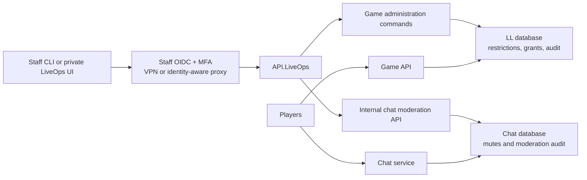

# LiveOps administration plan

## Decision

The existing Admin Dashboard remains a development-only content and diagnostics workbench. It must not be deployed against production data.

Production administration is handled through a separate LiveOps control plane:

1. `API.LiveOps` provides the only operator-facing production administration API.
2. The API authenticates staff through a dedicated OIDC identity provider with MFA and permission claims. Player credentials and player access tokens are not staff credentials.
3. A small CLI can call the API initially. A private web interface may be added later if the operational volume justifies it.
4. The web interface, if created, is a separate deployment artifact and is protected by a VPN or identity-aware access proxy. It is not part of the public game UI.

The security boundary is the API and its server-side authorization. Hiding a web dashboard is not an authorization mechanism.

## Architecture

## Existing dashboard boundary

`LL/src/API/API.AdminDashboard` and `LL/src/Presentation/dashboard` are treated as the Content Workbench. They edit content and run simulations, and their local loopback authorization model is intentionally unsuitable for production administration.

The workbench must:

- fail to start outside the Development environment;
- remain excluded from production deployment manifests;
- retain localhost-only CORS and loopback access;
- never receive production staff credentials or production player-data operations.

It may eventually be renamed to `ContentWorkbench`, but that rename is not required for the LiveOps boundary.

## Staff identity and permissions

LiveOps uses a separate JWT authority and audience. Production configuration must provide a real HTTPS OIDC authority and audience; no signing secret is stored in this repository.

Initial permissions:

- `liveops.read`: player search and account details;
- `liveops.chat.moderate`: mute and unmute chat;
- `liveops.accounts.moderate`: ban and unban accounts;
- `liveops.economy.compensate`: grant compensation items;
- `liveops.superadmin`: reserved for future break-glass operations.

Every action records the staff subject claim. Display name or email is recorded for convenience but is not the stable actor identifier.

## Audit and idempotency

All LL administration mutations write an append-only `AdminAction` entry containing:

- the client-generated operation ID;
- staff subject and display name;
- action type and permission used;
- target account and character IDs;
- mandatory reason and optional internal notes;
- sanitized action details;
- resource/reversal linkage;
- occurrence time.

The operation ID is the primary idempotency key. Retrying an identical operation returns the original result. Reusing an operation ID for a different action or target is rejected.

Chat keeps its own append-only `ChatModerationAction` audit because the Chat service owns mute enforcement. Revocations create new actions and do not delete prior history.

## Account bans

Account bans are modeled as temporal `AccountRestriction` records instead of an `IsBanned` flag. A restriction contains its reason, internal notes, creator, creation time, optional expiry, and revocation metadata.

Ban enforcement occurs at:

- password and external-provider login;
- refresh-token rotation;
- access-token validation for the Game API and Game SignalR connection establishment.

Applying a ban revokes active refresh tokens. Existing access tokens are rejected during server-side token validation even when their cryptographic expiry has not yet passed. Unbanning revokes the restriction record rather than deleting it.

Immediate disconnection of already-established SignalR connections is a later hardening task. Newly authenticated requests and new connections are rejected immediately.

## Chat mutes

Chat owns `ChatRestriction` records and evaluates them immediately before accepting a message. A mute does not prevent reading chat.

Initial mute scope is all player-authored channels. The model can later support per-channel scopes without changing staff authentication. Muting and unmuting are exposed only through a secret-authenticated internal Chat endpoint called by `API.LiveOps`.

## Shadow bans

Shadow bans are deliberately excluded from the initial implementation. Normal temporary mutes and account bans are easier to reason about and support.

If bot pressure later justifies silent handling, add a separately named `Quarantine` mode with these constraints:

- public channels only;
- sender echo is retained;
- other players do not receive the message;
- moderators can inspect quarantined messages;
- automatic expiry is mandatory;
- whispers and support communication are never silently suppressed.

## Compensation item grants

Compensation grants use the existing inventory item factory and inventory service. Direct table edits are prohibited.

Each request requires:

- a stable character ID;
- a catalog item-base ID;
- a bounded positive quantity;
- a mandatory reason or support reference;
- a client-generated operation ID.

The acquisition source is `admin-compensation`. The existing economy ledger records the acquisition and uses the administration operation ID as its correlation reference. The grant also queues the existing realtime inventory event through the transactional outbox.

For non-stackable items, one item instance is generated per requested unit. The initial API returns the generated instances; a future UI should preview requests and require confirmation before submitting them.

## Operator interface

The first operator interface should be a local CLI using staff OIDC and an authenticated private connection. This avoids deploying a browser application before there is enough operational usage to justify one.

If a UI is added, use a separate `LL/src/Presentation/liveops` application. It may share design tokens and non-sensitive UI components, but it must not share deployment, authentication storage, or API clients with the Content Workbench or public game application.

## Deployment and configuration

Application code lives in this repository. Infrastructure changes remain in the separate infrastructure-as-code repository.

Production deployment requires:

- a private `API.LiveOps` deployment and ingress policy;
- staff OIDC authority, audience, and permission claims;
- MFA enforcement at the identity provider;
- a Chat moderation base URL and service secret supplied through secret management;
- matching internal moderation secret in the Chat service;
- database migrations for LL administration state and Chat moderation state;
- alerts for permanent bans and unusually large compensation grants.

The migrations are generated but are not applied by development tooling. The existing Game API and Chat service startup paths do call `Database.MigrateAsync()`, so deploying either service will apply its pending migration. The production rollout must therefore back up and review each database before starting the updated service; changing that existing migration policy is outside this implementation.

## Delivery phases

### Phase 1: safety boundary and foundations

- Make the Content Workbench development-only.
- Add `API.LiveOps` with staff authentication and permission policies.
- Add read-only player search.
- Add append-only audit and idempotency.

### Phase 2: moderation

- Add account ban and unban operations.
- Revoke refresh tokens and enforce restrictions during authentication.
- Add Chat mute and unmute persistence and enforcement.
- Add the internal LiveOps-to-Chat moderation client.

### Phase 3: compensation

- Add idempotent item grants.
- Correlate the economy ledger with the administration action.
- Queue realtime inventory updates.
- Add grant limits and tests.

### Phase 4: operator experience and hardening

- Add a CLI and, only if warranted, a private LiveOps UI.
- Add step-up authentication for permanent bans and high-value grants.
- Add active SignalR disconnection after bans.
- Add operational alerts, break-glass procedures, and periodic audit review.
