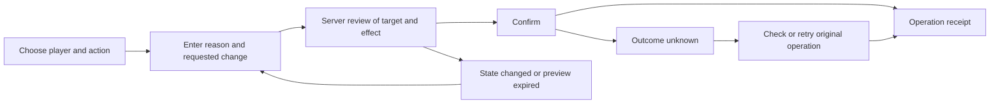

# LiveOps administrator usability review and improvement plan

**Date:** 28 September 2026  
**Audience:** Legends Legacy owner and administrator  
**Target:** `LL/src/Presentation/liveops` and `LL/src/API/API.LiveOps`, including the Game and Chat services behind their workflows  
**Baseline:** working tree at commit `977eaac91`, including the files present during this review

**Implementation follow-up:** the eight delivery slices are tracked in the [implementation and rollout record](liveops-administrator-implementation-2026-09-28.md). Findings below describe the reviewed baseline.

## Recommendation

Make LiveOps a workspace for completing administrative jobs. Its existing capabilities are substantial, but the interface makes the administrator search, interpret technical records, move between disconnected pages, and remember the context of each action. Adding more panels to the current layout will make that problem worse.

The highest-value change is a player workspace that answers **what happened, what can be done, and whether the action succeeded**, supported by a home page that identifies work needing attention. Keep the existing authorization, service boundaries, server previews, and audit mechanisms. Improve how the administrator reaches and understands them.

Deliver this in three practical stages:

1. **Make the current interface trustworthy:** fix hidden errors, stale target responses, form state crossing player boundaries, misleading availability labels, and inconsistent confirmation/retry behavior.
2. **Make ordinary work quick:** retain searches and tabs, improve typography, reorganize player information, connect investigations to actions, and show useful operation receipts.
3. **Make support work durable:** add lightweight cases, evidence and operation links, bounded compensation presets, and specific recovery workflows where the Game can support them safely.

Do not begin with an enterprise ticketing system, unrestricted content editing, bulk sanctions, or a new frontend framework. A solo administrator needs fewer steps and dependable context before more capabilities.

## How to use this document

- [Current capabilities](#current-capabilities) distinguishes implemented features from missing workflows.
- [Findings](#findings) explains concrete defects and usability obstacles, with evidence.
- [Proposed experience](#proposed-experience) describes the screens and interaction changes.
- [Administrative workflows](#administrative-workflows) gives examples of the tool in use.
- [Delivery plan](#delivery-plan) turns the recommendations into implementable slices.
- [Acceptance and verification](#acceptance-and-verification) defines what must work before calling the redesign successful.

## Review method and limits

This review inspected Angular routes, templates, component state, styles, API calls, controllers, selected application handlers, persistence queries, preview handling, operational status, existing tests, and the previous LiveOps plans. Source references appear throughout and are indexed at the end.

The compiled Angular application was also inspected in the browser using a temporary local server with synthetic responses derived from the repository's existing frontend test fixtures. All non-GET requests were rejected by that server. Browser checks covered the player finder, selected-player support view, and audit page. This verified actual template behavior and desktop presentation without accessing real player data or applying administrative actions.

Additional isolated checks executed the current component code with controlled responses to reproduce player-loading order, form-state carryover, and investigation-note retries. These checks validate frontend state behavior; they do not demonstrate a production incident or a backend authorization bypass.

The review did not authenticate to the deployed service, measure production latency or data volume, test a screen reader, or conduct a timed session with the administrator. Recommendations about task speed are proposed acceptance targets, not measured improvements. The default priority is a solo administrator handling support, moderation, and operational checks; actual support frequency can change the ordering of later features.

The delivered change is this document. No application behavior, database schema, configuration, or deployment was changed.

## Current capabilities

The tool is more developed than an initial moderation console. Several items in older roadmaps already exist and should be improved rather than rebuilt.

| Area | Implemented today | What still limits administrative use |
|---|---|---|
| Access and navigation | Owner-oriented authentication, environment identification, same-origin requests, five main navigation destinations, lazy-loaded routes | Limited session recovery; navigation reflects feature names rather than a connected support process |
| Status | Game database and Chat readiness, outbox counts, expiring restrictions, recent actions, release metadata, automatic 30-second refresh | Few routes from a warning to diagnosis; does not establish overall player-facing Game health or general worker health |
| Player lookup | Name, username/account label, email, account UUID, and character UUID search | First 20 results in the UI, no search pagination or completeness message, no retained search context when opening the first detail route |
| Support context | Account restrictions, session issuance, activity, balances, inventory summaries, guild, marketplace, transfers, synchronization | A broad snapshot rather than an issue-focused investigation; several bounded lists are not complete history |
| Equipment support | Holdings across inspected locations, equipment descriptors, retained dungeon run and saved reward rows, explicit truncation messages | No focused item/run search in the UI, no complete acquisition or reward history, no guided missing-reward resolution |
| Moderation | Account bans, multiplayer restrictions, Chat mutes, and revocation workflows | Fixed duration choices; reason and case reference conflated; context is scattered across tabs |
| Compensation | Catalog item search, quantity, equipment definition/tier/rank/style, server preview; Alpha Signet grants through a separate flow | Technical selection work, no reusable packages or case linkage; Signets use a different confirmation and receipt path |
| Transfer investigations | Review queue, signal explanations, connected accounts, risk history, transfer evidence, Chat cross-reference, timing analysis, review states and notes | Very long detail page; weak connection to the subject's player actions; evidence references often remain identifiers |
| Audit | Global Game/Chat explorer, filters, cursor pagination, expandable detail, bounded CSV export | Technical action names and JSON, incomplete action dropdown, filters mostly not shareable, no structured case model |
| Analytics | Daily population, return cohorts, content outcomes, adoption, and economy snapshots; report freshness information | Long tables and raw content keys; little comparison or prioritization; no visual trend despite retained daily reports |
| Additional API capabilities | Itemization analytics endpoint; equipment migration audit, preview, apply, and rollback endpoints | Not represented in the reviewed LiveOps frontend; these are separate product decisions, not missing buttons to expose indiscriminately |

Evidence: [routes][routes], [player UI][player-html], [support UI][support-html], [equipment support][equipment-html], [risk UI][risk-html], [risk detail][risk-detail-html], [audit UI][audit-html], [analytics UI][analytics-html], [analytics API][analytics-api], [migration API][migration-api].

### Foundations worth preserving

- The browser reaches Game and Chat administration through `API.LiveOps`.
- Account, Chat, and catalog-compensation actions already have server-generated previews and audited service operations.
- Partial support data has explicit source and availability information, and snapshot sections have bounded timeouts.
- Transfer investigations distinguish automated priority from human review status and explain evidence limitations.
- Equipment support acknowledges truncation and reads saved dungeon state without advancing or claiming the run.
- The global audit has stable paging and controlled export rather than an unrestricted data download.
- Transfer review already retains its queue when returning from an account; this is a useful pattern for the other pages.

These strengths are reasons to refine the current application incrementally. The missing piece is a consistent experience around them.

## Findings

Priority definitions: **P0** means fix before relying on a redesigned action workflow; **P1** means necessary for an effective daily workspace; **P2** means valuable expansion after that foundation. These are priorities for this improvement plan, not claims about observed production incidents.

### F01 Search failures and empty results can be invisible

**P0 · Browser-confirmed empty state; source-confirmed error placement**

The finder writes validation errors, API failures, and “No players matched that search” into `message`. The only message block is inside the selected-player branch. When no player is selected, the administrator can search unsuccessfully and receive no visible explanation. A failed player-detail load also leaves `selectedPlayer` empty and can hide the actual failure behind “Search for a player to begin.”

The local browser check searched for a value returning an empty list. The page continued to display its initial instructions without an empty-result message.

**Improve:** put search feedback next to the finder, give player-detail loading its own error/retry state, and reserve action feedback for the action being performed. Distinguish “no results,” “invalid input,” “not found,” “permission denied,” and “service unavailable.” Retain the query after every outcome.

**Done when:** each state is visible before any player has been selected; an unavailable service cannot look like an empty search.

Evidence: `searchPlayers()` and `loadPlayer()` in [player component][player-ts]; selected-player branch and message placement in [player template][player-html].

### F02 A late response can restore the wrong player context

**P0 · Reproduced in an isolated component check**

`loadPlayer()` accepts its response without checking whether the route still identifies that player. A controlled check requested A, then B, completed B first, and completed A last. The final selected player was A. Several secondary requests already guard against an old selection, but the primary detail load does not.

The transfer-investigation detail has a related source-level concern: its main load and separate timing/Chat-correlation loads do not check that their response still belongs to the current route. Its old `details` value also remains present during replacement loads.

This can confuse the displayed subject, route, and evidence. It is not proof that the backend accepts an incorrectly authorized target; the server previews remain valuable safeguards.

**Improve:** bind every request and result to the route's target and request generation, or cancel superseded loads. Clear or explicitly label obsolete details. Disable actions until the displayed identity and active route agree. Guard delayed errors and loading flags as well as successful responses.

**Done when:** rapid A-to-B switching with reversed response order always leaves B and B's evidence visible; a failed B load cannot reveal actionable A data.

Evidence: `loadPlayer()`, `refreshSelected()`, and existing guarded secondary loads in [player component][player-ts]; `load()` and correlation loaders in [investigation component][risk-detail-ts].

### F03 Action drafts and confirmation state are not consistently tied to a target

**P0 · Carryover reproduced; submission implications derived from source**

Changing player parameters within the reused detail component resets selected items and support data, but leaves several reasons, notes, durations, pending operation IDs, and Signet confirmation state. An isolated check confirmed that a ban reason and `signetConfirmation = true` survived loading another player.

For Signets, the next click can reach the submit branch if the confirmation flag remained true. For other actions, a reused operation ID with a different target or payload can create confusing conflicts. Neither outcome is an acceptable way for an administrator to discover that a draft belonged to someone else.

**Improve:** make a draft belong to an explicit environment, account/character, action, and payload. On a target change, close the preview and reset confirmation; either discard an untouched draft or offer an explicit way to save/return to an edited draft. A draft may never silently migrate to another player. Keep an uncertain submitted operation separate from a new draft so its original ID remains recoverable.

**Done when:** reasons and confirmations cannot carry into another player's action; retries retain the same ID only for the same intended operation.

Evidence: `loadPlayer()`, `clearPlayer()`, `pendingOperationIds`, and `grantAlphaSignets()` in [player component][player-ts].

### F04 Unavailable and stale information can appear reassuring

**P0 · Chat label browser-confirmed; stale-state handling source-confirmed**

The player header renders Chat as “Active” whenever `activeMute` is absent, even when `chatAvailable` is false. The local fixture displayed green “Active” above “Chat service is unavailable.” These statements convey different levels of certainty.

A support-snapshot refresh error is displayed only when no previous snapshot exists. If a refresh fails after a successful load, old values remain while the refresh error is hidden. Time-only source labels do not clearly explain how old that data is. The status page does display refresh errors, but the previous readiness result remains visible and needs an explicit stale qualification.

**Improve:** use separate concepts for player state and knowledge of that state: Active, Restricted, Unknown; Current, Refreshing, Stale, Unavailable. Always show refresh failures alongside retained data, with “Last successful update” including date, relative age, and time zone. A dependency outage should disable affected actions and explain why, while unrelated tools remain usable.

**Done when:** absent data cannot become a healthy label or zero count; a failed refresh visibly marks retained information as stale.

Evidence: [player header][player-html], top-level branches in [support template][support-html], [status component][status-ts].

### F05 Confirmation and result handling need one consistent contract

**P0 · Source-confirmed differences**

The shared action dialog contains useful target, operator, environment, warning, and expiry information. However, its backdrop still emits cancel while submission is in progress, although the Cancel button is disabled. The reviewed component does not implement focus trapping, focus restoration, or Escape handling. Expiry is displayed but does not disable the confirmation button locally; the server must reject expired previews.

Signets use an inline two-click confirmation instead of that shared preview flow. The server validates quantity, reason, recipient, and idempotency, and records issuance/movements, but the request has no preview token. Its success message does not provide the same operation reference as catalog compensation. Follow-up inspection during implementation confirmed that `NobilityRepository.AddIssuance()` already writes an `AlphaSignetsGranted` administration row. Preserve that existing receipt and improve its presentation and risk classification; do not add a duplicate audit write.

**Improve:** use a consistent action review and receipt experience, including an explicit target and effect. Add the necessary server preview contract for Signets rather than merely making its UI resemble the existing dialog. During submission, prevent accidental dismissal or retain a clearly visible in-progress receipt. Show expiry and a “Refresh preview” path. Keep final labels specific, such as “Mute until 18:00” or “Grant 2 items.”

**Done when:** every supported administrative mutation has an understandable review, an attributable result, and a defined recovery path. A busy or expired preview cannot appear ready to submit.

Evidence: [preview component][preview-ts], [preview template][preview-html], [Signet controller][signet-api], `GrantAlphaAsync()` in [Nobility service][nobility-service], [audit aggregation][audit-query].

### F06 Investigation retries can create a new operation for the same intention

**P0 · Note retry reproduced**

Investigation status updates and notes create a fresh UUID on each click. An isolated check retried an unchanged note after an uncertain failure and observed different operation IDs. If the first request succeeded but its response was lost, a second attempt can become a separate append-only operation.

The main moderation/compensation flow does retain IDs across an in-component retry. That behavior should become a common contract rather than an exception. Its pending state is currently memory-only, so reload and session recovery also need an explicit policy.

**Improve:** retain the operation ID, target, and exact submitted payload until the outcome is known. An ambiguous network error should say “Outcome unknown” and offer “Check result” or “Retry same operation.” A changed payload begins a new reviewed operation. Do not persist private evidence, message bodies, or preview tokens in ordinary browser storage to achieve this; a minimal protected operation reference or server-side draft can provide recovery.

**Done when:** lost responses cannot duplicate a note or grant through ordinary retry, and reauthentication does not silently invent a replacement operation.

Evidence: `updateStatus()` and `addNote()` in [investigation component][risk-detail-ts]; `runMutation()` in [player component][player-ts].

### F07 The interface repeatedly loses the administrator's place

**P1 · First player navigation browser-confirmed; remaining navigation reviewed in source**

Opening a search result moves from `/players` to the separate `/players/:characterId` route. In the browser check this recreated the finder with an empty query and no results. Player sections exist only in component state, so they are not directly linkable and reload returns to Support snapshot. Most audit filters also exist only in memory; the special dashboard risk query parameter is the exception.

Transfer review already caches its list when opening a detail and updates that cache after a review-state change. This is a useful start, but it is not a durable URL state or a freshness guarantee.

**Improve:** retain player search results, query, and position; use URL state for the selected player section and nonsensitive filters; provide a clear return link and breadcrumb. Preserve an audit's applied filters when visiting a player. Offer recent players without storing unnecessary personal data. Search terms containing email addresses need a deliberate privacy policy before being written into URLs or browser history.

**Done when:** Back restores the prior list, filters, and position; reload restores the selected section; returning to a cached queue shows when it was fetched and provides refresh.

Evidence: [routes][routes], [player component][player-ts], [audit component][audit-ts], [risk queue component][risk-ts], [risk queue state][risk-state].

### F08 The visual hierarchy makes useful information hard to read

**P1 · Browser inspection and stylesheet evidence**

The visual identity is coherent, but many operational labels and details use 7–10 px text. Navigation and form labels commonly use 11 px. Important source/freshness text is particularly small and subdued. The player page reserves 340 px for the finder at desktop widths, then spends substantial vertical space repeating identity, status, tabs, and snapshot identity before reaching the relevant evidence.

At the inspected desktop size, the player view's first screen was dominated by this framing. The audit page similarly exposed ten filters before its first result. Equipment details, transfers, correlation explanations, and technical metadata add further reading load below the fold.

**Improve:** use roughly 14–16 px for normal working text and 12–14 px for secondary metadata; reserve very small text for nonessential decoration. Make the finder collapsible after selection, keep a compact sticky identity/context header, and use progressive disclosure for diagnostics. Keep the familiar dark theme if preferred, but measure contrast on the actual chosen colors. Use clear focus indicators and an obvious active navigation state.

This review does not certify accessibility compliance or claim a measured contrast failure. Small text, dense layout, and missing explicit modal keyboard management are concrete reasons to perform that validation.

**Done when:** core tasks work at laptop widths and 200% zoom without clipped controls, a keyboard can complete search/review/cancel, and important meaning does not depend on color or tiny metadata.

Evidence: [global application styles][app-css], [player template][player-html], [audit template][audit-html], [preview component][preview-ts].

### F09 Support exposes records without guiding diagnosis

**P1 · Workflow gap**

The support snapshot can show a great deal: current activity, balances, acquisitions, compensation, transfers, equipment, dungeon rewards, marketplace activity, and synchronization. But a player report such as “my dungeon reward is missing” does not have a corresponding investigation entry point. The administrator must know which source is relevant and interpret multiple bounded histories.

There is no general support case workflow in the reviewed routes or controllers. Investigation notes do exist for account-risk review; they are not a substitute for a case about a missing item, stuck action, or purchase concern. “Reason or support reference” combines two different pieces of information and makes future retrieval dependent on free text.

**Improve:** provide a small issue selector: Missing reward/item, Activity not progressing, Account access, Chat issue, Transfer concern, Other. Each opens the relevant existing sections and tells the administrator what can and cannot be established. Add separate reason, case/reference, internal evidence, and resolution fields when durable cases are introduced.

**Done when:** the administrator can investigate common reports without knowing persistence terminology, and can record why an issue was resolved without issuing a game mutation merely to create a note.

Evidence: [support template][support-html], [equipment template][equipment-html], [player actions][player-html], [risk investigation notes][risk-detail-html], [existing roadmap][previous-roadmap].

### F10 Status cards do not consistently describe or lead to the work they count

**P1 · Source-confirmed semantics and navigation gaps**

Status is useful for checking LiveOps readiness. It is less useful for deciding what to do next: outbox failures and expiring restrictions do not lead to corresponding detail lists, while build details receive prominent space. Generic worker/job health is not provided by this status service.

Two labels need particular attention. “Bans expiring in 7 days” counts account restrictions without filtering the restriction type, so it can include multiplayer restrictions. “Permanent actions · 24h” counts Game actions classified Permanent, but its destination narrows to `AccountBanned`; permanent multiplayer restrictions can therefore contribute to the card without appearing in that view.

**Improve:** first make every label and drilldown use the same definition. Then add an attention list ranked by operational urgency, with the affected workflow, freshness, and a supported next step. Keep deployment identity in a collapsible technical section. Name this area's health scope honestly: LiveOps dependency readiness is not proof that combat, the Game API, all background jobs, or player realtime delivery is healthy.

**Done when:** clicking a metric explains its count using matching filters, and each actionable warning has a useful destination or a short diagnostic procedure.

Evidence: [status template][status-html], `openRiskAudit()` and audit risk mapping in [status component][status-ts] and [audit component][audit-ts], [status service][status-service].

### F11 Audit requires too much translation and can look more complete than it is

**P1 · Source-confirmed presentation and coverage limits**

Audit summaries display technical action types. The affected player is not a main summary column; details often show UUIDs and formatted JSON. The action dropdown includes bans, revocations, item grants, exports, mutes, and unmutes, but omits implemented multiplayer restriction and investigation actions.

The player header's “Recorded actions” is the length of the loaded combined timeline, not a lifetime total. The details query defaults to 50 records per source. Global audit maps returned Game and Chat operations to “Completed”; it is not a history of rejected attempts or ambiguous in-flight requests. The “Case or reference” filter is substring search in reason/authorized notes, not a case relationship.

**Improve:** show Time, Player/account, Action, Result, Reason, and Operator. Render known details as plain-language effect summaries and keep JSON under Technical details. Use a shared action catalogue for labels and filters, retaining a fallback for unknown future types. Provide a direct operation link, copy control, and player link. Label bounded player history “Recent actions loaded” and link to filtered global history. Treat a failed-attempt journal as a new backend feature, not a new filter over existing records.

**Done when:** an administrator can answer who changed what, for whom, why, and when without reading JSON; the screen explicitly states the history it covers.

Evidence: [audit template][audit-html], [audit component][audit-ts], [player-details query][player-query], [audit aggregation][audit-query], [administration repository][admin-repository].

### F12 Transfer investigations are rich but disconnected from resolution

**P1 · Workflow gap**

The investigation page already provides explainable signals and important caveats. However, its review controls appear after several large evidence sections. Connected accounts, timing matches, transfer IDs, and conversation summaries do not form a concise decision trail. Supporting transfer IDs are often rendered as code text, while clicking a transfer counterparty opens that other player's workspace. There is no prominent “Open this player's support workspace” action beside the investigated subject.

Filters in the transaction timeline apply to the loaded transfer sample, not the entire retained history. The page honestly states that bound; the redesign must preserve it. An empty filtered sample must not be presented as proof of no such transactions.

**Improve:** put a compact investigation summary and review-state control near the top. Provide Summary, Transfers, Conversation context, Timing, and Notes sections. Link the subject to its support workspace, each evidence reference to a focused record, and a chosen sanction to the existing moderation preview with the case context carried forward. Add Next unreviewed and Return to queue. Keep score, evidence completeness, and human decision separate.

Do not present account timing similarity or absent in-game messages as proof of shared ownership. Keep these limitations close to the relevant conclusions while moving long technical explanations into expandable detail.

**Done when:** an administrator can move from a flagged account to supporting evidence, record a disposition, and return to the queue without copying UUIDs or reconstructing the investigation.

Evidence: [investigation template][risk-detail-html], `filteredTransfers` and navigation methods in [investigation component][risk-detail-ts].

### F13 Compensation should start from the support problem

**P1 · Workflow gap, with P2 recovery capabilities**

The current flow expects the administrator to find an item, choose quantity, and sometimes choose equipment definition, tier, rank, and style. Its underlying preview is valuable, but the form mixes domain choices with implementation details. Alpha Signets appear before the catalog form in the same Compensation section, even though they have a distinct purpose.

**Improve:** separate Item compensation and Signets/Nobility. For items, begin with the reason/case and relevant evidence, then offer a small versioned set of administrator-approved presets plus Custom. Show item names, icons where available, binding, resulting stats, quantity, limits, and the exact player. Expose IDs as copyable details rather than the primary choice label. Show recent related grants before confirmation to help identify duplicate compensation, while retaining server idempotency as the actual duplicate-request protection.

Do not label compensation “Restore original reward” unless the Game can establish and restore that entitlement. An arbitrary replacement grant and fulfillment of an unclaimed reward are different operations. Currency adjustments, corrections, missing-purchase repair, and job retries need their own bounded domain commands and receipts before they get buttons.

**Done when:** ordinary compensation is understandable from the preview; an unsupported recovery explains what evidence is missing instead of offering a generic balance or database editor.

Evidence: [compensation UI][player-html], [preview service][preview-service], [equipment support][equipment-html], [Signet service][nobility-service].

### F14 Analytics needs to help answer questions

**P1 for presentation · P2 for additional data**

The daily analytics page already describes UTC days, report generation, cohort sizes, small samples, and the difference between activity and current adoption. Those definitions are useful. The main presentation is nevertheless a sequence of tables, including a “Daily user trend” table, raw content keys, and level/cohort rows with limited filtering.

**Improve:** add a small population trend, previous comparable-period values, readable content names, and filters for content kind, level band, and cohort. Start with four questions: Are players returning? Where are runs ending in failure? Which systems are being adopted? How are retained balances distributed? Make each chart available as a table as well. Preserve denominators, coverage, and report freshness.

Do not calculate a completion rate by dividing the current `completed` count by the current `started` count: starts and results are counted on their own calendar days and may refer to different runs. A true run completion rate needs a joined/cohort-based report. Balance percentiles are not currency creation/destruction; selected combat style is not usage. These distinctions should guide the visuals.

The itemization report already has an API endpoint but no reviewed frontend view. Inspect its schema and actual report coverage before commissioning a separate telemetry system or promising particular charts.

**Done when:** the administrator can see a change and inspect its definition and sample, without the chart suggesting causality or data coverage the underlying report does not provide.

Evidence: [analytics template][analytics-html], [analytics component][analytics-ts], [analytics controller][analytics-api].

### F15 Session recovery and timestamps need to support interrupted work

**P1 · Source review**

The shell initializes the session once. Some components turn a later 401 into “Sign in again,” but there is no shared recovery action in those messages. On initial non-401 session failure the shell can finish loading without a session and without entering the login branch, leaving no useful rendered recovery content. Login also drops query parameters from its return URL.

Most working screens use local date formatting without a visible time-zone label, while Analytics explicitly uses UTC reporting days. Duration expiry is calculated from the browser clock even though the status page already knows clock skew is possible.

**Improve:** add a consistent session/unavailable state with Retry and Sign in actions. Preserve the intended route and safe draft context through reauthentication, then revalidate any preview. Label operational dates with a chosen zone and provide UTC on inspection/copy. Prefer server-interpreted durations for sanctions; show both “24 hours” and the exact expiry. Add custom expiry and useful duration presets when supported by validation.

**Done when:** an expired session cannot strand the operator or change the target, and exact restriction expiry is unambiguous across local time and UTC.

Evidence: [application shell][app-ts], `errorMessage()` and `expiresAt()` in [player component][player-ts], [audit date conversion][audit-ts], [analytics template][analytics-html].

## Proposed experience

### Navigation organized around administrative jobs

Use the existing route boundaries as the starting point. New labels do not require replacing every URL immediately; preserve old links with redirects where routes change.

| Destination | Administrator's question | Initial content |
|---|---|---|
| Overview | What needs my attention? | Dependency/readiness summary, actionable exceptions, work to resume, recent actions |
| Players | What happened to this player? | Search and a persistent player workspace |
| Investigations | Which flagged activity needs review? | Existing transfer queue and evidence workflows, clearly named as direct-transfer coverage |
| Activity log | What changed and did it finish? | Existing global audit with readable summaries and operation detail |
| Analytics | How is the game behaving over time? | Existing daily reports with comparisons and visual trends |
| Cases, added later | What am I working on or waiting for? | Minimal support queue linked to players and operations |

Do not expose an empty Operations or Content area just to complete the navigation. Add it when there is at least one supported workflow, such as an announcement with preview and expiry. Keep the existing development content workbench separate from production administration.

A global search can begin as a player search accessible from every page. Later it can resolve a pasted operation ID or case reference, using typed results such as Player, Account, Operation, and Case. It should never guess a mutation target from ambiguous search text.

### Overview should be a short work list

The first screen should contain:

1. A compact environment and readiness strip with the last successful update.
2. An attention list: what is affected, how long it has been affected, and where to inspect it.
3. Current work: open investigations and, once implemented, cases waiting for action.
4. Recent administrative operations with readable effects and direct links.

Use current data honestly. Outbox failure counts can support an initial diagnostic link. A list of delayed rewards, stuck runs, or failed background jobs requires a corresponding bounded read API and clear detection rules first. Do not fabricate attention items from missing data.

Example layout, using illustrative states rather than observed operational values:

```text
Legends Legacy administration    [Environment]    [Find player / reference]

Overview | Players | Investigations | Activity log | Analytics

Readiness: Partial availability        Updated 30 seconds ago [Refresh]

Needs attention
  Chat unavailable      Mutes cannot be changed       [View dependency]
  Delivery failures     Player updates may be delayed [Inspect failures]

Resume work                            Recent operations
  Investigation for Player A           Granted 2 items to Player B
  Case waiting for evidence            Restored multiplayer for Player C

[Technical service and release details]
```

### Player workspace should keep identity and purpose visible

A compact header should keep the player name, level, account relationship, environment, restrictions, and data age visible. The account and character scopes must be explicit: a ban or multiplayer restriction affects the account; item compensation and Chat actions use a character target. Do not call a player “online” based on session issuance.

Use these sections, consolidating if needed to avoid an unwieldy tab bar:

| Section | Contents and behavior |
|---|---|
| Summary | Current activity, restrictions, balances, known exceptions, recent relevant operations, and “Investigate an issue” shortcuts |
| Inventory and rewards | Equipment/holdings, acquisitions, retained dungeon rewards, search and coverage labels; location and status first, technical descriptor second |
| Activity and transfers | Game activity, marketplace evidence, transfers, focused conversation context, links to counterparties |
| Moderation | Current and past restrictions, Chat moderation, reason/category, duration/expiry, and explicit target scope |
| Support history | Cases when available, notes, related compensation, and an operation timeline linked to global audit |

Compensation should open from a clear action within the player workspace, with the target fixed throughout. Avoid showing every mutation form on the summary page. A short action list is sufficient; there is no need for a large command-palette implementation in the first slice.

```text
[Back to search results]     Player A · Level 42     Account 123… [Copy]
Environment: Development    Account access: Active    Chat: Unknown
Last successful update: 2 minutes ago                 [Refresh]

[Investigate issue] [Compensate] [Moderation] [View activity]

Summary | Inventory and rewards | Activity and transfers | Support history

Needs attention                     Current state
  Activity data unavailable         Current activity and location
  [Retry activity]                  Selected balances and restrictions

Recent operations                   Current case or investigation
  Human-readable effect             Reason, evidence, next step
  [Open receipt]                    [Open details]
```

### Use plain operational language

Keep technical facts accessible while leading with their administrative meaning.

| Current phrasing or presentation | Preferred presentation |
|---|---|
| `CompensationItemsGranted` | “Granted 2 × Item name” with the operation type in details |
| “Inventory rows” | “Inventory entries” with an explanation of stacks; do not relabel this as capacity |
| “Generation” | “Action scheduling details” in an expandable diagnostic area |
| “Realtime outbox” | “Player update delivery” with pending/failed definitions and technical details |
| “No pending-reward registry exists” | “This view cannot verify all pending rewards” plus the available inspection scope |
| “Uses the game inventory service, economy ledger, and realtime outbox” | “Grants these items to the selected character and records the result” |
| “Case or reference” over substring search | “Reason/reference text” until a structured case filter exists |
| “Active” when Chat cannot be reached | “Unknown — Chat unavailable” |

Keep source names, immutable IDs, raw measurements, and JSON available under details. They are useful when investigating an unusual issue, but should not be the first thing required to understand routine work.

### Standardize the action lifecycle

Every action should follow the same visible sequence:



A receipt should show the operation reference, target, action, effect, server timestamp, and case link where applicable. Separate **the Game accepted the operation** from **the player has received a realtime update**; do not report the second unless delivery is actually observed. Link to the audit record and provide a copyable support summary.

Correction must be a new linked operation when the domain supports it. Do not offer universal Undo for consumed, traded, redeemed, or otherwise transformed assets.

### Add a small case model after navigation and trust fixes

For a solo administrator, a useful first case model is deliberately small:

- Case ID and optional external reference.
- Category, short summary, related account and character IDs.
- Open, Waiting, Resolved, and Closed states.
- Append-only notes, evidence references, and linked operation IDs.
- Resolution text and timestamps.

Do not add assignments, escalations, approval chains, SLA timers, or a separate ticketing platform until another operator or actual workload requires them. Reuse the existing investigation-note conventions without rewriting historical notes or forcing every transfer flag into a case.

Evidence references should be bounded and authorized. Private Chat excerpts should be opened for a relevant investigation and retained only according to an explicit evidence policy. A generalized case system should not silently copy complete message histories into notes or exports.

## Administrative workflows

### Investigate a missing dungeon reward

**Today:** find the player, inspect the large snapshot, locate retained dungeon data and equipment, compare acquisitions/transfers/compensation, then independently prepare an item grant. The administrator must remember why the grant is appropriate and whether another grant already addressed the report.

**Proposed:**

1. Open the player and choose Missing reward/item.
2. Identify the reported dungeon/run and time. Show retained run status, saved reward rows, claim timestamp, inspected holdings, and available acquisition/transfer evidence together.
3. Clearly distinguish retained evidence, truncated data, missing historical coverage, and unavailable dependencies.
4. Check linked and recent compensation before proposing a resolution.
5. Record the finding. If the evidence supports discretionary compensation, open a bounded grant draft linked to that finding.
6. Review and submit, then show a receipt and a separate delivery state if known.

**Data boundary:** the current retained dungeon snapshot is useful but cannot establish every historical entitlement. A future exact reward recovery needs a stable reward/run receipt and duplicate-claim protection. Until then, explain the limit and offer only supported compensation.

### Review a transfer flag and decide what to do

**Today:** open the transfer queue, read a long detail page, inspect relationships and correlations, scroll to notes/status, and separately reach moderation if a sanction is warranted.

**Proposed:** open a concise explanation, inspect the supporting transfers and conversation context, record the disposition, and choose an appropriate next step. “Open player” and “Next unreviewed” remain visible. If moderation is needed, carry the investigation reference into the existing player action review, but require an explicit reason and confirmation.

**Success condition:** the evidence, human decision, and resulting operation remain linked. Automated priority never becomes automatic sanctioning.

### Investigate a report that activity has stopped progressing

**Today:** current action scheduling and synchronization are visible but require technical interpretation; LiveOps does not provide a general worker incident workflow.

**Proposed:** show the action's expected next resolution, last observed mutation, retained restriction/block state, and delivery status with plain-language interpretations. Distinguish a legitimately waiting action from unavailable evidence or an overdue schedule. Link a system-wide issue to operational diagnostics.

**Data boundary:** do not infer “stuck” solely from a timestamp without the action's scheduling rules. A future retry or repair command must go through the owning Game workflow, check current state, and record its effect. No “set action state” editor.

### Apply or revoke a restriction

**Today:** find the player, choose Account or Chat, select one of four durations, enter free text, review, submit, and inspect a success reference.

**Proposed:** see current restrictions and relevant prior actions beside the form. Separate player-facing reason from private evidence and case reference. Show whether the action affects the whole account, shared-game access, or one character's Chat. Display an exact server-derived expiry before confirmation. On success, show the new restriction and a linked receipt; revocation has its own reason and history.

**Success condition:** scope, duration, and rationale are obvious, and unavailable Chat cannot prevent unrelated account work.

### Check the game at the start of an administration session

**Today:** Status shows useful readiness and metrics, then the administrator visits other pages to work out whether anything needs attention.

**Proposed:** Overview first identifies unavailable tools and unresolved operational exceptions, then offers work to resume. Analytics provides recent trends as a separate, clearly dated view. A daily report must not masquerade as live health.

**Success condition:** within a short scan the administrator knows what can be done, what requires investigation, and which displayed information is old or incomplete.

## Delivery plan

### Suggested slices and dependencies

Effort bands are relative: **S** is a narrow component/presentation change, **M** spans several components or one read API, and **L** introduces persistent workflow or multiple service contracts. They are not calendar estimates.

| Order | Slice | Scope and value | Effort | Dependencies | Completion gate |
|---|---|---|---|---|---|
| 1 | Trust and recovery fixes | F01–F06 plus initial shell error recovery; correct errors, target binding, draft reset, stale state, preview dismissal, retries | M | Existing interfaces; Signet preview/receipt parity may need its own backend sub-slice | Adverse-state tests pass; no cross-player draft/response leakage |
| 2 | Persistent navigation and readable layout | Retained player finder, linkable sections, audit filter state, compact identity, larger text, focused keyboard behavior | M | Slice 1 state model | Search → player → action/history → Back retains context |
| 3 | Task-oriented player support | Summary and issue shortcuts, inventory/reward organization, readable evidence and operation receipts | M | Slices 1–2 | Missing-item and activity investigations are possible without JSON or copied IDs |
| 4 | Connected investigations and audit | Subject links, next/return controls, focused evidence links, action catalogue, clear history coverage | M | Shared navigation and receipt conventions | A transfer review reaches a recorded disposition and related action |
| 5 | Useful operational overview | Correct metric definitions, drilldowns, freshness, concise diagnostics, current work links | S–M initially; L for new incident data | Existing status first; new bounded read contracts for jobs/incidents | Every attention item explains impact and offers a supported next step |
| 6 | Minimal support cases | Case/notes/links, player support history, resolution, optional external reference | L | Stable operation references and completed workflow design | A case can be investigated, acted on, resumed, and resolved |
| 7 | Compensation presets and specific recovery | Small versioned packages; separate Signet experience; domain-specific repairs only where receipts support them | M for presets; L for recovery | Cases optional initially; server validation and preview required | No ambiguity between compensation and exact restoration |
| 8 | Analytics presentation | Trends, comparable periods, human names, filters, correct denominators; itemization view after schema review | M | Existing daily reports; new metrics only where necessary | Administrator can inspect a trend and its precise definition |
| Later | Game-wide operations | Announcements, maintenance communication, scheduled content/flags when there is a demonstrated need | L per supported workflow | Domain ownership, preview, expiry, audit, rollback/compensation design | Reviewed separately; no arbitrary configuration editor |

Slices 2–5 form the first useful daily-administration release. Do not wait for a full case system to ship them. Conversely, finishing a visual redesign does not eliminate the need for slice 1.

### Concrete first implementation brief

The next implementation request should be **Make player selection and administrative feedback reliable**:

1. Move finder and player-load errors into always-visible, local feedback regions.
2. Add target/request guards to player details, refreshes, and investigation evidence loads.
3. Reset or explicitly retain target-bound drafts; clear confirmation and preview state on target changes.
4. Render unknown Chat and stale snapshot states correctly, including refresh failure over existing data.
5. Retain player search context across opening a detail and returning to the list.
6. Prevent preview backdrop dismissal while submitting; add deliberate focus/keyboard handling and an expiry recovery path.
7. Preserve investigation operation IDs across uncertain retries.
8. Cover these behaviors with meaningful regression tests and a browser walkthrough.

Keep Signet server-preview parity and unified issuance visibility as a clearly tracked follow-on if they cannot fit that slice. Do not present them as solved by changing button text. Close the confirmed target/confirmation carryover in the first slice regardless.

### Architecture and implementation choices

- Retain Angular and the existing routed features. Split the large player feature around actual workflow sections; do not introduce a generic dynamic form engine just to share a handful of controls.
- Share a small set of patterns: target identity, data state/freshness, human action labels, operation receipt, exact time display, copyable identifier, and action review.
- Treat UI permission checks as presentation only. The API remains authoritative, including direct requests to new case, evidence, or recovery endpoints.
- Keep controllers thin, use existing application/CQRS patterns, place administrative rules in Core/application services, and keep persistence implementation in Infrastructure. Do not make Core depend on the presentation or LiveOps host.
- Keep large evidence queries bounded and paginated. Add a narrow read contract when needed rather than fetching every support section on every tab change. The current snapshot gathers sections concurrently but waits for the combined result; it is not streaming progressive section delivery.
- Keep historical operations immutable. Add links and new corrective records rather than rewriting prior reasons, receipts, or evidence.
- Reuse existing game-owned receipts and commands before designing repair controls. Backend-only equipment migration tools should be evaluated as a separate owner maintenance workflow, not casually placed in everyday Compensation.
- Keep development content authoring separate. A production catalog can begin read-only; content activation needs versioning, validation, environment scope, and its own reviewed design.

### Data, configuration, and deployment implications

| Change | Expected implication for a later implementation |
|---|---|
| Navigation, typography, labels, local feedback, target guards | Primarily frontend changes; no schema migration inherently required |
| Matching status counts and drilldowns | Read-model/query changes; review existing indexes and result bounds |
| Unified Signet preview and activity visibility | API and service contracts plus receipt/audit integration; preserve existing issuance identity and do not duplicate grants |
| Structured support cases and durable drafts | New persisted models and likely EF Core migrations; define note visibility, retention, concurrency, and operation links |
| Persisted failed/replayed attempt history | New event/attempt model and retention policy; do not imply existing completed-action rows already contain it |
| Compensation packages | Versioned server-owned definitions, caps, preview expansion, and package version in receipts; avoid environment-specific values in source |
| Exact reward recovery, currency compensation, corrections | Domain-specific commands, entitlement/provenance checks, ledger/receipt design, and concurrency/idempotency coverage |
| Job health, announcements, maintenance or event controls | New read/write integrations and runtime configuration as required by their owner services; separate rollout review |

Implementation should preserve the private LiveOps access boundary and same-origin browser model. Infrastructure-as-code remains in its separate repository. Deployment and applying migrations to shared or production databases are outside this analysis and require a later explicitly scoped rollout. No deployment or migration is needed to adopt this document.

## Acceptance and verification

### Administrative acceptance scenarios

Use seeded non-production accounts and deliberately varied service states. Have the administrator perform these tasks rather than only reviewing screenshots.

| Scenario | Proposed acceptance criterion |
|---|---|
| Find and reopen a player | Reach the correct record and identify restriction state in about 30 seconds; Back restores the query/results |
| Investigate a missing item | Find available holdings/run/acquisition evidence in about two minutes, and accurately explain any coverage limit |
| Complete bounded compensation | Review exact target/effect, submit once, and find the resulting receipt without manually handling an operation UUID |
| Review a transfer flag | Follow evidence, record a disposition, open the subject's support record, and resume the queue without losing context |
| Dependency outage | Chat displays Unknown/Unavailable; affected actions explain why they are blocked; unrelated workflows remain usable |
| Lost response | The UI reports uncertainty and reuses the same operation when retrying; no duplicate effect or note |
| Session expiry | Sign in and return to the correct context; submitted operations are resolved before another is created |
| Keyboard and zoom | Search, navigation, review, cancellation, and error recovery remain usable using the keyboard and at 200% zoom |

The times are design targets to validate with the administrator, not promises based on current measurements. Measure task completion, wrong-target near misses, unresolved outcome states, and use of external database/log tools. Avoid collecting private reasons or Chat text as usability telemetry.

### Required regression scenarios for implementation

- Empty/invalid player search, search API failure, nonexistent player, initial session failure, and expired session.
- A-to-B navigation with A responding last, including old errors, refreshes, and evidence requests.
- Draft and confirmation reset on target change, including Signets and pending operations.
- Successful snapshot followed by failed refresh; unavailable Chat with no mute data; unavailable metrics versus real zero.
- Preview expiry, server state conflict, keyboard focus, repeated submit, and attempted backdrop dismissal during submit.
- Lost response followed by retry for grants, restriction changes, notes, and investigation status changes.
- Dashboard counts and their detail filters using the same action/type/time-window definitions.
- Account-level versus character-level actions; multiple matching characters; bounded/truncated history and evidence.
- Readable audit entries for all currently implemented action types and safe fallback rendering of unfamiliar types.
- Small analytics cohorts, missing reports, stale reports, and separate start/result date semantics.

Future backend tests must use the repository wrapper, for example `./build/run-tests.ps1 -Filter '<relevant test filter>'`. Frontend verification uses npm with its cache outside the checkout. Add tests around actual failure modes and domain effects, rather than tests that only mirror template structure.

### Verification performed for this review

| Check | Result |
|---|---|
| `npm test` in `LL/src/Presentation/liveops`, cache under the system temporary directory | Passed: 35 tests |
| `npm run build` in `LL/src/Presentation/liveops` | Passed: production bundle built successfully |
| Browser review of the compiled frontend with GET-only synthetic fixtures | Confirmed missing empty-search feedback, finder context loss on first detail navigation, and misleading Chat Active label; inspected player and audit layout |
| Isolated execution of current component code with controlled responses | Confirmed reversed-response player selection, reason/Signet-confirmation carryover, and fresh operation IDs when retrying the same investigation note |
| Markdown source/link and whitespace checks | Performed before delivery |

Backend tests were not run: no backend implementation changed, and the local browser review used synthetic responses. Deployed authentication, actual database behavior, Chat integration, production performance, and complete accessibility testing remain unverified. The passing existing frontend suite does not cover all of the adverse cases above.

## Relationship to earlier LiveOps plans

The [original implementation plan][previous-implementation] established the private administration boundary and explicitly aimed to avoid requiring operators to handle raw GUIDs and JSON. That remains the right direction.

The [additions roadmap][previous-roadmap] correctly identifies cases, compensation packages, and operational controls as future work. Its implemented status, audit, preview, and support-snapshot sections are now the baseline. This review changes the immediate order: repair reliability and administrative usability before expanding those surfaces. It also accounts for newer transfer investigations, equipment/dungeon support, Signets, and analytics rather than treating the application as its earlier MVP.

Use this review as the current usability backlog. Keep the older documents as architectural and feature-history references; do not interpret every item in them as still unimplemented.

## Source index

The links below identify the reviewed implementation. Function names in the findings provide stable search targets as line numbers change.

| Source | Main evidence |
|---|---|
| [Routes][routes] and [application shell][app-ts] | Navigation, session startup, return URL handling |
| [Player template][player-html] and [component][player-ts] | Finder feedback, player loading, action drafts, Signets, section state, retries |
| [Support template][support-html] and [equipment template][equipment-html] | Snapshot hierarchy, stale errors, holdings/reward coverage |
| [Support snapshot service][support-service] | Bounded section reads, source data, parallel aggregation |
| [Preview template][preview-html], [component][preview-ts], and [service][preview-service] | Confirmation presentation, busy/expiry handling, server validation |
| [Status template][status-html], [component][status-ts], and [service][status-service] | Readiness scope, metrics, labels, drilldowns |
| [Audit template][audit-html], [component][audit-ts], and [query][audit-query] | Filters, results, outcomes, raw details, navigation |
| [Player-details query][player-query] and [administration repository][admin-repository] | Search and history limits, reference matching |
| [Risk queue template][risk-html], [component][risk-ts], and [state service][risk-state] | Existing queue workflow and restoration |
| [Investigation template][risk-detail-html] and [component][risk-detail-ts] | Evidence presentation, navigation, review/notes, response handling |
| [Analytics template][analytics-html], [component][analytics-ts], and [API][analytics-api] | Existing reporting semantics and presentation |
| [Signet API][signet-api] and [Nobility service][nobility-service] | Separate issuance and confirmation path |
| [Equipment migration API][migration-api] | Existing maintenance endpoints without reviewed frontend routes |
| [Application stylesheet][app-css] | Typography, desktop finder width, density, responsive rules |

[routes]: ../LL/src/Presentation/liveops/src/app/app.routes.ts
[app-ts]: ../LL/src/Presentation/liveops/src/app/app.component.ts
[player-html]: ../LL/src/Presentation/liveops/src/app/features/players/player-workspace.component.html
[player-ts]: ../LL/src/Presentation/liveops/src/app/features/players/player-workspace.component.ts
[support-html]: ../LL/src/Presentation/liveops/src/app/shared/support-snapshot/support-snapshot.component.html
[equipment-html]: ../LL/src/Presentation/liveops/src/app/shared/support-snapshot/equipment-support.component.html
[support-service]: ../LL/src/API/API.LiveOps/Support/LiveOpsPlayerSupportSnapshotService.cs
[preview-html]: ../LL/src/Presentation/liveops/src/app/shared/action-preview/action-preview.component.html
[preview-ts]: ../LL/src/Presentation/liveops/src/app/shared/action-preview/action-preview.component.ts
[preview-service]: ../LL/src/API/API.LiveOps/Previews/LiveOpsActionPreviewService.cs
[status-html]: ../LL/src/Presentation/liveops/src/app/features/dashboard/dashboard.component.html
[status-ts]: ../LL/src/Presentation/liveops/src/app/features/dashboard/dashboard.component.ts
[status-service]: ../LL/src/API/API.LiveOps/Health/LiveOpsOperationalStatusService.cs
[audit-html]: ../LL/src/Presentation/liveops/src/app/features/audit/audit.component.html
[audit-ts]: ../LL/src/Presentation/liveops/src/app/features/audit/audit.component.ts
[audit-query]: ../LL/src/Core/Application/UseCases/Administration/Queries/GetAdministrationAudit/GetAdministrationAuditQuery.cs
[player-query]: ../LL/src/Core/Application/UseCases/Administration/Queries/GetPlayerAdministrationDetails/GetPlayerAdministrationDetailsQuery.cs
[admin-repository]: ../LL/src/Infrastructure/Persistence/Persistence.LL/Repositories/Administration/AdministrationRepository.cs
[risk-html]: ../LL/src/Presentation/liveops/src/app/features/account-risk/account-risk.component.html
[risk-ts]: ../LL/src/Presentation/liveops/src/app/features/account-risk/account-risk.component.ts
[risk-state]: ../LL/src/Presentation/liveops/src/app/features/account-risk/account-risk-list-state.service.ts
[risk-detail-html]: ../LL/src/Presentation/liveops/src/app/features/account-risk/account-risk-detail.component.html
[risk-detail-ts]: ../LL/src/Presentation/liveops/src/app/features/account-risk/account-risk-detail.component.ts
[analytics-html]: ../LL/src/Presentation/liveops/src/app/features/analytics/analytics.component.html
[analytics-ts]: ../LL/src/Presentation/liveops/src/app/features/analytics/analytics.component.ts
[analytics-api]: ../LL/src/API/API.LiveOps/Controllers/AnalyticsController.cs
[signet-api]: ../LL/src/API/API.LiveOps/Controllers/NobilityController.cs
[nobility-service]: ../LL/src/Infrastructure/Service/Services.LL/Nobility/NobilityService.cs
[migration-api]: ../LL/src/API/API.LiveOps/Controllers/EquipmentMigrationController.cs
[app-css]: ../LL/src/Presentation/liveops/src/app/app.component.css
[previous-implementation]: liveops-dashboard-implementation-plan.md
[previous-roadmap]: liveops-dashboard-additions-roadmap.md
