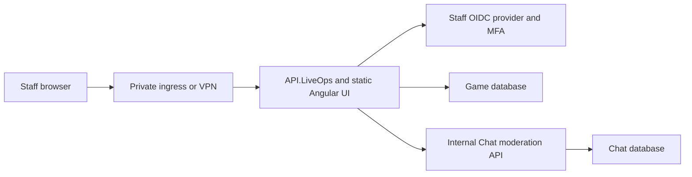

# LiveOps dashboard implementation plan

## Outcome

Build a new, private LiveOps dashboard for production administration. Keep the existing Admin Dashboard as a Development-only content workbench.

The finished operator experience should be:

1. Open the private LiveOps URL.
2. Sign in through the staff identity provider with MFA.
3. Search for a player by character name, account label, email, account ID, or character ID.
4. Review the exact target and its current restrictions.
5. Ban or unban the account, mute or unmute chat, or grant compensation items.
6. Enter a mandatory reason, confirm the action, and receive an auditable result.

Operators must not need to handle bearer tokens, operation GUIDs, restriction GUIDs, or raw JSON.

## Implementation status

The local MVP described in work packages 1–4 is implemented:

- `API.LiveOps` supports browser OIDC/cookie sessions, a loopback-only Development operator, antiforgery validation, permission policies, and production configuration checks.
- Player details combine Game restrictions/history with Chat mute state/history without allowing a Chat outage to hide Game administration.
- The new Angular dashboard supports player and item search, ban/unban, mute/unmute, compensation grants, confirmation safeguards, idempotent retries, and a combined audit timeline.
- Angular release output is copied into `API.LiveOps` during `dotnet publish`, and the exact local startup procedure is in the dashboard README.

Production rollout remains intentionally external to this repository: staff identity-provider registration and MFA policy, private ingress/VPN and DNS, deployment secrets, monitoring, backups, and staging sign-off must be completed through the infrastructure/deployment systems.

## Decision: create a new dashboard

Create `LL/src/Presentation/liveops` instead of turning `LL/src/Presentation/dashboard` into a production tool.

The existing dashboard is tied to `API.AdminDashboard`, item/content editing, and combat diagnostics. Its backend intentionally refuses to run outside Development and authorizes only loopback access. Mixing those capabilities with production player administration would make the security boundary difficult to understand and easy to weaken later.

The new dashboard may copy or extract non-sensitive visual assets and generic UI components from the existing Angular dashboard, including:

- design tokens and typography;
- layout, buttons, modal, toast, and tab components;
- generic item tooltips and item icons.

It must not reuse the existing dashboard's API service, authentication assumptions, content-editing routes, or deployment configuration.

## Recommended architecture

Use `API.LiveOps` as both the administration API and a backend-for-frontend for the new Angular application.



`API.LiveOps` should serve the compiled Angular files and own the OIDC session. The browser receives an encrypted, HTTP-only session cookie; OAuth access and refresh tokens remain on the server and are never stored in browser JavaScript.

This produces one private deployment, one origin, no production CORS requirement, and a smaller token-theft surface than a standalone SPA holding bearer tokens. Existing bearer authentication can remain available for a future CLI or automation client.

## MVP dashboard scope

### Authentication and shell

- Staff OIDC login and logout.
- MFA enforced by the identity provider.
- Current staff identity and granted permissions displayed in the header.
- Access-denied page for authenticated staff without the required permission.
- Session-expiry handling that returns the operator to login without losing an unsent form.
- Clear environment banner: Local, Development, Staging, or Production.
- Production uses a red, persistent environment indicator.

### Player search

- Search by character name, account label, email, account ID, or character ID.
- Require at least two characters for text searches.
- Show account ID and character ID without making the operator copy them.
- Show character level, account creation date, active ban, and active chat mute.
- Require selection of one exact result before enabling mutations.

### Account moderation

- Temporary ban with a date/time or friendly duration.
- Permanent ban with an additional confirmation step.
- Mandatory reason or support-ticket reference.
- Optional internal notes.
- Unban the currently active restriction without asking for its GUID.
- Display the existing restriction and its creator before unbanning.

### Chat moderation

- Temporary or permanent mute.
- Unmute the currently active mute without asking for its GUID.
- Mandatory reason.
- State clearly that a mute prevents sending but not reading chat.
- Shadow ban or quarantine is not part of the MVP. A hidden restriction is difficult for support staff to explain and requires explicit product decisions about who can see each message. If it is added later, model it as a separate permissioned restriction with its own expiry, audit event, appeal policy, UI copy, and tests; do not overload the ordinary mute flag.

### Compensation grants

- Search the server item catalog by item ID or display name.
- Show item name, ID, type, rarity, stackability, and bound state.
- Validate quantity against the server-configured maximum.
- Mandatory reason and optional internal notes.
- Preview the exact grant before submission.
- Stronger confirmation for non-stackable or unusually large grants.
- Show the resulting operation ID and generated item instances after success.

### Audit history

- Timeline of actions for the selected account and character.
- Show actor, action, reason, target, timestamp, expiry, revocation, and operation ID.
- Allow copying an operation ID for support or incident investigation.
- Read-only: audit records can never be edited or deleted from the UI.

## Backend work required

The mutation endpoints already exist. The dashboard needs additional read models and browser authentication.

### 1. Browser authentication in `API.LiveOps`

Add cookie and OpenID Connect authentication alongside the existing JWT bearer scheme:

- cookie scheme for interactive dashboard sessions;
- OIDC authorization-code flow with PKCE;
- bearer scheme retained for a future CLI;
- policy scheme selects bearer authentication when an Authorization header exists and the cookie otherwise;
- permissions continue to be enforced by the existing server-side policies;
- login, logout, access-denied, and session-info endpoints;
- server-side token handling only;
- production startup validation for authority, audience, client ID, and client credential.

Recommended cookie settings:

- `HttpOnly=true`;
- `Secure=true` outside local Development;
- `SameSite=Lax`;
- short idle timeout, approximately 30 minutes;
- absolute session lifetime no longer than one working day;
- no persistent "remember me" session for the MVP.

### 2. Cross-site request forgery protection

Because browser requests use cookies, every state-changing endpoint must require an antiforgery token.

- Expose a same-origin endpoint that issues the antiforgery cookie and request token.
- Add an Angular interceptor that sends the token on POST, PUT, PATCH, and DELETE requests.
- Validate antiforgery only for cookie-authenticated browser requests; bearer clients remain header-authenticated.
- Return a recognizable error so the dashboard can refresh an expired token and ask the operator to retry.

### 3. Player details and restriction lookup

Add endpoints equivalent to:

```text
GET /api/liveops/players?query={query}&limit={limit}
GET /api/liveops/players/{characterId}
GET /api/liveops/players/{characterId}/restrictions
GET /api/liveops/players/{characterId}/history?cursor={cursor}&take={take}
```

The player detail response should combine the Game-owned account ban with the Chat-owned active mute. `API.LiveOps` should perform this composition; the browser must not call the internal Chat service directly.

The Chat service therefore needs a secret-authenticated internal read endpoint for the active mute and, if history is required in the first release, paged moderation history.

### 4. Item catalog lookup

Add a read-only endpoint equivalent to:

```text
GET /api/liveops/items?query={query}&limit={limit}
```

Return only the fields needed to identify and safely grant an item. Do not expose internal balance data or arbitrary content-editing operations.

### 5. Structured API errors

Replace ambiguous mutation failures with a consistent problem response containing:

- stable error code;
- safe operator-facing message;
- optional field validation errors;
- correlation or operation ID;
- suitable HTTP status: 400, 401, 403, 404, 409, or 503.

The dashboard should never infer success from a generic HTTP 200 response.

### 6. Idempotency from the browser

The dashboard generates an operation ID with `crypto.randomUUID()` when a form is first submitted.

- Preserve the same ID while retrying an uncertain request.
- Generate a new ID only when the operator starts a genuinely new action.
- Display replayed operations as already completed, not as duplicate successes.
- Never allow the operator to type the operation ID manually in normal use.

## Frontend work required

Create a new npm-managed Angular application at `LL/src/Presentation/liveops` with its own `package.json` and `package-lock.json`.

Suggested structure:

```text
src/app/
  core/
    auth/
    http/
    environment/
  layout/
    liveops-shell/
  features/
    players/
    account-moderation/
    chat-moderation/
    compensation/
    audit/
  shared/
    confirmation-dialog/
    duration-input/
    item-search/
    operation-result/
```

Suggested routes:

```text
/
/players
/players/:characterId
/audit
/access-denied
```

Frontend rules:

- all API calls use relative same-origin URLs;
- no secrets, client credentials, or service tokens are included in the bundle;
- permission checks control presentation only; the API remains authoritative;
- mutation buttons disable while a request is in flight;
- destructive actions always use a summary confirmation dialog;
- permanent bans require typing the character name or account label;
- forms retain entered reasons after recoverable network errors;
- dates display in the operator's timezone and include the UTC value in a tooltip;
- no bulk moderation or bulk grants in the MVP.

## Development-only operator login

To make the dashboard immediately usable against local databases without first configuring an external identity provider, add an explicit Development-only operator scheme.

It must be enabled only when all of the following are true:

- `ASPNETCORE_ENVIRONMENT=Development`;
- `LiveOps:DevelopmentOperator:Enabled=true`;
- the request originates from loopback;
- the production OIDC scheme is not being used for that request.

The development identity may receive `liveops.superadmin`, but the startup code must reject this configuration outside Development. The page must show a prominent "LOCAL DEVELOPMENT OPERATOR" banner.

This mode is for local data only. It must never be accepted as a way to access a production-connected LiveOps API.

## Local development workflow after implementation

### Prerequisites

- .NET SDK used by the repository.
- Node.js/npm version supported by the Angular workspace.
- Local Game and Chat PostgreSQL databases.
- Any other dependencies already required by API.LL and API.Chat.

### Configuration

Use local user secrets or environment variables; do not commit secrets.

```powershell
$env:InternalModeration__Secret = "local-liveops-chat-secret"
$env:Chat__Moderation__BaseUrl = "https://localhost:7095/"
$env:Chat__Moderation__Secret = "local-liveops-chat-secret"
$env:LiveOps__DevelopmentOperator__Enabled = "true"
```

### Processes

1. Start API.Chat so its moderation migration is applied.
2. Start API.LL so its administration migration is applied and local data is available.
3. Start API.LiveOps on its existing local port.
4. Run `npm ci` once in `LL/src/Presentation/liveops`.
5. Run the LiveOps Angular development server on a port distinct from the content workbench, for example `http://localhost:4400`.
6. Open `http://localhost:4400`, choose Development Login, and search for a seeded or existing local player.

Add an Angular development proxy so `/auth`, `/api/liveops`, and `/healthz` are forwarded to API.LiveOps. The browser should still see one origin and should not need CORS or manual token configuration.

## Production identity-provider setup

Create a confidential web application registration for the LiveOps dashboard:

- authorization-code flow enabled;
- PKCE enabled;
- callback URL `https://<private-liveops-host>/signin-oidc`;
- signed-out callback URL `https://<private-liveops-host>/signout-callback-oidc`;
- scopes `openid`, `profile`, and `email`;
- staff groups or roles mapped to LiveOps permission claims;
- MFA or an equivalent strong authentication policy required;
- client credential stored in the deployment secret manager;
- no wildcard callback or logout URLs.

Initial role mapping can be:

| Staff role | Permissions |
|---|---|
| Support viewer | `liveops.read` |
| Chat moderator | `liveops.read`, `liveops.chat.moderate` |
| Account moderator | `liveops.read`, `liveops.chat.moderate`, `liveops.accounts.moderate` |
| Compensation support | `liveops.read`, `liveops.economy.compensate` |
| Break glass | `liveops.superadmin` |

The identity provider, not the dashboard, should enforce MFA and staff membership.

## Production configuration

Expected secret-managed settings include:

```text
StaffIdentity__Authority
StaffIdentity__Audience
StaffIdentity__ClientId
StaffIdentity__ClientSecret or certificate reference
StaffIdentity__CallbackPath
LiveOps__PublicBaseUrl
Chat__Moderation__BaseUrl
Chat__Moderation__Secret
```

API.Chat must receive the matching:

```text
InternalModeration__Secret
```

`AllowedHosts` must contain the private LiveOps hostname. Production should not need `LiveOps:AllowedOrigins` when the UI and API are served from the same origin.

## Packaging and deployment

The Angular production build should be copied into the API.LiveOps static-file directory during image or release packaging. Do not make the ordinary backend test build depend on Node.js being installed.

Recommended pipeline:

1. Run `npm ci` with an npm cache outside the checkout.
2. Run frontend unit tests.
3. Run the Angular production build.
4. Run the backend test suite through `build/run-tests.ps1`.
5. Publish API.LiveOps.
6. Copy the Angular browser artifact into the published `wwwroot`.
7. Build one LiveOps image/artifact.
8. Deploy it behind private ingress or a VPN and the staff identity provider.

Application and image changes belong in this repository. Private DNS, ingress, identity-aware proxy, secret wiring, and deployment manifests belong in the separate infrastructure-as-code repository.

Do not expose the LiveOps host through the public Game API ingress.

## Security hardening required before production use

- Private network or identity-aware proxy in front of API.LiveOps.
- HTTPS only, including the external OIDC callback.
- Trusted forwarded-header configuration limited to known proxies.
- Secure, HTTP-only session cookies.
- Antiforgery validation on every cookie-authenticated mutation.
- Content Security Policy with no unsafe inline scripts where practical.
- `frame-ancestors 'none'` or equivalent clickjacking protection.
- No browser storage of bearer, refresh, Chat, or database credentials.
- Server authorization on every endpoint.
- Mandatory reasons and append-only audit records retained.
- Rate limits on login callbacks and privileged mutations.
- Request-body size limits and existing field-length limits.
- Logging that includes operation ID and actor subject but excludes tokens, secrets, internal notes, and unnecessary player data.
- Alerts for permanent bans, unusually large grants, repeated failures, and break-glass use.

## Testing and verification

### Backend

- Cookie login, logout, session expiry, and access-denied integration tests.
- Bearer authentication remains functional.
- Each permission independently allows and denies its endpoints.
- Antiforgery is required for cookie mutations and not confused with bearer requests.
- Player detail combines Game and Chat restriction state correctly.
- Item search is bounded and read-only.
- Audit pagination is stable and cannot mutate history.
- Existing ban, mute, unmute, grant, audit, and idempotency tests remain green.
- Run the required suite with `build/run-tests.ps1`.

### Frontend

- API service and antiforgery interceptor tests.
- Route and permission guard tests.
- Search loading, empty, error, and multiple-result states.
- Confirmation rules for every mutation.
- Operation ID preservation across retries.
- Item-grant quantity and item-selection validation.
- Production Angular build.

### End-to-end acceptance

Using local development login:

1. Search for a player.
2. Apply a temporary ban and confirm login/API access is rejected.
3. Revoke the ban and confirm access is restored.
4. Mute the character and confirm Chat rejects sending while reading still works.
5. Unmute and confirm sending works.
6. Grant a stackable and a non-stackable item.
7. Confirm inventory, economy ledger, realtime event, and audit history.
8. Retry a completed operation and confirm it is not duplicated.
9. Confirm an unauthorized permission receives 403.
10. Confirm the Development operator mode cannot start outside Development.

## Delivery sequence

### Work package 1: complete dashboard read APIs

- Player detail.
- Active Game and Chat restrictions.
- Item catalog search.
- Paged administration history.
- Structured errors.

### Work package 2: browser authentication and BFF security

- Cookie plus OIDC authentication.
- Development-only loopback operator login.
- Login, logout, and session endpoints.
- Antiforgery.
- Security headers and production configuration validation.

### Work package 3: Angular LiveOps application

- Application shell and environment banner.
- Player search and detail page.
- Ban/unban forms.
- Mute/unmute forms.
- Compensation grant search, preview, and confirmation.
- Audit timeline.

### Work package 4: packaging and local runbook

- Development proxy.
- Runtime environment handling.
- Production build copied into API.LiveOps.
- One-command or documented multi-process local startup.
- Health and dependency status display.

### Work package 5: production rollout

- Identity-provider application and role mapping.
- Private ingress/VPN and DNS in the infrastructure repository.
- Secret-manager wiring.
- Database backup and migration review.
- Staging acceptance test, then production rollout.
- Alerts and audit-review procedure.

## Definition of ready to use locally

The dashboard is locally usable when:

- the Development operator login works only over loopback;
- no token or GUID must be copied manually;
- player and item search work;
- all four requested operations can be completed through confirmation dialogs;
- restriction state and audit history update after each action;
- frontend tests, production build, backend tests, and end-to-end smoke tests pass;
- the README contains exact startup commands and troubleshooting steps.

## Definition of ready for production

Production use additionally requires:

- a real staff OIDC application with MFA and permission mapping;
- private ingress or VPN access;
- production hostname and HTTPS certificate;
- all secrets supplied outside the repository;
- Game and Chat database backups and reviewed migrations;
- Development operator login proven disabled;
- staging sign-off for ban, unban, mute, unmute, and grant flows;
- monitoring and an emergency access/revocation procedure.

Until those production requirements are complete, the dashboard may be used only against local or isolated development data.
