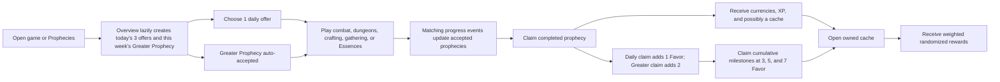
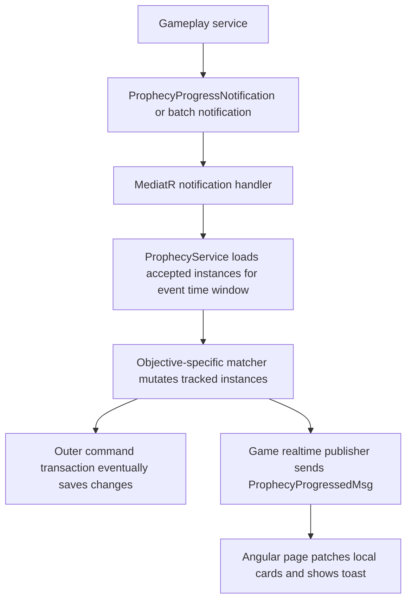

# Prophecies System Analysis

Last reviewed: 2026-07-14

## Scope and Method

This document describes the Prophecies system as it exists in the `LL` game application. It covers the domain model, persistence, content loading, selection, progress tracking, rewards, API, realtime delivery, Angular experience, and integrations with adjacent gameplay systems.

The analysis is based on the current repository implementation, especially:

- `LL/src/Core/Domain/Models/Prophecies/`
- `LL/src/Core/Application/Interfaces/Services/LL/Prophecies/`
- `LL/src/Core/Application/UseCases/Prophecies/`
- `LL/src/Infrastructure/Service/Services.LL/Prophecies/`
- `LL/src/Infrastructure/Persistence/Persistence.LL/Repositories/Prophecies/`
- `LL/src/API/API.LL/Controllers/V1/PropheciesController.cs`
- `LL/src/API/API.LL/Data/prophecies/`
- `LL/src/Presentation/ll/src/app/features/game/prophecies/`
- The combat, dungeon, crafting, Essence, realtime, inventory, guild, and notification code that produces or consumes prophecy-related data.

This is a code analysis, not a live economy or player-behavior study. Statements about likely player impact are design inferences from the implemented rules and UI.

## Executive Assessment

Prophecies are an implemented daily/weekly objective and retention system. The player receives three deterministic daily offers, chooses one, and also receives one automatically accepted weekly Greater Prophecy. Normal play emits progress events into the accepted daily and weekly objectives. Completed prophecies grant direct rewards; a claimed daily grants one point of weekly Prophetic Favor and a claimed Greater Prophecy grants two. Favor unlocks cumulative rewards at 3, 5, and 7 points, and several rewards arrive as inventory-backed caches that the player opens for randomized currency bundles.

The system's strongest quality is that it acts as connective tissue rather than an isolated minigame. Combat, dungeons, gathering rewards, crafting, and Essences all feed it. It can tell players what to do today, send them toward underused features, and add a short-session purpose to an idle RPG loop.

Its current maturity is best described as a strong end-to-end MVP with important correctness and product-design gaps:

- The full vertical slice exists: authored content, persistence, generation, acceptance, progress, claims, milestones, inventory caches, API, realtime messages, notifications, and a substantial Angular page.
- Reward snapshots and objective-parameter snapshots protect some generated-instance history from later content changes.
- Deterministic weighted generation is cheap, reproducible, and suitable for a solo developer.
- Several fields that imply richer eligibility are not enforced: player level, required features, and tags. Reward profile and cache resource IDs are now validated against the Prophecy balance catalog.
- Progress is delivered through direct MediatR notifications rather than a durable, idempotent event pipeline. This creates retry, concurrency, and pre-commit realtime risks.
- Period rollover is lazy and incomplete. Old accepted/offered instances are not actually expired, and delayed direct-reward claim expiry remains undefined.
- The weekly Favor track now offers nine points across seven daily claims and one Greater Prophecy claim, so the 7-point capstone permits two missed daily claims when the weekly is completed.
- Fate Echo, Sigil Fragments, and Ascension Stone Fragments are sources without implemented sinks in the inspected code.
- Dedicated automated coverage remains limited: focused gathering-matcher tests now exist, and one earlier test verifies idle combat emits a batched prophecy notification.

The recommendation is to keep the system and harden it, not replace it. Its role in the game is valuable. The next investment should make progress trustworthy, selection eligible and varied, rewards economically meaningful, and weekly participation less brittle.

## What the System Adds to the Game

### 1. A daily reason to choose a direction

The three daily slots turn a broad sandbox of activities into a concrete short-term decision:

- `Steady` is mostly low-friction activity that normal play can complete.
- `Focused` includes more system-specific goals such as dungeons, gathering, crafting, or the Soul Archive.
- `Ominous` is weighted toward rarer or more demanding goals.

Only one can be accepted. Accepting it permanently declines the other two for that UTC day. That creates agency and opportunity cost, even though the present selection logic does not yet tailor the offers to player state.

### 2. A weekly retention spine

The weekly Greater Prophecy progresses alongside daily play. Daily and Greater claims both produce Prophetic Favor for the Weekly Revelation track. This creates two overlapping weekly goals:

- Complete the activity-based Greater Prophecy.
- Combine one-point daily claims with the Greater Prophecy's two points to unlock Favor milestones at 3, 5, and 7.

The result is a clear return cadence: one daily choice, one weekly objective, and a visible weekly reward ladder.

### 3. Guidance across existing content

Prophecies give existing systems another reason to be used. The current content can direct players toward:

- General combat and group encounters.
- Creature variety.
- Dungeon rooms, event rooms, and completions.
- Essence XP and the Soul Archive.
- Mining, woodcutting, and fishing rewards.
- Tempering and item Potential.
- Loot acquisition.
- Recovery after a defeat.

The Angular page adds contextual links back to the relevant gameplay area. This is especially useful in a systems-rich game where players may otherwise lack a clear next action.

### 4. Reward anticipation and layered payoff

The system has several payoff moments instead of one:

1. Progress feedback during normal play.
2. Prophecy completion.
3. Direct claim rewards.
4. Favor milestone unlocks.
5. Cache opening and randomized results.

This is a good structure for an idle RPG because it turns accumulated background progress into a short active collection ritual.

### 5. A reusable live-content framework

Definitions live in JSON and include weights, slots, categories, difficulty, objective type, and descriptive text. The existing architecture can support more objectives without introducing a new top-level feature. With the gaps addressed, Prophecies could become a primary tool for:

- Reviving older dungeons or regions.
- Encouraging build experimentation.
- Aligning individual and guild goals.
- Promoting neglected but level-appropriate systems.
- Running seasonal or event-specific objective pools.

## Player-Facing Loop

### Daily behavior

- The daily period is midnight-to-midnight UTC.
- Three instances are generated per character: `Steady`, `Focused`, and `Ominous`.
- All begin as `Offered`.
- Accepting one sets it to `Accepted` and sets the other offered choices to `Declined`.
- A second daily cannot be accepted once any current daily is accepted, completed, or claimed.
- Progress before `AcceptedAt` does not count.
- All three offered dailies can be rerolled together before acceptance; the single free use resets with the UTC daily period. Acceptance still cannot be reversed.

### Weekly behavior

- The weekly period begins Monday at 00:00 UTC and ends seven days later.
- One `Greater` instance is generated and accepted automatically.
- Weekly Revelation progress is stored separately from the Greater Prophecy.
- Each claimed daily grants one `PropheticFavor`; claiming the Greater Prophecy grants two.
- Favor is capped at 7.
- Milestones unlock at 3, 5, and 7 and are cumulative; claiming one does not spend favor.
- There are nine available Favor points per full week, so completing the Greater Prophecy permits two missed daily claims while still reaching the capstone.

### Claim and cache behavior

- A prophecy must have `Completed` status, or be reconciled to completed because current progress reached the stored target, before the server allows a claim.
- A claim applies scalar character rewards and inventory rewards in the command transaction, then marks the instance `Claimed`.
- Cache rewards are real stackable, bound `Resource` items.
- Opening a cache removes one inventory item and immediately grants the randomized result in the same command transaction.

## Content Inventory

The current content contains 20 daily definitions and 8 weekly definitions.

### Daily category distribution

| Category  | Definitions | Notes                                                              |
| --------- | ----------: | ------------------------------------------------------------------ |
| Combat    |           6 | Largest pool; kills, unique creatures, wins, and group encounters. |
| Dungeon   |           3 | Rooms, full completions, and event rooms.                          |
| Essence   |           3 | Essence XP and Archive interaction.                                |
| Gathering |           3 | Mining, woodcutting, and fishing-labeled goals.                    |
| Crafting  |           2 | Tempering and Potential spending.                                  |
| Treasure  |           2 | Loot-entry-based progress toward a fixed target.                   |
| Survival  |           1 | Win after any recorded encounter loss.                             |

### Weekly category distribution

| Category  | Definitions |
| --------- | ----------: |
| Combat    |           2 |
| Dungeon   |           2 |
| Essence   |           1 |
| Gathering |           1 |
| Crafting  |           1 |
| Survival  |           1 |

There are no weekly Treasure, Archive/feed, Potential-spending, group-encounter, or dungeon-event definitions.

### Slot pool sizes

| Slot    | Eligible daily definitions | Total configured weight |
| ------- | -------------------------: | ----------------------: |
| Steady  |                          5 |                     455 |
| Focused |                         12 |                     845 |
| Ominous |                         10 |                     585 |

A definition may belong to multiple slots. Selection now excludes definitions already chosen for another slot whenever an alternative exists, and it prefers distinct categories across the three daily offers.

## Generation and Selection

### Definition loading

`JsonProphecyDefinitionProvider` loads `daily.json` and `weekly.json` once when the singleton provider is constructed. Content changes therefore require process restart or redeployment.

Startup validation currently checks:

- At least one definition exists.
- Definition IDs are unique.
- Required string fields are present.
- At least one allowed slot exists.
- Allowed slot names match the enum with case-sensitive parsing.
- Objective types are known.
- Weights are positive.

The separate balance-catalog validator also checks target coverage, reward-profile coverage and scope, Favor consistency, non-negative rewards, fixed persisted milestone thresholds, cache metadata and roll weights, duplicate IDs, and cache references.

It does not validate:

- The schema or values inside `ObjectiveParameterJson`.
- Whether an objective's parameters are supported by its matcher.
- Feature names or tag names.
- Whether every slot has an eligible definition.
- Whether level bounds are coherent.

### Persistence synchronization

Every overview request synchronizes the singleton JSON definitions into `ProphecyDefinitions`:

- Existing definitions are overwritten with the current authored values.
- New definitions are inserted.
- Definitions absent from the authored files are disabled, not deleted.
- Player instances retain a restrictive foreign key to the definition row.

This preserves references, but it means a nominal `GET /api/v1/prophecies` performs writes and may create definitions, instances, weekly state, and cache item bases.

### Deterministic weighted selection

Selection filters by:

- `IsEnabled`.
- Daily or weekly scope.
- Whether `AllowedSlots` contains the current slot name.

It then builds progressively relaxed candidate pools and performs a deterministic weighted roll. The preferred pool excludes definitions already selected today, categories already represented today, and definitions seen during the recent-history window. Recent-history suppression is relaxed first, then category diversity, then definition uniqueness only when the authored slot pool has no alternative. The final roll hashes character ID, period start, slot, scope, and an initial/reroll salt with SHA-256.

Benefits:

- Refreshing cannot reroll offers; rerolling is an explicit persisted action.
- No random state needs to be persisted before instance creation.
- Selection is easy to reproduce from inputs.
- Different characters generally receive different pools.

### Daily reroll

Every character receives one free reroll per UTC daily period. It replaces the complete set of three still-offered daily prophecies before a choice is accepted. Each replacement keeps the same instance ID and slot, but refreshes the definition, target, objective parameters, progress, and reward snapshots. The three replaced definition IDs are retained for audit/history suppression.

The Steady instance acts as the period's reroll anchor. Consumption uses a conditional database update that succeeds only while `DailyRerollUsedAt` is null, so concurrent requests and multiple API replicas cannot consume two free rerolls. The service resolves alternatives for all three slots before consuming the use; an incomplete replacement set returns an error without charging or partially changing the offers.

Limitations:

- `MinPlayerLevel`, `MaxPlayerLevel`, `RequiredFeatures`, `RequiredTags`, and `ExcludedTags` are persisted but never consulted.
- `RewardProfileId` selects a validated server-owned reward package, but eligibility metadata still does not influence that package.
- Definition and category repetition are suppressed where each slot's authored pool allows it.
- Daily definitions seen in the prior seven days and Greater definitions seen in the prior 28 days are suppressed where alternatives exist.
- It still does not consider neglected content, available dungeons, profession state, or player preferences.
- If a slot has no candidates, it falls back to any enabled combat definition of the same scope. If that is also empty, target selection fails rather than producing a controlled configuration error.
- Selection uses an unsigned hash value, avoiding the former `Math.Abs(int.MinValue)` edge case.

### Instance snapshots

At generation, a `PlayerProphecyInstance` stores:

- Target value.
- Objective parameter JSON.
- Progress JSON.
- Reward JSON.
- Period and timestamps.

This is a sound idea: a generated contract should not change arbitrarily after a balance deploy. The protection is incomplete:

- Rewards and objective parameters are snapshotted. Prophetic Favor is the deliberate exception: claim-time scope rules normalize it to one for dailies and two for Greater Prophecies so instances generated before the balance change behave consistently.
- Target is resolved when an offer is generated and remains stable for that offer. Balance changes affect newly generated or rerolled offers rather than rewriting an accepted objective.
- Title, flavor text, objective text, category, difficulty, and objective type are read from the current joined definition, so history presentation can change after content edits.

## Objective Semantics and Integrations

| Objective                    | Progress producer                          | Implemented matching                                                                                  | Important caveat                                                                                                                                                                                                         |
| ---------------------------- | ------------------------------------------ | ----------------------------------------------------------------------------------------------------- | ------------------------------------------------------------------------------------------------------------------------------------------------------------------------------------------------------------------------ |
| `KillCreatures`              | Idle and dungeon combat outcome processors | Adds event amount for every defeated creature event.                                                  | No creature tag, level, region, or elite filtering exists despite “qualifying” text.                                                                                                                                     |
| `KillDifferentCreatureTypes` | Idle and dungeon combat                    | Stores unique creature definition IDs in `ProgressJson`.                                              | This is naturally idempotent per creature ID, unlike most counters.                                                                                                                                                      |
| `WinEncounters`              | Idle and dungeon combat                    | Adds one per won encounter; optional minimum enemy count is checked.                                  | If a future producer omits `EnemyCount`, the minimum check passes rather than fails.                                                                                                                                     |
| `ClearDungeonRooms`          | Dungeon action execution                   | Counts completed dungeon room outcomes and run completion outcomes as rooms.                           | A run-completion action also emits dungeon completion, so it can progress two different objectives by design.                                                                                                            |
| `CompleteDungeons`           | Dungeon action execution                   | Adds one for `RunCompleted`.                                                                          | No dungeon ID, tier, or difficulty filter.                                                                                                                                                                               |
| `GainEssenceXp`              | `EssenceSystemService`                     | Adds total XP granted across all active Essence slots.                                                | Equipping more active Essences can multiply counted XP relative to the base combat XP award.                                                                                                                             |
| `EssenceArchivedOrFed`       | `EssenceSystemService`                     | Adds one when an unbound Essence is absorbed into the Archive.                                        | No separate feed event was found; the label promises “archive or feed,” while only absorb/archive is wired.                                                                                                              |
| `GatherResources`            | Idle and dungeon combat gathering rewards  | Adds the sum of quantities from successful gathering reward results when the event profession matches the optional authored `requiredProfession`. | Profession matching is case-insensitive and malformed parameters fail closed. `ResourceId` remains unused by the matcher. |
| `TemperItems`                | Idle crafting/tempering                    | Adds total tempering actions.                                                                         | It measures attempts, not distinct items.                                                                                                                                                                                |
| `SpendPotential`             | Idle crafting/tempering                    | Adds `TotalActions` as Potential spent.                                                               | Negative outcomes can consume an additional Potential point, so actual Potential spent can exceed prophecy progress.                                                                                                     |
| `TreasureProgress`           | Idle and dungeon combat outcome processors | Adds `TotalLoot.Count`.                                                                               | This counts inventory reward entries/stacks, not item quantity, rarity, value, boss cache, or explicit treasure value.                                                                                                   |
| `MeaningfulDefeatThenWins`   | Idle and dungeon combat                    | Any loss sets a boolean; later wins add progress.                                                     | “Meaningful” has no health, level, duration, or difficulty rule. Once set, it remains set for the instance.                                                                                                              |

### Progress event flow

The pipeline is synchronous and usually runs inside the gameplay command's EF transaction. This makes progress feel immediate and keeps most mutations in the same unit of work, but it creates coupling and reliability concerns discussed later.

### Producer-specific behavior

#### Idle combat

Idle combat builds one batch containing:

- One win or loss event per encounter.
- One creature-defeated event per defeated creature.
- One gathering event per successful gathering reward result.
- One treasure event if any loot entries were generated.

The prophecy service loads active instances once for the batch, processes the events chronologically, and returns at most one update per affected prophecy. The aggregate update contains the total amount gained, final state, and completion flag, while the stored completion timestamp remains the time of the event that crossed the target. A large offline result therefore has a bounded query and realtime cost rather than scaling its output with every encounter or creature.

#### Dungeon combat and dungeon actions

Dungeon combat collects encounter, creature, gathering, and loot progress into one notification batch. Dungeon action execution similarly batches room, event, and completion progress. Combat resolution and action resolution remain separate producer boundaries, but each boundary now performs one active-instance query and emits at most one realtime update per affected prophecy.

#### Crafting

One completed idle crafting processing pass emits one batch containing two progress events when actions occurred:

- `ItemTempered` with total actions.
- `PotentialSpent` with the same total actions.

This lets different prophecies consume the same underlying activity, but it does not use the actual `TemperingAttemptResult.PotentialSpent` values.

#### Essences

Essence progress is emitted when:

- An unbound Essence is absorbed into the Archive.
- Combat XP is granted to active Essence slots.

The service accepts an optional publisher, which makes the integration less explicit than a required event dependency and permits runtime paths where Essence behavior works but prophecy progress is silently absent.

## Target Scaling

Targets are loaded from `Data/prophecies/targets.json`. Each scope/objective pair has an explicit value for all four difficulties, and startup validation rejects a live definition without a matching target profile. The table below shows the current authored values, whether or not every combination currently appears in the offer definitions.

| Objective              | Daily Common / Uncommon / Rare / Epic | Weekly Common / Uncommon / Rare / Epic |
| ---------------------- | ------------------------------------- | -------------------------------------- |
| Kill creatures         | 50 / 65 / 80 / 95                     | 400 / 500 / 600 / 700                  |
| Unique creature types  | 6 / 8 / 10 / 12                       | 26 / 34 / 42 / 50                      |
| Win encounters         | 26 / 34 / 42 / 50                     | 190 / 240 / 290 / 340                  |
| Clear dungeon rooms    | 12 / 16 / 20 / 24                     | 110 / 140 / 170 / 200                  |
| Complete dungeons      | 2 / 3 / 4 / 5                         | 12 / 16 / 20 / 24                      |
| Resolve dungeon events | 7 / 10 / 13 / 16                      | 35 / 45 / 55 / 65                      |
| Gain Essence XP        | 500 / 650 / 800 / 950                 | 3,500 / 4,500 / 5,500 / 6,500          |
| Archive/feed Essence   | 2 / 3 / 4 / 5                         | 7 / 9 / 11 / 13                        |
| Gather resources       | 50 / 65 / 80 / 95                     | 370 / 460 / 550 / 640                  |
| Temper items           | 9 / 12 / 15 / 18                      | 60 / 75 / 90 / 105                     |
| Spend Potential        | 50 / 65 / 80 / 95                     | 340 / 420 / 500 / 580                  |
| Treasure progress      | 100 for every difficulty              | 100 for every difficulty               |
| Wins after defeat      | 9 / 12 / 15 / 18                      | 42 / 54 / 66 / 78                      |

Implications:

- Difficulty drives both target and reward, with both values now authored in server-owned JSON catalogs.
- Treasure difficulty currently changes rewards without changing the target.
- Raising a formula can increase an already accepted target on the next overview request; lowering it does not reduce existing targets.
- Targets are global and do not scale with character level, action speed, dungeon access, or profession efficiency.

## Rewards and Economy

### Direct prophecy rewards

`RewardProfileId` now resolves an explicit package in `Data/prophecies/rewards.json`. Startup validation rejects missing profiles, scope mismatches, negative values, broken cache references, and profile Favor that differs from the configured Daily or Weekly amount.

#### Daily base reward

| Difficulty | Cinders | Character XP | Soulstones | Fate Echo | Prophetic Favor |
| ---------- | ------: | -----------: | ---------: | --------: | --------------: |
| Common     |     105 |           55 |          0 |         7 |               1 |
| Uncommon   |     150 |           80 |          0 |        10 |               1 |
| Rare       |     195 |          105 |          1 |        13 |               1 |
| Epic       |     240 |          130 |          1 |        16 |               1 |

Daily Dungeon rewards additionally grant 3 Sigil Fragments and 1 Ascension Stone Fragment at every current difficulty because of the implemented formula.

#### Weekly base reward

| Difficulty | Cinders | Character XP | Soulstones | Fate Echo | Prophetic Favor | Cache                  |
| ---------- | ------: | -----------: | ---------: | --------: | ---------------: | ---------------------- |
| Common     |     550 |          330 |          1 |        26 |                2 | Greater Prophecy Cache |
| Uncommon   |     800 |          460 |          2 |        34 |                2 | Greater Prophecy Cache |
| Rare       |   1,050 |          590 |          3 |        42 |                2 | Greater Prophecy Cache |
| Epic       |   1,300 |          720 |          4 |        50 |                2 | Greater Prophecy Cache |

Weekly Dungeon rewards additionally grant `8 + difficulty × 2` Sigil Fragments and `5 + difficulty` Ascension Stone Fragments.

### Weekly Revelation milestones

Favor awards and milestone titles/rewards are loaded from `Data/prophecies/weekly-revelation.json`. Thresholds remain restricted to 3, 5, and 7 because the persistence model stores three explicit claim flags.

| Favor | Direct reward                           | Cache                         |
| ----: | --------------------------------------- | ----------------------------- |
|     3 | 150 Cinders, 1 Soulstone, 10 Fate Echo  | Small Revelation Cache        |
|     5 | 350 Cinders, 2 Soulstones, 20 Fate Echo | Greater Revelation Cache      |
|     7 | 750 Cinders, 5 Soulstones, 35 Fate Echo | Perfect Week Revelation Cache |

Because the milestones are cumulative, reaching seven Favor grants access to all three milestone packages. Five daily claims plus the Greater Prophecy are sufficient.

### Cache behavior

Cache metadata, preview labels, roll counts, and weighted rewards are loaded from `Data/prophecies/caches.json`. Each cache performs independent weighted rolls with replacement:

- Small Revelation Cache: 2 rolls.
- Greater Revelation Cache: 3 rolls.
- Perfect Week Revelation Cache: 4 rolls.
- Greater Prophecy Cache: 3 rolls.

Approximate cache-only expected values are:

| Cache                   | Cinders | Fate Echo | Soulstones | Sigil Fragments | Ascension Fragments |
| ----------------------- | ------: | --------: | ---------: | --------------: | ------------------: |
| Small Revelation        |     108 |       4.8 |        0.2 |               0 |                   0 |
| Greater Revelation      |   232.5 |      19.5 |       1.05 |            1.95 |                 0.3 |
| Perfect Week Revelation |     600 |      34.4 |        3.8 |               5 |                 2.4 |
| Greater Prophecy        |  431.25 |      22.8 |       1.65 |             2.1 |                 0.6 |

These are averages, not guarantees. Repeated entries may be rolled more than once in one cache.

### Reward strengths

- Reward snapshots prevent most generated prophecy payouts from changing after generation; the scope-defined Favor amount is normalized at claim time.
- Claims and cache opening use the command transaction, so inventory consumption and character grants normally commit together.
- Cache items are bound, avoiding marketplace transfer and some economy abuse.
- Direct XP passes through the leveling service.
- Generic `Items` rewards are structurally supported when referenced item bases already exist.

### Reward and economy weaknesses

1. **Three currencies have no inspected sinks.** Fate Echo, Sigil Fragments, and Ascension Stone Fragments are granted by Prophecies and some guild-shop rewards, but no code was found that spends them. Until sinks exist, they are balance-sheet numbers rather than meaningful choices.

2. **`EssenceExperience` is modeled but not applied.** It exists in reward snapshots and DTOs, but `ApplyRewardAsync` neither recognizes it in its early-return condition nor grants it. Current generated rewards leave it at zero, so this is latent rather than an active loss.

3. **The former reward-catalog gap is resolved.** Definitions now resolve real reward profiles, and cache behavior is authored in validated JSON.

4. **The former cache-preview drift is resolved.** The API returns preview labels from the server-owned cache catalog; the client no longer maps cache IDs to contents.

5. **The former 7-favor attendance pressure is resolved.** Seven daily claims plus two Favor from the Greater Prophecy create nine available points. A player who completes the weekly objective can miss two daily claims and still reach the capstone.

## Persistence Model

### `ProphecyDefinition`

Stores authored content and selection metadata:

- Identity and display text.
- Scope, category, and difficulty.
- Objective type and parameter JSON.
- Reward profile ID.
- Weight and enabled state.
- Allowed slots.
- Required/excluded metadata and level bounds.

### `PlayerProphecyInstance`

Stores the per-character generated contract:

- Player and character IDs.
- Definition foreign key.
- Scope, slot, and status.
- Period and lifecycle timestamps.
- Target and current value.
- Objective, progress, and reward JSON snapshots.
- Daily reroll usage timestamp and the replaced definition ID when applicable.
- A `RowVersion` concurrency-token property.

Indexes support period lookups and status lookups. A unique index prevents two instances for the same player, character, scope, period start, and slot.

### `WeeklyRevelationProgress`

Stores per-character, per-week:

- Period boundaries.
- Favor up to 7.
- Claimed flags for the 3, 5, and 7 milestones.

A unique index protects one row per player, character, and weekly period start.

### Persistence strengths

- Generated instances and weekly progress are durable.
- Uniqueness is expressed in the database.
- Old definitions are disabled rather than deleted, preserving foreign keys.
- JSON snapshots allow objective-specific state without a table per objective.
- Player ID and character ID are both included in claim and overview lookups.

### Persistence concerns

- `RowVersion` is a normal numeric column marked as a concurrency token, but no code or database generation rule increments it. It therefore does not provide an effective optimistic version check across application instances.
- The in-process transaction behavior serializes commands by character ID, but that lock is static to one application process. Multiple API replicas can still race.
- Lazy generation can race across replicas. The unique indexes detect duplicates, but there is no upsert or unique-violation recovery path, so a normal first-load race can surface as a failed request.
- Progress counters have no event ledger or idempotency key. A repeated gameplay event can be counted twice.
- Three daily instances per active day plus one Greater instance per active week are retained indefinitely. This is manageable initially but needs an explicit history/retention policy at scale.

## Period Rollover and Lifecycle Semantics

Statuses are `Offered`, `Accepted`, `Completed`, `Claimed`, `Declined`, and `Expired`, but `Expired` is not reliably reached.

`GetOverviewAsync` calls `ExpireOldUnfinished` only on the instances it just loaded for the current daily period. Those instances have an end in the future, so this does not expire yesterday's instances. Old daily and weekly instances are not loaded and reconciled during rollover, and there is no background cleanup job.

Consequences:

- Old `Offered` and `Accepted` rows remain in those statuses indefinitely.
- Old weekly Greater Prophecies remain `Accepted` even though period filtering prevents further progress.
- Recent-history queries exclude `Offered` and `Accepted`, so these stale rows are invisible to the player.
- The status model suggests a cleaner lifecycle than the implementation currently provides.

Completed instances are not checked for claim expiry. A completed prophecy can be claimed after its period ends if its ID is submitted, so its direct rewards remain claimable.

Prophetic Favor is now credited to the weekly period containing the prophecy's own `PeriodStart`. A delayed prophecy claim therefore cannot advance a later week's participation track. If the original week has ended, its Favor may no longer be usable because milestone claims operate on the current week only. Whether delayed direct rewards should eventually expire remains an explicit product decision.

## API and Application Layer

All endpoints are authorized and use the current user's character context:

| Method | Route                                        | Behavior                                                                                                                             |
| ------ | -------------------------------------------- | ------------------------------------------------------------------------------------------------------------------------------------ |
| GET    | `/api/v1/prophecies`                         | Synchronize definitions, ensure current instances and weekly progress, reconcile targets/completion, return overview/history/caches. |
| POST   | `/api/v1/prophecies/{id}/accept`             | Accept one current daily and decline the other offers.                                                                               |
| POST   | `/api/v1/prophecies/reroll`                  | Replace all three offered dailies before acceptance, consuming one free or paid reroll.                                               |
| POST   | `/api/v1/prophecies/{id}/claim`              | Apply a completed prophecy reward and update weekly favor.                                                                           |
| POST   | `/api/v1/prophecies/weekly-revelation/claim` | Claim the milestone identified by required favor.                                                                                    |
| POST   | `/api/v1/prophecies/caches/open`             | Consume one owned cache and grant rolled rewards.                                                                                    |

The overview is represented as a command because it performs writes. That follows the repository's command transaction pattern, but the HTTP method remains `GET`. This has practical drawbacks:

- A read-looking request is responsible for content synchronization and period generation.
- Sidebar notification refresh also triggers these writes.
- HTTP tooling, caching assumptions, and observability may misclassify it as a safe read.
- A failure in cache item-base creation can prevent the entire overview.

The response models are otherwise focused and provide the frontend with display-ready strings, substituted objective targets, reward snapshots, history, milestones, and cache counts.

## Realtime and Notification Experience

### Realtime progress

After a matching progress mutation, the notification handler publishes `ProphecyProgressedMsg` to the character audience. The page:

- Deduplicates received game-event envelopes.
- Patches daily, active-daily, and Greater Prophecy state in place.
- Updates the sidebar action count from the patched overview.
- Shows a progress or completion toast.

This makes the system responsive without polling while the page is mounted.

### Reliability concern: publish before commit

The realtime publish happens inside the notification handler before the outer command transaction saves and commits. If later work or the commit fails, the client can receive progress that was rolled back. The page will display a phantom update until the next overview refresh.

The same transaction uses an EF execution strategy that may retry. External realtime side effects inside the retried delegate can be published more than once.

### Volume behavior

Idle combat, dungeon combat, dungeon action resolution, and tempering now publish progress in producer-level batches. The service performs one active-instance lookup per batch and collapses all matching input events into at most one `ProphecyProgressedMsg` per affected prophecy. Feedback therefore scales with the small number of active prophecies rather than with kills, encounters, or crafting actions. Combat resolution and its enclosing dungeon action can still form two bounded batches because they are independent producer boundaries.

### Sidebar notification behavior

The sidebar count includes:

- A missing daily choice.
- Claimable daily and Greater Prophecies.
- Claimable weekly milestones.
- Every owned cache item quantity.

Strengths:

- The count represents concrete available actions.
- Initial sidebar refresh forces the current periods to exist.

Weaknesses:

- `SidebarNotificationRefreshService` refreshes only once per character ID.
- The page itself listens for prophecy realtime messages, but the global notification service does not.
- If a prophecy completes while the player is elsewhere, the sidebar badge can remain stale until an overview refresh or page visit.
- Counting every cache unit can turn a useful action indicator into a large backlog number; one “caches available” action may be clearer.

## Angular Page and Player Experience

The Prophecies page is a substantial standalone Angular component with a corresponding large template. It includes:

- A Weekly Revelation favor rail with milestone overlays.
- Three daily cards with status, category, difficulty, objective, progress, reward preview, and actions.
- A consolidated Ready section for current claimable prophecies and milestones.
- Owned-cache tiles with open actions.
- A Greater Prophecy panel.
- Recent history.
- Loading, success, and error states.
- Contextual navigation links.
- Realtime in-place updates and toast feedback.
- Sidebar notification synchronization.

### UX strengths

- The hierarchy mirrors the game loop: weekly progress, today's choice, claimable rewards, caches, Greater Prophecy, history.
- Rewards are previewed before acceptance.
- Current progress and reset timers are visible.
- Completed objectives stop showing “continue” guidance.
- Active objectives show server-owned action labels and hints, including snapshotted requirements such as Mining-only gathering or minimum encounter size.
- CDK connected overlays avoid clipped reward tooltips.
- Owned caches are hidden when quantity is zero, reducing empty-state noise.
- Recent history reinforces continuity and previous activity.

### UX weaknesses

- The system does not explain that accepting one daily irreversibly declines the others before the player clicks.
- The distinction between the Greater Prophecy and Weekly Revelation may be cognitively expensive: both are weekly, both grant caches, but they progress differently.
- The page shows category and difficulty but not why an offer is appropriate for this character.
- The component and template are large enough that content formatting, reward logic, realtime state, overlays, navigation guidance, and action orchestration are all mixed in one feature component.
- A global `loading` flag disables every action while any request is running, which is simple but can make the page feel locked during unrelated operations.
- The client synthesizes `completedAt` with its local current time on realtime completion instead of using the server's actual completion timestamp.

## Integration Matrix

| System                | Direction                   | Strength          | Notes                                                                                                                      |
| --------------------- | --------------------------- | ----------------- | -------------------------------------------------------------------------------------------------------------------------- |
| Idle combat           | Combat → Prophecies         | Strong            | Wins, losses, creatures, gathering rewards, and loot are processed in one batch with one output per affected prophecy.     |
| Dungeon combat        | Combat → Prophecies         | Strong            | Same combat facts as idle mode, collected into one producer-level batch.                                                   |
| Dungeon exploration   | Dungeons → Prophecies       | Strong            | Rooms, event rooms, checkpoints, and full completions.                                                                     |
| Crafting/tempering    | Crafting → Prophecies       | Medium            | Attempts and approximate Potential spending; no recipe, item, rarity, or result filters.                                   |
| Essences              | Essences → Prophecies       | Medium            | Active-slot XP and Archive absorption; “feed” behavior not found.                                                          |
| Gathering             | Combat rewards → Prophecies | Partial           | Only gathering results from combat processors were found; authored profession filters are enforced.                        |
| Inventory             | Bidirectional               | Strong            | Prophecies create bound cache items; cache opening consumes them.                                                          |
| Character progression | Prophecies → Character      | Strong            | Cinders, Soulstones, character XP, and three fragment/echo balances.                                                       |
| Leveling              | Prophecies → Leveling       | Strong            | Character XP runs through level recalculation.                                                                             |
| Realtime              | Prophecies → UI             | Medium            | Immediate aggregated feedback, but still published before commit.                                                         |
| Sidebar notifications | Prophecies → Navigation     | Medium            | Good actionable badge, but refresh is not globally realtime.                                                               |
| Guild shop            | Shared economy              | Weak/indirect     | Guild rewards can also grant prophecy-adjacent currencies; no prophecy progress from guild activity and no currency sinks. |
| Achievements          | Nominal only                | Weak              | `AchievementCategory.Prophecies` exists, but no prophecy achievement content or completion event integration was found.    |
| Marketplace           | None intended               | None              | Cache items are bound; no prophecy marketplace interaction.                                                                |
| PvP/Colosseum         | None                        | None              | PvP activity does not progress Prophecies.                                                                                 |

## Major Pain Points and Risks

### Priority 1: correctness and exploit resistance

#### 1. Authored gathering constraints were ignored — resolved 2026-07-14

Mining, woodcutting, and fishing definitions use `requiredProfession`, and producers populate `Profession`. The matcher now requires those values to match before adding progress. Unrestricted gathering definitions still accept every profession, comparisons are case-insensitive and whitespace-tolerant, and malformed gathering parameters fail closed. Focused automated coverage protects matching, mismatching, unrestricted, missing-profession, and malformed-parameter cases.

#### 2. Favor belonged to claim time, not prophecy time — resolved 2026-07-14

Claims that award Prophetic Favor now load or create the week containing the prophecy's own period and credit that row. Delayed direct rewards remain claimable, but they cannot advance a later week's participation track. A focused cross-week regression test protects this attribution rule. Claim-expiry policy remains separate and unresolved.

#### 3. Progress has no idempotency contract

Most progress counters blindly add amounts. Notifications have no event ID or processed-event ledger. Request retries, execution-strategy retries, repeated producers, or future message redelivery can double-count progress.

#### 4. Effective cross-instance concurrency protection is missing

The per-character semaphore protects only one process. `RowVersion` does not increment, and lazy creation uses insert-then-unique-constraint behavior without conflict recovery. Multiple replicas can lose counter updates, duplicate rewards in races, or fail first-load generation requests.

#### 5. Realtime can contradict committed state

Progress messages are sent before transaction commit. A rollback leaves the client ahead of the database; a retry may publish duplicates.

### Priority 2: product and economy quality

#### 6. Eligibility metadata is unused

Definitions can be offered regardless of level, unlocked features, available dungeons, Essence access, profession readiness, or recent play. A new player can receive an objective they cannot reasonably complete.

#### 7. The perfect-week requirement was brittle — resolved 2026-07-14

Daily claims grant one Favor and the Greater Prophecy grants two, providing nine available points against the seven-point cap. A player can miss two daily claims and still reach the capstone by completing the weekly objective. The existing “Perfect Week” capstone label is now a legacy tier name rather than a literal attendance requirement.

#### 8. Prophecy-adjacent currencies have no purpose yet

Fate Echo and both fragment balances accumulate without sinks in current code. This weakens reward comprehension and contributes to currency sprawl.

#### 9. Balance content was only superficially data-driven — resolved 2026-07-14

Targets, direct reward profiles, Favor awards, Weekly Revelation milestones, cache item metadata, roll counts, weighted cache rewards, and cache-preview labels now live in validated server-owned JSON files. `RewardProfileId` resolves an actual package. Generated prophecies snapshot targets and rewards, so later tuning does not rewrite accepted objectives. Objective matching remains typed application behavior because it interprets gameplay events rather than representing balance data.

#### 10. Offers were repetitive and lacked player agency — resolved 2026-07-14

Generation now suppresses duplicate definitions, repeated categories, and recent offers through progressively relaxed candidate pools, preserving deterministic weighted selection when authored slot constraints are tight. Each character also receives one atomically consumed free daily set reroll, followed by configured paid set rerolls, all of which must be used before acceptance. Personalized accessibility remains a separate concern under pain point 6: level, feature, dungeon, and profession eligibility metadata is still not enforced.

### Priority 3: maintainability, performance, and UX

#### 11. Rollover leaves stale lifecycle state

Old offered and accepted instances are not expired and do not appear in history. This complicates analytics, support, and future lifecycle features.

#### 12. Event output was too granular — resolved 2026-07-14

Idle combat, dungeon combat, dungeon action resolution, and tempering now use producer-level progress batches. The service loads active instances once, processes the batch chronologically, and returns one aggregate update per affected prophecy with its total gain and final completion state. This bounds database lookups, websocket messages, and toasts by producer batches and active prophecies rather than underlying kills or actions.

#### 13. Frontend/backend objective guidance was duplicated — resolved 2026-07-14

`ProphecyInstanceDto` now includes server-owned guidance with an abstract destination, action label, and player-facing hint. The mapping covers every objective family and reads the instance's snapshotted parameters, so requirements such as a specific gathering profession or minimum enemy count are explained consistently with progress rules. Angular no longer switches on objective type; it only maps the abstract destination to a presentation-owned route and renders the supplied action and hint.

#### 14. Progress persistence depends on ambient command behavior

Notification handlers mutate tracked EF entities but do not explicitly save. This works when invoked inside a command transaction, but a future producer that publishes from a background or non-command scope may emit realtime updates without durable progress unless the caller saves.

#### 15. Dedicated test coverage was insufficient — resolved baseline 2026-07-14

The focused Prophecy suite now protects every implemented objective matcher, positive and negative parameter constraints, unique-creature and defeat-then-win state, chronological aggregation, exact acceptance/period boundaries, stable generation snapshots, UTC rollover, daily acceptance and decline behavior, three-offer set rerolls, escalating spend and reroll limits, delayed Favor attribution, direct-claim replay protection, milestone unlock and single-claim rules, DTO guidance, deterministic offer selection, cache table structure and positive weights, persistence ownership/history scoping, and authenticated controller claim propagation. This establishes a maintainable regression baseline for the implemented system. True multi-replica races, relational unique-conflict behavior, stochastic cache distribution, and dedicated Angular component rendering still require higher-level environments and remain in the test strategy rather than being treated as unit-test coverage gaps.

## Recommended Direction

### Phase 1: make progress and claims trustworthy

1. Introduce a durable gameplay progress envelope with a unique event ID, character ID, occurred-at time, type, amount, and typed dimensions.
2. Process prophecy progress idempotently. Store processed event IDs or derive stable idempotency keys from the originating action/outbox event.
3. Publish realtime updates only after the transaction commits, ideally through the existing game-event outbox pattern.
4. ~~Aggregate a gameplay batch into at most one update per affected prophecy, including total amount gained and final completion state.~~ Completed in the progress service while preserving chronological completion timestamps.
5. ~~Batch dungeon combat notifications as idle combat already does.~~ Dungeon combat, dungeon action resolution, and tempering now use the same batch notification path.
6. Replace or configure `RowVersion` with a real database-generated concurrency token, or use atomic SQL increments/row locks for counters.
7. Handle unique conflicts during lazy generation with reload-and-return or database upsert semantics.
8. Define whether delayed direct rewards expire. Prophetic Favor is now bound to the prophecy's containing week.
9. Reconcile expired instances explicitly during period initialization or a lightweight scheduled cleanup.

### Phase 2: make content truly data-driven

1. Replace stringly `ObjectiveParameterJson` matching with validated typed parameter contracts per objective type.
2. Extend the enforced gathering-profession pattern to resource, creature, region, dungeon, tier, enemy-count, and feature filters where authored.
3. Validate every objective parameter document at startup.
4. ~~Move target profiles out of `GetTargetValue` into content or a reusable balance catalog.~~ Completed with `targets.json`.
5. ~~Implement real reward profiles and resolve `RewardProfileId`.~~ Completed with `rewards.json`.
6. ~~Move weekly milestones and cache roll tables into server-owned data.~~ Completed with `weekly-revelation.json` and `caches.json`.
7. ~~Return cache content/odds-preview metadata from the API so the client does not duplicate reward truth.~~ Preview labels are now returned by the API; numeric odds remain an optional future UX enhancement.
8. Either implement `EssenceExperience` reward application or remove it until supported.

### Phase 3: improve selection and retention design

1. Build a selection context from character level, unlocked features, accessible dungeons, profession state, and relevant inventory/loadout state.
2. Enforce the existing level/feature/tag metadata.
3. ~~Exclude duplicate definitions across a day's slots.~~ Completed with definition and category-aware candidate pools.
4. ~~Add recent-history suppression so the same objective does not repeat too often.~~ Completed with seven-day daily and 28-day Greater lookbacks that relax when necessary.
5. Give slots clearer mechanical identities rather than relying only on authored lists.
6. ~~Consider one limited reroll or allow choice replacement before any progress is earned.~~ Every character now has one free complete-set reroll per UTC daily period, usable before acceptance.
7. Monitor completion rates after the new nine-available/seven-required Favor balance and tune the Greater objective or capstone if it still produces excessive drop-off.
8. Use Prophecies to encourage relevant variety, not simply volume: older unmastered dungeons, unused Essence families, underleveled professions, or guild-aligned activity.

### Phase 4: complete the economy and presentation

1. Give Fate Echo a clear sink tied to prophecy agency, such as additional rerolls beyond the free daily use, targeted category weighting, catch-up, or deterministic cache conversion.
2. Connect Sigil and Ascension fragments to an existing dungeon/Essence progression sink, or consolidate them with already meaningful resources.
3. Explain the relationship among daily prophecy, Greater Prophecy, Prophetic Favor, Weekly Revelation, and caches in a short onboarding panel.
4. Warn that accepting a daily declines the other two.
5. Move the realtime listener for actionable completion into a global prophecy state service so sidebar badges update anywhere in the game.
6. ~~Aggregate progress feedback.~~ Output is now one update and toast per affected prophecy per producer batch; reserving toasts only for thresholds or completion remains an optional UX refinement.
7. Split the large Angular component into server-state orchestration, reward presentation, weekly rail, prophecy card, and cache components only when active feature work justifies it.

## Suggested Test Strategy

### Unit tests

- Every objective matcher, including positive and negative parameter cases.
- Target and reward profile resolution.
- Deterministic selection and weighted boundary cases.
- Eligibility filtering and duplicate exclusion.
- Daily and weekly UTC boundaries.
- Additional delayed-claim and weekly-boundary cases.
- Milestone unlock/claim rules.
- Cache table weights and roll counts using an injectable RNG abstraction.
- Reward application, including missing item-base failures and Essence XP behavior.

### Persistence/integration tests

- Concurrent current-period initialization.
- Concurrent progress increments.
- Concurrent double claim.
- Unique period/slot constraints.
- Definition removal and history mapping.
- Rollover expiration and history queries.
- Transaction rollback without realtime publication.
- Idempotent replay of the same gameplay event.

### API tests

- Character ownership and cross-character claim rejection.
- Accepting non-current or non-offered instances.
- Claiming expired, completed, and already claimed instances according to the chosen policy.
- Cache open with zero quantity and concurrent opens.
- Overview initialization semantics.

### Frontend tests

- Daily choice lock and warning.
- Realtime state patching and deduplication.
- Global sidebar count updates.
- Server-driven reward/cache previews.
- Reset timer boundaries.
- Claim/open error recovery.
- Accessible milestone tooltips and keyboard interaction.

## Observability That Would Help

The system currently has no prophecy-specific telemetry visible in the inspected code. Useful measurements would include:

- Offer, accept, complete, claim, and expire counts by definition and slot.
- Acceptance rate per offered definition.
- Completion time and failure rate by objective and character level band.
- Percentage of players reaching 3, 5, and 7 favor.
- Missed final milestone caused by exactly one missed day.
- Duplicate/retried progress events.
- Generation unique-conflict and concurrency failures.
- Cache opens, reward distributions, and unopened-cache backlog.
- Currency sources and sinks for Fate Echo and both fragment types.
- Realtime messages per resolved gameplay batch.

These metrics are necessary before a meaningful economy and target-balancing pass. Raw target numbers alone cannot show whether an objective is engaging, trivial, inaccessible, or avoided.

## Overall Conclusion

Prophecies are one of the more strategically useful systems in Legends Legacy because they connect rather than compete with the game's main loops. They provide daily choice, weekly continuity, cross-feature guidance, immediate progress feedback, and layered rewards. The thematic framing also fits the game better than a generic checklist would.

The implementation is complete enough to retain and iterate on, but not yet robust enough to treat as a trusted long-term live-ops foundation. Its core balance is now genuinely data-driven; the most urgent remaining work is constraint enforcement, idempotency, concurrency, and post-commit delivery. After that, player eligibility/history should drive varied, achievable offers. Finally, its currencies still need an economy pass, and the revised weekly buffer should be validated against player completion data.

If those changes are made, Prophecies can become the game's primary daily guidance layer: a lightweight mechanism that helps players discover depth, revisit relevant content, and make purposeful choices without feeling like mandatory chores.
