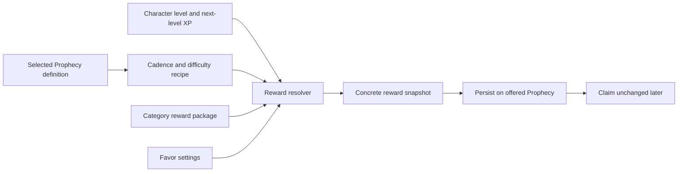

# Prophecy Reward Scaling Analysis and Implementation Plan

## Purpose

Prophecy rewards resolve from data-driven cadence and difficulty profiles into concrete snapshots. This document describes the implemented scaling model and its balance targets. Prophecies deliberately do not grant Cinders.

## What the current rewards do

Every generated Prophecy stores a concrete `ProphecyRewardSnapshot`. Claiming reads that snapshot and grants its currencies and items. Offers normally remain stable after generation; Cinders are the deliberate exception and are suppressed when legacy snapshots are displayed or claimed.

The existing direct reward profiles contain:

| Cadence and rarity | Character XP | Soulstones | Sigil Fragments | Fate Echo | Favor |
| ------------------ | ------------ | ---------: | --------------: | --------: | ----: |
| Daily Common       | 4% next level |          2 |               2 |         7 |     1 |
| Daily Uncommon     | 5% next level |          3 |               3 |        10 |     1 |
| Daily Rare         | 6% next level |          4 |               4 |        13 |     1 |
| Daily Epic         | 7% next level |          6 |               5 |        16 |     1 |
| Weekly Uncommon    | 25% next level |         8 |               8 |        34 |     2 |
| Weekly Rare        | 30% next level |        12 |              10 |        42 |     2 |
| Weekly Epic        | 35% next level |        16 |              12 |        50 |     2 |

Daily Dungeon Prophecies add level-scaled Soul Dust. Weekly Dungeon and Essence Prophecies add a level-appropriate Monster Core, while the Weekly Crafting Prophecy adds a Catalyst Selection Crate. Weekly Prophecies additionally grant a Greater Prophecy Cache.

Weekly Revelation milestones at 3, 5, and 7 Favor add another layer of fixed currency and cache rewards. Five Common dailies, an Uncommon weekly, all milestones, and the expected value of all four caches produce about 50.35 Soulstones and 47.75 Sigil Fragments. Actual cache results vary because their contents are rolled when opened.

## Pain points and risks

### Percentage XP can outgrow available content

Character XP stays relevant because it is a percentage of the next-level requirement. If area and dungeon difficulty tiers stop expanding while levels remain unlimited, Prophecy XP eventually represents more combat hours than intended. New content tiers must continue raising normal-play XP, or Prophecy XP will need a time-value cap.

### Cinders belong to the activity economy

Prophecies do not grant Cinders. World combat and dungeons remain the primary repeatable Cinder sources, while Prophecies focus on character XP, controlled currencies, caches, and progression materials.

### Category duplication hides the actual balance model

Twenty-one profiles describe only six core cadence/difficulty recipes. Category names are embedded in profile IDs even when the category contributes nothing unique. This makes global tuning repetitive and makes accidental differences easy to introduce.

### Some currencies should not scale continuously

Fate Echo purchases rerolls, Favor controls weekly completion, Sigil Fragments assemble access items, and Soulstones participate in permanent progression. Multiplying all of these by level would inflate tightly controlled loops and make high-level characters disproportionately efficient.

### Category bonuses are uneven

Only Dungeon profiles currently add a distinctive package. A category-specific bonus can make an offer feel thematic, but it must remain secondary to the core reward and must not make one category the automatic best choice.

### Cache rewards have delayed, opaque value

The cache system is supplemental and randomized. Soulstones and Sigil Fragments are therefore balanced and tested by expected value across all rolls, while the UI continues showing possible reward types rather than exact probabilities.

### Unused reward fields create false flexibility

`EssenceExperience` exists in the snapshot but is not currently awarded by the claim path. Authoring it would make content appear valid without producing the expected player result. Scalable recipes should not use it until there is an explicit recipient and grant rule.

## Design goals

- Keep a generated or rerolled offer stable by persisting the fully resolved reward snapshot.
- Scale character XP with the level curve while keeping Prophecies free of Cinder rewards.
- Keep controlled currencies flat or rarity-stepped: Fate Echo, Favor, Soulstones, Sigil Fragments, caches, and items.
- Target roughly two Champion's Market fragment cases from a complete Prophecy week without requiring a Dungeon-category offer.
- Represent cadence/difficulty rewards once and category additions separately.
- Keep all balance values in JSON and validate them at startup.
- Avoid database and frontend contract changes.

## Proposed reward model

### 1. Core recipe by cadence and difficulty

The core recipe owns scalable XP and flat currencies. Categories no longer need duplicate copies of the same recipe.

| Recipe          | XP as a share of next-level requirement |
| --------------- | --------------------------------------: |
| Daily Common    |                                      4% |
| Daily Uncommon  |                                      5% |
| Daily Rare      |                                      6% |
| Daily Epic      |                                      7% |
| Weekly Uncommon |                                     25% |
| Weekly Rare     |                                     30% |
| Weekly Epic     |                                     35% |

The resolved character XP is:

```text
resolved XP = max(1, round(next-level XP requirement × basis points / 10,000))
```

Basis points are used in JSON so percentages are exact integer configuration values and do not depend on locale-sensitive decimal parsing.

### 2. Cinders are excluded

Every committed direct profile has a zero Cinder floor, every Revelation milestone grants zero Cinders, and every weighted cache result grants zero Cinders. Catalog tests enforce all three constraints.

### 3. Flat and stepped rewards remain controlled

- Daily Favor remains `+1`; weekly Favor remains `+2`.
- Fate Echo remains tied to difficulty and cadence.
- Soulstones and Sigil Fragments step with difficulty and cadence.
- Greater Prophecy Caches remain a weekly reward.
- The four caches earned during a complete Common/Uncommon week contribute 17.75 fragments on average, bringing the complete-week expectation to 47.75.
- Item rewards use explicit level bands rather than continuous multiplication.

For the initial implementation, Dungeon item rewards keep their current identity but become banded:

| Reward                      | Levels 1–29 | Levels 30–59 | Level 60+ |
| --------------------------- | ----------: | -----------: | --------: |
| Daily Dungeon Soul Dust     |          10 |           20 |        40 |
| Weekly Dungeon Monster Core |   Lesser ×1 |   Greater ×1 | Primal ×1 |

This is deliberately conservative: it provides meaningful item progression while retaining the current category behavior. Moving the item package to Essence Prophecies or adding packages for every category should be a separate content decision after observing the scaled core rewards.

### Weekly Sigil Fragment budget

The deterministic portion of a completed week is:

```text
5 daily Prophecies × 2 fragments + 1 weekly Prophecy × 5 fragments = 15 fragments
```

Expected fragments from opening all four earned caches are:

| Cache                         | Expected fragments |
| ----------------------------- | -----------------: |
| Greater Prophecy Cache        |               3.15 |
| Small Revelation Cache        |               1.60 |
| Greater Revelation Cache      |               4.80 |
| Perfect Week Revelation Cache |               8.20 |
| Total from caches             |              17.75 |

The deterministic portion is 30 fragments: 10 from five Common dailies, 8 from the Uncommon weekly, and 12 from Revelation milestones. The complete-week expectation is therefore `30 + 17.75 = 47.75` fragments. This excludes optional Guild Shop purchases and other non-Prophecy sources.

### 4. Resolve once, then snapshot

The generation flow becomes:



Rerolling resolves a new snapshot for each replacement offer. Existing accepted or completed Prophecies keep the snapshot they were generated with, except that any legacy Cinder amount is treated as zero.

## Data shape

`rewards.json` contains three concepts:

- `scaling`: legacy-compatible Cinder resolver settings; committed profiles use a zero floor.
- `profiles`: one core recipe per used cadence/difficulty combination.
- `categoryPackages`: optional flat and level-banded additions selected by scope, category, and optionally difficulty.

Definitions continue to reference `rewardProfileId`, but IDs now describe the recipe (`Daily.Rare`) instead of duplicating its category (`Daily.Dungeon.Rare`). The definition still owns category and difficulty, so startup validation can reject mismatched recipes.

## Validation requirements

Startup should fail when:

- scaling values are non-positive;
- a definition references a missing recipe;
- a definition and recipe disagree on scope or difficulty;
- a core recipe authors scalable fields inside its flat reward;
- a category package authors XP, Cinders, Favor, or Essence XP;
- a level band has an invalid range or overlaps another band for the same item;
- item IDs are blank or quantities are non-positive;
- cache references do not resolve.

Failing at startup is preferable to silently generating a malformed permanent snapshot.

## Implemented scope

Included:

- scalable direct character XP with zero Cinders across all Prophecy sources;
- consolidated cadence/difficulty recipes;
- category packages with level-banded items;
- generation and full-set reroll integration;
- startup validation and resolver tests;
- stable persisted snapshots with immediate suppression of legacy Cinder amounts;
- rebalanced Revelation milestones and caches around Soulstones, Sigil Fragments, Fate Echo, Monster Cores, and catalysts.

Not included:

- level-scaling cache roll tables;
- adding Essence XP rewards;
- rewriting existing snapshot rows in the database;
- database schema or API DTO changes;
- broad rebalance of Soulstones, Fate Echo, or category identities.

## Follow-up balancing work

After playtesting, measure completion rate, reward share by source, reroll choice by category, and the percentage of a level earned per active day. Tune JSON XP basis points and flat controlled currencies before adding more reward types. Keep Cinders outside the Prophecy reward pool. If one category is over-selected, use narrow category materials rather than increasing every reward at once.
