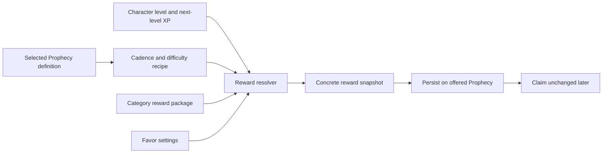

# Prophecy Reward Scaling Analysis and Implementation Plan

## Purpose

Prophecy rewards currently use fixed, category-specific snapshots. That makes the system easy to read at low level, but it also makes rewards lose relevance as character progression accelerates and creates duplicated balance data for rewards that are mostly identical.

This document defines a scalable reward model that preserves Prophecies' role as a reliable side objective without turning them into the dominant source of every currency.

## What the current rewards do

Every generated Prophecy stores a concrete `ProphecyRewardSnapshot`. Claiming reads that snapshot and grants its currencies and items. This is an important property: an offer does not change after it is shown, even if the character levels up or the balance files are edited.

The existing direct reward profiles contain:

| Cadence and rarity | Cinders | Character XP | Soulstones | Fate Echo | Favor |
| ------------------ | ------: | -----------: | ---------: | --------: | ----: |
| Daily Common       |     105 |           55 |          0 |         7 |     1 |
| Daily Uncommon     |     150 |           80 |          0 |        10 |     1 |
| Daily Rare         |     195 |          105 |          1 |        13 |     1 |
| Weekly Uncommon    |     800 |          460 |          2 |        34 |     2 |
| Weekly Rare        |   1,050 |          590 |          3 |        42 |     2 |
| Weekly Epic        |   1,300 |          720 |          4 |        50 |     2 |

Dungeon Prophecies add Soul Dust to daily rewards and a Monster Core to weekly rewards. Weekly Prophecies additionally grant a Greater Prophecy Cache.

Weekly Revelation milestones at 3, 5, and 7 Favor add another layer of fixed currency and cache rewards. With five completed dailies and the weekly Prophecy, a complete week currently produces roughly 3,947–4,897 Cinders, 735–1,245 character XP, 17–24 Soulstones, and 216–261 Fate Echo before category-specific rewards. Cache values are ranges because their contents are rolled when opened.

## Pain points and risks

### Fixed XP becomes irrelevant

Character level requirements grow while Prophecy XP remains fixed. The same Rare daily that is meaningful early on becomes negligible later. This weakens the system's promise that a Prophecy is worth diverting normal play to complete.

### Cinders need bounded progression

Cinder rewards need to remain useful without inheriting the quadratic character XP requirement. Tying them directly to resolved Prophecy XP makes currency rewards accelerate much faster than their sinks can reasonably absorb.

### Category duplication hides the actual balance model

Twenty-one profiles describe only six core cadence/difficulty recipes. Category names are embedded in profile IDs even when the category contributes nothing unique. This makes global tuning repetitive and makes accidental differences easy to introduce.

### Some currencies should not scale continuously

Fate Echo purchases rerolls, Favor controls weekly completion, Sigil Fragments assemble access items, and Soulstones participate in permanent progression. Multiplying all of these by level would inflate tightly controlled loops and make high-level characters disproportionately efficient.

### Category bonuses are uneven

Only Dungeon profiles currently add a distinctive package. A category-specific bonus can make an offer feel thematic, but it must remain secondary to the core reward and must not make one category the automatic best choice.

### Cache rewards have delayed, opaque value

The cache system is supplemental and randomized. Scaling both direct rewards and cache tables at the same time would make the economy harder to reason about and test. Cache contents should remain fixed during the first scaling pass.

### Unused reward fields create false flexibility

`EssenceExperience` exists in the snapshot but is not currently awarded by the claim path. Authoring it would make content appear valid without producing the expected player result. Scalable recipes should not use it until there is an explicit recipient and grant rule.

## Design goals

- Keep a generated or rerolled offer stable by persisting the fully resolved reward snapshot.
- Scale the two broad, repeatable resources: character XP and Cinders.
- Keep controlled currencies flat or rarity-stepped: Fate Echo, Favor, Soulstones, Sigil Fragments, caches, and items.
- Target 23–25 Sigil Fragments from a complete Prophecy week without requiring a Dungeon-category offer.
- Represent cadence/difficulty rewards once and category additions separately.
- Keep all balance values in JSON and validate them at startup.
- Preserve current low-level rewards as minimum floors.
- Avoid database and frontend contract changes.

## Proposed reward model

### 1. Core recipe by cadence and difficulty

The core recipe owns scalable XP, a minimum Cinder floor, and flat currencies. Categories no longer need duplicate copies of the same recipe.

| Recipe          | XP as a share of next-level requirement | Minimum XP | Minimum Cinders |
| --------------- | --------------------------------------: | ---------: | --------------: |
| Daily Common    |                                      4% |         55 |             105 |
| Daily Uncommon  |                                      6% |         80 |             150 |
| Daily Rare      |                                      8% |        105 |             195 |
| Weekly Uncommon |                                     30% |        460 |             800 |
| Weekly Rare     |                                     40% |        590 |           1,050 |
| Weekly Epic     |                                     50% |        720 |           1,300 |

The resolved character XP is:

```text
resolved XP = max(minimum XP, round(next-level XP requirement × basis points / 10,000))
```

Basis points are used in JSON so percentages are exact integer configuration values and do not depend on locale-sensitive decimal parsing.

### 2. Cinders grow slowly by character level

Cinders retain each recipe's minimum and grow by 1% of that minimum per character level after level 1. Growth is capped at +200%, so a reward can never exceed three times its authored floor from level scaling:

```text
growth basis points = min(20,000, (character level - 1) × 100)
resolved Cinders = round-to-5(minimum Cinders × (10,000 + growth basis points) / 10,000)
```

The per-level growth, cap, and rounding increment are global JSON settings. Character XP continues to scale as a percentage of the next level, but Cinders are deliberately decoupled from that quadratic curve.

### 3. Flat and stepped rewards remain controlled

- Daily Favor remains `+1`; weekly Favor remains `+2`.
- Fate Echo remains tied to difficulty and cadence.
- Soulstones remain tied to higher rarities.
- Greater Prophecy Caches remain a weekly reward.
- Every completed daily grants 2 Sigil Fragments and the weekly grants 5. The four caches earned during a complete week contribute another 9.05 fragments on average, for a total expected weekly income of 24.05.
- Item rewards use explicit level bands rather than continuous multiplication.

For the initial implementation, Dungeon item rewards keep their current identity but become banded:

| Reward                      | Levels 1–29 | Levels 30–59 | Level 60+ |
| --------------------------- | ----------: | -----------: | --------: |
| Daily Dungeon Soul Dust     |          10 |           20 |        40 |
| Weekly Dungeon Monster Core |   Lesser ×1 |   Greater ×1 | Primal ×1 |

This is deliberately conservative: it provides meaningful item progression while retaining the current category behavior. Moving the item package to Essence Prophecies or adding packages for every category should be a separate content decision after observing the scaled core rewards.

### Weekly Sigil Fragment budget

The deterministic portion of a completed week is:

```text
5 daily Prophecies × 2 fragments + 1 weekly Prophecy × 5 fragments = 15 fragments
```

Expected fragments from opening all four earned caches are:

| Cache                         | Expected fragments |
| ----------------------------- | -----------------: |
| Greater Prophecy Cache        |               2.10 |
| Small Revelation Cache        |               0.00 |
| Greater Revelation Cache      |               1.95 |
| Perfect Week Revelation Cache |               5.00 |
| Total from caches             |               9.05 |

The complete-week expectation is therefore `15 + 9.05 = 24.05` fragments. This excludes optional Guild Shop purchases and other non-Prophecy sources.

### 4. Resolve once, then snapshot

The generation flow becomes:



Rerolling resolves a new snapshot for each replacement offer. Existing accepted or completed Prophecies keep the snapshot they were generated with.

## Data shape

`rewards.json` contains three concepts:

- `scaling`: global Cinder level growth, cap, and rounding settings.
- `profiles`: one core recipe per used cadence/difficulty combination.
- `categoryPackages`: optional flat and level-banded additions selected by scope, category, and optionally difficulty.

Definitions continue to reference `rewardProfileId`, but IDs now describe the recipe (`Daily.Rare`) instead of duplicating its category (`Daily.Dungeon.Rare`). The definition still owns category and difficulty, so startup validation can reject mismatched recipes.

## Validation requirements

Startup should fail when:

- scaling values are non-positive;
- a definition references a missing recipe;
- a definition and recipe disagree on scope or difficulty;
- a core recipe authors scalable fields inside its flat reward;
- a category package authors XP, Cinders, Favor, or Essence XP;
- a level band has an invalid range or overlaps another band for the same item;
- item IDs are blank or quantities are non-positive;
- cache references do not resolve.

Failing at startup is preferable to silently generating a malformed permanent snapshot.

## Scope of the first implementation

Included:

- scalable direct character XP and Cinders;
- consolidated cadence/difficulty recipes;
- category packages with level-banded items;
- generation and full-set reroll integration;
- startup validation and resolver tests;
- stable persisted snapshots.

Not included:

- scaling cache roll tables;
- changing Weekly Revelation milestone values;
- adding Essence XP rewards;
- retroactively rewriting existing snapshots;
- database schema or API DTO changes;
- broad rebalance of Soulstones, Fate Echo, or category identities.

## Follow-up balancing work

After playtesting, measure completion rate, reward share by source, reroll choice by category, and the percentage of a level earned per active day. Tune JSON floors and basis points before adding more currencies. If Dungeon offers remain over-selected, move their material package to an Essence-category package or give other categories equivalently narrow, non-competing bonuses rather than increasing every reward at once.
