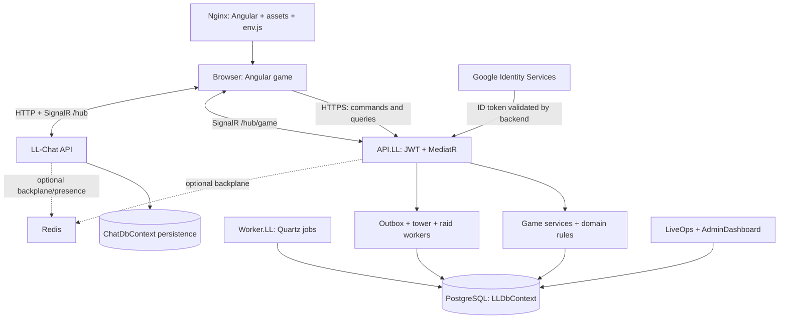
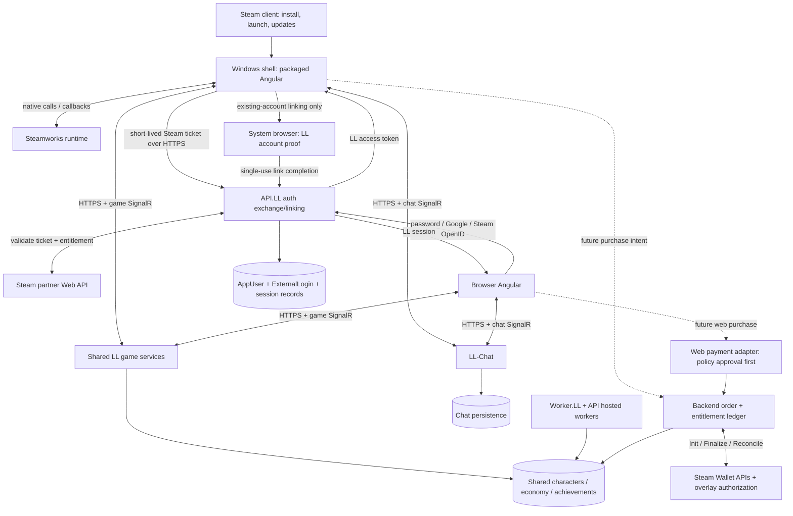
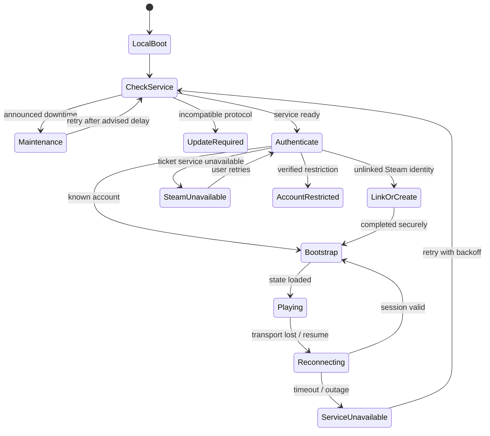

# LegendsLegacy: Steam readiness assessment

Assessment date: 12 September 2026. Decision: **EXPERIMENT FIRST**.

This is an assessment and proposed implementation plan, not an implementation. No application code, configuration, database, deployment, or Steam account was changed. Repository baseline: `31e5587a758282d347a55f7e4ef93287373d11b0`, including the working-tree state inspected during this review. Pre-existing changes include tournament and balance-harness work; they were left alone.

## 1. Executive summary

LegendsLegacy can plausibly become a credible Steam game without replacing Angular, moving combat onto the client, or splitting the player population. The important work is secure identity integration, a dependable installed client, recovery from interruptions, release compatibility, commercial decisions, and operating an online service for Steam customers.

**Recommended direction:** one backend and account ecosystem, one Angular gameplay application, and a thin Windows x64 desktop client containing a locally packaged Angular production build. Electron is the leading shell candidate because predictable Chromium behavior and reuse of TypeScript matter more here than shaving installer size. It is conditional on proving Steam integration without weakening renderer security. Do not start by loading the live website into a privileged window.

**Do not commit to a public release yet.** First run a bounded 1–3 developer-week experiment demonstrating Steam launch, validated login, account linking, overlay behavior, packaged routing, and recovery after sleep. Then use a limited, unmonetized Steam Playtest. This report does not authorize or perform that experiment.

The repository contains considerably more than a simple website: server-side combat and reward services, an outbox, state-version synchronization, account restrictions, marketplace checks, achievement ledgers, and operational tooling. It also contains concrete gaps that a wrapper would not solve:

- External identities currently support Google only; Steam authentication and browser Steam login are absent from the inspected implementation.
- Current access tokens are held in memory, but refresh responses serialize a refresh token as well as setting an HttpOnly cookie. The global JWT interceptor does not restrict attachment by destination.
- Refresh failure is collapsed into logout, including transient network errors.
- Runtime CORS configuration is hardcoded to localhost and the development website. Installed-client origins need explicit treatment.
- The web update mechanism polls `assets/version.json` and reloads the page. Reloading packaged files does not update an installed Steam build.
- Nobility has material benefits and tradable Signets. Its purchase gateway is disabled; there is no demonstrated production payment processor or refund settlement integration.
- The codebase has a focused beta journey and production-disabled raids. Code presence must not be confused with launch availability or proven product maturity.
- API startup runs database migrations and seeding. Merely launching the backend for inspection could mutate its configured database; it was not started.

**Steam MVP:** Windows, mouse/keyboard, safe Steam login/linking, shared progression, robust local launch/error screens, SteamPipe updates, a tested online service, honest store presentation, and no in-client commerce unless Steam Wallet fulfillment and reversals are complete. Achievements are valuable but can wait; Steam Cloud, Inventory Service, Workshop, VAC, and a native client rewrite do not belong in the MVP.

Confidence is high in the inspected architecture and the cited public platform rules; medium in shell selection and implementation estimates; unproven for live performance, production capacity, retention, actual Steam review acceptance, and private contractual terms.

## 2. Current LegendsLegacy architecture

### 2.1 What the repository implements

| Area            | Observed implementation                                                                                                 | Steam implication                                                                      |
| --------------- | ----------------------------------------------------------------------------------------------------------------------- | -------------------------------------------------------------------------------------- |
| Game UI         | Angular 20, standalone components, Angular Router lazy routes, signals, RxJS, CDK/Material and Tailwind; npm lockfile   | Reuse the UI and service layer; no rendering-engine conversion needed                  |
| Game API        | ASP.NET Core targeting .NET 10, versioned `/api/v1` controllers, MediatR commands/queries                               | Steam identity should exchange into LL sessions at this boundary                       |
| Layers          | Core Application/Domain, Infrastructure persistence/services/realtime, separate API and Worker hosts                    | Put Steam HTTP/SDK adapters outside Core; retain dependency direction                  |
| Persistence     | EF Core 10/Npgsql PostgreSQL, `LLDbContext`, repositories, migrations and JSON-backed content/seeding                   | Keep authoritative characters, rewards, economy and entitlements here                  |
| Scheduled work  | `Worker.LL` with Quartz registration for tournament progression, marketplace expiration and region bosses               | No desktop process needs to remain running to own these schedules                      |
| API-hosted work | Game-event outbox, tower simulation/finalization, raid resolution, title backfills and restriction refresh              | Capacity planning must include work in the API process, not only the standalone Worker |
| Game realtime   | Authenticated `/hub/game`; character, world, guild, raid and tournament audiences; optional Redis backplane             | Preserve HTTPS/SignalR rather than introducing Steam networking                        |
| Chat            | Independently deployable `LL-Chat`, authenticated chat hub, separate `ChatDbContext`, optional Redis presence/backplane | Desktop must reach and recover both game and chat services                             |
| Administration  | `API.AdminDashboard` and Angular dashboard, plus `API.LiveOps` and its separate frontend                                | These are operator surfaces, never desktop bundle contents                             |
| Delivery        | Dockerized Nginx frontend, containerized backend/worker/chat, Helm packaging, GitHub workflows                          | Add Steam distribution alongside existing delivery                                     |

The actual API folder names include `API.LL` and `API.AdminDashboard`, rather than the shortened names in the top-level repository description.



This diagram describes code/configuration, not a verified production topology. The repository does not establish whether the two databases share a physical PostgreSQL cluster, the live replica count, TLS edge configuration, backup quality, uptime, or capacity. External infrastructure was not inspected or changed.

### 2.2 Accounts and characters

`AuthController` provides password registration/login, guest creation, guest conversion, Google login/binding, rename, logout, refresh and user information. `AppUser` allows nullable email/password and has `IsGuest`, `EmailConfirmed`, external logins and refresh tokens. `AuthProvider` currently contains only `Google`. `ExternalLoginConfiguration` already uniquely indexes `(Provider, ProviderUserId)`.

Registration validates character name/email/password, creates the account, publishes `UserCreatedEvent`, retrieves the resulting character and issues tokens. The normal path resolves one current character for an account; this is not an established multi-character selector. `AppUser.CharacterId` is not mapped, and the character's `UserId` index is not unique. Therefore “one character in the current login flow” is accurate; “the database enforces one character per account” is not.

The JWT contains account and character identity. `BaseController` reads them from claims rather than accepting an arbitrary acting character from the request. `AuthService` holds the access token in memory and restores sessions through a rotating refresh-cookie endpoint. The refresh cookie is HttpOnly, Secure outside local development, SameSite=None when secure, scoped to `/api/v1/auth`, and given a one-year cookie lifetime. That cookie lifetime is not proof of the server-side token lifetime. Refresh requests and logout require `X-LL-Refresh-Request: 1`.

Refresh records are looked up through a SHA-256 token hash. Existing rotation/reuse tests are useful foundations. No implemented player-facing password-reset/recovery endpoint was found in the targeted auth searches; `EmailConfirmed` alone is not a complete verified-email recovery system.

### 2.3 Gameplay, networking and authority

Inspected controllers/services cover PvE combat, dungeon runs, equipment acquisition/progression, essences, Colosseum/tournaments, guilds, marketplace, quests, prophecies, region bosses, World Tower, achievements/titles and raids. This is an online progression game with meaningful social and economic state. There is no reason to turn it into P2P networking.

`CharacterActionsController` accepts an area selection for combat, while actor identity comes from the JWT. `CharacterActionService` resolves schedules with server time and delegates to combat services. Equipment acquisition rolls and rewards are handled by backend services. Crafting/gathering are not the current action-controller gameplay surface; old names such as the frontend workflow's “Copy recipes.json” step are not evidence that crafting is active.

`ApiService` uses credentialed HTTP requests. Mutation responses can carry `X-LL-Domain-Versions`. The state-sync coordinator refreshes invalidated scopes, tracks revisions, retries failures and responds to online events. `GameRealtimeConnection` reconnects and resubscribes audiences. `GameHub` checks guild membership and raid access before subscribing. Realtime is a notification/synchronization mechanism; persisted HTTP results remain authoritative.

Daily/weekly and long-term behavior is distributed through quests, progression/content definitions, services and scheduled jobs, rather than a desktop timer. A Steam build must preserve server time and bounded catch-up behavior. Steam playtime must never become the clock for rewards.

### 2.4 Configuration, assets, releases and dependencies

The browser reads `window.env` from an Nginx startup-generated `assets/env.js`. Configuration includes API/chat roots, Google client ID, focused beta journey, raid availability and maintenance text. `environment.production` is literally false in the inspected file; feature decisions also use the runtime environment string. An Angular production compilation and a production game environment are distinct concepts here.

The frontend image runs `npm ci`, builds Angular, and serves static files with hashed JS/CSS caching and uncached entry/version/config files. `AppUpdateService` polls the web version every minute while visible and offers page reload. Backend content lives under `API.LL/Data`, including world, rewards, quests, tower, raids and titles; some policies are C# constants such as Nobility benefits. Data changes may need server deployment/reload, but not necessarily client releases.

GitHub workflows publish GHCR images and Helm packages and update version files in a separate infrastructure repository. That is evidence of deployment intent, not proof of current cluster state. Google, PostgreSQL, optional Redis, container registry/CI, .NET packages and npm packages are external dependencies. No Steam runtime/SDK project was found. No live Stripe/PayPal provider was found; the purchase interface mentions a future Stripe integration and registers a disabled gateway.

### 2.5 Evidence map

These files anchor the findings and are the primary implementation touchpoints:

| Evidence                                                                         | Source                                                                                                                                                                                                                                                                                                                                                                     |
| -------------------------------------------------------------------------------- | -------------------------------------------------------------------------------------------------------------------------------------------------------------------------------------------------------------------------------------------------------------------------------------------------------------------------------------------------------------------------- |
| API configuration, CORS, JWT, maintenance, hosted workers and migration-on-start | [Program.cs](C:/repos/Legends-Legacy/legends-legacy/LL/src/API/API.LL/Program.cs)                                                                                                                                                                                                                                                                                          |
| Current auth endpoints/cookies                                                   | [AuthController.cs](C:/repos/Legends-Legacy/legends-legacy/LL/src/API/API.LL/Controllers/V1/AuthController.cs)                                                                                                                                                                                                                                                             |
| Account identity model                                                           | [AppUser.cs](C:/repos/Legends-Legacy/legends-legacy/LL/src/Core/Domain/Models/Users/AppUser.cs), [ExternalLogin.cs](C:/repos/Legends-Legacy/legends-legacy/LL/src/Core/Domain/Models/Users/ExternalLogin.cs)                                                                                                                                                               |
| Automatic character creation                                                     | [RegisterCommand.cs](C:/repos/Legends-Legacy/legends-legacy/LL/src/Core/Application/UseCases/Users/Commands/Register/RegisterCommand.cs)                                                                                                                                                                                                                                   |
| Token storage and failure behavior                                               | [auth.service.ts](C:/repos/Legends-Legacy/legends-legacy/LL/src/Presentation/ll/src/app/core/services/api/auth/auth.service.ts)                                                                                                                                                                                                                                            |
| Token destination handling                                                       | [auth-interceptor.ts](C:/repos/Legends-Legacy/legends-legacy/LL/src/Presentation/ll/src/app/core/interceptors/auth-interceptor.ts)                                                                                                                                                                                                                                         |
| Audience authorization                                                           | [GameHub.cs](C:/repos/Legends-Legacy/legends-legacy/LL/src/Infrastructure/RealTime/RealTime.LL/GameHub.cs)                                                                                                                                                                                                                                                                 |
| Reconnect and state invalidation                                                 | [game-realtime-connection.service.ts](C:/repos/Legends-Legacy/legends-legacy/LL/src/Presentation/ll/src/app/core/services/real-time/game-realtime/game-realtime-connection.service.ts), [state-sync-coordinator.service.ts](C:/repos/Legends-Legacy/legends-legacy/LL/src/Presentation/ll/src/app/core/services/real-time/game-realtime/state-sync-coordinator.service.ts) |
| Premium benefits and disabled checkout                                           | [NobilityBenefits.cs](C:/repos/Legends-Legacy/legends-legacy/LL/src/Core/Domain/Models/Nobility/NobilityBenefits.cs), [DisabledNobilityPurchaseGateway.cs](C:/repos/Legends-Legacy/legends-legacy/LL/src/Infrastructure/Service/Services.LL/Nobility/DisabledNobilityPurchaseGateway.cs)                                                                                   |
| Tradable entitlement units                                                       | [SignetTradingService.cs](C:/repos/Legends-Legacy/legends-legacy/LL/src/Infrastructure/Service/Services.LL/Nobility/SignetTradingService.cs)                                                                                                                                                                                                                               |
| Web update behavior                                                              | [app-update.service.ts](C:/repos/Legends-Legacy/legends-legacy/LL/src/Presentation/ll/src/app/core/services/client-side/app-update/app-update.service.ts)                                                                                                                                                                                                                  |
| Existing achievement authority                                                   | [AchievementService.cs](C:/repos/Legends-Legacy/legends-legacy/LL/src/Infrastructure/Service/Services.LL/Achievements/AchievementService.cs)                                                                                                                                                                                                                               |
| Current release workflow                                                         | [LL-backend.yml](C:/repos/Legends-Legacy/legends-legacy/.github/workflows/LL-backend.yml), [ll-frontend.yml](C:/repos/Legends-Legacy/legends-legacy/.github/workflows/ll-frontend.yml)                                                                                                                                                                                     |

## 3. Steam feasibility and review risks

Steam distribution requires a configured application, installable build, launch configuration and successful review. It does **not** universally require linking the Steamworks runtime API. Valve explicitly says API integration is optional. In this plan it becomes necessary because Steam-native authentication is a chosen product requirement. [Steamworks API overview](https://partner.steamgames.com/doc/sdk/api).

No blanket ban on HTML/Angular/Electron games was found in the public onboarding and review rules. More concretely, Valve's overlay documentation explicitly discusses embedding Chromium for web games and notes that its CEF/native-rendering workaround is difficult. That supports feasibility, not automatic approval of an arbitrary website wrapper. Browser rendering can fail overlay expectations because it does not continuously present complete frames. [Steam Overlay](https://partner.steamgames.com/doc/features/overlay).

The defensible submission is an installed game that boots into its own local UI, has no address bar, survives an unavailable website, and clearly explains its online dependency. The public review criteria include successful startup on advertised OSes, implemented advertised features and Steam Wallet transactions. A reviewer should get a near-final build and a functioning service, with clear access instructions. [Review process](https://partner.steamgames.com/doc/store/review_process).

| Specific risk                                | Current evidence                               | Required response                                                    |
| -------------------------------------------- | ---------------------------------------------- | -------------------------------------------------------------------- |
| Blank window when website is down            | Current app is browser-hosted                  | Package boot/error UI locally                                        |
| Login friction or unsupported Google sign-in | Dynamically loaded GIS/FedCM web flow          | Native Steam login; existing-account linking through system browser  |
| Browser behavior leaking through             | History-back error page, refresh-based updates | Game navigation, installed-client update UX                          |
| Premium checkout sends customer away         | Purchase abstraction is not yet implemented    | Keep disabled or implement Steam Wallet                              |
| Hidden content advertised as available       | Focused beta guards; raids disabled for prod   | Freeze and verify actual release feature configuration               |
| Bad install/exit behavior                    | No desktop executable yet                      | Clean-machine Steam install, first launch, close and uninstall tests |
| Overlay/input failure                        | No shell tested                                | Treat packaged overlay and keyboard tests as experiment gates        |
| Online outage mistaken for account loss      | Refresh errors become logout                   | Separate service errors from invalid credentials                     |

Missing fullscreen or particular shortcuts are product-quality risks, not a documented universal reason for Steam rejection. External support/privacy links are not the same as an external shop; nevertheless all links must be routed intentionally and reviewed. Do not claim that every external link or third-party login is forbidden.

## 4. Recommended desktop technology

### 4.1 Comparison

The size, RAM and startup comparisons below are engineering expectations, not LegendsLegacy measurements. All choices retain online backend costs. A smaller shell does not remove Angular's DOM, asset, chat and rendering memory.

| Approach                           | Complexity / Angular fit                                               | Steamworks                                                                               | Size, RAM, startup                                                                                | Platforms                                                                                | Solo maintenance / richer features                                                                                    |
| ---------------------------------- | ---------------------------------------------------------------------- | ---------------------------------------------------------------------------------------- | ------------------------------------------------------------------------------------------------- | ---------------------------------------------------------------------------------------- | --------------------------------------------------------------------------------------------------------------------- |
| **Electron with packaged Angular** | Medium; excellent Chromium/TypeScript reuse                            | Native module in main process or narrow native adapter; callbacks and overlay need proof | Large bundled browser, material multi-process RAM, moderate startup; predictable runtime          | Windows native; Linux and macOS builds possible, each requires QA; Proton not assumed    | Best initial fit; browser/security upgrades and native bindings are ongoing debt; WebGL/canvas/audio remain available |
| **Tauri**                          | Medium–Large; Angular fits, adds Rust and platform webview differences | Rust binding/FFI and callback lifecycle; overlay is not automatically solved             | Smaller shell; shared OS runtime; RAM often lower but not guaranteed; potentially faster startup  | WebView2 on Windows, WebKit on macOS, WebKitGTK on Linux; Deck dependencies need testing | Attractive if measured footprint is decisive; more engine/platform test combinations for a solo developer             |
| **WebView2 + .NET shell**          | Medium on Windows; fits C# skills and Angular                          | C# binding or P/Invoke; multi-process webview overlay must be tested                     | Small app with shared runtime; fixed runtime removes much size advantage; Angular still costs RAM | Strong Windows fit; not a native Linux/macOS plan; Proton support unproven               | Good Windows-only fallback; less language expansion, but permanent Windows coupling                                   |
| **Native/game-engine rewrite**     | Very Large; replaces UI, routing, forms and state presentation         | Often good engine bindings; still requires backend auth/commerce work                    | Entirely implementation-dependent; no honest generic guarantee of lower resource use              | Engine/toolkit dependent; controller support still must be designed                      | Highest divergence and rewrite risk; justified only by a different game experience                                    |
| **CEF/native renderer host**       | Large; preserves Angular but adds rendering/input composition          | Native rendering can address overlay presentation directly                               | Browser footprint remains; native frame loop may raise idle GPU use                               | Possible multi-platform, significant packaging burden                                    | Fallback for a proven overlay blocker, not the starting point                                                         |
| **Browser/PWA shortcut launcher**  | Small superficially                                                    | Weak lifecycle/native API integration                                                    | Tiny launcher but browser resource use remains                                                    | Depends on installed browser                                                             | Poor installed-game experience; reject as the target Steam product                                                    |

Tauri's system webviews introduce OS-specific behavior rather than bundling the same engine everywhere. WebView2 supports automatically maintained Evergreen or app-managed Fixed Version distribution; Microsoft documents a fixed runtime exceeding 250 MB. [Tauri webviews](https://v2.tauri.app/reference/webview-versions/), [Microsoft runtime distribution](https://learn.microsoft.com/en-us/microsoft-edge/webview2/concepts/distribution).

For all viable shells, Steam should update the application; do not also enable the shell's independent updater. WebView2 Evergreen/OS webview security updates are runtime servicing, a separate concern from game-code updates. Electron/CEF browser fixes require timely client builds. macOS adds signing/notarization and architecture testing; Linux adds packaging/runtime/graphics testing. Neither should be advertised merely because a framework can compile there.

Debugging differs: Electron offers familiar Chromium tools plus main-process debugging; Tauri spans frontend, Rust and OS webview tools; WebView2 spans DevTools and Visual Studio; CEF requires browser and native graphics diagnostics; a rewrite spans the new engine and existing API. All require symbols, correlated build IDs and reproducible packaged failures.

### 4.2 Recommendation and decision gates

Choose **Electron provisionally**, not because any wrapper is sufficient, but because this game's large existing Angular UI makes consistent browser behavior and avoiding a second UI implementation valuable. Prefer WebView2/.NET if Windows-only scope is firm and its measured overlay/auth reliability is better. Choose Tauri only if the experiment shows a worthwhile resource improvement without multiplying operational effort.

`steamworks.js` is a candidate, not an approved dependency. Its own Electron example enables Node integration and disables context isolation. Do not copy that configuration into LL. Keep native Steam access outside the renderer and prove the required API surface, including Web API tickets, callbacks, overlay and orderly shutdown. Its overlay helper is evidence of a possible path, not a compatibility guarantee. [Binding repository](https://github.com/ceifa/steamworks.js).

The experiment must measure packaged startup to local screen and playable state, total process-tree working set, idle CPU/GPU, sleep recovery, and frame/overlay behavior on at least an integrated-GPU and a discrete-GPU Windows machine. Proposed gates: local screen within 3 seconds and playable state within 10 seconds under a defined healthy-network test; no unbounded memory growth in an eight-hour session; reliable input/overlay and no security downgrade. Record cold and warm runs. These are proposed acceptance targets, not existing results or Steam mandates.

If overlay requires an expensive custom renderer or weak security, reassess the economics before choosing CEF or a rewrite. Do not spend weeks accumulating browser flags without a clear pass/fail boundary.

## 5. Proposed Steam architecture



The two payment paths are proposed; neither is a claim of a working current processor. Identity remains `AppUser.Id`. SteamID is an external login identifier, not a new character primary key. LL JWTs remain the game/chat authorization format. The renderer remains untrusted even when loaded from disk.

Keep a narrow platform interface for login, opening vetted links, window mode, build information, optional presence and achievements. Do not proxy the whole game through a new custom native transport. Angular can continue normal HTTP/SignalR to exact trusted endpoints; privileged authentication work stays in the shell. Prefer fresh Steam exchange on each app start, avoiding a persistently stored desktop refresh credential for the MVP.

## 6. Steamworks feature decisions

“Required” below distinguishes platform distribution requirements from requirements of this recommended product. Optional Steam features are not a substitute for launch quality. Capability descriptions follow Valve's [feature documentation](https://partner.steamgames.com/doc/features), [API overview](https://partner.steamgames.com/doc/sdk/api) and [SteamPipe upload guide](https://partner.steamgames.com/doc/sdk/uploading); classifications are LL-specific judgments.

| Feature                         | Classification                                                | Reason / scope                                                                           |
| ------------------------------- | ------------------------------------------------------------- | ---------------------------------------------------------------------------------------- |
| App ID                          | Required                                                      | Real application identity for distribution; do not ship development ID 480               |
| Steamworks SDK runtime          | Required for recommended design                               | Needed for native ticket acquisition; API integration is not a universal publishing rule |
| Steam authentication            | Required for recommended design                               | Reliable first launch and proof of Steam identity                                        |
| SteamID mapping                 | Required                                                      | Unique external identity; use decimal strings across JavaScript/JSON                     |
| Ownership verification          | Required when access depends on Steam license                 | Separate identity from app/DLC entitlement; especially paid/refunded/borrowed access     |
| Overlay                         | Strongly Recommended; required for chosen in-game Wallet flow | Prove graphics/input integration before monetizing                                       |
| Achievements                    | Strongly Recommended after core launch gates                  | Small curated subset; acceptable MVP deferral                                            |
| Stats                           | Optional                                                      | Only counters needed by selected achievements; LL remains authoritative                  |
| Leaderboards                    | Optional                                                      | Existing shared leaderboards are preferable; a Steam-only mirror fragments comparison    |
| Rich Presence                   | Optional                                                      | Low-cost activity summary if integration is stable                                       |
| Friends discovery               | Optional                                                      | Opt-in linked-player discovery; avoid mandatory social graph imports                     |
| Invites                         | Optional                                                      | Useful for a real group activity, not arbitrary teleport/join fiction                    |
| Steam Cloud                     | Actively Avoid for progression                                | Database is canonical; optional future preference sync only                              |
| Screenshots                     | Optional API integration                                      | Test normal Steam screenshot behavior; custom capture can wait                           |
| Steam Input                     | Optional for Windows mouse/keyboard launch                    | Useful for a later complete controller experience                                        |
| Steam Deck                      | Optional; defer support                                       | Current UI and shell unverified on hardware                                              |
| Steam Inventory Service         | Actively Avoid                                                | Would duplicate existing equipment/Signet ownership and add trading complexity           |
| DLC                             | Optional                                                      | Stable account upgrades/cosmetics later; not required to sell membership time            |
| Microtransactions API           | Required if selling inside Steam game                         | Backend-controlled order/settlement path                                                 |
| Steam Wallet                    | Required for in-game transactions                             | Do not route checkout to an external provider                                            |
| Workshop                        | Irrelevant to current game                                    | No demonstrated player-authored content workflow                                         |
| Remote Play streaming           | Optional                                                      | Test later if useful; does not make the backend offline-capable                          |
| Remote Play Together            | Irrelevant to current game                                    | No local shared-screen multiplayer model                                                 |
| VAC / client anti-cheat         | Actively Avoid for MVP                                        | Does not solve forged HTTP requests or economic collusion                                |
| Steam public Game Bans          | Optional, defer                                               | Higher moderation obligations; retain LL account restrictions                            |
| Legacy Steam Error Reporting    | Actively Avoid                                                | Valve marks it near end-of-life and Windows 32-bit only                                  |
| Modern crash/error telemetry    | Strongly Recommended                                          | Shell, renderer and API visibility is operationally necessary                            |
| Launch options                  | Required                                                      | Correct executable/working directory/OS; keep user arguments narrow                      |
| Branches/betas                  | Strongly Recommended                                          | Private candidate testing and controlled promotion                                       |
| Depots                          | Required                                                      | At least one Windows content depot with correct package access                           |
| Builds                          | Required                                                      | Versioned depot manifests and a tested release candidate                                 |
| SteamPipe                       | Required distribution tooling                                 | Upload and promote client content                                                        |
| Steam automatic updates         | Required distribution behavior                                | Backend must tolerate clients already running older builds                               |
| Steam matchmaking / P2P / relay | Actively Avoid                                                | Existing HTTP/SignalR service model is appropriate                                       |

Legacy crash API limitation: [Steam Error Reporting](https://partner.steamgames.com/doc/features/error_reporting). Wallet obligation: [In-game purchases](https://partner.steamgames.com/doc/features/microtransactions). Do not label unchecked store features as supported.

The deliberate exclusions have specific platform reasons: [Cloud](https://partner.steamgames.com/doc/features/cloud) synchronizes files, which would duplicate LL's server saves; [Inventory Service](https://partner.steamgames.com/doc/features/inventory) supplies persistent inventories LL already owns; [Workshop](https://partner.steamgames.com/doc/features/workshop) needs a player-content workflow. [Remote Play](https://partner.steamgames.com/doc/features/remoteplay) streams an existing session, and Together targets shared local play. Default [screenshots](https://partner.steamgames.com/doc/features/screenshots) depend on an active overlay, so test capture in the packaged build. Steam public [Game Bans](https://partner.steamgames.com/doc/features/anticheat) are designed for unfair competitive advantage in multiplayer, not general chat moderation; keep those policies separate.

## 7. Authentication and account linking

### 7.1 Model choice

| Option                           | Benefit                                                      | Problem                                                  | Decision                                       |
| -------------------------------- | ------------------------------------------------------------ | -------------------------------------------------------- | ---------------------------------------------- |
| A: Steam replaces LL login       | Simple Steam-only onboarding                                 | Disrupts browser users, recovery and existing identities | Reject                                         |
| B: Existing LL login then link   | Protects established accounts                                | Mandatory credentials add friction for new Steam players | Offer to existing players                      |
| C: Automatic LL account creation | Fast first launch                                            | Silently creates duplicates for established players      | Use only after an explicit “new player” choice |
| D: Hybrid                        | Steam-native new-player path plus safe reuse of old accounts | Requires deliberate linking and recovery flows           | Recommend                                      |

First launch: prove Steam identity, look up its link, and enter the linked character if present. Otherwise show **“Continue my existing character”** and **“Create a new character”** before creating any persistent account. Explain that identities link to one account and progression is shared. Do not use the Steam display name as a unique account identifier or fabricate an email address.

### 7.2 Ticket exchange

Acquire `GetAuthTicketForWebApi` with a fixed service identity, wait for its response callback, and send the ticket to LL over HTTPS. The backend calls `ISteamUserAuth/AuthenticateUserTicket` with the expected App ID, identity and publisher key; trust its returned SteamID, not a client-supplied ID. Publisher credentials stay server-side. Use the current endpoint-specific reference when overview wording differs. [AuthenticateUserTicket](https://partner.steamgames.com/doc/webapi/ISteamUserAuth).

Proposed LL controls: bind the exchange to a short-lived challenge, consume challenges atomically, deduplicate concurrent retries, bound ticket size, rate-limit exchanges, redact tickets from logs and cancel native ticket handles when done. A challenge does not transform a stolen ticket into a safe credential; prevent interception and reject reuse. Ticket identity strings are routing/binding information, not secrets. Validate account restrictions before issuing an LL session.

For an App-ID-gated product, perform backend entitlement checks rather than trusting `BIsSubscribed` or an editable config. Steam documents `CheckAppOwnership` for backend ownership and OpenID for browser identity. Browser Steam OpenID proves identity; it does not by itself prove paid ownership. [Authentication and ownership](https://partner.steamgames.com/doc/features/auth).

### 7.3 Linking safely

Existing players authenticate their LL account in the system browser. Create a short-lived pending link containing the authenticated Steam subject, requested LL account, challenge hash and expiration. Require fresh proof of both accounts, explicit confirmation of the character being linked, and atomic uniqueness checks. The desktop polls a narrowly scoped completion endpoint or consumes a single-use return code; never put a bearer token, password or Steam ticket in launch arguments or a callback URL.

A browser guest who wants to keep progress must prove the current guest session and confirm that character, then bind it without creating a second character. A guest session alone is weaker recovery evidence than a verified external identity; expose this clearly. For Google-only existing accounts, use the established website in the system browser, not Google login inside the embedded renderer. Google's OAuth policy disallows developer-controlled embedded user agents. [Google OAuth policies](https://developers.google.com/identity/protocols/oauth2/policies).

Never merge by email, Steam display name or claimed character name. If both identities already have progressed accounts, refuse automatic merging and offer a documented support process. Default to preserving both records; inventory, PvP history, guild membership and paid entitlements make merges expensive and abusable.

### 7.4 Proposed database changes

| Model/change                      | Proposed fields and invariants                                                                                                         |
| --------------------------------- | -------------------------------------------------------------------------------------------------------------------------------------- |
| `AuthProvider`                    | Add Steam without renumbering persisted Google values                                                                                  |
| Existing `ExternalLogin`          | Store canonical SteamID string; reuse unique `(Provider, ProviderUserId)`; never persist ticket in AccessToken/RefreshToken columns    |
| One Steam identity per LL account | Add a provider-specific filtered unique index on `UserId` for Steam; do not accidentally prohibit future multiple non-Steam identities |
| Account creation                  | Support a registered external account with no email; current `ConvertGuestToExternalAccount(string email)` is Google-specific          |
| Pending link                      | ID, account, verified Steam subject, challenge hash, created/expiry/consumed times, purpose and concurrency token                      |
| Identity audit                    | Link/unlink/recovery events, actor, previous association and reason; restricted access and retention policy                            |
| Session metadata                  | Auth method, external subject, session family/revocation, optional license-check freshness; separate browser and desktop policies      |
| Conditional entitlement cache     | App ID, SteamID, owner SteamID, permanent/temporary status, checked time, validity/error state; never replace account identity         |
| Commerce, if enabled              | Provider order IDs, App ID, account, SteamID, SKU, quantity, minor-unit amount/currency, settlement state, fulfillment/reversal IDs    |
| Optional achievement projection   | Stable mapping key and per-SteamID synchronization status; LL completion remains canonical                                             |

Keep the normal one-current-character experience. Before adding a one-character database constraint, audit existing rows and NPC/entity modeling; the current nonunique index cannot justify blindly applying one. A Steam integration is not a reason to introduce character slots.

### 7.5 Recovery, unlinking, bans and account switching

- Steam-only players can later use verified Steam OpenID on the browser. Offer adding a separately verified email/password or Google identity for recovery; do not require email for initial Steam play.
- For MVP, unlinking should be a controlled support operation with proof and audit. Never remove the last usable identity. Revoke sessions and require fresh login after sensitive identity changes. A later self-service unlink requires recent authentication, recovery proof and a cooldown.
- Maintain one SteamID to one LL account and one Steam identity per LL account. Do not allow rotating Steam accounts to farm rewards or unlock achievements for friends. Historical linkage/audits survive unlinking according to retention policy.
- LL bans and multiplayer restrictions follow the account across browser and Steam. Apply restrictions during ticket exchange and commands; unlinking must not clear them. Do not translate every LL moderation action into a public Steam ban.
- On Steam-account change, clear account-scoped caches, tokens and presence; acquire new proof before continuing. An old persisted session must not silently open another Steam user's character.

### 7.6 Families, paid access and refunds

Use the playing user's SteamID for account identity, never the license owner's. Valve distinguishes temporary family access from permanent ownership and warns against granting permanent backend rights from borrowed licenses. Record the owner only as entitlement/audit context. Do not assume LL is eligible for sharing without checking the final account/subscription configuration. [Steam Families](https://partner.steamgames.com/doc/features/families).

For an initially free game, a Steam identity is not proof of payment. If the game later becomes paid, explicitly choose between selling the Steam distribution entitlement while the browser stays free, or requiring a shared game-access entitlement on every channel. The latter requires browser enforcement and a grandfathering policy. A token's claimed platform cannot decide paid access.

A refunded base-game license removes that access entitlement after reconciliation; it does not delete the LL account or character. If browser play remains free, that character remains available there by design. If all gameplay becomes paid, deny commands lacking an active entitlement on either channel. Preserve progression for reactivation. Refunds of optional items revoke only the relevant grants, with special handling for consumed/traded benefits. Do not infer permanent ownership from one successful login or keep granting access indefinitely during Steam outages.

## 8. Browser and Steam coexistence

Use the same production account, character, economy, PvP pools, guilds, world events and leaderboards. Progression is already in PostgreSQL; there is nothing to export or synchronize between two save files. A browser action should appear in the Steam session through the existing version/invalidation mechanism, and vice versa.

Allow concurrent browser/desktop use initially. The server must serialize conflicting operations and issue rewards once, independently of the number of open windows. Single-instance desktop behavior is a UX preference, not an anti-cheat boundary. Test simultaneous combat resolution, reward claims, loadout edits, marketplace purchases and Signet redemption from both channels.

Avoid Steam-exclusive power, loot rates, currency or purchase advantages. A modest nontradable cosmetic can be considered later, granted once per qualifying account after verified linkage, but offers little MVP value. Do not grant it again on reinstallation or unlink/relink. Keep shared leaderboards authoritative rather than promoting Steam users into a separate ranking.

Separate _testing environments_ from the one production ecosystem. Steam Playtest should use a staging realm with its own identity records or carefully scoped test associations and no production financial entitlements. Explicitly disclose wipes. A Playtest App ID must not confer release access, unlock release achievements or write production rewards. This is operational isolation, not a permanent Steam/browser split.

## 9. Payments and monetization

### 9.1 What exists today

Nobility is time-limited membership redeemed using Signet units. The code records issuance, movements, reservation/listing, trade and redemption, with operation IDs and stale-preview checks. `DisabledNobilityPurchaseGateway` says purchases are unavailable during alpha and Signets are distributed by the game team and traded on the market. This is an entitlement/economy implementation, not a completed billing system.

The inspected benefits are: 168 versus 24 hours of offline retention, six versus three essence/equipment loadouts, eight versus five arena ticket capacity, two versus eight hours focus cooldown, 30 versus ten buy/sell marketplace limits, and additional prophecy rerolls. Calling this cosmetic-only would be inaccurate. Whether players regard it as fair convenience or paid advantage requires product testing, particularly around PvP and tradable membership time.

### 9.2 Confirmed rules versus unresolved contract questions

| Question                                                 | Finding                                                                                                                                                              | Type                                      |
| -------------------------------------------------------- | -------------------------------------------------------------------------------------------------------------------------------------------------------------------- | ----------------------------------------- |
| Can Steam in-game checkout use Stripe/PayPal directly?   | Public documentation requires Steam Wallet microtransactions; review also disallows linking to stores without Wallet                                                 | Confirmed platform policy                 |
| Can Steam sell items/currency/membership time?           | Wallet can fund items or game currency; product-specific fulfillment remains yours                                                                                   | Technical capability                      |
| Can a browser shop share entitlements?                   | Technically straightforward through the shared LL ledger; public pages reviewed do not settle every off-Steam commerce clause                                        | Contract confirmation needed              |
| Is universal cross-store price parity established here?  | No. Do not assert one from generic assumptions. Early Access does have an explicit rule against a higher price than another service                                  | Confirmed EA rule; wider terms unresolved |
| Can the Steam UI advertise “buy cheaper on the website”? | Do not ship this: it conflicts with the documented in-game transaction/linking restriction                                                                           | Platform policy                           |
| What exact revenue share applies?                        | Verify the signed Distribution Agreement and partner financial terms; use a 30% platform-share sensitivity assumption for budgeting, not a verified LL contract rate | Contract/economic assumption              |

Sources: [Purchase requirements](https://partner.steamgames.com/doc/features/microtransactions), [build review](https://partner.steamgames.com/doc/store/review_process), [Early Access rules](https://partner.steamgames.com/doc/store/earlyaccess), [financial reporting](https://partner.steamgames.com/doc/finance/payments_salesreporting/faq).

The concrete questions for Valve before monetized implementation are: whether the existing browser shop can sell shared tradable Signets to linked accounts; whether the proposed catalog/pricing/promotions comply with the signed agreement; how existing web memberships should appear in Steam; and whether the proposed Families/DLC configuration is appropriate. No message was sent to Valve. These are unresolved facts, not reasons to defer the non-commercial assessment.

### 9.3 Product choices

| Product                        | Steam approach                                                          | Recommendation                                                                             |
| ------------------------------ | ----------------------------------------------------------------------- | ------------------------------------------------------------------------------------------ |
| Nobility time                  | Wallet purchase of defined duration or Signets with server redemption   | Prefer fixed duration first; avoid automatic renewal initially                             |
| Recurring subscription         | Steam recurring billing and agreement lifecycle                         | Defer: renewals, failure, cancellation and double-subscription handling add support burden |
| Premium currency               | Wallet order grants server-ledger units                                 | Defer until fraud controls exist; currency must not become client-controlled               |
| Cosmetics / supporter pack     | Nontradable account entitlement via Wallet or clearly defined DLC       | Better first paid product if commercially justified                                        |
| Account upgrades / convenience | Shared server entitlement with explicit scope and expiry                | Clearly describe actual effects and purchase limits                                        |
| DLC                            | Backend checks license; one-time grants protected against repeat claims | Use for real stable packages, not every consumable                                         |
| Future web payments            | Separate browser provider adapter, same entitlement ledger              | Only after contractual confirmation; never surface external checkout in Steam              |

Steam supports recurring subscription workflows, but that does not turn existing Nobility expiration into subscription billing. Model active, canceled-but-paid-through, past-due and expired states separately and prevent overlapping billing agreements across channels. [Recurring subscriptions](https://partner.steamgames.com/doc/store/pricing/subscriptions).

### 9.4 Correct purchase settlement

The server chooses SKU, price, currency, quantity, account and unique order ID. It initializes the transaction; the user authorizes through Steam; the client callback merely tells the backend to check/finalize. Grant once only after successful server-side finalization. Reconcile settlement changes using Steam reports at least daily; retry uncertain outcomes by order ID. [Microtransaction implementation](https://partner.steamgames.com/doc/features/microtransactions/implementation).

Add durable order states, an idempotent fulfillment/outbox step, a reconciliation worker and an auditable reversal path. Handle authorization with the client closed, backend crash after charge but before grant, duplicate callbacks, timeouts, wrong App ID, changed Steam account and replayed orders. A client saying “authorized” is never payment proof.

**Signets are the largest commercial engineering risk.** A buyer can trade a purchased Signet, receive currency, and then refund/charge back the original purchase. Current movement records help trace it but do not establish a finished reversal policy. Before selling tradable units, define transfer holds, spending limits for risky purchases, provenance propagation and compensation rules. Avoid automatically confiscating unrelated buyers' property. A nontradable first paid SKU substantially reduces this complexity.

Use Steam-reported currency and server catalogs, not client locale or an editable country field, for transaction amounts. Store integer minor units with correct currency precision. Regional pricing can incentivize resale of tradable goods; price and trade policy must be considered together. Taxes, refunds, chargebacks and withholding affect net receipts; browser merchant obligations remain a separate accounting problem. Valve describes tax interview/withholding and reporting responsibilities publicly, but no LL tax position was established. [Taxes FAQ](https://partner.steamgames.com/doc/finance/taxfaq).

Steam's standard game refund framework generally uses 14 days and under two hours, with additional provisions; third-party in-game purchase refunds are not automatically the same policy as base-game refunds. Implement verified settlement reversals and publish accurate terms rather than promising all purchases are final or all are refundable. [Steam refunds](https://store.steampowered.com/steam_refunds/).

For Playtest, purchases must remain disabled: Valve prohibits selling Playtest access or monetizing it with in-game transactions. [Steam Playtest](https://partner.steamgames.com/doc/features/playtest).

## 10. Desktop UX and online-only behavior

This is a source-level UX assessment. No running game, installed desktop prototype or Steam Deck was exercised. Responsive classes are evidence of intended behavior, not proof of usable rendering at every resolution.

The existing dashboard already has responsive panes, small/large-screen logic, focus-visible styling, reduced-motion handling, Escape handlers and dialog focus support. Preserve these. Do not describe the application as lacking all keyboard accessibility. Conversely, multiple local Escape listeners are not a coherent desktop-wide modal stack.

| Area                   | Current evidence / concern                                       | Proposed release behavior                                                                                               |
| ---------------------- | ---------------------------------------------------------------- | ----------------------------------------------------------------------------------------------------------------------- |
| Startup                | Public website routes lead to login/game                         | Local game-branded launch screen; auto-login returning Steam players; no marketing landing-page detour                  |
| Window resizing        | Dashboard checks 640/1280 breakpoints and uses constrained panes | Resizable window; test 1280×720, 1280×800, 1920×1080; choose minimum only after layout QA                               |
| High DPI               | CSS/rem-based UI but dense labels                                | Test 100/125/150/200% scaling, including monitor changes; expose UI/text scale                                          |
| Ultrawide              | Flexible layout, no verified ultrawide pass                      | Bound reading width, expand useful panes; no stretched text or inaccessible overlays                                    |
| Fullscreen             | No native window integration found                               | Windowed and borderless fullscreen; remember bounds; recover off-screen windows                                         |
| Shortcuts              | Local Escape handlers and focus directive                        | Topmost modal closes first; then panel/back; game menu last; Alt+Enter or F11 consistently toggles mode                 |
| Keyboard navigation    | Focus-visible and dialog support present                         | Tab/Shift+Tab order, focus restoration, actionable inventory/tooltip controls, no trapped inputs                        |
| Back navigation        | Not-found page uses browser `Location.back()`                    | Bound navigation to in-game routes; safe fallback to character screen                                                   |
| Refresh                | Web updater calls `window.location.reload()`                     | Intentional reconnect/reset UI; Steam-update message exits to Steam; no reload loops                                    |
| Text selection         | Buttons suppress selection                                       | Preserve chat/log/error copying and input selection; selectively suppress draggable game surfaces                       |
| Context menus          | No central desktop policy found                                  | Keep copy/paste menus for inputs/logs; do not expose browser navigation or developer menus by default                   |
| External URLs          | Website/Google assumptions                                       | Validate scheme/host and open support/privacy in system browser; never arbitrary shell execution                        |
| Notifications          | In-game notification services exist                              | Reuse in-game alerts; native notifications opt-in later, avoiding spam and private information                          |
| Minimize               | Browser visibility affects work                                  | Lower rendering/refresh activity; server progression continues; maintain safe reconnect                                 |
| System tray            | No demonstrated requirement                                      | Defer; closing should stop the executable and Steam playtime                                                            |
| Quit                   | Server owns persistence                                          | Close without “save game” fiction; explain committed actions persist and show pending financial outcomes on next launch |
| Sleep / network change | Realtime retry and online handlers exist                         | Resume hook, revalidate session, resubscribe, refresh authoritative scopes and server time                              |
| Multiple instances     | No desktop lifecycle yet                                         | Focus existing app per OS user/profile by default; retain browser coexistence                                           |
| Launch arguments       | None for a Steam executable                                      | Only predefined modes; no arbitrary API URL, JavaScript, file path or privilege overrides                               |

No offline playable simulation should be added. “Offline combat progression” means the server calculates retained progress; it does not mean the client can play without the service. Show that distinction on the store page and launch screen.

### Launch/reconnect state machine



Every blocking state needs plain text, retry where appropriate, a support/status route, build/request ID and Exit. An update-required screen explains that Steam must update the installed client; it must not promise page refresh will fetch new code. Maintenance should show a server message and estimated return only when known, respecting `Retry-After`. Existing API maintenance handling and frontend maintenance guards are foundations, but local error UI must work before any API responds.

Treat authentication outcomes separately: rejected ticket, Steam unavailable, expired LL session, backend unavailable and banned account are different states. Preserve recovery context on transient errors. Do not automatically clear or unlink an account because a refresh request returned 503 or timed out.

During reconnect, mark cached data stale and disable actions whose authoritative prerequisites are unknown. If a command timed out after submission, query its result/state or retry with the same operation ID; do not blindly replay non-idempotent commands. Chat disconnection should not block PvE if the game API remains healthy. After server restarts, subscriptions and state must rebuild without duplicating rewards.

## 11. Security assessment

### 11.1 What can be verified from the code

The inspected game paths follow a server-authoritative design: claims identify the acting account/character, combat time is server-sourced, marketplace operations validate quantity/ownership and use checked price arithmetic, Signet redemption validates operation identity and current units, and hub subscriptions enforce audience membership. Tests exist for account binding, refresh reuse, marketplace/guild authorization, transfer concurrency, character-action concurrency and Signet trading.

This supports the architecture, but is **not** a proof that every endpoint is secure. No penetration test, exhaustive handler review, load test or runtime concurrency test was performed. There is no demonstrated requirement to trust a Steam executable, and none should be introduced.

### 11.2 Concrete findings and required work

| Finding                                                                                | Impact                                                              | Proposed fix / validation                                                                                          |
| -------------------------------------------------------------------------------------- | ------------------------------------------------------------------- | ------------------------------------------------------------------------------------------------------------------ |
| `AuthInterceptor.withAuthHeader` adds bearer tokens without an origin/path allowlist   | Future third-party HttpClient calls could receive LL tokens         | Restrict to normalized, exact game/chat API destinations; test hostile lookalike URLs and anonymous-route matching |
| `Tokens` serializes `RefreshToken` even though frontend only needs access token/expiry | HttpOnly cookie does not prevent exposure through the response body | Browser-specific response DTO omits refresh credential; keep internal token record private to server flow          |
| Refresh failure becomes logout                                                         | Network loss creates false credential failures and refresh churn    | Typed auth/service failures; bounded retry; revoke only for verified invalid/reused credentials                    |
| Public API CORS list is hardcoded                                                      | Packaged origin and production browser origin may not work          | Explicit environment-specific trusted origins; test main API and chat separately                                   |
| Browser feature flags/route guards are editable                                        | Hidden functionality may remain callable                            | Enforce any actual authorization/release restriction server-side; UI gating is presentation only                   |
| Issuer/audience validation is conditional on nonempty config                           | A missing production setting weakens token separation               | Fail startup on invalid production auth config; distinguish dev/test/prod token audiences                          |
| No general game API rate limiter found in targeted search                              | Login/exchange/guest creation and game spam need protection         | Add per-account and per-IP limits with sensible NAT handling; verify edge controls externally                      |
| No complete password recovery workflow found                                           | Existing players can be stranded during migration                   | Verified recovery or documented staffed support path before inviting them to link                                  |
| No Steam-capable session/entitlement lifecycle                                         | License/account change could leave stale access                     | Auth-method/session metadata, ban enforcement, revocation and license freshness policies                           |
| Existing CORS and cookie model assumes web origins                                     | Desktop scheme/cookie behavior may differ                           | Dedicated Steam exchange with in-memory desktop session; secure custom-origin integration test                     |

The JWT destination issue is a latent exposure in the code, not a claim that an observed external request already leaked a token. Likewise, absent in-repository rate limits/CSP do not prove the deployed edge lacks them. The inspected game Nginx configuration does not supply a CSP; LiveOps does have a separate CSP, which does not protect the game client.

### 11.3 Desktop threat model

API URLs and App IDs are public identifiers. Hiding them, obfuscating JavaScript or signing the binary does not stop reverse engineering, modified clients, packet replay or bots. Enforce ownership, costs, cooldowns, timing, item provenance, operation uniqueness and bans on the server. Rate limits must attach to account and operation, not solely IP or an editable platform header.

For Electron: local packaged code, sandboxed renderer, context isolation, no Node integration in gameplay, restrictive CSP, denied permissions by default, validated IPC senders/payloads, blocked unexpected navigation/windows and vetted external links. Never solve CORS or overlay by turning off web security or exposing arbitrary filesystem/process APIs. These controls follow [Electron's security guidance](https://www.electronjs.org/docs/latest/tutorial/security).

Treat chat, character names, item descriptions and remote content as untrusted input. A packaged renderer can still receive malicious content. Verify Angular binding/sanitization and any HTML/URL escape hatches before enabling a native bridge. Keep the bridge limited to named operations; do not expose generic `execute`, unrestricted network proxy or arbitrary Steam API calls.

Keep desktop access tokens in memory. Obtain a new Steam ticket on launch; renew the LL session through a defined Steam-auth path rather than reusing browser cookies by accident. If persistent desktop refresh tokens become necessary, store them with OS-protected credentials, isolate by account/profile, rotate and revoke them, and never save them in localStorage, log files or Steam Cloud. Browser refresh-cookie rotation remains a separate supported path.

Redact bearer tokens, cookies, query-string SignalR access tokens and Steam authentication parameters from proxy/APM/crash logs. Signed local configuration can prevent accidental endpoint changes but is not server authorization. A configuration manifest must be data-only and cannot introduce arbitrary privileged script or endpoints. Publisher keys, JWT signing keys and payment secrets must never appear in Angular assets or depots.

### 11.4 Multiple clients, automation and economic abuse

Do not prohibit multiple windows as a substitute for correctness. Two clients can race the same account even if the desktop is single-instance, because the browser and direct HTTP clients still exist. Verify database/command behavior for duplicate resolutions, daily/weekly claims, tournament submissions, item transfers and marketplace fills.

Multiple accounts matter because LL has PvP, guilds and trading: feeder accounts can move currency/Signets, collude in tournaments, manipulate rankings or farm rewards. Reuse `AccountRiskRepository`, temporal correlation and `AccountAccessPolicy` for investigation and account-level restrictions. Do not auto-ban households on a shared IP or assume two Steam accounts prove two humans. Adopt a written multiboxing/collusion policy, enforce harmful behavior consistently across platforms, and give moderators evidence and appeal tools. VAC is not the answer to these risks.

## 12. Store, release and operational requirements

### 12.1 Mandatory or conditionally mandatory

- Complete developer onboarding, identity verification, NDA/Distribution Agreement, matching banking/legal details and tax interview; pay the app fee and establish the real App ID. [Onboarding](https://partner.steamgames.com/doc/gettingstarted/onboarding).
- Configure a game application, package access, Windows depot, working executable/launch options and the store's required metadata/checklists. Use measured minimum/recommended hardware requirements and only supported languages/OSes. Explicitly describe internet access and third-party LL account use; verify the actual partner checklist before submission. [SteamPipe setup](https://partner.steamgames.com/doc/sdk/uploading).
- Complete the content survey, including relevant mature content, regional ratings and player-consumed AI-generated content disclosures if applicable. Do not infer asset provenance from filenames or development tools. Review market-specific availability/rating obligations in the partner portal. [Content survey](https://partner.steamgames.com/doc/gettingstarted/contentsurvey).
- Provide required store/library art, icons and at least five genuine gameplay screenshots. Dense UI screenshots are appropriate for this game if they accurately show play. The specifications below are current public sizes checked for this assessment. [Store artwork](https://partner.steamgames.com/doc/store/assets/standard).
- Submit store presence before the build review; make the near-final build functional for review. Public release requires both approvals. Budget at least seven business days for each review/possible fixes rather than treating the typical 3–5 days as a guarantee. [Release process](https://partner.steamgames.com/doc/store/releasing).
- Observe the onboarding waiting period of 30 days after the fee for applicable initial releases and at least two weeks publicly Coming Soon. These periods can overlap; neither guarantees audience growth. Release is a deliberate partner action after gates pass. [Onboarding](https://partner.steamgames.com/doc/gettingstarted/onboarding), [Coming Soon](https://partner.steamgames.com/doc/store/coming_soon).
- If Early Access is chosen, complete its questionnaire, state present limitations/wipe expectations and supply a gameplay trailer; obey its pricing/branding rules. Do not sell promises of future completion. [Early Access](https://partner.steamgames.com/doc/store/earlyaccess).
- If selling in-game, complete Wallet integration and remove external-payment routes. If distributing third-party assets/libraries, hold redistribution rights and ship required notices. Complete applicable privacy/consumer obligations; verify specifics against actual business/territories rather than assuming Steam handles them all.

| Required asset       | Current specification                                                              |
| -------------------- | ---------------------------------------------------------------------------------- |
| Store header capsule | 920×430                                                                            |
| Small capsule        | 462×174                                                                            |
| Main capsule         | 1232×706                                                                           |
| Vertical capsule     | 748×896                                                                            |
| Screenshots          | At least five actual gameplay screenshots; use high-resolution widescreen captures |
| Library capsule      | 600×900                                                                            |
| Library header       | 920×430                                                                            |
| Library hero         | 3840×1240; no text; respect safe area                                              |
| Library logo         | Transparent; 1280 pixels wide and/or 720 pixels tall                               |
| Shortcut icon        | 256×256 or 512×512, ICO/PNG                                                        |
| App icon             | 184×184 JPG                                                                        |

Artwork sources: [Store assets](https://partner.steamgames.com/doc/store/assets/standard), [Library assets](https://partner.steamgames.com/doc/store/assets/libraryassets), [Community/client icons](https://partner.steamgames.com/doc/store/assets/community). Recheck at upload time; do not use old half-size capsule templates by habit.

### 12.2 Recommended product and operational preparation

Publish a clear privacy policy describing account identifiers, Steam linkage, IP/risk analysis, chat, telemetry, retention, deletion and support. Review whether an EULA/terms should define service dependency, acceptable behavior, moderation, entitlements and shutdown policy. A custom EULA is not established here as a universal Steam mandate. Provide a working support email/site, account recovery instructions, accessible status page and moderation coverage. Keep these legal/support pages reachable without a game login.

A launch-ready service needs monitored health, alert routing, backups with demonstrated restore, incident/restart runbooks, rollback-compatible releases and a way to communicate maintenance. Define objectives before expanding the audience: availability target, expected launch concurrency, API latency, outbox/job lag, database limits, recovery time and acceptable data loss. No existing production SLA, RTO or RPO was verified.

Do not promise indefinite server support unless funded. Explain the online requirement honestly, including that installing from Steam does not provide a private/offline world. Maintain a retirement/customer communication plan for a persistent game; Steam distribution does not take over hosting.

### 12.3 Marketing-related work

Create a concise gameplay trailer showing actual UI decisions, combat, loot, progression and social interaction. For full release it is strongly recommended here; Early Access explicitly requires one. Avoid a cinematic presentation that implies action controls or visual gameplay the product lacks. Prepare a readable capsule/logo, clear genre tags, a concise hook, feature screenshots, and a longer wishlist period only if there is a credible traffic/community plan.

Use Coming Soon, announcements and existing browser players to learn whether the Steam audience wants this game. Track the funnel from visits to wishlists to first-session completion and return play. Do not equate a wishlist count with guaranteed sales or assume Steam will automatically discover the audience. Marketing work is separate from technical approval.

## 13. Updating the game and backend implications

### 13.1 What Steam should update

| Change                                                          | Steam client update?                        | Server/web action                                                            |
| --------------------------------------------------------------- | ------------------------------------------- | ---------------------------------------------------------------------------- |
| Angular components, JavaScript, routing or CSS                  | Yes for installed client                    | Browser frontend can deploy independently within compatible API contracts    |
| Shell, native binding, Steam SDK redistributable                | Yes                                         | Usually no backend change unless contract changes                            |
| Browser runtime bundled with Electron/CEF                       | Yes                                         | Plan security servicing                                                      |
| Bundled art/fonts/audio                                         | Yes                                         | Versioned CDN assets can avoid this later if data-only and safely referenced |
| Public service/maintenance configuration                        | Not necessarily                             | Authenticated/TLS, schema-validated data manifest; trusted endpoint bounds   |
| Balance values already resolved server-side                     | No, unless new UI semantics/assets required | Update backend content/config; deploy/restart if current loader requires it  |
| C# rules and backend content mechanics                          | No unless protocol/UI changes               | Backend rollout and regression tests                                         |
| New region/item using supported data schema and existing assets | Usually no                                  | Update catalog, invalidate/reload data; prove old-client rendering           |
| New combat interaction, UI concept or renderer asset            | Yes                                         | Coordinate compatible backend deployment                                     |
| Worker logic, scheduling or persistence changes                 | No                                          | Service deployment/migration plan                                            |
| Database migration                                              | No directly                                 | Controlled server-side migration and compatibility checks                    |

**A balance adjustment must not require Steam publication merely because the application is on Steam.** It may still require a backend build today where constants/rules are compiled. Do not build a generalized live-editing system just to avoid that server deployment. Ensure the frontend displays server-provided authoritative descriptions/limits rather than conflicting copies of balance constants.

Bundle executable code. Remote updates should be schema-constrained data/assets from trusted locations, not a replacement `env.js` or arbitrary JavaScript loader with native privileges. Use content/version identifiers and safe fallbacks for unknown catalog entries. A first release can bundle all art; dynamic CDN asset delivery is optional complexity, not a launch requirement.

### 13.2 Compatibility contract

Introduce a small public bootstrap/status contract with API protocol range, minimum supported client, recommended client version, content version, maintenance state and retry guidance. These are separate from state-domain versions. A build number is diagnostic; client-reported version is not a security credential.

Keep at least the current and previous released protocol compatible for a defined rollout window where feasible. Add fields before removing/renaming them. Let new server capability flags control presentation, while the server still enforces eligibility. An incompatible client gets a stable update-required response, not unexpected JSON failures or repeated logout.

Steam may update installed files on its schedule, while already running clients can remain old. Do not depend on a global simultaneous refresh. Deploy additive server changes first, then the new client to beta, then production; remove old behavior only after the compatibility window. Publish useful patch notes for gameplay changes independently of shell releases. Steam offers build/depot versioning and beta branches for this workflow. [Uploading builds](https://partner.steamgames.com/doc/sdk/uploading).

### 13.3 Service concerns

| Concern              | Required assessment/change                                                                                                                                  |
| -------------------- | ----------------------------------------------------------------------------------------------------------------------------------------------------------- |
| API hosting          | Reuse existing service; size for acquisition spikes and catch-up load                                                                                       |
| SignalR scaling      | Verify Redis backplane configuration and negotiated transport/stickiness requirements under actual ingress; backplane alone is not proof of correct scaling |
| CORS                 | Exact browser and packaged-client origins for game/chat; no wildcard credentials and no blanket null-origin permission                                      |
| TLS/reverse proxy    | Verify certificate chain, WebSocket upgrade, timeouts, trusted forwarded headers and original client-IP handling                                            |
| Rate limits / DDoS   | Separate auth, commands and reconnect bursts; jitter client retries; budget edge protection outside this repository                                         |
| CDN                  | Optional static-asset optimization; never cache personalized state or credentials publicly                                                                  |
| Telemetry            | Correlate shell version, API request ID, authentication failures, reconnects and worker lag; scrub secrets                                                  |
| Health / maintenance | Existing endpoints need dependency-aware operational checks; public client status must survive maintenance                                                  |
| Database rollout     | Startup migration/seeding must be reviewed before multi-replica release; use controlled migration execution and expand/contract where needed                |
| Steam outage         | Existing valid LL sessions may continue for a bounded policy window; new Steam-only logins fail with clear retry; browser identities continue independently |
| License-check outage | Distinguish unknown from revoked; no irreversible entitlement deletion on timeout; paid actions may require fresh proof                                     |
| Restart while online | Resume through bootstrap/state versions; reconcile in-flight orders and resolve rewards once                                                                |

Infrastructure-as-code changes belong in the separate infrastructure repository in a future authorized task. This report only names the requirements.

## 14. Steam Deck, Linux and macOS

**Recommendation: defer official Steam Deck support at launch.** The game is a possible handheld fit for short progression sessions, but dense panels, hover-dependent detail, character/chat text entry and an untested desktop shell make a verified promise premature. A small private hardware experiment is worthwhile after Windows works; it is not an advertised support commitment.

Deck verification requires access to all content through the default controls, appropriate controller glyphs, controller-driven text entry/keyboard activation, workable defaults and readable text. Valve prefers 1280×800/720, sets a nine-pixel minimum text character height at 800p, and recommends twelve where possible. CSS font-size alone does not measure visible glyph height. [Deck compatibility criteria](https://partner.steamgames.com/doc/steamhardware/compat).

Test both native Linux Electron and the Windows build under Proton before choosing; do not assume either is free. Native Linux avoids a Windows compatibility layer but introduces Linux libraries, display server/GPU behavior and packaging. Proton keeps one Windows artifact but adds runtime compatibility and overlay/browser-process uncertainty. Tauri's WebKitGTK differs from Windows Chromium; WebView2/.NET has no direct native Linux continuation. A CEF/native renderer remains expensive on either path.

Trackpad-as-mouse and touchscreen may make the game usable but do not establish full controller support. Test menus, tooltips, inventory, naming, chat, modal focus and login/linking at 1280×800, with virtual keyboard covering the lower screen and suspend/resume between actions. Long idle rendering must not consume unreasonable battery. Use “experimental” only with observed results and clear expectations; do not invent a Verified status.

Defer macOS as well unless demand supports a second distribution/test matrix. Later work includes app signing/notarization, Steam API binary architecture compatibility, overlay entitlements, file permissions and native link-return behavior. Browser access remains a useful cross-platform option meanwhile.

## 15. Achievements and social features

### Achievements

Use a **curated subset of stable in-game milestones**, not an exact mirror and not an independent progression system. LL already records achievement definitions, account/character scope, completion and event-ledger processing. Choose representative first-combat/dungeon/progression/social milestones after validating actual definitions and launch feature availability. Avoid enormous counters, temporary alpha content, repetitive daily achievements and demanding every endgame collectible.

Yes: an established browser player should retroactively unlock mapped achievements after linking Steam. Query authoritative LL completions for the linked account/current character, project them through a versioned mapping and submit idempotent unlocks. Then project new completions after bootstrap/reconnect or an outbox-driven refresh. Do not grant LL rewards again when Steam acknowledges the projection.

Steam achievements/stats have stable API names and application-specific definitions. Use its supported update/store lifecycle and handle failed acknowledgments with retry. Select client-set versus server-set deliberately; client-set cosmetic achievements are an acceptable MVP projection, but must never authorize an LL reward. [Stats and achievements](https://partner.steamgames.com/doc/features/achievements).

Keep LL completion timestamps as historical truth; do not promise Steam will display the original browser unlock date. On unlink, do not promise to erase already earned Steam achievements. Prevent arbitrary relinking between progressed accounts, and never import Steam unlocks back into LL as proof of gameplay. Playtest and release App IDs need separate mappings and configuration.

### Presence and friends

Optional presence can display a coarse activity such as “Exploring Shenic,” “In a dungeon,” or “Preparing for the Colosseum.” Use authoritative current state, rate-limit updates and clear stale presence on logout/disconnection. Avoid disclosing private guild information, exact PvP intentions or personal identity without consent. Valve's Rich Presence is intended for concise contextual activity and supports localized display strings. [Enhanced Rich Presence](https://partner.steamgames.com/doc/features/enhancedrichpresence).

Friends discovery is useful only if players can opt into exposing the Steam-to-character association. Reuse game guild/party interactions rather than implementing a second social graph. Invites should correspond to an actual joinable activity, such as a future group run; route a short opaque invitation through backend membership/eligibility checks. Invites must not bypass guild membership, level requirements, bans or payment access. Do not expose private run identifiers as unrestricted join authority.

Defer friend-referral rewards: multiple accounts and tradable resources create more abuse work than MVP value. Existing Steam friends/overlay and LL chat provide most of the initial benefit.

## 16. Concrete repository changes and proposed structure

All changes in this section are proposed. Existing paths are named explicitly; new paths are labeled new. Avoid a monorepo reorganization.

| Area                       | Existing touchpoints / new files                                                                                    | Change                                                                                                                         |
| -------------------------- | ------------------------------------------------------------------------------------------------------------------- | ------------------------------------------------------------------------------------------------------------------------------ |
| Frontend platform boundary | `LL/src/Presentation/ll/src/app/core/services`                                                                      | New small platform interface with browser and desktop adapters; avoid a second gameplay frontend                               |
| Frontend auth              | `core/services/api/auth/auth.service.ts`, `google-auth.service.ts`, `core/interceptors/auth-interceptor.ts`         | Steam bootstrap, explicit existing/new choice, safe identity transitions, typed failure handling and destination allowlist     |
| Account UI                 | `features/public/landing`, `features/game/settings`                                                                 | Linking/recovery status, character confirmation, explanation of shared accounts                                                |
| Desktop lifecycle          | New `LL/src/Presentation/desktop`                                                                                   | Electron main/preload, secure protocol/asset handler, window settings, Steam adapter, callback processing and packaged startup |
| Networking/config          | `src/environments/environment.ts`, `core/services/api/api.service.ts`, chat/game realtime connections               | Data-only installed config, exact origins, Steam-session renewal and resume hooks                                              |
| Updates                    | `core/services/client-side/app-update/app-update.service.ts`, `scripts/write-build-version.ts`                      | Browser reload adapter versus desktop Steam-update behavior; build/protocol identifiers                                        |
| UX                         | `layout/dashboard`, `shared/components/modal-container`, `shared/directives/dialog-focus`, settings and error pages | Unified Escape/back, scale/layout QA, local maintenance/offline screens                                                        |
| API auth                   | `API.LL/Controllers/V1/AuthController.cs`, `Common/RefreshTokenRotationCoordinator.cs`                              | Thin Steam exchange/link endpoints; safe browser token DTO; preserved cookie CSRF controls                                     |
| Application auth           | `Core/Application/UseCases/Users`, `Authorization/Interfaces`                                                       | New Steam login/link use cases and validation interfaces; Core does not call Steam HTTP directly                               |
| Infrastructure auth        | `Services.LL/Authorization`, `Users/UserService.cs`                                                                 | New Steam ticket/ownership adapter, timeout policy, safe external-account creation                                             |
| Domain/persistence         | `Core/Domain/Models/Users`, `Persistence.LL/Configurations/Users`, `LLDbContext`                                    | Steam enum/provider invariants, pending links/audit/session metadata; later controlled migration                               |
| Authorization              | `API.LL/Common/AuthorizationPolicies.cs`, account restriction services                                              | Enforce LL restrictions consistently on new sessions and entitlement-dependent commands                                        |
| Public compatibility       | `API.LL/Program.cs`, `GameBootstrapController.cs`                                                                   | Status/minimum protocol contract, rate limits and configuration validation                                                     |
| Commerce                   | `NobilityController.cs`, `INobilityPurchaseGateway`, `Services.LL/Nobility`                                         | Keep disabled for Playtest; later Steam adapter plus order settlement/reversal and Signet provenance                           |
| Commerce background work   | `Worker.LL/BackgroundJobs` and existing outbox infrastructure                                                       | Conditional reconciliation/fulfillment jobs; do not rely on callbacks reaching a running client                                |
| Achievement projection     | `Services.LL/Achievements/AchievementService.cs`, `Core/Domain/Models/Achievements`                                 | Optional mapping and projection; no duplicate LL rewards                                                                       |
| Chat                       | `LL-Chat/API/API.Chat/Program.cs`, chat client service                                                              | Desktop origin/session compatibility and independent reconnect behavior                                                        |
| Tests                      | `LL/tests/EssenceSystem.Tests`, Angular specs, new desktop tests                                                    | Ticket/link races, no token leakage, cross-client commands, outage recovery and packaged smoke tests                           |
| CI                         | New `.github/workflows/steam-client.yml`, new `build/steam`                                                         | Reproducible Windows artifact, private depot upload, controlled branch promotion                                               |
| Infrastructure             | Separate infrastructure repository                                                                                  | TLS/origins/edge limits/metrics/capacity/migration orchestration; no changes here                                              |

Proposed additions:

```text
LL/src/Presentation/
  ll/                       existing Angular source and npm lockfile
  desktop/                  new isolated npm shell project
    src/main/               native lifecycle, Steam integration, vetted network auth
    src/preload/            narrow validated bridge
    tests/                  bridge and packaged-client smoke tests
    resources/              icons, license notices, local boot resources
    package.json
    package-lock.json
build/steam/                packaging/upload scripts and parameterized VDF templates
.github/workflows/steam-client.yml
```

Keep generated Angular output as a CI input to packaging, not a second committed source tree. Use npm exclusively, and a cache under the system temporary directory in sandboxed Windows builds. Do not vendor secrets or publish the whole backend content/config directory into the client. A first Windows depot can contain shell, Angular and assets together; split only when measured update size justifies it.

## 17. CI/CD and Steam delivery

Proposed solo-developer pipeline:

1. Build from an identified commit using pinned Node/npm and the lockfiles. Run the existing frontend gate and relevant backend gate through `build/run-tests.ps1`. Generate state-sync scopes and build metadata exactly as the web build does.
2. Build Angular production output for the desktop's packaged origin. Package Windows x64 with a pinned shell/runtime and compatible native Steam binding. Include necessary redistributables, notices and icons; exclude source secrets, dev App-ID files and unneeded server artifacts.
3. Sign the executable when a signing arrangement is available; timestamp signatures. Windows signing is recommended for trust/diagnostics, not asserted here as a universal Steam submission condition. Keep signing material in protected storage. macOS requires its own future distribution work.
4. Archive immutable artifact, dependency manifest and debug symbols keyed by commit/client version. Test installation/launch on a clean Windows profile with Steam; an unpacked development window is not sufficient.
5. Upload the exact artifact with SteamPipe to a restricted beta branch. Use a dedicated build account with minimal rights and protected Steam Guard/session material. Do not print credentials, embed them in scripts, upload on untrusted PRs or grant ordinary CI automatic release authority.
6. Test the branch against staging: fresh and existing accounts, stale clients, wrong App IDs, overlay input, network loss, sleep, backend restart and optional Wallet sandbox. A beta-branch password controls access, not backend authorization.
7. Promote the already tested build after review and release gates. Keep production promotion deliberate; rollback means selecting a known compatible prior build, not rebuilding it from an old branch with new dependencies.

Valve's SteamPipe model separates depots (content), builds (manifest combinations) and branches (selected builds). Correct package grants are necessary for testers to receive depots. [SteamPipe documentation](https://partner.steamgames.com/doc/sdk/uploading). This plan proposes future delivery; no upload or deployment occurred.

Track client semantic version, commit, Steam BuildID, API protocol and content version independently. Existing workflow version files in the external infrastructure repository should not become a mandatory coupling between every server patch and desktop release. Use separate credentials/endpoints/App-ID allowlists for Playtest and production; do not allow a command-line `--production` switch to bypass them.

Before changing current pipelines, inspect whether the frontend publishing job actually depends on its gate; the separately present frontend-gate workflow is not proof that every publishing path waits for it. Retain existing checks and make the new Steam workflow's dependencies explicit.

## 18. Costs and effort

These are planning allowances in USD, excluding the developer's salary, taxes and existing hosting. They are not vendor quotes or a forecast. No infrastructure invoice, traffic model or conversion data was available.

| Cost                              | One-time                                                   | Recurring / variable                                                | Basis                                                                    |
| --------------------------------- | ---------------------------------------------------------- | ------------------------------------------------------------------- | ------------------------------------------------------------------------ |
| Steam Direct                      | $100 per product, applicable taxes extra                   | No recurring app listing fee identified                             | Verified; recoupable after $1,000 adjusted gross revenue, not refundable |
| Windows signing                   | Setup effort; allow $0–500 initial overhead                | Allow $100–600/year if using a paid certificate/service             | Planning allowance; obtain an eligible provider quote                    |
| Store art/trailer                 | $0 DIY to roughly $500–3,000 outsourced                    | New content/campaigns as desired                                    | Scope-dependent allowance                                                |
| QA hardware/access                | $0 using existing hardware to $500–1,500 for more coverage | Replacement/access costs                                            | Defer Deck/mac purchases until justified                                 |
| Build infrastructure              | Small setup cost                                           | $0–100/month incremental initially                                  | Depends on CI quota and build frequency                                  |
| Staging/monitoring                | Setup effort                                               | Allow $20–200/month incremental for modest testing                  | Not a sizing recommendation or provider quote                            |
| Production hosting                | No inherent new service required by Steam                  | Could be near-zero increment or hundreds/thousands monthly at scale | Must load-test before forecasting                                        |
| Steam bindings/frameworks         | No paid tool assumed                                       | Security updates and license compliance effort                      | Inspect selected binding/license before adoption                         |
| Support/account/legal preparation | DIY time or purchased review                               | Ongoing tickets, moderation, disputes and accounting                | Potentially larger than shell maintenance                                |

Fee source: [Steam Direct fee](https://partner.steamgames.com/doc/gettingstarted/appfee). Revenue share, withholding, refund losses and tax are operating deductions, not hosting fees. Model gross sales minus applicable taxes/refunds, then contracted share and variable service/support costs. Use actual signed terms before deciding a price. Do not interpret a 30% tax-withholding example as Valve's commission.

| Engineering work                        | Rough focused effort             | Main uncertainty                                    |
| --------------------------------------- | -------------------------------- | --------------------------------------------------- |
| Bounded feasibility experiment          | 1–3 developer-weeks              | Overlay/native binding and local-origin auth        |
| Production identity/linking/recovery    | 2–5 weeks                        | Existing-account edge cases and support tools       |
| Shell hardening/desktop UX              | 2–4 weeks                        | DPI, lifetime, sleep and security testing           |
| Compatibility, CI and operational gates | 1–3 weeks                        | Current staging/monitoring readiness                |
| Small achievement/presence projection   | 0.5–1.5 weeks                    | Stable mapping and acknowledgment behavior          |
| Nontradable Wallet product              | Additional 2–4 weeks             | Reconciliation, reversals and commercial approval   |
| Paid tradable Signets / subscriptions   | Additional 4–8+ weeks            | Fraud, reversals, cross-channel billing and support |
| Official Deck/Linux support             | Additional 2–6+ weeks            | Controller UX and browser/graphics compatibility    |
| Native UI rewrite                       | Multiple months, plausibly 6–12+ | Feature parity and ongoing two-client maintenance   |

Do not sum overlapping categories mechanically. Budget roughly **6–12 focused developer-weeks for a credible Windows release without commerce**, including the experiment, plus elapsed Playtest/review time; longer if underlying gameplay/operations need repair. A secure prototype is much smaller than a commercial persistent-game launch. Expect perhaps 1–3 developer-days per month for routine desktop dependency/compatibility maintenance, plus unpredictable incidents and player support. These estimates should be replaced after the experiment.

The commercial decision needs existing browser retention, current revenue, expected incremental Steam players, likely support time and infrastructure cost per active user. Evaluate a pessimistic case where existing payers switch channels but few new retained players arrive. Steam's incremental value must exceed both platform deductions and engineering time that could improve the game itself.

## 19. Risk register

Likelihood ratings are engineering judgments from repository evidence, not incident statistics.

| Risk                                              | Severity | Likelihood                                    | Mitigation                                                                    |
| ------------------------------------------------- | -------- | --------------------------------------------- | ----------------------------------------------------------------------------- |
| Thin wrapper feels unfinished                     | High     | High without UX work                          | Local launch/error UI, window/input behavior and player testing               |
| Overlay requires unsafe/expensive workaround      | High     | Medium                                        | Time-box experiment; enforce secure renderer boundary; reject failing shell   |
| Wrong account linked / duplicate character        | Critical | Medium                                        | Prove both identities, explicit first-launch choice, atomic indexes and audit |
| Recovery strands an existing player               | High     | Medium–High                                   | Browser recovery path/support readiness before rollout                        |
| External checkout violates Steam rules            | Critical | High if future web gateway reused             | Wallet or disabled sales; review every commerce surface                       |
| Signet chargeback contaminates economy            | Critical | High if paid tradable units launch unprepared | Nontradable first SKU, provenance, holds and reconciliation                   |
| Revenue assumptions are wrong                     | High     | Medium                                        | Signed terms, retention/conversion test, conservative budget                  |
| XSS reaches native bridge                         | Critical | Medium                                        | Local code, sandbox/isolation, minimal IPC and content sanitization           |
| Token sent to untrusted destination               | High     | Medium on future integrations                 | Exact interceptor/network allowlist and tests                                 |
| Session/license survives wrong account switch     | High     | Medium                                        | Steam subject binding, revocation and profile isolation                       |
| Backend outage produces mass logout               | High     | High with current refresh behavior            | Typed transient errors, backoff, local status UX                              |
| Server/database saturation at launch              | Critical | Unknown                                       | Load test, cohort limits, capacity/restore evidence                           |
| Startup migrations race across replicas           | High     | Medium at scale                               | Controlled migration stage and backward-compatible schema rollout             |
| Old installed clients break after API changes     | High     | High without version policy                   | Protocol range, overlap window, update-required contract                      |
| Browser and Steam drift into separate games       | High     | Medium                                        | Shared Angular source and capability adapters                                 |
| Multi-account/PvP/market manipulation             | High     | Medium–High                                   | Server invariants, existing risk tooling, human review                        |
| Steam review rejects advertised functionality     | High     | Medium                                        | Near-final build, truthful metadata and reachable service                     |
| Deck promise exceeds experience                   | Medium   | High if claimed now                           | Defer label; real hardware testing later                                      |
| Runtime/binding becomes unmaintained              | High     | Medium                                        | Small adapter, pinned versions, update cadence and replacement budget         |
| Privacy/asset rights incomplete                   | High     | Unknown                                       | Provenance and policy review; no assumptions from file presence               |
| Solo support load displaces development           | High     | Medium–High                                   | Playtest cohorts, clear support policies, avoid complex paid features         |
| Alpha wipes undermine long-term progression trust | High     | Medium                                        | Explicit persistence/wipe policy before public commitments                    |

## 20. Opportunities and release format

Steam can add a familiar library presence, trusted installation/update channel, wishlists, community discussion, reviews and a controlled Playtest acquisition route. A curated achievement set can give existing browser veterans a reason to install. Optional presence can make the game visible to friends. These are plausible benefits, not guaranteed discovery or retention.

The strongest experiment is whether new Steam players understand the first session and come back. Measure launch success, time to first authoritative action, onboarding completion, D1/D7 return, account-link failures, reconnect failures and support contacts per cohort. Do not use inflated idle Steam hours as evidence that players enjoy the game. Compare newcomers with newcomers, not a loyal browser cohort against first-time Steam visitors.

Downsides include another runtime to patch, permanent review reputation, platform commission on sales that may previously have used the web, more support and clearer expectations of desktop quality. Browser play currently requires no installation; Steam installation is familiar but not inherently easier than opening a URL. Windows-only support also cannot replace browser accessibility on other systems.

| Release format        | Fit for LL now                                             | Tradeoff                                                                                  |
| --------------------- | ---------------------------------------------------------- | ----------------------------------------------------------------------------------------- |
| Closed Steam Playtest | Best next public-facing test after prototype               | Controlled free access, separate App ID; requires test environment and clear wipe policy  |
| Steam Early Access    | Later if community feedback is shaping unfinished gameplay | Public expectations/reviews/support begin immediately; not a workaround for unstable auth |
| Full release          | Premature based on available evidence                      | Requires confidence in persistence, recovery, content promises and sustained operations   |
| Demo                  | Weak fit for this persistent free/browser-accessible model | Extra entitlement/progression boundary; useful only with a specific later marketing plan  |
| No public release yet | Correct immediate state                                    | Preserve development focus while testing feasibility privately                            |

Playtest can gate cohorts and be disabled, with reduced store/community setup and separation from the main app's reviews and wishlists. It should not be monetized. [Playtest documentation](https://partner.steamgames.com/doc/features/playtest). A demo has its own product/configuration burden and should solve a real sampling problem rather than duplicate free account creation. [Demos](https://partner.steamgames.com/doc/store/application/demos).

The repository's beta onboarding, disabled purchases and gated raids favor Playtest, but are not proof that all gameplay is unfinished. No production retention or hands-on first-session evidence was available. Choose Early Access only after this evidence exists and its promises can be met; choose full release if the intended launch scope is complete and the remaining work is only release validation.

## 21. Steam MVP and complexity matrix

### Steam MVP

The smallest credible scope is a Windows x64 installed game with locally packaged Angular, the existing shared online world, mouse/keyboard controls, native Steam identity exchange, safe existing-account linking, browser access to Steam-created accounts, clear maintenance/reconnect/update behavior, normal window/quit behavior, and reproducible SteamPipe delivery. Provide supported recovery, restriction enforcement, basic error telemetry, server capacity evidence and an honest approved store page.

For a free/unmonetized launch or Playtest, keep purchases disabled in both UI and server policy for that environment. Existing non-purchase gameplay can remain. For a monetized release, Wallet order validation, idempotent fulfillment, settlement reconciliation, refunds and documented entitlement scope become launch requirements. Do not classify a paid launch as complete while leaving these for later.

Can wait: Steam achievements if not advertised, Rich Presence, friend discovery/invites, native notifications/tray, Steam Cloud preferences, Linux/macOS/Deck, DLC, subscriptions, paid tradable Signets, Workshop and custom screenshot APIs. Do not build new systems just to fill Steam feature checkboxes.

| Change                                  | Required for launch?                      | Difficulty             | Risk     | Player value            |
| --------------------------------------- | ----------------------------------------- | ---------------------- | -------- | ----------------------- |
| Packaged Angular Windows shell          | Yes                                       | Medium                 | High     | High                    |
| Secure IPC and endpoint controls        | Yes                                       | Medium                 | Critical | High                    |
| Native Steam ticket exchange            | Yes, recommended product                  | Medium                 | High     | High                    |
| Safe account linking and uniqueness     | Yes                                       | Large                  | Critical | High                    |
| Recovery and browser Steam login        | Yes                                       | Medium                 | High     | High                    |
| Account restriction/session lifecycle   | Yes                                       | Medium                 | High     | High                    |
| Fix token response/destination handling | Yes                                       | Small                  | High     | High                    |
| Transient auth/reconnect handling       | Yes                                       | Medium                 | High     | High                    |
| Local boot/maintenance/update screens   | Yes                                       | Medium                 | Medium   | High                    |
| Window/fullscreen/back/Escape polish    | Yes                                       | Medium                 | Medium   | High                    |
| DPI/resolution testing and scale        | Yes                                       | Medium                 | Medium   | High                    |
| Client/API compatibility contract       | Yes                                       | Medium                 | High     | High                    |
| SteamPipe CI and clean-machine QA       | Yes                                       | Medium                 | High     | High                    |
| App/store/configuration assets          | Yes                                       | Medium                 | Medium   | Medium                  |
| Operational monitoring/restore test     | Yes                                       | Medium                 | Critical | High                    |
| Overlay                                 | Recommended; yes for selected Wallet flow | Medium, possibly Large | High     | Medium                  |
| Single-instance focus behavior          | Recommended                               | Small                  | Low      | Medium                  |
| Curated achievements                    | No                                        | Medium                 | Low      | Medium                  |
| Rich Presence                           | No                                        | Small                  | Low      | Low                     |
| Nontradable Wallet purchases            | Only if selling                           | Large                  | Critical | Medium                  |
| Paid tradable Signets/reversal system   | Only if selling them                      | Very Large             | Critical | Medium                  |
| Recurring billing                       | No                                        | Large                  | High     | Low                     |
| Invites/friends discovery               | No                                        | Medium                 | Medium   | Medium                  |
| Steam Input / official Deck             | No                                        | Large                  | High     | Medium                  |
| Linux/macOS distribution                | No                                        | Large                  | High     | Medium                  |
| Steam Inventory replacement             | No; avoid                                 | Very Large             | Critical | Low                     |
| Native client rewrite                   | No; avoid                                 | Very Large             | High     | Low for current UI game |

## 22. Implementation roadmap

### Phase 0: prove the distribution path

Objective: settle shell feasibility before committing. Proposed changes: disposable/new desktop project and narrowly scoped staging Steam-auth adapter; no production migration. Dependencies: Steamworks access, a legitimate development App ID, isolated test backend, two Windows test profiles/machines. Risks: overlay, native binding, insecure examples and packaged origins. Completion criteria: installed Steam launch, callback/ticket validation, local routing/error screen, overlay/input, eight-hour stability and sleep recovery demonstrated without disabling security. Time-box to 1–3 developer-weeks. Stop or change direction if the pass criteria require a large custom renderer.

The commercial work in parallel is a written catalog/account-policy decision and answers to the unresolved Valve questions, not implementing a payment gateway. Deliver measured size/RAM/startup and a recorded dependency/license decision. Do not select Electron irrevocably before these results.

### Phase 1: identity and shared-session correctness

Objective: protect current and new players. Proposed changes: Steam provider, external-account factory, pending links/audit/session metadata, browser OpenID, DTO/interceptor fixes, rate limits and recovery UI. Dependencies: working ticket exchange and defined one-account linking policy. Risks: races, account takeover, duplicate characters, stale restrictions and entitlement confusion. Completion criteria: wrong/expired/replayed tickets rejected; concurrent first login creates one identity/character; existing guest/password/Google accounts link safely; conflict does not merge; Steam account switch cannot reveal prior state; browser return works; recovery and ban tests pass. Generate migrations only under a later implementation request and apply them only through separately authorized procedures.

### Phase 2: installed-client and service hardening

Objective: make routine desktop use dependable. Proposed changes: packaged Angular config, window settings, Escape/back behavior, failure state machine, resume/reconnect, protocol bootstrap, telemetry and operational runbooks. Dependencies: Phase 1 identity contract. Risks: sleep races, missed invalidations, duplicate commands and backend rollout breakage. Completion criteria: clean install/uninstall, 720p/800p/1080p and high-DPI walkthroughs, network switch/restart tests, cross-browser/Steam concurrent mutations, previous-client compatibility, capacity and restore tests. No storefront claims for unverified hardware.

### Phase 3: Steam candidate and store preparation

Objective: create a reviewable build and accurate product presentation. Proposed changes: packaging/SteamPipe workflow, symbols/versioning, store assets and support/privacy pages; optional small achievement mapping only if core gates are green. Dependencies: proven client/service, legal/asset rights and chosen free/paid model. Risks: review delays, misleading feature flags and secrets in artifacts. Completion criteria: reproducible signed-if-available artifact, private beta install, depot/package access, secret scan, populated store checklist and near-final operational service. Keep promotion separate from automated build execution.

If commerce is essential, add it here as a separate gate: sandbox order lifecycle, crash-between-charge-and-grant, duplicate callbacks, refund and reconciliation tests pass. Paid tradable Signets require the complete fraud/reversal policy. Otherwise retain disabled purchases and avoid this work.

### Phase 4: limited Steam Playtest

Objective: test audience fit and service reliability. Proposed changes: Playtest App-ID/environment configuration, cohort metrics and targeted fixes, not a second product codebase. Dependencies: Phases 1–3 and free testing policy. Risks: wipe confusion, unexpected support load and traffic spikes. Completion criteria: predefined cohort size and duration, measured first-session/return behavior, no unexplained account loss or duplicate rewards, acceptable incident/support burden, successful outage drill and documented decision to continue or stop. Do not count Playtest access as production entitlement.

Use a staged invitation schedule that the current service can support. Define retention/conversion success thresholds before recruiting; no universal percentage can be justified without the existing browser baseline. Review failure reasons, not just an aggregate score.

### Phase 5: public release decision and rollout

Objective: release only when engineering and economics support it. Proposed changes: tested build promotion, production configuration, announcements and support coverage. Dependencies: approved store/build, required waiting periods, demonstrated operations, explicit persistence/wipe policy and commercial clearance. Risks: load, review reputation, paid disputes and unsupported client versions. Completion criteria: all required MVP gates pass, go/no-go documented, rollback-compatible backend/client pair ready, alerts staffed, public expectations match actual features. Choose Early Access only for meaningfully unfinished gameplay; otherwise full release after validation.

After release, schedule runtime security upgrades and review telemetry before adding social/Deck features. Stop integration expansion if maintenance displaces core game quality without measured player value.

## 23. Final recommendation and verification limits

**EXPERIMENT FIRST.** Steam is technically credible for LegendsLegacy, but a public release is not currently substantiated by this repository inspection alone. The server-authoritative game and existing identity model make a shared browser/Steam product relatively straightforward. The expensive parts are account safety, commercial settlement of tradable membership benefits, installed-client reliability and online-service operations—not porting combat into an engine.

Approve a bounded feasibility experiment only if its 1–3 weeks would not displace more important current game work. If it passes, pursue a free closed Playtest and a 6–12-week-scale Windows readiness effort. If it fails because overlay/security needs a native rendering project, or if new players do not retain, keep investing in the browser game. Do not fund a full client rewrite solely to acquire a Steam listing.

### Verification performed

- Read the supplied request and repository instruction files; inspected current Git status and HEAD.
- Used targeted file discovery and source reads across Angular, game API, chat, workers, domain/persistence, auth, achievements, marketplace/Nobility and CI/deployment definitions.
- Traced registration to character creation/token issue; refresh-cookie/response handling; JWT attachment; game hub audience checks; combat actor identity; Signet redemption/trading; web version reload behavior.
- Verified current public Steam documentation and shell/provider documentation linked beside the relevant claims. Search-result pages and community anecdotes are not used as policy authority.
- Validated this Markdown document's local evidence links and whitespace after writing it.

### Not executed / not established

- No game implementation, dependency install, migration generation/application, Docker service start, external infrastructure action, Steam registration/payment/upload or message to Valve.
- No backend/frontend tests or builds: this is a documentation-only assessment, and running the API would execute startup migration/seeding. Existing test files were inspected/discovered as evidence of coverage areas, not reported as passing.
- No production logs, database contents, private Steam Distribution Agreement, partner-account checklist, payment account or hardware performance evidence was available. These remain explicit future gates.
- No rendered UI/Steam/Deck QA or exploit validation was performed. Security findings are bounded code-review findings, not a security certification.
- A few initial path probes used a nonexistent `User.cs`, an assumed Nobility directory or Windows-incompatible wildcard arguments. These were corrected with file discovery and the actual `AppUser`, settings/Nobility and directory-glob paths; no assessment area remains blocked by those probes.

Changed file: this assessment only. Proposed future work involves additive identity/session migrations, configuration and deployment changes; none were made. The external infrastructure repository remains outside this task's changes.
