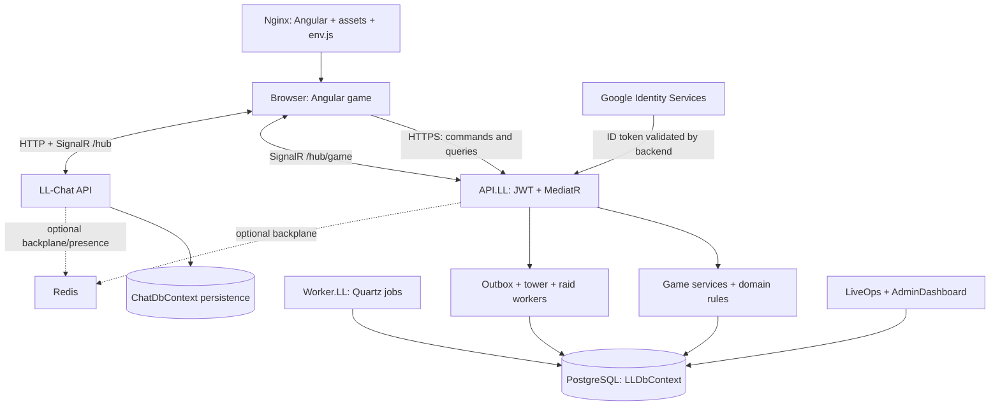
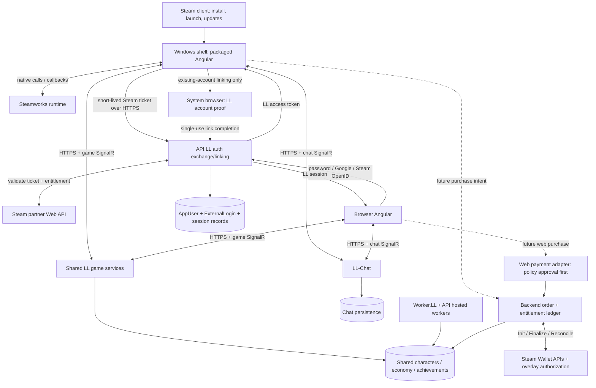

# LegendsLegacy: Steam readiness assessment

Assessment date: 12 September 2026. Decision: **EXPERIMENT FIRST**.

This is an assessment and proposed implementation plan, not an implementation. No application code, configuration, database, deployment, or Steam account was changed. Repository baseline: `31e5587a758282d347a55f7e4ef93287373d11b0`, including the working-tree state inspected during this review. Pre-existing changes include tournament and balance-harness work; they were left alone.

## 1. Executive summary

LegendsLegacy can plausibly become a credible Steam game without replacing Angular, moving combat onto the client, or splitting the player population. The important work is secure identity integration, a dependable installed client, recovery from interruptions, release compatibility, commercial decisions, and operating an online service for Steam customers.

**Recommended direction:** one backend and account ecosystem, one Angular gameplay application, and a thin Windows x64 desktop client containing a locally packaged Angular production build. Electron is the leading shell candidate because predictable Chromium behavior and reuse of TypeScript matter more here than shaving installer size. It is conditional on proving Steam integration without weakening renderer security. Do not start by loading the live website into a privileged window.

**Do not commit to a public release yet.** First run a bounded 1–3 developer-week experiment demonstrating Steam launch, validated login, account linking, overlay behavior, packaged routing, and recovery after sleep. Then use a limited, unmonetized Steam Playtest. This report does not authorize or perform that experiment.

The repository contains considerably more than a simple website: server-side combat and reward services, an outbox, state-version synchronization, account restrictions, marketplace checks, achievement ledgers, and operational tooling. It also contains concrete gaps that a wrapper would not solve:

- External identities currently support Google only; Steam authentication and browser Steam login are absent from the inspected implementation.
- Current access tokens are held in memory, but refresh responses serialize a refresh token as well as setting an HttpOnly cookie. The global JWT interceptor does not restrict attachment by destination.
- Refresh failure is collapsed into logout, including transient network errors.
- Runtime CORS configuration is hardcoded to localhost and the development website. Installed-client origins need explicit treatment.
- The web update mechanism polls `assets/version.json` and reloads the page. Reloading packaged files does not update an installed Steam build.
- Nobility has material benefits and tradable Signets. Its purchase gateway is disabled; there is no demonstrated production payment processor or refund settlement integration.
- The codebase has a focused beta journey and production-disabled raids. Code presence must not be confused with launch availability or proven product maturity.
- API startup runs database migrations and seeding. Merely launching the backend for inspection could mutate its configured database; it was not started.

**Steam MVP:** Windows, mouse/keyboard, safe Steam login/linking, shared progression, robust local launch/error screens, SteamPipe updates, a tested online service, honest store presentation, and no in-client commerce unless Steam Wallet fulfillment and reversals are complete. Achievements are valuable but can wait; Steam Cloud, Inventory Service, Workshop, VAC, and a native client rewrite do not belong in the MVP.

Confidence is high in the inspected architecture and the cited public platform rules; medium in shell selection and implementation estimates; unproven for live performance, production capacity, retention, actual Steam review acceptance, and private contractual terms.

## 2. Current LegendsLegacy architecture

### 2.1 What the repository implements

| Area | Observed implementation | Steam implication |
| --- | --- | --- |
| Game UI | Angular 20, standalone components, Angular Router lazy routes, signals, RxJS, CDK/Material and Tailwind; npm lockfile | Reuse the UI and service layer; no rendering-engine conversion needed |
| Game API | ASP.NET Core targeting .NET 10, versioned `/api/v1` controllers, MediatR commands/queries | Steam identity should exchange into LL sessions at this boundary |
| Layers | Core Application/Domain, Infrastructure persistence/services/realtime, separate API and Worker hosts | Put Steam HTTP/SDK adapters outside Core; retain dependency direction |
| Persistence | EF Core 10/Npgsql PostgreSQL, `LLDbContext`, repositories, migrations and JSON-backed content/seeding | Keep authoritative characters, rewards, economy and entitlements here |
| Scheduled work | `Worker.LL` with Quartz registration for tournament progression, marketplace expiration and region bosses | No desktop process needs to remain running to own these schedules |
| API-hosted work | Game-event outbox, tower simulation/finalization, raid resolution, title backfills and restriction refresh | Capacity planning must include work in the API process, not only the standalone Worker |
| Game realtime | Authenticated `/hub/game`; character, world, guild, raid and tournament audiences; optional Redis backplane | Preserve HTTPS/SignalR rather than introducing Steam networking |
| Chat | Independently deployable `LL-Chat`, authenticated chat hub, separate `ChatDbContext`, optional Redis presence/backplane | Desktop must reach and recover both game and chat services |
| Administration | `API.AdminDashboard` and Angular dashboard, plus `API.LiveOps` and its separate frontend | These are operator surfaces, never desktop bundle contents |
| Delivery | Dockerized Nginx frontend, containerized backend/worker/chat, Helm packaging, GitHub workflows | Add Steam distribution alongside existing delivery |

The actual API folder names include `API.LL` and `API.AdminDashboard`, rather than the shortened names in the top-level repository description.

This diagram describes code/configuration, not a verified production topology. The repository does not establish whether the two databases share a physical PostgreSQL cluster, the live replica count, TLS edge configuration, backup quality, uptime, or capacity. External infrastructure was not inspected or changed.

### 2.2 Accounts and characters

`AuthController` provides password registration/login, guest creation, guest conversion, Google login/binding, rename, logout, refresh and user information. `AppUser` allows nullable email/password and has `IsGuest`, `EmailConfirmed`, external logins and refresh tokens. `AuthProvider` currently contains only `Google`. `ExternalLoginConfiguration` already uniquely indexes `(Provider, ProviderUserId)`.

Registration validates character name/email/password, creates the account, publishes `UserCreatedEvent`, retrieves the resulting character and issues tokens. The normal path resolves one current character for an account; this is not an established multi-character selector. `AppUser.CharacterId` is not mapped, and the character's `UserId` index is not unique. Therefore “one character in the current login flow” is accurate; “the database enforces one character per account” is not.

The JWT contains account and character identity. `BaseController` reads them from claims rather than accepting an arbitrary acting character from the request. `AuthService` holds the access token in memory and restores sessions through a rotating refresh-cookie endpoint. The refresh cookie is HttpOnly, Secure outside local development, SameSite=None when secure, scoped to `/api/v1/auth`, and given a one-year cookie lifetime. That cookie lifetime is not proof of the server-side token lifetime. Refresh requests and logout require `X-LL-Refresh-Request: 1`.

Refresh records are looked up through a SHA-256 token hash. Existing rotation/reuse tests are useful foundations. No implemented player-facing password-reset/recovery endpoint was found in the targeted auth searches; `EmailConfirmed` alone is not a complete verified-email recovery system.

### 2.3 Gameplay, networking and authority

Inspected controllers/services cover PvE combat, dungeon runs, equipment acquisition/progression, essences, Colosseum/tournaments, guilds, marketplace, quests, prophecies, region bosses, World Tower, achievements/titles and raids. This is an online progression game with meaningful social and economic state. There is no reason to turn it into P2P networking.

`CharacterActionsController` accepts an area selection for combat, while actor identity comes from the JWT. `CharacterActionService` resolves schedules with server time and delegates to combat services. Equipment acquisition rolls and rewards are handled by backend services. Crafting/gathering are not the current action-controller gameplay surface; old names such as the frontend workflow's “Copy recipes.json” step are not evidence that crafting is active.

`ApiService` uses credentialed HTTP requests. Mutation responses can carry `X-LL-Domain-Versions`. The state-sync coordinator refreshes invalidated scopes, tracks revisions, retries failures and responds to online events. `GameRealtimeConnection` reconnects and resubscribes audiences. `GameHub` checks guild membership and raid access before subscribing. Realtime is a notification/synchronization mechanism; persisted HTTP results remain authoritative.

Daily/weekly and long-term behavior is distributed through quests, progression/content definitions, services and scheduled jobs, rather than a desktop timer. A Steam build must preserve server time and bounded catch-up behavior. Steam playtime must never become the clock for rewards.

### 2.4 Configuration, assets, releases and dependencies

The browser reads `window.env` from an Nginx startup-generated `assets/env.js`. Configuration includes API/chat roots, Google client ID, focused beta journey, raid availability and maintenance text. `environment.production` is literally false in the inspected file; feature decisions also use the runtime environment string. An Angular production compilation and a production game environment are distinct concepts here.

The frontend image runs `npm ci`, builds Angular, and serves static files with hashed JS/CSS caching and uncached entry/version/config files. `AppUpdateService` polls the web version every minute while visible and offers page reload. Backend content lives under `API.LL/Data`, including world, rewards, quests, tower, raids and titles; some policies are C# constants such as Nobility benefits. Data changes may need server deployment/reload, but not necessarily client releases.

GitHub workflows publish GHCR images and Helm packages and update version files in a separate infrastructure repository. That is evidence of deployment intent, not proof of current cluster state. Google, PostgreSQL, optional Redis, container registry/CI, .NET packages and npm packages are external dependencies. No Steam runtime/SDK project was found. No live Stripe/PayPal provider was found; the purchase interface mentions a future Stripe integration and registers a disabled gateway.

### 2.5 Evidence map

These files anchor the findings and are the primary implementation touchpoints:

| Evidence | Source |
| --- | --- |
| API configuration, CORS, JWT, maintenance, hosted workers and migration-on-start | [Program.cs](/C:/repos/Legends-Legacy/legends-legacy/LL/src/API/API.LL/Program.cs) |
| Current auth endpoints/cookies | [AuthController.cs](/C:/repos/Legends-Legacy/legends-legacy/LL/src/API/API.LL/Controllers/V1/AuthController.cs) |
| Account identity model | [AppUser.cs](/C:/repos/Legends-Legacy/legends-legacy/LL/src/Core/Domain/Models/Users/AppUser.cs), [ExternalLogin.cs](/C:/repos/Legends-Legacy/legends-legacy/LL/src/Core/Domain/Models/Users/ExternalLogin.cs) |
| Automatic character creation | [RegisterCommand.cs](/C:/repos/Legends-Legacy/legends-legacy/LL/src/Core/Application/UseCases/Users/Commands/Register/RegisterCommand.cs) |
| Token storage and failure behavior | [auth.service.ts](/C:/repos/Legends-Legacy/legends-legacy/LL/src/Presentation/ll/src/app/core/services/api/auth/auth.service.ts) |
| Token destination handling | [auth-interceptor.ts](/C:/repos/Legends-Legacy/legends-legacy/LL/src/Presentation/ll/src/app/core/interceptors/auth-interceptor.ts) |
| Audience authorization | [GameHub.cs](/C:/repos/Legends-Legacy/legends-legacy/LL/src/Infrastructure/RealTime/RealTime.LL/GameHub.cs) |
| Reconnect and state invalidation | [game-realtime-connection.service.ts](/C:/repos/Legends-Legacy/legends-legacy/LL/src/Presentation/ll/src/app/core/services/real-time/game-realtime/game-realtime-connection.service.ts), [state-sync-coordinator.service.ts](/C:/repos/Legends-Legacy/legends-legacy/LL/src/Presentation/ll/src/app/core/services/real-time/game-realtime/state-sync-coordinator.service.ts) |
| Premium benefits and disabled checkout | [NobilityBenefits.cs](/C:/repos/Legends-Legacy/legends-legacy/LL/src/Core/Domain/Models/Nobility/NobilityBenefits.cs), [DisabledNobilityPurchaseGateway.cs](/C:/repos/Legends-Legacy/legends-legacy/LL/src/Infrastructure/Service/Services.LL/Nobility/DisabledNobilityPurchaseGateway.cs) |
| Tradable entitlement units | [SignetTradingService.cs](/C:/repos/Legends-Legacy/legends-legacy/LL/src/Infrastructure/Service/Services.LL/Nobility/SignetTradingService.cs) |
| Web update behavior | [app-update.service.ts](/C:/repos/Legends-Legacy/legends-legacy/LL/src/Presentation/ll/src/app/core/services/client-side/app-update/app-update.service.ts) |
| Existing achievement authority | [AchievementService.cs](/C:/repos/Legends-Legacy/legends-legacy/LL/src/Infrastructure/Service/Services.LL/Achievements/AchievementService.cs) |
| Current release workflow | [LL-backend.yml](/C:/repos/Legends-Legacy/legends-legacy/.github/workflows/LL-backend.yml), [ll-frontend.yml](/C:/repos/Legends-Legacy/legends-legacy/.github/workflows/ll-frontend.yml) |

## 3. Steam feasibility and review risks

Steam distribution requires a configured application, installable build, launch configuration and successful review. It does **not** universally require linking the Steamworks runtime API. Valve explicitly says API integration is optional. In this plan it becomes necessary because Steam-native authentication is a chosen product requirement. [Steamworks API overview](https://partner.steamgames.com/doc/sdk/api).

No blanket ban on HTML/Angular/Electron games was found in the public onboarding and review rules. More concretely, Valve's overlay documentation explicitly discusses embedding Chromium for web games and notes that its CEF/native-rendering workaround is difficult. That supports feasibility, not automatic approval of an arbitrary website wrapper. Browser rendering can fail overlay expectations because it does not continuously present complete frames. [Steam Overlay](https://partner.steamgames.com/doc/features/overlay).

The defensible submission is an installed game that boots into its own local UI, has no address bar, survives an unavailable website, and clearly explains its online dependency. The public review criteria include successful startup on advertised OSes, implemented advertised features and Steam Wallet transactions. A reviewer should get a near-final build and a functioning service, with clear access instructions. [Review process](https://partner.steamgames.com/doc/store/review_process).

| Specific risk | Current evidence | Required response |
| --- | --- | --- |
| Blank window when website is down | Current app is browser-hosted | Package boot/error UI locally |
| Login friction or unsupported Google sign-in | Dynamically loaded GIS/FedCM web flow | Native Steam login; existing-account linking through system browser |
| Browser behavior leaking through | History-back error page, refresh-based updates | Game navigation, installed-client update UX |
| Premium checkout sends customer away | Purchase abstraction is not yet implemented | Keep disabled or implement Steam Wallet |
| Hidden content advertised as available | Focused beta guards; raids disabled for prod | Freeze and verify actual release feature configuration |
| Bad install/exit behavior | No desktop executable yet | Clean-machine Steam install, first launch, close and uninstall tests |
| Overlay/input failure | No shell tested | Treat packaged overlay and keyboard tests as experiment gates |
| Online outage mistaken for account loss | Refresh errors become logout | Separate service errors from invalid credentials |

Missing fullscreen or particular shortcuts are product-quality risks, not a documented universal reason for Steam rejection. External support/privacy links are not the same as an external shop; nevertheless all links must be routed intentionally and reviewed. Do not claim that every external link or third-party login is forbidden.

## 4. Recommended desktop technology

### 4.1 Comparison

The size, RAM and startup comparisons below are engineering expectations, not LegendsLegacy measurements. All choices retain online backend costs. A smaller shell does not remove Angular's DOM, asset, chat and rendering memory.

| Approach | Complexity / Angular fit | Steamworks | Size, RAM, startup | Platforms | Solo maintenance / richer features |
| --- | --- | --- | --- | --- | --- |
| **Electron with packaged Angular** | Medium; excellent Chromium/TypeScript reuse | Native module in main process or narrow native adapter; callbacks and overlay need proof | Large bundled browser, material multi-process RAM, moderate startup; predictable runtime | Windows native; Linux and macOS builds possible, each requires QA; Proton not assumed | Best initial fit; browser/security upgrades and native bindings are ongoing debt; WebGL/canvas/audio remain available |
| **Tauri** | Medium–Large; Angular fits, adds Rust and platform webview differences | Rust binding/FFI and callback lifecycle; overlay is not automatically solved | Smaller shell; shared OS runtime; RAM often lower but not guaranteed; potentially faster startup | WebView2 on Windows, WebKit on macOS, WebKitGTK on Linux; Deck dependencies need testing | Attractive if measured footprint is decisive; more engine/platform test combinations for a solo developer |
| **WebView2 + .NET shell** | Medium on Windows; fits C# skills and Angular | C# binding or P/Invoke; multi-process webview overlay must be tested | Small app with shared runtime; fixed runtime removes much size advantage; Angular still costs RAM | Strong Windows fit; not a native Linux/macOS plan; Proton support unproven | Good Windows-only fallback; less language expansion, but permanent Windows coupling |
| **Native/game-engine rewrite** | Very Large; replaces UI, routing, forms and state presentation | Often good engine bindings; still requires backend auth/commerce work | Entirely implementation-dependent; no honest generic guarantee of lower resource use | Engine/toolkit dependent; controller support still must be designed | Highest divergence and rewrite risk; justified only by a different game experience |
| **CEF/native renderer host** | Large; preserves Angular but adds rendering/input composition | Native rendering can address overlay presentation directly | Browser footprint remains; native frame loop may raise idle GPU use | Possible multi-platform, significant packaging burden | Fallback for a proven overlay blocker, not the starting point |
| **Browser/PWA shortcut launcher** | Small superficially | Weak lifecycle/native API integration | Tiny launcher but browser resource use remains | Depends on installed browser | Poor installed-game experience; reject as the target Steam product |

Tauri's system webviews introduce OS-specific behavior rather than bundling the same engine everywhere. WebView2 supports automatically maintained Evergreen or app-managed Fixed Version distribution; Microsoft documents a fixed runtime exceeding 250 MB. [Tauri webviews](https://v2.tauri.app/reference/webview-versions/), [Microsoft runtime distribution](https://learn.microsoft.com/en-us/microsoft-edge/webview2/concepts/distribution).

For all viable shells, Steam should update the application; do not also enable the shell's independent updater. WebView2 Evergreen/OS webview security updates are runtime servicing, a separate concern from game-code updates. Electron/CEF browser fixes require timely client builds. macOS adds signing/notarization and architecture testing; Linux adds packaging/runtime/graphics testing. Neither should be advertised merely because a framework can compile there.

Debugging differs: Electron offers familiar Chromium tools plus main-process debugging; Tauri spans frontend, Rust and OS webview tools; WebView2 spans DevTools and Visual Studio; CEF requires browser and native graphics diagnostics; a rewrite spans the new engine and existing API. All require symbols, correlated build IDs and reproducible packaged failures.

### 4.2 Recommendation and decision gates

Choose **Electron provisionally**, not because any wrapper is sufficient, but because this game's large existing Angular UI makes consistent browser behavior and avoiding a second UI implementation valuable. Prefer WebView2/.NET if Windows-only scope is firm and its measured overlay/auth reliability is better. Choose Tauri only if the experiment shows a worthwhile resource improvement without multiplying operational effort.

`steamworks.js` is a candidate, not an approved dependency. Its own Electron example enables Node integration and disables context isolation. Do not copy that configuration into LL. Keep native Steam access outside the renderer and prove the required API surface, including Web API tickets, callbacks, overlay and orderly shutdown. Its overlay helper is evidence of a possible path, not a compatibility guarantee. [Binding repository](https://github.com/ceifa/steamworks.js).

The experiment must measure packaged startup to local screen and playable state, total process-tree working set, idle CPU/GPU, sleep recovery, and frame/overlay behavior on at least an integrated-GPU and a discrete-GPU Windows machine. Proposed gates: local screen within 3 seconds and playable state within 10 seconds under a defined healthy-network test; no unbounded memory growth in an eight-hour session; reliable input/overlay and no security downgrade. Record cold and warm runs. These are proposed acceptance targets, not existing results or Steam mandates.

If overlay requires an expensive custom renderer or weak security, reassess the economics before choosing CEF or a rewrite. Do not spend weeks accumulating browser flags without a clear pass/fail boundary.

## 5. Proposed Steam architecture

The two payment paths are proposed; neither is a claim of a working current processor. Identity remains `AppUser.Id`. SteamID is an external login identifier, not a new character primary key. LL JWTs remain the game/chat authorization format. The renderer remains untrusted even when loaded from disk.

Keep a narrow platform interface for login, opening vetted links, window mode, build information, optional presence and achievements. Do not proxy the whole game through a new custom native transport. Angular can continue normal HTTP/SignalR to exact trusted endpoints; privileged authentication work stays in the shell. Prefer fresh Steam exchange on each app start, avoiding a persistently stored desktop refresh credential for the MVP.

## 6. Steamworks feature decisions

“Required” below distinguishes platform distribution requirements from requirements of this recommended product. Optional Steam features are not a substitute for launch quality. Capability descriptions follow Valve's [feature documentation](https://partner.steamgames.com/doc/features), [API overview](https://partner.steamgames.com/doc/sdk/api) and [SteamPipe upload guide](https://partner.steamgames.com/doc/sdk/uploading); classifications are LL-specific judgments.

| Feature | Classification | Reason / scope |
| --- | --- | --- |
| App ID | Required | Real application identity for distribution; do not ship development ID 480 |
| Steamworks SDK runtime | Required for recommended design | Needed for native ticket acquisition; API integration is not a universal publishing rule |
| Steam authentication | Required for recommended design | Reliable first launch and proof of Steam identity |
| SteamID mapping | Required | Unique external identity; use decimal strings across JavaScript/JSON |
| Ownership verification | Required when access depends on Steam license | Separate identity from app/DLC entitlement; especially paid/refunded/borrowed access |
| Overlay | Strongly Recommended; required for chosen in-game Wallet flow | Prove graphics/input integration before monetizing |
| Achievements | Strongly Recommended after core launch gates | Small curated subset; acceptable MVP deferral |
| Stats | Optional | Only counters needed by selected achievements; LL remains authoritative |
| Leaderboards | Optional | Existing shared leaderboards are preferable; a Steam-only mirror fragments comparison |
| Rich Presence | Optional | Low-cost activity summary if integration is stable |
| Friends discovery | Optional | Opt-in linked-player discovery; avoid mandatory social graph imports |
| Invites | Optional | Useful for a real group activity, not arbitrary teleport/join fiction |
| Steam Cloud | Actively Avoid for progression | Database is canonical; optional future preference sync only |
| Screenshots | Optional API integration | Test normal Steam screenshot behavior; custom capture can wait |
| Steam Input | Optional for Windows mouse/keyboard launch | Useful for a later complete controller experience |
| Steam Deck | Optional; defer support | Current UI and shell unverified on hardware |
| Steam Inventory Service | Actively Avoid | Would duplicate existing equipment/Signet ownership and add trading complexity |
| DLC | Optional | Stable account upgrades/cosmetics later; not required to sell membership time |
| Microtransactions API | Required if selling inside Steam game | Backend-controlled order/settlement path |
| Steam Wallet | Required for in-game transactions | Do not route checkout to an external provider |
| Workshop | Irrelevant to current game | No demonstrated player-authored content workflow |
| Remote Play streaming | Optional | Test later if useful; does not make the backend offline-capable |
| Remote Play Together | Irrelevant to current game | No local shared-screen multiplayer model |
| VAC / client anti-cheat | Actively Avoid for MVP | Does not solve forged HTTP requests or economic collusion |
| Steam public Game Bans | Optional, defer | Higher moderation obligations; retain LL account restrictions |
| Legacy Steam Error Reporting | Actively Avoid | Valve marks it near end-of-life and Windows 32-bit only |
| Modern crash/error telemetry | Strongly Recommended | Shell, renderer and API visibility is operationally necessary |
| Launch options | Required | Correct executable/working directory/OS; keep user arguments narrow |
| Branches/betas | Strongly Recommended | Private candidate testing and controlled promotion |
| Depots | Required | At least one Windows content depot with correct package access |
| Builds | Required | Versioned depot manifests and a tested release candidate |
| SteamPipe | Required distribution tooling | Upload and promote client content |
| Steam automatic updates | Required distribution behavior | Backend must tolerate clients already running older builds |
| Steam matchmaking / P2P / relay | Actively Avoid | Existing HTTP/SignalR service model is appropriate |

Legacy crash API limitation: [Steam Error Reporting](https://partner.steamgames.com/doc/features/error_reporting). Wallet obligation: [In-game purchases](https://partner.steamgames.com/doc/features/microtransactions). Do not label unchecked store features as supported.

## 7. Authentication and account linking

### 7.1 Model choice

| Option | Benefit | Problem | Decision |
| --- | --- | --- | --- |
| A: Steam replaces LL login | Simple Steam-only onboarding | Disrupts browser users, recovery and existing identities | Reject |
| B: Existing LL login then link | Protects established accounts | Mandatory credentials add friction for new Steam players | Offer to existing players |
| C: Automatic LL account creation | Fast first launch | Silently creates duplicates for established players | Use only after an explicit “new player” choice |
| D: Hybrid | Steam-native new-player path plus safe reuse of old accounts | Requires deliberate linking and recovery flows | Recommend |

First launch: prove Steam identity, look up its link, and enter the linked character if present. Otherwise show **“Continue my existing character”** and **“Create a new character”** before creating any persistent account. Explain that identities link to one account and progression is shared. Do not use the Steam display name as a unique account identifier or fabricate an email address.

### 7.2 Ticket exchange

Acquire `GetAuthTicketForWebApi` with a fixed service identity, wait for its response callback, and send the ticket to LL over HTTPS. The backend calls `ISteamUserAuth/AuthenticateUserTicket` with the expected App ID, identity and publisher key; trust its returned SteamID, not a client-supplied ID. Publisher credentials stay server-side. Use the current endpoint-specific reference when overview wording differs. [AuthenticateUserTicket](https://partner.steamgames.com/doc/webapi/ISteamUserAuth).

Proposed LL controls: bind the exchange to a short-lived challenge, consume challenges atomically, deduplicate concurrent retries, bound ticket size, rate-limit exchanges, redact tickets from logs and cancel native ticket handles when done. A challenge does not transform a stolen ticket into a safe credential; prevent interception and reject reuse. Ticket identity strings are routing/binding information, not secrets. Validate account restrictions before issuing an LL session.

For an App-ID-gated product, perform backend entitlement checks rather than trusting `BIsSubscribed` or an editable config. Steam documents `CheckAppOwnership` for backend ownership and OpenID for browser identity. Browser Steam OpenID proves identity; it does not by itself prove paid ownership. [Authentication and ownership](https://partner.steamgames.com/doc/features/auth).

### 7.3 Linking safely

Existing players authenticate their LL account in the system browser. Create a short-lived pending link containing the authenticated Steam subject, requested LL account, challenge hash and expiration. Require fresh proof of both accounts, explicit confirmation of the character being linked, and atomic uniqueness checks. The desktop polls a narrowly scoped completion endpoint or consumes a single-use return code; never put a bearer token, password or Steam ticket in launch arguments or a callback URL.

A browser guest who wants to keep progress must prove the current guest session and confirm that character, then bind it without creating a second character. A guest session alone is weaker recovery evidence than a verified external identity; expose this clearly. For Google-only existing accounts, use the established website in the system browser, not Google login inside the embedded renderer. Google's OAuth policy disallows developer-controlled embedded user agents. [Google OAuth policies](https://developers.google.com/identity/protocols/oauth2/policies).

Never merge by email, Steam display name or claimed character name. If both identities already have progressed accounts, refuse automatic merging and offer a documented support process. Default to preserving both records; inventory, PvP history, guild membership and paid entitlements make merges expensive and abusable.

### 7.4 Proposed database changes

| Model/change | Proposed fields and invariants |
| --- | --- |
| `AuthProvider` | Add Steam without renumbering persisted Google values |
| Existing `ExternalLogin` | Store canonical SteamID string; reuse unique `(Provider, ProviderUserId)`; never persist ticket in AccessToken/RefreshToken columns |
| One Steam identity per LL account | Add a provider-specific filtered unique index on `UserId` for Steam; do not accidentally prohibit future multiple non-Steam identities |
| Account creation | Support a registered external account with no email; current `ConvertGuestToExternalAccount(string email)` is Google-specific |
| Pending link | ID, account, verified Steam subject, challenge hash, created/expiry/consumed times, purpose and concurrency token |
| Identity audit | Link/unlink/recovery events, actor, previous association and reason; restricted access and retention policy |
| Session metadata | Auth method, external subject, session family/revocation, optional license-check freshness; separate browser and desktop policies |
| Conditional entitlement cache | App ID, SteamID, owner SteamID, permanent/temporary status, checked time, validity/error state; never replace account identity |
| Commerce, if enabled | Provider order IDs, App ID, account, SteamID, SKU, quantity, minor-unit amount/currency, settlement state, fulfillment/reversal IDs |
| Optional achievement projection | Stable mapping key and per-SteamID synchronization status; LL completion remains canonical |

Keep the normal one-current-character experience. Before adding a one-character database constraint, audit existing rows and NPC/entity modeling; the current nonunique index cannot justify blindly applying one. A Steam integration is not a reason to introduce character slots.

### 7.5 Recovery, unlinking, bans and account switching

- Steam-only players can later use verified Steam OpenID on the browser. Offer adding a separately verified email/password or Google identity for recovery; do not require email for initial Steam play.
- For MVP, unlinking should be a controlled support operation with proof and audit. Never remove the last usable identity. Revoke sessions and require fresh login after sensitive identity changes. A later self-service unlink requires recent authentication, recovery proof and a cooldown.
- Maintain one SteamID to one LL account and one Steam identity per LL account. Do not allow rotating Steam accounts to farm rewards or unlock achievements for friends. Historical linkage/audits survive unlinking according to retention policy.
- LL bans and multiplayer restrictions follow the account across browser and Steam. Apply restrictions during ticket exchange and commands; unlinking must not clear them. Do not translate every LL moderation action into a public Steam ban.
- On Steam-account change, clear account-scoped caches, tokens and presence; acquire new proof before continuing. An old persisted session must not silently open another Steam user's character.

### 7.6 Families, paid access and refunds

Use the playing user's SteamID for account identity, never the license owner's. Valve distinguishes temporary family access from permanent ownership and warns against granting permanent backend rights from borrowed licenses. Record the owner only as entitlement/audit context. Do not assume LL is eligible for sharing without checking the final account/subscription configuration. [Steam Families](https://partner.steamgames.com/doc/features/families).

For an initially free game, a Steam identity is not proof of payment. If the game later becomes paid, explicitly choose between selling the Steam distribution entitlement while the browser stays free, or requiring a shared game-access entitlement on every channel. The latter requires browser enforcement and a grandfathering policy. A token's claimed platform cannot decide paid access.

A refunded base-game license removes that access entitlement after reconciliation; it does not delete the LL account or character. If browser play remains free, that character remains available there by design. If all gameplay becomes paid, deny commands lacking an active entitlement on either channel. Preserve progression for reactivation. Refunds of optional items revoke only the relevant grants, with special handling for consumed/traded benefits. Do not infer permanent ownership from one successful login or keep granting access indefinitely during Steam outages.

## 8. Browser and Steam coexistence

Use the same production account, character, economy, PvP pools, guilds, world events and leaderboards. Progression is already in PostgreSQL; there is nothing to export or synchronize between two save files. A browser action should appear in the Steam session through the existing version/invalidation mechanism, and vice versa.

Allow concurrent browser/desktop use initially. The server must serialize conflicting operations and issue rewards once, independently of the number of open windows. Single-instance desktop behavior is a UX preference, not an anti-cheat boundary. Test simultaneous combat resolution, reward claims, loadout edits, marketplace purchases and Signet redemption from both channels.

Avoid Steam-exclusive power, loot rates, currency or purchase advantages. A modest nontradable cosmetic can be considered later, granted once per qualifying account after verified linkage, but offers little MVP value. Do not grant it again on reinstallation or unlink/relink. Keep shared leaderboards authoritative rather than promoting Steam users into a separate ranking.

Separate *testing environments* from the one production ecosystem. Steam Playtest should use a staging realm with its own identity records or carefully scoped test associations and no production financial entitlements. Explicitly disclose wipes. A Playtest App ID must not confer release access, unlock release achievements or write production rewards. This is operational isolation, not a permanent Steam/browser split.

## 9. Payments and monetization

### 9.1 What exists today

Nobility is time-limited membership redeemed using Signet units. The code records issuance, movements, reservation/listing, trade and redemption, with operation IDs and stale-preview checks. `DisabledNobilityPurchaseGateway` says purchases are unavailable during alpha and Signets are distributed by the game team and traded on the market. This is an entitlement/economy implementation, not a completed billing system.

The inspected benefits are: 168 versus 24 hours of offline retention, six versus three essence/equipment loadouts, eight versus five arena ticket capacity, two versus eight hours focus cooldown, 30 versus ten buy/sell marketplace limits, and additional prophecy rerolls. Calling this cosmetic-only would be inaccurate. Whether players regard it as fair convenience or paid advantage requires product testing, particularly around PvP and tradable membership time.

### 9.2 Confirmed rules versus unresolved contract questions

| Question | Finding | Type |
| --- | --- | --- |
| Can Steam in-game checkout use Stripe/PayPal directly? | Public documentation requires Steam Wallet microtransactions; review also disallows linking to stores without Wallet | Confirmed platform policy |
| Can Steam sell items/currency/membership time? | Wallet can fund items or game currency; product-specific fulfillment remains yours | Technical capability |
| Can a browser shop share entitlements? | Technically straightforward through the shared LL ledger; public pages reviewed do not settle every off-Steam commerce clause | Contract confirmation needed |
| Is universal cross-store price parity established here? | No. Do not assert one from generic assumptions. Early Access does have an explicit rule against a higher price than another service | Confirmed EA rule; wider terms unresolved |
| Can the Steam UI advertise “buy cheaper on the website”? | Do not ship this: it conflicts with the documented in-game transaction/linking restriction | Platform policy |
| What exact revenue share applies? | Verify the signed Distribution Agreement and partner financial terms; use a 30% platform-share sensitivity assumption for budgeting, not a verified LL contract rate | Contract/economic assumption |

Sources: [Purchase requirements](https://partner.steamgames.com/doc/features/microtransactions), [build review](https://partner.steamgames.com/doc/store/review_process), [Early Access rules](https://partner.steamgames.com/doc/store/earlyaccess), [financial reporting](https://partner.steamgames.com/doc/finance/payments_salesreporting/faq).

The concrete questions for Valve before monetized implementation are: whether the existing browser shop can sell shared tradable Signets to linked accounts; whether the proposed catalog/pricing/promotions comply with the signed agreement; how existing web memberships should appear in Steam; and whether the proposed Families/DLC configuration is appropriate. No message was sent to Valve. These are unresolved facts, not reasons to defer the non-commercial assessment.

### 9.3 Product choices

| Product | Steam approach | Recommendation |
| --- | --- | --- |
| Nobility time | Wallet purchase of defined duration or Signets with server redemption | Prefer fixed duration first; avoid automatic renewal initially |
| Recurring subscription | Steam recurring billing and agreement lifecycle | Defer: renewals, failure, cancellation and double-subscription handling add support burden |
| Premium currency | Wallet order grants server-ledger units | Defer until fraud controls exist; currency must not become client-controlled |
| Cosmetics / supporter pack | Nontradable account entitlement via Wallet or clearly defined DLC | Better first paid product if commercially justified |
| Account upgrades / convenience | Shared server entitlement with explicit scope and expiry | Clearly describe actual effects and purchase limits |
| DLC | Backend checks license; one-time grants protected against repeat claims | Use for real stable packages, not every consumable |
| Future web payments | Separate browser provider adapter, same entitlement ledger | Only after contractual confirmation; never surface external checkout in Steam |

Steam supports recurring subscription workflows, but that does not turn existing Nobility expiration into subscription billing. Model active, canceled-but-paid-through, past-due and expired states separately and prevent overlapping billing agreements across channels. [Recurring subscriptions](https://partner.steamgames.com/doc/store/pricing/subscriptions).

### 9.4 Correct purchase settlement

The server chooses SKU, price, currency, quantity, account and unique order ID. It initializes the transaction; the user authorizes through Steam; the client callback merely tells the backend to check/finalize. Grant once only after successful server-side finalization. Reconcile settlement changes using Steam reports at least daily; retry uncertain outcomes by order ID. [Microtransaction implementation](https://partner.steamgames.com/doc/features/microtransactions/implementation).

Add durable order states, an idempotent fulfillment/outbox step, a reconciliation worker and an auditable reversal path. Handle authorization with the client closed, backend crash after charge but before grant, duplicate callbacks, timeouts, wrong App ID, changed Steam account and replayed orders. A client saying “authorized” is never payment proof.

**Signets are the largest commercial engineering risk.** A buyer can trade a purchased Signet, receive currency, and then refund/charge back the original purchase. Current movement records help trace it but do not establish a finished reversal policy. Before selling tradable units, define transfer holds, spending limits for risky purchases, provenance propagation and compensation rules. Avoid automatically confiscating unrelated buyers' property. A nontradable first paid SKU substantially reduces this complexity.

Use Steam-reported currency and server catalogs, not client locale or an editable country field, for transaction amounts. Store integer minor units with correct currency precision. Regional pricing can incentivize resale of tradable goods; price and trade policy must be considered together. Taxes, refunds, chargebacks and withholding affect net receipts; browser merchant obligations remain a separate accounting problem. Valve describes tax interview/withholding and reporting responsibilities publicly, but no LL tax position was established. [Taxes FAQ](https://partner.steamgames.com/doc/finance/taxfaq).

Steam's standard game refund framework generally uses 14 days and under two hours, with additional provisions; third-party in-game purchase refunds are not automatically the same policy as base-game refunds. Implement verified settlement reversals and publish accurate terms rather than promising all purchases are final or all are refundable. [Steam refunds](https://store.steampowered.com/steam_refunds/).

For Playtest, purchases must remain disabled: Valve prohibits selling Playtest access or monetizing it with in-game transactions. [Steam Playtest](https://partner.steamgames.com/doc/features/playtest).
