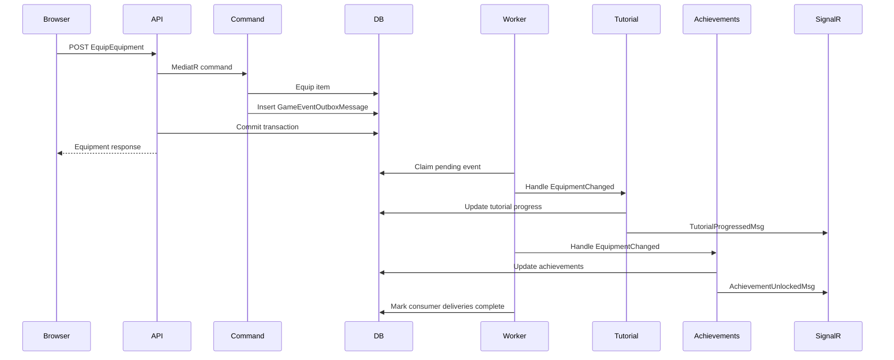

# Game Event Outbox Plan

## Goal

Introduce a generic game event outbox for delayed, reliable side effects that should not block gameplay command responses.

The first consumers should be:

- tutorial progression,
- achievement progression.

The target behavior is:

- Gameplay commands return without waiting for slow secondary systems.
- Events are recorded transactionally with the gameplay change that caused them.
- Background workers process events shortly after commit.
- Tutorial and achievement updates are pushed to the frontend through realtime messages.
- No side-effect work is lost if the API process restarts after the gameplay command commits.

This replaces the current pattern where commands publish MediatR notifications and await all handlers inline.

## One Outbox Or Multiple?

Use one shared outbox infrastructure.

Do not create a separate physical outbox table for tutorial and another one for achievements unless there is a strong operational reason later.

Recommended shape:

- one `GameEventOutboxMessages` table,
- one generic enqueue service,
- one dispatcher/worker infrastructure,
- separate processors/handlers for tutorial, achievements, prophecies, analytics, or future systems.

Why one outbox:

- commands write one kind of durable event,
- transaction semantics stay consistent,
- retry, monitoring, cleanup, and tooling are shared,
- adding a new side-effect system does not require a new outbox implementation.

Where separation should exist:

- event handler classes,
- consumer names,
- retry state per consumer,
- logs and metrics per consumer.

So: same outbox pipe, different consumers.

## Current Problem

Today, application commands publish MediatR notifications inline:

```csharp
await _publisher.Publish(new EquipmentChangedEvent(request.EntityId), cancellationToken);
```

MediatR notification handlers are awaited before the command handler returns. Because commands are wrapped by `TransactionBehavior`, this means:

1. The transaction pipeline opens a transaction.
2. The command mutates gameplay state.
3. The command awaits `_publisher.Publish(...)`.
4. Tutorial, achievement, prophecy, or other notification handlers run in the same request flow.
5. The command resumes only after those handlers complete.
6. The transaction behavior saves and commits.
7. The API response returns to the browser.

So if an achievement or tutorial handler is slow, the original command response is slow.

The event is not "on another thread" in the useful sense. It is awaited work in the same logical request and usually the same dependency injection scope.

## Target Architecture

Commands write durable game events to the outbox. Background workers later dispatch those events to interested consumers.



## Event Model

### Outbox Message

Add a generic event outbox message.

Suggested model:

```csharp
public sealed class GameEventOutboxMessage
{
    public Guid Id { get; set; }
    public Guid? CharacterId { get; set; }
    public Guid? AccountId { get; set; }
    public string EventType { get; set; } = string.Empty;
    public string PayloadJson { get; set; } = "{}";
    public DateTimeOffset CreatedAt { get; set; }
    public DateTimeOffset? AvailableAt { get; set; }
    public string? CorrelationId { get; set; }
    public string? IdempotencyKey { get; set; }
}
```

Suggested files:

```text
LL/src/Core/Domain/Models/Outbox/GameEventOutboxMessage.cs
LL/src/Infrastructure/Persistence/Persistence.LL/Configurations/Outbox/GameEventOutboxMessageConfiguration.cs
```

Recommended indexes:

- `(AvailableAt, CreatedAt)` for polling.
- `(CharacterId, CreatedAt)` for debugging.
- optional unique `IdempotencyKey` if some event types need deduplication.

### Consumer Delivery State

If one event can be consumed by both tutorial and achievements, do not store only one status on the message. One consumer can fail while another succeeds.

Add per-consumer delivery rows:

```csharp
public sealed class GameEventOutboxDelivery
{
    public Guid Id { get; set; }
    public Guid MessageId { get; set; }
    public GameEventOutboxMessage Message { get; set; } = default!;
    public string Consumer { get; set; } = string.Empty;
    public string Status { get; set; } = GameEventOutboxDeliveryStatus.Pending;
    public int Attempts { get; set; }
    public string? LastError { get; set; }
    public DateTimeOffset CreatedAt { get; set; }
    public DateTimeOffset? AvailableAt { get; set; }
    public DateTimeOffset? ProcessingStartedAt { get; set; }
    public DateTimeOffset? ProcessedAt { get; set; }
}

public static class GameEventOutboxDeliveryStatus
{
    public const string Pending = "Pending";
    public const string Processing = "Processing";
    public const string Processed = "Processed";
    public const string Failed = "Failed";
}
```

Suggested files:

```text
LL/src/Core/Domain/Models/Outbox/GameEventOutboxDelivery.cs
LL/src/Infrastructure/Persistence/Persistence.LL/Configurations/Outbox/GameEventOutboxDeliveryConfiguration.cs
```

Recommended indexes:

- `(Status, AvailableAt, CreatedAt)` for worker polling.
- `(Consumer, Status, AvailableAt)` for consumer-specific workers.
- unique `(MessageId, Consumer)` to prevent duplicate delivery rows.

This is the cleanest version for a game where achievements and tutorials may react to the same event.

## Event Types

Define stable event names. They are persisted data, so avoid renaming casually.

Examples:

```csharp
public static class GameEventTypes
{
    public const string EquipmentChanged = "equipment.changed";
    public const string EssenceAbsorbed = "essence.absorbed";
    public const string EssenceLoadoutChanged = "essence.loadout_changed";
    public const string EquipmentCrafted = "equipment.crafted";
    public const string IdleCombatEncounterCompleted = "combat.idle_encounter_completed";
    public const string ClientTutorialStep = "tutorial.client_step";
}
```

Payload examples:

Equipment changed:

```json
{
  "characterId": "62fd...",
  "equipmentId": "3b41...",
  "slotType": "Chest"
}
```

Essence absorbed:

```json
{
  "characterId": "62fd...",
  "essenceDefinitionId": "essence.legacy.goblin"
}
```

Idle combat encounter completed:

```json
{
  "characterId": "62fd...",
  "areaId": "tutorial_area_training_grounds",
  "wonEncounter": true,
  "defeatedCreatureDefinitionIds": ["..."],
  "enemyCount": 1
}
```

Equipment crafted:

```json
{
  "characterId": "62fd...",
  "craftedItems": [
    {
      "itemBaseId": "tutorial_sword",
      "tier": 1,
      "rarity": "Common"
    }
  ]
}
```

## Enqueue Service

Add an application abstraction:

```csharp
public interface IGameEventOutbox
{
    Task EnqueueAsync<TPayload>(
        string eventType,
        TPayload payload,
        Guid? characterId,
        Guid? accountId,
        CancellationToken cancellationToken);
}
```

Implementation:

```csharp
public sealed class GameEventOutbox : IGameEventOutbox
{
    private readonly IDbContext _context;
    private readonly IGameEventOutboxConsumerRegistry _consumers;
    private readonly TimeProvider _timeProvider;

    public Task EnqueueAsync<TPayload>(
        string eventType,
        TPayload payload,
        Guid? characterId,
        Guid? accountId,
        CancellationToken cancellationToken)
    {
        var now = _timeProvider.GetUtcNow();
        var message = new GameEventOutboxMessage
        {
            Id = Guid.NewGuid(),
            CharacterId = characterId,
            AccountId = accountId,
            EventType = eventType,
            PayloadJson = JsonSerializer.Serialize(payload),
            CreatedAt = now,
            AvailableAt = now
        };

        _context.GameEventOutboxMessages.Add(message);

        foreach (var consumer in _consumers.GetConsumers(eventType))
        {
            _context.GameEventOutboxDeliveries.Add(new GameEventOutboxDelivery
            {
                Id = Guid.NewGuid(),
                MessageId = message.Id,
                Consumer = consumer,
                Status = GameEventOutboxDeliveryStatus.Pending,
                CreatedAt = now,
                AvailableAt = now
            });
        }

        return Task.CompletedTask;
    }
}
```

Important: `EnqueueAsync` must not call `SaveChangesAsync`. The command transaction pipeline commits the gameplay change, message, and delivery rows together.

## Consumer Registry

Register which consumers care about which events.

Example:

```csharp
public interface IGameEventOutboxConsumerRegistry
{
    IReadOnlyList<string> GetConsumers(string eventType);
}
```

Initial mapping:

```text
equipment.changed
  - tutorial
  - achievements

essence.absorbed
  - tutorial
  - achievements
  - prophecies

essence.loadout_changed
  - tutorial
  - achievements

equipment.crafted
  - tutorial
  - achievements
  - guild_missions

combat.idle_encounter_completed
  - tutorial
  - achievements
  - prophecies
  - guild_missions
```

The exact initial set should match current behavior. Do not move every system at once if that makes the migration risky.

## Consumer Handlers

Use separate handlers per consumer.

```csharp
public interface IGameEventOutboxConsumer
{
    string Consumer { get; }
    bool CanHandle(string eventType);
    Task HandleAsync(
        GameEventOutboxMessage message,
        CancellationToken cancellationToken);
}
```

Tutorial consumer:

```csharp
public sealed class TutorialGameEventOutboxConsumer : IGameEventOutboxConsumer
{
    public string Consumer => "tutorial";

    public bool CanHandle(string eventType) =>
        eventType is GameEventTypes.EquipmentChanged
            or GameEventTypes.EssenceAbsorbed
            or GameEventTypes.EssenceLoadoutChanged
            or GameEventTypes.EquipmentCrafted
            or GameEventTypes.IdleCombatEncounterCompleted
            or GameEventTypes.ClientTutorialStep;

    public Task HandleAsync(GameEventOutboxMessage message, CancellationToken ct)
    {
        var trigger = MapToTutorialTrigger(message);
        return _tutorialProgression.TryProgressAsync(
            message.CharacterId!.Value,
            trigger,
            ct);
    }
}
```

Achievement consumer:

```csharp
public sealed class AchievementGameEventOutboxConsumer : IGameEventOutboxConsumer
{
    public string Consumer => "achievements";

    public bool CanHandle(string eventType) =>
        eventType is GameEventTypes.EquipmentChanged
            or GameEventTypes.EssenceAbsorbed
            or GameEventTypes.EssenceLoadoutChanged
            or GameEventTypes.EquipmentCrafted
            or GameEventTypes.IdleCombatEncounterCompleted;

    public Task HandleAsync(GameEventOutboxMessage message, CancellationToken ct) =>
        message.EventType switch
        {
            GameEventTypes.IdleCombatEncounterCompleted => HandleIdleCombatAsync(message, ct),
            GameEventTypes.EssenceAbsorbed => HandleEssenceAbsorbedAsync(message, ct),
            GameEventTypes.EquipmentCrafted => HandleEquipmentCraftedAsync(message, ct),
            _ => Task.CompletedTask
        };
}
```

Each consumer has its own delivery row. If achievements fail, tutorial delivery can still be marked processed.

## Worker Design

Add a background worker that claims pending delivery rows, loads the message, and dispatches to the matching consumer.

Suggested first location:

```text
LL/src/API/API.LL/HostedServices/GameEventOutboxWorker.cs
```

If `Worker.LL` is the preferred background host, put it there instead. The important part is that row claiming is safe if more than one host can run.

Worker loop:

1. Wake every 250-1000 ms.
2. Create a fresh DI scope.
3. Claim a small batch of pending delivery rows.
4. Resolve the named consumer.
5. Call `HandleAsync`.
6. Mark the delivery as processed, retryable, or failed.

Repository API:

```csharp
public interface IGameEventOutboxRepository
{
    Task<IReadOnlyList<GameEventOutboxDelivery>> ClaimPendingDeliveriesAsync(
        int batchSize,
        TimeSpan processingTimeout,
        CancellationToken cancellationToken);

    Task MarkProcessedAsync(Guid deliveryId, CancellationToken cancellationToken);

    Task MarkRetryAsync(
        Guid deliveryId,
        int attempts,
        string error,
        DateTimeOffset nextAvailableAt,
        CancellationToken cancellationToken);

    Task MarkFailedAsync(
        Guid deliveryId,
        int attempts,
        string error,
        CancellationToken cancellationToken);
}
```

For PostgreSQL, prefer `FOR UPDATE SKIP LOCKED`. For SQL Server, prefer an update-with-output row claim using row locks. A naive EF query is fine only for local single-instance development.

## Retry Policy

Use bounded retries per delivery.

Recommended:

- Max attempts: 5.
- Backoff: 5 seconds, 30 seconds, 2 minutes, 10 minutes, 30 minutes.
- Store `LastError`.
- Mark delivery as `Failed` after max attempts.

Retries must be safe. Consumers should be idempotent because the worker can crash after applying a side effect but before marking the delivery processed.

## Idempotency

Idempotency belongs in the consumers, not only the outbox.

Tutorial:

- completed tutorials no-op,
- stale triggers no-op because the current step no longer matches,
- rewards are guarded by progress flags or reward records.

Achievements:

- achievement unlocks must be unique per character/account and achievement id,
- achievement progress updates should be additive only when the event has not already been applied,
- if exact event dedupe is needed, store processed event ids per achievement consumer.

Recommended achievement-safe model:

```text
AchievementProgress
  CharacterId
  AchievementId
  CurrentAmount
  CompletedAt

AchievementEventLedger
  CharacterId
  AchievementId
  OutboxMessageId
```

The ledger is optional for simple counters where duplicate processing is unlikely and tolerable during development. For production correctness, it is the clean answer.

## Transaction Semantics

Current synchronous flow:

```text
Command transaction includes gameplay change + full tutorial/achievement processing.
Response waits for all of it.
```

Outbox flow:

```text
Command transaction includes gameplay change + outbox message + delivery rows.
Response waits only for gameplay change + outbox insert.
Tutorial and achievement processing happens after commit in separate transactions.
```

Guarantees:

- if the gameplay command commits, the event exists,
- if the gameplay command rolls back, the event rolls back,
- slow consumers no longer delay the command response,
- each consumer can retry independently.

Tradeoff:

- tutorial and achievement UI updates may arrive slightly after the command response.

That is acceptable. The frontend should rely on realtime messages and reconnect/bootstrap recovery.

## Frontend Behavior

No major frontend redesign is required if realtime messages already update state stores.

Expected UX:

1. Player clicks "Equip".
2. Equipment response returns quickly.
3. Inventory updates from the command response.
4. Tutorial and achievement state update shortly after via realtime.

Do not refetch tutorial or achievement state after every command. That recreates coupling on the client.

Realtime messages should remain consumer-specific:

- `TutorialProgressedMsg`
- `TutorialCompletedMsg`
- `AchievementProgressedMsg`
- `AchievementUnlockedMsg`

The outbox is a backend durability/latency tool. It does not need to leak into frontend models.

## What To Migrate First

Start with tutorial and achievements because they are secondary progression systems and should not block immediate gameplay responses.

Good first event types:

- `equipment.changed`
- `essence.absorbed`
- `essence.loadout_changed`
- `equipment.crafted`
- `combat.idle_encounter_completed`

Keep highly response-coupled work synchronous for now.

Example: the tutorial training battle may remain synchronous if its response must include tutorial essence loot immediately.

## Special Case: Training Battle Loot

Training battle currently may need tutorial essence loot in the combat summary response.

There are two possible designs.

### Option A: Keep Training Battle Synchronous

Keep the training battle tutorial progression synchronous because the response must show the tutorial essence immediately.

Pros:

- Combat summary can include the essence loot immediately.
- Less frontend complexity.

Cons:

- This one tutorial action can still wait for tutorial progression.

This is acceptable because training battle is a tutorial-specific command, not a recurring gameplay path.

### Option B: Move Training Battle To Outbox Too

The training battle command returns only combat summary. The tutorial essence appears shortly after through loot/realtime updates.

Pros:

- fully consistent async side-effect processing.

Cons:

- summary may not show the reward immediately,
- player could be confused if the essence appears after the summary.

Recommended first version: Option A.

## Migration Plan

### Phase 1: Add Generic Outbox Storage

1. Add `GameEventOutboxMessage`.
2. Add `GameEventOutboxDelivery`.
3. Add EF configurations.
4. Add `DbSet`s to `IDbContext` and `LLDbContext`.
5. Add migration.
6. Add indexes for delivery polling.

Done when the app can persist game event messages and per-consumer delivery rows.

### Phase 2: Add Enqueue Infrastructure

1. Add `IGameEventOutbox`.
2. Implement `GameEventOutbox`.
3. Add `GameEventTypes`.
4. Add `IGameEventOutboxConsumerRegistry`.
5. Register DI.
6. Ensure enqueue does not save directly.

Done when command handlers can enqueue game events inside their existing transaction.

### Phase 3: Add Consumers

1. Add `TutorialGameEventOutboxConsumer`.
2. Add `AchievementGameEventOutboxConsumer`.
3. Map outbox event payloads to `TutorialTrigger`.
4. Map outbox event payloads to achievement progress operations.
5. Keep existing realtime publication inside the consumer services.

Done when tutorial and achievement systems can process outbox messages.

### Phase 4: Add Worker

1. Add `GameEventOutboxWorker`.
2. Add repository methods for claiming and marking delivery rows.
3. Process small batches.
4. Dispatch by `Consumer`.
5. Add retry/failure handling.

Done when pending delivery rows are processed without an active request waiting.

### Phase 5: Convert Synchronous Handlers

Replace slow request-path notification handlers with outbox enqueueing.

Convert:

- `EssenceAbsorbedEventHandler`
- `EssenceLoadoutChangedEventHandler`
- `CraftedEquipmentEventHandler`
- `EquipmentChangedEventHandler`
- `IdleCombatEncounterCompletedEventHandler`
- achievement service calls from command/request paths where practical.

Done when normal gameplay commands no longer wait for tutorial or achievement progression.

### Phase 6: Tighten Idempotency

1. Confirm tutorial rewards are idempotent.
2. Add or verify unique achievement unlock constraints.
3. Consider `AchievementEventLedger` for exact duplicate protection.
4. Confirm stale tutorial triggers no-op.
5. Add logs around duplicate/no-op processing.

Done when reprocessing the same delivery is safe.

### Phase 7: Cleanup And Observability

1. Add logs for enqueue, claim, process, retry, fail.
2. Add metrics for pending count and oldest pending age.
3. Add cleanup for processed rows.
4. Add admin/dev view or query for failed rows if useful.
5. Remove old synchronous tutorial/achievement coupling.

Done when the outbox is operable, not just functional.

## Observability

Add structured logs:

- event enqueued,
- delivery created,
- batch claimed,
- consumer processed delivery,
- consumer no-op,
- retry scheduled,
- delivery failed permanently.

Useful metrics:

- pending delivery count by consumer,
- oldest pending delivery age by consumer,
- processed deliveries per minute,
- retry count by consumer,
- failed count by consumer,
- average latency from message `CreatedAt` to delivery `ProcessedAt`.

## Cleanup Policy

Processed rows do not need to live forever.

Suggested cleanup:

- keep processed deliveries for 7 days in development/staging,
- keep failed deliveries for 30 days or until manually inspected,
- delete messages only when all deliveries are processed or failed and past retention.

Do not delete pending or processing rows unless they are stale and intentionally reset.

## Risks

### UI Updates Later Than Command Response

Expected and acceptable. Realtime should make the delay small.

### Worker Not Running

Gameplay still works, but secondary progression stalls.

Mitigation:

- health check for old pending deliveries,
- logs/metrics,
- manual retry tool if needed.

### Duplicate Processing

Possible if a worker crashes after applying side effects but before marking a delivery processed.

Mitigation:

- idempotent tutorial progression,
- idempotent achievement unlocks,
- optional achievement event ledger,
- robust row claiming.

### Multi-Consumer Failure

Tutorial may succeed while achievements fail, or the reverse.

Mitigation:

- delivery rows are per consumer,
- retries are per consumer,
- one failed consumer does not block another.

### Same Character Parallel Events

Tutorial steps are sequential and achievements may have counters.

Mitigation:

- tutorial service checks active current step,
- achievement updates should use concurrency-safe increments or per-character processing locks if needed,
- worker-side per-character locking can be added if parallel processing causes conflicts.

## Acceptance Criteria

- One generic outbox table stores game event messages.
- Per-consumer delivery state lets tutorial and achievements process/retry independently.
- Equipment, essence, crafting, and idle combat commands enqueue game events transactionally.
- Tutorial progression is processed by the tutorial outbox consumer.
- Achievement progression is processed by the achievement outbox consumer.
- Command responses no longer wait for tutorial or achievement progression.
- Tutorial and achievement realtime messages still update the frontend.
- Failed deliveries retry with backoff and eventually mark failed.
- Reprocessing a delivery is safe.
- Backend build passes.
- Existing tutorial and achievement manual flows still work.

## Suggested Verification

Backend:

```powershell
dotnet build LL\src\API\API.LL\API.LL.csproj
dotnet test LL\tests\EssenceSystem.Tests\EssenceSystem.Tests.csproj
```

Manual checks:

1. Start with a fresh tutorial character.
2. Equip a tutorial item.
3. Confirm the equipment command response returns promptly.
4. Confirm one `equipment.changed` outbox message is created.
5. Confirm both tutorial and achievement delivery rows are created when both consumers subscribe.
6. Confirm the worker processes tutorial delivery.
7. Confirm the worker processes achievement delivery.
8. Confirm the frontend receives tutorial and achievement realtime messages.
9. Stop the worker/API after a command commits but before processing.
10. Restart and confirm pending deliveries are processed.
11. Force one consumer to fail and confirm the other consumer can still complete.

## Suggested Implementation Order

1. Add generic outbox message and delivery entities.
2. Add EF configuration, DbSets, migration, and indexes.
3. Add enqueue service and consumer registry.
4. Add tutorial consumer.
5. Add achievement consumer.
6. Add worker with simple single-instance polling.
7. Convert tutorial handlers to enqueue/process through outbox.
8. Convert achievement request-path calls to enqueue/process through outbox.
9. Add retry, failure handling, and observability.
10. Add robust row claiming for multi-instance deployments.
11. Add cleanup policy.
12. Decide whether training battle remains synchronous or moves to outbox later.
