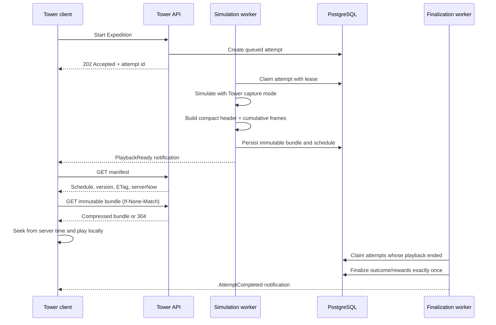

# World Tower combat performance redesign plan

Status: **Implemented in the repository — migration and production rollout pending**

Last updated: 2026-08-13

This plan replaces the delivery model in [world-tower-realtime-combat-plan.md](world-tower-realtime-combat-plan.md). The compact version 2 path is implemented behind `WorldTower:CompactPlaybackEnabled`; version 1 remains readable as a rollout compatibility path.

## Decision summary

World Tower combat remains fully simulated and finalized by the backend, but its playback should become a compact, immutable artifact that the frontend downloads once and plays locally.

The redesign will:

- keep combat outcomes, progression, and rewards server-authoritative;
- stop producing and persisting the generic detailed combat event log for Tower playback;
- send static combatant metadata once instead of repeating it in every frame;
- store only the current combat state and cumulative statistics needed by the Tower combat UI;
- stop reading the complete timeline from PostgreSQL for every due frame;
- stop sending one SignalR message per playback frame;
- allow refresh, reconnect, route changes, and server restarts to recover from an immutable playback bundle and server timestamps;
- finalize rewards once at the scheduled playback end, independently of whether any client is connected;
- explicitly **not** attempt to conceal later frames or the final outcome from a participant who inspects the downloaded bundle.

The client is allowed to know the precomputed result. It is not allowed to decide or change it. Skipping playback, changing a browser clock, editing JavaScript, or calling completion endpoints early must have no effect on authoritative state.

## Problem statement

The observed server reaches roughly 90% CPU across 8 vCores while handling a single World Tower boss fight. The current flow performs substantially more work than the visible Tower combat report requires:

1. The simulation loads and rehydrates participant snapshots.
2. `FastCombatEngine` can execute as many as 6,000 ticks.
3. During simulation, generic combat events and full checkpoints are captured.
4. Entity state, statuses, abilities, events, and statistics are repeatedly scanned, copied, and allocated.
5. The complete `CombatResult`, event history, battle report, and playback timeline are serialized and persisted.
6. During up to ten minutes of playback, a polling worker repeatedly finds due frames.
7. The entire persisted timeline can be loaded for frame release, even though only one current frame is needed.
8. Each frame is serialized for payload-size logging and then serialized again by SignalR.
9. The frontend discards much of that data and uses only current health/barrier state, cumulative entity and ability totals, timing, and the final outcome.

The exact percentage attributable to simulation, snapshot hydration, checkpoint capture, serialization, persistence, and playback dispatch must be measured before optimization claims are treated as proven. However, the architecture currently guarantees redundant allocation, storage, database I/O, serialization, and network work regardless of the final profile.

CPU percentage by itself is also not a sufficient measure. A worker may intentionally use available cores to finish a simulation quickly. The operational problem is the combination of CPU-seconds per fight, allocation/GC pressure, and interference with API latency. The redesign therefore measures all three and optionally isolates simulation from the API host.

## Scope

### In scope

- Tower-specific engine capture and projection.
- Snapshot loading and combat setup for Tower attempts.
- Playback persistence and retrieval.
- SignalR and HTTP delivery for Tower playback.
- Angular playback, refresh, reconnect, and navigation recovery.
- Durable, idempotent attempt finalization.
- Profiling, benchmarks, telemetry, compatibility, and rollout.
- Optional movement of simulation execution from the API process to `Worker.LL` after intrinsic work has been reduced.

### Out of scope

- Concealing future frames or the final outcome from the browser.
- Trusting the browser to complete an attempt, grant rewards, or advance Tower progression.
- Rewriting the shared combat engine solely for World Tower.
- Infrastructure-as-code changes in this repository.
- Applying an EF Core migration to a shared or production database.
- Unrelated combat UI or game-balance changes.

## Current implementation checkpoint

The repository already contains useful hardening that should be retained where it still applies:

- queued, deterministic background simulation;
- a default maximum simulation concurrency of one;
- PostgreSQL leases and heartbeats for safe claiming and retry;
- a `NextFrameDueAt` claim index;
- incremental combat-stat accumulation;
- timeline memory caching and binary search;
- deferred, idempotent reward/progression finalization;
- participant-authorized playback recovery;
- Angular frame deduplication and interpolation.

These changes improve safety and reduce some repeated work, but they do not remove the large generic capture contract, the per-frame dispatcher, or repeated playback delivery. This plan builds on their correctness guarantees while replacing the expensive transport path.

Relevant implementation areas include:

- `LL/src/Infrastructure/Service/Services.LL/WorldTower/WorldTowerService.cs`
- `LL/src/Infrastructure/Service/Services.LL/Combat/Engine/FastCombatEngine.cs`
- `LL/src/Infrastructure/Service/Services.LL/Combat/Engine/CombatEngineExecutor.cs`
- `LL/src/API/API.LL/HostedServices/WorldTowerCombatSimulationWorker.cs`
- `LL/src/API/API.LL/HostedServices/WorldTowerCombatPlaybackWorker.cs`
- `LL/src/Infrastructure/RealTime/RealTime.LL/GameRealtimeBroadcaster.cs`
- `LL/src/Presentation/ll/src/app/core/services/client-side/combat/combat.service.ts`
- `LL/src/Presentation/ll/src/app/core/services/api/world-tower/world-tower.service.ts`
- `LL/src/Presentation/ll/src/app/features/game/world/tower/rally/tower-rally.component.ts`

## Data the Tower frontend actually needs

The new contract should be derived from rendered UI fields, not from the generic combat domain model.

### Static header, sent once

For each participant, Guardian, and summon identity needed during playback:

- stable entity identifier;
- display name;
- side/team;
- level, if displayed;
- maximum health;
- image/presentation key, if the current UI consumes one;
- summon owner/group relationship;
- ordered ability identifiers and display names.

Static metadata must not be repeated in every frame. A summon first created during combat can be declared once in a frame-level `newEntities` collection or predeclared in the header when its identity is deterministic.

### Cumulative playback frame

For each published interval:

- sequence number;
- authoritative combat tick;
- current health and barrier for each active or known entity;
- alive/defeated state only if it cannot be derived from health;
- cumulative per-entity totals displayed by the UI:
  - damage done;
  - damage taken;
  - healing done;
  - healing received;
  - regeneration;
  - barrier generated;
  - damage blocked;
- cumulative per-ability totals displayed by the UI:
  - uses/procs;
  - damage;
  - healing;
  - barrier;
- final-frame marker and outcome when applicable.

The Tower wire model should not contain detailed event descriptions, target snapshots, condition histories, complete ability definitions, or generic statistics that the Tower UI does not render. If a future UI feature needs another field, it should be added deliberately with a payload and CPU cost test.

### Why cumulative frames first

Cumulative frames are slightly larger than pure deltas, but they make playback recovery cheap and robust:

- any frame can be rendered without replaying every earlier event;
- refresh can binary-search directly to the current tick;
- dropped messages are irrelevant because frames are no longer streamed one by one;
- schema and frontend logic remain simple enough for a solo-maintained codebase.

If the compressed bundle remains too large after measurement, version 3 may use periodic cumulative keyframes plus numeric deltas between them. That optimization should not be introduced until version 2 has a measured size problem.

## Target architecture



SignalR becomes an invalidation/notification channel:

- `WorldTowerCombatPlaybackReady`: tells connected participants that the artifact exists;
- `WorldTowerAttemptCompleted`: tells connected participants that authoritative rewards/report state is available;
- normal Expedition refresh events continue as needed.

SignalR does not carry every combat frame. REST remains sufficient if both realtime notifications are missed.

## Proposed persistence and API contract

### Playback metadata

Keep frequently queried attempt/playback metadata separate from the large bundle:

| Field | Purpose |
| --- | --- |
| `TowerAttemptId` | Playback identity and authorization scope |
| `SchemaVersion` | Initially compact contract version 2 |
| `TicksPerSecond` | Converts combat ticks to playback time |
| `TicksPerFrame` | Frame interval used by the artifact |
| `TotalTicks` / `FrameCount` | Bounds and validation |
| `PlaybackStartedAt` / `PlaybackEndsAt` | Authoritative wall-clock schedule |
| `BundleContentType` / `BundleEncoding` | Decoding contract |
| `BundleLength` | Operational size limit and telemetry |
| `BundleHash` | Strong ETag and corruption check |
| `SimulationCompletedAt` | Artifact readiness |
| finalization lease/retry fields | Safe scheduled completion |

Remove the per-frame publication cursor and scheduling fields once the old dispatcher is retired. Ordinary attempt and due-finalization queries must project metadata only and must never materialize the bundle column.

### Immutable bundle

The logical version 2 payload should resemble:

```text
TowerPlaybackBundleV2
  schemaVersion
  ticksPerSecond
  ticksPerFrame
  totalTicks
  entities[]              // static metadata once
  abilities[]             // static metadata once
  frames[]
    sequence
    tick
    newEntities[]?        // only when a summon first appears
    entityState[]         // compact numeric state in stable entity order
    entityTotals[]        // compact cumulative numeric totals
    abilityTotals[]       // compact cumulative numeric totals
    isFinal
    outcome?
```

Use stable array ordering and numeric identifiers so property names and repeated GUID strings do not dominate every frame. Keep DTOs explicit and versioned; do not serialize runtime combat entities directly.

Start with compact JSON plus HTTP/Brotli or gzip response compression because it is easy to diagnose and broadly supported. Measure it against MessagePack before adopting another serialization format. Persist or cache the already serialized bytes so each download does not rebuild the payload.

### Endpoints

`GET /attempts/{attemptId}/playback-manifest`

- participant-authorized;
- returns attempt state, playback schedule, tick/frame rates, bundle URL, schema version, ETag, `serverNow`, and authoritative finalization state;
- remains cheap because it does not select bundle bytes;
- is the source of truth on page entry, reconnect, and route return.

`GET /attempts/{attemptId}/playback-bundle`

- participant-authorized;
- returns immutable compressed bytes;
- supports `ETag`, `If-None-Match`, long-lived private caching, and a deterministic content hash;
- returns the same bytes for the lifetime of the attempt;
- never performs per-frame database reads or projections.

Existing result/report endpoints remain authoritative for persisted completion state. Because outcome concealment is not a requirement, the bundle may include its final frame before `PlaybackEndsAt`; reward/report APIs can still retain their current completion gate to preserve lifecycle semantics.

## Backend redesign

### 1. Establish a profile before changing behavior

Instrument one attempt as a trace with separate timings for:

- snapshot query and materialization;
- snapshot-to-runtime rehydration;
- combat setup and effect compilation;
- engine execution excluding capture;
- checkpoint/capture work;
- statistics aggregation;
- result/report projection;
- bundle serialization and compression;
- database persistence;
- playback/finalization worker work.

Record per attempt:

- CPU time and wall time;
- allocated bytes, Gen 0/1/2 collections, pause time, and peak working set;
- ticks, entities, summons, abilities, emitted engine events, and captured frames;
- snapshot query row count, bytes, duration, and round trips;
- uncompressed/compressed artifact sizes;
- database bytes read during the complete playback period;
- SignalR messages and bytes;
- API p50/p95/p99 latency while simulation is active.

Use `dotnet-counters`, `dotnet-trace`, or an equivalent production-safe profiler in staging against representative release builds. Logging must not serialize payloads merely to estimate their size.

### 2. Fix snapshot hydration

The current participant snapshot graph should be inspected for sibling `Include` Cartesian multiplication. Apply the smallest verified correction:

1. Prefer a purpose-built no-tracking projection containing only combat inputs.
2. Otherwise use `AsSplitQuery()` for the existing include graph.
3. Confirm query count, returned row count, transferred bytes, and materialization time before and after.
4. Cache immutable catalog definitions and compiled static ability/status metadata outside an individual attempt when safe.

Do not cache player snapshot state across attempts unless its immutability and cache invalidation are guaranteed.

### 3. Add a Tower capture mode

Add an explicit `TowerPlayback` capture policy to the shared executor/engine boundary. It should control observation without changing combat rules or random-number consumption.

In this mode:

- do not build the detailed generic combat event log;
- do not format human-readable event descriptions in the hot loop;
- do not clone complete runtime entities, statuses, or ability objects per interval;
- update fixed numeric accumulators at the point where combat effects are resolved;
- capture current health/barrier and the required cumulative counters every `TicksPerFrame`;
- capture the exact final tick even when it is not aligned to the interval;
- project directly into the compact Tower DTO or a similarly compact internal buffer;
- reuse arrays/buffers where profiling shows meaningful allocation wins;
- preserve the non-Tower capture modes and their existing behavior.

The incremental accumulator should use stable entity/ability indexes rather than repeated LINQ scans or dictionary/string lookups in the hot path. Maintain living counts and listener indexes instead of repeatedly rebuilding `Where(...).ToList()` collections when the profile confirms those paths are significant.

Any optimization to status dispatch, target selection, reflection, summons, or collection mutation must have deterministic parity tests. Stalemate detection may shorten pathological 6,000-tick fights, but it is a gameplay-rule change and requires separate validation rather than being treated as a free performance optimization.

### 4. Project only the retained artifacts

At the end of simulation:

- create the compact playback bundle;
- create the compact battle report actually used after completion;
- retain only the minimal authoritative outcome data needed for idempotent finalization and auditing;
- avoid serializing a second full generic `CombatResult` with a detailed event history unless another confirmed consumer requires it;
- serialize and compress the bundle once;
- enforce configurable uncompressed and compressed size limits before persistence;
- persist attempt outcome inputs, report, bundle metadata, bundle bytes, and playback schedule atomically.

If a generic `CombatResult` is still required for an existing endpoint, introduce a Tower result projection without its unused event log instead of persisting the engine object graph.

### 5. Replace frame dispatch with due finalization

Retire the 250 ms frame-release loop after all version 2 clients are available. Replace it with a worker that only:

- claims playback attempts whose `PlaybackEndsAt` has passed;
- uses the existing PostgreSQL lease/retry strategy;
- applies Cinders, first-clear progression, scouting, Echo lockouts, unlocks, and Hall of Fame effects exactly once;
- transitions the attempt to its terminal state;
- queues the existing durable completion event;
- catches up overdue attempts after an API/worker restart.

The finalizer must not load the playback bundle. Its claim query must be supported by an index over terminal state and due time. Polling can be materially slower than 250 ms unless product requirements demand sub-second reward release.

### 6. Remove redundant realtime serialization

`GameRealtimeBroadcaster` must not serialize every envelope at Info level just to calculate payload size before SignalR serializes it again. Use one of:

- transport-level metrics from the actual serialized response;
- a sampled Debug-level measurement;
- the already serialized immutable bundle length for bundle telemetry.

Keep structured identifiers, event type, audience count, and send duration in normal operational logs.

## Frontend playback and recovery

### Initial entry

On every Tower attempt route entry:

1. Fetch the manifest, even if SignalR previously announced readiness.
2. Calculate a server clock offset from `serverNow` and the request timing.
3. Resolve the bundle by attempt id and ETag from the Angular singleton cache.
4. If absent or stale, request the bundle with `If-None-Match`.
5. Calculate the target tick from `PlaybackStartedAt`, adjusted server time, and `TicksPerSecond`.
6. Binary-search the cumulative frames and render the nearest frame at or before that tick.
7. Advance locally using a monotonic clock and interpolate only presentation values.

The browser never posts frame progress and the server never waits for an acknowledgement.

### Refresh and browser restart

- A normal refresh requests the manifest and reuses HTTP cache validation.
- Optionally store immutable bundles in IndexedDB when browser HTTP cache behavior or bundle size makes that worthwhile.
- Key every cache entry by attempt id, schema version, and content hash.
- Never persist mutable reward or completion state in the playback cache.
- If current server time is beyond `PlaybackEndsAt`, immediately render the final frame and refresh authoritative attempt/report state.

### SignalR reconnect

- SignalR is not needed to keep animation moving after the bundle is downloaded.
- On reconnect, refetch the cheap manifest to correct clock offset and finalization state.
- A missed `PlaybackReady` is recovered by the route/status polling already used by Expedition state.
- A missed completion event is recovered by the manifest or normal attempt refresh.

### Route navigation and tab suspension

- Keep the active bundle and decoded indexes in an application-scoped Angular service so back-and-forth route navigation does not redownload or replay from zero.
- On `visibilitychange`, browser wake, route re-entry, or a large timer gap, recompute the target tick from server-adjusted time and seek directly.
- Use `performance.now()` for elapsed local animation after the last clock synchronization; do not rely on incrementing a counter for correctness.
- Never attempt to execute every missed animation frame after a suspended tab resumes.

### Client tampering boundary

A modified client can reveal the last frame immediately because it owns the downloaded artifact. This is accepted by product decision.

A modified client cannot:

- choose the combat seed or submit a result;
- alter the persisted bundle or attempt outcome;
- make `PlaybackEndsAt` arrive earlier on the server;
- finalize an attempt;
- grant rewards, progression, unlocks, scouting, Echo state, or Hall of Fame records;
- read another attempt without participant authorization.

All mutation endpoints must derive identity and attempt state on the server and remain idempotent. No client-provided tick, sequence, outcome, elapsed time, or report is authoritative.

## Delivery phases

### Phase 0 — Baseline and guardrails

- Add stage-level timers, counters, allocation metrics, and artifact/network byte metrics.
- Capture traces for representative floor/roster scenarios and the 6,000-tick worst case.
- Record the effective environment configuration for worker concurrency, lease duration, frame interval, and logging.
- Add a repeatable benchmark harness with fixed seeds.
- Define baseline CPU-seconds, allocations, database bytes, network bytes, and API latency before implementation.

Exit condition: the team can attribute the dominant CPU and allocation costs and reproduce them outside production.

### Phase 1 — Low-risk reductions

- Correct snapshot query multiplication with a projection or split query.
- Remove/scope payload-size double serialization.
- Stop including frame events that the Angular Tower path ignores.
- Avoid persisting a full event-rich `CombatResult` where no consumer needs it.
- Cache immutable compiled catalog/ability/status inputs where safe.
- Ensure playback/finalization metadata queries do not load timeline bytes.

Exit condition: deterministic output is unchanged and the baseline suite shows a measurable CPU/allocation/DB-I/O reduction.

### Phase 2 — Compact Tower capture

- Introduce the versioned Tower capture policy and DTOs.
- Replace event-derived post-processing with numeric hot-path accumulators.
- Capture static metadata once and compact cumulative numeric frames.
- Serialize/compress once and persist an immutable version 2 bundle.
- Add payload size limits, schema validation, hash/ETag generation, and corruption handling.
- Optimize remaining hot-loop scans and allocations in profile order.

Exit condition: fixed-seed Tower outcomes and displayed totals match version 1, with no detailed event log in the Tower artifact.

### Phase 3 — Download-once client playback

- Add manifest and immutable bundle endpoints.
- Add private response caching, ETag handling, and HTTP compression.
- Implement Angular bundle caching, indexed frame lookup, local scheduling, and resynchronization.
- Change SignalR to readiness/completion notifications only.
- Remove frame-range repair and per-frame delivery after compatibility rollout.
- Replace the playback dispatcher with the due-finalization worker.

Exit condition: refresh, reconnect, navigation, tab suspension, and missed SignalR events all recover to the correct current frame without frame streaming.

### Phase 4 — Isolation and scale

- Load-test concurrent Tower attempts alongside normal API traffic.
- If simulation still affects API latency, move the leased simulation worker into the existing `Worker.LL` deployment boundary.
- Keep concurrency bounded and tune it from CPU-seconds, queue delay, host limits, and API SLOs.
- Add admission/back-pressure telemetry for queued simulations.

Moving the worker protects API responsiveness but does not reduce total computation. It belongs after intrinsic engine/capture waste has been removed.

## Verification plan

### Deterministic correctness

For fixed attempt seeds, compare old and new capture modes for:

- outcome and exact terminal tick;
- final health/barrier/alive state for every entity;
- damage, healing, regeneration, barrier, and blocked totals;
- ability use/proc and output totals;
- summons, reflection, damage-over-time, status expiration, and death boundaries;
- Tower rewards and progression inputs.

Capture must not add random-number calls, change ordering, or mutate engine state.

### Contract tests

- Static metadata occurs once.
- Frames contain only version 2 fields.
- Detailed events and descriptions are absent.
- Frames are ordered, unique, and cover tick 0 through the exact final tick.
- Entity/ability indexes are valid across summon creation and death.
- The final cumulative frame matches the authoritative report.
- Unknown schema versions fail clearly.
- ETag is stable for identical bytes and changes when bytes change.
- Bundle size and decompression limits reject pathological artifacts safely.

### Recovery tests

- Refresh at start, middle, final frame, and after scheduled completion.
- Disconnect before readiness and reconnect after readiness.
- Navigate away and back without redownload.
- Resume after a suspended tab has missed several minutes.
- Recover with an empty cache, a valid cache, a stale ETag, and a `304 Not Modified`.
- Restart the API during simulation, playback, and overdue finalization.
- Complete and grant rewards with zero clients connected.
- Retry finalization without duplicate rewards or progression.
- Reject bundle/manifest reads by non-participants.

### Benchmark matrix

Use release builds, fixed seeds, and both cold/warm runs for:

- floors 1–5 initially, followed by every authored Guardian;
- 1, 5, 10, and the maximum supported participants;
- summon-heavy, reflection-heavy, DoT-heavy, barrier-heavy, and sustain-heavy compositions;
- a natural short victory/defeat and a 6,000-tick maximum-duration fight;
- one attempt and the expected concurrent-attempt load;
- API traffic running concurrently with simulation.

Measure:

- wall time and CPU-seconds per attempt;
- CPU time per tick and per emitted effect;
- allocated bytes per tick/frame and GC collections;
- peak working set;
- snapshot query rows, bytes, round trips, and duration;
- persisted and compressed bundle sizes;
- database reads across the playback lifetime;
- HTTP and SignalR message/byte totals;
- API latency and error rate under load;
- queue wait and finalization lag.

### Acceptance gates

The redesign is complete only when:

- one Tower fight no longer creates a detailed event log for playback;
- static entity/ability data is not repeated per frame;
- ordinary status/finalization queries never materialize the bundle;
- playback causes zero per-frame database reads and zero per-frame SignalR sends;
- the bundle is serialized/compressed once per simulation, not once per viewer or frame;
- fixed-seed correctness and displayed statistics match the accepted version 1 baseline;
- completion and rewards occur exactly once with no connected client;
- refresh/reconnect/navigation seek to the correct wall-clock frame;
- API p95 latency remains within the existing service SLO during the agreed concurrent simulation load;
- CPU-seconds, allocations, database bytes, and network bytes show documented improvement against Phase 0.

Set numeric production budgets after Phase 0. Initial engineering targets for the representative worst case are at least a 70% reduction in CPU-seconds, an 80% reduction in allocated bytes, and a 90% reduction in playback-period database/network bytes. These are targets, not assumptions; profile results may require adjusting them with an explicit explanation.

## Rollout and compatibility

1. Introduce a `WorldTower:CompactPlayback` feature flag and schema version 2 writer.
2. Keep version 1 playback readable until all active version 1 attempts have completed or expired.
3. Deploy backend dual-read support before enabling the version 2 Angular client.
4. Enable version 2 for internal/staging attempts and compare deterministic results plus resource metrics.
5. Canary a small share of new attempts.
6. Increase rollout while monitoring CPU-seconds, allocation rate, API latency, bundle failures, and finalization lag.
7. Stop creating version 1 timelines.
8. After the retention window, remove the per-frame dispatcher, frame cursor/range APIs, and version 1 storage fields.

Do not attempt to convert an in-progress version 1 timeline to version 2. Each attempt remains on the schema with which it was created.

## Migration, configuration, and deployment implications

### Database migration

Implementation will likely require an EF Core migration to:

- add compact bundle bytes/content type/encoding/hash/length fields or a replacement playback artifact table;
- add a due-finalization index;
- make version-specific frame dispatch fields nullable or remove them after the compatibility window;
- keep large artifact columns out of hot metadata projections.

Generate the migration only with the implementation phase and never apply it automatically to shared or production databases.

### Configuration

Add or revise validated options for:

- compact playback feature flag;
- schema version;
- ticks per frame;
- maximum uncompressed and compressed bundle sizes;
- serialized bundle cache size and retention;
- finalizer poll interval, batch size, lease duration, and retry policy;
- simulation concurrency and queue/back-pressure thresholds;
- telemetry sampling for expensive payload measurements.

Retire per-frame dispatcher polling/range settings after version 1 compatibility ends.

### HTTP and proxy behavior

- Enable Brotli/gzip for the bundle content type at the ASP.NET Core and/or reverse-proxy boundary.
- Verify proxies preserve `ETag`, `If-None-Match`, `Content-Encoding`, and private cache headers.
- Ensure response buffering does not create a second large copy unnecessarily.
- Apply request authorization before returning cacheable bytes; never use a shared public cache for participant artifacts.

### Deployment topology

The compact capture and download-once path can ship without changing topology. Moving simulation to a separate worker requires changes in the separate infrastructure-as-code repository and coordinated deployment configuration; those changes must not be made here.

## Recommended implementation order

1. Baseline profiler and repeatable benchmarks.
2. Snapshot query and redundant serialization fixes.
3. Version 2 contracts and deterministic capture tests.
4. Compact accumulator/capture implementation.
5. Persistence migration and immutable bundle endpoints.
6. Angular local playback and recovery behavior.
7. Due-finalization worker and notification-only SignalR.
8. Compatibility rollout and removal of version 1 dispatch.
9. Concurrent load testing and, only if still needed, worker-process isolation.

This order produces useful reductions early, preserves deterministic correctness at each boundary, and avoids coupling the engine optimization, frontend cutover, and worker-topology change into one risky release.
