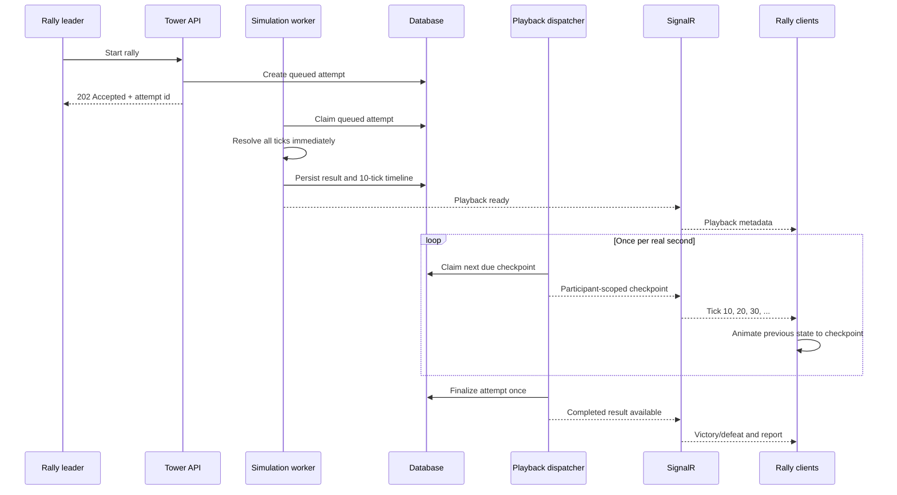

# World Tower real-time combat playback plan

Status: **Partially implemented — durable end-to-end playback is shipped locally**

Last updated: 2026-08-12

## Implementation checkpoint

Implemented in the repository:

- reusable combat checkpoints at tick 0, every 10 ticks, and the exact final tick;
- deterministic parity coverage for checkpointed and non-checkpointed execution;
- one-to-one persisted `TowerCombatPlayback` timelines and EF Core migration;
- `Playback` attempt state and final result/report authorization gates;
- participant-authorized current-snapshot recovery API;
- a 250 ms hosted dispatcher that releases the newest due frame;
- participant-character-group SignalR publication and client sequence deduplication;
- deferred reward, progression, scouting, Echo, and Hall finalization at the playback deadline;
- incremental updates through the existing shared combat viewer.

Still outstanding before this design is fully shipped:

- a separately leased simulation queue (simulation currently completes within the start request, while playback remains asynchronous);
- PostgreSQL multi-instance dispatcher leases/`SKIP LOCKED` hardening;
- bounded reconnect frame ranges, visible reconnect status, and smooth one-second interpolation;
- richer status/condition and recent-event presentation;
- playback size limits, retention cleanup, metrics, load tests, and a rollout feature flag;
- fake-clock component/browser coverage for a full 6,000-tick battle.

## Goal

World Tower combat should still be calculated quickly and authoritatively by the backend, but rally members should experience it at the engine's real-time rate:

- the combat engine runs at 10 ticks per simulated second;
- the backend captures one authoritative checkpoint every 10 ticks and a final checkpoint when combat ends;
- a 6,000-tick battle therefore plays for 600 seconds, or 10 minutes;
- each rally participant receives the current checkpoint through authenticated SignalR;
- the frontend animates between checkpoints and updates health, barriers, deaths, events, and performance totals;
- refreshes, reconnects, API restarts, and duplicate messages do not lose or corrupt playback;
- rewards, progression, Hall of Fame creation, and the final report are not revealed or applied until playback reaches its final checkpoint.

## Recommended architecture

The backend should precompute and persist the entire deterministic fight, then release its checkpoints according to wall-clock time. It should **not** hold the start HTTP request open for up to ten minutes, slow the combat engine with delays, or send all checkpoints to SignalR in one burst.

The persisted timeline is the source of truth. SignalR is a low-latency delivery channel, not the only copy of playback state.

## Data and protocol

### Engine checkpoint

Add an optional checkpoint observer to the existing combat engine/executor instead of creating a Tower-only combat engine. It should capture at tick 0, every 10 ticks, and the exact final tick when the fight ends between intervals.

Each checkpoint should contain:

- sequence number and authoritative tick;
- all current combatants, including summons;
- team, health, maximum health, barrier, and alive state;
- active conditions/statuses needed by the viewer;
- combat events generated since the preceding checkpoint;
- compact per-character and per-ability stat deltas for the interval;
- a final-frame marker and outcome only on the final checkpoint.

The engine must behave identically with checkpoint capture enabled or disabled. The same random seed must produce the same outcome, event log, duration, and final statistics.

### Persisted playback

Add a one-to-one `TowerCombatPlayback` dependent for `TowerAttempt`. Keeping the large timeline outside `TowerAttempt` prevents ordinary rally queries from loading it.

Recommended fields:

| Field                                  | Purpose                                                                   |
| -------------------------------------- | ------------------------------------------------------------------------- |
| `TowerAttemptId`                       | Primary key and attempt foreign key                                       |
| `SchemaVersion`                        | Allows the serialized frame contract to evolve                            |
| `TicksPerFrame`                        | Initially 10                                                              |
| `TotalTicks` / `FrameCount`            | Playback bounds                                                           |
| `TimelineJson`                         | Ordered compact checkpoints; PostgreSQL `jsonb`/TOAST handles compression |
| `SimulationCompletedAt`                | Indicates that the authoritative timeline exists                          |
| `PlaybackStartedAt` / `PlaybackEndsAt` | Wall-clock schedule                                                       |
| `LastPublishedSequence`                | At-least-once dispatch cursor                                             |
| `LeaseOwner` / `LeaseUntil`            | Safe multi-instance worker claiming                                       |

Keep the existing `CombatResultJson` and `BattleReportJson` as the authoritative final artifacts. Their APIs must not expose the result before playback completes.

Extend attempt lifecycle semantics without changing existing enum numeric meanings:

1. `Started`: queued or being simulated.
2. New `Playback`: timeline exists and is being released.
3. Existing `Succeeded`, `Failed`, or `Errored`: terminal states.

This requires an EF Core migration, but no redundant participant, snapshot, report, or combat-result model.

### Realtime contracts

Add two participant-scoped contracts:

- `WorldTowerCombatPlaybackReady`: attempt/rally identifiers, playback start, ticks per second, frame interval, and initial state.
- `WorldTowerCombatFrameUpdated`: attempt/rally identifiers, sequence, tick, scheduled time, state, interval events/stat deltas, and final marker.

Extend `Audience` with a multi-character audience and publish to the existing authenticated character groups. Do not broadcast combat frames to the world group.

Messages are at-least-once. Clients deduplicate by `(attemptId, sequence)` and ignore regressions.

## Backend work

### 1. Add reusable combat checkpoint capture

- Introduce a neutral `CombatCheckpoint` contract beside the existing combat runtime models.
- Extend `FastCombatEngine.Run` and `CombatEngineExecutor` with an optional interval/observer.
- Snapshot runtime state after each completed 10-tick interval.
- Capture the final state even when duration is not divisible by 10.
- Keep checkpointing disabled for idle combat, diagnostics, and power simulations unless explicitly requested.
- Add deterministic parity and boundary tests at 0, 1, 10, 11, and 6,000 ticks.

### 2. Make Tower start asynchronous

- Change `POST /rallies/{id}/start` to create the attempt and return `202 Accepted` with playback metadata instead of returning the final outcome.
- Keep the existing floor and rally locks around attempt creation only.
- Add a simulation worker that claims `Started` attempts with PostgreSQL-safe leasing/`SKIP LOCKED` behavior.
- Reuse the current snapshot rehydration, preparation modifiers, Guardian creation, combat executor, and result factory.
- Use a deterministic seed derived from the attempt identifier so a crash can safely retry simulation.
- Persist timeline, final combat result, and report atomically, then move the attempt to `Playback`.

### 3. Add paced playback dispatch

- Add a hosted dispatcher polling at approximately 250 milliseconds.
- Derive the due frame from `PlaybackStartedAt + tick / 10 seconds`.
- Publish at most the newest due frame after downtime instead of flooding every missed frame.
- Claim attempts safely across multiple API instances.
- Send through `IGameRealtimeBroadcaster` to every roster character group.
- Update `LastPublishedSequence` after sending; duplicate delivery is acceptable and client-deduplicated.
- Do not create 600 retained outbox rows per fight. The persisted timeline provides durability, while SignalR delivery remains recoverable through REST.

### 4. Finalize only at the real-time end

- At the final scheduled checkpoint, run the existing outcome transaction exactly once.
- Apply Cinders, first-clear progression, scouting, Echo lockouts, unlock keys, and Hall of Fame creation at this point.
- Guard finalization with attempt status plus the existing floor lock so retries cannot grant twice.
- Queue the existing durable rally-completed outbox event after finalization.
- If simulation fails, mark the attempt errored immediately. If playback dispatch fails temporarily, retain `Playback` and resume.

### 5. Add recovery APIs

Add participant-authorized endpoints:

- `GET /attempts/{attemptId}/playback` returns metadata, current wall-clock sequence, the current authoritative snapshot, and terminal state.
- `GET /attempts/{attemptId}/playback/frames?after={sequence}` optionally returns a bounded range for short reconnect gaps.
- Keep `GET /attempts/{attemptId}/combat-result` unavailable until terminal completion.

The current snapshot endpoint should calculate where playback ought to be from server time, so reconnect does not depend on the last successfully broadcast frame.

## Frontend work

### 1. Introduce incremental Tower playback state

- Add a `TowerCombatPlaybackService` rather than forcing partial frames into `CombatResultDto`.
- Store attempt id, last sequence, server clock offset, combatants, interval events, accumulated statistics, and connection state.
- Consume realtime events through an observable stream that preserves every message; the current single-value event signal is unsuitable for a sequence of rapid updates.
- Deduplicate and order frames by sequence.

### 2. Render and pace the battle

- Reuse the shared combat shell, combatant cards, stat panels, and final result viewer.
- Add an incremental/live input mode to those components instead of duplicating their markup.
- Animate health and barrier values from the previous frame to the new frame over one second.
- Display simulated elapsed time from authoritative tick (`tick / 10`), not an independently incremented local counter.
- Show recent abilities, damage, healing, deaths, summons, and conditions from each interval.
- Update cumulative character/ability totals from server-provided deltas.
- Correct minor timer drift against `PlaybackStartedAt`; never run ahead of the newest authoritative frame.

### 3. Handle lifecycle and reconnects

- All rally members enter the live view when the ready event arrives or rally REST state reports `Playback`.
- On refresh/reconnect, request the current playback snapshot and jump to the correct live point.
- Show `Reconnecting…` while retaining the last frame; avoid falsely continuing local combat.
- When the final frame arrives, transition to the existing detailed result and compact Tower report.
- After completion, retain **Replay from beginning** as a separate enhancement using the same stored timeline.

## Verification plan

### Combat engine

- Checkpoint capture never changes deterministic combat output.
- Frames are strictly ordered, unique, and exactly 10 ticks apart except the final partial interval.
- Health/barrier/event/stat state in the final checkpoint matches `CombatResult`.
- Summons, deaths, healing, barriers, damage-over-time, and status expiry cross checkpoint boundaries correctly.

### Tower orchestration

- Start returns before playback duration elapses and creates only one attempt.
- Multiple workers cannot simulate, publish, or finalize an attempt twice.
- A 6,000-tick result schedules exactly 600 seconds of playback.
- Rewards and progression are absent before the final frame and applied once afterward.
- Restart during simulation retries deterministically; restart during playback resumes at the current wall-clock frame.
- Non-participants cannot read or subscribe to attempt playback.

### SignalR and client

- Frames target all and only rally participant character groups.
- Duplicate/out-of-order frames are harmless.
- Disconnect/reconnect and page refresh recover the current state.
- Client timers do not drift more than one frame and never expose the final outcome early.
- Component tests cover health interpolation, stat accumulation, deaths, final transition, and a full 6,000-tick virtual-clock playback without waiting ten real minutes.
- Browser coverage uses fake time to verify start, multi-client viewing, reconnect, and completion.

## Operational safeguards

- Add options for ticks per frame, dispatcher polling interval, maximum concurrent simulations, playback retention, and maximum timeline size; validate them at startup.
- Record metrics for queued simulations, simulation duration, active playbacks, frame payload bytes, dispatch lag, reconnect recovery, and finalization failures.
- Put a hard serialized-size limit on timelines and log oversized frames.
- Retain completed timelines for a defined replay period, then clean them without deleting the attempt report.
- Load-test 15-player, 6,000-tick fights and concurrent rallies before production enablement.
- Roll out behind a `WorldTowerRealtimeCombat` feature flag; retain the current immediate-result path as a temporary fallback during rollout.

## Delivery order

1. Engine checkpoints and parity tests.
2. Playback entity, EF migration, contracts, and authorization queries.
3. Asynchronous simulation worker and idempotent finalization split.
4. Participant-scoped SignalR events and paced dispatcher.
5. Incremental frontend state and live combat UI.
6. Reconnect/restart recovery and virtual-clock browser tests.
7. Metrics, retention cleanup, load testing, and feature-flag rollout.

The feature should move from **Not implemented** to **Partial** after the persisted simulation and basic live viewer work end to end. It should move to **Shipped** only after reconnect/restart recovery, idempotent finalization, participant authorization, and the 6,000-tick virtual-clock test all pass.
